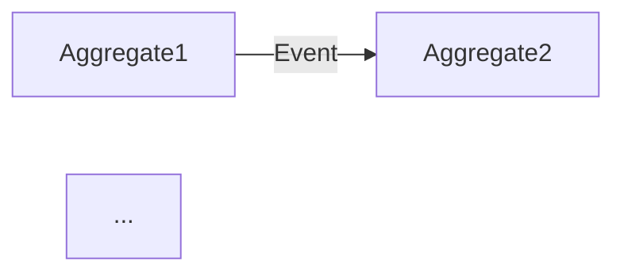

# 프로젝트 스펙 템플릿

`00-project-spec.md` 문서를 생성할 때 이 구조를 따릅니다.

---

## 문서 구조

```markdown
# {프로젝트 이름} — 프로젝트 요구사항 명세

## 1. 프로젝트 개요

### 배경
{해결하려는 비즈니스 문제}

### 목표
{프로젝트가 달성해야 할 것}

### 대상 사용자
| 페르소나 | 역할 | 핵심 목표 |
|---------|------|-----------|
| ... | ... | ... |

### 성공 지표 (KPI)

| 지표 유형 | 지표 | 목표치 | 측정 방법 |
|-----------|------|--------|-----------|
| 선행 (Leading) | 일일 활성 사용자 | ... | ... |
| 후행 (Lagging) | 월간 매출 | ... | ... |

### 기술 제약 조건
- .NET 10 / C# 14
- Functorium 프레임워크
- {기타 제약}

---

## 2. Non-Goals (하지 않을 것)

이 프로젝트에서 **명시적으로 제외**하는 범위:

- {제외 기능/범위 1} — {제외 이유}
- {제외 기능/범위 2} — {제외 이유}
- {제외 기능/범위 3} — {제외 이유}

---

## 3. 유비쿼터스 언어

| 한글 | 영문 | 정의 |
|------|------|------|
| ... | ... | ... |

---

## 4. 사용자 스토리

### {페르소나 1}

| ID | 스토리 | 우선순위 |
|----|--------|---------|
| US-001 | {페르소나}로서, {행동}하고 싶다, {가치}를 얻기 위해. | P0 |
| US-002 | ... | P1 |

### {페르소나 2}

| ID | 스토리 | 우선순위 |
|----|--------|---------|
| US-003 | ... | P0 |

---

## 5. Aggregate 후보

| Aggregate | 핵심 책임 | 상태 전이 | 주요 이벤트 |
|-----------|----------|-----------|------------|
| ... | ... | ... → ... | ...Event |

### Aggregate 관계도



---

## 6. 비즈니스 규칙

### {Aggregate1} 규칙
1. {규칙 설명}
2. {규칙 설명}

### {Aggregate2} 규칙
1. {규칙 설명}

### 교차 규칙
1. {여러 Aggregate에 걸친 규칙}

---

## 7. 유스케이스 + 수락 기준

### Commands (쓰기)

| 유스케이스 | 입력 | 핵심 로직 | 출력 | 우선순위 |
|-----------|------|----------|------|---------|
| ... | ... | ... | ... | P0 |

#### {유스케이스명} 수락 기준

**정상 시나리오:**
```
Given: {사전 조건}
When:  {사용자 행동}
Then:  {기대 결과}
```

**거부 시나리오:**
```
Given: {사전 조건}
When:  {무효한 행동}
Then:  {에러 결과}
```

### Queries (읽기)

| 유스케이스 | 입력 | 조회 전략 | 출력 | 우선순위 |
|-----------|------|----------|------|---------|
| ... | ... | ... | ... | P0 |

### Event Handlers (반응)

| 트리거 이벤트 | 동작 | 우선순위 |
|-------------|------|---------|
| ... | ... | P0 |

---

## 8. 금지 상태

| 금지 상태 | 방지 전략 | Functorium 패턴 |
|-----------|----------|----------------|
| {무효한 상태 설명} | {구조적 제거 또는 런타임 검증} | {UnionValueObject / guard / ...} |

---

## 9. 우선순위 요약

| 우선순위 | 기준 | 유스케이스 수 | 비고 |
|---------|------|-------------|------|
| **P0** (필수) | 없으면 출시 불가 | N개 | MVP 범위 |
| **P1** (중요) | 없으면 경쟁력 약화 | N개 | Phase 2 |
| **P2** (선택) | 있으면 차별화 | N개 | 후순위 |

---

## 10. 타임라인

| 마일스톤 | 범위 | 목표일 | 의존성 |
|---------|------|--------|--------|
| Phase 1 (MVP) | P0 유스케이스 | ... | ... |
| Phase 2 | P0 + P1 | ... | Phase 1 완료 |
| Phase 3 | 전체 | ... | Phase 2 완료 |

---

## 11. Open Questions

| ID | 질문 | 카테고리 | 차단 여부 | 담당 |
|----|------|---------|----------|------|
| Q-001 | {미결정 사항} | engineering | 차단 | ... |
| Q-002 | {미결정 사항} | product | 비차단 | ... |
| Q-003 | {미결정 사항} | design | 비차단 | ... |
| Q-004 | {미결정 사항} | legal | 차단 | ... |

---

## 12. 다음 단계

1. **architecture-design** — 프로젝트 구조 + 인프라 설계
2. **domain-develop** — 각 Aggregate 상세 설계 + 구현
3. **application-develop** — 유스케이스 구현
4. **adapter-develop** — 영속성 + API 구현
5. **test-develop** — 테스트 작성
```

---

## 예시: AI 모델 거버넌스 프로젝트

`Docs.Site/src/content/docs/samples/ai-model-governance/` 참조:

- **Aggregate 4개:** AIModel, ModelDeployment, ComplianceAssessment, ModelIncident
- **상태 전이:** Draft → PendingReview → Active → Quarantined → Decommissioned
- **교차 규칙:** Critical 인시던트 → Active 배포 자동 격리
- **금지 상태:** Unacceptable 리스크 등급 모델의 배포 (구조적 금지)
- **Non-Goals 예시:** 모델 학습 파이프라인, A/B 테스트 플랫폼
- **P0 유스케이스:** RegisterModel, CreateDeployment, ReportIncident, InitiateAssessment

## 예시: E-Commerce 프로젝트

`Docs.Site/src/content/docs/samples/ecommerce-ddd/` 참조:

- **Aggregate 5개:** Customer, Product, Order, Inventory, Tag
- **상태 전이:** Pending → Confirmed → Shipped → Delivered | Cancelled
- **교차 규칙:** 주문 총액이 고객 신용 한도 초과 불가 (OrderCreditCheckService)
- **이벤트 조율:** Order.CancelledEvent → RestoreInventoryOnOrderCancelledHandler
- **사용자 스토리 예시:** "구매자로서, 상품을 주문하고 싶다, 빠르게 배송받기 위해."
- **수락 기준 예시:**
  ```
  Given: 재고가 있는 상품이 존재
  When:  구매자가 주문을 생성
  Then:  주문이 Pending 상태로 생성되고 재고가 차감됨
  ```
