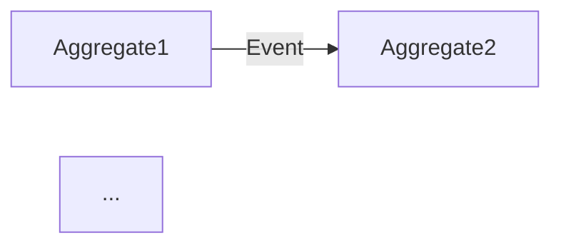

# 프로젝트 스펙 템플릿

`00-project-spec.md` 문서를 생성할 때 이 구조를 따릅니다.

---

## 문서 구조

```markdown
# {프로젝트 이름} — 프로젝트 요구사항 명세

## 1. 프로젝트 개요

### 배경
{해결하려는 비즈니스 문제}

### 목표
{프로젝트가 달성해야 할 것}

### 대상 사용자
| 페르소나 | 역할 | 핵심 목표 |
|---------|------|-----------|
| ... | ... | ... |

### 성공 지표 (KPI)
- ...

### 기술 제약 조건
- .NET 10 / C# 14
- Functorium 프레임워크
- {기타 제약}

---

## 2. 유비쿼터스 언어

| 한글 | 영문 | 정의 |
|------|------|------|
| ... | ... | ... |

---

## 3. Aggregate 후보

| Aggregate | 핵심 책임 | 상태 전이 | 주요 이벤트 |
|-----------|----------|-----------|------------|
| ... | ... | ... → ... | ...Event |

### Aggregate 관계도



---

## 4. 비즈니스 규칙

### {Aggregate1} 규칙
1. {규칙 설명}
2. {규칙 설명}

### {Aggregate2} 규칙
1. {규칙 설명}

### 교차 규칙
1. {여러 Aggregate에 걸친 규칙}

---

## 5. 유스케이스 개요

### Commands (쓰기)
| 유스케이스 | 입력 | 핵심 로직 | 출력 |
|-----------|------|----------|------|
| ... | ... | ... | ... |

### Queries (읽기)
| 유스케이스 | 입력 | 조회 전략 | 출력 |
|-----------|------|----------|------|
| ... | ... | ... | ... |

### Event Handlers (반응)
| 트리거 이벤트 | 동작 |
|-------------|------|
| ... | ... |

---

## 6. 금지 상태

| 금지 상태 | 방지 전략 | Functorium 패턴 |
|-----------|----------|----------------|
| {무효한 상태 설명} | {구조적 제거 또는 런타임 검증} | {UnionValueObject / guard / ...} |

---

## 7. MVP 범위

### 포함 (Phase 1)
- {핵심 기능 목록}

### 제외 (Phase 2+)
- {후순위 기능 목록}

---

## 8. 다음 단계

1. **architecture-design** — 프로젝트 구조 + 인프라 설계
2. **domain-develop** — 각 Aggregate 상세 설계 + 구현
3. **application-develop** — 유스케이스 구현
4. **adapter-develop** — 영속성 + API 구현
5. **test-develop** — 테스트 작성
```

---

## 예시: AI 모델 거버넌스 프로젝트

`Docs.Site/src/content/docs/samples/ai-model-governance/` 참조:

- **Aggregate 4개:** AIModel, ModelDeployment, ComplianceAssessment, ModelIncident
- **상태 전이:** Draft → PendingReview → Active → Quarantined → Decommissioned
- **교차 규칙:** Critical 인시던트 → Active 배포 자동 격리
- **금지 상태:** Unacceptable 리스크 등급 모델의 배포 (구조적 금지)

## 예시: E-Commerce 프로젝트

`Docs.Site/src/content/docs/samples/ecommerce-ddd/` 참조:

- **Aggregate 5개:** Customer, Product, Order, Inventory, Tag
- **상태 전이:** Pending → Confirmed → Shipped → Delivered | Cancelled
- **교차 규칙:** 주문 총액이 고객 신용 한도 초과 불가 (OrderCreditCheckService)
- **이벤트 조율:** Order.CancelledEvent → RestoreInventoryOnOrderCancelledHandler
