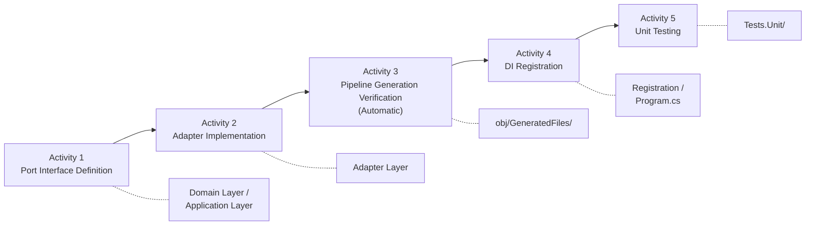
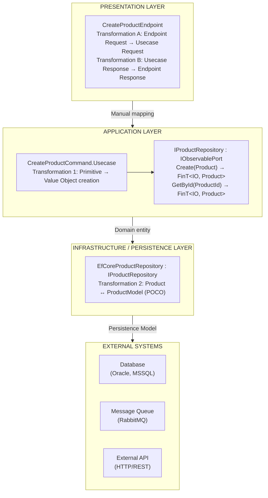

This document is a guide covering the design principles of Port architecture and how to define Port interfaces in the Functorium framework.
For Adapter implementation, Pipeline creation, DI registration, and testing, please refer to separate documents.

## Introduction

"What problems arise when the Application Layer directly depends on databases or external APIs?"
"Why is the Repository interface placed in the Domain Layer and the External API interface in the Application Layer?"
"What are the benefits of unifying Port method return types to `FinT<IO, T>`?"

A Port is a contract for the application to communicate with the external world. This document covers Port architecture design principles, interface definition patterns by type, and Request/Response design.

### What You Will Learn

Through this document, you will learn:

1. **Necessity of Port-Adapter Architecture** — External dependency isolation and testability
2. **IObservablePort Interface Hierarchy** — The hierarchical structure underlying all Adapters
3. **Port Definition Patterns by Type** — Repository, External API, Messaging, Query Adapter
4. **Port Request/Response Design** — Principles for defining sealed records inside interfaces
5. **Repository Interface Design** — IRepository basic CRUD and domain-specific methods

### Prerequisites

A basic understanding of the following concepts is required to understand this document:

- [Domain Modeling Overview](../domain/04-ddd-tactical-overview) — Entity and Aggregate Root concepts
- [Entity/Aggregate Core Patterns](../domain/06b-entity-aggregate-core) — AggregateRoot base class
- [Error System: Basics and Naming](../domain/08a-error-system) — `Fin<T>` and `FinT<IO, T>` return patterns

> **Ports declare "what is needed" and Adapters implement "how to provide it."** This separation is the foundation of domain purity, testability, and technology replacement flexibility.

## Summary

### Key Commands

```csharp
// Port interface definition (inherits IObservablePort)
public interface IProductRepository : IRepository<Product, ProductId>
{
    FinT<IO, bool> Exists(Specification<Product> spec);
}

// External API Port definition
public interface IExternalPricingService : IObservablePort
{
    FinT<IO, Money> GetPriceAsync(string productCode, CancellationToken ct);
}

// Query Adapter Port definition
public interface IProductQuery : IQueryPort<Product, ProductSummaryDto> { }
```

### Key Procedures

1. Determine Port type (Repository / External API / Messaging / Query Adapter)
2. Determine location (Repository → Domain Layer, others → Application Layer)
3. Inherit from `IObservablePort` or a derived interface
4. Define return type as `FinT<IO, T>`
5. Use domain Value Objects (VO) for parameters
6. If Request/Response is needed, define as `sealed record` inside the interface

### Key Concepts

| Concept | Description |
|------|------|
| Port | A contract (interface) for the Application Layer to communicate with external systems |
| Adapter | An implementation of a Port interface |
| `IObservablePort` | The base interface that all Adapters implement (provides `RequestCategory` property) |
| `IRepository<T, TId>` | Common interface for per-Aggregate-Root Repository (provides basic CRUD) |
| `IQueryPort<TEntity, TDto>` | Generic interface for read-only queries (returns DTOs directly) |
| `FinT<IO, T>` | Functional return type (asynchronous operation + error handling composition) |
| Driving Adapter | Calls the application from outside (Presentation, Mediator acts as Port) |
| Driven Adapter | The application calls the outside (Persistence, Infrastructure) |

---

## Why Port-Adapter Architecture

### Role of Anti-Corruption Layer in DDD

The domain model must be protected from the technical details of external systems. Port-Adapter Architecture (Hexagonal Architecture) provides a clear boundary between the domain and the external world.

### Protecting Domain Purity: Isolating External Dependencies

Comparing before and after adopting the Port-Adapter pattern makes the difference clear.

| Problem | Without Port-Adapter | With Port-Adapter |
|------|------------------|------------------|
| Dependency direction | Application → Infrastructure | Application → Port (interface) ← Adapter |
| Testing | DB/API connection required | Can be replaced with Mock |
| Technology replacement | Requires full modification | Replace only the Adapter |
| Observability | Manual logging/tracing | Pipeline auto-generation |

### Relationship with Hexagonal Architecture

Functorium's Adapter system implements the Port and Adapter concepts of Hexagonal Architecture:
- **Port** = The interface that the domain/application requires (`IProductRepository`, `IExternalPricingService`)
- **Adapter** = The implementation of a Port (`InMemoryProductRepository`, `ExternalPricingApiService`)
- **Pipeline** = An observability wrapper automatically generated by the Source Generator

#### Driving vs Driven Adapter Distinction

In Hexagonal Architecture, Adapters are divided into two types based on call direction.

| Category | Driving (Primary) | Driven (Secondary) |
|------|-------------------|---------------------|
| **Role** | Calls the application from outside | The application calls the outside |
| **Direction** | Outside → Inside | Inside → Outside |
| **Port location** | None (Mediator substitutes) | Domain or Application Layer |
| **Functorium mapping** | `Adapters.Presentation` | `Adapters.Persistence`, `Adapters.Infrastructure` |

#### Why the Presentation Adapter Has No Port

The Presentation, being a Driving Adapter, calls the Mediator directly without a separate Port interface. The rationale behind this design decision:

1. **Mediator substitutes for the Port** — `IMediator.Send()` acts as the contract between Presentation and Application
2. **Command/Query already serve as contracts** — The Request/Response types themselves serve as explicit interface roles
3. **Elimination of unnecessary indirection** — Introducing a Port for a Driving Adapter would create an abstraction that duplicates the Mediator
4. **The asymmetry with Driven Adapters is intentional** — Driven Adapters frequently need implementation replacement so a Port is required, while Driving Adapters rarely have replacement scenarios

```csharp
// Driving Adapter: Calls Mediator directly without a Port
public class CreateProductEndpoint : EndpointBase
{
    public override void Configure(RouteGroupBuilder group) =>
        group.MapPost("/products", HandleAsync);

    private Task<IResult> HandleAsync(
        IMediator mediator,               // ← Mediator acts as the Port
        CreateProductRequest request) =>
        mediator.Send(new CreateProduct.Command(request.Name, request.Price))
                .ToApiResultAsync();
}

// Driven Adapter: Implements Port (interface)
public interface IProductRepository : IObservablePort  // ← Port
{
    FinT<IO, Product> FindById(ProductId id);
}
```

Now that we understand the necessity of Port-Adapter architecture, let's examine the specific structure of the Adapter system provided by Functorium.

---

## Overview

Adapters are responsible for **the boundary between the Application Layer and external systems** in Clean Architecture. They encapsulate **infrastructure concerns** such as "database access", "message queues", and "external API calls".

### Why Use the Adapter Pattern?

Without Adapters, the following problems arise. The key point is that infrastructure code and observability code become mixed into business logic.

```csharp
// Problem 1: Application Layer directly depends on Infrastructure
public class CreateOrderUsecase
{
    private readonly DbContext _dbContext;  // Direct dependency on EF Core

    public async Task Handle(CreateOrderCommand command)
    {
        _dbContext.Orders.Add(order);  // Infrastructure code leaks into Application
        await _dbContext.SaveChangesAsync();
    }
}

// Problem 2: Observability code scattered throughout business logic
public async Task<Product> GetProductAsync(Guid id)
{
    using var activity = ActivitySource.StartActivity("GetProduct");  // Tracing
    _logger.LogInformation("Getting product {Id}", id);  // Logging
    var stopwatch = Stopwatch.StartNew();  // Metrics

    var product = await _repository.FindAsync(id);  // Actual logic

    stopwatch.Stop();
    _metrics.RecordDuration(stopwatch.Elapsed);  // Metrics
    return product;
}

// Problem 3: Difficult to test
// Using DbContext directly makes mocking impossible in unit tests
```

The Adapter pattern solves these problems:

```csharp
// Solution: Abstraction via Port interface
public interface IProductRepository : IObservablePort
{
    FinT<IO, Product> GetById(Guid id);
}

// Application Layer depends only on interfaces
public class GetProductUsecase(IProductRepository repository)
{
    public async ValueTask<FinResponse<Response>> Handle(Request request)
    {
        return await repository.GetById(request.Id)
            .Run().RunAsync()
            .ToFinResponse();
    }
}

// Implementation in Infrastructure Layer + automatic observability
[GenerateObservablePort]  // Auto-generates logging, tracing, metrics
public class InMemoryProductRepository : IProductRepository
{
    public string RequestCategory => "Repository";

    public virtual FinT<IO, Product> GetById(Guid id)
    {
        // Write only pure business logic
        return IO.lift(() =>
            _products.TryGetValue(id, out var product)
                ? Fin.Succ(product)
                : Fin.Fail<Product>(Error.New($"Product not found: {id}")));
    }
}
```

#### `[ObservablePortIgnore]` — Excluding Methods

To exclude specific methods from Pipeline wrapper generation in a class with `[GenerateObservablePort]` applied, use the `[ObservablePortIgnore]` attribute.

**Location**: `Functorium.Adapters.SourceGenerators.ObservablePortIgnoreAttribute`

```csharp
[GenerateObservablePort]
public class InMemoryProductRepository : IProductRepository
{
    public string RequestCategory => "Repository";

    public virtual FinT<IO, Product> GetById(ProductId id) { ... }  // Wrapped by Pipeline

    [ObservablePortIgnore]
    public virtual FinT<IO, Unit> InternalCleanup() { ... }  // Excluded from Pipeline
}
```

- The Source Generator will not generate an `override` wrapper for this method.
- The method will not have logging, metrics, or tracing recorded.
- Use this for internal utility methods or methods that do not need Observability.

### Core Characteristics

| Characteristics | Description |
|------|------|
| **Port-Adapter Pattern** | Application Layer knows only the Port (interface), Infrastructure Layer implements the Adapter |
| **Functional Return Type** | Composes asynchronous operation and error handling functionally with `FinT<IO, T>` |
| **Automatic Observability** | Auto-generates logging, tracing, metrics via the `[GenerateObservablePort]` attribute |
| **Testability** | Easily create Mock objects based on interfaces |

### Adapter Types

The four Adapter types supported by Functorium and their respective roles are summarized below.

| Type | Purpose | RequestCategory | Hexagonal Role | Example |
|------|------|-----------------|---------------|------|
| **Repository** | Data persistence | `"Repository"` | Driven | `IProductRepository`, `IOrderRepository` |
| **Messaging** | Message queue/events | `"Messaging"` | Driven | `IOrderMessaging`, `IInventoryMessaging` |
| **External API** | External service calls | `"ExternalApi"` | Driven | `IPaymentApiService`, `IWeatherApiService` |
| **Query Adapter** | Read-only queries (returns DTOs directly) | `"QueryAdapter"` | Driven | `IProductQuery`, `IInventoryQuery`, `IProductWithStockQuery` (JOIN) |

### Implementation Lifecycle Overview

Adapter implementation consists of 5 activities.



### Layer/Project Ownership by Step

| Activity | Task | Owning Layer | Project Example |
|----------|------|-------------|---------------|
| 1 | Port Interface Definition | Domain / Application | `LayeredArch.Domain`, `LayeredArch.Application` |
| 2 | Adapter Implementation | Adapter | `LayeredArch.Adapters.Persistence`, `LayeredArch.Adapters.Infrastructure` |
| 3 | Pipeline Generation Verification | (Auto-generated) | `obj/GeneratedFiles/` |
| 4 | DI Registration | Adapter / Host | `{Project}.Adapters.{Layer}`, `LayeredArch` |
| 5 | Unit Testing | Test | `{Project}.Tests.Unit` |

Now that we understand Adapter types and their lifecycle, let's examine the `IObservablePort` interface and its hierarchy that underlie all Adapters.

---

## IObservablePort Interface

The base interface that all Adapters must implement.

**Location**: `Functorium.Abstractions.Observabilities.IObservablePort`

```csharp
public interface IObservablePort
{
    /// <summary>
    /// Request category used in observability logs
    /// </summary>
    string RequestCategory { get; }
}
```

### Interface Hierarchy

Functorium provides an interface hierarchy for Adapter implementation.

```
IObservablePort (interface)
├── string RequestCategory - Category for observability logs
│
├── IRepository<TAggregate, TId> : IObservablePort   ← Per-Aggregate-Root Repository
│   ├── Create / GetById / Update / Delete            ← Single-item CRUD
│   ├── CreateRange / GetByIds / UpdateRange / DeleteRange  ← Batch CRUD
│   └── Exists / Count / FindAllSatisfying / FindFirstSatisfying / DeleteBy  ← Specification
│       (See §Repository Interface Design Principles for full signatures)
│   │
│   ├── IProductRepository : IRepository<Product, ProductId>
│   │   ├── FinT<IO, bool> Exists(Specification<Product> spec)  ← Domain-specific
│   │   └── FinT<IO, Product> GetByIdIncludingDeleted(ProductId id)
│   │
│   └── IOrderRepository : IRepository<Order, OrderId>
│       └── (CRUD inherited from IRepository)
│
├── IUnitOfWork : IObservablePort   ← Application Layer transaction commit Port
│   ├── FinT<IO, Unit> SaveChanges(CancellationToken)
│   └── Task<IUnitOfWorkTransaction> BeginTransactionAsync(CancellationToken)
│
├── IOrderMessaging : IObservablePort
│   ├── FinT<IO, Unit> PublishOrderCreated(OrderCreatedEvent @event)
│   └── FinT<IO, CheckInventoryResponse> CheckInventory(CheckInventoryRequest request)
│
├── IExternalApiService : IObservablePort
│   └── FinT<IO, Response> CallApiAsync(Request request, CancellationToken ct)
│
├── IQueryPort : IObservablePort   ← Non-generic marker (for runtime type check, DI scanning)
│
└── IQueryPort<TEntity, TDto> : IQueryPort   ← Read-only queries (returns DTOs directly)
    ├── FinT<IO, PagedResult<TDto>> Search(Specification<TEntity>, PageRequest, SortExpression)
    ├── FinT<IO, CursorPagedResult<TDto>> SearchByCursor(Specification<TEntity>, CursorPageRequest, SortExpression)
    ├── IAsyncEnumerable<TDto> Stream(Specification<TEntity>, SortExpression, CancellationToken)
    ├── FinT<IO, bool> Exists(Specification<TEntity>)   ← Read-side reporting
    └── FinT<IO, int> Count(Specification<TEntity>)     ← Read-side reporting
    │
    ├── IProductQuery : IQueryPort<Product, ProductSummaryDto>
    ├── IProductWithStockQuery : IQueryPort<Product, ProductWithStockDto>  ← JOIN example
    └── IInventoryQuery : IQueryPort<Inventory, InventorySummaryDto>
```

**Understanding the Hierarchy:**

- **IObservablePort**: The base interface that all Adapters implement. Provides the `RequestCategory` property. Location: `Functorium.Abstractions.Observabilities`
- **IRepository\<TAggregate, TId\>**: Common interface for per-Aggregate-Root Repository. Enforces per-Aggregate persistence at compile time via the `AggregateRoot<TId>` constraint. Location: `Functorium.Domains.Repositories`
- **IUnitOfWork**: Application Layer transaction commit Port. Location: `Functorium.Applications.Persistence`
- **IQueryPort** (non-generic): Marker interface for runtime type checks and DI scanning. **IQueryPort\<TEntity, TDto\>**: Generic query adapter. Location: `Functorium.Applications.Queries`
- **Domain Repository**: Inherits `IRepository` and only adds domain-specific methods. Interface defined in the Domain Layer
- **Port Interface**: Defines external service interfaces needed by the Application Layer

### RequestCategory Value Guide

| Value | Purpose | Example |
|---|------|------|
| `"Repository"` | Database/persistence | EF Core, Dapper, InMemory |
| `"UnitOfWork"` | Transaction commit | EfCoreUnitOfWork, InMemoryUnitOfWork |
| `"Messaging"` | Message queue | RabbitMQ, Kafka, Azure Service Bus |
| `"ExternalApi"` | HTTP API calls | REST API, GraphQL |
| `"QueryAdapter"` | Read-only queries | Dapper Query Adapter, InMemory Query Adapter |
| `"Cache"` | Cache service | Redis, InMemory Cache |
| `"File"` | File system | File read/write |

Now that we understand the interface hierarchy, let's learn how to define Port interfaces by type.

---

## Activity 1: Port Interface Definition

Port interfaces are **contracts** for the Application Layer to communicate with external systems.

### Location Rules

The layer where the interface is placed varies depending on the Port type.

| Type | Location | Reason |
|------|------|------|
| Repository | **Domain Layer** (`Domain/Repositories/`) | Directly depends on domain models (Entity, VO) |
| External API | **Application Layer** (`Application/Ports/`) | External system communication is an Application concern |
| Messaging | **Application Layer** (`Application/Ports/`) or inside the Adapter | Messaging is an infrastructure concern, determined by project structure |
| Query Adapter | **Application Layer** (`Application/Usecases/{Feature}/Ports/`) | Read-only queries are an Application concern |

> **Note**: In the Cqrs06Services tutorial, the Messaging Port is placed inside `Adapters/Messaging/`.
> This is a simplified structure where the Port and Adapter are in the same project.

### Port Definition Checklist

- [ ] Does it inherit from `IObservablePort`? (For Repository, inherit from `IRepository<TAggregate, TId>`)
- [ ] Are all method return types `FinT<IO, T>`?
- [ ] Are domain Value Objects (VO) used for parameters and return types?
- [ ] Do methods requiring asynchronous operations have a `CancellationToken` parameter?
- [ ] Does the interface name follow the `I` prefix convention?
- [ ] Are Request/Response defined as sealed records inside the interface? (when applicable)
- [ ] Are technology concern types (Entity, DTO) not used?

> **Why sealed record?** Port Request/Response types are defined as `sealed record`. `sealed` prohibits inheritance to ensure clarity of the contract, and `record` provides value-based equality and immutability to ensure safe data transfer at Port boundaries.

### Port Definition Patterns by Type

#### Repository Port

Responsible for the persistence of domain Aggregate Roots. Located in the **Domain Layer**.
Inherits from `IRepository<TAggregate, TId>` to receive basic CRUD and only adds domain-specific methods.

The key point in the following code is that CRUD methods are not re-declared; only the domain-specific `Exists` and `GetByIdIncludingDeleted` are added.

```csharp
// File: {Domain}/AggregateRoots/Products/IProductRepository.cs

using Functorium.Domains.Repositories;  // IRepository

// CRUD (Create, GetById, Update, Delete) inherited from IRepository
// Only domain-specific methods are declared
public interface IProductRepository : IRepository<Product, ProductId>
{
    FinT<IO, bool> Exists(Specification<Product> spec);
    FinT<IO, Product> GetByIdIncludingDeleted(ProductId id);
}
```

> **Reference**: `Tests.Hosts/01-SingleHost/Src/LayeredArch.Domain/AggregateRoots/Products/IProductRepository.cs`

**Key Points**:
- Parameters use domain Value Objects (`ProductId`) or the Specification pattern
- Wrap with `Option<T>` if the query may fail to find a result
- Use `Seq<T>` for collection returns
- Use `Unit` when there is no return value

#### External API Port

Abstracts external system API calls. Located in the **Application Layer**.

```csharp
// File: {Application}/Ports/IExternalPricingService.cs

using Functorium.Abstractions.Observabilities;  // IObservablePort

public interface IExternalPricingService : IObservablePort
{
    FinT<IO, Money> GetPriceAsync(string productCode, CancellationToken cancellationToken);
    FinT<IO, Map<string, Money>> GetPricesAsync(Seq<string> productCodes, CancellationToken cancellationToken);
}
```

> **Reference**: `Tests.Hosts/01-SingleHost/Src/LayeredArch.Application/Ports/IExternalPricingService.cs`

**Key Points**:
- Includes `CancellationToken` parameter since it is an asynchronous operation
- Uses `Async` suffix in method names (internally planned to use `IO.liftAsync`)
- Response DTOs can be defined in the same file or a separate file

#### Messaging Port

Abstracts inter-service communication via message brokers (RabbitMQ, etc.).

```csharp
// File: {Application}/Ports/IInventoryMessaging.cs
// Or: {Adapters}/Messaging/IInventoryMessaging.cs

using Functorium.Abstractions.Observabilities;  // IObservablePort

public interface IInventoryMessaging : IObservablePort
{
    /// Request/Reply pattern
    FinT<IO, CheckInventoryResponse> CheckInventory(CheckInventoryRequest request);

    /// Fire-and-Forget pattern
    FinT<IO, Unit> ReserveInventory(ReserveInventoryCommand command);
}
```

> **Reference**: `Tutorials/Cqrs06Services/Src/OrderService/Adapters/Messaging/IInventoryMessaging.cs`

**Key Points**:
- Request/Reply: Returns a response type (`FinT<IO, TResponse>`)
- Fire-and-Forget: Returns `FinT<IO, Unit>`
- Message types (`CheckInventoryRequest`, etc.) are defined in a shared project

#### Query Adapter Port

An Adapter for read-only queries that returns DTOs directly without Aggregate reconstruction. Located in the **Application Layer**.

Defined by inheriting from the `IQueryPort<TEntity, TDto>` generic interface provided by the framework.

```csharp
// Framework interface (Functorium.Applications.Queries)
// Non-generic marker — used for runtime type checking, DI scanning, generic constraints
public interface IQueryPort : IObservablePort { }

// Generic query adapter — Specification-based search, PagedResult return
public interface IQueryPort<TEntity, TDto> : IQueryPort
{
    FinT<IO, PagedResult<TDto>> Search(
        Specification<TEntity> spec,
        PageRequest page,
        SortExpression sort);

    FinT<IO, CursorPagedResult<TDto>> SearchByCursor(
        Specification<TEntity> spec,
        CursorPageRequest cursor,
        SortExpression sort);

    IAsyncEnumerable<TDto> Stream(
        Specification<TEntity> spec,
        SortExpression sort,
        CancellationToken cancellationToken = default);
}
```

**Search Parameter Description:**

| Parameter | Type | Description |
|----------|------|------|
| `spec` | `Specification<TEntity>` | Expresses filter conditions using the domain Specification pattern. Use `Specification<TEntity>.All` for full queries. See [10-specifications.md](../domain/10-specifications) for details |
| `page` | `PageRequest` | Offset-based pagination (`Page`, `PageSize`). Default page=1, pageSize=20, max 10,000 |
| `sort` | `SortExpression` | Multi-field sort expression. If `SortExpression.Empty`, uses the Adapter's `DefaultOrderBy` |

**SearchByCursor Parameter Description:**

| Parameter | Type | Description |
|----------|------|------|
| `spec` | `Specification<TEntity>` | Same Specification pattern as Search |
| `cursor` | `CursorPageRequest` | Keyset-based cursor (`After`, `Before`, `PageSize`). Default pageSize=20, max 10,000 |
| `sort` | `SortExpression` | Sort criteria for cursor pagination. If `SortExpression.Empty`, uses the Adapter's `DefaultOrderBy` |

**Stream Parameter Description:**

| Parameter | Type | Description |
|----------|------|------|
| `spec` | `Specification<TEntity>` | Same Specification pattern as Search |
| `sort` | `SortExpression` | Sort criteria |
| `cancellationToken` | `CancellationToken` | Streaming cancellation token (default `default`) |

```csharp
// Single table — File: {Application}/Usecases/Products/IProductQuery.cs
public interface IProductQuery : IQueryPort<Product, ProductSummaryDto> { }

// JOIN (Product + Inventory) — File: {Application}/Usecases/Products/IProductWithStockQuery.cs
public interface IProductWithStockQuery : IQueryPort<Product, ProductWithStockDto> { }
```

> **Reference**: `Tests.Hosts/01-SingleHost/Src/LayeredArch.Application/Usecases/Products/IProductQuery.cs`

**Key Points**:
- Inherits `IQueryPort<TEntity, TDto>` — Search signature is automatically provided
- Return type is `PagedResult<TDto>` — Returns DTOs directly, not Aggregates
- Expresses query conditions with `Specification<T>`, `PageRequest`, `SortExpression`
- Port interface is located near the Usecase (`Application/Usecases/{Feature}/Ports/`)
- JOIN queries use the same Port pattern — `TEntity` is the entity to filter, `TDto` is the JOIN result DTO

#### Type Comparison Table

The differences between the four Port types can be compared at a glance below.

| Item | Repository | External API | Messaging | Query Adapter |
|------|-----------|-------------|-----------|-------------|
| Location | Domain Layer | Application Layer | Application or Adapter | Application Layer |
| `IObservablePort` inheritance | `IRepository<T, TId>` | `IObservablePort` | `IObservablePort` | `IQueryPort<TEntity, TDto>` |
| Return Type | `FinT<IO, T>` | `FinT<IO, T>` | `FinT<IO, T>` | `FinT<IO, PagedResult<TDto>>` |
| `CancellationToken` | Optional | Recommended | Optional | Optional |
| Value Object usage | Required | Recommended | Uses message DTOs | Returns DTOs directly |
| Collection type | `Seq<T>` | `Seq<T>`, `Map<K,V>` | Single message | `PagedResult<T>` |

### Port Request/Response Design

Applies the same naming pattern as the Usecase Request/Response pattern to IObservablePort Port interfaces to simplify concepts and clearly define data transformation responsibilities between layers.

#### Differences Between Usecase and Port Request/Response

| Aspect | Usecase Request/Response | Port Request/Response |
|------|--------------------------|----------------------|
| **Location** | Inside Command/Query class | Inside IObservablePort interface |
| **Purpose** | Define external API boundary | Define contract between internal systems |
| **Type preference** | Primitive (string, Guid, decimal) | Domain Value Objects (ProductId, Money) |
| **Validation responsibility** | FluentValidation input validation | Guaranteed by Value Object immutability |
| **Serialization** | JSON serialization required (externally exposed) | Serialization not required (internal use) |

> **Why primitive types are used in Usecase Request/Response**: Ports serve as DTOs at the Application-Adapter boundary, and Value Objects are internal Domain concepts. Primitive types (string, int, decimal, etc.) are used in Usecase Request/Response so that Adapters (Presentation) do not depend on Domain types. Primitive to Value Object conversion is performed inside the Usecase.

#### Pattern Comparison

```csharp
// ═══════════════════════════════════════════════════════════════════════════
// Usecase pattern (external API boundary)
// ═══════════════════════════════════════════════════════════════════════════
public sealed class CreateProductCommand
{
    // Uses primitive types - JSON serialization friendly
    public sealed record Request(
        string Name,           // string (not ProductName)
        string Description,
        decimal Price,         // decimal (not Money)
        int StockQuantity) : ICommandRequest<Response>;

    public sealed record Response(
        Guid ProductId,        // Guid (not ProductId)
        string Name,
        string Description,
        decimal Price,
        int StockQuantity,
        DateTime CreatedAt);
}

// ═══════════════════════════════════════════════════════════════════════════
// Port pattern (internal contract) - Same structure, different types
// ═══════════════════════════════════════════════════════════════════════════
public interface IProductRepository : IObservablePort
{
    // Uses domain Value Objects - Technology independent
    sealed record GetByIdRequest(ProductId Id);
    sealed record GetByIdResponse(Product Product);

    sealed record CreateRequest(Product Product);
    sealed record CreateResponse(Product CreatedProduct);

    FinT<IO, GetByIdResponse> GetById(GetByIdRequest request);
    FinT<IO, CreateResponse> Create(CreateRequest request);
}
```

#### Data Transformation Flow Architecture



#### Transformation Responsibilities at Each Boundary

| Boundary | Transformation Owner | Transformation Content | Error Handling |
|------|----------|----------|----------|
| Presentation → Application | **Endpoint** | Endpoint.Request → Usecase.Request (manual mapping) | 400 Bad Request |
| Application → Presentation | **Endpoint** | `FinResponse<A>.Map<B>()` (Usecase.Response → Endpoint.Response) | — |
| Within Application | **Usecase class** | Primitive → Value Object | FinResponse.Fail |
| Application → Persistence | **Adapter Mapper** | Domain entity → Persistence Model (POCO) | FinT<IO, T> |
| Persistence → Application | **Adapter Mapper** | Persistence Model → Domain entity (`CreateFromValidated`) | FinT<IO, T> |
| Infrastructure → External | HttpClient / DbContext | DTO → External protocol | Exception → Fin.Fail |
| Application → Messaging | **Adapter Mapper** | Domain Type → Broker Message (when applicable) | FinT<IO, T> |
| Messaging → Application | **Adapter Mapper** | Broker Message → Domain Type (when applicable) | FinT<IO, T> |

#### Port Request/Response Definition Principles

**Principle 1: Define sealed records inside the interface**

```csharp
public interface IProductRepository : IObservablePort
{
    // ✅ Define Request/Response inside the interface (improves cohesion)
    sealed record GetByIdRequest(ProductId Id);
    sealed record GetByIdResponse(Product Product);

    sealed record CreateRequest(Product Product);
    sealed record CreateResponse(Product CreatedProduct);

    FinT<IO, GetByIdResponse> GetById(GetByIdRequest request);
    FinT<IO, CreateResponse> Create(CreateRequest request);
}
```

**Principle 2: Use domain Value Objects directly (technology independence)**

```csharp
// ✅ Good - Uses domain Value Objects
sealed record Request(ProductId Id, ProductName Name);

// ❌ Bad - Uses primitive types directly
sealed record Request(Guid Id, string Name);

// ❌ Bad - Uses technology concern types
sealed record Request(ProductModel Model);  // Persistence type
```

**Principle 3: Naming strategy based on number of methods**

Single-method interface:
```csharp
public interface IWeatherApiService : IObservablePort
{
    // Request/Response without prefix
    sealed record Request(string City, DateTime Date);
    sealed record Response(decimal Temperature, string Condition);

    FinT<IO, Response> GetWeatherAsync(Request request, CancellationToken ct);
}
```

Multi-method interface:
```csharp
public interface IProductRepository : IObservablePort
{
    // {Action}Request / {Action}Response
    sealed record GetByIdRequest(ProductId Id);
    sealed record GetByIdResponse(Product Product);

    sealed record GetAllRequest(int? PageSize = null, int? PageNumber = null);
    sealed record GetAllResponse(Seq<Product> Products, int TotalCount);

    FinT<IO, GetByIdResponse> GetById(GetByIdRequest request);
    FinT<IO, GetAllResponse> GetAll(GetAllRequest request);
}
```

**Principle 4: Nested record guidelines**

```csharp
public interface IEquipmentApiService : IObservablePort
{
    sealed record GetHistoryRequest(
        EquipId EquipId,
        DateRange DateRange,
        EquipmentFilter? Filter);

    sealed record EquipmentFilter(
        Seq<EquipTypeId> EquipTypes,
        bool IncludeInactive = false);

    sealed record GetHistoryResponse(Seq<EquipmentHistory> Histories);

    sealed record EquipmentHistory(
        EquipId EquipId,
        DateTime Timestamp,
        EquipmentStatus Status,
        Seq<HistoryDetail> Details);   // Max 2-3 levels

    sealed record HistoryDetail(
        string PropertyName,
        string OldValue,
        string NewValue);

    FinT<IO, GetHistoryResponse> GetHistoryAsync(GetHistoryRequest request, CancellationToken ct);
}
```

**Nested record rules:**
- Allow up to 2-3 levels (avoid excessive nesting)
- Only nest when there is domain meaning
- Separate into a distinct type if reused across multiple methods
- All nested records are sealed

### Repository Interface Design Principles

#### Basic CRUD — `IRepository<TAggregate, TId>`

All Repositories inherit from `IRepository<TAggregate, TId>`. CRUD methods are provided by the base interface, so they are not re-declared in derived interfaces.

```csharp
// Functorium.Domains.Repositories
public interface IRepository<TAggregate, TId> : IObservablePort
    where TAggregate : AggregateRoot<TId>
    where TId : struct, IEntityId<TId>
{
    FinT<IO, TAggregate> Create(TAggregate aggregate);
    FinT<IO, TAggregate> GetById(TId id);
    FinT<IO, TAggregate> Update(TAggregate aggregate);
    FinT<IO, int> Delete(TId id);

    FinT<IO, Seq<TAggregate>> CreateRange(IReadOnlyList<TAggregate> aggregates);
    FinT<IO, Seq<TAggregate>> GetByIds(IReadOnlyList<TId> ids);
    FinT<IO, Seq<TAggregate>> UpdateRange(IReadOnlyList<TAggregate> aggregates);
    FinT<IO, int> DeleteRange(IReadOnlyList<TId> ids);
}
```

#### Parameter Type Principles

| Principle | Description | Example |
|------|------|------|
| **VO First** | Use Value Objects instead of primitive types | `ExistsByName(ProductName name)` |
| **Optional Parameters** | Explicitly specify when nullable | `ProductId? excludeId = null` |
| **Entity ID Type** | Use strongly-typed IDs | `GetById(ProductId id)` |

#### Domain-Specific Method Signature Patterns

Only add domain-specific methods that are not in `IRepository` to derived interfaces.

```csharp
public interface IProductRepository : IRepository<Product, ProductId>
{
    // Query (single, Optional): None if not found
    FinT<IO, Option<Product>> GetByName(ProductName name);

    // Query (list): Empty Seq is also success
    FinT<IO, Seq<Product>> GetAll();

    // Existence check: Returns bool
    FinT<IO, bool> ExistsByName(ProductName name, ProductId? excludeId = null);
}
```

#### Method Return Type Guide

| Task | Return Type | Description |
|------|----------|------|
| **Create** | `FinT<IO, Entity>` | Returns the created Entity |
| **GetById** | `FinT<IO, Entity>` | Error if not found (required query) |
| **GetByX (Optional)** | `FinT<IO, Option<Entity>>` | None if not found (optional query) |
| **GetAll / GetMany** | `FinT<IO, Seq<Entity>>` | Empty list is also success |
| **ExistsBy** | `FinT<IO, bool>` | Only checks existence |
| **Update** | `FinT<IO, Entity>` | Returns the updated Entity |
| **Delete** | `FinT<IO, int>` | Returns the number of deleted items |
| **CreateRange** | `FinT<IO, Seq<Entity>>` | Returns the list of batch-created Entities |
| **GetByIds** | `FinT<IO, Seq<Entity>>` | Returns the list of batch-queried Entities |
| **UpdateRange** | `FinT<IO, Seq<Entity>>` | Returns the list of batch-updated Entities |
| **DeleteRange** | `FinT<IO, int>` | Returns the number of deleted items |

#### ExistsByName with excludeId Pattern

When duplicate checking is needed during an update, excluding the entity itself:

```csharp
// Interface
FinT<IO, bool> ExistsByName(ProductName name, ProductId? excludeId = null);

// Implementation
public virtual FinT<IO, bool> ExistsByName(ProductName name, ProductId? excludeId = null)
{
    return IO.lift(() =>
    {
        bool exists = _products.Values.Any(p =>
            ((string)p.Name).Equals(name, StringComparison.OrdinalIgnoreCase) &&
            (excludeId is null || p.Id != excludeId.Value));
        return Fin.Succ(exists);
    });
}

// Usage in Usecase (UpdateProductCommand)
from exists in _productRepository.ExistsByName(name, productId)
from _ in guard(!exists, ApplicationErrors.ProductNameAlreadyExists(request.Name))
```

---

## Troubleshooting

### DI Registration Fails Because IObservablePort Is Not Inherited

**Cause:** If the Port interface does not inherit from `IObservablePort` or its derived interfaces (`IRepository<T, TId>`, `IQueryPort<TEntity, TDto>`), a compile error occurs when calling `RegisterScopedObservablePort`.

**Solution:**
```csharp
// Before - Does not inherit IObservablePort
public interface IProductRepository { ... }

// After - IRepository<T, TId> already inherits IObservablePort
public interface IProductRepository : IRepository<Product, ProductId> { ... }
```

### Pipeline Does Not Work Because Port Method Return Type Is Not FinT<IO, T>

**Cause:** The Source Generator only recognizes `FinT<IO, T>` return types as Pipeline targets. If you use other return types such as `Task<T>` or `ValueTask<T>`, the Pipeline will not be generated.

**Solution:**
```csharp
// Before - Pipeline not generated
Task<Product> GetById(ProductId id);

// After - Pipeline generated correctly
FinT<IO, Product> GetById(ProductId id);
```

### Domain Purity Is Broken by Using Primitive Types in Repository Port

**Cause:** If primitive types such as `Guid` or `string` are used directly in Port interface parameters, the Adapter will not know about domain Value Objects and the domain boundary will be broken.

**Solution:**
```csharp
// Before - Uses primitive types
FinT<IO, Product> GetById(Guid id);

// After - Uses domain Value Objects
FinT<IO, Product> GetById(ProductId id);
```

---

## FAQ

### Q1. Why is the Repository Port located in the Domain Layer?

The Repository is responsible for the persistence of Aggregate Roots and directly depends on domain models (Entity, Value Object). The interface must be placed in the Domain Layer so that the Application Layer can interact with the Repository through domain models, and the dependency direction points toward the domain.

### Q2. Why does the Driving Adapter (Presentation) not have a Port?

The Mediator substitutes for the Port role. `IMediator.Send()` acts as the contract between Presentation and Application, and the Command/Query Request/Response types themselves serve as explicit interfaces. Introducing a separate Port for the Driving Adapter would create an abstraction that duplicates the Mediator.

### Q3. Why are Port Request/Response defined as sealed records inside the interface?

`sealed` prohibits inheritance to ensure clarity of the contract, and `record` provides value-based equality and immutability. Defining them inside the interface increases the cohesion of Port and Request/Response, allowing related types to be managed in one place.

### Q4. What is the difference between IQueryPort and IRepository?

`IRepository<T, TId>` handles per-Aggregate-Root CRUD and returns domain entities. `IQueryPort<TEntity, TDto>` handles read-only queries and returns DTOs directly without Aggregate reconstruction. Whether an Aggregate is needed is the key decision criterion.

### Q5. Is CancellationToken required in External API Ports?

It is not required but recommended. External API calls have network latency, so it is good to support request cancellation with `CancellationToken`. It is optional for Repository Ports.

---

## Reference Documents

| Document | Description |
|------|------|
| [13-adapters.md](../13-adapters) | Adapter Implementation Guide (Repository, External API, Messaging, Query) |
| [14a-adapter-pipeline-di.md](../14a-adapter-pipeline-di) | Pipeline Generation, DI Registration |
| [14b-adapter-testing.md](../14b-adapter-testing) | Adapter Unit Testing |
| [04-ddd-tactical-overview.md](../domain/04-ddd-tactical-overview) | Domain Modeling Full Overview |
| [11-usecases-and-cqrs.md](../application/11-usecases-and-cqrs) | Usecase Implementation (CQRS Command/Query) |
