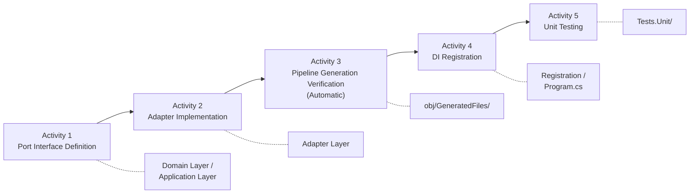
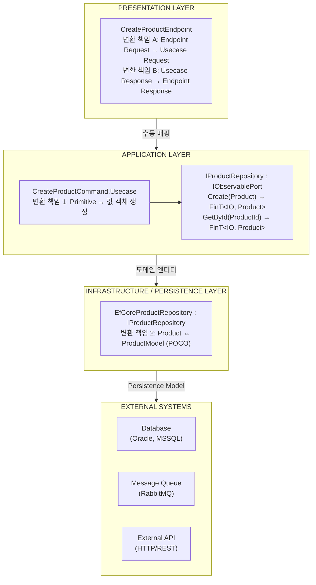

This document is a guide covering the design principles of Port architecture and how to define Port interfaces in the Functorium framework.
For Adapter implementation, Pipeline creation, DI registration, and testing, please refer to separate documents.

## Introduction

"What problems arise when the Application Layer directly depends on databases or external APIs?"
"Why is the Repository interface placed in the Domain Layer and the External API interface in the Application Layer?"
"What are the benefits of unifying Port method return types to `FinT<IO, T>`?"

A Port is a contract for the application to communicate with the external world. This document covers Port architecture design principles, interface definition patterns by type, and Request/Response design.

### What You Will Learn

Through this document, you will learn:

1. **Necessity of Port-Adapter Architecture** — External dependency isolation and testability
2. **IObservablePort Interface Hierarchy** — The hierarchical structure underlying all Adapters
3. **Port Definition Patterns by Type** — Repository, External API, Messaging, Query Adapter
4. **Port Request/Response Design** — Principles for defining sealed records inside interfaces
5. **Repository Interface Design** — IRepository basic CRUD and domain-specific methods

### Prerequisites

A basic understanding of the following concepts is required to understand this document:

- [Domain Modeling Overview](../domain/04-ddd-tactical-overview) — Entity and Aggregate Root concepts
- [Entity/Aggregate Core Patterns](../domain/06b-entity-aggregate-core) — AggregateRoot base class
- [Error System: Basics and Naming](../domain/08a-error-system) — `Fin<T>` and `FinT<IO, T>` return patterns

> **Ports declare "what is needed" and Adapters implement "how to provide it."** This separation is the foundation of domain purity, testability, and technology replacement flexibility.

## Summary

### Key Commands

```csharp
// Port interface definition (inherits IObservablePort)
public interface IProductRepository : IRepository<Product, ProductId>
{
    FinT<IO, bool> Exists(Specification<Product> spec);
}

// External API Port definition
public interface IExternalPricingService : IObservablePort
{
    FinT<IO, Money> GetPriceAsync(string productCode, CancellationToken ct);
}

// Query Adapter Port definition
public interface IProductQuery : IQueryPort<Product, ProductSummaryDto> { }
```

### Key Procedures

1. Determine Port type (Repository / External API / Messaging / Query Adapter)
2. Determine location (Repository → Domain Layer, others → Application Layer)
3. Inherit from `IObservablePort` or a derived interface
4. Define return type as `FinT<IO, T>`
5. Use domain Value Objects (VO) for parameters
6. If Request/Response is needed, define as `sealed record` inside the interface

### Key Concepts

| Concept | Description |
|------|------|
| Port | A contract (interface) for the Application Layer to communicate with external systems |
| Adapter | An implementation of a Port interface |
| `IObservablePort` | The base interface that all Adapters implement (provides `RequestCategory` property) |
| `IRepository<T, TId>` | Common interface for per-Aggregate-Root Repository (provides basic CRUD) |
| `IQueryPort<TEntity, TDto>` | Generic interface for read-only queries (returns DTOs directly) |
| `FinT<IO, T>` | Functional return type (asynchronous operation + error handling composition) |
| Driving Adapter | Calls the application from outside (Presentation, Mediator acts as Port) |
| Driven Adapter | The application calls the outside (Persistence, Infrastructure) |

---

## Why Port-Adapter Architecture

### Role of Anti-Corruption Layer in DDD

The domain model must be protected from the technical details of external systems. Port-Adapter Architecture (Hexagonal Architecture) provides a clear boundary between the domain and the external world.

### Protecting Domain Purity: Isolating External Dependencies

Comparing before and after adopting the Port-Adapter pattern makes the difference clear.

| Problem | Without Port-Adapter | With Port-Adapter |
|------|------------------|------------------|
| Dependency direction | Application → Infrastructure | Application → Port (interface) ← Adapter |
| Testing | DB/API connection required | Can be replaced with Mock |
| Technology replacement | Requires full modification | Replace only the Adapter |
| Observability | Manual logging/tracing | Pipeline auto-generation |

### Relationship with Hexagonal Architecture

Functorium's Adapter system implements the Port and Adapter concepts of Hexagonal Architecture:
- **Port** = The interface that the domain/application requires (`IProductRepository`, `IExternalPricingService`)
- **Adapter** = The implementation of a Port (`InMemoryProductRepository`, `ExternalPricingApiService`)
- **Pipeline** = An observability wrapper automatically generated by the Source Generator

#### Driving vs Driven Adapter Distinction

In Hexagonal Architecture, Adapters are divided into two types based on call direction.

| Category | Driving (Primary) | Driven (Secondary) |
|------|-------------------|---------------------|
| **Role** | Calls the application from outside | The application calls the outside |
| **Direction** | Outside → Inside | Inside → Outside |
| **Port location** | None (Mediator substitutes) | Domain or Application Layer |
| **Functorium mapping** | `Adapters.Presentation` | `Adapters.Persistence`, `Adapters.Infrastructure` |

#### Why the Presentation Adapter Has No Port

The Presentation, being a Driving Adapter, calls the Mediator directly without a separate Port interface. The rationale behind this design decision:

1. **Mediator substitutes for the Port** — `IMediator.Send()` acts as the contract between Presentation and Application
2. **Command/Query already serve as contracts** — The Request/Response types themselves serve as explicit interface roles
3. **Elimination of unnecessary indirection** — Introducing a Port for a Driving Adapter would create an abstraction that duplicates the Mediator
4. **The asymmetry with Driven Adapters is intentional** — Driven Adapters frequently need implementation replacement so a Port is required, while Driving Adapters rarely have replacement scenarios

```csharp
// Driving Adapter: Calls Mediator directly without a Port
public class CreateProductEndpoint : EndpointBase
{
    public override void Configure(RouteGroupBuilder group) =>
        group.MapPost("/products", HandleAsync);

    private Task<IResult> HandleAsync(
        IMediator mediator,               // ← Mediator acts as the Port
        CreateProductRequest request) =>
        mediator.Send(new CreateProduct.Command(request.Name, request.Price))
                .ToApiResultAsync();
}

// Driven Adapter: Implements Port (interface)
public interface IProductRepository : IObservablePort  // ← Port
{
    FinT<IO, Product> FindById(ProductId id);
}
```

Now that we understand the necessity of Port-Adapter architecture, let's examine the specific structure of the Adapter system provided by Functorium.

---

## Overview

Adapters are responsible for **the boundary between the Application Layer and external systems** in Clean Architecture. They encapsulate **infrastructure concerns** such as "database access", "message queues", and "external API calls".

### Why Use the Adapter Pattern?

Without Adapters, the following problems arise. The key point is that infrastructure code and observability code become mixed into business logic.

```csharp
// Problem 1: Application Layer directly depends on Infrastructure
public class CreateOrderUsecase
{
    private readonly DbContext _dbContext;  // Direct dependency on EF Core

    public async Task Handle(CreateOrderCommand command)
    {
        _dbContext.Orders.Add(order);  // Infrastructure code leaks into Application
        await _dbContext.SaveChangesAsync();
    }
}

// Problem 2: Observability code scattered throughout business logic
public async Task<Product> GetProductAsync(Guid id)
{
    using var activity = ActivitySource.StartActivity("GetProduct");  // Tracing
    _logger.LogInformation("Getting product {Id}", id);  // Logging
    var stopwatch = Stopwatch.StartNew();  // Metrics

    var product = await _repository.FindAsync(id);  // Actual logic

    stopwatch.Stop();
    _metrics.RecordDuration(stopwatch.Elapsed);  // Metrics
    return product;
}

// Problem 3: Difficult to test
// Using DbContext directly makes mocking impossible in unit tests
```

The Adapter pattern solves these problems:

```csharp
// Solution: Abstraction via Port interface
public interface IProductRepository : IObservablePort
{
    FinT<IO, Product> GetById(Guid id);
}

// Application Layer depends only on interfaces
public class GetProductUsecase(IProductRepository repository)
{
    public async ValueTask<FinResponse<Response>> Handle(Request request)
    {
        return await repository.GetById(request.Id)
            .Run().RunAsync()
            .ToFinResponse();
    }
}

// Implementation in Infrastructure Layer + automatic observability
[GenerateObservablePort]  // Auto-generates logging, tracing, metrics
public class InMemoryProductRepository : IProductRepository
{
    public string RequestCategory => "Repository";

    public virtual FinT<IO, Product> GetById(Guid id)
    {
        // Write only pure business logic
        return IO.lift(() =>
            _products.TryGetValue(id, out var product)
                ? Fin.Succ(product)
                : Fin.Fail<Product>(Error.New($"Product not found: {id}")));
    }
}
```

#### `[ObservablePortIgnore]` — Excluding Methods

To exclude specific methods from Pipeline wrapper generation in a class with `[GenerateObservablePort]` applied, use the `[ObservablePortIgnore]` attribute.

**Location**: `Functorium.Adapters.SourceGenerators.ObservablePortIgnoreAttribute`

```csharp
[GenerateObservablePort]
public class InMemoryProductRepository : IProductRepository
{
    public string RequestCategory => "Repository";

    public virtual FinT<IO, Product> GetById(ProductId id) { ... }  // Wrapped by Pipeline

    [ObservablePortIgnore]
    public virtual FinT<IO, Unit> InternalCleanup() { ... }  // Excluded from Pipeline
}
```

- The Source Generator will not generate an `override` wrapper for this method.
- The method will not have logging, metrics, or tracing recorded.
- Use this for internal utility methods or methods that do not need Observability.

### Core Characteristics

| Characteristics | Description |
|------|------|
| **Port-Adapter Pattern** | Application Layer knows only the Port (interface), Infrastructure Layer implements the Adapter |
| **Functional Return Type** | Composes asynchronous operation and error handling functionally with `FinT<IO, T>` |
| **Automatic Observability** | Auto-generates logging, tracing, metrics via the `[GenerateObservablePort]` attribute |
| **Testability** | Easily create Mock objects based on interfaces |

### Adapter Types

The four Adapter types supported by Functorium and their respective roles are summarized below.

| Type | Purpose | RequestCategory | Hexagonal Role | Example |
|------|------|-----------------|---------------|------|
| **Repository** | Data persistence | `"Repository"` | Driven | `IProductRepository`, `IOrderRepository` |
| **Messaging** | Message queue/events | `"Messaging"` | Driven | `IOrderMessaging`, `IInventoryMessaging` |
| **External API** | External service calls | `"ExternalApi"` | Driven | `IPaymentApiService`, `IWeatherApiService` |
| **Query Adapter** | Read-only queries (returns DTOs directly) | `"QueryAdapter"` | Driven | `IProductQuery`, `IInventoryQuery`, `IProductWithStockQuery` (JOIN) |

### Implementation Lifecycle Overview

Adapter implementation consists of 5 activities.



### Layer/Project Ownership by Step

| Activity | Task | Owning Layer | Project Example |
|----------|------|-------------|---------------|
| 1 | Port Interface Definition | Domain / Application | `LayeredArch.Domain`, `LayeredArch.Application` |
| 2 | Adapter Implementation | Adapter | `LayeredArch.Adapters.Persistence`, `LayeredArch.Adapters.Infrastructure` |
| 3 | Pipeline Generation Verification | (Auto-generated) | `obj/GeneratedFiles/` |
| 4 | DI Registration | Adapter / Host | `{Project}.Adapters.{Layer}`, `LayeredArch` |
| 5 | Unit Testing | Test | `{Project}.Tests.Unit` |

Now that we understand Adapter types and their lifecycle, let's examine the `IObservablePort` interface and its hierarchy that underlie all Adapters.

---

## IObservablePort 인터페이스

The base interface that all Adapters must implement.

**Location**: `Functorium.Abstractions.Observabilities.IObservablePort`

```csharp
public interface IObservablePort
{
    /// <summary>
    /// 관찰성 로그에서 사용할 요청 카테고리
    /// </summary>
    string RequestCategory { get; }
}
```

### Interface Hierarchy

Functorium provides an interface hierarchy for Adapter implementation.

```
IObservablePort (인터페이스)
├── string RequestCategory - 관찰성 로그용 카테고리
│
├── IRepository<TAggregate, TId> : IObservablePort   ← Aggregate Root 단위 Repository
│   ├── Create / GetById / Update / Delete            ← 단건 CRUD
│   └── CreateRange / GetByIds / UpdateRange / DeleteRange  ← 일괄 CRUD
│       (전체 시그니처는 §Repository 인터페이스 설계 원칙 참조)
│   │
│   ├── IProductRepository : IRepository<Product, ProductId>
│   │   ├── FinT<IO, bool> Exists(Specification<Product> spec)  ← 도메인 전용
│   │   └── FinT<IO, Product> GetByIdIncludingDeleted(ProductId id)
│   │
│   └── IOrderRepository : IRepository<Order, OrderId>
│       └── (CRUD는 IRepository에서 상속)
│
├── IUnitOfWork : IObservablePort   ← Application Layer의 트랜잭션 커밋 Port
│   ├── FinT<IO, Unit> SaveChanges(CancellationToken)
│   └── Task<IUnitOfWorkTransaction> BeginTransactionAsync(CancellationToken)
│
├── IOrderMessaging : IObservablePort
│   ├── FinT<IO, Unit> PublishOrderCreated(OrderCreatedEvent @event)
│   └── FinT<IO, CheckInventoryResponse> CheckInventory(CheckInventoryRequest request)
│
├── IExternalApiService : IObservablePort
│   └── FinT<IO, Response> CallApiAsync(Request request, CancellationToken ct)
│
├── IQueryPort : IObservablePort   ← 비제네릭 마커 (런타임 타입 체크, DI 스캐닝용)
│
└── IQueryPort<TEntity, TDto> : IQueryPort   ← 읽기 전용 조회 (DTO 직접 반환)
    ├── FinT<IO, PagedResult<TDto>> Search(Specification<TEntity>, PageRequest, SortExpression)
    ├── FinT<IO, CursorPagedResult<TDto>> SearchByCursor(Specification<TEntity>, CursorPageRequest, SortExpression)
    └── IAsyncEnumerable<TDto> Stream(Specification<TEntity>, SortExpression, CancellationToken)
    │
    ├── IProductQuery : IQueryPort<Product, ProductSummaryDto>
    ├── IProductWithStockQuery : IQueryPort<Product, ProductWithStockDto>  ← JOIN 예제
    └── IInventoryQuery : IQueryPort<Inventory, InventorySummaryDto>
```

**Understanding the Hierarchy:**

- **IObservablePort**: 모든 Adapter가 구현하는 기반 인터페이스. `RequestCategory` 속성 제공. 위치: `Functorium.Abstractions.Observabilities`
- **IRepository\<TAggregate, TId\>**: Aggregate Root 단위 Repository의 공통 인터페이스. `AggregateRoot<TId>` 제약으로 컴파일 타임에 Aggregate 단위 영속화를 강제. 위치: `Functorium.Domains.Repositories`
- **IUnitOfWork**: Application Layer의 트랜잭션 커밋 Port. 위치: `Functorium.Applications.Persistence`
- **IQueryPort** (비제네릭): 런타임 타입 체크, DI 스캐닝용 마커 인터페이스. **IQueryPort\<TEntity, TDto\>**: 제네릭 쿼리 어댑터. 위치: `Functorium.Applications.Queries`
- **Domain Repository**: `IRepository`를 상속하여 도메인 전용 메서드만 추가 선언. Domain Layer에 인터페이스 정의
- **Port Interface**: Application Layer에서 필요한 외부 서비스 인터페이스 정의

### RequestCategory Value Guide

| Value | Purpose | Example |
|---|------|------|
| `"Repository"` | 데이터베이스/영속화 | EF Core, Dapper, InMemory |
| `"UnitOfWork"` | 트랜잭션 커밋 | EfCoreUnitOfWork, InMemoryUnitOfWork |
| `"Messaging"` | 메시지 큐 | RabbitMQ, Kafka, Azure Service Bus |
| `"ExternalApi"` | HTTP API 호출 | REST API, GraphQL |
| `"QueryAdapter"` | 읽기 전용 조회 | Dapper Query Adapter, InMemory Query Adapter |
| `"Cache"` | 캐시 서비스 | Redis, InMemory Cache |
| `"File"` | 파일 시스템 | 파일 읽기/쓰기 |

인터페이스 계층을 이해했으니, 이제 실제로 Port 인터페이스를 정의하는 방법을 유형별로 알아보겠습니다.

---

## Activity 1: Port Interface Definition

Port interfaces are **contracts** for the Application Layer to communicate with external systems.

### Location Rules

The layer where the interface is placed varies depending on the Port type.

| Type | Location | Reason |
|------|------|------|
| Repository | **Domain Layer** (`Domain/Repositories/`) | 도메인 모델(Entity, VO)에 직접 의존 |
| External API | **Application Layer** (`Application/Ports/`) | 외부 시스템 통신은 Application 관심사 |
| Messaging | **Application Layer** (`Application/Ports/`) 또는 Adapter 내부 | 메시징은 인프라 관심사, 프로젝트 구조에 따라 결정 |
| Query Adapter | **Application Layer** (`Application/Usecases/{Feature}/Ports/`) | 읽기 전용 조회는 Application 관심사 |

> **Note**: Cqrs06Services 튜토리얼에서는 Messaging Port를 `Adapters/Messaging/` 내부에 배치합니다.
> 이는 Port와 Adapter가 동일 프로젝트에 있는 간소화된 구조입니다.

### Port Definition Checklist

- [ ] `IObservablePort` 인터페이스를 상속하는가? (Repository인 경우 `IRepository<TAggregate, TId>` 상속)
- [ ] 모든 메서드의 반환 타입이 `FinT<IO, T>`인가?
- [ ] 매개변수와 반환 타입에 도메인 값 객체(VO)를 사용하는가?
- [ ] Asynchronous operation이 필요한 메서드에 `CancellationToken` 매개변수가 있는가?
- [ ] 인터페이스 이름이 `I` 접두사 규칙을 따르는가?
- [ ] Request/Response가 인터페이스 내부에 sealed record로 정의되어 있는가? (해당 시)
- [ ] 기술 관심사 타입(Entity, DTO)을 사용하지 않았는가?

> **Why sealed record?** Port Request/Response types are defined as `sealed record`. `sealed`는 상속을 금지하여 계약의 명확성을 보장하고, `record`는 Value-based equality과 Immutability을 제공하여 Port 경계에서 안전한 데이터 전달을 보장합니다.

### Port Definition Patterns by Type

#### Repository Port

도메인 Aggregate Root의 영속성을 담당합니다. **Domain Layer에** 위치합니다.
`IRepository<TAggregate, TId>`를 상속하여 CRUD는 기본 제공받고, 도메인 전용 메서드만 추가합니다.

The key point in the following code is CRUD 메서드를 재선언하지 않고, 도메인에 특화된 `Exists`와 `GetByIdIncludingDeleted`만 추가하는 것입니다.

```csharp
// File: {Domain}/AggregateRoots/Products/IProductRepository.cs

using Functorium.Domains.Repositories;  // IRepository

// CRUD (Create, GetById, Update, Delete)는 IRepository에서 상속
// 도메인 전용 메서드만 선언
public interface IProductRepository : IRepository<Product, ProductId>
{
    FinT<IO, bool> Exists(Specification<Product> spec);
    FinT<IO, Product> GetByIdIncludingDeleted(ProductId id);
}
```

> **참조**: `Tests.Hosts/01-SingleHost/Src/LayeredArch.Domain/AggregateRoots/Products/IProductRepository.cs`

**Key Points**:
- 매개변수는 도메인 값 객체 (`ProductId`) 또는 Specification 패턴 사용
- 조회 실패 가능성이 있으면 `Option<T>` 래핑
- 컬렉션 반환은 `Seq<T>` 사용
- 반환 값이 없으면 `Unit` 사용

#### External API Port

외부 시스템 API 호출을 추상화합니다. **Application Layer에** 위치합니다.

```csharp
// File: {Application}/Ports/IExternalPricingService.cs

using Functorium.Abstractions.Observabilities;  // IObservablePort

public interface IExternalPricingService : IObservablePort
{
    FinT<IO, Money> GetPriceAsync(string productCode, CancellationToken cancellationToken);
    FinT<IO, Map<string, Money>> GetPricesAsync(Seq<string> productCodes, CancellationToken cancellationToken);
}
```

> **참조**: `Tests.Hosts/01-SingleHost/Src/LayeredArch.Application/Ports/IExternalPricingService.cs`

**Key Points**:
- Asynchronous operation이므로 `CancellationToken` 매개변수 포함
- 메서드 이름에 `Async` 접미사 사용 (내부적으로 `IO.liftAsync` 사용 예정)
- 응답 DTO는 같은 파일 또는 별도 파일에 정의 가능

#### Messaging Port

메시지 브로커(RabbitMQ 등)를 통한 서비스 간 통신을 추상화합니다.

```csharp
// File: {Application}/Ports/IInventoryMessaging.cs
// 또는: {Adapters}/Messaging/IInventoryMessaging.cs

using Functorium.Abstractions.Observabilities;  // IObservablePort

public interface IInventoryMessaging : IObservablePort
{
    /// Request/Reply 패턴
    FinT<IO, CheckInventoryResponse> CheckInventory(CheckInventoryRequest request);

    /// Fire-and-Forget 패턴
    FinT<IO, Unit> ReserveInventory(ReserveInventoryCommand command);
}
```

> **참조**: `Tutorials/Cqrs06Services/Src/OrderService/Adapters/Messaging/IInventoryMessaging.cs`

**Key Points**:
- Request/Reply: 응답 타입을 반환 (`FinT<IO, TResponse>`)
- Fire-and-Forget: `FinT<IO, Unit>` 반환
- 메시지 타입(`CheckInventoryRequest` 등)은 공유 프로젝트에 정의

#### Query Adapter Port

읽기 전용 조회를 위한 Adapter로, Aggregate 재구성 없이 DTO를 직접 반환합니다. **Application Layer에** 위치합니다.

프레임워크가 제공하는 `IQueryPort<TEntity, TDto>` 제네릭 인터페이스를 상속하여 정의합니다.

```csharp
// 프레임워크 인터페이스 (Functorium.Applications.Queries)
// 비제네릭 마커 — 런타임 타입 체크, DI 스캐닝, 제네릭 제약에 활용
public interface IQueryPort : IObservablePort { }

// 제네릭 쿼리 어댑터 — Specification 기반 검색, PagedResult 반환
public interface IQueryPort<TEntity, TDto> : IQueryPort
{
    FinT<IO, PagedResult<TDto>> Search(
        Specification<TEntity> spec,
        PageRequest page,
        SortExpression sort);

    FinT<IO, CursorPagedResult<TDto>> SearchByCursor(
        Specification<TEntity> spec,
        CursorPageRequest cursor,
        SortExpression sort);

    IAsyncEnumerable<TDto> Stream(
        Specification<TEntity> spec,
        SortExpression sort,
        CancellationToken cancellationToken = default);
}
```

**Search 파라미터 설명:**

| 파라미터 | Type | Description |
|----------|------|------|
| `spec` | `Specification<TEntity>` | 도메인 Specification 패턴으로 필터 조건 표현. 전체 조회 시 `Specification<TEntity>.All` 사용. 상세는 [10-specifications.md](../domain/10-specifications) 참조 |
| `page` | `PageRequest` | Offset 기반 페이지네이션 (`Page`, `PageSize`). 기본값 page=1, pageSize=20, 최대 10,000 |
| `sort` | `SortExpression` | 다중 필드 정렬 표현. `SortExpression.Empty`이면 Adapter의 `DefaultOrderBy` 사용 |

**SearchByCursor 파라미터 설명:**

| 파라미터 | Type | Description |
|----------|------|------|
| `spec` | `Specification<TEntity>` | Search와 동일한 Specification 패턴 |
| `cursor` | `CursorPageRequest` | Keyset 기반 커서 (`After`, `Before`, `PageSize`). 기본값 pageSize=20, 최대 10,000 |
| `sort` | `SortExpression` | 커서 페이지네이션의 정렬 기준. `SortExpression.Empty`이면 Adapter의 `DefaultOrderBy` 사용 |

**Stream 파라미터 설명:**

| 파라미터 | Type | Description |
|----------|------|------|
| `spec` | `Specification<TEntity>` | Search와 동일한 Specification 패턴 |
| `sort` | `SortExpression` | 정렬 기준 |
| `cancellationToken` | `CancellationToken` | 스트리밍 취소 토큰 (기본값 `default`) |

```csharp
// 단일 테이블 — 파일: {Application}/Usecases/Products/IProductQuery.cs
public interface IProductQuery : IQueryPort<Product, ProductSummaryDto> { }

// JOIN (Product + Inventory) — 파일: {Application}/Usecases/Products/IProductWithStockQuery.cs
public interface IProductWithStockQuery : IQueryPort<Product, ProductWithStockDto> { }
```

> **참조**: `Tests.Hosts/01-SingleHost/Src/LayeredArch.Application/Usecases/Products/IProductQuery.cs`

**Key Points**:
- `IQueryPort<TEntity, TDto>`를 상속 — Search 시그니처가 자동 제공됨
- 반환 타입은 `PagedResult<TDto>` — Aggregate가 아닌 DTO 직접 반환
- `Specification<T>`, `PageRequest`, `SortExpression`으로 조회 조건 표현
- Port 인터페이스는 Usecase 근처(`Application/Usecases/{Feature}/Ports/`)에 위치
- JOIN 쿼리도 동일한 Port 패턴 — `TEntity`는 필터 대상 엔티티, `TDto`는 JOIN 결과 DTO

#### Type Comparison Table

네 가지 Port 유형의 차이점을 한눈에 비교하면 다음과 같습니다.

| Item | Repository | External API | Messaging | Query Adapter |
|------|-----------|-------------|-----------|-------------|
| Location | Domain Layer | Application Layer | Application 또는 Adapter | Application Layer |
| `IObservablePort` 상속 | `IRepository<T, TId>` | `IObservablePort` | `IObservablePort` | `IQueryPort<TEntity, TDto>` |
| Return Type | `FinT<IO, T>` | `FinT<IO, T>` | `FinT<IO, T>` | `FinT<IO, PagedResult<TDto>>` |
| `CancellationToken` | Optional | 권장 | Optional | Optional |
| 값 객체 사용 | Required | 권장 | 메시지 DTO 사용 | DTO 직접 반환 |
| 컬렉션 타입 | `Seq<T>` | `Seq<T>`, `Map<K,V>` | 단일 메시지 | `PagedResult<T>` |

### Port Request/Response Design

Usecase의 Request/Response 패턴과 동일한 이름 패턴을 IObservablePort Port 인터페이스에 적용하여 개념을 단순화하고, 레이어 간 데이터 변환 책임을 명확히 정의합니다.

#### Differences Between Usecase and Port Request/Response

| Aspect | Usecase Request/Response | Port Request/Response |
|------|--------------------------|----------------------|
| **위치** | Command/Query 클래스 내부 | IObservablePort 인터페이스 내부 |
| **목적** | 외부 API 경계 정의 | 내부 시스템 간 계약 정의 |
| **타입 선호도** | Primitive (string, Guid, decimal) | 도메인 값 객체 (ProductId, Money) |
| **검증 책임** | FluentValidation 입력 검증 | 값 객체 Immutable식으로 보장 |
| **직렬화** | JSON 직렬화 필요 (외부 노출) | 직렬화 불필요 (내부 사용) |

> **Usecase Request/Response에서 기본 타입을 사용하는 이유**: Port는 Application-Adapter 경계의 DTO 역할이며, Value Object는 Domain 내부 개념입니다. Usecase Request/Response에 기본 타입(string, int, decimal 등)을 사용하여 Adapter(Presentation)가 Domain 타입에 의존하지 않도록 합니다. Primitive → Value Object 변환은 Usecase 내부에서 수행합니다.

#### Pattern Comparison

```csharp
// ═══════════════════════════════════════════════════════════════════════════
// Usecase 패턴 (외부 API 경계)
// ═══════════════════════════════════════════════════════════════════════════
public sealed class CreateProductCommand
{
    // Primitive 타입 사용 - JSON 직렬화 친화적
    public sealed record Request(
        string Name,           // string (not ProductName)
        string Description,
        decimal Price,         // decimal (not Money)
        int StockQuantity) : ICommandRequest<Response>;

    public sealed record Response(
        Guid ProductId,        // Guid (not ProductId)
        string Name,
        string Description,
        decimal Price,
        int StockQuantity,
        DateTime CreatedAt);
}

// ═══════════════════════════════════════════════════════════════════════════
// Port 패턴 (내부 계약) - 동일한 구조, 다른 타입
// ═══════════════════════════════════════════════════════════════════════════
public interface IProductRepository : IObservablePort
{
    // 도메인 값 객체 사용 - 기술 독립적
    sealed record GetByIdRequest(ProductId Id);
    sealed record GetByIdResponse(Product Product);

    sealed record CreateRequest(Product Product);
    sealed record CreateResponse(Product CreatedProduct);

    FinT<IO, GetByIdResponse> GetById(GetByIdRequest request);
    FinT<IO, CreateResponse> Create(CreateRequest request);
}
```

#### Data Transformation Flow Architecture



#### Transformation Responsibilities at Each Boundary

| 경계 | 변환 주체 | 변환 내용 | 에러 처리 |
|------|----------|----------|----------|
| Presentation → Application | **Endpoint** | Endpoint.Request → Usecase.Request (수동 매핑) | 400 Bad Request |
| Application → Presentation | **Endpoint** | `FinResponse<A>.Map<B>()` (Usecase.Response → Endpoint.Response) | — |
| Application 내부 | **Usecase 클래스** | Primitive → 값 객체 | FinResponse.Fail |
| Application → Persistence | **Adapter Mapper** | 도메인 엔티티 → Persistence Model (POCO) | FinT<IO, T> |
| Persistence → Application | **Adapter Mapper** | Persistence Model → 도메인 엔티티 (`CreateFromValidated`) | FinT<IO, T> |
| Infrastructure → External | HttpClient / DbContext | DTO → 외부 프로토콜 | Exception → Fin.Fail |
| Application → Messaging | **Adapter Mapper** | Domain Type → Broker Message (해당 시) | FinT<IO, T> |
| Messaging → Application | **Adapter Mapper** | Broker Message → Domain Type (해당 시) | FinT<IO, T> |

#### Port Request/Response Definition Principles

**원칙 1: 인터페이스 내부에 sealed record 정의**

```csharp
public interface IProductRepository : IObservablePort
{
    // ✅ 인터페이스 내부에 Request/Response 정의 (응집도 향상)
    sealed record GetByIdRequest(ProductId Id);
    sealed record GetByIdResponse(Product Product);

    sealed record CreateRequest(Product Product);
    sealed record CreateResponse(Product CreatedProduct);

    FinT<IO, GetByIdResponse> GetById(GetByIdRequest request);
    FinT<IO, CreateResponse> Create(CreateRequest request);
}
```

**원칙 2: 도메인 값 객체 직접 사용 (기술 독립성)**

```csharp
// ✅ Good - 도메인 값 객체 사용
sealed record Request(ProductId Id, ProductName Name);

// ❌ Bad - Primitive 타입 직접 사용
sealed record Request(Guid Id, string Name);

// ❌ Bad - 기술 관심사 타입 사용
sealed record Request(ProductModel Model);  // Persistence 타입
```

**원칙 3: 메서드 수에 따른 네이밍 전략**

단일 메서드 인터페이스:
```csharp
public interface IWeatherApiService : IObservablePort
{
    // 접두사 없이 Request/Response
    sealed record Request(string City, DateTime Date);
    sealed record Response(decimal Temperature, string Condition);

    FinT<IO, Response> GetWeatherAsync(Request request, CancellationToken ct);
}
```

다중 메서드 인터페이스:
```csharp
public interface IProductRepository : IObservablePort
{
    // {Action}Request / {Action}Response
    sealed record GetByIdRequest(ProductId Id);
    sealed record GetByIdResponse(Product Product);

    sealed record GetAllRequest(int? PageSize = null, int? PageNumber = null);
    sealed record GetAllResponse(Seq<Product> Products, int TotalCount);

    FinT<IO, GetByIdResponse> GetById(GetByIdRequest request);
    FinT<IO, GetAllResponse> GetAll(GetAllRequest request);
}
```

**원칙 4: 중첩 record 가이드라인**

```csharp
public interface IEquipmentApiService : IObservablePort
{
    sealed record GetHistoryRequest(
        EquipId EquipId,
        DateRange DateRange,
        EquipmentFilter? Filter);

    sealed record EquipmentFilter(
        Seq<EquipTypeId> EquipTypes,
        bool IncludeInactive = false);

    sealed record GetHistoryResponse(Seq<EquipmentHistory> Histories);

    sealed record EquipmentHistory(
        EquipId EquipId,
        DateTime Timestamp,
        EquipmentStatus Status,
        Seq<HistoryDetail> Details);   // 최대 2-3 레벨

    sealed record HistoryDetail(
        string PropertyName,
        string OldValue,
        string NewValue);

    FinT<IO, GetHistoryResponse> GetHistoryAsync(GetHistoryRequest request, CancellationToken ct);
}
```

**중첩 record 규칙:**
- 2-3 레벨까지 허용 (과도한 중첩 지양)
- 도메인 의미가 있는 경우만 중첩
- 여러 메서드에서 재사용되면 별도 타입으로 분리
- 모든 중첩 record는 sealed

### Repository Interface Design Principles

#### Basic CRUD — `IRepository<TAggregate, TId>`

모든 Repository는 `IRepository<TAggregate, TId>`를 상속합니다. CRUD 메서드는 기본 인터페이스에서 제공되므로 파생 인터페이스에서 재선언하지 않습니다.

```csharp
// Functorium.Domains.Repositories
public interface IRepository<TAggregate, TId> : IObservablePort
    where TAggregate : AggregateRoot<TId>
    where TId : struct, IEntityId<TId>
{
    FinT<IO, TAggregate> Create(TAggregate aggregate);
    FinT<IO, TAggregate> GetById(TId id);
    FinT<IO, TAggregate> Update(TAggregate aggregate);
    FinT<IO, int> Delete(TId id);

    FinT<IO, Seq<TAggregate>> CreateRange(IReadOnlyList<TAggregate> aggregates);
    FinT<IO, Seq<TAggregate>> GetByIds(IReadOnlyList<TId> ids);
    FinT<IO, Seq<TAggregate>> UpdateRange(IReadOnlyList<TAggregate> aggregates);
    FinT<IO, int> DeleteRange(IReadOnlyList<TId> ids);
}
```

#### Parameter Type Principles

| Principle | Description | Example |
|------|------|------|
| **VO 우선** | 원시 타입 대신 값 객체 사용 | `ExistsByName(ProductName name)` |
| **Optional적 파라미터** | null 가능한 경우 명시 | `ProductId? excludeId = null` |
| **Entity ID 타입** | 강타입 ID 사용 | `GetById(ProductId id)` |

#### Domain-Specific Method Signature Patterns

파생 인터페이스에는 `IRepository`에 없는 도메인 전용 메서드만 추가합니다.

```csharp
public interface IProductRepository : IRepository<Product, ProductId>
{
    // 조회 (단일, Optional): 없으면 None
    FinT<IO, Option<Product>> GetByName(ProductName name);

    // 조회 (목록): 빈 Seq도 성공
    FinT<IO, Seq<Product>> GetAll();

    // 존재 확인: bool 반환
    FinT<IO, bool> ExistsByName(ProductName name, ProductId? excludeId = null);
}
```

#### Method Return Type Guide

| Task | Return Type | Description |
|------|----------|------|
| **Create** | `FinT<IO, Entity>` | 생성된 Entity 반환 |
| **GetById** | `FinT<IO, Entity>` | 없으면 Error (Required 조회) |
| **GetByX (Optional)** | `FinT<IO, Option<Entity>>` | 없으면 None (Optional 조회) |
| **GetAll / GetMany** | `FinT<IO, Seq<Entity>>` | 빈 목록도 성공 |
| **ExistsBy** | `FinT<IO, bool>` | 존재 여부만 확인 |
| **Update** | `FinT<IO, Entity>` | 업데이트된 Entity 반환 |
| **Delete** | `FinT<IO, int>` | 삭제된 건수 반환 |
| **CreateRange** | `FinT<IO, Seq<Entity>>` | 일괄 생성된 Entity 목록 반환 |
| **GetByIds** | `FinT<IO, Seq<Entity>>` | 일괄 조회된 Entity 목록 반환 |
| **UpdateRange** | `FinT<IO, Seq<Entity>>` | 일괄 업데이트된 Entity 목록 반환 |
| **DeleteRange** | `FinT<IO, int>` | 삭제된 건수 반환 |

#### ExistsByName with excludeId Pattern

업데이트 시 자기 자신을 제외하고 중복 검사가 필요한 경우:

```csharp
// Interface
FinT<IO, bool> ExistsByName(ProductName name, ProductId? excludeId = null);

// 구현
public virtual FinT<IO, bool> ExistsByName(ProductName name, ProductId? excludeId = null)
{
    return IO.lift(() =>
    {
        bool exists = _products.Values.Any(p =>
            ((string)p.Name).Equals(name, StringComparison.OrdinalIgnoreCase) &&
            (excludeId is null || p.Id != excludeId.Value));
        return Fin.Succ(exists);
    });
}

// Usecase에서 사용 (UpdateProductCommand)
from exists in _productRepository.ExistsByName(name, productId)
from _ in guard(!exists, ApplicationErrors.ProductNameAlreadyExists(request.Name))
```

---

## Troubleshooting

### IObservablePort를 상속하지 않아 DI 등록이 실패한다

**Cause:** Port 인터페이스가 `IObservablePort` 또는 그 파생 인터페이스(`IRepository<T, TId>`, `IQueryPort<TEntity, TDto>`)를 상속하지 않으면 `RegisterScopedObservablePort` 호출 시 컴파일 에러가 발생합니다.

**Solution:**
```csharp
// Before - IObservablePort 미상속
public interface IProductRepository { ... }

// After - IRepository<T, TId>는 IObservablePort를 이미 상속
public interface IProductRepository : IRepository<Product, ProductId> { ... }
```

### Port 메서드 반환 타입이 FinT<IO, T>가 아니어서 Pipeline이 작동하지 않는다

**Cause:** Source Generator가 `FinT<IO, T>` 반환 타입만 Pipeline 대상으로 인식합니다. `Task<T>`나 `ValueTask<T>` 등 다른 반환 타입을 사용하면 Pipeline이 생성되지 않습니다.

**Solution:**
```csharp
// Before - Pipeline 미생성
Task<Product> GetById(ProductId id);

// After - Pipeline 정상 생성
FinT<IO, Product> GetById(ProductId id);
```

### Repository Port에서 Primitive 타입을 사용하여 도메인 순수성이 깨진다

**Cause:** Port 인터페이스의 매개변수에 `Guid`, `string` 등 Primitive 타입을 직접 사용하면 Adapter가 도메인 값 객체를 모르게 되어 도메인 경계가 무너집니다.

**Solution:**
```csharp
// Before - Primitive 타입 사용
FinT<IO, Product> GetById(Guid id);

// After - 도메인 값 객체 사용
FinT<IO, Product> GetById(ProductId id);
```

---

## FAQ

### Q1. Repository Port는 왜 Domain Layer에 위치하나요?

Repository는 Aggregate Root의 영속성을 담당하며, 도메인 모델(Entity, Value Object)에 직접 의존합니다. Domain Layer에 인터페이스를 두어야 Application Layer가 도메인 모델을 통해 Repository와 상호작용할 수 있고, 의존성 방향이 도메인을 향하게 됩니다.

### Q2. Driving Adapter(Presentation)에는 왜 Port가 없나요?

Mediator가 Port 역할을 대신합니다. `IMediator.Send()`가 Presentation과 Application 사이의 계약으로 작동하고, Command/Query Request/Response 타입 자체가 명시적 인터페이스 역할을 수행합니다. Driving Adapter에 별도 Port를 도입하면 Mediator와 중복되는 추상화가 됩니다.

### Q3. Port Request/Response를 인터페이스 내부에 sealed record로 정의하는 이유는?

`sealed`는 상속을 금지하여 계약의 명확성을 보장하고, `record`는 Value-based equality과 Immutability을 제공합니다. 인터페이스 내부에 정의하면 Port와 Request/Response의 응집도가 높아져 관련 타입을 한 곳에서 관리할 수 있습니다.

### Q4. IQueryPort와 IRepository의 차이는 무엇인가요?

`IRepository<T, TId>`는 Aggregate Root 단위 CRUD를 담당하며 도메인 엔티티를 반환합니다. `IQueryPort<TEntity, TDto>`는 읽기 전용 조회를 담당하며 Aggregate 재구성 없이 DTO를 직접 반환합니다. Aggregate 필요 여부가 핵심 판단 기준입니다.

### Q5. External API Port에서 CancellationToken은 Required인가요?

Required는 아니지만 권장됩니다. External API 호출은 네트워크 지연이 있으므로 `CancellationToken`으로 요청 취소를 지원하는 것이 좋습니다. Repository Port에서는 Optional 사항입니다.

---

## Reference Documents

| Document | Description |
|------|------|
| [13-adapters.md](./13-adapters) | Adapter 구현 가이드 (Repository, External API, Messaging, Query) |
| [14a-adapter-pipeline-di.md](./14a-adapter-pipeline-di) | Pipeline 생성, DI 등록 |
| [14b-adapter-testing.md](./14b-adapter-testing) | Adapter 단위 테스트 |
| [04-ddd-tactical-overview.md](../domain/04-ddd-tactical-overview) | 도메인 모델링 전체 개요 |
| [11-usecases-and-cqrs.md](../application/11-usecases-and-cqrs) | 유스케이스 구현 (CQRS Command/Query) |
