This document covers Functorium's internal architecture design principles. Starting from the definition of software architecture, it explains the entire architecture — including layer structure based on the separation of concerns principle, dependency direction, testing, and observability — with visual aids. It serves as a reference for developers new to architecture design as well as teams looking to apply Functorium to existing projects.

## Introduction

"When starting a new project, have you ever defined the folder structure first, only to find that business code and technical code became intertwined, making maintenance difficult?"
"Have you ever had to modify business logic when replacing a technical framework?"
"Have you ever given up writing tests because of external dependencies?"

The core of architecture design lies in layer structure and dependency direction rules based on the separation of concerns principle. By clearly separating business concerns from technical concerns and maintaining dependency direction from outside to inside, each concern can be developed and tested independently.

### What You Will Learn

Through this document, you will learn:

1. **Software Architecture Definition** - Why architecture is a core structural decision, not just a folder structure
2. **Internal/External Architecture Distinction** - Separation of concerns at the service level and layer level
3. **Layer Responsibilities and Dependency Direction** - Roles and dependency relationships of Domain, Application, and Adapter layers
4. **Testing and Observability Placement** - Where unit tests, integration tests, and Observability sit within the architecture

> **The core of architecture design is** separating business concerns from technical concerns and maintaining dependency direction from outside to inside.

---

 

## Software Architecture Definition

Software architecture is not just a folder structure. It is a core structural decision of the system, and because the cost of change is high, it must be carefully designed early. The following figure shows what software architecture is and why it matters.

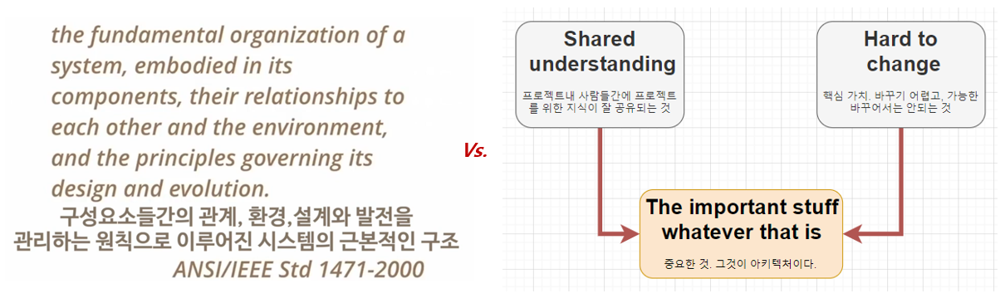
- Source: [The Importance of Software Architecture](https://www.youtube.com/watch?v=4E1BHTvhB7Y)

 

## Application Architecture
### Application Architecture Evolution

Application architecture has evolved from monolithic to microservices, and back to modular monolith. Each stage addresses different problems with different trade-offs. Functorium, drawing on lessons from this architectural evolution, focuses on Internal architecture to provide a structure that can be combined with any External architecture.

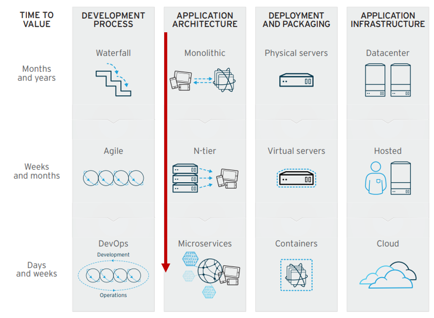

### Application External(Outer) / Internal(Inner) Architecture
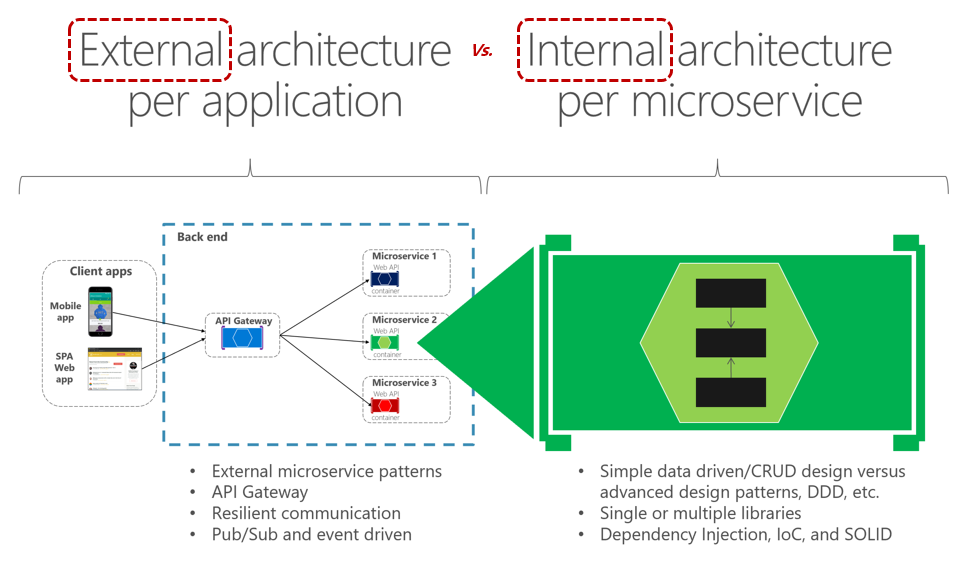
- Source: [Design a microservice-oriented application](https://learn.microsoft.com/en-us/dotnet/architecture/microservices/multi-container-microservice-net-applications/microservice-application-design)

### Architecture Design Principles
- Separation of concerns principle
  - Source: [Architecture Principles](https://learn.microsoft.com/en-us/dotnet/architecture/modern-web-apps-azure/architectural-principles)

  Category | Unit of Concern | Physical Entity
  --- | --- | ---
  External Architecture | Service | Container
  Internal Architecture | Layer | -
  Object-Oriented | Object | Class

 

## Internal Architecture Concerns

The core of Internal architecture is **separation of concerns**. When you clearly distinguish business logic (what to do) from technical details (how to implement it), each can be developed and tested independently. Functorium concretizes this principle into three layers.

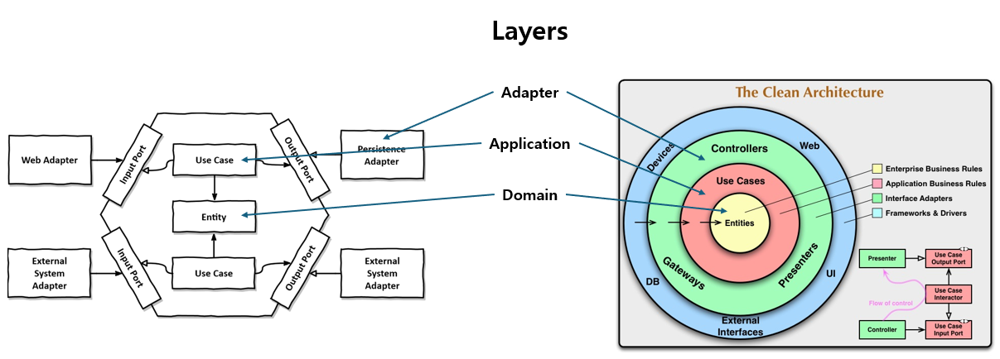

Internal architecture separates **technical concerns from** **business concerns** according to the **separation of concerns principle.** These separated concerns are defined and managed as layers.

### Layer Classification
Concern Category | Layer Name | Layer Role
--- | --- | ---
Technical Concern | Adapter Layer | Technical flow and units (input/output handling)
Business Concern | Application Layer | Business flow (Use Case)
Business Concern | Domain Layer | Business units (Entity)

- Only business concerns explicitly separate units and flows into distinct layers.
- The dependency direction points **from outside to inside** so that **technical concerns (Adapter Layer) depend on business concerns.**
- This allows **business concerns (Application/Domain Layers) to be developed and tested without depending on technology.**

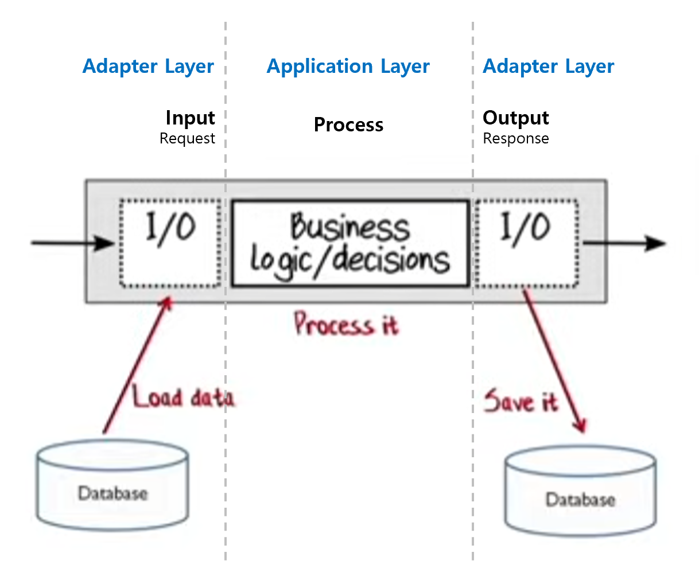

 

## Internal Architecture Layer Dependencies
### Dependency Visualization (Class Diagram)

Dependency direction is one of the most important rules in architecture. If dependencies point from inside (business) to outside (technology), changing the database requires modifying business logic as well. Functorium enforces dependencies to always point from outside to inside through Dependency Inversion (DIP).

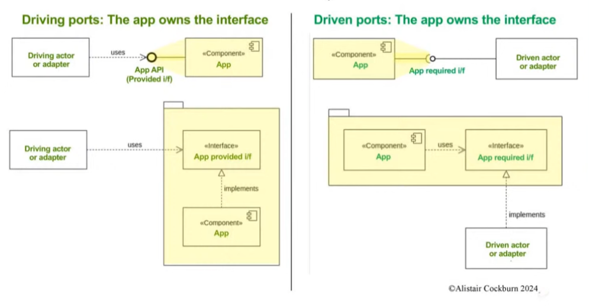
- Source: [Hexagonal Architecture (Alistair Cockburn)](https://www.youtube.com/watch?v=k0ykTxw7s0Y)

### Dependency Integration
> **App** = `Driving` interface **definition and implementation** + `Driven` interface **definition and usage**

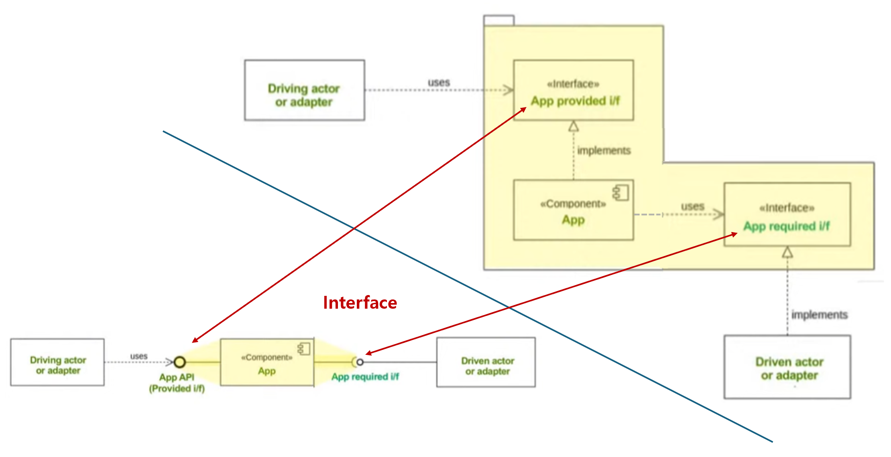

### Dependency Direction
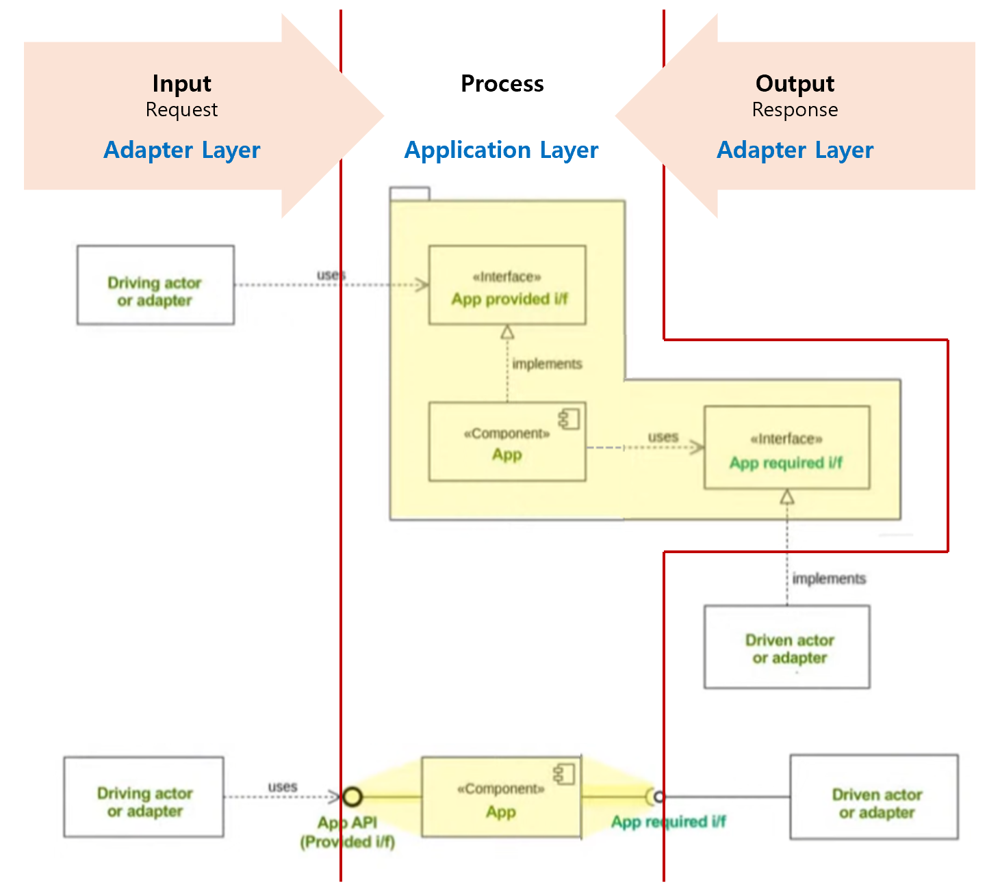

- **Driving Adapter (Input)**: **Uses** the `App provided i/f` interface.
- **Application**: **Implements** the `App provided i/f` interface and **uses** the `App required i/f` interface.
- **Driven Adapter (Output)**: **Implements** the `App required i/f` interface.

> Through Dependency Inversion (DIP), the Adapter Layer depends on interfaces defined in the Application Layer, so the dependency direction points **from outside to inside.**

### Dependency Comparison
- Clean Architecture  
  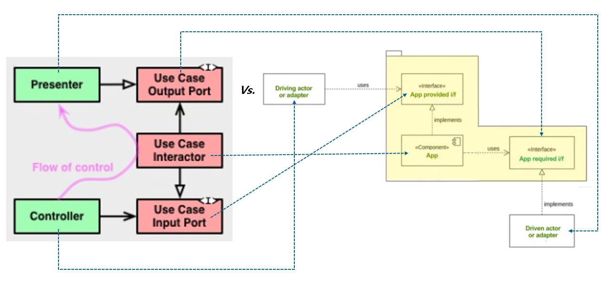
- Hexagonal Architecture  
  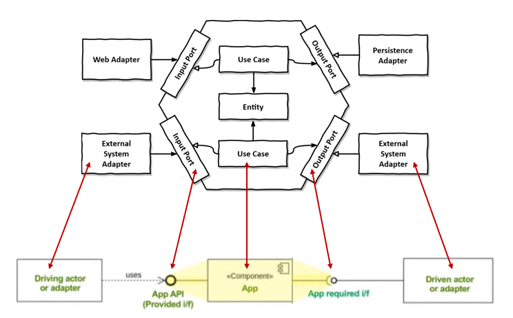

- You can confirm that the dependency direction is the same as Clean Architecture and Hexagonal Architecture.

 

## Internal Architecture

The final Internal architecture integrates everything discussed so far — separation of concerns, layer structure, and dependency direction — into one view. You can see which patterns each layer uses and where testing and observability are positioned.

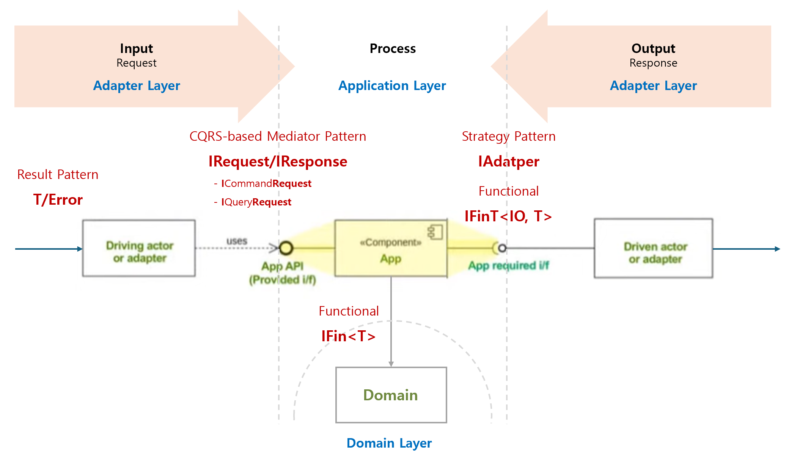

### Layer Roles and Patterns

| Category | Layer | Pattern | Description |
| --- | --- | --- | --- |
| Input (Request) | Adapter | Result Pattern | Returns results in `T(success)/Error(failure)` form |
| Output (Response) | Adapter | Strategy Pattern, Functional | External system integration through `IObservablePort` interface |
| Business Operation | Application | Mediator Pattern (CQRS) | `IRequest/IResponse` interfaces (`ICommandRequest`, `IQueryRequest`) |
| Business Unit | Domain | Functional | Core business logic and entities |

### Test Automation
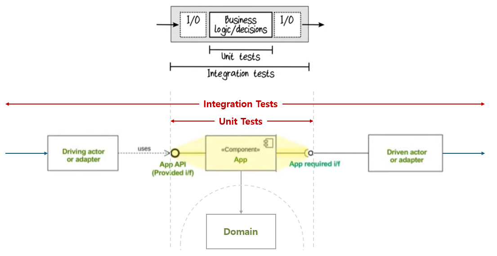

- **Unit Tests**: Test only business concerns.
- **Integration Tests**: Test including technical concerns.

### Observability
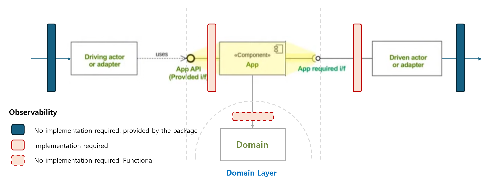

 

## External Architecture
This document focuses on Internal architecture. External architecture (inter-service communication, container orchestration, API Gateway, etc.) will be covered in a separate document.

 

## FAQ

### Q1. Why should technical concerns and business concerns be separated?
Technology (frameworks, databases, external APIs, etc.) can change over time. If business logic is tightly coupled to specific technology, changing the technology requires modifying business logic as well. Separating concerns means technology changes do not affect business logic, improving maintainability.

Additionally, **independent development** becomes possible. Even when technical concern (Adapter) implementation is not complete, business concerns (Application/Domain) can be developed and tested independently. For example, even if DB integration is not ready, you can proceed with business logic development using in-memory implementations or unit tests.

### Q2. What is the difference between Driving Adapter and Driven Adapter?
| Category | Driving Adapter (Input) | Driven Adapter (Output) |
| --- | --- | --- |
| Role | The entity that calls the application | The target that the application calls |
| Examples | REST Controller, CLI, Message Consumer | Repository, External API Client, Message Publisher |
| Interface | Uses `App provided i/f` | Implements `App required i/f` |

### Q3. Why should the dependency direction point from outside to inside?
If the dependency direction points from inside (business) to outside (technology), business logic depends on technology. In this case, changing technology requires changing business logic as well. Conversely, if dependencies point from outside to inside, technology depends on business, so you only need to replace the technology.

### Q4. Why separate the Application Layer and Domain Layer?
- **Application Layer**: Handles business **flow** (Use Case). Defines "what to do in what order."
- **Domain Layer**: Handles business **units** (Entity). Defines "what has which rules."

Separating flow and units means Use Case changes do not affect Entities, and Entity rule changes have minimal impact on Use Case flow.

### Q5. How does this architecture relate to Clean Architecture and Hexagonal Architecture?
All share the **same dependency direction** (from outside to inside). Terminology and expression methods differ, but the core principles are the same:

| This Document | Clean Architecture | Hexagonal Architecture |
| --- | --- | --- |
| Adapter Layer | Frameworks & Drivers | Port & Adapter |
| Application Layer | Use Cases | Application |
| Domain Layer | Entities | Domain |

### Q6. Why is the Adapter excluded from unit testing?
Adapters are connected to external technology (DB, HTTP, file system, etc.), making test environment setup complex and execution slow. Testing only business logic (Application/Domain) enables fast and stable unit tests. Adapters are verified through integration tests.
