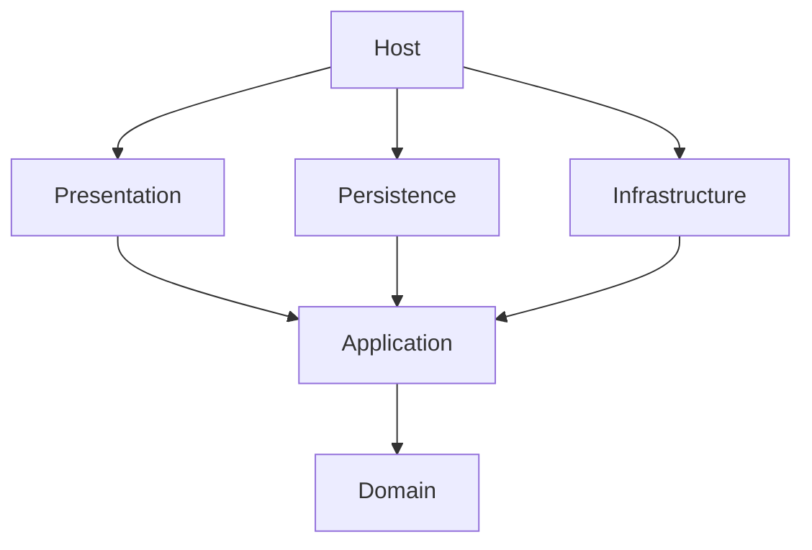
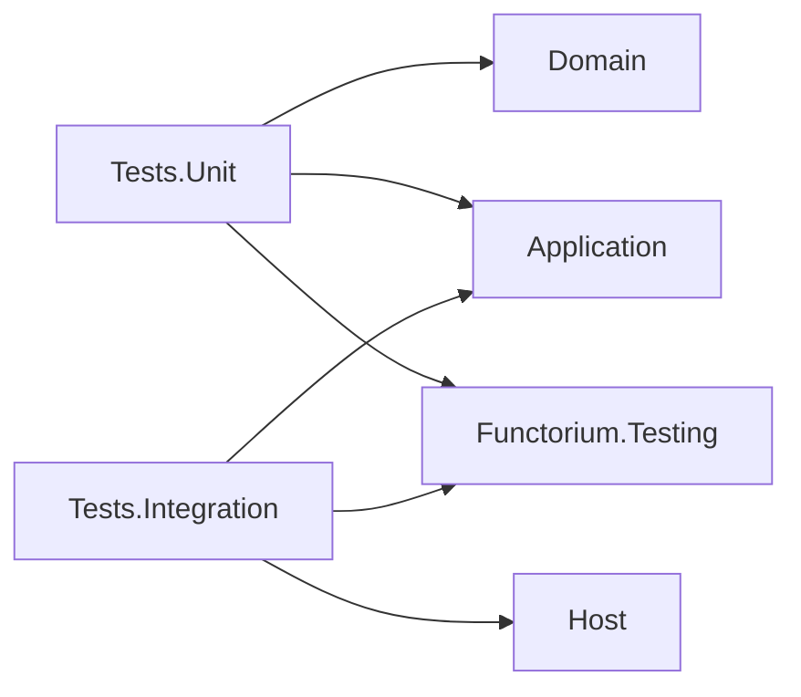

## Introduction

"Should this code go in Domain or Application?"
"What rules should the folder structure and naming follow when adding a new Adapter?"
"In which layer should the Port interface be placed?"

As a project grows, decisions about code placement become increasingly difficult. Without clear project structure rules, layer dependencies become entangled and you must discuss where to add new features every time. This guide provides a consistent answer to the question "WHERE to place code."

### What You Will Learn

Through this document, you will learn:

1. **8-project structure and dependency direction** - Roles and reference rules for Domain, Application, 3 Adapters, Host, and 2 Test projects
2. **3-step code placement decision** - Layer decision → project/folder decision → Port placement judgment
3. **Primary and secondary objective concepts** - Distinguishing core code from supporting infrastructure in each project
4. **Host's Composition Root role** - Layer registration order and middleware pipeline configuration
5. **Test project configuration** - Folder structure and settings for unit tests and integration tests

### Prerequisites

A basic understanding of the following concepts is required to understand this document:

- Basic concepts of Hexagonal Architecture (Ports and Adapters)
- .NET project references (`ProjectReference`) and NuGet package references
- Basic principles of DI (Dependency Injection) containers

> **The core of project structure is** establishing consistent rules for code placement, maintaining dependency direction from outside to inside between layers.

## Summary

### Key Commands

```bash
# Build
dotnet build {ServiceName}.slnx

# Test
dotnet test --solution {ServiceName}.slnx

# Architecture test (dependency direction verification)
# Automatically verified by LayerDependencyArchitectureRuleTests
```

### Key Procedures

**1. Code placement decision (3 steps):**
1. **Layer decision** — Business rules (Domain), use case orchestration (Application), technical implementation (Adapter)
2. **Project and folder decision** — Refer to the project/folder mapping table by code type
3. **Port placement judgment** — Domain if method signatures use only domain types, Application if external DTOs are included

**2. New service project creation:**
1. Domain project (AssemblyReference.cs, Using.cs, AggregateRoots/)
2. Application project (Usecases/, Ports/)
3. 3 Adapters (Presentation, Persistence, Infrastructure)
4. Host project (Program.cs — layer registration)
5. Tests.Unit + Tests.Integration

### Key Concepts

| Concept | Description |
|------|------|
| 8-project structure | Domain, Application, 3 Adapters, Host, 2 Tests |
| Dependency direction | Outside → inside (Host → Adapter → Application → Domain) |
| Primary / secondary objectives | Primary is business/technical code, secondary is supporting infrastructure like DI registration |
| Abstractions/ folder | Secondary objectives of Adapter projects (Registrations/, Options/, Extensions/) |
| Port location | Aggregate-specific CRUD → Domain, external systems → Application |

---

## Overview

This guide covers the **project structure** of a service — folder names, file placement, and dependency direction.
"HOW to implement" is delegated to other guides, and we focus only on "WHERE to place."

| WHERE (this guide) | HOW (reference guides) |
|---|---|
| AggregateRoots folder structure | [06a-aggregate-design.md](../domain/06a-aggregate-design) (design) + [06b-entity-aggregate-core.md](../domain/06b-entity-aggregate-core) (core patterns) + [06c-entity-aggregate-advanced.md](../domain/06c-entity-aggregate-advanced) (advanced patterns) |
| ValueObjects location rules | [05a-value-objects.md](../domain/05a-value-objects) — Value Object implementation patterns |
| Specifications location rules | [10-specifications.md](../domain/10-specifications) — Specification pattern implementation |
| Domain Ports location criteria | [12-ports.md](../adapter/12-ports) — Port architecture and design principles |
| Usecases folder/file naming | [11-usecases-and-cqrs.md](../application/11-usecases-and-cqrs) — Use case implementation |
| Abstractions/Registrations structure | [14a-adapter-pipeline-di.md](../adapter/14a-adapter-pipeline-di) — DI registration code patterns |
| WHY (module mapping rationale) | [04-ddd-tactical-overview.md §6](../domain/04-ddd-tactical-overview) — Module and project structure mapping |

### Overall Project Structure Overview

The following shows the overall structure of the 8 projects composing a service and the role of each project.

A service is divided into `Src/` (source) and `Tests/` (test) folders, consisting of 8 projects total.

```
{ServiceRoot}/
├── Src/                              ← Source projects
│   ├── {ServiceName}/                ← Host (Composition Root)
│   ├── {ServiceName}.Domain/
│   ├── {ServiceName}.Application/
│   ├── {ServiceName}.Adapters.Presentation/
│   ├── {ServiceName}.Adapters.Persistence/
│   └── {ServiceName}.Adapters.Infrastructure/
└── Tests/                            ← Test projects
    ├── {ServiceName}.Tests.Unit/
    └── {ServiceName}.Tests.Integration/
```

| # | Project | Name Pattern | SDK | Role |
|---|---------|----------|-----|------|
| 1 | Domain | `{ServiceName}.Domain` | `Microsoft.NET.Sdk` | Domain model, Aggregate, Value Object, Port |
| 2 | Application | `{ServiceName}.Application` | `Microsoft.NET.Sdk` | Use cases (Command/Query/EventHandler), external Port |
| 3 | Adapter: Presentation | `{ServiceName}.Adapters.Presentation` | `Microsoft.NET.Sdk` | HTTP endpoints (FastEndpoints) |
| 4 | Adapter: Persistence | `{ServiceName}.Adapters.Persistence` | `Microsoft.NET.Sdk` | Repository implementation |
| 5 | Adapter: Infrastructure | `{ServiceName}.Adapters.Infrastructure` | `Microsoft.NET.Sdk` | External API, Mediator, OpenTelemetry, Pipeline |
| 6 | Host | `{ServiceName}` | `Microsoft.NET.Sdk.Web` | Composition Root (Program.cs) |
| 7 | Tests.Unit | `{ServiceName}.Tests.Unit` | `Microsoft.NET.Sdk` | Domain/Application unit tests |
| 8 | Tests.Integration | `{ServiceName}.Tests.Integration` | `Microsoft.NET.Sdk` | HTTP endpoint integration tests |

### Project Naming Rules

```
{ServiceName}                          ← Host
{ServiceName}.Domain                   ← Domain layer
{ServiceName}.Application              ← Application layer
{ServiceName}.Adapters.{Category}      ← Adapter layer (Presentation | Persistence | Infrastructure)
{ServiceName}.Tests.Unit               ← Unit tests
{ServiceName}.Tests.Integration        ← Integration tests
```

### Project Dependency Direction



**csproj reference example:**

```xml
<!-- Host → all Adapters + Application -->
<ProjectReference Include="..\LayeredArch.Adapters.Infrastructure\..." />
<ProjectReference Include="..\LayeredArch.Adapters.Persistence\..." />
<ProjectReference Include="..\LayeredArch.Adapters.Presentation\..." />
<ProjectReference Include="..\LayeredArch.Application\..." />

<!-- Adapter → Application (transitively includes Domain) -->
<ProjectReference Include="..\LayeredArch.Application\..." />

<!-- Application → Domain -->
<ProjectReference Include="..\LayeredArch.Domain\..." />
```

> **Rules:** Dependencies always flow from outside to inside only. Domain references nothing, Application references only Domain, and Adapter references only Application.

### Inter-Project Reference Rules Matrix

The following matrix summarizes which project can reference which project.

| From \ To | Domain | Application | Presentation | Persistence | Infrastructure | Host |
|-----------|--------|-------------|--------------|-------------|----------------|------|
| **Domain** | — | ✗ | ✗ | ✗ | ✗ | ✗ |
| **Application** | ✓ | — | ✗ | ✗ | ✗ | ✗ |
| **Presentation** | (transitive) | ✓ | — | ✗ | ✗ | ✗ |
| **Persistence** | (transitive) | ✓ | ✗ | — | ✗ | ✗ |
| **Infrastructure** | (transitive) | ✓ | ✗ | ✗ | — | ✗ |
| **Host** | (transitive) | ✓ | ✓ | ✓ | ✓ | — |

- **✓**: Direct reference allowed (csproj `ProjectReference`)
- **✗**: Reference prohibited
- **(transitive)**: No direct reference; type access via transitive reference through upstream reference
- **—**: Self

**Core Principles:**

1. **Domain references nothing** — Contains only pure business rules
2. **Application directly references only Domain** — Use case orchestration layer
3. **Adapter directly references only Application** — Domain is accessed via transitive reference through Application
4. **Cross-references between Adapters are prohibited** — Presentation, Persistence, and Infrastructure are independent of each other
5. **Only Host can reference all layers** — Composition Root role

> **Verification:** This matrix is automatically verified by `LayerDependencyArchitectureRuleTests` architecture tests.

### Test Project Dependencies



Now that we understand the dependency direction and reference rules, let us examine the files common to all projects.

## Common Project Files

All projects include two common files.

### AssemblyReference.cs

A reference point for assembly scanning. Placed in all projects with the same pattern.

```csharp
using System.Reflection;

namespace {ServiceName}.{Layer};

public static class AssemblyReference
{
    public static readonly Assembly Assembly = typeof(AssemblyReference).Assembly;
}
```

**Namespace examples:**

| Project | Namespace |
|---------|------------|
| Domain | `{ServiceName}.Domain` |
| Application | `{ServiceName}.Application` |
| Adapters.Presentation | `{ServiceName}.Adapters.Presentation` |
| Adapters.Persistence | `{ServiceName}.Adapters.Persistence` |
| Adapters.Infrastructure | `{ServiceName}.Adapters.Infrastructure` |

**Purpose:** Used wherever an `Assembly` reference is needed, such as FluentValidation auto-registration and Mediator handler scanning.

```csharp
// Usage example — in Infrastructure Registration
services.AddValidatorsFromAssembly(AssemblyReference.Assembly);
services.AddValidatorsFromAssembly(LayeredArch.Application.AssemblyReference.Assembly);
```

### Using.cs

A global using declaration file for each layer. The file name is unified as `Using.cs` across all projects.

| Project | global using Contents |
|---------|------------------|
| Domain | LanguageExt, Functorium.Domains.*, own SharedModels |
| Application | LanguageExt, Functorium.Applications.Usecases, FluentValidation, own SharedModels |
| Adapters.Presentation | FastEndpoints, Mediator, LanguageExt.Common |
| Adapters.Persistence | LanguageExt, Domain Aggregate, own SharedModels |
| Adapters.Infrastructure | FluentValidation, own SharedModels |

<details>
<summary>Complete Using.cs Code by Layer</summary>

**Domain — Using.cs**
```csharp
global using LanguageExt;
global using LanguageExt.Common;
global using Functorium.Domains.Entities;
global using Functorium.Domains.Events;
global using Functorium.Domains.ValueObjects;
global using Functorium.Domains.ValueObjects.Validations.Typed;
global using LayeredArch.Domain.SharedModels.ValueObjects;
```

**Application — Using.cs**
```csharp
global using LanguageExt;
global using LanguageExt.Common;
global using static LanguageExt.Prelude;
global using Functorium.Applications.Usecases;
global using Functorium.Domains.ValueObjects.Validations.Typed;
global using Functorium.Domains.ValueObjects.Validations.Contextual;
global using FluentValidation;
global using LayeredArch.Domain.SharedModels.ValueObjects;
```

**Adapters.Presentation — Using.cs**
```csharp
global using LanguageExt.Common;
global using FastEndpoints;
global using Mediator;
```

**Adapters.Persistence — Using.cs**
```csharp
global using LanguageExt;
global using LanguageExt.Common;
global using LayeredArch.Domain.AggregateRoots.Products;
global using static LanguageExt.Prelude;
global using LayeredArch.Domain.SharedModels.ValueObjects;
```

**Adapters.Infrastructure — Using.cs**
```csharp
global using FluentValidation;
global using LayeredArch.Domain.SharedModels.ValueObjects;
```

</details>

## Primary and Secondary Objectives

Each project (layer) has **primary and** **secondary objectives.**

- **Primary Objective** — The reason the layer exists. Business logic or core technology implementation code is located here.
- **Secondary Objective** — Supporting infrastructure for the layer. DI registration, extension methods, etc. are located here.

| Project | Primary Objective Folder | Secondary Objective Folder |
|---------|------------|------------|
| Domain | `AggregateRoots/`, `SharedModels/`, `Ports/` | *(none)* |
| Application | `Usecases/`, `Ports/` | *(none)* |
| Adapters.Presentation | `Endpoints/` | `Abstractions/` (Registrations/, Extensions/) |
| Adapters.Persistence | `Repositories/` (InMemory/, EfCore/) | `Abstractions/` (Options/, Registrations/) |
| Adapters.Infrastructure | `ExternalApis/`, ... | `Abstractions/` (Registrations/) |

### Abstractions Folder Rules

Secondary objectives of Adapter projects are placed under the `Abstractions/` folder.

```
Abstractions/
├── Options/              ← Adapter configuration options (appsettings.json binding, when needed)
│   └── {Category}Options.cs
├── Registrations/        ← DI service registration extension methods
│   └── Adapter{Category}Registration.cs
└── Extensions/           ← Shared extension methods (when needed)
    └── {Name}Extensions.cs
```

| Folder | Purpose | Example |
|------|------|------|
| `Options/` | appsettings.json binding Options class | `PersistenceOptions`, `FtpOptions` |
| `Registrations/` | DI service registration extension methods | `AdapterPersistenceRegistration` |
| `Extensions/` | Shared extension methods | `FinResponseExtensions` |

> **Caution:** Domain and Application do not have an `Abstractions/` folder. [See FAQ](#faq)

If common files form the foundation of a project, the code placement guide determines where new code should be located.

## Code Placement Decision Guide

When writing new code, decide "where to place this code?" in 3 steps.

### Step 1. Layer Decision

```
Writing new code
├─ Is it a business rule? → Domain Layer
├─ Is it use case orchestration? → Application Layer
└─ Is it a technical implementation? → Adapter Layer
```

### Step 2. Project and Folder Decision

| Code Type | Project | Folder |
|-----------|---------|------|
| Entity, Aggregate Root | Domain | `AggregateRoots/{Aggregate}/` |
| Value Object (single Aggregate) | Domain | `AggregateRoots/{Aggregate}/ValueObjects/` |
| Value Object (shared) | Domain | `SharedModels/ValueObjects/` |
| Domain Event | Domain | `AggregateRoots/{Aggregate}/Events/` |
| Domain Service | Domain | `SharedModels/Services/` |
| Repository Port (persistence) | Domain | `AggregateRoots/{Aggregate}/Ports/` |
| Cross-Aggregate read-only Port | Domain | `Ports/` |
| Command / Query | Application | `Usecases/{Feature}/` |
| Event Handler | Application | `Usecases/{Feature}/` |
| Application Port (external systems) | Application | `Ports/` |
| HTTP Endpoint | Presentation | `Endpoints/{Feature}/` |
| Repository implementation | Persistence | `Repositories/` |
| Query Adapter implementation | Persistence | `Repositories/Dapper/` |
| External API service | Infrastructure | `ExternalApis/` |
| Cross-cutting concerns (Mediator, etc.) | Infrastructure | `Abstractions/Registrations/` |

> For the detailed folder structure of each project, see the [Domain Layer](#domain-layer), [Application Layer](#application-layer), and [Adapter Layer](#adapter-layer) sections.

### Step 3. Port Placement Decision

Port interfaces are a frequent decision point, so they are organized separately.

```
Port interface
├─ Does the method signature use only domain types? → Domain
│  ├─ CRUD specific to a single Aggregate? → AggregateRoots/{Agg}/Ports/
│  └─ Cross-Aggregate read-only? → Ports/ (project root)
└─ Includes external DTOs or technical concerns? → Application/Ports/
```

> For detailed criteria on Port placement, see [FAQ: Criteria for Placing Ports in Domain or Application](#criteria-for-placing-ports-in-domain-or-application) and [12-ports.md](../adapter/12-ports).

## Domain Layer

### Primary Objective Folders

```
{ServiceName}.Domain/
├── AggregateRoots/       ← Subfolders per Aggregate Root
├── SharedModels/         ← Cross-Aggregate shared types
├── Ports/                ← Cross-Aggregate Port interfaces
├── AssemblyReference.cs
└── Using.cs
```

### AggregateRoots Internal Structure

Each Aggregate Root has its own folder, and the internal structure is as follows.

```
AggregateRoots/
├── Products/
│   ├── Product.cs                 ← Aggregate Root Entity
│   ├── Entities/                  ← Child Entities of this Aggregate (when needed)
│   │   └── ProductVariant.cs
│   ├── Ports/
│   │   └── IProductRepository.cs  ← Port specific to this Aggregate
│   ├── Specifications/
│   │   ├── ProductNameUniqueSpec.cs    ← Specification specific to this Aggregate
│   │   ├── ProductPriceRangeSpec.cs
│   │   └── ProductLowStockSpec.cs
│   └── ValueObjects/
│       ├── ProductName.cs         ← Value Object specific to this Aggregate
│       └── ProductDescription.cs
├── Customers/
│   ├── Customer.cs
│   ├── Ports/
│   │   └── ICustomerRepository.cs
│   ├── Specifications/
│   │   └── CustomerEmailSpec.cs
│   └── ValueObjects/
│       ├── CustomerName.cs
│       └── Email.cs
└── Orders/
    ├── Order.cs
    ├── Entities/
    │   └── OrderLine.cs           ← Child Entity
    ├── Ports/
    │   └── IOrderRepository.cs
    └── ValueObjects/
        └── ShippingAddress.cs
```

**Rules:**
- The Aggregate Root file (`{Aggregate}.cs`) is placed at the root of its folder
- Child Entities of an Aggregate are placed in `{Aggregate}/Entities/`
- Ports specific to an Aggregate are placed in `{Aggregate}/Ports/`
- Value Objects specific to an Aggregate are placed in `{Aggregate}/ValueObjects/`
- Specifications specific to an Aggregate are placed in `{Aggregate}/Specifications/`

### SharedModels Internal Structure

Types shared across multiple Aggregates are placed here.

```
SharedModels/
├── Entities/
│   └── Tag.cs                ← Shared Entity
├── Events/
│   └── TagEvents.cs          ← Shared Domain Event
└── ValueObjects/
    ├── Money.cs              ← Shared Value Object
    ├── Quantity.cs
    └── TagName.cs
```

### Ports (Cross-Aggregate)

Ports that do not belong to a single Aggregate and are referenced by other Aggregates are placed in the `Ports/` folder at the project root.

```
Ports/
└── IProductCatalog.cs    ← Used by Order for Product verification
```

**Port location decision criteria:**

| Criteria | Location | Example |
|------|------|------|
| CRUD specific to a single Aggregate | `AggregateRoots/{Aggregate}/Ports/` | `IProductRepository` |
| Cross-Aggregate read-only | `Ports/` (project root) | `IProductCatalog` |

## Application Layer

### Primary Objective Folders

```
{ServiceName}.Application/
├── Usecases/             ← Use cases per Aggregate
├── Ports/                ← External system Port interfaces
├── AssemblyReference.cs
└── Using.cs
```

### Usecases Internal Structure

Organized by Aggregate subfolders.

```
Usecases/
├── Products/
│   ├── CreateProductCommand.cs
│   ├── UpdateProductCommand.cs
│   ├── DeductStockCommand.cs
│   ├── GetProductByIdQuery.cs
│   ├── GetAllProductsQuery.cs
│   ├── OnProductCreated.cs        ← Event Handler
│   ├── OnProductUpdated.cs
│   └── OnStockDeducted.cs
├── Customers/
│   ├── CreateCustomerCommand.cs
│   ├── GetCustomerByIdQuery.cs
│   └── OnCustomerCreated.cs
└── Orders/
    ├── CreateOrderCommand.cs
    ├── GetOrderByIdQuery.cs
    └── OnOrderCreated.cs
```

**File Naming Rules:**

| Type | Pattern | Example |
|------|------|------|
| Command | `{Verb}{Aggregate}Command.cs` | `CreateProductCommand.cs` |
| Query | `{Get, etc.}{Description}Query.cs` | `GetAllProductsQuery.cs` |
| Event Handler | `On{EventName}.cs` | `OnProductCreated.cs` |

### Ports — Difference from Domain Ports

| Criteria | Domain Port | Application Port |
|------|------------|-----------------|
| Location | `Domain/AggregateRoots/{Aggregate}/Ports/` or `Domain/Ports/` | `Application/Ports/` |
| Implemented by | Primarily Persistence Adapter | Primarily Infrastructure Adapter |
| Role | Domain object persistence/retrieval | External system calls (API, messaging, etc.) |
| Example | `IProductRepository`, `IProductCatalog` | `IExternalPricingService` |

## Adapter Layer

### Three-Way Split Principle

Adapters are always split into 3 projects.

| Project | Concern | Hexagonal Role | Representative Folder |
|---------|--------|---------------|----------|
| `Adapters.Presentation` | HTTP I/O | **Driving** (Outside → Inside) | `Endpoints/` |
| `Adapters.Persistence` | Data storage/retrieval | **Driven** (Inside → Outside) | `Repositories/` |
| `Adapters.Infrastructure` | External APIs, cross-cutting concerns (Observability, Mediator, etc.) | **Driven** (Inside → Outside) | `ExternalApis/`, ... |

> For the rationale behind the Driving/Driven distinction and the design decision of not having Ports in Presentation, see "Driving vs Driven Adapter Distinction" in [12-ports.md](../adapter/12-ports).

### Why Primary Objective Folders Are Not Fixed

The primary objective folder name of an Adapter varies depending on the implementation technology. Presentation becomes `Endpoints/`, but could be `Services/` for gRPC. Persistence also varies by ORM, such as `Repositories/`, `DbContexts/`, etc. **Folder names reflect the implementation technology.**

### Adapters.Presentation Structure

```
{ServiceName}.Adapters.Presentation/
├── Endpoints/
│   ├── Products/
│   │   ├── Dtos/                        ← DTOs shared across Endpoints
│   │   │   └── ProductSummaryDto.cs
│   │   ├── CreateProductEndpoint.cs
│   │   ├── UpdateProductEndpoint.cs
│   │   ├── DeductStockEndpoint.cs
│   │   ├── GetProductByIdEndpoint.cs
│   │   └── GetAllProductsEndpoint.cs
│   ├── Customers/
│   │   ├── CreateCustomerEndpoint.cs
│   │   └── GetCustomerByIdEndpoint.cs
│   └── Orders/
│       ├── CreateOrderEndpoint.cs
│       └── GetOrderByIdEndpoint.cs
├── Abstractions/
│   ├── Registrations/
│   │   └── AdapterPresentationRegistration.cs
│   └── Extensions/
│       └── FinResponseExtensions.cs
├── AssemblyReference.cs
└── Using.cs
```

**Endpoints Folder Rules:** Subfolders per Aggregate, endpoint file names follow the `{Verb}{Aggregate}Endpoint.cs` pattern. DTOs shared across multiple Endpoints are placed in a `Dtos/` subfolder. Each Endpoint's Request/Response DTOs are defined as nested records inside the Endpoint class.

### Adapters.Persistence Structure

```
{ServiceName}.Adapters.Persistence/
├── Repositories/                    ← Subfolders per implementation technology
│   ├── InMemory/                    ← InMemory (ConcurrentDictionary) implementation
│   │   ├── Products/
│   │   │   ├── InMemoryProductRepository.cs
│   │   │   ├── InMemoryProductCatalog.cs    ← Cross-Aggregate Port implementation
│   │   │   ├── InMemoryProductQuery.cs
│   │   │   ├── InMemoryProductDetailQuery.cs
│   │   │   ├── InMemoryProductWithStockQuery.cs
│   │   │   └── InMemoryProductWithOptionalStockQuery.cs
│   │   ├── Customers/
│   │   │   ├── InMemoryCustomerRepository.cs
│   │   │   ├── InMemoryCustomerDetailQuery.cs
│   │   │   ├── InMemoryCustomerOrderSummaryQuery.cs
│   │   │   └── InMemoryCustomerOrdersQuery.cs
│   │   ├── Orders/
│   │   │   ├── InMemoryOrderRepository.cs
│   │   │   ├── InMemoryOrderDetailQuery.cs
│   │   │   └── InMemoryOrderWithProductsQuery.cs
│   │   ├── Inventories/
│   │   │   ├── InMemoryInventoryRepository.cs
│   │   │   └── InMemoryInventoryQuery.cs
│   │   ├── Tags/
│   │   │   └── InMemoryTagRepository.cs
│   │   └── InMemoryUnitOfWork.cs
│   ├── Dapper/                      ← Dapper-based Query Adapter (CQRS Read side)
│   │   ├── DapperProductQuery.cs
│   │   ├── DapperProductWithStockQuery.cs
│   │   ├── DapperProductWithOptionalStockQuery.cs
│   │   ├── DapperInventoryQuery.cs
│   │   ├── DapperCustomerOrderSummaryQuery.cs
│   │   ├── DapperCustomerOrdersQuery.cs
│   │   └── DapperOrderWithProductsQuery.cs
│   └── EfCore/                      ← EF Core-based implementation (optional)
│       ├── Models/                  ← Persistence Model (POCO, primitive types only)
│       │   ├── ProductModel.cs
│       │   ├── OrderModel.cs
│       │   ├── CustomerModel.cs
│       │   └── TagModel.cs
│       ├── Mappers/                 ← Domain ↔ Model conversion (extension methods)
│       │   ├── ProductMapper.cs
│       │   ├── OrderMapper.cs
│       │   ├── CustomerMapper.cs
│       │   └── TagMapper.cs
│       ├── Configurations/
│       │   ├── ProductConfiguration.cs
│       │   ├── OrderConfiguration.cs
│       │   ├── CustomerConfiguration.cs
│       │   └── TagConfiguration.cs
│       ├── {ServiceName}DbContext.cs
│       ├── EfCoreProductRepository.cs
│       ├── EfCoreOrderRepository.cs
│       ├── EfCoreCustomerRepository.cs
│       └── EfCoreProductCatalog.cs
├── Abstractions/
│   ├── Options/                     ← Adapter configuration options (optional)
│   │   └── PersistenceOptions.cs
│   └── Registrations/
│       └── AdapterPersistenceRegistration.cs
├── AssemblyReference.cs
└── Using.cs
```

> **Note**: `Repositories/EfCore/` and `Abstractions/Options/` are added when using EF Core-based persistence. When using only InMemory, only `Repositories/InMemory/` and `Abstractions/Registrations/` are needed. When using EF Core, `Models/` (Persistence Model) and `Mappers/` (Domain ↔ Model conversion) are also added.

### Adapters.Infrastructure Structure

```
{ServiceName}.Adapters.Infrastructure/
├── ExternalApis/
│   └── ExternalPricingApiService.cs   ← Application Port implementation
├── Abstractions/
│   └── Registrations/
│       └── AdapterInfrastructureRegistration.cs
├── AssemblyReference.cs
└── Using.cs
```

### Secondary Objective: Abstractions/

DI registration extension methods are placed in the `Abstractions/Registrations/` folder of each Adapter.

**Registration Method Naming Rules:**

| Method | Pattern |
|--------|------|
| Service registration | `RegisterAdapter{Category}(this IServiceCollection)` |
| Middleware configuration | `UseAdapter{Category}(this IApplicationBuilder)` |

```csharp
// AdapterPresentationRegistration.cs
public static IServiceCollection RegisterAdapterPresentation(this IServiceCollection services) { ... }
public static IApplicationBuilder UseAdapterPresentation(this IApplicationBuilder app) { ... }

// AdapterPersistenceRegistration.cs — IConfiguration parameter added when using Options pattern
public static IServiceCollection RegisterAdapterPersistence(this IServiceCollection services, IConfiguration configuration) { ... }
public static IApplicationBuilder UseAdapterPersistence(this IApplicationBuilder app) { ... }

// AdapterInfrastructureRegistration.cs
public static IServiceCollection RegisterAdapterInfrastructure(this IServiceCollection services, IConfiguration configuration) { ... }
public static IApplicationBuilder UseAdapterInfrastructure(this IApplicationBuilder app) { ... }
```

> **Note**: The `IConfiguration` parameter is required in Adapters that use the Options pattern (`RegisterConfigureOptions`). For Options pattern details, see [14a-adapter-pipeline-di.md §4.6](../adapter/14a-adapter-pipeline-di#options-패턴-optionsconfigurator).

Now that we understand the folder structure of each layer, let us examine the Host project that assembles all layers.

## Host Project

### Role (Composition Root)

The Host project is the only project that assembles all layers. It uses the `Microsoft.NET.Sdk.Web` SDK.

### Program.cs Layer Registration Order

```csharp
var builder = WebApplication.CreateBuilder(args);

// Service registration per layer
builder.Services
    .RegisterAdapterPresentation()
    .RegisterAdapterPersistence(builder.Configuration)
    .RegisterAdapterInfrastructure(builder.Configuration);

// App build and middleware configuration
var app = builder.Build();

app.UseAdapterInfrastructure()
   .UseAdapterPersistence()
   .UseAdapterPresentation();

app.Run();
```

**Registration Order:** Presentation → Persistence → Infrastructure (service registration)
**Middleware Order:** Infrastructure → Persistence → Presentation (middleware configuration)

### Registration Order Rationale

**Service Registration Order** (Presentation → Persistence → Infrastructure):

| Order | Adapter | Rationale |
|------|---------|------|
| 1 | Presentation | No external dependencies (registers only FastEndpoints) |
| 2 | Persistence | Requires Configuration, registers DB Context/Repository |
| 3 | Infrastructure | Registers Mediator, Validation, OpenTelemetry, Pipeline — last because Pipeline wraps previously registered Adapters |

- Key point: Infrastructure is last because `ConfigurePipelines(p => p.UseObservability().UseValidation().UseException())` activates all Adapter Pipelines registered in previous steps

**Middleware Order** (Infrastructure → Persistence → Presentation):

| Order | Adapter | Rationale |
|------|---------|------|
| 1 | Infrastructure | Observability middleware — captures all requests/responses from the outermost layer |
| 2 | Persistence | DB initialization (`EnsureCreated`) |
| 3 | Presentation | Endpoint mapping (`UseFastEndpoints`) — innermost layer, handles actual requests |

- Principle: Middleware registered first is positioned on the outer side of the request pipeline

### Environment-Specific Configuration

- File Structure: `appsettings.json` (default) + `appsettings.{Environment}.json` (override)

| Category | Method | Example |
|------|------|------|
| Configuration branching | `appsettings.{Environment}.json` | Persistence.Provider, OpenTelemetry settings |
| Code branching | `app.Environment.IsDevelopment()` | Diagnostic endpoints, Swagger |
| Options pattern | `RegisterConfigureOptions<T, TValidator>()` | Validation at startup + automatic logging |

- Principle: Use appsettings when branching by configuration values is possible; code branching is used only for code-level differences such as development-only endpoints

### Middleware Pipeline Extension Points

Middleware insertion points when adding operational requirements:

```
1. Exception handling (outermost) — app.UseExceptionHandler()
2. Observability                  — app.UseAdapterInfrastructure()
3. Security (HTTPS, CORS, Auth)   — app.UseHttpsRedirection() / UseCors() / UseAuthentication() / UseAuthorization()
4. Data                           — app.UseAdapterPersistence()
5. Health Check                   — app.MapHealthChecks("/health")
6. Endpoints (innermost)          — app.UseAdapterPresentation()
```

- Note: Currently, exception handling is handled at the Usecase level in the Adapter Pipeline (`ExceptionHandlingPipeline`). ASP.NET middleware-level exception handling is only needed for infrastructure errors (serialization failures, etc.)

## Test Projects

Test projects are placed under the `Tests/` folder. For test writing methodology (naming conventions, AAA pattern, MTP settings, etc.), see [15a-unit-testing.md](../testing/15a-unit-testing).

### Tests.Unit Project

Responsible for unit testing the Domain/Application layers.

**csproj configuration:**

```xml
<ItemGroup>
  <ProjectReference Include="..\..\Src\{ServiceName}.Domain\{ServiceName}.Domain.csproj" />
  <ProjectReference Include="..\..\Src\{ServiceName}.Application\{ServiceName}.Application.csproj" />
  <ProjectReference Include="{path}\Functorium.Testing\Functorium.Testing.csproj" />
</ItemGroup>
```

- Additional packages: `NSubstitute` (Mocking)
- Configuration files: `Using.cs`, `xunit.runner.json`

**Folder structure:**

```
{ServiceName}.Tests.Unit/
├── Domain/                    ← Mirrors Domain layer
│   ├── SharedModels/          ← ValueObject tests
│   ├── {Aggregate}/           ← Aggregate/Entity/ValueObject/Specification tests
│   └── ...
├── Application/               ← Mirrors Application layer
│   ├── {Aggregate}/           ← Usecase handler tests
│   └── ...
├── TestIO.cs                  ← FinT<IO, T> Mock helper
├── Using.cs
└── xunit.runner.json
```

**TestIO Helper:**

A static helper class needed for mocking `FinT<IO, T>` return values in Application Usecase tests.

```csharp
internal static class TestIO
{
    public static FinT<IO, T> Succ<T>(T value) => FinT.lift(IO.pure(Fin.Succ(value)));
    public static FinT<IO, T> Fail<T>(Error error) => FinT.lift(IO.pure(Fin.Fail<T>(error)));
}
```

**xunit.runner.json:**

```json
{
  "$schema": "https://xunit.net/schema/current/xunit.runner.schema.json",
  "parallelizeAssembly": false,
  "parallelizeTestCollections": true,
  "methodDisplay": "method",
  "methodDisplayOptions": "replaceUnderscoreWithSpace",
  "diagnosticMessages": true
}
```

> Unit tests are Mock-based and each test is independent, so `parallelizeTestCollections: true` (parallel execution allowed)

**Using.cs:**

```csharp
global using Xunit;
global using Shouldly;
global using NSubstitute;
global using LanguageExt;
global using LanguageExt.Common;
global using static LanguageExt.Prelude;
```

### Tests.Integration Project

Responsible for integration testing of HTTP endpoints.

**csproj configuration:**

```xml
<ItemGroup>
  <ProjectReference Include="..\..\Src\{ServiceName}\{ServiceName}.csproj">
    <ExcludeAssets>analyzers</ExcludeAssets>
  </ProjectReference>
  <ProjectReference Include="..\..\Src\{ServiceName}.Application\{ServiceName}.Application.csproj" />
  <ProjectReference Include="{path}\Functorium.Testing\Functorium.Testing.csproj" />
</ItemGroup>
```

- Additional packages: `Microsoft.AspNetCore.Mvc.Testing`
- Configuration files: `Using.cs`, `xunit.runner.json`, `appsettings.json`

> **ExcludeAssets=analyzers:** When the Host project uses Mediator SourceGenerator, the SourceGenerator also runs in the test project, generating duplicate code. `ExcludeAssets=analyzers` prevents this.

**Folder structure:**

```
{ServiceName}.Tests.Integration/
├── Fixtures/
│   ├── {ServiceName}Fixture.cs       ← Inherits HostTestFixture<Program>
│   └── IntegrationTestBase.cs        ← IClassFixture + HttpClient provider
├── Endpoints/                         ← Mirrors Presentation layer
│   ├── {Aggregate}/
│   │   └── {Endpoint}Tests.cs
│   └── ErrorScenarios/               ← Error handling verification
├── Using.cs
├── xunit.runner.json
└── appsettings.json                   ← OpenTelemetry settings required
```

**Fixture Pattern:**

A two-step pattern that inherits `HostTestFixture<Program>` to configure a `WebApplicationFactory`-based test server, and injects `HttpClient` through `IntegrationTestBase`.

```csharp
// {ServiceName}Fixture.cs
public class {ServiceName}Fixture : HostTestFixture<Program> { }

// IntegrationTestBase.cs
public abstract class IntegrationTestBase : IClassFixture<{ServiceName}Fixture>
{
    protected HttpClient Client { get; }

    protected IntegrationTestBase({ServiceName}Fixture fixture) => Client = fixture.Client;
}
```

**xunit.runner.json:**

```json
{
  "$schema": "https://xunit.net/schema/current/xunit.runner.schema.json",
  "parallelizeAssembly": false,
  "parallelizeTestCollections": false,
  "maxParallelThreads": 1,
  "methodDisplay": "classAndMethod",
  "methodDisplayOptions": "all",
  "diagnosticMessages": true
}
```

> Integration tests share In-memory storage, so `parallelizeTestCollections: false`, `maxParallelThreads: 1` (sequential execution required)

**appsettings.json:**

`HostTestFixture` runs in the "Test" environment and sets ContentRoot to the test project path. It loads the test project's `appsettings.json` instead of the Host project's `appsettings.json`, so required settings such as OpenTelemetry must also be placed in the test project.

```json
{
  "OpenTelemetry": {
    "ServiceName": "{ServiceName}",
    "ServiceNamespace": "{ServiceName}",
    "CollectorEndpoint": "http://localhost:18889",
    "CollectorProtocol": "Grpc",
    "TracingEndpoint": "",
    "MetricsEndpoint": "",
    "LoggingEndpoint": "",
    "SamplingRate": 1.0,
    "EnablePrometheusExporter": false
  }
}
```

**Using.cs:**

```csharp
global using Xunit;
global using Shouldly;
global using System.Net;
global using System.Net.Http.Json;
```

## Namespace Rules

Namespaces are determined by the project root namespace + folder path.

| Folder Path | Namespace |
|----------|------------|
| `Domain/` | `{ServiceName}.Domain` |
| `Domain/AggregateRoots/Products/` | `{ServiceName}.Domain.AggregateRoots.Products` |
| `Domain/AggregateRoots/Products/Ports/` | `{ServiceName}.Domain.AggregateRoots.Products` *(Port uses the Aggregate namespace)* |
| `Domain/AggregateRoots/Products/Specifications/` | `{ServiceName}.Domain.AggregateRoots.Products.Specifications` |
| `Domain/AggregateRoots/Products/ValueObjects/` | `{ServiceName}.Domain.AggregateRoots.Products.ValueObjects` |
| `Domain/SharedModels/ValueObjects/` | `{ServiceName}.Domain.SharedModels.ValueObjects` |
| `Domain/SharedModels/Services/` | `{ServiceName}.Domain.SharedModels.Services` |
| `Domain/Ports/` | `{ServiceName}.Domain.Ports` |
| `Application/Usecases/Products/` | `{ServiceName}.Application.Usecases.Products` |
| `Application/Ports/` | `{ServiceName}.Application.Ports` |
| `Adapters.Presentation/Endpoints/Products/` | `{ServiceName}.Adapters.Presentation.Endpoints.Products` |
| `Adapters.Presentation/Abstractions/Registrations/` | `{ServiceName}.Adapters.Presentation.Abstractions.Registrations` |
| `Adapters.Persistence/Repositories/InMemory/` | `{ServiceName}.Adapters.Persistence.Repositories.InMemory` |
| `Adapters.Persistence/Repositories/Dapper/` | `{ServiceName}.Adapters.Persistence.Repositories.Dapper` |
| `Adapters.Persistence/Repositories/EfCore/` | `{ServiceName}.Adapters.Persistence.Repositories.EfCore` |
| `Adapters.Persistence/Repositories/EfCore/Configurations/` | `{ServiceName}.Adapters.Persistence.Repositories.EfCore.Configurations` |
| `Adapters.Persistence/Abstractions/Registrations/` | `{ServiceName}.Adapters.Persistence.Abstractions.Registrations` |
| `Adapters.Infrastructure/ExternalApis/` | `{ServiceName}.Adapters.Infrastructure.ExternalApis` |
| `Adapters.Infrastructure/Abstractions/Registrations/` | `{ServiceName}.Adapters.Infrastructure.Abstractions.Registrations` |
| `Tests.Unit/Domain/SharedModels/` | `{ServiceName}.Tests.Unit.Domain.SharedModels` |
| `Tests.Unit/Domain/{Aggregate}/` | `{ServiceName}.Tests.Unit.Domain.{Aggregate}` |
| `Tests.Unit/Application/{Aggregate}/` | `{ServiceName}.Tests.Unit.Application.{Aggregate}` |
| `Tests.Integration/Fixtures/` | `{ServiceName}.Tests.Integration.Fixtures` |
| `Tests.Integration/Endpoints/{Aggregate}/` | `{ServiceName}.Tests.Integration.Endpoints.{Aggregate}` |

## New Service Project Creation Checklist

1. **Domain project**
   - [ ] Create `{ServiceName}.Domain` project (SDK: `Microsoft.NET.Sdk`)
   - [ ] Add `AssemblyReference.cs`
   - [ ] Add `Using.cs`
   - [ ] Create `AggregateRoots/` folder
   - [ ] Create `SharedModels/` folder (when needed)
   - [ ] Create `Ports/` folder (when cross-Aggregate Ports exist)

2. **Application project**
   - [ ] Create `{ServiceName}.Application` project
   - [ ] Add `AssemblyReference.cs`
   - [ ] Add `Using.cs`
   - [ ] Create `Usecases/` folder
   - [ ] Create `Ports/` folder (when external system Ports exist)
   - [ ] Add Domain project reference

3. **Adapters.Presentation project**
   - [ ] Create `{ServiceName}.Adapters.Presentation` project
   - [ ] Add `AssemblyReference.cs`
   - [ ] Add `Using.cs`
   - [ ] Create `Endpoints/` folder
   - [ ] Add `Abstractions/Registrations/AdapterPresentationRegistration.cs`
   - [ ] Add Application project reference

4. **Adapters.Persistence project**
   - [ ] Create `{ServiceName}.Adapters.Persistence` project
   - [ ] Add `AssemblyReference.cs`
   - [ ] Add `Using.cs`
   - [ ] Create `Repositories/` folder
   - [ ] Add `Abstractions/Registrations/AdapterPersistenceRegistration.cs`
   - [ ] Add Application project reference

5. **Adapters.Infrastructure project**
   - [ ] Create `{ServiceName}.Adapters.Infrastructure` project
   - [ ] Add `AssemblyReference.cs`
   - [ ] Add `Using.cs`
   - [ ] Add `Abstractions/Registrations/AdapterInfrastructureRegistration.cs`
   - [ ] Add Application project reference

6. **Host project**
   - [ ] Create `{ServiceName}` project (SDK: `Microsoft.NET.Sdk.Web`)
   - [ ] Add references to all Adapter + Application projects
   - [ ] `Program.cs` — Add layer registration method calls

7. **Tests.Unit project**
   - [ ] Create `{ServiceName}.Tests.Unit` project
   - [ ] Add `Using.cs`
   - [ ] Add `xunit.runner.json` (parallelizeTestCollections: true)
   - [ ] Add `TestIO.cs` helper
   - [ ] Add Domain + Application + Functorium.Testing references
   - [ ] Create `Domain/` folder structure (source mirroring)
   - [ ] Create `Application/` folder structure (source mirroring)

8. **Tests.Integration project**
   - [ ] Create `{ServiceName}.Tests.Integration` project
   - [ ] Add `Using.cs`
   - [ ] Add `xunit.runner.json` (parallelizeTestCollections: false, maxParallelThreads: 1)
   - [ ] Add `appsettings.json` (OpenTelemetry settings)
   - [ ] Add Host(ExcludeAssets=analyzers) + Application + Functorium.Testing references
   - [ ] Create `Fixtures/` folder (Fixture + IntegrationTestBase)
   - [ ] Create `Endpoints/` folder structure (Presentation mirroring)

## Troubleshooting

### When Circular References Occur Between Projects

**Cause:** Occurs when there are cross-references between Adapter projects, or when Domain/Application references an Adapter.

**Solution:**
1. Check the dependency direction matrix -- dependencies must always flow from outside to inside only
2. Run `LayerDependencyArchitectureRuleTests` architecture tests to identify violation points
3. Move types that need to be shared to an inner layer (Domain or Application)

### When Unsure Where to Place a Value Object

**Cause:** It is difficult to determine whether a Value Object will be used by multiple Aggregates.

**Solution:**
1. Initially place it in `AggregateRoots/{Aggregate}/ValueObjects/`
2. When a reference from another Aggregate becomes necessary, move it to `SharedModels/ValueObjects/`
3. Since the namespace changes when moving, update the global using in `Using.cs`

### When Mediator SourceGenerator Duplication Error Occurs in Integration Tests

**Cause:** When the Tests.Integration project references the Host project, the SourceGenerator also runs in the test project.

**Solution:**
```xml
<ProjectReference Include="..\..\Src\{ServiceName}\{ServiceName}.csproj">
  <ExcludeAssets>analyzers</ExcludeAssets>
</ProjectReference>
```

---

## FAQ

### Why Domain Has No Abstractions/ Folder

The Domain layer has no secondary objectives. This is because Domain contains only pure business rules and has no infrastructure concerns such as DI registration or framework configuration. Application also has no Abstractions for the same reason.

### Why Adapter Primary Objective Folder Names Are Not Fixed

The primary objective folder name of an Adapter varies depending on the implementation technology. For example, if Presentation uses FastEndpoints it becomes `Endpoints/`, and if it uses gRPC it becomes `Services/`. In contrast, the secondary objective folder (`Abstractions/`) always uses the same name regardless of technology.

### Criteria for Placing Value Objects Between SharedModels and AggregateRoots

- **Used by only one Aggregate** → `AggregateRoots/{Aggregate}/ValueObjects/`
  - Example: `ProductName`, `ProductDescription` → `Products/ValueObjects/`
- **Shared across multiple Aggregates** → `SharedModels/ValueObjects/`
  - Example: `Money`, `Quantity` → `SharedModels/ValueObjects/`

Initially place as Aggregate-specific, and move to SharedModels when sharing becomes necessary.

### Criteria for Placing Ports in Domain or Application

- **Domain object persistence/retrieval** → Domain's `AggregateRoots/{Aggregate}/Ports/` or `Ports/`
  - Example: `IProductRepository`, `IProductCatalog`
- **External system integration** → Application's `Ports/`
  - Example: `IExternalPricingService`

Key criterion: If the interface's method signatures use only domain types, place it in Domain; if they include external DTOs or technical concerns, place it in Application.

### Why Observability Settings Go in Infrastructure

Observability (OpenTelemetry, Serilog, etc.) is a cross-cutting concern that does not belong to a specific Adapter category. It is placed here because the Infrastructure Adapter is responsible for comprehensively managing cross-cutting concerns such as Mediator, Validator, OpenTelemetry, and Pipeline.

### Why ExcludeAssets=analyzers Is Needed When Referencing Host in Integration Tests

When the Host project uses Mediator SourceGenerator, the SourceGenerator also runs in the test project, generating duplicate code. `ExcludeAssets=analyzers` prevents this.

### Why appsettings.json Is Needed in Integration Tests

`HostTestFixture` sets ContentRoot to the test project path. It loads the test project's `appsettings.json` instead of the Host project's `appsettings.json`, so required settings such as OpenTelemetry must also be placed in the test project.

### Why Parallel Execution Settings Differ Between Unit and Integration Tests

Unit tests are Mock-based and each test is independent, so parallel execution is possible. Integration tests share In-memory storage, so they run sequentially to prevent state interference between tests.

## Reference Documents

- [02-solution-configuration.md](./02-solution-configuration) — Solution root configuration files and build scripts
- [06a-aggregate-design.md](../domain/06a-aggregate-design) — Aggregate design principles, [06b-entity-aggregate-core.md](../domain/06b-entity-aggregate-core) — Entity/Aggregate core patterns, [06c-entity-aggregate-advanced.md](../domain/06c-entity-aggregate-advanced) — Advanced patterns
- [05a-value-objects.md](../domain/05a-value-objects) — Value Object implementation patterns, [05b-value-objects-validation.md](../domain/05b-value-objects-validation) — Enumerations, validation, and FAQ
- [10-specifications.md](../domain/10-specifications) — Specification pattern implementation
- [11-usecases-and-cqrs.md](../application/11-usecases-and-cqrs) — Use case (Command/Query) implementation
- [12-ports.md](../adapter/12-ports) — Port architecture, [13-adapters.md](../adapter/13-adapters) — Adapter implementation, [14a-adapter-pipeline-di.md](../adapter/14a-adapter-pipeline-di) — Pipeline/DI, [14b-adapter-testing.md](../adapter/14b-adapter-testing) — Testing
- [08a-error-system.md](../domain/08a-error-system) — Error system: Basics and naming
- [08b-error-system-domain-app.md](../domain/08b-error-system-domain-app) — Error system: Domain/Application errors
- [08c-error-system-adapter-testing.md](../domain/08c-error-system-adapter-testing) — Error system: Adapter errors and testing
- [08-observability.md](../../spec/08-observability) — Observability specification
- [15a-unit-testing.md](../testing/15a-unit-testing) — Test writing methodology (naming conventions, AAA pattern, MTP settings)
- [16-testing-library.md](../testing/16-testing-library) — Functorium.Testing library (LogTestContext, ArchitectureRules, QuartzTestFixture, etc.)
