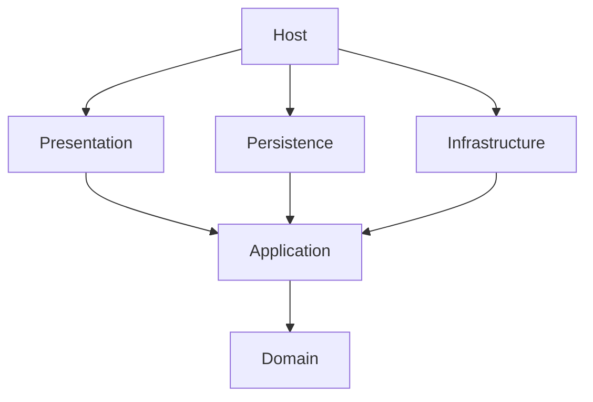
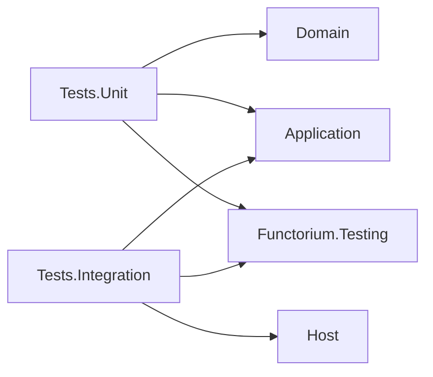

## Introduction

"Should this code go in Domain or Application?"
"What rules should the folder structure and naming follow when adding a new Adapter?"
"In which layer should the Port interface be placed?"

As a project grows, decisions about code placement become increasingly difficult. Without clear project structure rules, layer dependencies become entangled and you must discuss where to add new features every time. This guide provides a consistent answer to the question "WHERE to place code."

### What You Will Learn

Through this document, you will learn:

1. **8개 프로젝트 구성과 의존성 방향** - Domain, Application, Adapter 3개, Host, Tests 2개의 역할과 참조 규칙
2. **코드 배치 3단계 의사결정** - 레이어 결정 → 프로젝트/폴더 결정 → Port 배치 판단
3. **주 목표와 부수 목표 개념** - 각 프로젝트의 핵심 코드와 보조 인프라 구분
4. **Host의 Composition Root 역할** - 레이어 등록 순서와 미들웨어 파이프라인 구성
5. **테스트 프로젝트 구성** - 단위 테스트와 통합 테스트의 폴더 구조 및 설정

### Prerequisites

A basic understanding of the following concepts is required to understand this document:

- 헥사고날 아키텍처(Ports and Adapters)의 기본 개념
- .NET 프로젝트 참조(`ProjectReference`)와 NuGet 패키지 참조
- DI(Dependency Injection) 컨테이너의 기본 원리

> **The core of project structure is** establishing consistent rules for code placement, maintaining dependency direction from outside to inside between layers.

## Summary

### Key Commands

```bash
# 빌드
dotnet build {ServiceName}.slnx

# 테스트
dotnet test --solution {ServiceName}.slnx

# 아키텍처 테스트 (의존성 방향 검증)
# LayerDependencyArchitectureRuleTests로 자동 검증
```

### Key Procedures

**1. 코드 배치 결정 (3단계):**
1. **레이어 결정** — 비즈니스 규칙(Domain), 유스케이스 조율(Application), 기술적 구현(Adapter)
2. **프로젝트 및 폴더 결정** — 코드 유형별 프로젝트/폴더 매핑 테이블 참조
3. **Port 배치 판단** — 도메인 타입만 사용하면 Domain, 외부 DTO 포함하면 Application

**2. 새 서비스 프로젝트 생성:**
1. Domain 프로젝트 (AssemblyReference.cs, Using.cs, AggregateRoots/)
2. Application 프로젝트 (Usecases/, Ports/)
3. Adapter 3개 (Presentation, Persistence, Infrastructure)
4. Host 프로젝트 (Program.cs — 레이어 등록)
5. Tests.Unit + Tests.Integration

### Key Concepts

| Concept | Description |
|------|------|
| 8개 프로젝트 구성 | Domain, Application, Adapter 3개, Host, Tests 2개 |
| 의존성 방향 | 바깥 → 안쪽 (Host → Adapter → Application → Domain) |
| 주 목표 / 부수 목표 | 주 목표는 비즈니스/기술 코드, 부수 목표는 DI 등록 등 보조 인프라 |
| Abstractions/ 폴더 | Adapter 프로젝트의 부수 목표 (Registrations/, Options/, Extensions/) |
| Port 위치 | Aggregate 전용 CRUD → Domain, 외부 시스템 → Application |

---

## Overview

This guide covers the **project structure** of a service — folder names, file placement, and dependency direction.
"HOW to implement" is delegated to other guides, and we focus only on "WHERE to place."

| WHERE (이 가이드) | HOW (참조 가이드) |
|---|---|
| AggregateRoots 폴더 구조 | [06a-aggregate-design.md](../domain/06a-aggregate-design) (설계) + [06b-entity-aggregate-core.md](../domain/06b-entity-aggregate-core) (핵심 패턴) + [06c-entity-aggregate-advanced.md](../domain/06c-entity-aggregate-advanced) (고급 패턴) |
| ValueObjects 위치 규칙 | [05a-value-objects.md](../domain/05a-value-objects) — 값 객체 구현 패턴 |
| Specifications 위치 규칙 | [10-specifications.md](../domain/10-specifications) — Specification 패턴 구현 |
| Domain Ports 위치 결정 기준 | [12-ports.md](../adapter/12-ports) — Port 아키텍처와 설계 원칙 |
| Usecases 폴더/파일 네이밍 | [11-usecases-and-cqrs.md](../application/11-usecases-and-cqrs) — 유스케이스 구현 |
| Abstractions/Registrations 구조 | [14a-adapter-pipeline-di.md](../adapter/14a-adapter-pipeline-di) — DI 등록 코드 패턴 |
| WHY (모듈 매핑 근거) | [04-ddd-tactical-overview.md §6](../domain/04-ddd-tactical-overview) — Module과 프로젝트 구조 매핑 |

### Overall Project Structure Overview

The following 서비스를 구성하는 8개 프로젝트의 전체 구조와 각 프로젝트의 역할입니다.

A service is divided into `Src/` (source) and `Tests/` (test) folders, consisting of 8 projects total.

```
{ServiceRoot}/
├── Src/                              ← 소스 프로젝트
│   ├── {ServiceName}/                ← Host (Composition Root)
│   ├── {ServiceName}.Domain/
│   ├── {ServiceName}.Application/
│   ├── {ServiceName}.Adapters.Presentation/
│   ├── {ServiceName}.Adapters.Persistence/
│   └── {ServiceName}.Adapters.Infrastructure/
└── Tests/                            ← 테스트 프로젝트
    ├── {ServiceName}.Tests.Unit/
    └── {ServiceName}.Tests.Integration/
```

| # | Project | Name Pattern | SDK | Role |
|---|---------|----------|-----|------|
| 1 | Domain | `{ServiceName}.Domain` | `Microsoft.NET.Sdk` | Domain model, Aggregate, Value Object, Port |
| 2 | Application | `{ServiceName}.Application` | `Microsoft.NET.Sdk` | Use cases (Command/Query/EventHandler), external Port |
| 3 | Adapter: Presentation | `{ServiceName}.Adapters.Presentation` | `Microsoft.NET.Sdk` | HTTP endpoints (FastEndpoints) |
| 4 | Adapter: Persistence | `{ServiceName}.Adapters.Persistence` | `Microsoft.NET.Sdk` | Repository implementation |
| 5 | Adapter: Infrastructure | `{ServiceName}.Adapters.Infrastructure` | `Microsoft.NET.Sdk` | External API, Mediator, OpenTelemetry, Pipeline |
| 6 | Host | `{ServiceName}` | `Microsoft.NET.Sdk.Web` | Composition Root (Program.cs) |
| 7 | Tests.Unit | `{ServiceName}.Tests.Unit` | `Microsoft.NET.Sdk` | Domain/Application unit tests |
| 8 | Tests.Integration | `{ServiceName}.Tests.Integration` | `Microsoft.NET.Sdk` | HTTP endpoint integration tests |

### Project Naming Rules

```
{ServiceName}                          ← Host
{ServiceName}.Domain                   ← Domain 레이어
{ServiceName}.Application              ← Application 레이어
{ServiceName}.Adapters.{Category}      ← Adapter 레이어 (Presentation | Persistence | Infrastructure)
{ServiceName}.Tests.Unit               ← 단위 테스트
{ServiceName}.Tests.Integration        ← 통합 테스트
```

### Project Dependency Direction



**csproj reference example:**

```xml
<!-- Host → 모든 Adapter + Application -->
<ProjectReference Include="..\LayeredArch.Adapters.Infrastructure\..." />
<ProjectReference Include="..\LayeredArch.Adapters.Persistence\..." />
<ProjectReference Include="..\LayeredArch.Adapters.Presentation\..." />
<ProjectReference Include="..\LayeredArch.Application\..." />

<!-- Adapter → Application (간접적으로 Domain 포함) -->
<ProjectReference Include="..\LayeredArch.Application\..." />

<!-- Application → Domain -->
<ProjectReference Include="..\LayeredArch.Domain\..." />
```

> **Rules:** 의존성은 항상 바깥에서 안쪽으로만 향합니다. Domain은 아무것도 참조하지 않고, Application은 Domain만, Adapter는 Application만 참조합니다.

### Inter-Project Reference Rules Matrix

The following matrix summarizes which project can reference which project.

| From \ To | Domain | Application | Presentation | Persistence | Infrastructure | Host |
|-----------|--------|-------------|--------------|-------------|----------------|------|
| **Domain** | — | ✗ | ✗ | ✗ | ✗ | ✗ |
| **Application** | ✓ | — | ✗ | ✗ | ✗ | ✗ |
| **Presentation** | (전이) | ✓ | — | ✗ | ✗ | ✗ |
| **Persistence** | (전이) | ✓ | ✗ | — | ✗ | ✗ |
| **Infrastructure** | (전이) | ✓ | ✗ | ✗ | — | ✗ |
| **Host** | (전이) | ✓ | ✓ | ✓ | ✓ | — |

- **✓**: 직접 참조 허용 (csproj `ProjectReference`)
- **✗**: 참조 금지
- **(전이)**: 직접 참조 없음, 상위 참조를 통한 전이 참조로 타입 접근
- **—**: 자기 자신

**Core Principles:**

1. **Domain은 아무것도 참조하지 않습니다** — 순수한 비즈니스 규칙만 포함
2. **Application은 Domain만 직접 참조합니다** — 유스케이스 조율 레이어
3. **Adapter는 Application만 직접 참조합니다** — Domain은 Application 전이 참조로 접근
4. **Adapter 간 상호 참조는 금지합니다** — Presentation, Persistence, Infrastructure는 서로 독립
5. **Host만 모든 레이어를 참조할 수 있습니다** — Composition Root 역할

> **Verification:** 이 매트릭스는 `LayerDependencyArchitectureRuleTests` 아키텍처 테스트로 자동 검증됩니다.

### Test Projects 의존성



Now that we understand the dependency direction and reference rules, let us examine the files common to all projects.

## Common Project Files

All projects include two common files.

### AssemblyReference.cs

A reference point for assembly scanning. Placed in all projects with the same pattern.

```csharp
using System.Reflection;

namespace {ServiceName}.{Layer};

public static class AssemblyReference
{
    public static readonly Assembly Assembly = typeof(AssemblyReference).Assembly;
}
```

**Namespace examples:**

| Project | 네임스페이스 |
|---------|------------|
| Domain | `{ServiceName}.Domain` |
| Application | `{ServiceName}.Application` |
| Adapters.Presentation | `{ServiceName}.Adapters.Presentation` |
| Adapters.Persistence | `{ServiceName}.Adapters.Persistence` |
| Adapters.Infrastructure | `{ServiceName}.Adapters.Infrastructure` |

**Purpose:** FluentValidation 자동 등록, Mediator 핸들러 스캔 등 `Assembly` 참조가 필요한 곳에서 사용합니다.

```csharp
// 사용 예 — Infrastructure Registration에서
services.AddValidatorsFromAssembly(AssemblyReference.Assembly);
services.AddValidatorsFromAssembly(LayeredArch.Application.AssemblyReference.Assembly);
```

### Using.cs

A global using declaration file for each layer. The file name is unified as `Using.cs` across all projects.

| Project | global using 내용 |
|---------|------------------|
| Domain | LanguageExt, Functorium.Domains.*, 자체 SharedModels |
| Application | LanguageExt, Functorium.Applications.Usecases, FluentValidation, 자체 SharedModels |
| Adapters.Presentation | FastEndpoints, Mediator, LanguageExt.Common |
| Adapters.Persistence | LanguageExt, Domain Aggregate, 자체 SharedModels |
| Adapters.Infrastructure | FluentValidation, 자체 SharedModels |

<details>
<summary>Complete Using.cs Code by Layer</summary>

**Domain — Using.cs**
```csharp
global using LanguageExt;
global using LanguageExt.Common;
global using Functorium.Domains.Entities;
global using Functorium.Domains.Events;
global using Functorium.Domains.ValueObjects;
global using Functorium.Domains.ValueObjects.Validations.Typed;
global using LayeredArch.Domain.SharedModels.ValueObjects;
```

**Application — Using.cs**
```csharp
global using LanguageExt;
global using LanguageExt.Common;
global using static LanguageExt.Prelude;
global using Functorium.Applications.Usecases;
global using Functorium.Domains.ValueObjects.Validations.Typed;
global using Functorium.Domains.ValueObjects.Validations.Contextual;
global using FluentValidation;
global using LayeredArch.Domain.SharedModels.ValueObjects;
```

**Adapters.Presentation — Using.cs**
```csharp
global using LanguageExt.Common;
global using FastEndpoints;
global using Mediator;
```

**Adapters.Persistence — Using.cs**
```csharp
global using LanguageExt;
global using LanguageExt.Common;
global using LayeredArch.Domain.AggregateRoots.Products;
global using static LanguageExt.Prelude;
global using LayeredArch.Domain.SharedModels.ValueObjects;
```

**Adapters.Infrastructure — Using.cs**
```csharp
global using FluentValidation;
global using LayeredArch.Domain.SharedModels.ValueObjects;
```

</details>

## Primary and Secondary Objectives

Each project (layer) has **primary and** **secondary objectives.**

- **Primary Objective** — The reason the layer exists. Business logic or core technology implementation code is located here.
- **Secondary Objective** — Supporting infrastructure for the layer. DI registration, extension methods, etc. are located here.

| Project | 주 목표 폴더 | 부수 목표 폴더 |
|---------|------------|------------|
| Domain | `AggregateRoots/`, `SharedModels/`, `Ports/` | *(없음)* |
| Application | `Usecases/`, `Ports/` | *(없음)* |
| Adapters.Presentation | `Endpoints/` | `Abstractions/` (Registrations/, Extensions/) |
| Adapters.Persistence | `Repositories/` (InMemory/, EfCore/) | `Abstractions/` (Options/, Registrations/) |
| Adapters.Infrastructure | `ExternalApis/`, ... | `Abstractions/` (Registrations/) |

### Abstractions Folder Rules

Secondary objectives of Adapter projects are placed under the `Abstractions/` folder.

```
Abstractions/
├── Options/              ← Adapter 구성 옵션 (appsettings.json 바인딩, 필요 시)
│   └── {Category}Options.cs
├── Registrations/        ← DI 서비스 등록 확장 메서드
│   └── Adapter{Category}Registration.cs
└── Extensions/           ← 공유 확장 메서드 (필요 시)
    └── {Name}Extensions.cs
```

| Folder | Purpose | Example |
|------|------|------|
| `Options/` | appsettings.json 바인딩 Options 클래스 | `PersistenceOptions`, `FtpOptions` |
| `Registrations/` | DI 서비스 등록 확장 메서드 | `AdapterPersistenceRegistration` |
| `Extensions/` | 공유 확장 메서드 | `FinResponseExtensions` |

> **Caution:** Domain과 Application에는 `Abstractions/` 폴더가 없습니다. [FAQ 참조](#faq)

If common files form the foundation of a project, the code placement guide determines where new code should be located.

## Code Placement Decision Guide

When writing new code, decide "where to place this code?" in 3 steps.

### Step 1. Layer Decision

```
새 코드 작성
├─ 비즈니스 규칙인가? → Domain Layer
├─ 유스케이스 조율인가? → Application Layer
└─ 기술적 구현인가? → Adapter Layer
```

### Step 2. Project and Folder Decision

| Code Type | Project | Folder |
|-----------|---------|------|
| Entity, Aggregate Root | Domain | `AggregateRoots/{Aggregate}/` |
| Value Object (단일 Aggregate) | Domain | `AggregateRoots/{Aggregate}/ValueObjects/` |
| Value Object (공유) | Domain | `SharedModels/ValueObjects/` |
| Domain Event | Domain | `AggregateRoots/{Aggregate}/Events/` |
| Domain Service | Domain | `SharedModels/Services/` |
| Repository Port (영속성) | Domain | `AggregateRoots/{Aggregate}/Ports/` |
| 교차 Aggregate 읽기 전용 Port | Domain | `Ports/` |
| Command / Query | Application | `Usecases/{Feature}/` |
| Event Handler | Application | `Usecases/{Feature}/` |
| Application Port (외부 시스템) | Application | `Ports/` |
| HTTP Endpoint | Presentation | `Endpoints/{Feature}/` |
| Repository implementation체 | Persistence | `Repositories/` |
| Query Adapter 구현체 | Persistence | `Repositories/Dapper/` |
| 외부 API 서비스 | Infrastructure | `ExternalApis/` |
| 횡단 관심사 (Mediator 등) | Infrastructure | `Abstractions/Registrations/` |

> 각 프로젝트의 상세 폴더 구조는 [Domain 레이어](#domain-레이어), [Application 레이어](#application-레이어), [Adapter 레이어](#adapter-레이어) 섹션을 참조하세요.

### Step 3. Port Placement Decision

Port interfaces are a frequent decision point, so they are organized separately.

```
Port 인터페이스
├─ 메서드 시그니처가 도메인 타입만 사용? → Domain
│  ├─ 특정 Aggregate 전용 CRUD? → AggregateRoots/{Agg}/Ports/
│  └─ 교차 Aggregate 읽기 전용? → Ports/ (프로젝트 루트)
└─ 외부 DTO나 기술적 관심사 포함? → Application/Ports/
```

> Port 배치의 상세 기준은 [FAQ §Port를 Domain에 둘지 Application에 둘지](#port를-domain에-둘지-application에-둘지-판단-기준)와 [12-ports.md](../adapter/12-ports)를 참조하세요.

## Domain Layer

### Primary Objective Folders

```
{ServiceName}.Domain/
├── AggregateRoots/       ← Aggregate Root별 하위 폴더
├── SharedModels/         ← 교차 Aggregate 공유 타입
├── Ports/                ← 교차 Aggregate Port 인터페이스
├── AssemblyReference.cs
└── Using.cs
```

### AggregateRoots Internal Structure

Each Aggregate Root has its own folder, and the internal structure is as follows.

```
AggregateRoots/
├── Products/
│   ├── Product.cs                 ← Aggregate Root Entity
│   ├── Entities/                  ← 이 Aggregate의 자식 Entity (필요 시)
│   │   └── ProductVariant.cs
│   ├── Ports/
│   │   └── IProductRepository.cs  ← 이 Aggregate 전용 Port
│   ├── Specifications/
│   │   ├── ProductNameUniqueSpec.cs    ← 이 Aggregate 전용 Specification
│   │   ├── ProductPriceRangeSpec.cs
│   │   └── ProductLowStockSpec.cs
│   └── ValueObjects/
│       ├── ProductName.cs         ← 이 Aggregate 전용 Value Object
│       └── ProductDescription.cs
├── Customers/
│   ├── Customer.cs
│   ├── Ports/
│   │   └── ICustomerRepository.cs
│   ├── Specifications/
│   │   └── CustomerEmailSpec.cs
│   └── ValueObjects/
│       ├── CustomerName.cs
│       └── Email.cs
└── Orders/
    ├── Order.cs
    ├── Entities/
    │   └── OrderLine.cs           ← 자식 Entity
    ├── Ports/
    │   └── IOrderRepository.cs
    └── ValueObjects/
        └── ShippingAddress.cs
```

**Rules:**
- Aggregate Root 파일(`{Aggregate}.cs`)은 해당 폴더의 루트에 배치
- Aggregate의 자식 Entity는 `{Aggregate}/Entities/` 에 배치
- Aggregate 전용 Port는 `{Aggregate}/Ports/` 에 배치
- Aggregate 전용 Value Object는 `{Aggregate}/ValueObjects/` 에 배치
- Aggregate 전용 Specification은 `{Aggregate}/Specifications/` 에 배치

### SharedModels Internal Structure

Types shared across multiple Aggregates are placed here.

```
SharedModels/
├── Entities/
│   └── Tag.cs                ← 공유 Entity
├── Events/
│   └── TagEvents.cs          ← 공유 Domain Event
└── ValueObjects/
    ├── Money.cs              ← 공유 Value Object
    ├── Quantity.cs
    └── TagName.cs
```

### Ports (Cross-Aggregate)

Ports that do not belong to a single Aggregate and are referenced by other Aggregates are placed in the `Ports/` folder at the project root.

```
Ports/
└── IProductCatalog.cs    ← Order에서 Product 검증용으로 사용
```

**Port 위치 결정 기준:**

| Criteria | Location | Example |
|------|------|------|
| 특정 Aggregate 전용 CRUD | `AggregateRoots/{Aggregate}/Ports/` | `IProductRepository` |
| 교차 Aggregate 읽기 전용 | `Ports/` (프로젝트 루트) | `IProductCatalog` |

## Application Layer

### Primary Objective Folders

```
{ServiceName}.Application/
├── Usecases/             ← Aggregate별 유스케이스
├── Ports/                ← 외부 시스템 Port 인터페이스
├── AssemblyReference.cs
└── Using.cs
```

### Usecases Internal Structure

Organized by Aggregate subfolders.

```
Usecases/
├── Products/
│   ├── CreateProductCommand.cs
│   ├── UpdateProductCommand.cs
│   ├── DeductStockCommand.cs
│   ├── GetProductByIdQuery.cs
│   ├── GetAllProductsQuery.cs
│   ├── OnProductCreated.cs        ← Event Handler
│   ├── OnProductUpdated.cs
│   └── OnStockDeducted.cs
├── Customers/
│   ├── CreateCustomerCommand.cs
│   ├── GetCustomerByIdQuery.cs
│   └── OnCustomerCreated.cs
└── Orders/
    ├── CreateOrderCommand.cs
    ├── GetOrderByIdQuery.cs
    └── OnOrderCreated.cs
```

**File Naming Rules:**

| Type | Pattern | Example |
|------|------|------|
| Command | `{동사}{Aggregate}Command.cs` | `CreateProductCommand.cs` |
| Query | `{Get 등}{설명}Query.cs` | `GetAllProductsQuery.cs` |
| Event Handler | `On{Event명}.cs` | `OnProductCreated.cs` |

### Ports — Difference from Domain Ports

| Criteria | Domain Port | Application Port |
|------|------------|-----------------|
| Location | `Domain/AggregateRoots/{Aggregate}/Ports/` 또는 `Domain/Ports/` | `Application/Ports/` |
| Implemented by | Primarily Persistence Adapter | Primarily Infrastructure Adapter |
| Role | Domain object persistence/retrieval | External system calls (API, messaging, etc.) |
| Example | `IProductRepository`, `IProductCatalog` | `IExternalPricingService` |

## Adapter Layer

### Three-Way Split Principle

Adapters are always split into 3 projects.

| Project | Concern | 헥사고날 역할 | 대표 폴더 |
|---------|--------|---------------|----------|
| `Adapters.Presentation` | HTTP 입출력 | **Driving** (Outside → Inside) | `Endpoints/` |
| `Adapters.Persistence` | 데이터 저장/조회 | **Driven** (Inside → Outside) | `Repositories/` |
| `Adapters.Infrastructure` | 외부 API, 횡단 관심사(Observability, Mediator 등) | **Driven** (Inside → Outside) | `ExternalApis/`, ... |

> Driving/Driven 구분과 Presentation에 Port가 없는 설계 결정의 근거는 [12-ports.md](../adapter/12-ports)의 "Driving vs Driven Adapter 구분" 참조.

### Primary Objective Folders가 고정되지 않는 이유

The primary objective folder name of an Adapter varies depending on the implementation technology. Presentation은 `Endpoints/`가 되지만, gRPC라면 `Services/`가 될 수 있습니다. Persistence도 ORM에 따라 `Repositories/`, `DbContexts/` 등 다양합니다. **폴더 이름은 구현 기술을 반영합니다.**

### Adapters.Presentation 구조

```
{ServiceName}.Adapters.Presentation/
├── Endpoints/
│   ├── Products/
│   │   ├── Dtos/                        ← Endpoint 간 공유 DTO
│   │   │   └── ProductSummaryDto.cs
│   │   ├── CreateProductEndpoint.cs
│   │   ├── UpdateProductEndpoint.cs
│   │   ├── DeductStockEndpoint.cs
│   │   ├── GetProductByIdEndpoint.cs
│   │   └── GetAllProductsEndpoint.cs
│   ├── Customers/
│   │   ├── CreateCustomerEndpoint.cs
│   │   └── GetCustomerByIdEndpoint.cs
│   └── Orders/
│       ├── CreateOrderEndpoint.cs
│       └── GetOrderByIdEndpoint.cs
├── Abstractions/
│   ├── Registrations/
│   │   └── AdapterPresentationRegistration.cs
│   └── Extensions/
│       └── FinResponseExtensions.cs
├── AssemblyReference.cs
└── Using.cs
```

**Endpoints Folder Rules:** Aggregate별 하위 폴더, 엔드포인트 파일명은 `{동사}{Aggregate}Endpoint.cs` 패턴을 따릅니다. 여러 Endpoint에서 공유하는 DTO가 있으면 `Dtos/` 하위 폴더에 배치합니다. 각 Endpoint의 Request/Response DTO는 Endpoint 클래스 내부에 nested record로 정의합니다.

### Adapters.Persistence 구조

```
{ServiceName}.Adapters.Persistence/
├── Repositories/                    ← 구현 기술별 하위 폴더
│   ├── InMemory/                    ← InMemory(ConcurrentDictionary) 구현
│   │   ├── Products/
│   │   │   ├── InMemoryProductRepository.cs
│   │   │   ├── InMemoryProductCatalog.cs    ← 교차 Aggregate Port 구현
│   │   │   ├── InMemoryProductQuery.cs
│   │   │   ├── InMemoryProductDetailQuery.cs
│   │   │   ├── InMemoryProductWithStockQuery.cs
│   │   │   └── InMemoryProductWithOptionalStockQuery.cs
│   │   ├── Customers/
│   │   │   ├── InMemoryCustomerRepository.cs
│   │   │   ├── InMemoryCustomerDetailQuery.cs
│   │   │   ├── InMemoryCustomerOrderSummaryQuery.cs
│   │   │   └── InMemoryCustomerOrdersQuery.cs
│   │   ├── Orders/
│   │   │   ├── InMemoryOrderRepository.cs
│   │   │   ├── InMemoryOrderDetailQuery.cs
│   │   │   └── InMemoryOrderWithProductsQuery.cs
│   │   ├── Inventories/
│   │   │   ├── InMemoryInventoryRepository.cs
│   │   │   └── InMemoryInventoryQuery.cs
│   │   ├── Tags/
│   │   │   └── InMemoryTagRepository.cs
│   │   └── InMemoryUnitOfWork.cs
│   ├── Dapper/                      ← Dapper 기반 Query Adapter (CQRS Read 측)
│   │   ├── DapperProductQuery.cs
│   │   ├── DapperProductWithStockQuery.cs
│   │   ├── DapperProductWithOptionalStockQuery.cs
│   │   ├── DapperInventoryQuery.cs
│   │   ├── DapperCustomerOrderSummaryQuery.cs
│   │   ├── DapperCustomerOrdersQuery.cs
│   │   └── DapperOrderWithProductsQuery.cs
│   └── EfCore/                      ← EF Core 기반 구현 (선택)
│       ├── Models/                  ← Persistence Model (POCO, primitive 타입만)
│       │   ├── ProductModel.cs
│       │   ├── OrderModel.cs
│       │   ├── CustomerModel.cs
│       │   └── TagModel.cs
│       ├── Mappers/                 ← 도메인 ↔ Model 변환 (확장 메서드)
│       │   ├── ProductMapper.cs
│       │   ├── OrderMapper.cs
│       │   ├── CustomerMapper.cs
│       │   └── TagMapper.cs
│       ├── Configurations/
│       │   ├── ProductConfiguration.cs
│       │   ├── OrderConfiguration.cs
│       │   ├── CustomerConfiguration.cs
│       │   └── TagConfiguration.cs
│       ├── {ServiceName}DbContext.cs
│       ├── EfCoreProductRepository.cs
│       ├── EfCoreOrderRepository.cs
│       ├── EfCoreCustomerRepository.cs
│       └── EfCoreProductCatalog.cs
├── Abstractions/
│   ├── Options/                     ← Adapter 구성 옵션 (선택)
│   │   └── PersistenceOptions.cs
│   └── Registrations/
│       └── AdapterPersistenceRegistration.cs
├── AssemblyReference.cs
└── Using.cs
```

> **Note**: `Repositories/EfCore/`와 `Abstractions/Options/`는 EF Core 기반 영속화를 사용할 때 추가합니다. InMemory만 사용하는 경우 `Repositories/InMemory/`와 `Abstractions/Registrations/`만 있으면 됩니다. EF Core 사용 시 `Models/`(Persistence Model)과 `Mappers/`(도메인 ↔ Model 변환)가 함께 추가됩니다.

### Adapters.Infrastructure 구조

```
{ServiceName}.Adapters.Infrastructure/
├── ExternalApis/
│   └── ExternalPricingApiService.cs   ← Application Port 구현
├── Abstractions/
│   └── Registrations/
│       └── AdapterInfrastructureRegistration.cs
├── AssemblyReference.cs
└── Using.cs
```

### Secondary Objective: Abstractions/

DI registration extension methods are placed in the `Abstractions/Registrations/` folder of each Adapter.

**Registration Method Naming Rules:**

| Method | Pattern |
|--------|------|
| 서비스 등록 | `RegisterAdapter{Category}(this IServiceCollection)` |
| 미들웨어 설정 | `UseAdapter{Category}(this IApplicationBuilder)` |

```csharp
// AdapterPresentationRegistration.cs
public static IServiceCollection RegisterAdapterPresentation(this IServiceCollection services) { ... }
public static IApplicationBuilder UseAdapterPresentation(this IApplicationBuilder app) { ... }

// AdapterPersistenceRegistration.cs — Options 패턴 사용 시 IConfiguration 파라미터 추가
public static IServiceCollection RegisterAdapterPersistence(this IServiceCollection services, IConfiguration configuration) { ... }
public static IApplicationBuilder UseAdapterPersistence(this IApplicationBuilder app) { ... }

// AdapterInfrastructureRegistration.cs
public static IServiceCollection RegisterAdapterInfrastructure(this IServiceCollection services, IConfiguration configuration) { ... }
public static IApplicationBuilder UseAdapterInfrastructure(this IApplicationBuilder app) { ... }
```

> **Note**: `IConfiguration` 파라미터는 Options 패턴(`RegisterConfigureOptions`)을 사용하는 Adapter에서 필요합니다. Options 패턴 상세는 [14a-adapter-pipeline-di.md §4.6](../adapter/14a-adapter-pipeline-di#options-패턴-optionsconfigurator)을 참조하세요.

Now that we understand the folder structure of each layer, let us examine the Host project that assembles all layers.

## Host Project

### Role (Composition Root)

The Host project is the only project that assembles all layers. SDK는 `Microsoft.NET.Sdk.Web`을 사용합니다.

### Program.cs Layer Registration Order

```csharp
var builder = WebApplication.CreateBuilder(args);

// 레이어별 서비스 등록
builder.Services
    .RegisterAdapterPresentation()
    .RegisterAdapterPersistence(builder.Configuration)
    .RegisterAdapterInfrastructure(builder.Configuration);

// App 빌드 및 미들웨어 설정
var app = builder.Build();

app.UseAdapterInfrastructure()
   .UseAdapterPersistence()
   .UseAdapterPresentation();

app.Run();
```

**Registration Order:** Presentation → Persistence → Infrastructure (서비스 등록)
**Middleware Order:** Infrastructure → Persistence → Presentation (미들웨어 설정)

### Registration Order Rationale

**Service Registration Order** (Presentation → Persistence → Infrastructure):

| Order | Adapter | Rationale |
|------|---------|------|
| 1 | Presentation | 외부 의존성 없음 (FastEndpoints만 등록) |
| 2 | Persistence | Configuration 필요, DB Context/Repository 등록 |
| 3 | Infrastructure | Mediator, Validation, OpenTelemetry, Pipeline 등록 — Pipeline이 앞서 등록된 Adapter를 래핑하므로 마지막 |

- 핵심: Infrastructure가 마지막인 이유는 `ConfigurePipelines(p => p.UseObservability().UseValidation().UseException())`이 이전 단계에서 등록된 모든 Adapter Pipeline을 활성화하기 때문

**미들웨어 순서** (Infrastructure → Persistence → Presentation):

| Order | Adapter | Rationale |
|------|---------|------|
| 1 | Infrastructure | 관찰성 미들웨어 — 가장 바깥쪽에서 모든 요청/응답 캡처 |
| 2 | Persistence | DB 초기화 (`EnsureCreated`) |
| 3 | Presentation | 엔드포인트 매핑 (`UseFastEndpoints`) — 가장 안쪽, 실제 요청 처리 |

- 원칙: 먼저 등록된 미들웨어가 요청 파이프라인의 바깥쪽에 위치

### Environment-Specific Configuration

- File Structure: `appsettings.json` (기본) + `appsettings.{Environment}.json` (오버라이드)

| Category | 방법 | Example |
|------|------|------|
| 설정값 분기 | `appsettings.{Environment}.json` | Persistence.Provider, OpenTelemetry 설정 |
| 코드 분기 | `app.Environment.IsDevelopment()` | 진단 엔드포인트, Swagger |
| Options 패턴 | `RegisterConfigureOptions<T, TValidator>()` | 시작 시 검증 + 자동 로깅 |

- 원칙: 설정값으로 분기 가능하면 appsettings 사용, 코드 분기는 개발 전용 엔드포인트 등 코드 레벨 차이에만 사용

### Middleware Pipeline Extension Points

운영 요구사항 추가 시 미들웨어 삽입 위치:

```
① 예외 처리 (가장 바깥쪽) — app.UseExceptionHandler()
② 관찰성                  — app.UseAdapterInfrastructure()
③ 보안 (HTTPS, CORS, 인증) — app.UseHttpsRedirection() / UseCors() / UseAuthentication() / UseAuthorization()
④ 데이터                  — app.UseAdapterPersistence()
⑤ Health Check            — app.MapHealthChecks("/health")
⑥ 엔드포인트 (가장 안쪽)   — app.UseAdapterPresentation()
```

- 참고: 현재 예외 처리는 Adapter Pipeline(`ExceptionHandlingPipeline`)에서 Usecase 레벨로 처리. ASP.NET 미들웨어 레벨 예외 처리는 인프라 오류(직렬화 실패 등)에만 필요

## Test Projects

Test projects are placed under the `Tests/` folder. 테스트 작성 방법론(명명 규칙, AAA 패턴, MTP 설정 등)은 [15a-unit-testing.md](../testing/15a-unit-testing)를 참조하세요.

### Tests.Unit Project

Responsible for unit testing the Domain/Application layers.

**csproj configuration:**

```xml
<ItemGroup>
  <ProjectReference Include="..\..\Src\{ServiceName}.Domain\{ServiceName}.Domain.csproj" />
  <ProjectReference Include="..\..\Src\{ServiceName}.Application\{ServiceName}.Application.csproj" />
  <ProjectReference Include="{path}\Functorium.Testing\Functorium.Testing.csproj" />
</ItemGroup>
```

- 추가 패키지: `NSubstitute` (Mocking)
- 구성 파일: `Using.cs`, `xunit.runner.json`

**Folder structure:**

```
{ServiceName}.Tests.Unit/
├── Domain/                    ← Domain 레이어 미러링
│   ├── SharedModels/          ← ValueObject 테스트
│   ├── {Aggregate}/           ← Aggregate/Entity/ValueObject/Specification 테스트
│   └── ...
├── Application/               ← Application 레이어 미러링
│   ├── {Aggregate}/           ← Usecase 핸들러 테스트
│   └── ...
├── TestIO.cs                  ← FinT<IO, T> Mock 헬퍼
├── Using.cs
└── xunit.runner.json
```

**TestIO Helper:**

Application Usecase 테스트에서 `FinT<IO, T>` 반환값 Mock에 필요한 정적 헬퍼 클래스입니다.

```csharp
internal static class TestIO
{
    public static FinT<IO, T> Succ<T>(T value) => FinT.lift(IO.pure(Fin.Succ(value)));
    public static FinT<IO, T> Fail<T>(Error error) => FinT.lift(IO.pure(Fin.Fail<T>(error)));
}
```

**xunit.runner.json:**

```json
{
  "$schema": "https://xunit.net/schema/current/xunit.runner.schema.json",
  "parallelizeAssembly": false,
  "parallelizeTestCollections": true,
  "methodDisplay": "method",
  "methodDisplayOptions": "replaceUnderscoreWithSpace",
  "diagnosticMessages": true
}
```

> 단위 테스트는 Mock 기반으로 각 테스트가 독립적이므로 `parallelizeTestCollections: true` (병렬 허용)

**Using.cs:**

```csharp
global using Xunit;
global using Shouldly;
global using NSubstitute;
global using LanguageExt;
global using LanguageExt.Common;
global using static LanguageExt.Prelude;
```

### Tests.Integration Project

Responsible for integration testing of HTTP endpoints.

**csproj configuration:**

```xml
<ItemGroup>
  <ProjectReference Include="..\..\Src\{ServiceName}\{ServiceName}.csproj">
    <ExcludeAssets>analyzers</ExcludeAssets>
  </ProjectReference>
  <ProjectReference Include="..\..\Src\{ServiceName}.Application\{ServiceName}.Application.csproj" />
  <ProjectReference Include="{path}\Functorium.Testing\Functorium.Testing.csproj" />
</ItemGroup>
```

- 추가 패키지: `Microsoft.AspNetCore.Mvc.Testing`
- 구성 파일: `Using.cs`, `xunit.runner.json`, `appsettings.json`

> **ExcludeAssets=analyzers:** Host 프로젝트가 Mediator SourceGenerator를 사용하는 경우, 테스트 프로젝트에서도 SourceGenerator가 실행되어 중복 코드가 생성됩니다. `ExcludeAssets=analyzers`로 이를 방지합니다.

**Folder structure:**

```
{ServiceName}.Tests.Integration/
├── Fixtures/
│   ├── {ServiceName}Fixture.cs       ← HostTestFixture<Program> 상속
│   └── IntegrationTestBase.cs        ← IClassFixture + HttpClient 제공
├── Endpoints/                         ← Presentation 레이어 미러링
│   ├── {Aggregate}/
│   │   └── {Endpoint}Tests.cs
│   └── ErrorScenarios/               ← 에러 처리 검증
├── Using.cs
├── xunit.runner.json
└── appsettings.json                   ← OpenTelemetry 설정 필수
```

**Fixture Pattern:**

`HostTestFixture<Program>`을 상속하여 `WebApplicationFactory` 기반 테스트 서버를 구성하고, `IntegrationTestBase`를 통해 `HttpClient`를 주입하는 2단계 패턴입니다.

```csharp
// {ServiceName}Fixture.cs
public class {ServiceName}Fixture : HostTestFixture<Program> { }

// IntegrationTestBase.cs
public abstract class IntegrationTestBase : IClassFixture<{ServiceName}Fixture>
{
    protected HttpClient Client { get; }

    protected IntegrationTestBase({ServiceName}Fixture fixture) => Client = fixture.Client;
}
```

**xunit.runner.json:**

```json
{
  "$schema": "https://xunit.net/schema/current/xunit.runner.schema.json",
  "parallelizeAssembly": false,
  "parallelizeTestCollections": false,
  "maxParallelThreads": 1,
  "methodDisplay": "classAndMethod",
  "methodDisplayOptions": "all",
  "diagnosticMessages": true
}
```

> 통합 테스트는 In-memory 저장소를 공유하므로 `parallelizeTestCollections: false`, `maxParallelThreads: 1` (순차 실행 Required)

**appsettings.json:**

`HostTestFixture`는 "Test" 환경으로 실행하며 ContentRoot를 테스트 프로젝트 경로로 설정합니다. Host 프로젝트의 `appsettings.json`이 아닌 테스트 프로젝트의 `appsettings.json`을 로드하므로, OpenTelemetry 등 Required 설정을 테스트 프로젝트에도 배치해야 합니다.

```json
{
  "OpenTelemetry": {
    "ServiceName": "{ServiceName}",
    "ServiceNamespace": "{ServiceName}",
    "CollectorEndpoint": "http://localhost:18889",
    "CollectorProtocol": "Grpc",
    "TracingEndpoint": "",
    "MetricsEndpoint": "",
    "LoggingEndpoint": "",
    "SamplingRate": 1.0,
    "EnablePrometheusExporter": false
  }
}
```

**Using.cs:**

```csharp
global using Xunit;
global using Shouldly;
global using System.Net;
global using System.Net.Http.Json;
```

## Namespace Rules

Namespaces are determined by the project root namespace + folder path.

| 폴더 경로 | 네임스페이스 |
|----------|------------|
| `Domain/` | `{ServiceName}.Domain` |
| `Domain/AggregateRoots/Products/` | `{ServiceName}.Domain.AggregateRoots.Products` |
| `Domain/AggregateRoots/Products/Ports/` | `{ServiceName}.Domain.AggregateRoots.Products` *(Port는 Aggregate 네임스페이스)* |
| `Domain/AggregateRoots/Products/Specifications/` | `{ServiceName}.Domain.AggregateRoots.Products.Specifications` |
| `Domain/AggregateRoots/Products/ValueObjects/` | `{ServiceName}.Domain.AggregateRoots.Products.ValueObjects` |
| `Domain/SharedModels/ValueObjects/` | `{ServiceName}.Domain.SharedModels.ValueObjects` |
| `Domain/SharedModels/Services/` | `{ServiceName}.Domain.SharedModels.Services` |
| `Domain/Ports/` | `{ServiceName}.Domain.Ports` |
| `Application/Usecases/Products/` | `{ServiceName}.Application.Usecases.Products` |
| `Application/Ports/` | `{ServiceName}.Application.Ports` |
| `Adapters.Presentation/Endpoints/Products/` | `{ServiceName}.Adapters.Presentation.Endpoints.Products` |
| `Adapters.Presentation/Abstractions/Registrations/` | `{ServiceName}.Adapters.Presentation.Abstractions.Registrations` |
| `Adapters.Persistence/Repositories/InMemory/` | `{ServiceName}.Adapters.Persistence.Repositories.InMemory` |
| `Adapters.Persistence/Repositories/Dapper/` | `{ServiceName}.Adapters.Persistence.Repositories.Dapper` |
| `Adapters.Persistence/Repositories/EfCore/` | `{ServiceName}.Adapters.Persistence.Repositories.EfCore` |
| `Adapters.Persistence/Repositories/EfCore/Configurations/` | `{ServiceName}.Adapters.Persistence.Repositories.EfCore.Configurations` |
| `Adapters.Persistence/Abstractions/Registrations/` | `{ServiceName}.Adapters.Persistence.Abstractions.Registrations` |
| `Adapters.Infrastructure/ExternalApis/` | `{ServiceName}.Adapters.Infrastructure.ExternalApis` |
| `Adapters.Infrastructure/Abstractions/Registrations/` | `{ServiceName}.Adapters.Infrastructure.Abstractions.Registrations` |
| `Tests.Unit/Domain/SharedModels/` | `{ServiceName}.Tests.Unit.Domain.SharedModels` |
| `Tests.Unit/Domain/{Aggregate}/` | `{ServiceName}.Tests.Unit.Domain.{Aggregate}` |
| `Tests.Unit/Application/{Aggregate}/` | `{ServiceName}.Tests.Unit.Application.{Aggregate}` |
| `Tests.Integration/Fixtures/` | `{ServiceName}.Tests.Integration.Fixtures` |
| `Tests.Integration/Endpoints/{Aggregate}/` | `{ServiceName}.Tests.Integration.Endpoints.{Aggregate}` |

## New Service Project Creation Checklist

1. **Domain 프로젝트**
   - [ ] `{ServiceName}.Domain` 프로젝트 생성 (SDK: `Microsoft.NET.Sdk`)
   - [ ] `AssemblyReference.cs` 추가
   - [ ] `Using.cs` 추가
   - [ ] `AggregateRoots/` 폴더 생성
   - [ ] `SharedModels/` 폴더 생성 (필요 시)
   - [ ] `Ports/` 폴더 생성 (교차 Aggregate Port가 있을 경우)

2. **Application 프로젝트**
   - [ ] `{ServiceName}.Application` 프로젝트 생성
   - [ ] `AssemblyReference.cs` 추가
   - [ ] `Using.cs` 추가
   - [ ] `Usecases/` 폴더 생성
   - [ ] `Ports/` 폴더 생성 (외부 시스템 Port가 있을 경우)
   - [ ] Domain 프로젝트 참조 추가

3. **Adapters.Presentation 프로젝트**
   - [ ] `{ServiceName}.Adapters.Presentation` 프로젝트 생성
   - [ ] `AssemblyReference.cs` 추가
   - [ ] `Using.cs` 추가
   - [ ] `Endpoints/` 폴더 생성
   - [ ] `Abstractions/Registrations/AdapterPresentationRegistration.cs` 추가
   - [ ] Application 프로젝트 참조 추가

4. **Adapters.Persistence 프로젝트**
   - [ ] `{ServiceName}.Adapters.Persistence` 프로젝트 생성
   - [ ] `AssemblyReference.cs` 추가
   - [ ] `Using.cs` 추가
   - [ ] `Repositories/` 폴더 생성
   - [ ] `Abstractions/Registrations/AdapterPersistenceRegistration.cs` 추가
   - [ ] Application 프로젝트 참조 추가

5. **Adapters.Infrastructure 프로젝트**
   - [ ] `{ServiceName}.Adapters.Infrastructure` 프로젝트 생성
   - [ ] `AssemblyReference.cs` 추가
   - [ ] `Using.cs` 추가
   - [ ] `Abstractions/Registrations/AdapterInfrastructureRegistration.cs` 추가
   - [ ] Application 프로젝트 참조 추가

6. **Host 프로젝트**
   - [ ] `{ServiceName}` 프로젝트 생성 (SDK: `Microsoft.NET.Sdk.Web`)
   - [ ] 모든 Adapter + Application 프로젝트 참조 추가
   - [ ] `Program.cs` — 레이어 등록 메서드 호출 추가

7. **Tests.Unit 프로젝트**
   - [ ] `{ServiceName}.Tests.Unit` 프로젝트 생성
   - [ ] `Using.cs` 추가
   - [ ] `xunit.runner.json` 추가 (parallelizeTestCollections: true)
   - [ ] `TestIO.cs` 헬퍼 추가
   - [ ] Domain + Application + Functorium.Testing 참조 추가
   - [ ] `Domain/` 폴더 구조 생성 (소스 미러링)
   - [ ] `Application/` 폴더 구조 생성 (소스 미러링)

8. **Tests.Integration 프로젝트**
   - [ ] `{ServiceName}.Tests.Integration` 프로젝트 생성
   - [ ] `Using.cs` 추가
   - [ ] `xunit.runner.json` 추가 (parallelizeTestCollections: false, maxParallelThreads: 1)
   - [ ] `appsettings.json` 추가 (OpenTelemetry 설정)
   - [ ] Host(ExcludeAssets=analyzers) + Application + Functorium.Testing 참조 추가
   - [ ] `Fixtures/` 폴더 생성 (Fixture + IntegrationTestBase)
   - [ ] `Endpoints/` 폴더 구조 생성 (Presentation 미러링)

## Troubleshooting

### When Circular References Occur Between Projects

**Cause:** Adapter 프로젝트 간 상호 참조 또는 Domain/Application이 Adapter를 참조하는 경우 발생합니다.

**Solution:**
1. 의존성 방향 매트릭스를 확인합니다 — 의존성은 항상 바깥에서 안쪽으로만 향해야 합니다
2. `LayerDependencyArchitectureRuleTests` 아키텍처 테스트를 실행하여 위반 지점을 확인합니다
3. 공유가 필요한 타입은 더 안쪽 레이어(Domain 또는 Application)로 이동합니다

### When Unsure Where to Place a Value Object

**Cause:** Value Object가 여러 Aggregate에서 사용되는지 판단이 어려운 경우입니다.

**Solution:**
1. 처음에는 `AggregateRoots/{Aggregate}/ValueObjects/`에 배치합니다
2. 다른 Aggregate에서 참조가 필요해지면 `SharedModels/ValueObjects/`로 이동합니다
3. 이동 시 네임스페이스가 변경되므로 `Using.cs`의 global using을 업데이트합니다

### When Mediator SourceGenerator Duplication Error Occurs in Integration Tests

**Cause:** Tests.Integration 프로젝트가 Host 프로젝트를 참조하면서 SourceGenerator가 테스트 프로젝트에서도 실행됩니다.

**Solution:**
```xml
<ProjectReference Include="..\..\Src\{ServiceName}\{ServiceName}.csproj">
  <ExcludeAssets>analyzers</ExcludeAssets>
</ProjectReference>
```

---

## FAQ

### Why Domain Has No Abstractions/ Folder

Domain 레이어에는 부수 목표가 없습니다. Domain은 순수한 비즈니스 규칙만 포함하며, DI 등록이나 프레임워크 설정 같은 인프라 관심사가 존재하지 않기 때문입니다. Application도 동일한 이유로 Abstractions가 없습니다.

### Why Adapter Primary Objective Folder Names Are Not Fixed

The primary objective folder name of an Adapter varies depending on the implementation technology. 예를 들어 Presentation이 FastEndpoints를 사용하면 `Endpoints/`, gRPC를 사용하면 `Services/`가 됩니다. 반면 부수 목표 폴더(`Abstractions/`)는 기술과 무관하게 항상 같은 이름을 사용합니다.

### Criteria for Placing Value Objects Between SharedModels and AggregateRoots

- **하나의 Aggregate에서만 사용** → `AggregateRoots/{Aggregate}/ValueObjects/`
  - 예: `ProductName`, `ProductDescription` → `Products/ValueObjects/`
- **여러 Aggregate에서 공유** → `SharedModels/ValueObjects/`
  - 예: `Money`, `Quantity` → `SharedModels/ValueObjects/`

Initially place as Aggregate-specific, and move to SharedModels when sharing becomes necessary.

### Criteria for Placing Ports in Domain or Application

- **도메인 객체의 영속성/조회** → Domain의 `AggregateRoots/{Aggregate}/Ports/` 또는 `Ports/`
  - 예: `IProductRepository`, `IProductCatalog`
- **외부 시스템 통합** → Application의 `Ports/`
  - 예: `IExternalPricingService`

핵심 기준: 인터페이스의 메서드 시그니처가 도메인 타입만 사용하면 Domain, 외부 DTO나 기술적 관심사를 포함하면 Application에 배치합니다.

### Infrastructure에 Observability 설정이 들어가는 이유

Observability(OpenTelemetry, Serilog 등)는 횡단 관심사로, 특정 Adapter 카테고리에 속하지 않습니다. Infrastructure Adapter가 Mediator, Validator, OpenTelemetry, Pipeline 등 횡단 관심사를 종합적으로 관리하는 역할을 담당하기 때문에 이곳에 배치합니다.

### 통합 테스트에서 Host 참조 시 ExcludeAssets=analyzers가 필요한 이유

Host 프로젝트가 Mediator SourceGenerator를 사용하는 경우, 테스트 프로젝트에서도 SourceGenerator가 실행되어 중복 코드가 생성됩니다. `ExcludeAssets=analyzers`로 이를 방지합니다.

### 통합 테스트에 appsettings.json이 필요한 이유

`HostTestFixture`는 ContentRoot를 테스트 프로젝트 경로로 설정합니다. Host 프로젝트의 `appsettings.json`이 아닌 테스트 프로젝트의 `appsettings.json`을 로드하므로, OpenTelemetry 등 Required 설정을 테스트 프로젝트에도 배치해야 합니다.

### 단위 테스트와 통합 테스트의 병렬 실행 설정이 다른 이유

단위 테스트는 Mock 기반으로 각 테스트가 독립적이므로 병렬 실행이 가능합니다. 통합 테스트는 In-memory 저장소를 공유하므로 테스트 간 상태 간섭을 방지하기 위해 순차 실행합니다.

## Reference Documents

- [02-solution-configuration.md](./02-solution-configuration) — 솔루션 루트 구성 파일 및 빌드 스크립트
- [06a-aggregate-design.md](../domain/06a-aggregate-design) — Aggregate 설계 원칙, [06b-entity-aggregate-core.md](../domain/06b-entity-aggregate-core) — Entity/Aggregate 핵심 패턴, [06c-entity-aggregate-advanced.md](../domain/06c-entity-aggregate-advanced) — 고급 패턴
- [05a-value-objects.md](../domain/05a-value-objects) — 값 객체 구현 패턴, [05b-value-objects-validation.md](../domain/05b-value-objects-validation) — 열거형·검증·FAQ
- [10-specifications.md](../domain/10-specifications) — Specification 패턴 구현
- [11-usecases-and-cqrs.md](../application/11-usecases-and-cqrs) — 유스케이스 (Command/Query) 구현
- [12-ports.md](../adapter/12-ports) — Port 아키텍처, [13-adapters.md](../adapter/13-adapters) — Adapter 구현, [14a-adapter-pipeline-di.md](../adapter/14a-adapter-pipeline-di) — Pipeline/DI, [14b-adapter-testing.md](../adapter/14b-adapter-testing) — 테스트
- [08a-error-system.md](../domain/08a-error-system) — 에러 시스템: 기초와 네이밍
- [08b-error-system-domain-app.md](../domain/08b-error-system-domain-app) — 에러 시스템: Domain/Application 에러
- [08c-error-system-adapter-testing.md](../domain/08c-error-system-adapter-testing) — 에러 시스템: Adapter 에러와 테스트
- [08-observability.md](../../spec/08-observability) — Observability 사양
- [15a-unit-testing.md](../testing/15a-unit-testing) — 테스트 작성 방법론 (명명 규칙, AAA 패턴, MTP 설정)
- [16-testing-library.md](../testing/16-testing-library) — Functorium.Testing 라이브러리 (LogTestContext, ArchitectureRules, QuartzTestFixture 등)
