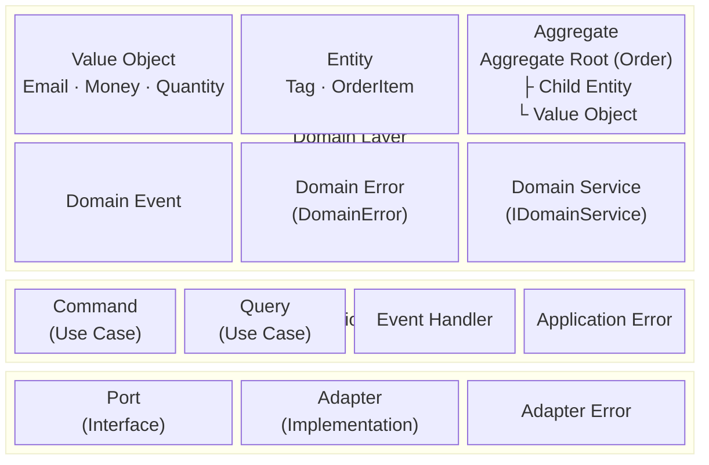

This document provides the complete picture of decomposing domain complexity into clear building blocks and mapping each building block to Functorium framework types.

## Introduction

"Should this logic go in an Entity or a Service?"
"Where should the Aggregate boundary be set?"
"Should validation failure be thrown as an exception or returned as a result type?"

DDD tactical design is a building block system that provides consistent answers to these questions. This document draws the complete map of those building blocks and maps how the Functorium framework implements each building block as types.

### What You Will Learn

Through this document, you will learn:

1. **The complete structure of DDD tactical design building blocks** - Roles and relationships of Value Object, Entity, Aggregate, Domain Event, etc.
2. **Type mapping with the Functorium framework** - Functorium types and namespaces corresponding to each building block
3. **Layer architecture and building block placement rules** - Responsibilities and dependency direction for Domain, Application, and Adapter layers
4. **Modules and project structure** - Layer (horizontal) x Module (vertical) dual-axis placement strategy
5. **Ubiquitous language and naming guide** - Central index of naming patterns for all building blocks

### Prerequisites

A basic understanding of the following concepts is required to understand this document:

- DDD strategic design concepts (Bounded Context, Ubiquitous Language)
- Basic C# syntax (classes, interfaces, generics)
- Layer structure from the [Project Structure Guide](../architecture/01-project-structure)

> The core of DDD tactical design is "decomposing domain complexity into clear building blocks and consistently maintaining the responsibilities and placement of each building block." Functorium enforces these building blocks through the type system, ensuring design decisions are directly reflected in the code.

## Summary

### Key Commands

```csharp
// Value Object creation
var email = Email.Create("user@example.com");

// Entity/Aggregate creation
var order = Order.Create(productId, quantity, unitPrice, shippingAddress);

// Domain event publishing
order.AddDomainEvent(new CreatedEvent(order.Id, productId, quantity, totalAmount));

// Specification composition
var spec = priceRange & !lowStock;

// Domain Service usage (within Usecase)
private readonly OrderCreditCheckService _creditCheckService = new();
```

### Key Procedures

1. **Define Value Object**: Inherit `SimpleValueObject<T>`, implement `Create()` + `Validate()`
2. **Define Entity/Aggregate**: Inherit `AggregateRoot<TId>`, apply `[GenerateEntityId]` attribute
3. **Define Domain Event**: Inherit `DomainEvent` as a nested `sealed record` within the Aggregate
4. **Define Specification**: Inherit `ExpressionSpecification<T>`, implement `ToExpression()`
5. **Define Domain Service**: Implement `IDomainService` marker interface, write as pure function (default) or with Repository usage (Evans Ch.9)
6. **Implement Usecase**: Inherit `ICommandUsecase<T,R>` / `IQueryUsecase<T,R>`, orchestrate with `FinT<IO, T>` LINQ chain

### Key Concepts

| Concept | Description | Functorium Type |
|------|------|----------------|
| Value Object | Immutable, value equality, self-validation | `SimpleValueObject<T>`, `ValueObject` |
| Entity / Aggregate | ID equality, consistency boundary | `Entity<TId>`, `AggregateRoot<TId>` |
| Domain Event | Past tense, immutable, inter-Aggregate communication | `IDomainEvent`, `DomainEvent` |
| Domain Service | Cross-Aggregate domain logic | `IDomainService` |
| Specification | Business rule encapsulation, composition | `Specification<T>`, `ExpressionSpecification<T>` |
| Error Handling | Railway Oriented Programming | `Fin<T>`, `Validation<Error, T>` |
| Layer Structure | Domain -> Application -> Adapter | Dependency rule: inner layers cannot reference outer layers |

---

## Why DDD Tactical Design

### Managing Domain Complexity

The essential complexity of software comes from the domain. DDD tactical design manages this complexity by **decomposing it into clear building blocks.** Each building block has clear roles and responsibilities, providing developers with consistent answers to the question "Where should this code be placed?"

### Aligning Ubiquitous Language with Code

DDD emphasizes that domain experts and developers should use the same language. When domain terms like `Email`, `Order`, and `Product` are directly expressed as types in code, the code itself becomes the domain model.

### Explicit Expression of Business Rules

Business rules like "Is the email format valid?", "Is stock sufficient?", and "Is the order status transition valid?" are placed in specific building blocks (Value Object, Entity, Aggregate), making the location and responsibility of each rule clear.

### Code Without vs With Tactical Design

Without tactical design, business logic is scattered throughout the service layer. Email format validation is performed differently in the controller, service, and repository, making it impossible to answer the question "Where is this rule managed?"

When tactical design is applied, each rule is placed in a clear building block. Email format validation belongs to the `Email` Value Object, stock shortage validation to the `Inventory` Aggregate, and order creation orchestration to the Usecase, so the code structure alone reveals where responsibilities lie.

We have examined why DDD tactical design is needed. In the next section, we will explore what each building block is and which types implement them in the Functorium framework.

## DDD Tactical Design Building Blocks (WHAT)

### Complete Building Block Map



### Roles and Relationships of Each Building Block

| Building Block | Role | Characteristics |
|----------|------|------|
| **Value Object** | Value representation of domain concepts | Immutable, value equality, self-validation |
| **Entity** | Domain object with an identifier | ID equality, mutable, lifecycle |
| **Aggregate** | Object group with consistency boundary | Transaction unit, invariant protection |
| **Domain Event** | Important occurrence in the domain | Past tense, immutable, inter-Aggregate communication |
| **Domain Service** | Cross-Aggregate domain logic (pure or with Repository) | Stateless, IDomainService marker |
| **Factory** | Aggregate creation/restoration | Static `Create()`, `CreateFromValidated()` methods |
| **Repository** | Aggregate persistence | Store/retrieve per Aggregate unit |
| **Application Service** | Usecase orchestration | Command/Query, delegates to domain objects |

### Functorium Type Mapping Table

The following table shows the complete mapping between DDD building blocks and Functorium framework types. When implementing a new building block, refer to this table for the corresponding type and namespace.

| DDD Building Block | Functorium Type | Location |
|-------------|----------------|------|
| Value Object | `SimpleValueObject<T>`, `ValueObject`, `ComparableSimpleValueObject<T>` | `Functorium.Domains.ValueObjects` |
| Entity | `Entity<TId>` | `Functorium.Domains.Entities` |
| Aggregate Root | `AggregateRoot<TId>` | `Functorium.Domains.Entities` |
| Entity ID | `IEntityId<T>` + `[GenerateEntityId]` | `Functorium.Domains.Entities` |
| Domain Event | `IDomainEvent`, `DomainEvent` | `Functorium.Domains.Events` |
| Domain Service | `IDomainService` | `Functorium.Domains.Services` |
| Specification | `Specification<T>` | `Functorium.Domains.Specifications` |
| Domain Error | `DomainError`, `DomainErrorType` | `Functorium.Domains.Errors` |
| Command | `ICommandRequest<T>`, `ICommandUsecase<T,R>` | `Functorium.Applications.Usecases` |
| Query | `IQueryRequest<T>`, `IQueryUsecase<T,R>` | `Functorium.Applications.Usecases` |
| Event Handler | `IDomainEventHandler<T>` | `Functorium.Applications.Events` |
| Application Error | `ApplicationError`, `ApplicationErrorType` | `Functorium.Applications.Errors` |
| Port | `IObservablePort` | `Functorium.Abstractions.Observabilities` |
| Repository | `IRepository<TAggregate, TId>` | `Functorium.Domains.Repositories` |
| Adapter | `[GenerateObservablePort]` | Adapter layer project |
| Adapter Error | `AdapterError`, `AdapterErrorType` | `Functorium.Adapters.Errors` |
| Validation | `ValidationRules<T>`, `TypedValidation<T,V>` | `Functorium.Domains.ValueObjects.Validations` |
| Result Type | `Fin<T>`, `Validation<Error, T>`, `FinResponse<T>` | LanguageExt / Functorium |

We have confirmed the roles of building blocks and their Functorium type mappings. In the next section, we will examine how Functorium combines DDD and functional programming, and its design philosophy.

## Functorium Design Philosophy

### Combining DDD and Functional Programming

Functorium combines Domain-Driven Design (DDD) tactical patterns with functional programming. The following table shows how concepts from the two paradigms are unified in Functorium.

| Concept | DDD | Functional Programming | Functorium |
|------|-----|-----------------|------------|
| Value Object | Immutable object, value-based equality | Immutable data structure | `ValueObject`, `SimpleValueObject<T>` |
| Validation | Self-validation object | Type-safe validation | `ValidationRules<T>`, `TypedValidation<T,V>` |
| Error Handling | Exception vs Result | Railway Oriented Programming | `Fin<T>`, `Validation<Error, T>` |

### Functorium Framework Philosophy

1. **Type Safety**: Prevent errors at compile time
2. **Immutability**: All value objects cannot be changed after creation
3. **Self-validation**: Objects in invalid states cannot be created
4. **Explicit Error Handling**: Use result types instead of exceptions

### Core Concepts

#### Value Object

A Value Object is an immutable object whose equality is determined by its property values.

```csharp
// Value Object example: Email (see Quick Start example for full implementation)
public sealed class Email : SimpleValueObject<string>
{
    private Email(string value) : base(value) { }

    public static Fin<Email> Create(string? value) =>
        CreateFromValidation(Validate(value), v => new Email(v));

    public static Validation<Error, string> Validate(string? value) =>
        ValidationRules<Email>.NotEmpty(value ?? "")
            .ThenMatches(EmailPattern)
            .ThenMaxLength(254);
}
```

**Characteristics of Value Objects:**

| Characteristics | Description |
|------|------|
| Immutability | Cannot be changed after creation |
| Value-based equality | Equality determined by property values |
| Self-validation | Validates at creation time |
| Domain logic encapsulation | Includes related operations |

#### Entity

An Entity is a domain object with a unique identifier (ID). Entities with the same ID are considered identical.

```csharp
// Entity example: Order (receives validated VOs to create Aggregate)
[GenerateEntityId]  // Auto-generates OrderId
public sealed class Order : AggregateRoot<OrderId>
{
    public ProductId ProductId { get; private set; }
    public Quantity Quantity { get; private set; }
    public Money UnitPrice { get; private set; }
    public Money TotalAmount { get; private set; }

    private Order(OrderId id, ProductId productId, Quantity quantity,
        Money unitPrice, Money totalAmount) : base(id) { /* ... */ }

    // Create: Receives validated VOs to create new Aggregate
    public static Order Create(
        ProductId productId, Quantity quantity,
        Money unitPrice, ShippingAddress shippingAddress)
    {
        var totalAmount = unitPrice.Multiply(quantity);
        var order = new Order(OrderId.New(), productId, quantity, unitPrice, totalAmount);
        order.AddDomainEvent(new CreatedEvent(order.Id, productId, quantity, totalAmount));
        return order;
    }
}
```

**Entity vs Value Object:**

| Aspect | Entity | Value Object |
|------|--------|--------------|
| Identifier | ID-based equality | Value-based equality |
| Mutability | Mutable | Immutable |
| Lifecycle | Long-term (Repository) | Short-term (ephemeral) |
| Example | Order, User, Product | Money, Email, Address |

#### Immutability and Self-validation

Value objects always exist only in a valid state:

```csharp
// Invalid email cannot be created
var result = Email.Create("invalid");  // Fin<Email> - failure
var result = Email.Create("user@example.com");  // Fin<Email> - success
```

#### Error Handling Strategy (Railway Oriented Programming)

Functorium uses result types instead of exceptions:

```
Input -> [Validation1] -> [Validation2] -> [Validation3] -> Success
              ↓                ↓                ↓
            Failure          Failure          Failure
```

**Two Result Types:**

| Type | Purpose | Features |
|------|------|------|
| `Fin<T>` | Final result | Success or single error |
| `Validation<Error, T>` | Validation result | Success or multiple errors |

## Type Hierarchy

### IValueObject Hierarchy

```
IValueObject (interface)
│
AbstractValueObject (abstract class)
├── GetEqualityComponents() - equality components
├── Equals() / GetHashCode() - value-based equality
└── == / != operators
    │
    └── ValueObject
        ├── CreateFromValidation<TValueObject, TValue>() helper
        │
        ├── SimpleValueObject<T>
        │   ├── protected T Value
        │   ├── CreateFromValidation<TValueObject>() helper
        │   └── explicit operator T
        │
        └── ComparableValueObject
            ├── GetComparableEqualityComponents()
            ├── IComparable<ComparableValueObject>
            ├── < / <= / > / >= operators
            │
            └── ComparableSimpleValueObject<T>
                ├── protected T Value
                ├── CreateFromValidation<TValueObject>() helper
                └── explicit operator T
```

### IEntity Hierarchy

```
IEntity<TId> (interface)
├── TId Id - Entity identifier
├── CreateMethodName constant
└── CreateFromValidatedMethodName constant
    │
    └── Entity<TId> (abstract class)
        ├── Id property (protected init)
        ├── Equals() / GetHashCode() - ID-based equality
        ├── == / != operators
        ├── CreateFromValidation<TEntity, TValue>() helper
        └── GetUnproxiedType() - ORM proxy support
            │
            └── AggregateRoot<TId> : IDomainEventDrain
                ├── DomainEvents (read-only, IHasDomainEvents)
                ├── AddDomainEvent() (protected)
                └── ClearDomainEvents() (IDomainEventDrain)

IEntityId<T> : IParsable<T> (interface) - Ulid-based
├── Ulid Value
├── static T New()
├── static T Create(Ulid)
└── static T Create(string)

IDomainEvent : INotification (interface)
├── DateTimeOffset OccurredAt
├── Ulid EventId
├── string? CorrelationId
└── string? CausationId
    │
    └── DomainEvent (abstract record)
        ├── Default constructor: OccurredAt, EventId auto-set
        └── CorrelationId, CausationId optionally specified

IHasDomainEvents (read-only event query)
└── IDomainEventDrain (internal, event cleanup)
```

### Error Hierarchy

```
Error (LanguageExt)
│
├── DomainError
│   └── DomainErrorType (Presence, Length, Format, DateTime, Numeric, Range, Existence, Transition, Custom)
│
├── ApplicationError
│   └── ApplicationErrorType (Common, Authorization, Validation, Business Rules, Custom)
│
└── AdapterError
    └── AdapterErrorType (Common, Pipeline, External Service, Data, Custom)
```

### Specification Hierarchy

```
Specification<T> (abstract class)
├── abstract bool IsSatisfiedBy(T entity)
├── And() / Or() / Not() composition methods
├── & / | / ! operator overloads
│
├── AndSpecification<T> (internal sealed)
├── OrSpecification<T>  (internal sealed)
├── NotSpecification<T> (internal sealed)
├── ExpressionSpecification<T> (public abstract)
└── AllSpecification<T> (internal sealed)
```

### Relationship Diagram

```
+-------------------+         +-------------------+
|   ValueObject     |         |   Validation      |
|                   |◄────────|  ValidationRules  |
+-------------------+         +-------------------+
         │                             │
         │                             │
         ▼                             ▼
+-------------------+         +-------------------+
|   Fin<T> /        |         |   DomainError     |
|   Validation<E,T> |◄────────|                   |
+-------------------+         +-------------------+
```

Now that we understand the design philosophy and core concepts, let's explore which layer each building block is placed in within an actual project.

## Layer Architecture and Building Block Placement

### Domain Layer

Handles core business logic of the domain. No external dependencies.

- **Building blocks placed**: Value Object, Entity, Aggregate Root, Domain Event, Domain Error, Domain Service, Repository Interface
- **Dependencies**: None (innermost layer)

### Application Layer

Orchestrates use cases. Delegates work to domain objects.

- **Building blocks placed**: Command/Query (Use Case), Event Handler, Application Error, Port Interface
- **Dependencies**: Depends only on Domain Layer

### Adapter Layer

Handles communication with external systems.

- **Building blocks placed**: Adapter implementations, Pipeline (auto-generated), Adapter Error
- **Dependencies**: Depends on Domain Layer and Application Layer

### Dependency Rules

```
Adapter Layer → Application Layer → Domain Layer
(outer)          (middle)            (inner)
```

Inner layers never reference outer layers. When the Application Layer needs Adapter functionality, it defines a Port (interface), and the Adapter Layer implements it.

## Module and Project Structure Mapping

### Evans Module Concept

Eric Evans defines Module as a grouping unit based on **cohesion of domain concepts.** A Module is not a package or namespace but a **semantic boundary.**

| Principle | Description |
|------|------|
| High cohesion | Elements within the same Module express a single domain concept |
| Low coupling | Dependencies between Modules are minimized; communication via Port/Interface when needed |
| Communication | Module names reflect ubiquitous language, conveying domain boundaries through code structure alone |

### Dual Axes: Layer x Module

Functorium places code along dual axes of **Layer (horizontal axis)** and **Module (vertical axis).**

- **Layer** — .csproj unit. Separates technical concerns (Domain, Application, Adapter)
- **Module** — Folder/namespace unit. Maintains cohesion of domain concepts (Products, Orders, etc.)

```
              │ Products  │ Inventories │ Orders  │ Customers │ SharedModels │
──────────────┼───────────┼─────────────┼─────────┼───────────┼──────────────┤
Domain        │ Aggregate │ Aggregate   │Aggregate│ Aggregate │ VO, Entity,  │
(.csproj)     │ VO, Spec  │ Spec        │ VO      │ VO, Spec  │ Event        │
              │ Port      │ Port        │ Port    │ Port      │              │
──────────────┼───────────┼─────────────┼─────────┼───────────┼──────────────┤
Application   │ Command   │ Command     │ Command │ Command   │              │
(.csproj)     │ Query     │ Query       │ Query   │ Query     │              │
              │ EventHdlr │ EventHdlr   │EventHdlr│ EventHdlr │              │
──────────────┼───────────┼─────────────┼─────────┼───────────┼──────────────┤
Adapter       │ Endpoint  │ Endpoint    │Endpoint │ Endpoint  │              │
(.csproj ×3)  │ Repo      │ Repo        │ Repo    │ Repo      │              │
              │ QueryAdpt │ QueryAdpt   │         │           │              │
──────────────┴───────────┴─────────────┴─────────┴───────────┴──────────────┘
```

**Mapping Rules:**

| Axis | Unit | Separation Criteria | Example |
|----|------|----------|------|
| Layer (horizontal) | .csproj | Technical concerns, dependency direction | `LayeredArch.Domain`, `LayeredArch.Application` |
| Module (vertical) | Folder/namespace | Domain concept cohesion | `AggregateRoots/Products/`, `Usecases/Products/` |

### SingleHost Module Boundaries

This is the actual module configuration of the SingleHost project.

| Module | Domain | Application | Adapter |
|--------|--------|-------------|---------|
| **Products** | `AggregateRoots/Products/` (Aggregate, Ports, Specs, VOs) | `Usecases/Products/` (Commands, Queries, Dtos, Ports) | Endpoints, Repository, Query |
| **Inventories** | `AggregateRoots/Inventories/` (Aggregate, Ports, Specs) | `Usecases/Inventories/` (Commands, Queries, Dtos, Ports) | Endpoints, Repository, Query |
| **Orders** | `AggregateRoots/Orders/` (Aggregate, Ports, VOs) | `Usecases/Orders/` (Commands, Queries) | Endpoints, Repository |
| **Customers** | `AggregateRoots/Customers/` (Aggregate, Ports, Specs, VOs) | `Usecases/Customers/` (Commands, Queries) | Endpoints, Repository |
| **SharedModels** | `SharedModels/` (shared VO, Entity, Event) | — | — |

> **Pattern**: Each Module is a **vertical slice** that cuts through all layers from Domain → Application → Adapter. The folder name is the Module name, and the Module name is the ubiquitous language.

### Domain Layer Folder Structure

The domain layer of the host project follows the following folder structure.

**Reference example** (01-SingleHost `LayeredArch.Domain/`):

```
LayeredArch.Domain/
├── AggregateRoots/
│   ├── Customers/
│   │   ├── Customer.cs
│   │   ├── ICustomerRepository.cs
│   │   ├── Specifications/
│   │   │   └── CustomerEmailSpec.cs
│   │   └── ValueObjects/
│   │       ├── CustomerName.cs
│   │       └── Email.cs
│   ├── Inventories/
│   │   ├── Inventory.cs
│   │   ├── IInventoryRepository.cs
│   │   └── Specifications/
│   │       └── InventoryLowStockSpec.cs
│   ├── Orders/
│   │   ├── Order.cs
│   │   ├── IOrderRepository.cs
│   │   └── ValueObjects/
│   │       └── ShippingAddress.cs
│   └── Products/
│       ├── Product.cs
│       ├── IProductRepository.cs
│       ├── Specifications/
│       │   ├── ProductNameSpec.cs
│       │   ├── ProductNameUniqueSpec.cs
│       │   └── ProductPriceRangeSpec.cs
│       └── ValueObjects/
│           ├── ProductDescription.cs
│           └── ProductName.cs
├── SharedModels/
│   ├── Entities/
│   │   ├── Tag.cs
│   │   └── ValueObjects/
│   │       └── TagName.cs
│   ├── Services/
│   │   └── OrderCreditCheckService.cs
│   └── ValueObjects/
│       ├── Money.cs
│       └── Quantity.cs
├── DOMAIN-GLOSSARY.md
├── Using.cs
└── AssemblyReference.cs
```

**Structure Summary**:
- `AggregateRoots/{Aggregate}/` — Aggregate root, repository interface, sub-folders `Specifications/` and `ValueObjects/`
- `SharedModels/` — `Entities/`, `Services/`, `ValueObjects/` shared across multiple Aggregates
- Root — `DOMAIN-GLOSSARY.md`, `Using.cs`, `AssemblyReference.cs`

### Module Cohesion Rules

**Placement within Module (default)**

- Types specific to a particular Aggregate → Inside that Aggregate's folder
- Example: `ProductName` → `AggregateRoots/Products/ValueObjects/`

**Criteria for moving to SharedModels**

- Types shared by 2 or more Aggregates → `SharedModels/`
- Example: `Money`, `Quantity` → `SharedModels/ValueObjects/`

**Criteria for moving to project root**

- Cross-Aggregate Port → `Domain/Ports/` (e.g., `IProductCatalog` — for Product validation from Order)
- Domain Service → `Domain/Services/` (e.g., `OrderCreditCheckService` — cross-Aggregate pure logic)

> Initially place as Aggregate-specific, and move to SharedModels when sharing becomes necessary. For detailed criteria on this rule, see [01-project-structure.md FAQ §3](../architecture/01-project-structure).

### Multi-Aggregate Expansion Guide

This is the 3-stage evolution path of module structure as a service grows.

| Step | Structure | Description |
|------|------|------|
| Stage 1 | **Single Aggregate** | One Aggregate is one Module. SingleHost initial Product structure |
| Stage 2 | **Multi-Aggregate same service** | Multiple Aggregates separated into folders but placed within the same service (process). SingleHost current structure |
| Stage 3 | **Separate Bounded Context** | Modules separated into independent services (.sln). Context Map patterns required |

**Stage 2 → Stage 3 separation criteria:**

| Criteria | Keep same service | Separate into different service |
|------|----------------|----------------|
| Deployment cycle | Same | Independent deployment per Module needed |
| Transaction boundary | Aggregates can share the same DB | Independent DB/schema needed |
| Team ownership | Same team | Different teams develop independently |
| Ubiquitous language | No term conflicts | Same terms with different meanings |
| Data storage | Homogeneous (e.g., all PostgreSQL) | Heterogeneous (e.g., SQL + NoSQL) |

> **Note**: Stage 3 Bounded Context separation patterns (Context Map, ACL, etc.) are covered in §8 Bounded Context Boundary Definition below.

## Ubiquitous Language and Naming Guide

Detailed naming rules for each building block are documented in individual guides. This section serves as a **central index where all building block naming patterns can be referenced in one place.**

### Naming Pattern Reference Table

The following table is a central index that consolidates naming rules for all building blocks in one place. When adding new types, refer to this table to assign consistent names.

| Building Block | Naming Pattern | Example | Detail Reference |
|----------|-----------|------|----------|
| Value Object | `{Concept}` | `ProductName`, `Email` | [05a-value-objects.md](./05a-value-objects) |
| Entity | `{EntityName}` | `Tag` | [06b-entity-aggregate-core.md](./06b-entity-aggregate-core) |
| Aggregate Root | `{Aggregate}` | `Product`, `Order` | [06b-entity-aggregate-core.md](./06b-entity-aggregate-core) |
| Entity ID | `{Aggregate}Id` + `[GenerateEntityId]` | `ProductId`, `OrderId` | [06b-entity-aggregate-core.md](./06b-entity-aggregate-core) |
| Domain Event | `{Aggregate}.{PastTense}Event` (nested record) | `Product.CreatedEvent` | [07-domain-events.md](./07-domain-events) |
| Domain Error | `DomainError.For<{Type}>()` | `DomainError.For<Email>()` | [08b-error-system-domain-app.md](./08b-error-system-domain-app) |
| Domain Service | `{DomainConcept}Service` : `IDomainService` | `OrderCreditCheckService` | [09-domain-services.md](./09-domain-services) |
| Specification | `{Aggregate}{Concept}Spec` | `ProductNameUniqueSpec` | [10-specifications.md](./10-specifications) |
| Command | `{Verb}{Aggregate}Command` (nested Request/Response/Usecase) | `CreateProductCommand` | [11-usecases-and-cqrs.md](../application/11-usecases-and-cqrs) |
| Query | `{Get/Search}{Description}Query` (nested Request/Response/Usecase) | `SearchProductsQuery` | [11-usecases-and-cqrs.md](../application/11-usecases-and-cqrs) |
| Event Handler | `On{DomainEvent}` | `OnProductCreated` | [01-project-structure.md](../architecture/01-project-structure) |
| Repository Interface | `I{Aggregate}Repository` | `IProductRepository` | [12-ports.md](../adapter/12-ports) |
| Repository Impl | `{Technology}{Aggregate}Repository` | `EfCoreProductRepository` | [13-adapters.md](../adapter/13-adapters) |
| Query Adapter Interface | `I{Aggregate}Query` | `IProductQuery` | [12-ports.md](../adapter/12-ports) |
| Query Adapter Impl | `{Technology}{Aggregate}Query` | `DapperProductQuery` | [13-adapters.md](../adapter/13-adapters) |
| Cross-Aggregate Port | `I{Concept}` | `IProductCatalog` | [12-ports.md](../adapter/12-ports) |
| Endpoint | `{Verb}{Aggregate}Endpoint` | `CreateProductEndpoint` | [01-project-structure.md](../architecture/01-project-structure) |
| Persistence Model | `{Aggregate}Model` | `ProductModel` | [13-adapters.md](../adapter/13-adapters) |
| Mapper | `{Aggregate}Mapper` | `ProductMapper` | [13-adapters.md](../adapter/13-adapters) |
| Module (folder) | Plural noun (ubiquitous language) | `Products/`, `Orders/` | §6 |

### Glossary Template

Maintaining a glossary shared between domain experts and developers prevents discrepancies between code naming and business terminology.

| Domain Term | Definition | Code Type | Notes |
|------------|------|----------|------|
| Product | Individual item in the sales catalog | `Product` (Aggregate) | |
| Inventory | Available quantity of a product | `Inventory` (Aggregate) | 1:1 with Product |
| Order | Customer's purchase request | `Order` (Aggregate) | |
| Amount | Currency + numeric combination | `Money` (Value Object) | SharedModels |
| Quantity | Integer value of 0 or greater | `Quantity` (Value Object) | SharedModels |

> **Usage**: Create a per-project glossary in the above format and share with domain experts. When terms change, code type names should be updated accordingly.

### Domain Expert Collaboration

- The glossary is maintained through **iterative agreement** between domain experts and developers.
- Using names in code that differ from domain terms increases communication costs. When term conflicts are discovered, update the glossary immediately and rename the code.
- When adding new building blocks, refer to the naming pattern table above to assign consistent names.

## Bounded Context and Context Map

The current SingleHost project operates multiple Modules (Products, Orders, etc.) **within a single Bounded Context.** This section defines **Context Map patterns** to apply when the service grows and is separated into multiple Bounded Contexts, and identifies precedent patterns that already exist in the current code.

### Context Map Patterns

| Pattern | Description | Functorium Mapping |
|------|------|----------------|
| **Shared Kernel** | Subset of domain model shared by two BCs | `SharedModels/` folder (`Money`, `Quantity`) |
| **Customer-Supplier** | Upstream BC provides API to downstream BC | Not implemented (future inter-service REST API) |
| **Anti-Corruption Layer (ACL)** | Translation layer to prevent external model contamination | `IProductCatalog` Port + EF Core Mapper |
| **Open Host Service** | Public API provided via standard protocol | REST Endpoints |
| **Published Language** | Shared language between BCs (events/schemas) | Domain Events (future Integration Event) |
| **Conformist** | Downstream accepts upstream model as-is | Not implemented |
| **Separate Ways** | Independent operation without BC integration | Not implemented |

### Recognizing Precedent Patterns in SingleHost

Existing code already contains **single-service precedent implementations** of Context Map patterns. These patterns become integration points between BCs when services are separated.

**Shared Kernel → `SharedModels/ValueObjects/`**

Value Objects shared by multiple Modules such as `Money` and `Quantity` are placed in the `SharedModels/` folder. When separating services, a decision is needed to either extract them as NuGet packages or duplicate them in each BC.

**ACL (mini) → `IProductCatalog` Port + Adapter**

When the Order Module queries Product data, it accesses through the `IProductCatalog` Port. Currently it's an EF Core implementation within the same process, but when services are separated, it will be replaced with a remote API call + response translation layer (ACL).

**Domain Events as Published Language**

Currently Domain Events are published via an in-process Mediator. When services are separated, they will transition to Integration Events through a message broker (RabbitMQ, Kafka, etc.), at which point separation of Domain Events and Integration Events becomes necessary.

### Multi-Context Project Structure

This is the conceptual project structure when separating into multiple Bounded Contexts.

```
Services/
├── ProductCatalog/                ← BC 1 (same existing 3-Layer structure)
│   ├── ProductCatalog.Domain/
│   ├── ProductCatalog.Application/
│   └── ProductCatalog.Adapters.*/
├── OrderManagement/               ← BC 2
│   ├── OrderManagement.Domain/
│   ├── OrderManagement.Application/
│   └── OrderManagement.Adapters.*/
SharedModels/                      ← Shared NuGet package
IntegrationEvents/                 ← Published Language (shared event schema between BCs)
```

> Each BC maintains the same 3-Layer structure (Domain → Application → Adapter) from §5. Only inter-BC communication is replaced with Integration Events or REST APIs instead of Cross-Aggregate Ports.

### Relationship to Evolution Path

The Multi-Aggregate Expansion Guide in §6 presented **Stage 3 separation criteria (WHEN).** The Context Map patterns in this section guide **how (HOW)** to implement once separation is decided.

- **WHEN**: Deployment cycle, transaction boundary, team ownership, ubiquitous language conflicts, data storage heterogeneity → §6 criteria table
- **HOW**: Shared Kernel, ACL, Published Language, Open Host Service → Context Map patterns in this section

## Quick Start Example

### Simple Email Value Object

```csharp
using Functorium.Domains.ValueObjects;
using Functorium.Domains.ValueObjects.Validations.Typed;
using System.Text.RegularExpressions;

public sealed class Email : SimpleValueObject<string>
{
    private static readonly Regex EmailPattern = new(
        @"^[a-zA-Z0-9._%+-]+@[a-zA-Z0-9.-]+\.[a-zA-Z]{2,}$",
        RegexOptions.Compiled);
    private const int MaxLength = 254;

    // private constructor - prevents external creation
    private Email(string value) : base(value) { }

    // Factory method
    public static Fin<Email> Create(string? value) =>
        CreateFromValidation(Validate(value), v => new Email(v));

    // Validation method (returns primitive type)
    public static Validation<Error, string> Validate(string? value) =>
        ValidationRules<Email>.NotEmpty(value ?? "")
            .ThenNormalize(v => v.ToLowerInvariant())
            .ThenMatches(EmailPattern)
            .ThenMaxLength(MaxLength);

    // Implicit conversion (optional)
    public static implicit operator string(Email email) => email.Value;
}
```

### Usage Example

```csharp
// Success
var email = Email.Create("User@Example.COM");
email.IfSucc(e => Console.WriteLine(e));  // user@example.com

// Failure
var invalid = Email.Create("invalid-email");
invalid.IfFail(e => Console.WriteLine(e.Code));  // DomainErrors.Email.InvalidFormat
```

### Test Example

```csharp
using Functorium.Testing.Assertions.Errors;
using static Functorium.Domains.Errors.DomainErrorType;

[Fact]
public void Create_ShouldFail_WhenEmailIsEmpty()
{
    // Arrange
    var emptyEmail = "";

    // Act
    var result = Email.Create(emptyEmail);

    // Assert
    result.ShouldBeDomainError<Email, Email>(new Empty());
}

[Fact]
public void Create_ShouldSucceed_WhenEmailIsValid()
{
    // Arrange
    var validEmail = "user@example.com";

    // Act
    var result = Email.Create(validEmail);

    // Assert
    result.IsSucc.ShouldBeTrue();
}
```

## Guide Document Index

| Document | Description | Key Content |
|------|------|----------|
| [05a-value-objects.md](./05a-value-objects) | Value Object implementation | Base classes, validation system, implementation patterns, practical examples |
| [05b-value-objects-validation.md](./05b-value-objects-validation) | Value Object validation and enums | Enum implementation, Application validation, FAQ |
| [06a-aggregate-design.md](./06a-aggregate-design) | Aggregate design | Design principles, boundary setting, anti-patterns |
| [06b-entity-aggregate-core.md](./06b-entity-aggregate-core) | Entity/Aggregate core patterns | Class hierarchy, ID system, creation patterns, domain events |
| [06c-entity-aggregate-advanced.md](./06c-entity-aggregate-advanced) | Entity/Aggregate advanced patterns | Cross-Aggregate relationships, auxiliary interfaces, practical examples |
| [07-domain-events.md](./07-domain-events) | Domain events | Event definition, publishing, handler implementation |
| [08a-error-system.md](./08a-error-system) | Error system: basics and naming | Error handling principles, Fin patterns, naming rules |
| [08b-error-system-domain-app.md](./08b-error-system-domain-app) | Error system: Domain/Application errors | Domain/Application/Event error definition and testing |
| [08c-error-system-adapter-testing.md](./08c-error-system-adapter-testing) | Error system: Adapter errors and testing | Adapter errors, Custom errors, testing best practices, checklists |
| [11-usecases-and-cqrs.md](../application/11-usecases-and-cqrs) | Usecase implementation | CQRS pattern, Apply merging |
| [12-ports.md](../adapter/12-ports) | Port architecture | Port definition, IObservablePort hierarchy |
| [13-adapters.md](../adapter/13-adapters) | Adapter implementation | Repository, External API, Messaging, Query |
| [14a-adapter-pipeline-di.md](../adapter/14a-adapter-pipeline-di) | Adapter integration | Pipeline, DI, Options |
| [14b-adapter-testing.md](../adapter/14b-adapter-testing) | Adapter testing | Unit tests, E2E Walkthrough |
| [09-domain-services.md](./09-domain-services) | Domain services | IDomainService, cross-Aggregate logic, Usecase integration |
| [10-specifications.md](./10-specifications) | Specification pattern | Business rule encapsulation, And/Or/Not composition, Repository integration |
| [15a-unit-testing.md](../testing/15a-unit-testing) | 단위 테스트 | 테스트 규칙, 네이밍, 체크리스트 |
| [16-testing-library.md](../testing/16-testing-library) | 테스트 라이브러리 | 로그/아키텍처/소스생성기/Job 테스트 |


## 실전 예제 프로젝트

LayeredArch 예제 프로젝트에서 실제 구현을 확인할 수 있습니다:

| Concept | 예제 파일 |
|------|----------|
| 값 객체 | `Tests.Hosts/01-SingleHost/LayeredArch.Domain/ValueObjects/` |
| Entity | `Tests.Hosts/01-SingleHost/LayeredArch.Domain/Entities/Product.cs` |
| Repository | `Tests.Hosts/01-SingleHost/Src/LayeredArch.Domain/AggregateRoots/Products/Ports/IProductRepository.cs` |
| Repository (공통) | `Src/Functorium/Domains/Repositories/IRepository.cs` |
| Usecase | `Tests.Hosts/01-SingleHost/LayeredArch.Application/Usecases/Products/` |
| Domain Service | `Tests.Hosts/01-SingleHost/Src/LayeredArch.Domain/Services/OrderCreditCheckService.cs` |
| Specification | `Tests.Hosts/01-SingleHost/Src/LayeredArch.Domain/AggregateRoots/Products/Specifications/` |
| Adapter | `Tests.Hosts/01-SingleHost/LayeredArch.Adapters.Persistence/Repositories/` |

## Troubleshooting

### Value Object의 Create()가 항상 실패한다

**Cause:** `Validate()` 메서드에서 `null`이나 빈 문자열을 처리하지 않거나, 정규식 패턴이 잘못되었을 수 있습니다.

**Solution:** `Validate()` 메서드에서 `null` 처리를 확인하고, `ValidationRules<T>.NotEmpty(value ?? "")` 패턴을 사용하세요. 정규식 패턴은 별도 단위 테스트로 검증하세요.

### Entity의 ID가 비교되지 않는다 (동등성 실패)

**Cause:** `[GenerateEntityId]` 어트리뷰트 없이 직접 ID 타입을 정의했거나, `IEntityId<T>`를 구현하지 않았을 수 있습니다.

**Solution:** Entity ID는 반드시 `[GenerateEntityId]` 소스 생성기를 사용하세요. 소스 생성기가 `Equals()`, `GetHashCode()`, `==`, `!=` 연산자를 자동 생성합니다.

### 도메인 로직을 어디에 배치해야 할지 모르겠다

**Cause:** 빌딩블록 간 역할 구분이 명확하지 않을 때 발생합니다.

**Solution:** 다음 판단 기준을 따르세요:
1. 단일 Aggregate 내부 → Entity 메서드 또는 Value Object
2. 여러 Aggregate 참조 + I/O 없음 → Domain Service
3. I/O 필요 (Repository, 외부 API) → Usecase에서 조율
4. 상태 변경 후 부수 효과 → Domain Event + Event Handler

---

## FAQ

### Q1. Value Object와 Entity의 Optional 기준은?

식별자(ID)가 필요한지 여부가 핵심입니다. `Money`, `Email`처럼 값 자체로 동등성을 판단하면 Value Object, `Order`, `Product`처럼 고유 ID로 추적해야 하면 Entity입니다. 일반적으로 Value Object가 더 많고, Entity가 소수여야 합니다.

### Q2. Aggregate 경계를 어떻게 설정하나요?

하나의 트랜잭션에서 일관성을 보장해야 하는 범위가 Aggregate 경계입니다. Aggregate를 작게 유지하고, Aggregate 간 참조는 ID만 사용하세요. 상세 설계 원칙은 [06a-aggregate-design.md](./06a-aggregate-design)를 참조하세요.

### Q3. SharedModels에 배치해야 할 타입의 기준은?

2개 이상의 Aggregate에서 공유하는 Value Object나 Entity가 대상입니다. 처음에는 특정 Aggregate 내부에 배치하고, 실제로 공유가 필요해진 시점에 `SharedModels/`로 이동하세요.

### Q4. `Fin<T>`와 `Validation<Error, T>`는 언제 사용하나요?

`Fin<T>`는 최종 결과(성공 또는 단일 에러)에, `Validation<Error, T>`는 검증 결과(여러 에러 누적)에 사용합니다. Value Object의 `Create()`는 `Fin<T>`를, `Validate()`는 `Validation<Error, T>`를 반환합니다.

### Q5. 다중 Bounded Context로 분리하는 시점은?

배포 주기가 다르거나, 팀 소유권이 분리되거나, 동일 용어가 다른 의미로 쓰이거나, 이종 데이터 저장소가 필요한 경우 분리를 검토하세요. 분리 방법은 Context Map 패턴(Shared Kernel, ACL, Published Language 등)을 적용합니다.

---

## Reference Documents

- [LanguageExt](https://github.com/louthy/language-ext) - 함수형 프로그래밍 라이브러리
- [Ardalis.SmartEnum](https://github.com/ardalis/SmartEnum) - 타입 안전한 열거형
