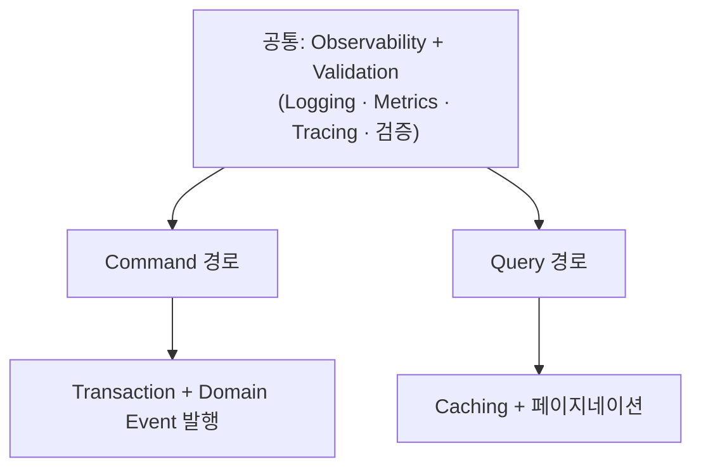
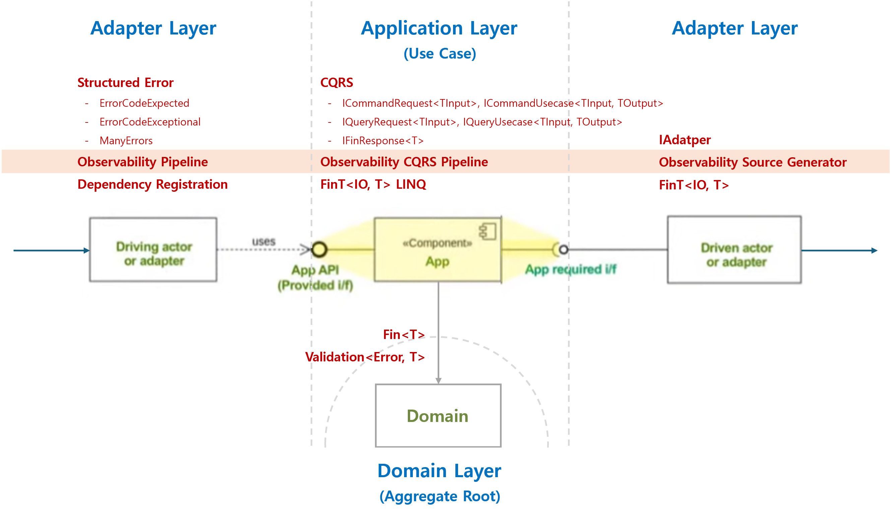

import { Card, CardGrid, LinkCard, Steps, Aside } from '@astrojs/starlight/components';

**6개 전문 AI 에이전트가** 요구사항 분석부터 테스트까지 7단계 워크플로를 안내합니다. 각 단계에서 설계 문서와 컴파일 가능한 C# 코드가 동시에 생성됩니다. 엔터프라이즈 DDD를 실천하는 .NET 팀, 개발과 운영의 언어 격차를 해소하려는 팀, 함수형 DDD 아키텍처를 체계적으로 도입하려는 아키텍트를 위해 설계되었습니다.

## 풀고자 하는 문제

<div class="problem-card">
  <span class="text-problem">예외가 곧 비즈니스 로직</span>
  비즈니스 규칙의 성공과 실패가 예외로 처리되어, 흐름을 예측하기 어렵고 합성이 불가능합니다.
</div>
<div class="problem-card">
  <span class="text-problem">개발 언어 ≠ 운영 언어</span>
  기능 명세와 운영 요구가 서로 다른 체계로 관리되면서, 공통 언어가 정립되지 못하고 해석 차이가 누적됩니다.
</div>
<div class="problem-card">
  <span class="text-problem">Observability는 항상 사후 보완</span>
  로그, 메트릭, 추적 정보가 구현 완료 후 별도로 부착되면서, 장애 발생 시 원인 분석에 필요한 맥락이 누락됩니다.
</div>

이는 단순히 프로세스의 문제가 아니라, **설계 철학과 구조의 문제입니다.**

Mediator, LanguageExt, FluentValidation, OpenTelemetry는 각각 훌륭합니다.
하지만 이들을 일관된 DDD 아키텍처로 통합하려면 에러 전파, 파이프라인 순서, 관측성 경계, 타입 제약에 대한 수백 가지 결정이 필요합니다.
**Functorium은 이 결정을 한 번, 일관되게 내립니다** — 그리고 **AI 에이전트가 이 결정을 프로젝트에 자동으로 적용합니다.**

---

## AI가 문제를 돌파하는 방법

**6개 전문 AI 에이전트가** 요구사항 분석부터 테스트까지 7단계 워크플로를 안내합니다.
각 단계에서 설계 문서와 컴파일 가능한 C# 코드가 동시에 생성됩니다.

<div class="solution-card">
  <span class="text-solution">예외 없는 순수 도메인</span>
  **domain-architect**가 비즈니스 불변식을 분류하고 타입으로 매핑합니다. `Fin<T>`, `FinT<IO, T>`로 결과와 사이드 이펙트를 타입 수준에서 명시하고, LINQ 합성으로 도메인 흐름을 구성합니다.
</div>
<div class="solution-card">
  <span class="text-solution">단일 도메인 언어로 통합</span>
  **product-analyst**가 유비쿼터스 언어를 추출하고 코드/문서/메트릭에 일관 반영합니다. Bounded Context를 명확히 정의하여 도메인 개념이 코드, 문서, 운영 메트릭에 일관되게 반영됩니다.
</div>
<div class="solution-card">
  <span class="text-solution">설계에 내재된 Observability</span>
  **observability-engineer**가 KPI→메트릭 매핑, 대시보드, 알림을 설계합니다. OpenTelemetry 기반 Logging, Metrics, Tracing이 유스케이스 파이프라인에 자동 적용됩니다.
</div>

### 7단계 워크플로

```
project-spec                    : PRD 작성, 유비쿼터스 언어, Aggregate 경계 도출
  → architecture-design         : 프로젝트 구조, 레이어 구성, 인프라 결정
  → domain-develop              : Value Object, Entity, Aggregate, Specification 구현
  → application-develop         : CQRS 유스케이스, Port 설계 및 구현
  → adapter-develop             : Repository, Query Adapter, Endpoint, DI 등록
  → observability-develop       : KPI→메트릭 매핑, 대시보드, 알림, ctx.* 전파
  → test-develop                : 단위/통합/아키텍처 규칙 테스트 작성
  → domain-review               : 기존 코드 DDD 리뷰 및 개선 방향 제시
```

각 단계는 **4단계 문서 패턴**을 따릅니다. 모든 설계 결정에는 추적 가능한 근거가 남습니다:

```
00-business-requirements        : 비즈니스 규칙 정의
  →  01-type-design-decisions   : 불변식 → 타입 매핑
  →  02-code-design             : C# 패턴 설계
  →  03-implementation-results  : 컴파일 가능한 코드 + 테스트
```

### 6개 전문 에이전트

| 에이전트 | 전문 영역 |
|---------|----------|
| **product-analyst** | PRD 작성, 유비쿼터스 언어 정의, Aggregate 경계 도출 |
| **domain-architect** | 불변식 분류, Functorium 타입 매핑, Always-valid 패턴 설계 |
| **application-architect** | CQRS 유스케이스 분해, 포트 식별, FinT LINQ 합성 설계 |
| **adapter-engineer** | Repository, Query Adapter, Endpoint, DI 등록, Observable Port 구현 |
| **observability-engineer** | KPI→메트릭 매핑, 대시보드 설계, 알림 패턴, ctx.* 전파 전략 |
| **test-engineer** | 단위/통합/아키텍처 규칙/Observability 검증 테스트 |

---

## AI가 생성하는 코드: 함수형 아키텍처

### CQRS와 함수형 합성

Command 경로의 Repository는 `FinT<IO, T>`를 반환하여 사이드 이펙트를 명시적으로 표현합니다. Query 경로는 Aggregate 재구성 없이 DTO를 직접 프로젝션합니다:

```csharp
// Command: IRepository — Aggregate Root 단위 CRUD, EF Core로 변경 추적과 트랜잭션 관리
public interface IRepository<TAggregate, TId> : IObservablePort
    where TAggregate : AggregateRoot<TId>
    where TId : struct, IEntityId<TId>
{
    FinT<IO, TAggregate> Create(TAggregate aggregate);
    FinT<IO, TAggregate> GetById(TId id);
    FinT<IO, TAggregate> Update(TAggregate aggregate);
    FinT<IO, int> Delete(TId id);
}
```

```csharp
// Query: IQueryPort — Aggregate 재구성 없이 DTO 직접 프로젝션, Dapper로 경량 SQL 매핑
public interface IQueryPort<TEntity, TDto> : IQueryPort
{
    FinT<IO, PagedResult<TDto>> Search(
        Specification<TEntity> spec, PageRequest page, SortExpression sort);

    FinT<IO, CursorPagedResult<TDto>> SearchByCursor(
        Specification<TEntity> spec, CursorPageRequest cursor, SortExpression sort);
}
```

| | Command (IRepository) | Query (IQueryPort) |
|------|----------------------|-------------------|
| **목적** | Aggregate Root 생명주기 관리 | 읽기 전용 DTO 프로젝션 |
| **구현** | EF Core — 변경 추적, 트랜잭션, 도메인 이벤트 | Dapper — 순수 SQL, 경량 매핑 |
| **Specification** | `PropertyMap` → EF Core LINQ 변환 | `DapperSpecTranslator` → SQL WHERE 변환 |
| **페이지네이션** | — | Offset/Limit, Cursor (keyset), Streaming |

### 내재된 Observability

모든 Command와 Query는 Observability(Logging, Metrics, Tracing)와 유효성 검사가 내장된 파이프라인을 자동으로 통과합니다:

<div style="display: flex; justify-content: center;">



</div>

`[GenerateObservablePort]` Source Generator가 Adapter에 대한 Observable wrapper를 자동 생성하여, OpenTelemetry 기반의 Tracing/Logging/Metrics를 투명하게 제공합니다:

```csharp
[GenerateObservablePort]  // → Observable{ClassName} 자동 생성 (예: ObservableOrderRepository)
public class OrderRepository : IRepository<Order, OrderId> { ... }
```

---

## Quick Example — 예외에서 타입 안전으로

<div class="compare-grid">
  <div class="compare-before">
    <h4>Before — 전통적인 C# 유효성 검사</h4>

```csharp
public class Email
{
    public Email(string value)
    {
        if (string.IsNullOrWhiteSpace(value))
            throw new ArgumentException(
                "Email cannot be empty");
        Value = value;
    }
    public string Value { get; }
}
```

예외는 제어 흐름에 심어진 지뢰입니다.
다음 개발자가 `try-catch`를 빼먹으면 시스템이 죽습니다.

  </div>
  <div class="compare-after">
    <h4>After — Functorium 함수형 검증</h4>

```csharp
public sealed partial class Email
    : SimpleValueObject<string>
{
    public static Fin<Email> Create(string? value) =>
        CreateFromValidation(
            Validate(value),
            v => new Email(v));
}
```

실패 가능성이 반환 타입에 명시됩니다.
처리하지 않으면 컴파일 자체가 불가능합니다.

  </div>
</div>

### 전체 구현 — Always-valid Value Object

```csharp
public sealed partial class Email : SimpleValueObject<string>
{
    public const int MaxLength = 320;

    private Email(string value) : base(value) { }

    public static Fin<Email> Create(string? value) =>
        CreateFromValidation(Validate(value), v => new Email(v));

    // 각 검증 조건이 실패하면 에러 코드가 자동 생성됩니다.
    //   NotNull    → "Domain.Email.Null"
    //   NotEmpty   → "Domain.Email.Empty"
    //   MaxLength  → "Domain.Email.TooLong"
    //   Matches    → "Domain.Email.InvalidFormat"
    public static Validation<Error, string> Validate(string? value) =>
        ValidationRules<Email>
            .NotNull(value)
            .ThenNotEmpty()
            .ThenNormalize(v => v.Trim().ToLowerInvariant())
            .ThenMaxLength(MaxLength)
            .ThenMatches(EmailRegex(), "Invalid email format");

    public static Email CreateFromValidated(string value) => new(value);
    public static implicit operator string(Email email) => email.Value;
}
```

---

## 시작하기

<Steps>

1. **AI로 시작하기 (권장)**

   ```bash
   claude --plugin-dir ./.claude/plugins/functorium-develop --plugin-dir ./.claude/plugins/release-note
   ```

   > "이커머스 플랫폼의 PRD를 작성해줘"로 시작하면, AI 에이전트가 7단계 워크플로를 안내합니다.

2. **패키지로 시작하기**

   ```bash
   dotnet add package Functorium                  # 핵심 도메인 모델링
   dotnet add package Functorium.Adapters          # 인프라 어댑터
   dotnet add package Functorium.SourceGenerators   # 코드 자동 생성
   dotnet add package Functorium.Testing            # 테스트 유틸리티
   ```

</Steps>

<Aside type="tip" title="5분 빠른시작에서 이 코드를 직접 실행해 보세요">
[Quickstart](/Functorium/quickstart/)에서 Value Object → AggregateRoot → Command Usecase를 5분 안에 만들어 보세요.
</Aside>

---

## 구조 개요



시스템은 세 가지 계층으로 구성됩니다. 도메인은 외부에 의존하지 않으며, 의존성은 항상 안쪽을 향합니다.

- **Domain Layer** — 순수 비즈니스 로직. Entity, AggregateRoot, Value Object, Specification, DomainError, Domain Event. 외부 의존성 없이 순수 함수 기반으로 비즈니스 규칙을 표현합니다.
- **Application Layer** — 유스케이스 조립. CQRS, FinResponse, FluentValidation, FinT LINQ 합성, Domain Event 발행. 도메인 로직과 인프라를 연결합니다.
- **Adapter Layer** — 인프라 구현. OpenTelemetry, Usecase Pipeline, 5개 Source Generator. 도메인에 의존하지만, 도메인은 인프라에 의존하지 않습니다.

<LinkCard title="구조 개요 상세" href="/Functorium/architecture/" description="Domain, Application, Adapter 3계층 아키텍처 상세 구조" />

---

## 핵심 기능

<CardGrid>
  <Card title="타입 안전한 도메인 모델링" icon="pencil">
    Value Object 계층 (6 타입 + Union), Entity/AggregateRoot, Specification Pattern, 구조화된 에러 코드.
    Always-valid 팩토리로 유효하지 않은 상태의 객체가 존재할 수 없습니다.
  </Card>
  <Card title="함수형 합성" icon="rocket">
    `Fin<T>`/`FinT<IO,T>` Discriminated Union, LINQ 합성, Bind/Apply 검증, CQRS 경로별 최적화.
    예외 없이 도메인 흐름을 합성합니다.
  </Card>
  <Card title="IO 고급 기능" icon="setting">
    Timeout, Retry(지수 백오프), Fork(병렬 실행), Bracket(리소스 생명주기 관리).
    외부 서비스 호출의 장애 내성을 타입 안전하게 구성합니다.
  </Card>
  <Card title="자동화" icon="approve-check">
    5개 Source Generator, Usecase Pipeline (Observability + Validation 내장), 아키텍처 규칙 테스트.
    반복 코드를 작성할 필요가 없습니다.
  </Card>
  <Card title="Observability by Design" icon="open-book">
    3-Pillar 자동 계측, `ctx.*` 비즈니스 컨텍스트 전파, 에러 자동 분류 (expected/exceptional/aggregate).
    설계 단계부터 운영 안정성이 내재화됩니다.
  </Card>
</CardGrid>
