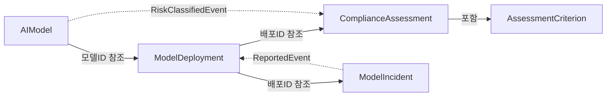

## 1. 프로젝트 개요

### 배경

EU AI Act(2024년 발효, 2026년 전면 시행)는 AI 시스템을 위험 등급별로 분류하고, 고위험 AI에 대해 적합성 평가, 배포 후 모니터링, 인시던트 보고를 의무화합니다. 조직은 AI 모델의 전체 수명 주기를 관리해야 합니다 -- 모델 등록, 위험 분류, 배포 승인, 컴플라이언스 평가, 인시던트 대응까지.

이 시스템은 단일 바운디드 컨텍스트 내에서 AI 모델 거버넌스를 자동화합니다. EU AI Act의 핵심 요구사항(위험 등급 분류, 적합성 평가, 인시던트 관리)을 DDD 전술적 패턴과 Functorium 프레임워크로 구현하며, 풀스택 DDD 예제로서 Domain/Application/Adapter 레이어의 실전 패턴을 시연합니다.

### 목표

1. EU AI Act 핵심 요구사항(위험 등급 분류, 컴플라이언스 평가, 인시던트 관리)을 자동화한다
2. 4개 Aggregate의 독립적 수명 주기와 교차 도메인 규칙을 DDD 전술적 패턴으로 구현한다
3. LanguageExt IO 고급 기능(Timeout, Retry, Fork, Bracket)의 실전 적용을 시연한다
4. OpenTelemetry 3-Pillar 관측성을 Source Generator 기반으로 자동화한다
5. Functorium 프레임워크의 풀스택 DDD 레퍼런스 구현을 제공한다

### 대상 사용자

| 페르소나 | 역할 | 핵심 목표 |
|---------|------|-----------|
| AI 거버넌스 관리자 | AI 모델 등록, 배포 승인, 위험 등급 분류 | 조직 내 AI 모델의 전체 수명 주기를 관리하고 규정 준수를 보장한다 |
| 컴플라이언스 담당자 | 컴플라이언스 평가, 인시던트 조사, 감사 보고 | EU AI Act 요구사항 충족 여부를 평가하고 인시던트에 신속하게 대응한다 |

### 성공 지표 (KPI)

| 지표 유형 | 지표 | 목표치 | 측정 방법 |
|-----------|------|--------|-----------|
| 선행 (Leading) | 모델 등록 완료율 | > 95% | 등록 요청 대비 성공 비율 |
| 선행 (Leading) | 인시던트 자동 격리 응답 시간 | < 1초 | Critical 인시던트 보고 후 배포 격리까지 소요 시간 |
| 후행 (Lagging) | 컴플라이언스 평가 통과율 | > 80% | 전체 평가 대비 Passed 비율 |
| 후행 (Lagging) | 미해결 인시던트 평균 해결 시간 | < 24시간 | Reported에서 Resolved까지 평균 소요 시간 |

### 기술 제약 조건

- .NET 10 / C# 14
- Functorium 프레임워크 (DDD 빌딩 블록, LanguageExt IO, Source Generator)
- FastEndpoints (HTTP API)
- OpenTelemetry 3-Pillar (Metrics, Tracing, Logging)
- InMemory / Sqlite 영속성 전환

---

## 2. Non-Goals (하지 않을 것)

이 프로젝트에서 **명시적으로 제외하는** 범위:

- **모델 학습 파이프라인** -- 모델 학습/파인튜닝은 ML 플랫폼의 책임이며, 이 시스템은 학습된 모델의 거버넌스만 담당한다
- **A/B 테스트 플랫폼** -- 모델 성능 비교 실험은 별도 실험 플랫폼에서 수행하며, 이 시스템은 배포된 모델의 규정 준수만 관리한다
- **실시간 대시보드** -- 모델 성능 모니터링 대시보드는 별도 관측성 플랫폼에서 제공하며, 이 시스템은 드리프트 임계값 초과 시 인시던트를 생성하는 것까지만 담당한다

---

## 3. 유비쿼터스 언어

| 한글 | 영문 | 정의 |
|------|------|------|
| AI 모델 | AIModel | 등록되어 관리 대상인 AI/ML 모델 |
| 모델명 | ModelName | AI 모델의 이름 (100자 이하) |
| 모델 버전 | ModelVersion | SemVer 형식의 모델 버전 |
| 모델 목적 | ModelPurpose | 모델의 사용 목적 설명 (500자 이하) |
| 위험 등급 | RiskTier | EU AI Act 기반 4단계 분류: Minimal, Limited, High, Unacceptable |
| 배포 | ModelDeployment | AI 모델의 운영 환경 배포 인스턴스 |
| 배포 상태 | DeploymentStatus | 배포의 현재 상태 (Draft, PendingReview, Active, Quarantined, Decommissioned, Rejected) |
| 배포 환경 | DeploymentEnvironment | 배포 대상 환경: Staging, Production |
| 엔드포인트 URL | EndpointUrl | 배포된 모델의 서비스 엔드포인트 |
| 드리프트 임계값 | DriftThreshold | 모델 성능 드리프트 감지 임계값 (0.0~1.0) |
| 컴플라이언스 평가 | ComplianceAssessment | 배포에 대한 규정 준수 평가 |
| 평가 기준 | AssessmentCriterion | 컴플라이언스 평가의 개별 기준 항목 |
| 평가 점수 | AssessmentScore | 0~100 범위의 종합 평가 점수, 70점 이상 통과 |
| 평가 상태 | AssessmentStatus | 평가 진행 상태 (Initiated, InProgress, Passed, Failed, RequiresRemediation) |
| 기준 결과 | CriterionResult | 개별 기준 평가 결과: Pass, Fail, NotApplicable |
| 인시던트 | ModelIncident | AI 모델 관련 사고/이슈 보고 |
| 인시던트 심각도 | IncidentSeverity | Critical, High, Medium, Low |
| 인시던트 상태 | IncidentStatus | 인시던트 진행 상태 (Reported, Investigating, Resolved, Escalated) |
| 인시던트 설명 | IncidentDescription | 인시던트 상세 설명 (2000자 이하) |
| 해결 노트 | ResolutionNote | 인시던트 해결 기록 (2000자 이하) |
| 위험 분류 서비스 | RiskClassificationService | 모델 목적 키워드 기반 위험 등급 분류 |
| 배포 적격성 서비스 | DeploymentEligibilityService | 배포 전 교차 Aggregate 적격성 검증 |
| 헬스 체크 | HealthCheck | 배포된 모델의 건강 상태 확인 |
| 드리프트 보고서 | DriftReport | 모델 성능 드리프트 모니터링 결과 |
| 모델 레지스트리 | ModelRegistry | 외부 모델 메타데이터 저장소 |

---

## 4. 사용자 스토리

### AI 거버넌스 관리자

| ID | 스토리 | 우선순위 |
|----|--------|---------|
| US-001 | AI 거버넌스 관리자로서, AI 모델을 등록하고 싶다, 조직 내 AI 모델 현황을 파악하기 위해. | P0 |
| US-002 | AI 거버넌스 관리자로서, 모델의 위험 등급을 분류하고 싶다, EU AI Act 규정에 따른 관리 수준을 결정하기 위해. | P0 |
| US-003 | AI 거버넌스 관리자로서, 모델을 배포하고 싶다, 운영 환경에서 서비스하기 위해. | P0 |
| US-004 | AI 거버넌스 관리자로서, 배포를 검토 제출하고 싶다, 적격성 검증을 거쳐 승인받기 위해. | P0 |
| US-005 | AI 거버넌스 관리자로서, 문제 있는 배포를 격리하고 싶다, 추가 피해를 방지하기 위해. | P0 |
| US-006 | AI 거버넌스 관리자로서, 모델과 배포 현황을 검색하고 싶다, 위험 등급별/상태별 필터링으로 관리하기 위해. | P1 |

### 컴플라이언스 담당자

| ID | 스토리 | 우선순위 |
|----|--------|---------|
| US-007 | 컴플라이언스 담당자로서, 컴플라이언스 평가를 개시하고 싶다, 배포의 규정 준수 여부를 확인하기 위해. | P0 |
| US-008 | 컴플라이언스 담당자로서, 인시던트를 보고하고 싶다, 문제를 기록하고 즉각적인 대응을 유도하기 위해. | P0 |
| US-009 | 컴플라이언스 담당자로서, 인시던트를 조사하고 해결하고 싶다, 근본 원인을 파악하고 재발을 방지하기 위해. | P1 |
| US-010 | 컴플라이언스 담당자로서, 인시던트 목록을 심각도/상태별로 검색하고 싶다, 우선순위에 따라 대응하기 위해. | P1 |

---

## 5. Aggregate 후보

| Aggregate | 핵심 책임 | 상태 전이 | 주요 이벤트 |
|-----------|----------|-----------|------------|
| AIModel | 모델 등록, 위험 등급 분류, 아카이브/복원 | (없음, Soft Delete 가드) | RegisteredEvent, RiskClassifiedEvent, ArchivedEvent |
| ModelDeployment | 배포 생성, 상태 전이, 헬스 체크 기록 | Draft -> PendingReview -> Active -> Quarantined -> Decommissioned | CreatedEvent, ActivatedEvent, QuarantinedEvent |
| ComplianceAssessment | 평가 생성, 기준 평가, 점수 계산, 완료 | Initiated -> InProgress -> Passed/Failed/RequiresRemediation | CreatedEvent, CriterionEvaluatedEvent, CompletedEvent |
| ModelIncident | 인시던트 보고, 조사, 해결, 에스컬레이션 | Reported -> Investigating -> Resolved/Escalated | ReportedEvent, ResolvedEvent |

### Aggregate 관계도



---

## 6. 비즈니스 규칙

### AIModel 규칙

1. 모델명은 100자 이하, 비어있으면 안 된다
2. 모델 버전은 SemVer 형식이어야 한다
3. 모델 목적은 500자 이하, 비어있으면 안 된다
4. 위험 등급은 Minimal, Limited, High, Unacceptable 4단계로 분류한다
5. 모델 목적 키워드 기반 자동 위험 등급 분류를 지원한다
6. 아카이브된 모델은 수정할 수 없다 (Soft Delete 가드)
7. 아카이브와 복원은 멱등하다

### ModelDeployment 규칙

1. 엔드포인트 URL은 유효한 HTTP/HTTPS URL이어야 한다
2. 드리프트 임계값은 0.0~1.0 범위여야 한다
3. 배포 상태 전이는 정의된 전이 맵만 허용한다 (6단계, 2개 터미널 상태)
4. 헬스 체크를 기록할 수 있다

### ComplianceAssessment 규칙

1. 기본 평가 기준 3개: Data Governance, Technical Documentation, Security Review
2. High/Unacceptable 등급 시 추가 3개: Human Oversight, Bias Assessment, Transparency
3. Unacceptable 등급 시 추가 1개: Prohibition Review
4. 모든 기준이 평가되어야 완료할 수 있다
5. 종합 점수는 적용 가능한 기준 중 Pass 비율로 자동 계산 (0~100)
6. 70점 이상 Passed, 40~69 RequiresRemediation, 40 미만 Failed

### ModelIncident 규칙

1. 인시던트 설명은 2000자 이하여야 한다
2. Critical/High 심각도 인시던트는 배포 자동 격리를 유발한다
3. 인시던트 상태 전이는 정의된 전이 맵만 허용한다

### 교차 규칙

1. **위험 등급 분류:** 모델 목적 키워드 분석으로 위험 등급 결정 (RiskClassificationService)
2. **배포 적격성 검증:** 금지 등급 확인 -> 컴플라이언스 평가 확인 -> 미해결 인시던트 확인 (DeploymentEligibilityService)
3. **위험 등급 상향 시 평가 자동 개시:** RiskClassifiedEvent -> 활성 배포별 평가 생성 (EventHandler)
4. **Critical 인시던트 시 배포 자동 격리:** ReportedEvent -> 배포 Quarantine (EventHandler)

---

## 7. 유스케이스 + 수락 기준

### Commands (쓰기)

| 유스케이스 | 입력 | 핵심 로직 | 출력 | 우선순위 |
|-----------|------|----------|------|---------|
| RegisterModelCommand | Name, Version, Purpose | VO 합성 -> 위험 분류 -> 모델 생성 | ModelId | P0 |
| ClassifyModelRiskCommand | ModelId, RiskTier | 모델 조회 -> 재분류 -> 업데이트 | -- | P0 |
| CreateDeploymentCommand | ModelId, Url, Env, Drift | VO 합성 -> 모델 확인 -> 배포 생성 | DeploymentId | P0 |
| SubmitDeploymentForReviewCommand | DeploymentId | 배포 조회 -> 적격성 검증 -> 제출 | -- | P0 |
| ActivateDeploymentCommand | DeploymentId, AssessmentId | 배포/평가 조회 -> 통과 확인 -> 활성화 | -- | P0 |
| QuarantineDeploymentCommand | DeploymentId, Reason | 배포 조회 -> 격리 | -- | P0 |
| InitiateAssessmentCommand | ModelId, DeploymentId | 모델/배포 조회 -> 평가 생성 | AssessmentId | P0 |
| ReportIncidentCommand | DeploymentId, Severity, Desc | VO 합성 -> 배포 조회 -> 인시던트 생성 | IncidentId | P0 |

#### RegisterModelCommand 수락 기준

**정상 시나리오:**
```
Given: 유효한 모델명, SemVer 버전, 모델 목적이 주어진다
When:  AI 거버넌스 관리자가 모델을 등록한다
Then:  모델이 생성되고, 목적 키워드 기반으로 위험 등급이 자동 분류되며, ModelId가 반환된다
```

**거부 시나리오:**
```
Given: 모델명이 비어있고 버전이 SemVer 형식이 아니다
When:  AI 거버넌스 관리자가 모델을 등록한다
Then:  두 오류가 동시에 반환된다 (ApplyT 병렬 검증)
```

#### SubmitDeploymentForReviewCommand 수락 기준

**정상 시나리오:**
```
Given: Draft 상태의 배포가 존재하고, 모델이 금지 등급이 아니며, 컴플라이언스 평가가 통과되었고, 미해결 인시던트가 없다
When:  AI 거버넌스 관리자가 검토를 제출한다
Then:  배포 상태가 PendingReview로 전이된다
```

**거부 시나리오 (금지 등급):**
```
Given: Unacceptable 위험 등급의 모델이 참조된 배포가 존재한다
When:  AI 거버넌스 관리자가 검토를 제출한다
Then:  ProhibitedModel 오류가 반환되고 배포 상태는 변경되지 않는다
```

**거부 시나리오 (미통과 컴플라이언스):**
```
Given: High 위험 등급의 모델에 통과된 컴플라이언스 평가가 없다
When:  AI 거버넌스 관리자가 검토를 제출한다
Then:  ComplianceAssessmentRequired 오류가 반환된다
```

#### ReportIncidentCommand 수락 기준

**정상 시나리오 (자동 격리):**
```
Given: Active 상태의 배포가 존재한다
When:  컴플라이언스 담당자가 Critical 심각도 인시던트를 보고한다
Then:  인시던트가 Reported 상태로 생성되고, 이벤트 핸들러가 배포를 자동 격리한다
```

#### InitiateAssessmentCommand 수락 기준

**정상 시나리오:**
```
Given: 등록된 모델과 배포가 존재한다
When:  컴플라이언스 담당자가 평가를 개시한다
Then:  위험 등급에 따른 평가 기준이 자동 생성되고 (Minimal: 3개, High: 6개, Unacceptable: 7개) AssessmentId가 반환된다
```

### Queries (읽기)

| 유스케이스 | 입력 | 조회 전략 | 출력 | 우선순위 |
|-----------|------|----------|------|---------|
| GetModelByIdQuery | ModelId | IModelDetailQuery | 모델 상세 (배포/평가/인시던트 집계) | P0 |
| SearchModelsQuery | RiskTier?, Page, Size | IAIModelQuery | 모델 목록 | P1 |
| GetDeploymentByIdQuery | DeploymentId | IDeploymentDetailQuery | 배포 상세 | P0 |
| SearchDeploymentsQuery | Status?, Env?, Page, Size | IDeploymentQuery | 배포 목록 | P1 |
| GetAssessmentByIdQuery | AssessmentId | IAssessmentRepository | 평가 상세 (기준 포함) | P0 |
| GetIncidentByIdQuery | IncidentId | IIncidentRepository | 인시던트 상세 | P0 |
| SearchIncidentsQuery | Severity?, Status?, Page, Size | IIncidentQuery | 인시던트 목록 | P1 |

### Event Handlers (반응)

| 트리거 이벤트 | 동작 | 우선순위 |
|-------------|------|---------|
| ModelIncident.ReportedEvent | Critical/High 심각도 시 배포 자동 격리 (QuarantineDeploymentOnCriticalIncidentHandler) | P0 |
| AIModel.RiskClassifiedEvent | High/Unacceptable 상향 시 활성 배포에 평가 자동 생성 (InitiateAssessmentOnRiskUpgradeHandler) | P0 |

#### QuarantineDeploymentOnCriticalIncidentHandler 수락 기준

```
Given: Active 상태의 배포에 Critical 심각도 인시던트가 보고된다
When:  ReportedEvent가 발행된다
Then:  이벤트 핸들러가 배포를 자동 격리하고, 격리 사유에 심각도를 포함한다
```

#### InitiateAssessmentOnRiskUpgradeHandler 수락 기준

```
Given: Minimal에서 High로 위험 등급이 상향된 모델에 Active 배포 2개가 존재한다
When:  RiskClassifiedEvent가 발행된다
Then:  이벤트 핸들러가 각 활성 배포에 대해 ComplianceAssessment를 생성한다 (총 2개)
```

---

## 8. 금지 상태

| 금지 상태 | 방지 전략 | Functorium 패턴 |
|-----------|----------|----------------|
| Unacceptable 등급 모델이 활성 배포를 가진 상태 | DeploymentEligibilityService에서 `riskTier.IsProhibited` 검사 | Smart Enum 도메인 속성 (`RiskTier.IsProhibited`) + Domain Service |
| Draft에서 Active로 바로 전이된 배포 | DeploymentStatus 전이 맵에서 구조적으로 차단 | Smart Enum + `HashMap` 전이 맵 (`CanTransitionTo`) |
| 모든 기준이 평가되지 않은 상태에서 완료된 평가 | `Complete()` 메서드에서 미평가 기준 존재 시 `Fin.Fail` 반환 | Aggregate Root 가드 메서드 |

---

## 9. 우선순위 요약

| 우선순위 | 기준 | 유스케이스 수 | 비고 |
|---------|------|-------------|------|
| **P0** (필수) | 없으면 출시 불가 | 12개 | MVP: Command 8 + Query 4(ID 조회) + EventHandler 2 |
| **P1** (중요) | 없으면 경쟁력 약화 | 5개 | 검색/필터: Query 3 + 인시던트 조사/해결 |
| **P2** (선택) | 있으면 차별화 | -- | EfCore/Dapper 영속성, Prometheus 대시보드 |

---

## 10. 타임라인

| 마일스톤 | 범위 | 목표일 | 의존성 |
|---------|------|--------|--------|
| Phase 1 (MVP) | P0 유스케이스 + InMemory 영속성 | 4주차 | -- |
| Phase 2 | P1 유스케이스 + Sqlite 영속성 | 8주차 | Phase 1 완료 |
| Phase 3 | P2 + 관측성 대시보드 + 알림 규칙 | 12주차 | Phase 2 완료 |

---

## 11. Open Questions

| ID | 질문 | 카테고리 | 차단 여부 | 담당 |
|----|------|---------|----------|------|
| Q-001 | ComplianceAssessment 평가 기준을 외부 설정 파일에서 동적으로 로딩해야 하는가? | engineering | 비차단 | 아키텍트 |
| Q-002 | 인시던트 에스컬레이션 시 외부 알림 시스템(Slack, PagerDuty)과 연동이 필요한가? | product | 비차단 | PM |
| Q-003 | Unacceptable 등급 모델의 등록 자체를 차단해야 하는가, 배포만 차단하면 되는가? | legal | 비차단 | 법무 |
| Q-004 | 모델 드리프트 임계값 초과 시 자동 인시던트 생성이 필요한가? | engineering | 비차단 | 아키텍트 |

---

## 12. 다음 단계

1. **architecture-design** -- 프로젝트 구조 + 인프라 설계
2. **domain-develop** -- 각 Aggregate 상세 설계 + 구현
3. **application-develop** -- 유스케이스 구현
4. **adapter-develop** -- 영속성 + API 구현
5. **observability-develop** -- 관측성 설계 + 구현
6. **test-develop** -- 테스트 작성
7. **review** -- 코드 리뷰 + 문서화
