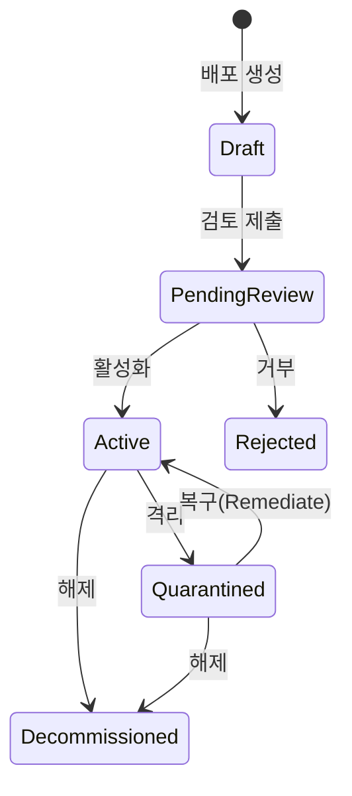
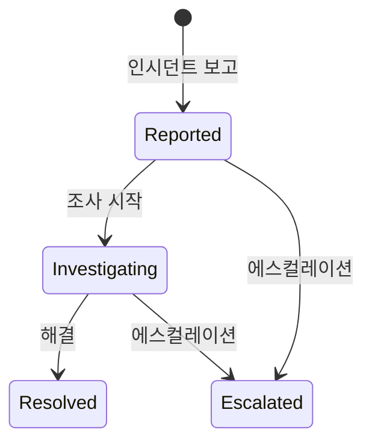
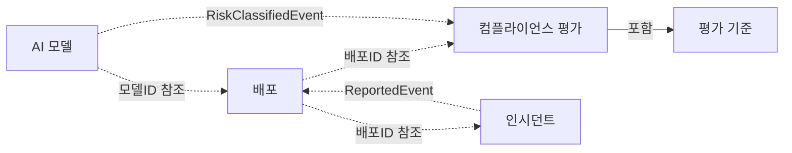
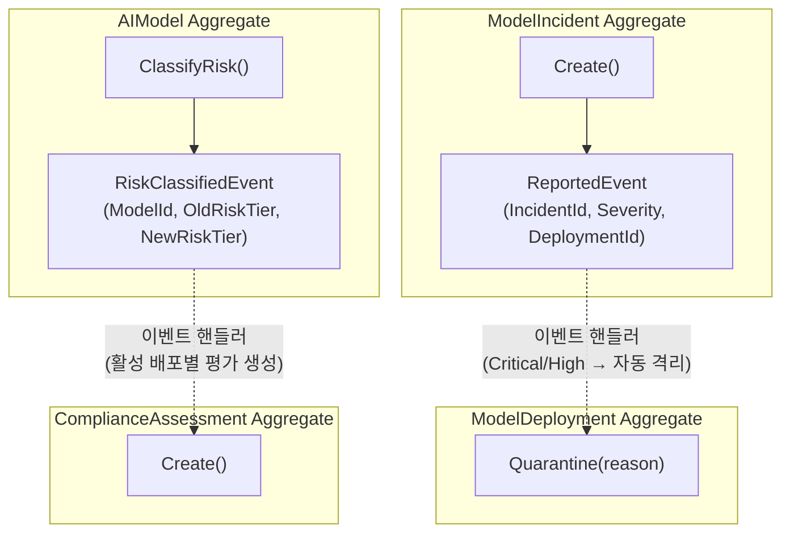

## 배경

[프로젝트 요구사항 명세](../00-project-spec/)에서 정의한 EU AI Act 기반 AI 모델 거버넌스 플랫폼의 도메인 비즈니스 규칙을 상세화합니다. 이 문서는 functorium-develop 7단계 워크플로의 도메인 트랙 첫 번째 단계입니다.

EU AI Act(2024년 발효, 2026년 전면 시행)는 AI 시스템을 위험 등급별로 분류하고, 고위험 AI에 대해 적합성 평가, 배포 후 모니터링, 인시던트 보고를 의무화합니다. 조직은 AI 모델의 전체 수명 주기를 관리해야 합니다 -- 모델 등록, 위험 분류, 배포 승인, 컴플라이언스 평가, 인시던트 대응까지.

이 시스템은 단일 바운디드 컨텍스트 내에서 AI 모델 거버넌스를 자동화합니다. 모델 등록과 위험 등급 분류, 배포 라이프사이클 관리, 컴플라이언스 평가, 인시던트 관리 및 자동 격리가 핵심 업무입니다.

## 도메인 용어

이 도메인에서 사용하는 핵심 용어를 정의합니다. 같은 단어라도 일상적 의미와 도메인 내 의미가 다를 수 있으므로, 팀 전체가 이 용어집을 공유 언어(Ubiquitous Language)로 사용합니다.

| 한글 | 영문 | 정의 |
|------|------|------|
| AI 모델 | AIModel | 등록되어 관리 대상인 AI/ML 모델 |
| 모델명 | ModelName | AI 모델의 이름 (100자 이하) |
| 모델 버전 | ModelVersion | SemVer 형식의 모델 버전 |
| 모델 목적 | ModelPurpose | 모델의 사용 목적 설명 (500자 이하) |
| 위험 등급 | RiskTier | EU AI Act 기반 4단계 분류: Minimal, Limited, High, Unacceptable |
| 배포 | ModelDeployment | AI 모델의 운영 환경 배포 인스턴스 |
| 배포 상태 | DeploymentStatus | 배포의 현재 상태 (Draft, PendingReview, Active, Quarantined, Decommissioned, Rejected) |
| 배포 환경 | DeploymentEnvironment | 배포 대상 환경: Staging, Production |
| 엔드포인트 URL | EndpointUrl | 배포된 모델의 서비스 엔드포인트 |
| 드리프트 임계값 | DriftThreshold | 모델 성능 드리프트 감지 임계값 (0.0~1.0) |
| 컴플라이언스 평가 | ComplianceAssessment | 배포에 대한 규정 준수 평가 |
| 평가 기준 | AssessmentCriterion | 컴플라이언스 평가의 개별 기준 항목 |
| 평가 점수 | AssessmentScore | 0~100 범위의 종합 평가 점수, 70점 이상 통과 |
| 평가 상태 | AssessmentStatus | 평가 진행 상태 (Initiated, InProgress, Passed, Failed, RequiresRemediation) |
| 기준 결과 | CriterionResult | 개별 기준 평가 결과: Pass, Fail, NotApplicable |
| 인시던트 | ModelIncident | AI 모델 관련 사고/이슈 보고 |
| 인시던트 심각도 | IncidentSeverity | Critical, High, Medium, Low |
| 인시던트 상태 | IncidentStatus | 인시던트 진행 상태 (Reported, Investigating, Resolved, Escalated) |
| 인시던트 설명 | IncidentDescription | 인시던트 상세 설명 (2000자 이하) |
| 해결 노트 | ResolutionNote | 인시던트 해결 기록 (2000자 이하) |
| 위험 분류 서비스 | RiskClassificationService | 모델 목적 키워드 기반 위험 등급 분류 |
| 배포 적격성 서비스 | DeploymentEligibilityService | 배포 전 교차 Aggregate 적격성 검증 |

## 비즈니스 규칙

### 1. AI 모델 관리

AI 모델은 거버넌스 대상의 핵심 단위이며, 등록과 위험 분류의 수명 주기를 가집니다.

- 모델은 모델명, 버전, 목적, 위험 등급을 가진다
- 모델명은 100자 이하여야 한다
- 모델 버전은 SemVer 형식이어야 한다 (예: `1.0.0`, `2.1.3-beta`)
- 모델 목적은 500자 이하여야 한다
- 위험 등급은 EU AI Act 기반 4단계로 분류한다: Minimal, Limited, High, Unacceptable
- 모델 목적 키워드를 기반으로 위험 등급을 자동 분류할 수 있다
  - "social scoring", "real-time surveillance" -> Unacceptable
  - "hiring", "credit", "medical", "biometric" -> High
  - "sentiment", "recommendation", "emotion" -> Limited
  - 그 외 -> Minimal
- 모델의 위험 등급을 재분류할 수 있다
- 모델을 아카이브(논리 삭제)할 수 있으며, 아카이브된 모델은 수정할 수 없다
- 아카이브된 모델을 복원할 수 있다
- 아카이브와 복원은 멱등하다

### 2. 배포 라이프사이클 관리

배포는 AI 모델의 운영 환경 배포 인스턴스이며, 엄격한 상태 전이 규칙을 따릅니다.

- 배포는 모델, 엔드포인트 URL, 배포 환경, 드리프트 임계값을 가진다
- 엔드포인트 URL은 유효한 HTTP/HTTPS URL이어야 한다
- 배포 환경은 Staging 또는 Production이다
- 드리프트 임계값은 0.0~1.0 범위여야 한다
- 배포는 Draft 상태로 시작한다
- 헬스 체크를 기록할 수 있다

배포는 다음 상태를 거칩니다:

- Draft에서 PendingReview로 전이할 수 있다
- PendingReview에서 Active 또는 Rejected로 전이할 수 있다
- Active에서 Quarantined 또는 Decommissioned로 전이할 수 있다
- Quarantined에서 Active(복구) 또는 Decommissioned로 전이할 수 있다
- Decommissioned와 Rejected는 최종 상태이다

### 3. 컴플라이언스 평가

컴플라이언스 평가는 배포에 대한 규정 준수를 검증합니다. 위험 등급에 따라 평가 기준이 자동 생성됩니다.

- 평가는 모델, 배포, 위험 등급을 기반으로 생성된다
- 기본 평가 기준 3개: Data Governance, Technical Documentation, Security Review
- High 또는 Unacceptable 등급 시 추가 3개: Human Oversight, Bias Assessment, Transparency
- Unacceptable 등급 시 추가 1개: Prohibition Review
- 각 평가 기준에 대해 Pass, Fail, NotApplicable 결과를 기록할 수 있다
- 모든 기준이 평가되어야 평가를 완료할 수 있다
- 종합 점수는 적용 가능한 기준 중 Pass 비율로 자동 계산된다 (0~100)
- 70점 이상이면 Passed, 40~69점이면 RequiresRemediation, 40점 미만이면 Failed
- 평가 상태: Initiated -> InProgress -> Passed/Failed/RequiresRemediation

### 4. 인시던트 관리

인시던트는 AI 모델 관련 사고/이슈 보고를 관리합니다.

- 인시던트는 배포, 모델, 심각도, 설명을 가진다
- 인시던트 설명은 2000자 이하여야 한다
- 인시던트 심각도는 Critical, High, Medium, Low 중 하나다
- Critical 또는 High 심각도 인시던트는 배포 자동 격리를 유발한다
- 인시던트를 조사 시작할 수 있다 (Reported -> Investigating)
- 인시던트를 해결할 수 있다 (Investigating -> Resolved), 해결 노트를 기록한다
- 인시던트를 에스컬레이션할 수 있다 (Reported/Investigating -> Escalated)
- Resolved와 Escalated는 최종 상태이다

인시던트는 다음 상태를 거칩니다:

### 5. 교차 도메인 규칙

다음 규칙은 단일 업무 영역 내에서 해결할 수 없으며, 여러 영역의 데이터가 함께 필요합니다.

- **위험 등급 분류:** 모델 목적 키워드를 분석하여 위험 등급을 결정한다 (RiskClassificationService)
- **배포 적격성 검증:** 배포 검토 제출 시 다음 3가지를 순차적으로 검증한다 (DeploymentEligibilityService)
  - 금지된 위험 등급(Unacceptable)인지 확인
  - High/Unacceptable 등급 시 통과된 컴플라이언스 평가 존재 확인
  - 미해결 인시던트 부재 확인

## 업무 영역 간 관계

- AI 모델은 배포의 소유 대상이다
- 배포는 컴플라이언스 평가의 대상이다
- 컴플라이언스 평가는 평가 기준을 포함한다
- 인시던트는 배포에 대해 보고된다
- 위험 등급 상향 시 도메인 이벤트를 통해 컴플라이언스 평가가 자동 개시된다
- Critical/High 인시던트 보고 시 도메인 이벤트를 통해 배포가 자동 격리된다

### 도메인 이벤트 기반 Aggregate 간 조율

## 시나리오

다음 시나리오는 비즈니스 요구사항이 실제로 동작하는 방식을 구체적으로 기술합니다.

### 정상 시나리오

1. **모델 등록** -- 모델명, 버전, 목적을 입력하여 모델을 등록한다. 목적 키워드 기반으로 위험 등급이 자동 분류된다.
2. **위험 등급 재분류** -- 모델의 위험 등급을 수동으로 재분류한다. 상향 시 컴플라이언스 평가가 자동 개시된다.
3. **배포 생성** -- 모델, 엔드포인트 URL, 환경, 드리프트 임계값을 입력하여 배포를 생성한다. Draft 상태로 시작한다.
4. **배포 검토 제출** -- 배포 적격성(금지 등급, 컴플라이언스, 미해결 인시던트)을 검증한 뒤 검토를 위해 제출한다.
5. **배포 활성화** -- 컴플라이언스 평가 통과 확인 후 배포를 활성화한다.
6. **컴플라이언스 평가** -- 위험 등급 기반 평가 기준을 생성하고, 각 기준을 평가한 뒤, 모든 기준 평가 후 완료한다.
7. **인시던트 보고** -- 배포에 대한 인시던트를 보고한다. Critical/High 심각도 시 배포가 자동 격리된다.
8. **인시던트 해결** -- 조사를 시작하고, 해결 노트와 함께 인시던트를 해결한다.
9. **배포 격리와 복구** -- 문제가 발생한 배포를 격리하고, 문제 해결 후 복구한다.
10. **모델 아카이브와 복원** -- 모델을 아카이브하고, 필요 시 복원한다.

### 거부 시나리오

11. **유효하지 않은 배포 상태 전이** -- Draft에서 Active로 직접 전이를 시도하면 거부된다.
12. **금지된 모델 배포** -- Unacceptable 위험 등급의 모델은 배포 검토 제출이 거부된다.
13. **미통과 컴플라이언스** -- High 위험 등급 모델에 통과된 컴플라이언스 평가가 없으면 배포가 거부된다.
14. **미해결 인시던트** -- 미해결 인시던트가 있는 모델은 배포 검토 제출이 거부된다.
15. **미완료 평가 종료** -- 모든 평가 기준이 평가되지 않은 상태에서 평가를 완료하면 거부된다.
16. **아카이브된 모델 수정** -- 아카이브된 모델의 정보를 수정하면 거부된다.

## 존재해서는 안 되는 상태

다음은 시스템에서 절대 발생해서는 안 되는 상태입니다. 이 상태가 존재한다면 규칙이 깨진 것이며, 타입 시스템과 도메인 로직으로 이를 원천 차단합니다.

- Draft에서 Active로 바로 전이된 배포
- Unacceptable 등급 모델이 활성 배포를 가진 상태
- 모든 기준이 평가되지 않은 상태에서 완료된 컴플라이언스 평가
- Critical 인시던트가 보고되었으나 배포가 격리되지 않은 상태
- 아카이브된 모델에서 수정이 일어난 상태
- 음수이거나 1.0을 초과하는 드리프트 임계값
- SemVer 형식이 아닌 모델 버전

다음 단계에서는 이 비즈니스 규칙을 DDD 관점에서 분석하여, 독립적인 일관성 경계(Aggregate)를 식별하고 [불변식을 분류](./01-type-design-decisions/)합니다.
