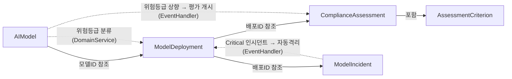

## 배경

EU AI Act(2024년 발효, 2026년 전면 시행)는 AI 시스템을 위험 등급별로 분류하고, 고위험 AI에 대해 적합성 평가, 배포 후 모니터링, 인시던트 보고를 의무화합니다. 이 예제는 EU AI Act의 핵심 요구사항을 단일 바운디드 컨텍스트 내에서 DDD 전술적 패턴과 Functorium 프레임워크로 구현합니다.

## Functorium DDD 예제 시리즈

| 예제 | 레이어 | 도메인 | 핵심 학습 |
|------|--------|--------|----------|
| [designing-with-types](../designing-with-types/) | Domain | 연락처 관리 | Value Object, Aggregate Root |
| [ecommerce-ddd](../ecommerce-ddd/) | Domain + Application | 전자상거래 | CQRS, FinT LINQ, Apply 패턴 |
| **ai-model-governance** (본 예제) | **Domain + Application + Adapter** | AI 모델 거버넌스 | **IO 고급 기능, 관측성, 풀스택 DDD** |

본 예제는 세 번째이자 마지막 예제로, Domain/Application 레이어에서 다룬 패턴 위에 Adapter 레이어의 LanguageExt IO 고급 기능(Retry, Timeout, Fork, Bracket)과 OpenTelemetry 3-Pillar 관측성을 추가합니다.

## functorium-develop 7단계 워크플로

이 예제는 functorium-develop 플러그인 v0.4.0의 7단계 워크플로를 따릅니다.

| 단계 | 스킬 | 문서 | 설명 |
|------|------|------|------|
| 0 | project-spec | [프로젝트 요구사항 명세](./00-project-spec/) | PRD: KPI, 유비쿼터스 언어, Aggregate 후보, 수락 기준 |
| 1 | architecture-design | [아키텍처 설계](./01-architecture-design/) | 프로젝트 구조, DI 전략, 관측성 파이프라인 |
| 2-4 | domain-develop | [도메인 트랙](#도메인-트랙) | VO, Aggregate, Domain Service, Specification |
| 2-4 | application-develop | [애플리케이션 트랙](#애플리케이션-트랙) | CQRS UseCase, Port, Event Handler |
| 2-4 | adapter-develop | [어댑터 트랙](#어댑터-트랙) | Repository, External Service, HTTP API |
| 5 | observability-develop | [관측성 트랙](#관측성-트랙) | 대시보드, 알림, ctx.* 전파 |
| 6 | test-develop | (테스트 코드 포함) | 단위 테스트 268개, 통합 테스트 |

## 적용된 DDD 빌딩 블록

| DDD 개념 | Functorium 타입 | 적용 |
|----------|----------------|------|
| Value Object | `SimpleValueObject<T>`, `ComparableSimpleValueObject<T>` | ModelName, ModelVersion, EndpointUrl, DriftThreshold 등 |
| Smart Enum | `SimpleValueObject<string>` + `HashMap` | RiskTier, DeploymentStatus, IncidentStatus, AssessmentStatus 등 |
| Entity | `Entity<TId>` | AssessmentCriterion (child entity) |
| Aggregate Root | `AggregateRoot<TId>` | AIModel, ModelDeployment, ComplianceAssessment, ModelIncident |
| Domain Event | `DomainEvent` | 18종 (Registered, Quarantined, Reported 등) |
| Domain Error | `DomainErrorKind.Custom` | InvalidStatusTransition, AlreadyDeleted 등 |
| Specification | `ExpressionSpecification<T>` | 12종 (ModelNameSpec, DeploymentActiveSpec 등) |
| Domain Service | `IDomainService` | RiskClassificationService, DeploymentEligibilityService |
| Repository | `IRepository<T, TId>` | 4개 Repository 인터페이스 |

## 적용된 Application 패턴

| 패턴 | 구현 | 적용 |
|------|------|------|
| CQRS | `ICommandUsecase` / `IQueryUsecase` | 8 Commands, 7 Queries |
| Apply Pattern | `tuple.ApplyT()` | VO 병렬 검증 합성 |
| FinT LINQ | `from...in` 체이닝 | 비동기 에러 전파 |
| Port/Adapter | `IQueryPort`, `IRepository` | 읽기/쓰기 분리 |
| Event Handler | `IDomainEventHandler<T>` | 2 Event Handlers |
| FluentValidation | `MustSatisfyValidation` | 구문 + 의미 이중 검증 |

## 적용된 Adapter 패턴 (IO 고급 기능)

| IO 패턴 | 구현 클래스 | 용도 |
|---------|------------|------|
| Timeout + Catch | `ModelHealthCheckService` | 헬스 체크 타임아웃 처리 |
| Retry + Schedule | `ModelMonitoringService` | 외부 API 재시도 (지수 백오프) |
| Fork + awaitAll | `ParallelComplianceCheckService` | 병렬 컴플라이언스 체크 |
| Bracket | `ModelRegistryService` | 리소스 수명 관리 (세션) |

## 적용된 관측성 패턴

| 패턴 | 구현 | 적용 |
|------|------|------|
| Observable Port | `[GenerateObservablePort]` + Source Generator | Repository 10, Query 5, External Service 4 |
| Pipeline 미들웨어 | `UseObservability()` + 명시적 opt-in | Metrics, Tracing, CtxEnricher, Logging, Validation, Exception |
| DomainEvent 관측성 | `ObservableDomainEventNotificationPublisher` | 18종 DomainEvent 발행/처리 관측 |
| ctx.* 전파 | `[CtxTarget]` + CtxPillar | MetricsTag(2), MetricsValue(1), Default(8+), Logging(2) |

## 도메인 트랙

| 단계 | 문서 | 설명 |
|------|------|------|
| 0. 요구사항 | [도메인 비즈니스 요구사항](./domain/00-business-requirements/) | 비즈니스 규칙, 상태 전이, 교차 도메인 규칙 |
| 1. 설계 | [도메인 타입 설계 의사결정](./domain/01-type-design-decisions/) | Aggregate 식별, 불변식 분류, Functorium 패턴 매핑 |
| 2. 코드 | [도메인 코드 설계](./domain/02-code-design/) | VO, Smart Enum, Aggregate, Domain Service 코드 |
| 3. 결과 | [도메인 구현 결과](./domain/03-implementation-results/) | 타입 수 현황, 폴더 구조, 테스트 현황 |

## 애플리케이션 트랙

| 단계 | 문서 | 설명 |
|------|------|------|
| 0. 요구사항 | [애플리케이션 비즈니스 요구사항](./application/00-business-requirements/) | 워크플로우 규칙, 이벤트 반응형 흐름 |
| 1. 설계 | [애플리케이션 타입 설계 의사결정](./application/01-type-design-decisions/) | Command/Query/Port 식별, ApplyT, FinT 컴포지션 |
| 2. 코드 | [애플리케이션 코드 설계](./application/02-code-design/) | Command Handler, Event Handler 코드 |
| 3. 결과 | [애플리케이션 구현 결과](./application/03-implementation-results/) | UseCase/Port 현황, 적용 패턴 요약 |

## 어댑터 트랙

| 단계 | 문서 | 설명 |
|------|------|------|
| 0. 요구사항 | [어댑터 기술 요구사항](./adapter/00-business-requirements/) | 영속성, 외부 서비스, HTTP API, 관측성 요구사항 |
| 1. 설계 | [어댑터 타입 설계 의사결정](./adapter/01-type-design-decisions/) | IO 패턴 선택 근거, Observable Port 설계 |
| 2. 코드 | [어댑터 코드 설계](./adapter/02-code-design/) | IO 고급 패턴, DI 등록 코드 |
| 3. 결과 | [어댑터 구현 결과](./adapter/03-implementation-results/) | 엔드포인트, 구현체, 테스트 현황 |

## 관측성 트랙

| 단계 | 문서 | 설명 |
|------|------|------|
| 0. 요구사항 | [관측성 비즈니스 요구사항](./observability/00-business-requirements/) | 3-Pillar 요구사항, SLO targets |
| 1. 설계 | [관측성 타입 설계 의사결정](./observability/01-type-design-decisions/) | KPI-메트릭 매핑, ctx.* 전파 전략 |
| 2. 코드 | [관측성 코드 설계](./observability/02-code-design/) | L1/L2 대시보드, 알림 규칙, PromQL |
| 3. 결과 | [관측성 구현 결과](./observability/03-implementation-results/) | Observable Port, Pipeline, IO 패턴 현황 |

## 프로젝트 구조

```
samples/ai-model-governance/
├── AiModelGovernance.slnx                        # 솔루션 파일 (8 프로젝트)
├── 00-project-spec.md                            # 프로젝트 요구사항 명세
├── 01-architecture-design.md                     # 아키텍처 설계
├── domain/                                       # 도메인 레이어 문서 (4개)
├── application/                                  # 애플리케이션 레이어 문서 (4개)
├── adapter/                                      # 어댑터 레이어 문서 (4개)
├── observability/                                # 관측성 문서 (4개)
├── Src/
│   ├── AiGovernance.Domain/
│   │   ├── SharedModels/Services/                # Domain Services
│   │   └── AggregateRoots/
│   │       ├── Models/                           # AIModel, VOs, Specs
│   │       ├── Deployments/                      # ModelDeployment, VOs, Specs
│   │       ├── Assessments/                      # ComplianceAssessment, AssessmentCriterion, VOs, Specs
│   │       └── Incidents/                        # ModelIncident, VOs, Specs
│   ├── AiGovernance.Application/
│   │   └── Usecases/
│   │       ├── Models/                           # Commands, Queries, Ports
│   │       ├── Deployments/                      # Commands, Queries, Ports
│   │       ├── Assessments/                      # Commands, Queries, EventHandlers
│   │       └── Incidents/                        # Commands, Queries, EventHandlers
│   ├── AiGovernance.Adapters.Persistence/
│   │   ├── Models/                               # Repository, Query (InMemory + EfCore)
│   │   ├── Deployments/
│   │   ├── Assessments/
│   │   ├── Incidents/
│   │   └── Registrations/                        # DI 등록
│   ├── AiGovernance.Adapters.Infrastructure/
│   │   ├── ExternalServices/                     # IO 고급 기능 데모 (4종)
│   │   └── Registrations/                        # DI 등록
│   ├── AiGovernance.Adapters.Presentation/
│   │   ├── Endpoints/                            # FastEndpoints (15종)
│   │   └── Registrations/                        # DI 등록
│   └── AiGovernance/                             # Host (Program.cs)
└── Tests/
    ├── AiGovernance.Tests.Unit/                  # 단위 테스트
    └── AiGovernance.Tests.Integration/           # 통합 테스트
```

## 실행 방법

```bash
# 빌드
dotnet build Docs.Site/src/content/docs/samples/ai-model-governance/AiModelGovernance.slnx

# 테스트 (268개)
dotnet test --solution Docs.Site/src/content/docs/samples/ai-model-governance/AiModelGovernance.slnx
```

## Aggregate 관계 다이어그램



## 수치 요약

| 항목 | 수량 |
|------|------|
| Aggregate Root | 4 |
| Value Object | 16 (문자열 6, 비교 가능 2, Smart Enum 8) |
| Domain Service | 2 |
| Specification | 12 |
| Domain Event | 18 |
| Command | 8 |
| Query | 7 |
| Event Handler | 2 |
| HTTP Endpoint | 15 |
| Observable Port | 19 |
| IO 고급 패턴 | 4 (Timeout, Retry, Fork, Bracket) |
| **총 테스트** | **268** |
