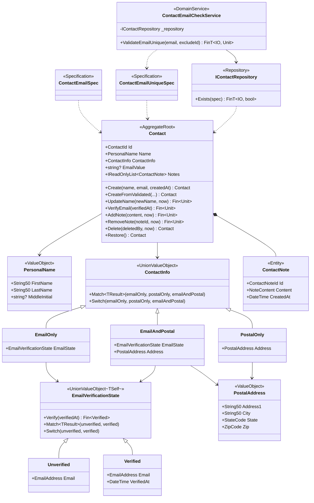

## 설계 의사결정에서 C# 구현으로

[비즈니스 요구사항](./00-business-requirements/)에서 자연어로 정의한 규칙을, [타입 설계 의사결정](./01-type-design-decisions/)에서 Aggregate로 식별하고 불변식으로 분류했습니다. 이 문서에서는 그 설계를 Functorium DDD 빌딩 블록과 C# 14 언어 기능으로 구현합니다.

| 설계 의사결정 | C# 구현 패턴 | 적용 |
|---|---|---|
| 생성 시 검증 + 불변 + 정규화 | `SimpleValueObject<T>` + `NotNull` → `ThenNormalize` 체인 | String50, EmailAddress, StateCode, ZipCode, NoteContent |
| 원자적 그룹화 | `sealed class : ValueObject` + `GetEqualityComponents` | PersonalName, PostalAddress |
| 허용 조합만 표현 | `UnionValueObject` + `[UnionType]` (Match/Switch 자동 생성) | ContactInfo |
| 상태 분리 + 전이 함수 | `UnionValueObject<TSelf>` + `TransitionFrom` 헬퍼 + `[UnionType]` | EmailVerificationState |
| Aggregate 식별 + 수명 관리 | `AggregateRoot<TId>` + `IAuditable` + `ISoftDeletableWithUser` | Contact |
| 검증 합성의 레이어 분리 | Entity는 VO만 수신, Application Layer에서 `FinApplyExtensions`로 합성 | Contact 팩토리 |
| 자식 엔티티 + 컬렉션 관리 | `Entity<TId>` + private 컬렉션 + `IReadOnlyList` 노출 | ContactNote |
| 실패 가능 vs 멱등 행위 | `Fin<Unit>` vs `Contact` 반환 | Aggregate 메서드 |
| Aggregate 가드 + 상태 전이 위임 | Aggregate가 가드 후 상태 객체에 위임 | Contact.VerifyEmail |
| 시간 주입 | 모든 행위 메서드가 `DateTime` 매개변수 수신 | Create, UpdateName, Delete 등 |
| 쿼리 가능한 도메인 상태 | 투영 속성 (projection property) | EmailValue |
| 도메인 쿼리 사양 | `ExpressionSpecification<T>` | ContactEmailSpec, ContactEmailUniqueSpec |
| 교차 Aggregate 검증 | `IDomainService` + Repository + Specification 응집 | ContactEmailCheckService |
| 영속성 추상화 | `IRepository<T, TId>` + 커스텀 메서드 | IContactRepository |
| ORM 복원 | `CreateFromValidated` (검증/이벤트 없음) | Contact, PersonalName, PostalAddress, ContactNote |

## 단일 값 불변식 → SimpleValueObject + Validate 체인

각 값 객체는 `SimpleValueObject<T>`를 상속하고, `Validate` 메서드에서 검증 규칙을 체이닝합니다. `string?`을 입력받아 `NotNull`부터 시작하고, `ThenNormalize`로 정규화를 적용합니다. **정규화는 존재성 검사(NotNull, NotEmpty) 직후, 구조적 검사(MaxLength, Matches) 이전에 배치합니다.** 이는 구조적 검증이 정규화된 값에 대해 수행되도록 하기 위함입니다.

| 타입 | 검증 규칙 | 정규화 |
|------|----------|--------|
| `String50` | `NotNull` → `ThenNotEmpty` → `ThenNormalize(Trim)` → `ThenMaxLength(50)` | `Trim` |
| `EmailAddress` | `NotNull` → `ThenNotEmpty` → `ThenNormalize(Trim+ToLower)` → `ThenMaxLength(320)` → `ThenMatches(이메일 정규식)` | `Trim` + `ToLowerInvariant` |
| `StateCode` | `NotNull` → `ThenNotEmpty` → `ThenMatches(^[A-Z]{2}$)` | — |
| `ZipCode` | `NotNull` → `ThenNotEmpty` → `ThenMatches(^\d{5}$)` | — |
| `NoteContent` | `NotNull` → `ThenNotEmpty` → `ThenNormalize(Trim)` → `ThenMaxLength(500)` | `Trim` |

```csharp
public sealed class String50 : SimpleValueObject<string>
{
    public const int MaxLength = 50;
    private String50(string value) : base(value) { }

    public static Fin<String50> Create(string? value) =>
        CreateFromValidation(Validate(value), v => new String50(v));

    public static Validation<Error, string> Validate(string? value) =>
        ValidationRules<String50>
            .NotNull(value)
            .ThenNotEmpty()
            .ThenNormalize(v => v.Trim())
            .ThenMaxLength(MaxLength);

    public static String50 CreateFromValidated(string value) => new(value);
    public static implicit operator string(String50 vo) => vo.Value;
}
```

- private 생성자로 `new`를 차단하고, `Create` 팩토리만 노출합니다
- `Fin<T>`가 성공/실패를 표현하므로 예외 없이 실패를 처리할 수 있습니다
- `CreateFromValidated`는 ORM 복원용으로, 이미 검증된 값을 직접 생성합니다
- implicit operator로 `String50` → `string` 변환을 지원합니다

## 구조 불변식 → ValueObject 합성

### 원자적 그룹화

`ValueObject` 추상 클래스를 상속하여 VO 계층 일관성을 확보합니다. `GetEqualityComponents`로 값 기반 동등성을 명시적으로 구현합니다.

```csharp
public sealed class PersonalName : ValueObject
{
    public String50 FirstName { get; }
    public String50 LastName { get; }
    public string? MiddleInitial { get; }

    private PersonalName(String50 firstName, String50 lastName, string? middleInitial)
    {
        FirstName = firstName;
        LastName = lastName;
        MiddleInitial = middleInitial;
    }

    protected override IEnumerable<object> GetEqualityComponents()
    {
        yield return FirstName;
        yield return LastName;
        if (MiddleInitial is not null)
            yield return MiddleInitial;
    }

    public static Validation<Error, PersonalName> Validate(
        string? firstName, string? lastName, string? middleInitial = null) =>
        (String50.Validate(firstName), String50.Validate(lastName))
            .Apply((first, last) => new PersonalName(
                String50.CreateFromValidated(first),
                String50.CreateFromValidated(last),
                middleInitial));

    public static Fin<PersonalName> Create(
        string? firstName, string? lastName, string? middleInitial = null) =>
        Validate(firstName, lastName, middleInitial)
            .ToFin();

    public static PersonalName CreateFromValidated(
        String50 firstName, String50 lastName, string? middleInitial = null) =>
        new(firstName, lastName, middleInitial);
}
```

복합 VO도 단일 값 VO와 동일한 `Validate` → `Create` 패턴을 따릅니다:

- **`Validate`**: Apply(병렬) 패턴으로 모든 필드를 동시에 검증합니다. 하나 이상의 필드가 실패해도 나머지 필드의 오류를 모두 수집하여 `Validation<Error, T>`로 반환합니다.
- **`Create`**: `Validate(...).ToFin()`으로 `Fin<T>`를 반환합니다. 기존 호출 코드와 호환됩니다.

이 패턴은 단일 값 VO의 Bind(순차) 검증과 대비됩니다:

| 패턴 | 방식 | 오류 수집 | 사용 위치 |
|------|------|----------|----------|
| **Bind** (`from...in`) | 순차 — 첫 번째 오류에서 중단 | 1개 | 단일 값 VO의 `Create` |
| **Apply** (튜플 `.Apply()`) | 병렬 — 모든 필드 검증 | 전체 | 복합 VO의 `Validate` |

| 항목 | `sealed class : ValueObject` | `abstract partial record : UnionValueObject` |
|---|---|---|
| 용도 | 복합 VO (PersonalName, PostalAddress) | Discriminated Union (ContactInfo, EmailVerificationState) |
| 동등성 | `GetEqualityComponents()` 명시 구현 | 컴파일러 자동 생성 (record) |
| 불변성 | private 생성자 + `{ get; }` | record positional 파라미터 |
| VO 계층 | `ValueObject` 계층 참여 | `IUnionValueObject` 계층 참여 |
| ORM 호환 | 프록시 타입 자동 처리 | 프록시 미지원 |
| 해시코드 | 캐시된 해시코드 | 컴파일러 생성 (record) |
| Source Generator | — | `[UnionType]`으로 Match/Switch 자동 생성 |

### Discriminated Union

`ContactInfo`와 `EmailVerificationState`는 Functorium의 `UnionValueObject` 기반 record로 구현합니다. record는 class를 상속할 수 없으므로, `IUnionValueObject` 인터페이스 + `abstract record` 기반으로 설계되어 record의 패턴 매칭과 구조적 동등성을 유지합니다.

`[UnionType]` 어트리뷰트를 적용하면 Source Generator가 `Match<TResult>`와 `Switch` 메서드를 자동 생성하여, 모든 케이스를 빠짐없이 처리하도록 **컴파일 타임에 강제**합니다.

```csharp
[UnionType]
public abstract partial record ContactInfo : UnionValueObject
{
    public sealed record EmailOnly(EmailVerificationState EmailState) : ContactInfo;
    public sealed record PostalOnly(PostalAddress Address) : ContactInfo;
    public sealed record EmailAndPostal(EmailVerificationState EmailState, PostalAddress Address) : ContactInfo;
    private ContactInfo() { }
}

// Source Generator가 자동 생성하는 메서드:
// - Match<TResult>(emailOnly, postalOnly, emailAndPostal) — 모든 Func 파라미터 필수 → exhaustiveness 보장
// - Switch(emailOnly, postalOnly, emailAndPostal) — 모든 Action 파라미터 필수
```

`abstract partial record` + `private` 생성자로 외부에서 새 케이스를 추가할 수 없습니다. 세 케이스 중 하나만 선택 가능하며, "연락 수단 없음" 케이스가 없으므로 빈 연락처가 구조적으로 불가능합니다. `Match` 메서드는 모든 케이스의 `Func` 파라미터가 필수이므로, 새 케이스 추가 시 컴파일 에러로 누락을 방지합니다.

## 상태 전이 불변식 → UnionValueObject\<TSelf\> + TransitionFrom 헬퍼

`EmailVerificationState`는 `UnionValueObject<TSelf>`를 상속하여 `TransitionFrom` 헬퍼를 사용합니다. Aggregate는 가드(삭제 상태, 이메일 존재 여부) 후 전이를 위임합니다.

`TransitionFrom<TSource, TTarget>`은 `this`가 `TSource`이면 전이 함수를 적용하고, 아니면 `InvalidTransition` 에러를 자동으로 반환합니다. CRTP(Curiously Recurring Template Pattern)으로 `DomainError`에 정확한 타입 정보가 전달됩니다.

```csharp
[UnionType]
public abstract partial record EmailVerificationState : UnionValueObject<EmailVerificationState>
{
    public sealed record Unverified(EmailAddress Email) : EmailVerificationState;
    public sealed record Verified(EmailAddress Email, DateTime VerifiedAt) : EmailVerificationState;
    private EmailVerificationState() { }

    public Fin<Verified> Verify(DateTime verifiedAt) =>
        TransitionFrom<Unverified, Verified>(
            u => new Verified(u.Email, verifiedAt));
}
```

`TransitionFrom`은 전이 실패 시 자동으로 `DomainError.For<EmailVerificationState>(new DomainErrorType.InvalidTransition(FromState: "Verified", ToState: "Verified"), ...)`를 생성합니다. 사용자는 케이스 정의와 성공 전이 로직에만 집중하면 됩니다.

## Aggregate Root 설계

### Entity ID와 이중 팩토리

`[GenerateEntityId]` 소스 생성기가 Ulid 기반 `ContactId`를 자동 생성합니다. 이중 팩토리로 도메인 생성과 ORM 복원을 분리합니다.

| 팩토리 | 용도 | 검증 | 이벤트 |
|---|---|---|---|
| `Create(name, email, createdAt)` | 도메인 생성 | 이미 검증된 VO 수신 | `CreatedEvent` 발행 |
| `CreateFromValidated(id, name, ...)` | ORM 복원 | 없음 (DB 데이터 신뢰) | 없음 |

### 검증 합성의 레이어별 역할

raw 입력(문자열 등)을 VO로 변환하는 검증 책임은 레이어별로 명확히 분리됩니다:

| 레이어 | 검증 경계 | `Validate` | `Create` | `CreateFromValidated` |
|--------|----------|-----------|----------|----------------------|
| Simple VO | raw → VO | `ValidationRules` 체인 | `string?` → `Fin<T>` | `string` → T |
| Composite VO | raw → VO | 자식 `Validate` applicative 합성 | `string?` → `Fin<T>` | 자식 VO → T |
| Entity/Aggregate | VO → Entity | — | VO → Entity | VO + ID → Entity (ORM 복원) |
| Application Layer | — | — | `FinApply`로 N개 `Fin<T>` applicative 합성 | — |

Entity/Aggregate는 `Validate` 없이 이미 검증된 VO만 수신합니다. Application Layer에서 여러 VO의 `Create` 결과(`Fin<T>`)를 합성할 때는 `FinApplyExtensions`의 튜플 `.Apply()`를 사용합니다:

```csharp
// Application Layer: 여러 VO Create 결과를 applicative로 합성
var contact = (
    PersonalName.Create(cmd.FirstName, cmd.LastName),
    EmailAddress.Create(cmd.Email)
).Apply((name, email) => Contact.Create(name, email, now));
// → Fin<Contact>, 모든 VO 검증 에러 누적
```

`FinApplyExtensions`는 각 `Fin<T>`를 `Validation<Error, T>`로 변환한 뒤 `ValidationApplyExtensions`의 applicative 합성을 사용하고, 결과를 다시 `Fin<R>`로 변환합니다. 중첩된 에러(예: `PersonalName` 내부의 firstName+lastName 에러)도 모두 보존됩니다.

### 도메인 이벤트

Aggregate 상태 변경마다 이벤트를 발행합니다: `CreatedEvent`, `NameUpdatedEvent`, `EmailVerifiedEvent`, `NoteAddedEvent`, `NoteRemovedEvent`, `DeletedEvent`, `RestoredEvent`.

### 행위 메서드 반환 타입 설계

| 메서드 | 반환 타입 | 이유 |
|---|---|---|
| `UpdateName`, `VerifyEmail`, `AddNote`, `RemoveNote` | `Fin<Unit>` | 삭제 상태에서 오류 반환 가능 |
| `Delete`, `Restore` | `Contact` | 항상 멱등, fluent chaining 지원 |

### Aggregate 가드 + 상태 전이 위임

`Contact.VerifyEmail`은 Aggregate 수준 가드 후 상태 전이를 `EmailVerificationState.Verify`에 위임합니다. 이 메서드는 세 가지 불변식을 순서대로 검증합니다:

1. **삭제된 Aggregate에 대한 행위 차단** — `DeletedAt.IsSome`이면 `AlreadyDeleted` 오류를 반환합니다. Soft Delete된 Contact는 복원(`Restore`) 전까지 모든 상태 변경이 금지됩니다.
2. **이메일 존재 여부 확인** — `ContactInfo.Match`로 `EmailState`를 추출합니다. `PostalOnly` 케이스는 이메일이 없으므로 `null`이 되고, `NoEmailToVerify` 오류를 반환합니다. `Match`는 모든 케이스의 처리를 컴파일 타임에 강제합니다.
3. **상태 전이 규칙 위임** — 위 가드를 통과하면 `emailState.Verify(verifiedAt)`를 호출합니다. `TransitionFrom` 헬퍼가 이미 `Verified` 상태에서의 재인증을 자동으로 `InvalidTransition` 오류로 반환합니다. 이 전이 규칙은 상태 객체(`EmailVerificationState`)가 캡슐화합니다.

Aggregate는 **불변식 가드(1, 2)와** **이벤트 발행**을 담당하고, **상태 전이 규칙(3)은** 상태 객체에 위임합니다.

```csharp
public Fin<Unit> VerifyEmail(DateTime verifiedAt)
{
    // 가드 1: 삭제된 Aggregate 행위 차단
    if (DeletedAt.IsSome)
        return DomainError.For<Contact>(new AlreadyDeleted(), ...);

    // 가드 2: Match로 EmailState 추출 (exhaustiveness 보장)
    var emailState = ContactInfo.Match<EmailVerificationState?>(
        emailOnly: eo => eo.EmailState,
        postalOnly: _ => null,
        emailAndPostal: ep => ep.EmailState);

    if (emailState is null)
        return DomainError.For<Contact>(new NoEmailToVerify(), ...);

    // 위임: TransitionFrom이 전이 규칙과 에러 처리를 캡슐화
    return emailState.Verify(verifiedAt).Map(verified =>
    {
        ContactInfo = ContactInfo.Match(
            emailOnly: _ => (ContactInfo)new ContactInfo.EmailOnly(verified),
            postalOnly: _ => throw new InvalidOperationException(),
            emailAndPostal: ep => new ContactInfo.EmailAndPostal(verified, ep.Address));
        UpdatedAt = verifiedAt;
        AddDomainEvent(new EmailVerifiedEvent(Id, verified.Email, verifiedAt));
        return unit;
    });
}
```

### 시간 주입 패턴

모든 행위 메서드는 `DateTime`을 매개변수로 받아 도메인 내부에서 `DateTime.UtcNow`를 직접 호출하지 않습니다. 테스트에서 시간을 결정적으로 제어할 수 있고, 같은 트랜잭션 내 일관된 타임스탬프를 보장합니다.

## 자식 엔티티 + 컬렉션 관리

`ContactNote`는 `Entity<ContactNoteId>`를 상속하는 자식 엔티티입니다. 독립적 ID를 가지지만 Aggregate 경계를 벗어나지 않습니다.

```csharp
[GenerateEntityId]
public sealed class ContactNote : Entity<ContactNoteId>
{
    public NoteContent Content { get; private set; }
    public DateTime CreatedAt { get; private set; }

    public static ContactNote Create(NoteContent content, DateTime createdAt) =>
        new(ContactNoteId.New(), content, createdAt);
}
```

Aggregate Root가 private 컬렉션으로 자식 엔티티를 관리하고, 외부에는 `IReadOnlyList`만 노출합니다:

```csharp
private readonly List<ContactNote> _notes = [];
public IReadOnlyList<ContactNote> Notes => _notes.AsReadOnly();
```

## Soft Delete

`ISoftDeletableWithUser` 인터페이스로 논리 삭제와 삭제자 추적을 구현합니다. 삭제/복원은 멱등하며, 삭제된 Contact에 행위를 시도하면 `AlreadyDeleted` 오류를 반환합니다.

```csharp
public Contact Delete(string deletedBy, DateTime now)
{
    if (DeletedAt.IsSome) return this;  // 멱등
    DeletedAt = now;
    DeletedBy = deletedBy;
    AddDomainEvent(new DeletedEvent(Id, deletedBy));
    return this;
}
```

## 투영 속성 + 동기화

`ContactInfo` union 내부의 이메일을 Specification의 Expression Tree에서 직접 쿼리할 수 없습니다. `string? EmailValue` 투영 속성으로 flat하게 노출하여 이 문제를 해결합니다.

```csharp
private ContactInfo _contactInfo = null!;
public ContactInfo ContactInfo
{
    get => _contactInfo;
    private set
    {
        _contactInfo = value;
        EmailValue = ExtractEmail(value);
    }
}
public string? EmailValue { get; private set; }
```

## Specification

`ExpressionSpecification<Contact>` 기반 쿼리 사양으로, `Expression<Func<T, bool>>`을 반환하여 ORM에서 SQL로 변환할 수 있습니다.

```csharp
public sealed class ContactEmailSpec : ExpressionSpecification<Contact>
{
    public EmailAddress Email { get; }
    public ContactEmailSpec(EmailAddress email) => Email = email;

    public override Expression<Func<Contact, bool>> ToExpression()
    {
        string emailStr = Email;
        return contact => contact.EmailValue == emailStr;
    }
}
```

`ContactEmailUniqueSpec`은 `Option<ContactId> ExcludeId`를 받아 자기 자신을 제외한 이메일 고유성 검사를 지원합니다. **자기 제외 로직은 이 Specification이 단일 소유**하며, Service나 Usecase에 중복되지 않습니다:

```csharp
public sealed class ContactEmailUniqueSpec : ExpressionSpecification<Contact>
{
    public EmailAddress Email { get; }
    public Option<ContactId> ExcludeId { get; }

    public ContactEmailUniqueSpec(EmailAddress email, Option<ContactId> excludeId = default)
    {
        Email = email;
        ExcludeId = excludeId;
    }

    public override Expression<Func<Contact, bool>> ToExpression()
    {
        string emailStr = Email;

        return ExcludeId.Match(
            Some: excludeId =>
            {
                var id = excludeId;
                return (Expression<Func<Contact, bool>>)(
                    contact => contact.EmailValue == emailStr && contact.Id != id);
            },
            None: () => contact => contact.EmailValue == emailStr);
    }
}
```

## Domain Service

Eric Evans는 Blue Book Chapter 9에서 Domain Service가 Repository를 사용하여 Specification 기반 쿼리를 수행하는 패턴을 제시합니다. Evans가 요구하는 **Stateless**(호출 간 가변 상태 없음)는 **Pure**(I/O 없음)와 다릅니다. Repository 인터페이스는 도메인 레이어에 정의되므로, Domain Service가 이를 사용하는 것은 Evans DDD에서 정당합니다.

`ContactEmailCheckService`는 `IContactRepository`를 생성자로 수신하고, 내부에서 Specification 생성 → Repository DB 쿼리 → 결과 해석을 응집적으로 수행합니다:

```csharp
public sealed class ContactEmailCheckService : IDomainService
{
    private readonly IContactRepository _repository;

    public ContactEmailCheckService(IContactRepository repository)
        => _repository = repository;

    public sealed record EmailAlreadyInUse : DomainErrorType.Custom;

    public FinT<IO, Unit> ValidateEmailUnique(
        EmailAddress email,
        Option<ContactId> excludeId = default)
    {
        var spec = new ContactEmailUniqueSpec(email, excludeId);
        return from exists in _repository.Exists(spec)
               from _ in CheckNotExists(email, exists)
               select unit;
    }

    private static Fin<Unit> CheckNotExists(EmailAddress email, bool exists)
    {
        if (exists)
            return DomainError.For<ContactEmailCheckService>(
                new EmailAlreadyInUse(),
                (string)email,
                "Email is already in use by another contact");
        return unit;
    }
}
```

- `_repository` 필드는 가변 상태가 아닌 **의존성 참조**입니다 — Evans의 Stateless 요구를 충족합니다
- `FinT<IO, Unit>` 반환으로 Repository I/O를 포함하는 효과 체인을 표현합니다
- `CheckNotExists`는 **순수 함수**입니다 — I/O와 도메인 판단을 분리합니다
- LINQ `from ... in`으로 `FinT<IO, bool>`과 `Fin<Unit>`을 자연스럽게 합성합니다 (`FinTLinqExtensions.Fin`이 `FinT → Fin` SelectMany를 제공)

> **Functorium 기본 패턴과의 차이:** Functorium의 `IDomainService`는 순수 함수(외부 I/O 없음)를 기본으로 합니다. ecommerce-ddd 예제의 `OrderCreditCheckService`는 소규모 교차 데이터(주문 ↔ 고객)를 Usecase가 로드하여 순수 Service에 전달합니다. 반면 이메일 고유성 검증은 전체 연락처에 대한 DB 쿼리가 필수이므로, Evans 원칙에 따라 Service가 Repository를 직접 사용합니다.

## Repository Interface

```csharp
public interface IContactRepository : IRepository<Contact, ContactId>
{
    FinT<IO, bool> Exists(Specification<Contact> spec);
}
```

`IRepository<T, TId>` 기본 CRUD에 `Exists` 메서드를 추가하여 Specification 기반 존재 여부 확인을 지원합니다.

## 교차 Aggregate 검증 흐름

Specification, Domain Service, Repository 세 컴포넌트가 연결되어 교차 Aggregate 검증을 수행합니다:

```
Usecase → service.ValidateEmailUnique(email, excludeId)
           └→ Service 내부:
              1. ContactEmailUniqueSpec(email, excludeId) 생성  — 쿼리 규칙 정의
              2. _repository.Exists(spec)                       — DB 수준 실행
              3. CheckNotExists(email, exists)                  — 결과 해석
```

Application Layer에서의 사용 패턴:

```csharp
// Usecase — Service가 모든 것을 캡슐화
FinT<IO, Response> usecase =
    from _ in _emailCheckService.ValidateEmailUnique(email, excludeId)
    from saved in _repository.Create(contact)
    select new Response(saved.Id);
```

교차 데이터 규모에 따른 패턴 선택:

| 시나리오 | 교차 데이터 규모 | 패턴 | 예시 |
|----------|-----------------|------|------|
| 소규모 | 1~수건 | 순수 Domain Service (Usecase가 데이터 로드) | `OrderCreditCheckService` (주문 ↔ 고객) |
| 대규모 | 전체 테이블 | Repository 사용 Domain Service (Evans Ch.9) | `ContactEmailCheckService` (이메일 ↔ 전체 연락처) |

## 최종 타입 구조



## Naive 필드 → 최종 타입 추적표

| Naive 필드 | 단일 값 | 구조 | 상태 전이 | 수명 | 최종 위치 |
|------------|--------|------|----------|------|----------|
| `string FirstName` | String50 | PersonalName | — | — | `Contact.Name.FirstName` |
| `string MiddleInitial` | — | PersonalName | — | — | `Contact.Name.MiddleInitial` |
| `string LastName` | String50 | PersonalName | — | — | `Contact.Name.LastName` |
| `string EmailAddress` | EmailAddress | ContactInfo union 내 | EmailVerificationState 내 | — | `Contact.ContactInfo.*.EmailState.*.Email` |
| `bool IsEmailVerified` | — | union으로 제거 | `UnionValueObject<TSelf>` + `TransitionFrom` | — | `EmailVerificationState.Verified` 존재 여부 |
| `string Address1` | String50 | ContactInfo union 내 | — | — | `Contact.ContactInfo.*.Address.Address1` |
| `string City` | String50 | ContactInfo union 내 | — | — | `Contact.ContactInfo.*.Address.City` |
| `string State` | StateCode | ContactInfo union 내 | — | — | `Contact.ContactInfo.*.Address.State` |
| `string Zip` | ZipCode | ContactInfo union 내 | — | — | `Contact.ContactInfo.*.Address.Zip` |
| (없음) | NoteContent | — | — | ContactNote | `Contact.Notes[].Content` |
| (없음) | — | — | — | IAuditable | `Contact.CreatedAt`, `Contact.UpdatedAt` |
| (없음) | — | — | — | ISoftDeletable | `Contact.DeletedAt`, `Contact.DeletedBy` |

[구현 결과](./03-implementation-results/)에서 이 타입 구조가 10개 비즈니스 시나리오를 어떻게 보장하는지 확인합니다.
