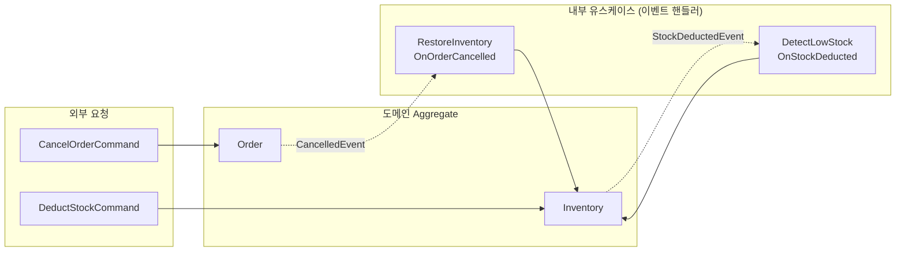
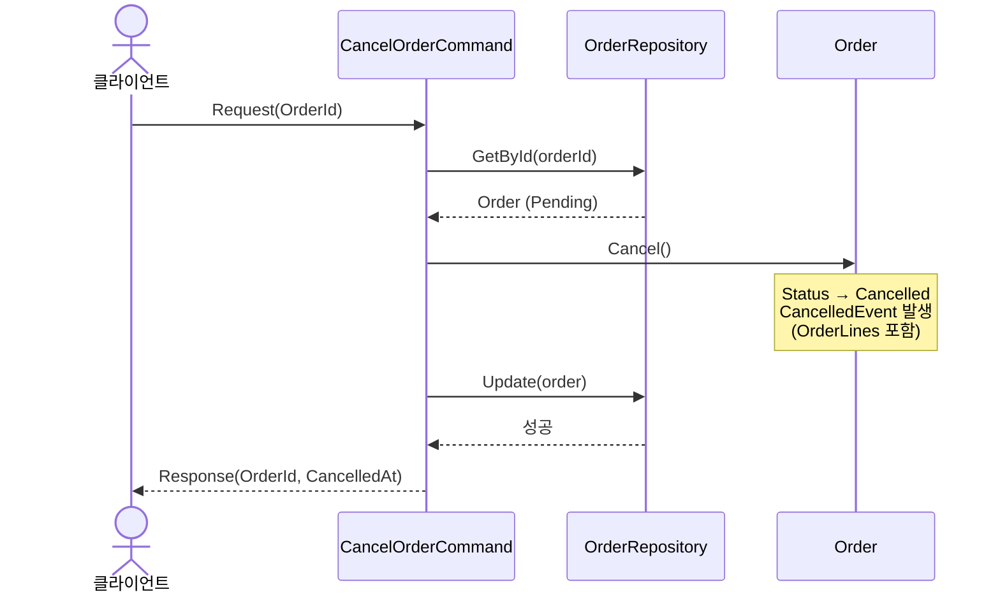
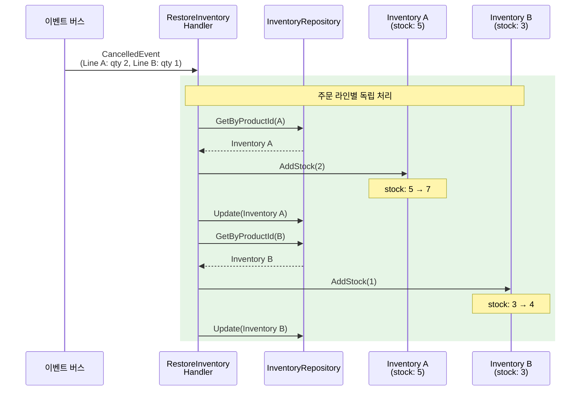
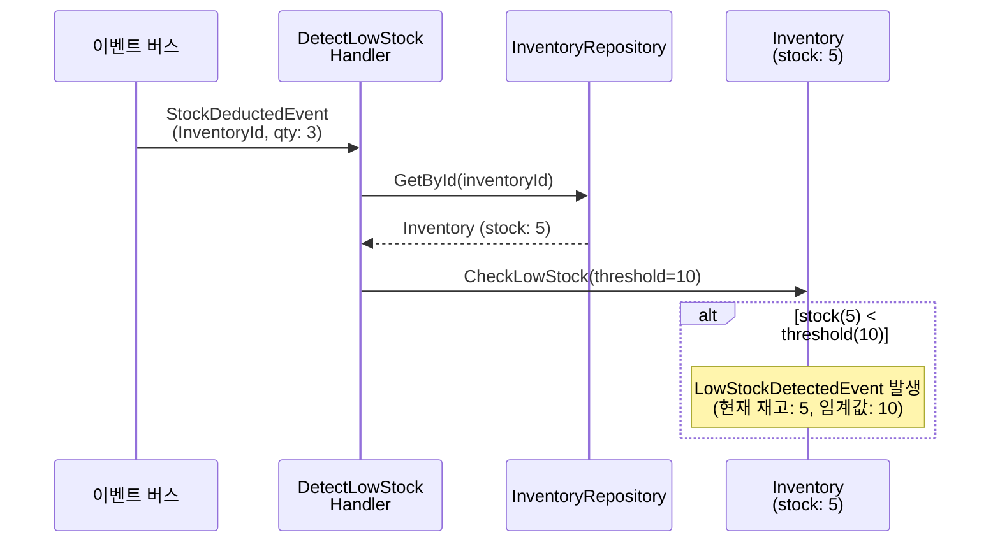
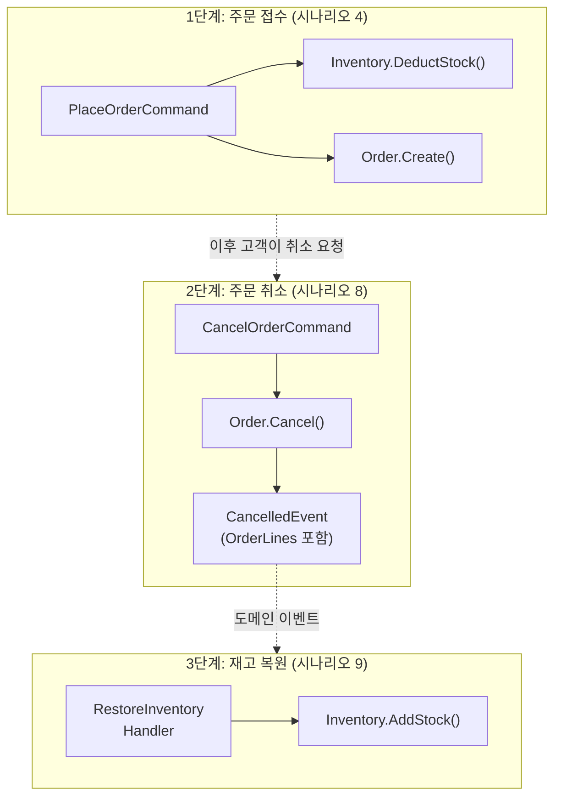
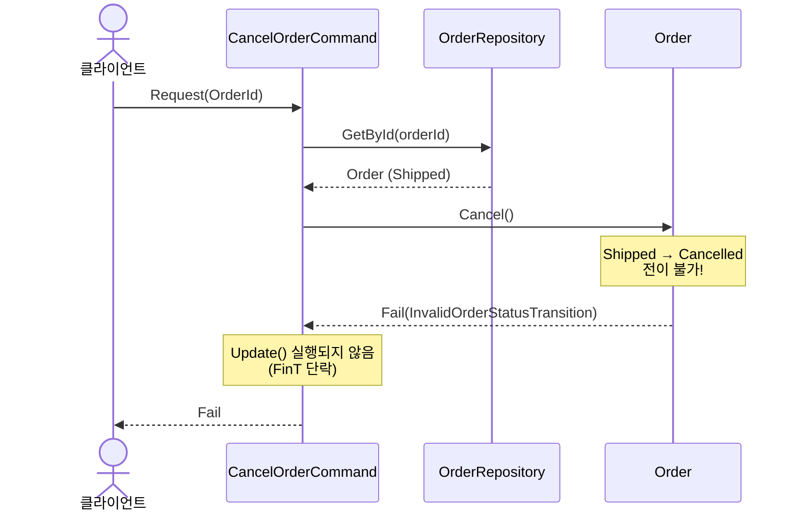
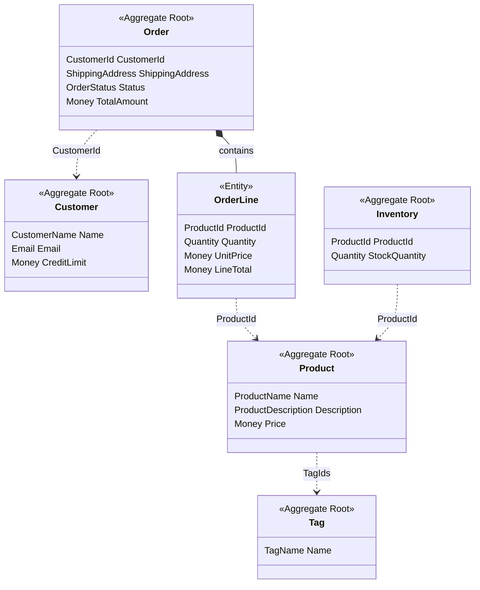

[비즈니스 요구사항](../00-business-requirements/)에서 정의한 워크플로우 시나리오가, [타입 설계 의사결정](../01-type-design-decisions/)과 [코드 설계](../02-code-design/)의 패턴으로 실제 동작함을 증명합니다. 각 테스트는 NSubstitute로 Port를 Mock하고, `FinTFactory`로 IO 효과를 시뮬레이션합니다. 정상 시나리오는 병렬 검증, 배치 조회, 읽기/쓰기 분리가 올바르게 동작하는지, 거부 시나리오는 검증 실패와 에러 전파가 제대로 이루어지는지 확인합니다.

## 정상 시나리오

### 시나리오 1: CreateProduct -- Apply 패턴 + 고유성 검사 (→ 요구사항 #1)

상품 생성 시 모든 Value Object 검증을 Apply 패턴으로 병렬 수행한 뒤, 이름 고유성 검사와 Inventory 생성까지 하나의 `FinT<IO, T>` 파이프라인으로 처리합니다.

```csharp
[Fact]
public async Task Handle_ShouldReturnSuccess_WhenRequestIsValid()
{
    // Arrange
    var request = new CreateProductCommand.Request("Test Product", "Description", 100m, 10);

    _productRepository.Exists(Arg.Any<Specification<Product>>())
        .Returns(FinTFactory.Succ(false));
    _productRepository.Create(Arg.Any<Product>())
        .Returns(call => FinTFactory.Succ(call.Arg<Product>()));
    _inventoryRepository.Create(Arg.Any<Inventory>())
        .Returns(call => FinTFactory.Succ(call.Arg<Inventory>()));

    // Act
    var actual = await _sut.Handle(request, CancellationToken.None);

    // Assert
    actual.IsSucc.ShouldBeTrue();
    actual.ThrowIfFail().Name.ShouldBe("Test Product");
    actual.ThrowIfFail().Price.ShouldBe(100m);
}
```

**Apply 패턴의 동작 원리.** Usecase 내부에서는 `Validation<Error, T>` 타입의 병렬 검증이 이루어집니다.

```csharp
private static Fin<ProductData> CreateProductData(Request request)
{
    // 모든 필드: VO Validate() 사용 (Validation<Error, T> 반환)
    var name = ProductName.Validate(request.Name);
    var description = ProductDescription.Validate(request.Description);
    var price = Money.Validate(request.Price);
    var stockQuantity = Quantity.Validate(request.StockQuantity);

    // 모두 튜플로 병합 - Apply로 병렬 검증
    return (name, description, price, stockQuantity)
        .Apply((n, d, p, s) =>
            new ProductData(
                Product.Create(
                    ProductName.Create(n).ThrowIfFail(),
                    ProductDescription.Create(d).ThrowIfFail(),
                    Money.Create(p).ThrowIfFail()),
                Quantity.Create(s).ThrowIfFail()))
        .As()
        .ToFin();
}
```

4개의 `Validate()` 호출이 모두 `Validation<Error, T>`를 반환하므로, 하나라도 실패하면 **모든 에러가 누적**됩니다. `Bind`(순차 실행)가 아닌 `Apply`(병렬 검증)이기 때문에 첫 번째 에러에서 중단되지 않습니다.

검증 통과 후에는 `FinT<IO, T>` LINQ 합성으로 고유성 검사 -> 저장 -> Inventory 생성을 순차 실행합니다.

```csharp
FinT<IO, Response> usecase =
    from exists in _productRepository.Exists(new ProductNameUniqueSpec(productName))
    from _ in guard(!exists, ApplicationError.For<CreateProductCommand>(
        new AlreadyExists(),
        request.Name,
        $"Product name already exists: '{request.Name}'"))
    from createdProduct in _productRepository.Create(product)
    from createdInventory in _inventoryRepository.Create(
        Inventory.Create(createdProduct.Id, stockQuantity))
    select new Response(
        createdProduct.Id.ToString(),
        createdProduct.Name,
        createdProduct.Description,
        createdProduct.Price,
        createdInventory.StockQuantity,
        createdProduct.CreatedAt);
```

이 테스트가 증명하는 것은 다음과 같습니다. Repository가 성공을 반환하도록 설정하여 Usecase 로직만 격리 테스트합니다. `IsSucc`가 true이므로 Apply 패턴 검증, 고유성 검사, 저장이 모두 성공했음을 증명합니다. 검증 → 중복 확인 → 저장 → Inventory 생성이라는 4단계 파이프라인이 하나의 FinT 체인으로 안전하게 합성되었습니다.

### 시나리오 2: CreateCustomer -- 이메일 고유성 (→ 요구사항 #2)

고객 생성 시 `CustomerName`, `Email`, `Money`(CreditLimit)를 Apply 패턴으로 병렬 검증한 뒤, `CustomerEmailSpec`으로 이메일 중복을 검사합니다.

```csharp
[Fact]
public async Task Handle_ShouldReturnSuccess_WhenRequestIsValid()
{
    // Arrange
    var request = new CreateCustomerCommand.Request("John", "john@example.com", 5000m);

    _customerRepository.Exists(Arg.Any<Specification<Customer>>())
        .Returns(FinTFactory.Succ(false));
    _customerRepository.Create(Arg.Any<Customer>())
        .Returns(call => FinTFactory.Succ(call.Arg<Customer>()));

    // Act
    var actual = await _sut.Handle(request, CancellationToken.None);

    // Assert
    actual.IsSucc.ShouldBeTrue();
    actual.ThrowIfFail().Name.ShouldBe("John");
    actual.ThrowIfFail().Email.ShouldBe("john@example.com");
}
```

Mock 설정 패턴이 CreateProduct와 동일합니다. `Exists(Specification)`은 `false`를 반환하여 중복이 없음을 표현하고, `Create()`는 전달받은 엔티티를 그대로 반환합니다.

Mock 설정 패턴이 CreateProduct와 동일한 것은 우연이 아닙니다. 모든 Command Usecase가 동일한 `Exists → guard → Create` 파이프라인 구조를 따르기 때문입니다. 이 일관성 덕분에 새로운 고유성 검사가 필요한 Use Case를 추가할 때 기존 패턴을 그대로 적용할 수 있습니다.

### 시나리오 3: CreateOrderWithCreditCheck -- 배치 조회 + 신용한도 (→ 요구사항 #3)

주문 생성 시 `IProductCatalog.GetPricesForProducts()`로 상품 가격을 **단일 라운드트립**으로 배치 조회하고, `OrderCreditCheckService`로 신용 한도를 검증합니다.

```csharp
[Fact]
public async Task Handle_ReturnsSuccess_WhenCreditLimitIsSufficient()
{
    // Arrange
    var customer = CreateSampleCustomer(creditLimit: 5000m);
    var productId = ProductId.New();
    var request = new CreateOrderWithCreditCheckCommand.Request(
        customer.Id.ToString(),
        Seq(new CreateOrderWithCreditCheckCommand.OrderLineRequest(productId.ToString(), 2)),
        "Seoul, Korea");

    _customerRepository.GetById(Arg.Any<CustomerId>())
        .Returns(FinTFactory.Succ(customer));
    _productCatalog.GetPricesForProducts(Arg.Any<IReadOnlyList<ProductId>>())
        .Returns(call =>
        {
            var ids = call.Arg<IReadOnlyList<ProductId>>();
            var prices = toSeq(ids.Select(id => (id, Money.Create(1000m).ThrowIfFail())));
            return FinTFactory.Succ(prices);
        });
    _orderRepository.Create(Arg.Any<Order>())
        .Returns(call => FinTFactory.Succ(call.Arg<Order>()));

    // Act
    var actual = await _sut.Handle(request, CancellationToken.None);

    // Assert
    actual.IsSucc.ShouldBeTrue();
    actual.ThrowIfFail().TotalAmount.ShouldBe(2000m);
}
```

`IProductCatalog` Mock은 `call.Arg<IReadOnlyList<ProductId>>()`로 전달된 상품 ID 목록을 받아 각각에 가격을 매핑하여 반환합니다. 단가 1000원 x 수량 2 = 총액 2000원이며, 고객 신용한도 5000원 이내이므로 성공합니다.

`CreateSampleCustomer` 헬퍼는 도메인 VO를 직접 조합하여 테스트 엔티티를 생성합니다.

```csharp
private static Customer CreateSampleCustomer(decimal creditLimit = 5000m)
{
    return Customer.Create(
        CustomerName.Create("John").ThrowIfFail(),
        Email.Create("john@example.com").ThrowIfFail(),
        Money.Create(creditLimit).ThrowIfFail());
}
```

이 테스트는 Application 레이어의 가장 복잡한 Use Case를 검증합니다. 배치 가격 조회(`IProductCatalog`), 교차 Aggregate 검증(`OrderCreditCheckService`), 다중 Repository 조율이 하나의 FinT 파이프라인에서 올바르게 작동하는지 확인합니다.

### 시나리오 4: PlaceOrder -- 다중 Aggregate 쓰기 (UoW) (→ 요구사항 #4)

`CreateOrderWithCreditCheckCommand`는 신용 검증 후 주문 하나만 저장합니다. 실제 주문 접수에서는 재고 차감도 함께 이루어져야 합니다. `PlaceOrderCommand`는 Order 생성과 Inventory 업데이트를 하나의 FinT 체인으로 묶어 원자적 쓰기를 보장합니다.

```csharp
[Fact]
public async Task Handle_ReturnsSuccess_WhenCreditLimitAndStockSufficient()
{
    // Arrange
    var customer = CreateSampleCustomer(creditLimit: 5000m);
    var productId = ProductId.New();
    var inventory = CreateInventoryWithStock(productId, 10);
    var request = new PlaceOrderCommand.Request(
        customer.Id.ToString(),
        Seq(new PlaceOrderCommand.OrderLineRequest(productId.ToString(), 2)),
        "Seoul, Korea");

    _productCatalog.GetPricesForProducts(Arg.Any<IReadOnlyList<ProductId>>())
        .Returns(call =>
        {
            var ids = call.Arg<IReadOnlyList<ProductId>>();
            var prices = toSeq(ids.Select(id => (id, Money.Create(1000m).ThrowIfFail())));
            return FinTFactory.Succ(prices);
        });
    _inventoryRepository.GetByProductId(Arg.Any<ProductId>())
        .Returns(FinTFactory.Succ(inventory));
    _customerRepository.GetById(Arg.Any<CustomerId>())
        .Returns(FinTFactory.Succ(customer));
    _orderRepository.Create(Arg.Any<Order>())
        .Returns(call => FinTFactory.Succ(call.Arg<Order>()));
    _inventoryRepository.UpdateRange(Arg.Any<IReadOnlyList<Inventory>>())
        .Returns(call => FinTFactory.Succ(toSeq(call.Arg<IReadOnlyList<Inventory>>())));

    // Act
    var actual = await _sut.Handle(request, CancellationToken.None);

    // Assert
    actual.IsSucc.ShouldBeTrue();
    actual.ThrowIfFail().TotalAmount.ShouldBe(2000m);
    actual.ThrowIfFail().DeductedStocks.Count.ShouldBe(1);
    actual.ThrowIfFail().DeductedStocks[0].RemainingStock.ShouldBe(8);
}
```

이전 시나리오들과의 핵심 차이는 **Mock 대상이 5개 포트에 걸친다는 점입니다.** `IProductCatalog`(가격 조회), `IInventoryRepository`(재고 조회/차감/저장), `ICustomerRepository`(고객 조회), `IOrderRepository`(주문 저장) — 네 Repository와 하나의 Special Port가 모두 협력해야 성공합니다.

Assert에서 `TotalAmount`(주문 생성 확인)과 `DeductedStocks[0].RemainingStock`(재고 차감 확인)을 함께 검증합니다. 10개 재고에서 2개를 차감하여 8개가 남았다는 사실이, 두 Aggregate가 하나의 트랜잭션에서 함께 변경되었음을 증명합니다.

### 시나리오 5: SearchProducts -- Specification 합성 + 페이지네이션 (→ 요구사항 #5)

Query는 `IProductQuery` Read Adapter를 통해 Aggregate 재구성 없이 DTO로 직접 프로젝션합니다. Specification 합성과 페이지네이션을 조합합니다.

```csharp
[Fact]
public async Task Handle_ReturnsSuccess_WhenNoFiltersProvided()
{
    // Arrange
    var pagedResult = CreateSamplePagedResult();
    var request = new SearchProductsQuery.Request();

    _readAdapter.Search(
            Arg.Any<Specification<Product>>(),
            Arg.Any<PageRequest>(),
            Arg.Any<SortExpression>())
        .Returns(FinTFactory.Succ(pagedResult));

    // Act
    var actual = await _sut.Handle(request, CancellationToken.None);

    // Assert
    actual.IsSucc.ShouldBeTrue();
    actual.ThrowIfFail().Products.Count.ShouldBe(3);
    actual.ThrowIfFail().TotalCount.ShouldBe(3);
}
```

페이지네이션 메타데이터 검증 테스트는 `PagedResult`의 연산 결과를 확인합니다.

```csharp
[Fact]
public async Task Handle_ReturnsPaginationMetadata_WhenPageProvided()
{
    // Arrange
    List<ProductSummaryDto> items = [new(ProductId.New().ToString(), "Item", 100m)];
    var pagedResult = new PagedResult<ProductSummaryDto>(items, 50, 2, 10);
    var request = new SearchProductsQuery.Request(Page: 2, PageSize: 10);

    _readAdapter.Search(
            Arg.Any<Specification<Product>>(),
            Arg.Any<PageRequest>(),
            Arg.Any<SortExpression>())
        .Returns(FinTFactory.Succ(pagedResult));

    // Act
    var actual = await _sut.Handle(request, CancellationToken.None);

    // Assert
    actual.IsSucc.ShouldBeTrue();
    var response = actual.ThrowIfFail();
    response.Page.ShouldBe(2);
    response.PageSize.ShouldBe(10);
    response.TotalCount.ShouldBe(50);
    response.TotalPages.ShouldBe(5);
    response.HasPreviousPage.ShouldBeTrue();
    response.HasNextPage.ShouldBeTrue();
}
```

Usecase 내부에서는 `Specification<Product>.All`을 기본으로 하여 요청 파라미터에 따라 `ProductNameSpec`, `ProductPriceRangeSpec`을 `&=`로 합성합니다.

```csharp
private static Specification<Product> BuildSpecification(Request request)
{
    var spec = Specification<Product>.All;

    if (request.Name.Length > 0)
        spec &= new ProductNameSpec(
            ProductName.Create(request.Name).ThrowIfFail());

    if (request.MinPrice > 0 && request.MaxPrice > 0)
        spec &= new ProductPriceRangeSpec(
            Money.Create(request.MinPrice).ThrowIfFail(),
            Money.Create(request.MaxPrice).ThrowIfFail());

    return spec;
}
```

### 시나리오 6: GetCustomerOrders -- 4-table JOIN 프로젝션 (→ 요구사항 #6)

`ICustomerOrdersQuery` Read Adapter로 Customer → Order → OrderLine → Product 4-table JOIN을 수행하여, 특정 고객의 모든 주문과 각 주문 라인의 상품명까지 한번에 프로젝션합니다.

```csharp
[Fact]
public async Task Handle_ReturnsSuccess_WhenCustomerHasOrders()
{
    // Arrange
    var customerId = CustomerId.New();
    var dto = new CustomerOrdersDto(
        customerId.ToString(),
        "Test Customer",
        Seq(new CustomerOrderDto(
            "order-1",
            Seq(new CustomerOrderLineDto(ProductId.New().ToString(), "Product A", 2, 100m, 200m)),
            200m,
            "Confirmed",
            DateTime.UtcNow)));

    var request = new GetCustomerOrdersQuery.Request(customerId.ToString());

    _readAdapter.GetByCustomerId(Arg.Any<CustomerId>())
        .Returns(FinTFactory.Succ(dto));

    // Act
    var actual = await _sut.Handle(request, CancellationToken.None);

    // Assert
    actual.IsSucc.ShouldBeTrue();
    var result = actual.ThrowIfFail().CustomerOrders;
    result.CustomerName.ShouldBe("Test Customer");
    result.Orders.Count.ShouldBe(1);
    result.Orders[0].OrderLines.Count.ShouldBe(1);
    result.Orders[0].OrderLines[0].ProductName.ShouldBe("Product A");
}
```

Usecase 내부는 `_readAdapter.GetByCustomerId(customerId)`를 호출하는 단일 FinT LINQ 파이프라인입니다.

```csharp
FinT<IO, Response> usecase =
    from customerOrders in _readAdapter.GetByCustomerId(customerId)
    select new Response(customerOrders);
```

SearchProducts(시나리오 5)가 `Specification` 기반 검색이라면, GetCustomerOrders는 **엔티티 ID 기반 상세 조회**입니다. Read Adapter가 4개 테이블을 JOIN하여 필요한 형태의 DTO로 직접 프로젝션하므로, Aggregate 재구성 없이 효율적으로 데이터를 반환합니다.

다중 주문과 다중 주문 라인을 함께 검증하는 테스트입니다.

```csharp
[Fact]
public async Task Handle_ReturnsSuccess_WhenCustomerHasMultipleOrdersWithMultipleLines()
{
    // Arrange
    var customerId = CustomerId.New();
    var dto = new CustomerOrdersDto(
        customerId.ToString(),
        "VIP Customer",
        Seq(
            new CustomerOrderDto(
                "order-1",
                Seq(
                    new CustomerOrderLineDto(ProductId.New().ToString(), "Product A", 1, 100m, 100m),
                    new CustomerOrderLineDto(ProductId.New().ToString(), "Product B", 2, 50m, 100m)),
                200m, "Delivered", DateTime.UtcNow.AddDays(-10)),
            new CustomerOrderDto(
                "order-2",
                Seq(new CustomerOrderLineDto(ProductId.New().ToString(), "Product C", 3, 200m, 600m)),
                600m, "Pending", DateTime.UtcNow)));

    var request = new GetCustomerOrdersQuery.Request(customerId.ToString());

    _readAdapter.GetByCustomerId(Arg.Any<CustomerId>())
        .Returns(FinTFactory.Succ(dto));

    // Act
    var actual = await _sut.Handle(request, CancellationToken.None);

    // Assert
    actual.IsSucc.ShouldBeTrue();
    var result = actual.ThrowIfFail().CustomerOrders;
    result.Orders.Count.ShouldBe(2);
    result.Orders[0].OrderLines.Count.ShouldBe(2);
    result.Orders[1].OrderLines.Count.ShouldBe(1);
}
```

VIP Customer의 2건 주문 — 첫 번째 주문은 2개 라인(Product A, B), 두 번째 주문은 1개 라인(Product C)으로 구성됩니다. Read Adapter가 계층적 DTO(`CustomerOrdersDto` → `CustomerOrderDto` → `CustomerOrderLineDto`)를 올바르게 조립하여 반환하는지 검증합니다.

### 시나리오 7: SearchCustomerOrderSummary -- LEFT JOIN 집계 + 페이지네이션 (→ 요구사항 #7)

`ICustomerOrderSummaryQuery` Read Adapter로 Customer와 Order를 LEFT JOIN + GROUP BY 집계하여, 고객별 총 주문 수, 총 지출, 마지막 주문일을 조회합니다. 페이지네이션과 정렬을 지원합니다.

```csharp
[Fact]
public async Task Handle_ReturnsSuccess_WhenNoFiltersProvided()
{
    // Arrange
    var pagedResult = CreateSamplePagedResult();
    var request = new SearchCustomerOrderSummaryQuery.Request();

    _readAdapter.Search(
            Arg.Any<Specification<Customer>>(),
            Arg.Any<PageRequest>(),
            Arg.Any<SortExpression>())
        .Returns(FinTFactory.Succ(pagedResult));

    // Act
    var actual = await _sut.Handle(request, CancellationToken.None);

    // Assert
    actual.IsSucc.ShouldBeTrue();
    actual.ThrowIfFail().Customers.Count.ShouldBe(3);
    actual.ThrowIfFail().TotalCount.ShouldBe(3);
}
```

Usecase 내부는 SearchProducts(시나리오 5)와 동일한 Search Query 패턴을 따릅니다. `Specification<Customer>.All`을 기본으로 하여 `PageRequest`와 `SortExpression`을 조합합니다.

```csharp
var spec = Specification<Customer>.All;
var pageRequest = new PageRequest(request.Page, request.PageSize);
var sortExpression = SortExpression.By(request.SortBy,
    SortDirection.Parse(request.SortDirection));

FinT<IO, Response> usecase =
    from result in _readAdapter.Search(spec, pageRequest, sortExpression)
    select new Response(
        result.Items,
        result.TotalCount,
        result.Page,
        result.PageSize,
        result.TotalPages,
        result.HasNextPage,
        result.HasPreviousPage);
```

LEFT JOIN의 핵심 동작을 증명하는 테스트입니다. 주문이 없는 고객도 결과에 포함되어야 합니다.

```csharp
[Fact]
public async Task Handle_ReturnsCustomerWithNoOrders_WhenCustomerHasZeroOrders()
{
    // Arrange
    List<CustomerOrderSummaryDto> items =
        [new(CustomerId.New().ToString(), "New Customer", 0, 0m, null)];
    var pagedResult = new PagedResult<CustomerOrderSummaryDto>(items, 1, 1, 20);
    var request = new SearchCustomerOrderSummaryQuery.Request();

    _readAdapter.Search(
            Arg.Any<Specification<Customer>>(),
            Arg.Any<PageRequest>(),
            Arg.Any<SortExpression>())
        .Returns(FinTFactory.Succ(pagedResult));

    // Act
    var actual = await _sut.Handle(request, CancellationToken.None);

    // Assert
    actual.IsSucc.ShouldBeTrue();
    var customer = actual.ThrowIfFail().Customers[0];
    customer.OrderCount.ShouldBe(0);
    customer.TotalSpent.ShouldBe(0m);
    customer.LastOrderDate.ShouldBeNull();
}
```

`OrderCount == 0`, `TotalSpent == 0`, `LastOrderDate == null` — INNER JOIN이었다면 이 고객은 결과에서 제외됩니다. LEFT JOIN이기 때문에 주문 없는 고객도 포함되며, 집계 값은 0/null로 반환됩니다.

페이지네이션 메타데이터 검증입니다.

```csharp
[Fact]
public async Task Handle_ReturnsPaginationMetadata_WhenPageProvided()
{
    // Arrange
    List<CustomerOrderSummaryDto> items =
        [new(CustomerId.New().ToString(), "Alice", 5, 1500m, DateTime.UtcNow)];
    var pagedResult = new PagedResult<CustomerOrderSummaryDto>(items, 50, 2, 10);
    var request = new SearchCustomerOrderSummaryQuery.Request(Page: 2, PageSize: 10);

    _readAdapter.Search(
            Arg.Any<Specification<Customer>>(),
            Arg.Any<PageRequest>(),
            Arg.Any<SortExpression>())
        .Returns(FinTFactory.Succ(pagedResult));

    // Act
    var actual = await _sut.Handle(request, CancellationToken.None);

    // Assert
    actual.IsSucc.ShouldBeTrue();
    var response = actual.ThrowIfFail();
    response.Page.ShouldBe(2);
    response.PageSize.ShouldBe(10);
    response.TotalCount.ShouldBe(50);
    response.TotalPages.ShouldBe(5);
    response.HasPreviousPage.ShouldBeTrue();
    response.HasNextPage.ShouldBeTrue();
}
```

SearchProducts(시나리오 5)의 페이지네이션 테스트와 동일한 구조입니다. `PagedResult`가 총 50건, 2페이지, 10건/페이지로 설정되어 `TotalPages = 5`, `HasPreviousPage = true`, `HasNextPage = true`가 검증됩니다. Search Query 패턴이 Product와 Customer에서 동일하게 재사용됨을 보여줍니다.

## 도메인 이벤트 반응형 시나리오

지금까지의 시나리오는 모두 외부 요청(HTTP/API)에 의해 시작됩니다. 다음 시나리오들은 **도메인 이벤트**에 의해 트리거되는 내부 유스케이스입니다. Aggregate 간 최종 일관성(eventual consistency)을 달성하는 핵심 메커니즘입니다.



### 시나리오 8: CancelOrder -- 주문 취소 + 이벤트 트리거 (→ 요구사항 #8)

Pending 또는 Confirmed 상태의 주문을 취소합니다. `CancelOrderCommand`는 `IOrderRepository`만 의존하며, `Order.Cancel()` 도메인 로직에 위임합니다. 취소 시 발생하는 `CancelledEvent`에는 주문 라인 정보가 포함되어 후속 이벤트 핸들러가 재고를 복원할 수 있습니다.



```csharp
[Fact]
public async Task Handle_ReturnsSuccess_WhenOrderIsPending()
{
    // Arrange
    var order = CreateOrderWithStatus(OrderStatus.Pending);
    var request = new CancelOrderCommand.Request(order.Id.ToString());

    _orderRepository.GetById(Arg.Any<OrderId>())
        .Returns(FinTFactory.Succ(order));
    _orderRepository.Update(Arg.Any<Order>())
        .Returns(call => FinTFactory.Succ(call.Arg<Order>()));

    // Act
    var actual = await _sut.Handle(request, CancellationToken.None);

    // Assert
    actual.IsSucc.ShouldBeTrue();
    actual.ThrowIfFail().OrderId.ShouldBe(order.Id.ToString());
}
```

Usecase 내부의 FinT LINQ 합성은 기존 `DeleteProductCommand`와 동일한 `GetById → 도메인 메서드 → Update` 패턴을 따릅니다.

```csharp
FinT<IO, Response> usecase =
    from order in _orderRepository.GetById(orderId)
    from _1 in order.Cancel()
    from updated in _orderRepository.Update(order)
    select new Response(
        updated.Id.ToString(),
        updated.UpdatedAt.IfNone(DateTime.UtcNow));
```

`Order.Cancel()`이 `Fin<Unit>`을 반환하므로, 상태 전이가 허용되지 않으면(예: Shipped → Cancelled) `InvalidOrderStatusTransition` 도메인 에러가 FinT 체인을 통해 자동 전파됩니다. `Update()` Mock 설정 없이도 테스트가 통과하는 것이 단락(short-circuit) 동작을 증명합니다.

### 시나리오 9: RestoreInventory -- 주문 취소 시 재고 자동 복원 (→ 요구사항 #8)

`CancelledEvent`가 발행되면 `RestoreInventoryOnOrderCancelledHandler`가 각 주문 라인의 상품별 재고를 복원합니다. 이 핸들러는 **개별 주문 라인 단위로 독립 처리**하여, 하나의 재고 복원 실패가 나머지를 차단하지 않습니다.



```csharp
[Fact]
public async Task Handle_RestoresStock_ForEachOrderLine()
{
    // Arrange
    var productId1 = ProductId.New();
    var productId2 = ProductId.New();
    var inventory1 = Inventory.Create(productId1, Quantity.Create(5).ThrowIfFail());
    var inventory2 = Inventory.Create(productId2, Quantity.Create(3).ThrowIfFail());

    var notification = new Order.CancelledEvent(
        OrderId.New(),
        Seq(
            new Order.OrderLineInfo(productId1, Quantity.Create(2).ThrowIfFail(),
                Money.Create(100m).ThrowIfFail(), Money.Create(200m).ThrowIfFail()),
            new Order.OrderLineInfo(productId2, Quantity.Create(1).ThrowIfFail(),
                Money.Create(50m).ThrowIfFail(), Money.Create(50m).ThrowIfFail())));

    _inventoryRepository.GetByProductId(productId1)
        .Returns(FinTFactory.Succ(inventory1));
    _inventoryRepository.GetByProductId(productId2)
        .Returns(FinTFactory.Succ(inventory2));
    _inventoryRepository.Update(Arg.Any<Inventory>())
        .Returns(call => FinTFactory.Succ(call.Arg<Inventory>()));

    // Act
    await _sut.Handle(notification, CancellationToken.None);

    // Assert
    ((int)inventory1.StockQuantity).ShouldBe(7); // 5 + 2
    ((int)inventory2.StockQuantity).ShouldBe(4); // 3 + 1
}
```

핸들러 내부에서는 각 주문 라인을 순회하며 `FinT<IO, T>` 파이프라인을 개별 실행합니다.

```csharp
foreach (var line in notification.OrderLines)
{
    var result = await _inventoryRepository.GetByProductId(line.ProductId)
        .Map(inventory => inventory.AddStock(line.Quantity))
        .Bind(inventory => _inventoryRepository.Update(inventory))
        .Run().RunAsync();
}
```

`foreach` + 개별 `Run().RunAsync()`는 의도적인 설계입니다. 하나의 `FinT` 체인으로 묶으면 첫 번째 실패에서 전체가 중단되지만, 개별 실행하면 **부분 실패를 허용**합니다. 상품 A의 재고를 찾지 못해도 상품 B의 재고는 정상 복원됩니다.

```csharp
[Fact]
public async Task Handle_ContinuesProcessing_WhenOneInventoryNotFound()
{
    // Arrange — productId1의 재고는 존재하지 않음
    _inventoryRepository.GetByProductId(productId1)
        .Returns(FinTFactory.Fail<Inventory>(Error.New("Inventory not found")));
    _inventoryRepository.GetByProductId(productId2)
        .Returns(FinTFactory.Succ(inventory2));
    _inventoryRepository.Update(Arg.Any<Inventory>())
        .Returns(call => FinTFactory.Succ(call.Arg<Inventory>()));

    // Act
    await _sut.Handle(notification, CancellationToken.None);

    // Assert — productId2의 재고는 정상 복원
    ((int)inventory2.StockQuantity).ShouldBe(4); // 3 + 1
}
```

### 시나리오 10: DetectLowStock -- 재고 차감 시 저재고 감지 (→ 요구사항 #9)

`StockDeductedEvent`가 발행되면 `DetectLowStockOnStockDeductedHandler`가 현재 재고를 조회하여 임계값(10) 이하인지 확인합니다. 저재고가 감지되면 `Inventory.CheckLowStock()`이 `LowStockDetectedEvent`를 발생시킵니다.



```csharp
[Fact]
public async Task Handle_RaisesLowStockDetected_WhenBelowThreshold()
{
    // Arrange
    var inventory = Inventory.Create(ProductId.New(), Quantity.Create(5).ThrowIfFail());
    inventory.ClearDomainEvents();

    var notification = new Inventory.StockDeductedEvent(
        inventory.Id, inventory.ProductId, Quantity.Create(3).ThrowIfFail());

    _inventoryRepository.GetById(inventory.Id)
        .Returns(FinTFactory.Succ(inventory));

    // Act
    await _sut.Handle(notification, CancellationToken.None);

    // Assert — 재고 5 < 임계값 10 → LowStockDetectedEvent 발생
    inventory.DomainEvents.OfType<Inventory.LowStockDetectedEvent>().ShouldHaveSingleItem();
}
```

저재고 감지 로직은 Application 레이어가 아닌 **도메인 Aggregate 내부**에 위치합니다. `AddDomainEvent`가 `protected`이므로, 핸들러는 `Inventory.CheckLowStock(threshold)`을 호출하여 도메인에 위임합니다.

```csharp
// Inventory.cs
public void CheckLowStock(Quantity threshold)
{
    if ((int)StockQuantity < (int)threshold)
        AddDomainEvent(new LowStockDetectedEvent(Id, ProductId, StockQuantity, threshold));
}
```

임계값(10) 이상이면 이벤트가 발생하지 않습니다.

```csharp
[Fact]
public async Task Handle_DoesNotRaise_WhenAboveThreshold()
{
    // Arrange
    var inventory = Inventory.Create(ProductId.New(), Quantity.Create(15).ThrowIfFail());
    inventory.ClearDomainEvents();

    var notification = new Inventory.StockDeductedEvent(
        inventory.Id, inventory.ProductId, Quantity.Create(3).ThrowIfFail());

    _inventoryRepository.GetById(inventory.Id)
        .Returns(FinTFactory.Succ(inventory));

    // Act
    await _sut.Handle(notification, CancellationToken.None);

    // Assert — 재고 15 >= 임계값 10 → 이벤트 없음
    inventory.DomainEvents.OfType<Inventory.LowStockDetectedEvent>().ShouldBeEmpty();
}
```

`LowStockDetectedEvent`는 현재 구독자가 없지만, 추후 외부 알림(이메일, Slack) 핸들러를 추가하면 **코드 변경 없이** 확장됩니다. 이것이 도메인 이벤트의 Open/Closed 원칙 적용입니다.

### 시나리오 4 → 8 → 9 연결: 주문 접수에서 취소까지의 전체 흐름

시나리오 4(PlaceOrder), 시나리오 8(CancelOrder), 시나리오 9(RestoreInventory)은 하나의 비즈니스 흐름을 구성합니다.



재고 10개인 상품에 수량 2를 주문하면 재고 8이 됩니다(시나리오 4). 이후 주문을 취소하면(시나리오 8) `CancelledEvent`가 발행되고, 재고 복원 핸들러가 수량 2를 복원하여(시나리오 9) 재고가 다시 10이 됩니다. **Order는 Inventory를 직접 참조하지 않으며**, 도메인 이벤트만으로 두 Aggregate가 느슨하게 연결됩니다.

정상 시나리오와 도메인 이벤트 반응형 시나리오에서 각 패턴이 올바르게 작동함을 확인했습니다. 이제 거부 시나리오에서 에러가 어떻게 발생하고 전파되는지 살펴봅니다. Application 레이어의 에러 처리는 try-catch가 아닌 타입 시스템(`Fin<T>`, `FinT<IO, T>`)에 의해 자동으로 이루어집니다.

## 거부 시나리오

### 시나리오 11: 배송 후 취소 거부 (InvalidOrderStatusTransition) (→ 요구사항 #16)

Shipped 또는 Delivered 상태의 주문을 취소하면 `Order.Cancel()`이 `InvalidOrderStatusTransition` 도메인 에러를 반환합니다. FinT 체인의 단락에 의해 `Update()` 호출이 실행되지 않습니다.



```csharp
[Fact]
public async Task Handle_ReturnsFail_WhenOrderIsShipped()
{
    // Arrange
    var order = CreateOrderWithStatus(OrderStatus.Shipped);
    var request = new CancelOrderCommand.Request(order.Id.ToString());

    _orderRepository.GetById(Arg.Any<OrderId>())
        .Returns(FinTFactory.Succ(order));

    // Act
    var actual = await _sut.Handle(request, CancellationToken.None);

    // Assert
    actual.IsSucc.ShouldBeFalse();
}
```

`_orderRepository.Update()` Mock을 설정하지 않아도 테스트가 통과합니다. `Cancel()`이 `Fail`을 반환하면 FinT LINQ 합성의 모나드 바인딩에 의해 `from updated in _orderRepository.Update(order)` 라인이 실행되지 않기 때문입니다. 이는 시나리오 13(AlreadyExists)에서 `guard` 실패 후 `Create()`가 실행되지 않는 것과 동일한 원리입니다.

### 시나리오 12: 다중 VO 검증 실패 (에러 누적) (→ 요구사항 #10)

Apply 패턴은 개별 VO 검증을 병렬로 수행하므로, 여러 필드가 동시에 실패하면 **모든 에러가 누적**됩니다. 빈 이름과 0원 가격을 동시에 전달하면 두 에러가 한번에 반환됩니다.

```csharp
[Fact]
public async Task Handle_ShouldReturnFailure_WhenNameIsEmpty()
{
    // Arrange
    var request = new CreateProductCommand.Request("", "Description", 100m, 10);

    // Act
    var actual = await _sut.Handle(request, CancellationToken.None);

    // Assert
    actual.IsSucc.ShouldBeFalse();
}

[Fact]
public async Task Handle_ShouldReturnFailure_WhenPriceIsZero()
{
    // Arrange
    var request = new CreateProductCommand.Request("Test Product", "Description", 0m, 10);

    // Act
    var actual = await _sut.Handle(request, CancellationToken.None);

    // Assert
    actual.IsSucc.ShouldBeFalse();
}
```

VO 검증 실패 시 Repository Mock 설정이 필요하지 않습니다. Apply 패턴이 `CreateProductData()` 단계에서 즉시 `Fail`을 반환하므로 IO 효과가 실행되지 않습니다. 이것이 "검증 실패 시 조기 반환"의 핵심입니다.

이것이 Apply 패턴과 Bind 패턴의 실질적 차이입니다. Bind였다면 빈 이름에서 즉시 중단되어 가격 오류는 보고되지 않았을 것입니다. Apply는 독립적인 검증을 모두 실행하여 사용자가 한 번의 요청으로 모든 문제를 파악할 수 있게 합니다.

### 시나리오 13: AlreadyExists (중복 이름/이메일) (→ 요구사항 #11)

`Specification` 기반 고유성 검사에서 중복이 발견되면 `ApplicationError.For<T>(new AlreadyExists(), ...)`를 반환합니다.

```csharp
[Fact]
public async Task Handle_ShouldReturnFailure_WhenDuplicateName()
{
    // Arrange
    var request = new CreateProductCommand.Request("Existing Product", "Description", 100m, 10);

    _productRepository.Exists(Arg.Any<Specification<Product>>())
        .Returns(FinTFactory.Succ(true));

    // Act
    var actual = await _sut.Handle(request, CancellationToken.None);

    // Assert
    actual.IsSucc.ShouldBeFalse();
}
```

Customer의 이메일 중복도 동일한 패턴입니다.

```csharp
[Fact]
public async Task Handle_ShouldReturnFailure_WhenDuplicateEmail()
{
    // Arrange
    var request = new CreateCustomerCommand.Request("John", "john@example.com", 5000m);

    _customerRepository.Exists(Arg.Any<Specification<Customer>>())
        .Returns(FinTFactory.Succ(true));

    // Act
    var actual = await _sut.Handle(request, CancellationToken.None);

    // Assert
    actual.IsSucc.ShouldBeFalse();
}
```

`Exists()`가 `true`를 반환하면 `guard(!exists, ...)` 에서 실패하여 `AlreadyExists` 에러가 전파됩니다. `Create()` Mock은 설정하지 않아도 됩니다 -- `guard`에서 이미 중단되었기 때문입니다.

`guard`에서 중단되었으므로 `Create()` Mock을 설정하지 않아도 테스트가 통과합니다. 이는 FinT 체인의 단락(short-circuit) 특성을 증명합니다 — 실패 이후의 모든 IO 연산이 실행되지 않습니다.

### 시나리오 14: NotFound (존재하지 않는 상품) (→ 요구사항 #12)

**UpdateProduct** -- `GetById()`가 `Fail`을 반환하면 LINQ 합성의 첫 `from`에서 즉시 중단됩니다.

```csharp
[Fact]
public async Task Handle_ShouldReturnFailure_WhenProductNotFound()
{
    // Arrange
    var request = new UpdateProductCommand.Request(
        ProductId.New().ToString(), "Updated", "Desc", 200m);

    _productRepository.GetById(Arg.Any<ProductId>())
        .Returns(FinTFactory.Fail<Product>(Error.New("Product not found")));

    // Act
    var actual = await _sut.Handle(request, CancellationToken.None);

    // Assert
    actual.IsSucc.ShouldBeFalse();
}
```

**DeleteProduct** -- `GetByIdIncludingDeleted()`가 `Fail`을 반환하는 경우입니다.

```csharp
[Fact]
public async Task Handle_ReturnsFail_WhenProductNotFound()
{
    // Arrange
    var request = new DeleteProductCommand.Request(
        ProductId.New().ToString(), "admin");

    _productRepository.GetByIdIncludingDeleted(Arg.Any<ProductId>())
        .Returns(FinTFactory.Fail<Product>(Error.New("Product not found")));

    // Act
    var actual = await _sut.Handle(request, CancellationToken.None);

    // Assert
    actual.IsSucc.ShouldBeFalse();
}
```

`FinTFactory.Fail<T>(Error.New(...))` 패턴으로 Repository가 실패를 반환하면, `FinT<IO, T>` LINQ 합성의 모나드 바인딩에 의해 후속 단계가 실행되지 않고 에러가 그대로 전파됩니다.

### 시나리오 15: 도메인 에러 전파 (CreditLimitExceeded, InsufficientStock) (→ 요구사항 #13, #14)

`OrderCreditCheckService`의 `CreditLimitExceeded` 도메인 에러가 Application 레이어까지 전파됩니다.

```csharp
[Fact]
public async Task Handle_ReturnsFail_WhenCreditLimitExceeded()
{
    // Arrange
    var customer = CreateSampleCustomer(creditLimit: 1000m);
    var productId = ProductId.New();
    var request = new CreateOrderWithCreditCheckCommand.Request(
        customer.Id.ToString(),
        Seq(new CreateOrderWithCreditCheckCommand.OrderLineRequest(productId.ToString(), 2)),
        "Seoul, Korea");

    _customerRepository.GetById(Arg.Any<CustomerId>())
        .Returns(FinTFactory.Succ(customer));
    _productCatalog.GetPricesForProducts(Arg.Any<IReadOnlyList<ProductId>>())
        .Returns(call =>
        {
            var ids = call.Arg<IReadOnlyList<ProductId>>();
            var prices = toSeq(ids.Select(id => (id, Money.Create(1000m).ThrowIfFail())));
            return FinTFactory.Succ(prices);
        });

    // Act
    var actual = await _sut.Handle(request, CancellationToken.None);

    // Assert
    actual.IsSucc.ShouldBeFalse();
}
```

단가 1000원 x 수량 2 = 총액 2000원인데 신용한도가 1000원이므로, Domain Service에서 `CreditLimitExceeded` 에러를 반환합니다. 이 에러는 `FinT<IO, T>` LINQ 합성 내부의 `_creditCheckService.ValidateCreditLimit(customer, newOrder.TotalAmount)`에서 발생하여, `_orderRepository.Create()`가 실행되지 않고 에러가 상위로 전파됩니다.

`PlaceOrderCommand`에서도 동일한 도메인 에러 전파가 이루어집니다. 재고 부족 시 `Inventory.DeductStock()`이 `InsufficientStock` 에러를 반환하고, 신용 한도 초과 시 `OrderCreditCheckService`가 `CreditLimitExceeded` 에러를 반환합니다. 두 경우 모두 FinT LINQ 체인의 모나드 바인딩에 의해 후속 단계가 실행되지 않고 에러가 전파됩니다.

```csharp
[Fact]
public async Task Handle_ReturnsFail_WhenInsufficientStock()
{
    // Arrange
    var productId = ProductId.New();
    var inventory = CreateInventoryWithStock(productId, 1);  // 재고 1개
    var request = new PlaceOrderCommand.Request(
        CustomerId.New().ToString(),
        Seq(new PlaceOrderCommand.OrderLineRequest(productId.ToString(), 2)),  // 2개 주문
        "Seoul, Korea");

    _productCatalog.GetPricesForProducts(Arg.Any<IReadOnlyList<ProductId>>())
        .Returns(call =>
        {
            var ids = call.Arg<IReadOnlyList<ProductId>>();
            var prices = toSeq(ids.Select(id => (id, Money.Create(1000m).ThrowIfFail())));
            return FinTFactory.Succ(prices);
        });
    _inventoryRepository.GetByProductId(Arg.Any<ProductId>())
        .Returns(FinTFactory.Succ(inventory));

    // Act
    var actual = await _sut.Handle(request, CancellationToken.None);

    // Assert
    actual.IsSucc.ShouldBeFalse();
}
```

재고가 1개인데 2개를 주문하면 `DeductStock`이 `InsufficientStock` 도메인 에러를 반환합니다. 이 시점에서 Customer 조회, 신용 검증, Order 생성, Inventory 저장이 모두 실행되지 않습니다. `_customerRepository`와 `_orderRepository`를 Mock 설정하지 않아도 테스트가 통과하는 것이, FinT 체인의 단락(short-circuit)이 정확히 동작함을 증명합니다.

에러는 발생 지점에서 FinT 체인을 따라 최종 `FinResponse`까지 자동으로 전파됩니다. 중간에 try-catch가 없어도 타입 시스템이 에러 흐름을 보장합니다. 다음 표는 각 에러 유형별 발생 원천과 전파 경로를 정리합니다.

### 시나리오 16: 형식 검증 거부 (FluentValidation) (→ 요구사항 #15)

FluentValidation Validator가 워크플로우 진입 전에 형식 오류를 거부합니다. Validator 실패 시 Usecase `Handle()`이 실행되지 않으므로, Mock 설정이 필요하지 않습니다.

**쌍 범위 검증** — `SearchProductsQueryValidator`는 MinPrice와 MaxPrice가 반드시 함께 제공되어야 한다는 규칙을 검증합니다.

```csharp
[Fact]
public void Validate_ReturnsValidationError_WhenOnlyMinPriceProvided()
{
    // Arrange
    var request = new SearchProductsQuery.Request(MinPrice: 100m);

    // Act
    var actual = _sut.Validate(request);

    // Assert
    actual.IsValid.ShouldBeFalse();
    actual.Errors.ShouldContain(e =>
        e.PropertyName == "MaxPrice"
        && e.ErrorMessage.Contains("MaxPrice is required when MinPrice is specified"));
}
```

**허용 목록 검증** — 정렬 필드가 허용된 값(`Name`, `Price` 등)에 포함되지 않으면 거부됩니다.

```csharp
[Fact]
public void Validate_ReturnsValidationError_WhenInvalidSortByProvided()
{
    // Arrange
    var request = new SearchProductsQuery.Request(SortBy: "InvalidField");

    // Act
    var actual = _sut.Validate(request);

    // Assert
    actual.IsValid.ShouldBeFalse();
    actual.Errors.ShouldContain(e => e.PropertyName == "SortBy");
}
```

**ID 형식 검증** — `GetCustomerOrdersQueryValidator`는 `CustomerId`가 유효한 EntityId 형식인지 검증합니다.

```csharp
[Fact]
public void Validate_ReturnsValidationError_WhenCustomerIdEmpty()
{
    // Arrange
    var request = new GetCustomerOrdersQuery.Request("");

    // Act
    var actual = _sut.Validate(request);

    // Assert
    actual.IsValid.ShouldBeFalse();
    actual.Errors.ShouldContain(e => e.PropertyName == "CustomerId");
}
```

다음은 각 Validator가 검증하는 규칙 유형을 테스트 관점에서 정리한 표입니다.

| Validator | 검증 규칙 | 테스트 방식 |
|-----------|-----------|-------------|
| `SearchProductsQueryValidator` | 쌍 범위 (MinPrice ↔ MaxPrice), 허용 목록 (SortBy), 정렬 방향 (SortDirection), 빈 문자열 (Name) | `_sut.Validate(request)` → `IsValid` / `Errors` |
| `GetCustomerOrdersQueryValidator` | EntityId 형식 (CustomerId) | `_sut.Validate(request)` → `IsValid` / `Errors` |
| `SearchCustomerOrderSummaryQueryValidator` | 허용 목록 (SortBy), 정렬 방향 (SortDirection) | `_sut.Validate(request)` → `IsValid` / `Errors` |

Validator 테스트는 동기 실행(`_sut.Validate(request)`)으로 `IsValid`와 `Errors`를 검증합니다. Usecase 테스트의 `async Handle()` → `IsSucc`/`IsFail` 패턴과 구별됩니다. Validator가 `IsValid == false`를 반환하면 파이프라인이 Usecase를 호출하지 않으므로, 형식 오류가 도메인 로직에 도달하지 않는다는 것이 구조적으로 보장됩니다.

## 에러 전파 경로

| 에러 원천 | 에러 타입 | 전파 경로 | 최종 ApplicationError |
|-----------|-----------|-----------|----------------------|
| VO 검증 (`ProductName.Validate` 등) | `Validation<Error, T>` | `Apply()` -> `.ToFin()` -> 조기 반환 | `FinResponse.Fail<T>(error)` |
| 고유성 검사 (`Exists` + `guard`) | `ApplicationError` (`AlreadyExists`) | `FinT<IO, T>` LINQ 합성 내 `guard` | `ApplicationError.For<T>(new AlreadyExists(), ...)` |
| 엔티티 조회 (`GetById`) | `Error` (Repository 반환) | `FinT<IO, T>` LINQ 합성 모나드 바인딩 | `FinTFactory.Fail<T>(Error.New(...))` |
| 도메인 서비스 (`OrderCreditCheckService`) | `DomainError` (`CreditLimitExceeded`) | `FinT<IO, T>` LINQ 합성 -> `Fin.ToFinResponse()` | `DomainError.For<T>(new CreditLimitExceeded(), ...)` |
| 도메인 메서드 (`Inventory.DeductStock`) | `DomainError` (`InsufficientStock`) | `FinT<IO, T>` LINQ 합성 모나드 바인딩 | `DomainError.For<T>(new InsufficientStock(), ...)` |
| 도메인 메서드 (`Order.Cancel`) | `DomainError` (`InvalidOrderStatusTransition`) | `FinT<IO, T>` LINQ 합성 모나드 바인딩 | `DomainError.For<T>(new InvalidOrderStatusTransition(), ...)` |
| 배치 조회 후 존재 검증 | `ApplicationError` (`NotFound`) | 명시적 반환 | `ApplicationError.For<T>(new NotFound(), ...)` |

## 시나리오 커버리지 매트릭스

### Aggregate Root 관계 다이어그램



### 요약

| # | 요구사항 | 시나리오 | Use Case | Aggregate Root |
|---|---------|---------|----------|---------------|
| 1 | 상품 등록 | 1 | `CreateProductCommand` | Product, Inventory |
| 2 | 고객 생성 | 2 | `CreateCustomerCommand` | Customer |
| 3 | 주문 생성 (신용한도) | 3 | `CreateOrderWithCreditCheckCommand` | Order, Customer, Product |
| 4 | 주문 접수 | 4 | `PlaceOrderCommand` | Order, Customer, Product, Inventory |
| 5 | 상품 검색 | 5 | `SearchProductsQuery` | Product |
| 6 | 고객 주문 내역 조회 | 6 | `GetCustomerOrdersQuery` | Customer, Order, Product |
| 7 | 고객 주문 요약 검색 | 7 | `SearchCustomerOrderSummaryQuery` | Customer, Order |
| 8 | 주문 취소 + 재고 복원 | 8, 9 | `CancelOrderCommand`, `RestoreInventoryHandler` | Order, Inventory |
| 9 | 저재고 감지 | 10 | `DetectLowStockHandler` | Inventory |
| 10 | 다중 검증 실패 | 12 | Apply 패턴 (다중 Use Case) | Product, Customer |
| 11 | 중복 거부 | 13 | `guard` + `AlreadyExists` | Product, Customer |
| 12 | 존재하지 않는 엔티티 | 14 | `UpdateProductCommand`, `DeleteProductCommand` | Product |
| 13 | 신용한도 초과 | 15 | `CreateOrderWithCreditCheckCommand` | Order, Customer |
| 14 | 재고 부족 | 15 | `PlaceOrderCommand` | Order, Inventory, Product |
| 15 | 형식 검증 거부 | 16 | FluentValidation | — |
| 16 | 배송 후 취소 거부 | 11 | `CancelOrderCommand` | Order |

### #1 상품 등록

> 4개 입력 값을 동시에 검증한 뒤, 상품명 고유성을 확인하고 상품과 재고를 함께 생성한다.

**시나리오 1: `CreateProductCommand`** — Product, Inventory

- **유효성 검사:** Apply 패턴으로 ProductName, ProductDescription, Money, Quantity 4개 VO를 병렬 검증합니다. 이후 `ProductNameUniqueSpec`으로 이름 고유성을 검사합니다.
- **성공:** 상품과 Inventory가 함께 생성됩니다.
- **실패:** VO 검증 실패 시 에러 누적(→ #10), 이름 중복 시 `AlreadyExists`(→ #11).
- **검증 방법:** Repository Mock 후 FinT 파이프라인 전체 경로를 검증합니다. Apply 에러 누적과 `guard` 단락을 각각 독립 테스트합니다.

**`UpdateProductCommand`** — Product

- **유효성 검사:** Apply 패턴으로 VO를 병렬 검증한 뒤, 자기 자신을 제외한 고유성 검사(`ProductNameUniqueExceptSelfSpec`)를 수행합니다.
- **성공:** 상품 정보가 업데이트됩니다.
- **실패:** 상품 미존재(→ #12), 이름 중복(→ #11), VO 검증 실패(→ #10), 삭제된 상품은 도메인 규칙에 의해 수정 거부.
- **검증 방법:** `GetById` 실패, `guard` 단락, Apply 에러 누적을 각각 독립 테스트합니다.

**`DeleteProductCommand`** — Product

- **성공:** Soft Delete를 수행합니다. 이미 삭제된 상품도 멱등하게 처리됩니다.
- **실패:** 상품 미존재(→ #12).
- **검증 방법:** `GetByIdIncludingDeleted` 실패 시 FinT 즉시 단락을 검증합니다.

### #2 고객 생성

> 3개 입력 값을 동시에 검증한 뒤, 이메일 고유성을 확인하고 고객을 생성한다.

**시나리오 2: `CreateCustomerCommand`** — Customer

- **유효성 검사:** Apply 패턴으로 CustomerName, Email, Money(CreditLimit) 3개 VO를 병렬 검증합니다. 이후 `CustomerEmailSpec`으로 이메일 고유성을 검사합니다.
- **성공:** 고객이 생성됩니다.
- **실패:** VO 검증 실패 시 에러 누적(→ #10), 이메일 중복 시 `AlreadyExists`(→ #11).
- **검증 방법:** #1 CreateProduct와 동일한 구조 — Apply 에러 누적, `guard` 단락, FinT 파이프라인 전체 경로를 검증합니다.

### #3 주문 생성 (신용한도)

> 상품 가격을 일괄 조회하고, 주문라인을 조립한 뒤, 신용한도를 검증하여 주문을 생성한다.

**시나리오 3: `CreateOrderWithCreditCheckCommand`** — Order, Customer, Product

- **유효성 검사:** ShippingAddress, Quantity VO를 검증한 뒤, `IProductCatalog.GetPricesForProducts()`로 상품 가격을 일괄 조회합니다. 조회 결과에 없는 상품은 `NotFound`로 거부합니다.
- **성공:** 주문라인 조립 → `OrderCreditCheckService` 신용한도 통과 → 주문 생성.
- **실패:** 신용한도 초과(→ #13), 상품 미존재 시 `NotFound`, VO 검증 실패 시 조기 반환.
- **검증 방법:** Domain Service 에러 전파와 배치 조회 누락을 각각 독립 테스트합니다.

**`CreateOrderCommand`** — Order, Product

- **유효성 검사:** ShippingAddress, Quantity VO를 검증한 뒤 상품 가격을 일괄 조회합니다.
- **성공:** 신용한도 검증 없이 주문라인 조립 → 주문 생성.
- **실패:** 상품 미존재 시 `NotFound`, VO 검증 실패 시 조기 반환.
- **검증 방법:** 배치 조회 누락 시 `NotFound` 반환을 검증합니다.

### #4 주문 접수

> 상품 가격 일괄 조회 → 재고 차감 → 신용한도 검증 → 주문 생성 + 재고 저장을 하나의 트랜잭션으로 처리한다.

**시나리오 4: `PlaceOrderCommand`** — Order, Customer, Product, Inventory

- **유효성 검사:** 상품 존재 여부(배치 조회), 재고 가용성(`Inventory.DeductStock`), 신용한도(`OrderCreditCheckService`)를 순서대로 검증합니다. `IProductCatalog`, `IInventoryRepository`, `ICustomerRepository`, `IOrderRepository` 5개 Port를 조율하는 다중 Aggregate 원자적 쓰기입니다.
- **성공:** 재고 차감 + 주문 생성 + 재고 저장이 FinT LINQ 체인(Traverse + Bind/Map)으로 합성되어 UoW 트랜잭션 내에서 원자적으로 처리됩니다.
- **실패:** 재고 부족(→ #14), 신용한도 초과(→ #13), 상품/고객/재고 미존재 시 `NotFound`. 실패 시 트랜잭션 전체가 롤백됩니다.
- **검증 방법:** 각 실패 지점에서 후속 연산이 실행되지 않음을 Mock 호출 횟수로 검증합니다.

### #5 상품 검색

> 이름, 가격 범위 필터와 페이지네이션, 정렬을 조합하여 조회한다.

**시나리오 5: `SearchProductsQuery`** — Product

- **유효성 검사:** `SearchProductsQueryValidator`로 쌍 범위(MinPrice ↔ MaxPrice), 허용 목록(SortBy), 정렬 방향(SortDirection), 빈 문자열(Name)을 형식 검증합니다(→ #15).
- **성공:** `Specification<Product>.All`에 `ProductNameSpec`, `ProductPriceRangeSpec`을 `&=` 연산자로 합성합니다. `PageRequest`와 `SortExpression`으로 페이지네이션과 정렬을 지원합니다. `IProductQuery` Read Adapter로 Aggregate 재구성 없이 DTO로 프로젝션합니다.
- **실패:** Validator 에러 시 Usecase 미실행(→ #15).
- **검증 방법:** 필터 없음, 이름 필터, 가격 범위, 복합 필터, 페이지네이션 등 조합별로 `PagedResult` 메타데이터를 검증합니다.

### #6 고객 주문 내역 조회

> 고객의 모든 주문과 상품명을 한번에 조회한다.

**시나리오 6: `GetCustomerOrdersQuery`** — Customer, Order, Product

- **유효성 검사:** `GetCustomerOrdersQueryValidator`로 CustomerId EntityId 형식을 검증합니다(→ #15).
- **성공:** `ICustomerOrdersQuery` Read Adapter가 Customer → Order → OrderLine → Product 4-table JOIN을 수행하여 `CustomerOrdersDto` 계층 구조로 프로젝션합니다. Aggregate 재구성 없이 단일 조회로 처리합니다.
- **실패:** 고객 미존재 시 `NotFound`, Validator 에러 시 Usecase 미실행(→ #15).
- **검증 방법:** 다중 주문/다중 라인 데이터에서 계층 구조가 올바르게 프로젝션되는지 검증합니다.

### #7 고객 주문 요약 검색

> 고객별 총 주문 수, 총 지출, 마지막 주문일을 집계하여 조회한다.

**시나리오 7: `SearchCustomerOrderSummaryQuery`** — Customer, Order

- **유효성 검사:** `SearchCustomerOrderSummaryQueryValidator`로 허용 목록(SortBy), 정렬 방향(SortDirection)을 형식 검증합니다(→ #15).
- **성공:** `Specification<Customer>.All` 기반 LEFT JOIN + GROUP BY 집계로 총 주문 수, 총 지출, 마지막 주문일을 조회합니다. 주문이 없는 고객도 포함되며 페이지네이션을 지원합니다.
- **실패:** Validator 에러 시 Usecase 미실행(→ #15).
- **검증 방법:** 주문이 있는 고객과 없는 고객이 모두 포함되는지, 집계 값과 페이지네이션이 올바른지 검증합니다.

### #8 주문 취소 + 재고 복원

> 주문이 취소되면 각 주문 라인의 차감된 재고가 자동으로 복원된다.

**시나리오 8: `CancelOrderCommand`** — Order

- **유효성 검사:** 도메인 상태 머신이 `Order.Cancel()`에서 현재 상태를 검증합니다.
- **성공:** Pending 또는 Confirmed 상태의 주문이 Cancelled로 전환됩니다. `CancelledEvent`가 OrderLines를 포함하여 발생합니다.
- **실패:** Shipped/Delivered 상태 취소 시 `InvalidOrderStatusTransition`(→ #16), 주문 미존재 시 Repository `Fail`.
- **검증 방법:** 상태 전이 성공 시 이벤트 발생과, 상태 전이 거부 시 `Update` 미실행을 각각 검증합니다.

**시나리오 9: `RestoreInventoryOnOrderCancelledHandler`** — Inventory

`CancelledEvent`에 의해 트리거되는 도메인 이벤트 핸들러입니다.

- **성공:** 각 OrderLine의 ProductId로 Inventory를 조회하고 `AddStock(quantity)`로 재고를 복원합니다. 개별 주문 라인 단위로 독립 처리합니다.
- **실패:** 개별 재고 미존재 시 해당 라인만 실패하고 나머지는 계속 처리합니다(부분 실패 허용).
- **검증 방법:** 복수 라인 중 일부가 실패해도 나머지 라인의 재고가 복원되는지 검증합니다.

### #9 저재고 감지

> 재고 차감 후 남은 수량이 임계값 이하이면 저재고 감지 이벤트가 발생한다.

**시나리오 10: `DetectLowStockOnStockDeductedHandler`** — Inventory

`StockDeductedEvent`에 의해 트리거되는 도메인 이벤트 핸들러입니다.

- **성공:** 현재 Inventory를 조회하고 `CheckLowStock(threshold: 10)`을 호출합니다. 재고가 임계값 미만이면 `LowStockDetectedEvent`가 발생하고, 이상이면 이벤트 없이 종료됩니다.
- **검증 방법:** 임계값 미만/이상 두 경우에서 `LowStockDetectedEvent` 발생 여부가 달라지는지 검증합니다.

### #10 다중 검증 실패

> 여러 입력 값이 동시에 잘못되면 모든 오류를 한번에 반환한다. 첫 번째 오류에서 멈추지 않는다.

**시나리오 12: Apply 패턴 에러 누적** — Product, Customer

`CreateProductCommand`와 `CreateCustomerCommand`에서 Apply 패턴이 다중 VO 검증 실패를 병렬로 감지합니다.

- **성공 경로 없음**(거부 시나리오).
- **실패:** 빈 이름 + 0원 가격 등 복수 필드가 동시에 잘못되면 모든 에러를 누적하여 반환합니다. Bind 기반이었다면 첫 번째 에러에서 중단되었을 것입니다.
- **검증 방법:** 에러 개수가 잘못된 필드 수와 일치하는지 확인합니다. Repository Mock 불필요 — Apply 패턴이 IO 이전 단계에서 실패합니다.

### #11 중복 거부

> 이미 존재하는 상품명 또는 이메일로 생성을 시도하면 거부된다.

**시나리오 13: `guard` + `AlreadyExists`** — Product, Customer

`CreateProductCommand`(상품명)와 `CreateCustomerCommand`(이메일)에서 고유성 위반 시 생성이 거부됩니다.

- **성공 경로 없음**(거부 시나리오).
- **실패:** `Exists()` → `true` → `guard(!exists, ...)` 실패 → `ApplicationError.For<T>(new AlreadyExists(), ...)`. FinT 모나드 바인딩에 의해 `Create()`가 실행되지 않습니다.
- **검증 방법:** `Exists` Mock → `true` 설정 후 `Create` Mock 미설정 — guard 실패가 후속 IO를 차단함을 증명합니다.

### #12 존재하지 않는 엔티티

> 주문라인에 포함된 상품이 존재하지 않으면 거부된다.

**시나리오 14: Repository `Fail`** — Product

`UpdateProductCommand`와 `DeleteProductCommand`에서 존재하지 않는 상품을 대상으로 작업하면 거부됩니다.

- **성공 경로 없음**(거부 시나리오).
- **실패:** `GetById()` 또는 `GetByIdIncludingDeleted()`가 `Fail`을 반환하면 FinT LINQ 합성의 첫 `from`에서 즉시 단락됩니다. 후속 연산이 실행되지 않습니다.
- **검증 방법:** `GetById` Mock → `FinTFactory.Fail` 설정 후 후속 Mock 미설정 — 첫 `from` 단락이 나머지 체인을 차단함을 증명합니다.

### #13 신용한도 초과

> 신용한도 초과, 재고 부족 등 도메인 규칙 위반이 호출자에게 전달된다.

**시나리오 15: `CreateOrderWithCreditCheckCommand`** — Order, Customer

주문 총액이 고객의 신용한도를 초과하면 주문 생성이 거부됩니다.

- **성공 경로 없음**(거부 시나리오).
- **실패:** `OrderCreditCheckService`가 `CreditLimitExceeded` 도메인 에러를 반환합니다. FinT 체인에서 주문 `Create()`가 실행되지 않습니다.
- **검증 방법:** 총액 > 신용한도 조건에서 Domain Service 에러가 호출자까지 전파되는지 검증합니다.

### #14 재고 부족

> 주문 접수 시 재고가 부족하면 주문이 거부되고, 이미 차감된 재고도 롤백된다.

**시나리오 15: `PlaceOrderCommand`** — Order, Inventory, Product

주문 접수 시 요청 수량이 가용 재고를 초과하면 주문이 거부됩니다.

- **성공 경로 없음**(거부 시나리오).
- **실패:** `Inventory.DeductStock()`이 `InsufficientStock` 도메인 에러를 반환합니다. FinT 체인에서 주문 생성과 재고 저장이 실행되지 않습니다.
- **검증 방법:** 요청 수량 > 가용 재고 조건에서 Domain 에러가 전파되고, 미실행 분기의 Mock이 호출되지 않음을 검증합니다.

### #15 형식 검증 거부

> 형식이 잘못된 요청은 워크플로우에 진입하기 전에 거부된다.

**시나리오 16: FluentValidation**

`SearchProductsQueryValidator`, `GetCustomerOrdersQueryValidator`, `SearchCustomerOrderSummaryQueryValidator`가 형식 오류를 감지합니다.

- **성공 경로 없음**(거부 시나리오).
- **실패:** 쌍 범위 불완전(MinPrice만 존재), 허용 목록 외 정렬 필드, 잘못된 정렬 방향, 빈 EntityId 형식 등을 `Validate()`가 감지합니다. `IsValid == false` 시 파이프라인이 Usecase를 호출하지 않습니다.
- **검증 방법:** `_sut.Validate(request)` 동기 호출로 `IsValid`와 `Errors`를 확인합니다. Usecase Mock 불필요 — 파이프라인이 Validator 단계에서 차단됩니다.

### #16 배송 후 취소 거부

> Shipped 또는 Delivered 상태의 주문을 취소하면 거부된다.

**시나리오 11: `CancelOrderCommand`** — Order

- **성공 경로 없음**(거부 시나리오).
- **실패:** `Order.Cancel()`이 `InvalidOrderStatusTransition` 도메인 에러를 반환합니다. FinT 모나드 바인딩에 의해 `Update()`가 실행되지 않습니다.
- **검증 방법:** Shipped/Delivered 상태 Order에서 `Cancel()` 도메인 에러 발생과 `Update` 미실행을 검증합니다.

지금까지 개별 시나리오를 통해 Application 레이어의 동작을 검증했습니다. 이제 CQRS, Apply 패턴, FinT 모나드, Port/Adapter가 함께 작동하여 어떤 가치를 제공하는지 종합적으로 정리합니다.

## CQRS + Apply 패턴의 가치 요약

**Command/Query 독립 최적화.** Command는 `IProductRepository`(Write Port)를 통해 Aggregate를 재구성하고 도메인 불변식을 검증합니다. Query는 `IProductQuery`(Read Port)를 통해 Aggregate 재구성 없이 DTO로 직접 프로젝션하여 불필요한 객체 생성 비용을 제거합니다.

**병렬 검증으로 사용자 경험 개선.** `Validation<Error, T>` + Apply 패턴은 모든 VO 검증을 병렬 수행하여 에러를 누적합니다. 사용자는 한 번의 요청으로 모든 입력 오류를 확인할 수 있습니다. Bind 기반 순차 검증이었다면 첫 번째 에러에서 중단되어 여러 번 재시도가 필요했을 것입니다.

**`FinT<IO, T>`로 안전한 에러 전파.** Repository 실패, `guard` 실패, Domain Service 에러 모두 `FinT<IO, T>` 모나드 바인딩에 의해 자동으로 전파됩니다. `try-catch` 없이 LINQ 합성만으로 에러 흐름이 제어되며, 실패 시 후속 IO 효과가 실행되지 않는 것이 타입 시스템에 의해 보장됩니다.

**Port/Adapter로 테스트 용이성.** 모든 외부 의존성이 Port 인터페이스(`IProductRepository`, `IProductCatalog`, `IProductQuery`)로 추상화되어 있으므로, NSubstitute로 Mock을 생성하고 `FinTFactory.Succ/Fail`로 성공/실패를 시뮬레이션할 수 있습니다. Domain Service(`OrderCreditCheckService`)는 순수 로직이므로 Mock 없이 실제 인스턴스를 사용합니다.

**도메인 이벤트로 Aggregate 간 느슨한 결합.** Order와 Inventory는 서로를 직접 참조하지 않습니다. `CancelledEvent`가 두 Aggregate를 연결하며, 이벤트 핸들러(`RestoreInventoryOnOrderCancelledHandler`)가 교차 Aggregate 조율을 담당합니다. 새로운 반응(예: 취소 알림 발송)이 필요하면 핸들러를 추가하면 됩니다 — 기존 코드를 수정하지 않습니다.

## 아키텍처 테스트

Application 레이어의 구조적 규칙을 Functorium의 `ArchitectureRules` 프레임워크로 자동 검증합니다.

| 테스트 클래스 | 검증 대상 | 핵심 규칙 |
|-------------|----------|----------|
| `UsecaseArchitectureRuleTests` | 10 Commands + 11 Queries + 2 EventHandlers | 중첩 `Usecase` 클래스 (sealed, `ICommandUsecase`/`IQueryUsecase`), 선택적 `Validator` 클래스 (sealed, `AbstractValidator`) |
| `LayerDependencyArchitectureRuleTests` | Domain ↛ Application | Domain 레이어가 Application 레이어에 의존하지 않음 |
