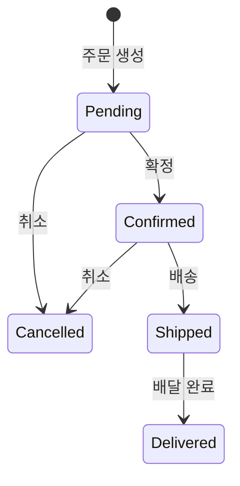
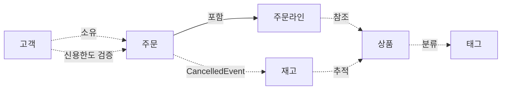
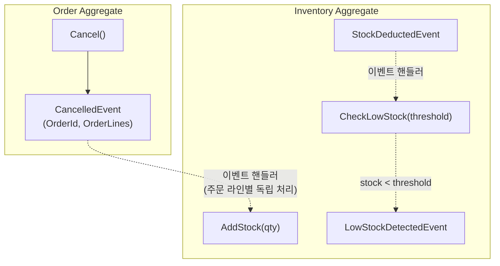

## 배경

B2B 전자상거래 플랫폼을 운영하는 기업이 있습니다. 기업 고객이 상품을 주문하고, 재고가 차감되며, 주문이 배송·완료되는 일련의 흐름을 처리해야 합니다. 현재는 주문 검증과 재고 관리를 수동으로 처리하고 있어, 주문 오류와 재고 불일치가 빈번합니다.

이 시스템은 단일 바운디드 컨텍스트 내에서 E-commerce 주문 처리를 자동화합니다. 고객별 신용한도 관리, 상품 카탈로그 운영, 주문 상태 추적, 재고 수량 관리가 핵심 업무입니다.

## 도메인 용어

이 도메인에서 사용하는 핵심 용어를 정의합니다. 같은 단어라도 일상적 의미와 도메인 내 의미가 다를 수 있으므로, 팀 전체가 이 용어집을 공유 언어(Ubiquitous Language)로 사용합니다.

| 한글 | 영문 | 정의 |
|------|------|------|
| 고객 | Customer | 주문을 생성할 수 있는 사용자 |
| 고객명 | CustomerName | 고객의 이름 (100자 이하) |
| 이메일 | Email | 고객의 이메일 주소 (320자 이하, 소문자 정규화) |
| 신용한도 | CreditLimit | 고객이 주문할 수 있는 최대 금액 |
| 상품 | Product | 판매 가능한 품목 |
| 상품명 | ProductName | 상품의 이름 (100자 이하, 고유) |
| 상품설명 | ProductDescription | 상품에 대한 설명 (1000자 이하) |
| 태그 | Tag | 상품을 분류하는 라벨 |
| 태그명 | TagName | 태그의 이름 (50자 이하) |
| 주문 | Order | 고객이 생성한 구매 요청 |
| 주문라인 | OrderLine | 주문 내 개별 상품 항목 |
| 주문상태 | OrderStatus | 주문의 현재 상태 (Pending, Confirmed, Shipped, Delivered, Cancelled) |
| 배송주소 | ShippingAddress | 주문의 배송 목적지 (500자 이하) |
| 재고 | Inventory | 특정 상품의 재고 수량 |
| 금액 | Money | 양수 금액 |
| 수량 | Quantity | 0 이상 정수 |

## 비즈니스 규칙

### 1. 고객 관리

고객은 주문의 주체이며 신용한도를 가집니다.

- 고객은 고객명, 이메일, 신용한도를 가진다
- 고객명은 100자 이하여야 한다
- 이메일은 표준 이메일 형식이어야 하며 320자 이하여야 한다
- 이메일은 소문자로 정규화하여 저장한다
- 신용한도는 양수 금액이어야 한다
- 고객명, 이메일, 신용한도를 입력하여 고객을 생성할 수 있다
- 고객의 신용한도를 변경할 수 있다
- 고객의 이메일을 변경할 수 있다
- 동일한 이메일을 가진 고객이 두 명 이상 존재할 수 없다

### 2. 상품 관리

상품은 판매 카탈로그의 핵심 단위이며, 가격 변경·태그 분류·논리 삭제/복원의 수명 주기를 가집니다.

- 상품은 상품명, 상품설명, 가격을 가진다
- 상품명은 100자 이하여야 한다
- 상품설명은 1000자 이하여야 한다
- 가격은 양수 금액이어야 한다
- 상품명, 상품설명, 가격을 입력하여 상품을 생성할 수 있다
- 상품명, 상품설명, 가격을 수정할 수 있다
- 동일한 상품명을 가진 상품이 두 개 이상 존재할 수 없다
- 상품명 고유성 검사 시 자기 자신은 제외한다
- 상품을 논리 삭제할 수 있으며, 삭제 시점과 삭제자가 기록된다
- 삭제된 상품을 복원할 수 있다
- 삭제와 복원은 멱등하다 — 이미 삭제된 상품을 다시 삭제해도 부작용이 없다
- 삭제된 상품은 수정할 수 없다
- 물리 삭제는 허용하지 않는다

### 3. 주문 처리

고객이 상품을 주문하면 주문이 생성됩니다.

- 주문은 고객 한 명에게 속한다
- 주문은 최소 1개 이상의 주문 라인을 포함해야 한다
- 주문 라인에는 상품, 수량(1 이상), 단가가 포함된다
- 주문 라인의 소계는 수량 × 단가로 자동 계산된다
- 주문 총액은 모든 주문 라인 소계의 합으로 자동 계산된다
- 배송 주소는 500자 이하여야 한다
- 주문 라인은 생성 후 변경할 수 없다

주문은 다음 상태를 순서대로 거칩니다:

- Pending에서 Confirmed 또는 Cancelled로 전이할 수 있다
- Confirmed에서 Shipped 또는 Cancelled로 전이할 수 있다
- Shipped에서 Delivered로만 전이할 수 있다
- Delivered와 Cancelled는 최종 상태이다 — 더 이상 전이할 수 없다
- 주문을 취소하면 주문에 포함된 주문 라인 정보(상품, 수량, 단가, 소계)가 취소 이벤트에 포함된다

### 4. 재고 관리

재고는 상품별 수량을 추적합니다. 상품 정보 변경과 재고 변경은 독립적으로 발생합니다 — 주문이 몰리는 시간대에 재고 차감이 상품 정보 수정을 차단해서는 안 됩니다.

- 재고는 상품 하나에 대한 수량을 관리한다
- 재고 수량은 0 이상이어야 한다
- 상품과 초기 수량을 입력하여 재고를 생성할 수 있다
- 재고 수량을 차감할 수 있다
- 차감 시 재고 수량을 초과할 수 없다 (초과 인출 금지)
- 재고 수량을 추가할 수 있다
- 여러 주문이 동시에 같은 상품의 재고를 차감할 수 있다 — 동시성 제어가 필요하다
- 재고 수량이 임계값 이하인지 확인할 수 있다 — 저재고 감지 시 이벤트가 발생한다

### 5. 상품 분류 (태그)

태그는 상품을 분류하기 위한 라벨입니다. 여러 상품이 동일한 태그를 공유하며, 태그의 변경이 상품에 직접 영향을 주지 않습니다.

- 태그는 태그명을 가진다
- 태그명은 50자 이하여야 한다
- 태그를 생성, 이름 변경, 삭제할 수 있다
- 상품에 태그를 할당하거나 해제할 수 있다 (멱등)
- 동일 태그를 같은 상품에 중복 할당할 수 없다

### 6. 교차 도메인 규칙

다음 규칙은 단일 업무 영역 내에서 해결할 수 없으며, 여러 영역의 데이터가 함께 필요합니다.

- 주문 총액이 고객의 신용한도 이내여야 한다
- 단일 주문 금액이 신용한도를 초과하면 주문이 거부된다
- 기존 미완료 주문 총액 + 신규 주문 총액이 신용한도를 초과하면 거부된다 (누적 검증)
- 신용한도 초과 시 명확한 오류를 반환한다

## 업무 영역 간 관계

- 고객은 주문을 소유한다
- 주문은 주문라인을 포함하며, 주문라인은 상품을 참조한다
- 상품은 태그로 분류된다
- 재고는 상품별 수량을 추적한다
- 주문 생성 시 고객의 신용한도를 검증한다
- 주문 취소 시 도메인 이벤트를 통해 재고가 복원된다 — Order는 Inventory를 직접 참조하지 않는다

### 도메인 이벤트 기반 Aggregate 간 조율

Order와 Inventory는 별도 Aggregate입니다. 주문 취소 시 재고 복원은 도메인 이벤트를 통해 느슨하게 연결됩니다.

## 시나리오

다음 시나리오는 비즈니스 요구사항이 실제로 동작하는 방식을 구체적으로 기술합니다. 정상 시나리오는 시스템이 허용하는 행위를, 거부 시나리오는 시스템이 차단하는 행위를 정의합니다.

### 정상 시나리오

1. **고객 생성** — 고객명, 이메일, 신용한도를 입력하여 고객을 생성한다. 이메일은 소문자로 정규화되어 저장된다.
2. **상품 생성** — 상품명, 상품설명, 가격을 입력하여 상품을 생성한다.
3. **주문 생성** — 고객, 주문라인 목록, 배송주소를 입력하여 주문을 생성한다. 총액은 자동 계산되고, 상태는 Pending으로 시작한다.
4. **주문 상태 전이** — Pending → Confirmed → Shipped → Delivered 순서로 상태를 전이한다.
5. **상품 논리 삭제와 복원** — 상품을 논리 삭제하면 삭제 시점과 삭제자가 기록된다. 이후 복원하면 삭제 정보가 초기화된다.
6. **재고 차감과 추가** — 재고를 생성하고, 주문에 따라 수량을 차감한다. 이후 입고 시 수량을 추가한다.
6-1. **주문 취소** — Pending 또는 Confirmed 상태의 주문을 취소한다. 취소 이벤트에는 주문 라인 정보가 포함된다.
6-2. **저재고 감지** — 재고 차감 후 남은 수량이 임계값 이하이면 저재고 감지 이벤트가 발생한다.
7. **태그 생성과 이름 변경** — 태그를 생성하고, 태그명을 변경한다.
8. **신용한도 검증 통과** — 주문 총액이 고객의 신용한도 이내이면 주문이 정상 생성된다.

### 거부 시나리오

9. **주문라인 없는 주문** — 주문라인 없이 주문을 생성하면 거부된다.
10. **유효하지 않은 상태 전이** — Pending에서 Shipped로 직접 전이를 시도하면 거부된다.
10-1. **배송 후 취소 거부** — Shipped 또는 Delivered 상태의 주문을 취소하면 거부된다.
11. **삭제된 상품 수정** — 논리 삭제된 상품의 이름이나 가격을 수정하면 거부된다.
12. **재고 초과 차감** — 재고 수량보다 많은 양을 차감하면 거부된다.
13. **신용한도 초과** — 주문 총액이 고객의 신용한도를 초과하면 거부된다.
14. **중복 상품명** — 이미 존재하는 상품명으로 새 상품을 생성하면 거부된다.
15. **중복 고객 이메일** — 이미 존재하는 이메일로 새 고객을 생성하면 거부된다.

## 존재해서는 안 되는 상태

다음은 시스템에서 절대 발생해서는 안 되는 상태입니다. 이 상태가 존재한다면 규칙이 깨진 것이며, 타입 시스템과 도메인 로직으로 이를 원천 차단합니다.

- 주문라인이 없는 주문
- 총액과 주문라인 소계 합이 불일치하는 주문
- Pending에서 Shipped로 바로 전이된 주문
- 삭제된 상품에서 수정이 일어난 상태
- 재고 수량이 음수인 상태
- 신용한도를 초과한 주문이 존재하는 상태
- 동일 이메일을 가진 고객이 두 명 이상 존재하는 상태
- 동일 이름을 가진 상품이 두 개 이상 존재하는 상태

다음 단계에서는 이 비즈니스 규칙을 DDD 관점에서 분석하여, 독립적인 일관성 경계(Aggregate)를 식별하고 [불변식을 분류](../01-type-design-decisions/)합니다.
