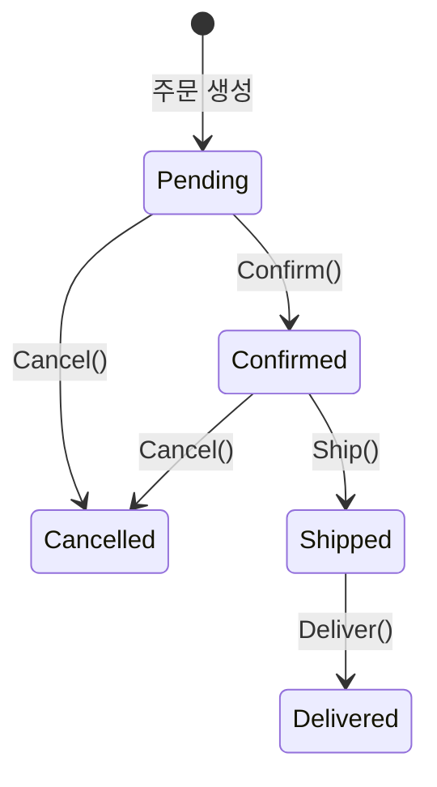
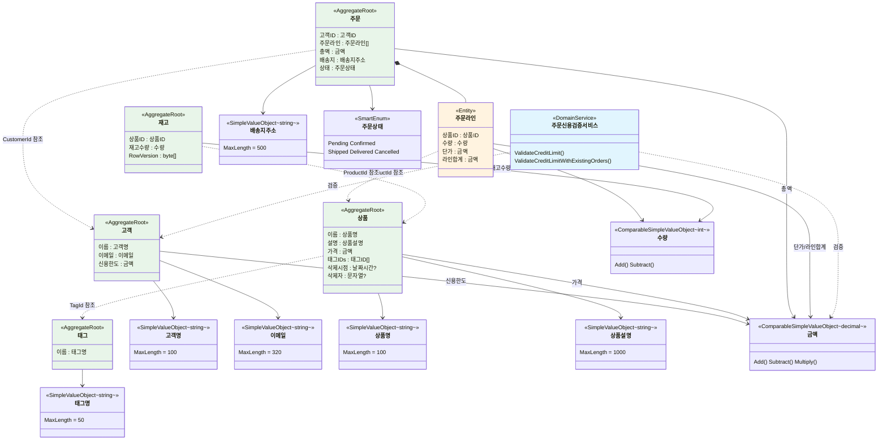

## 개요

[비즈니스 요구사항](../00-business-requirements/)에서 정의한 자연어 요구사항을 DDD 관점에서 분석합니다. 첫 번째 단계는 업무 영역에서 독립적인 일관성 경계(Aggregate)를 식별하고, 두 번째 단계는 각 경계 내의 규칙을 불변식으로 분류하는 것입니다. 목표는 '잘못된 상태를 표현할 수 없는 타입'을 설계하여, 런타임 검증 대신 컴파일 타임 보장을 얻는 것입니다.

## 업무 영역에서 Aggregate 식별

비즈니스 규칙을 타입으로 인코딩하기 전에, 먼저 업무 영역에서 독립적인 일관성 경계를 식별해야 합니다. [비즈니스 요구사항](../00-business-requirements/)에서 정의한 6개 업무 주제에서 5개 Aggregate가 도출됩니다.

### 업무 주제 → Aggregate 매핑

| 업무 주제 | Aggregate | 도출 근거 |
|----------|-----------|----------|
| 고객 관리 | Customer | 고객 고유의 생명주기, 신용한도 독립 관리 |
| 상품 관리 | Product | 상품 정보의 독립적 변경, 논리 삭제/복원 |
| 주문 처리 | Order | 주문라인 소유, 상태 전이 규칙의 일관성 경계 |
| 재고 관리 | Inventory | 상품과 분리된 변경 빈도, 동시성 제어 필요 |
| 상품 분류 | Tag | 독립적 수명, 여러 상품에서 공유 |
| 교차 도메인 규칙 | — | Aggregate 간 검증 → Domain Service |

### 왜 재고를 상품에서 분리하는가?

상품 정보(이름, 설명, 가격) 변경과 재고 수량 변경은 빈도와 동시성 요구가 크게 다릅니다. 상품 정보는 관리자가 가끔 수정하지만, 재고는 주문마다 차감됩니다. 하나의 경계로 묶으면 재고 차감 시 상품 정보까지 잠기고, 상품 수정 시 재고까지 잠깁니다. 분리하면 각각 독립적으로 변경·잠금·동시성 제어할 수 있습니다.

### 왜 태그가 독립 Aggregate인가?

태그는 여러 상품이 공유하는 분류 라벨입니다. 태그명 변경이 상품에 영향을 주지 않아야 하고, 태그의 생성·삭제가 상품의 트랜잭션과 독립적이어야 합니다. 상품은 태그의 ID만 참조하여, 태그 경계와 상품 경계가 서로 간섭하지 않습니다.

### Aggregate 분리 이유 종합

| Aggregate | 분리 이유 | 핵심 불변식 |
|-----------|----------|------------|
| **Customer** | 고객 고유 생명주기, 신용 한도 독립 관리 | 이메일 고유성, 신용 한도 |
| **Product** | 상품 정보 저빈도 변경, 논리 삭제/복원 필요 | 삭제 가드, 상품명 고유성 |
| **Tag** | 독립적 생명주기, 여러 Product에서 ID로 참조 | 태그명 유효성 |
| **Order** | 주문 라인을 소유, 상태 전이 규칙 보장 | 상태 전이, TotalAmount 일관성, 최소 1개 라인 |
| **Inventory** | Product와 변경 빈도 차이, 낙관적 동시성 제어 필요 | 재고 부족 검증, 동시성 |

## 도메인 용어 매핑

비즈니스 용어를 DDD 전술적 패턴으로 매핑합니다.

| 한글 | 영문 | DDD 패턴 | 역할 |
|------|------|---------|------|
| 고객 | Customer | Aggregate Root | 주문의 주체, 신용한도 소유 |
| 상품 | Product | Aggregate Root | 판매 카탈로그 단위, 논리 삭제 지원 |
| 태그 | Tag | Aggregate Root | 상품 분류 라벨, 독립 수명 |
| 주문 | Order | Aggregate Root | 구매 트랜잭션 단위, 상태 전이 관리 |
| 주문라인 | OrderLine | Entity (자식) | 주문 내 개별 상품 항목, Order에 종속 |
| 재고 | Inventory | Aggregate Root | 상품별 수량 추적, 동시성 제어 |
| 고객명 | CustomerName | Value Object | 100자 이하 문자열 |
| 이메일 | Email | Value Object | 320자 이하, 소문자 정규화, 정규식 검증 |
| 상품명 | ProductName | Value Object | 100자 이하 문자열, 고유 |
| 상품설명 | ProductDescription | Value Object | 1000자 이하 문자열 |
| 태그명 | TagName | Value Object | 50자 이하 문자열 |
| 배송주소 | ShippingAddress | Value Object | 500자 이하 문자열 |
| 금액 | Money | Value Object | 양수 decimal, 산술 연산 지원 |
| 수량 | Quantity | Value Object | 0 이상 정수, 산술 연산 지원 |
| 주문상태 | OrderStatus | Value Object (Smart Enum) | 5개 상태, 전이 규칙 내장 |
| 주문신용검증 | OrderCreditCheckService | Domain Service | 교차 Aggregate 신용한도 검증 |

## 불변식 분류 체계

비즈니스 규칙을 소프트웨어로 보장하려면, 규칙을 **불변식(invariant)으로** 분류하고 각 유형에 맞는 타입 전략을 선택해야 합니다. 불변식은 "시스템이 어떤 시점에서든 반드시 참이어야 하는 조건"이며, 이를 타입으로 인코딩하면 컴파일러가 규칙 위반을 방지합니다.

이 도메인에서는 7가지 불변식 유형을 식별했습니다.

| 유형 | 범위 | 핵심 질문 |
|------|------|----------|
| 단일 값 | 개별 필드 | 이 값이 항상 유효한가? |
| 구조 | 필드 조합 | 부모-자식 관계에서 파생 값이 일관적인가? |
| 상태 전이 | 시간에 따른 변화 | 허용된 상태 변화만 일어나는가? |
| 수명 | Aggregate 생명주기 | 삭제된 객체에 행위가 차단되는가? |
| 소유 | 자식 엔티티 경계 | 자식이 부모 경계를 벗어나지 않는가? |
| 교차 Aggregate | 여러 Aggregate 간 | 단일 Aggregate로 검증할 수 없는 규칙은 어디서 보장하는가? |
| 동시성 | 동시 접근 | 고빈도 변경 시 데이터 무결성이 보장되는가? |

## 불변식별 설계 의사결정

### 1. 단일 값 불변식

개별 필드가 항상 유효한 값만 가져야 하는 제약입니다.

**비즈니스 규칙:**
- "고객명은 100자 이하, 비어있으면 안 된다"
- "이메일은 유효한 형식이며 320자 이하"
- "상품명은 100자 이하, 비어있으면 안 된다"
- "상품 설명은 1000자 이하"
- "태그명은 50자 이하, 비어있으면 안 된다"
- "배송지 주소는 500자 이하, 비어있으면 안 된다"
- "금액은 양수여야 한다"
- "수량은 0 이상이어야 한다"

**Naive 구현의 문제:** 모든 필드가 `string`, `decimal`, `int`이므로 음수 금액, 빈 이름, 3000자 설명이 들어갑니다. 더 심각한 문제로, `CustomerName`과 `ProductName`이 같은 `string`이라 실수로 바꿔 넣어도 컴파일러가 침묵합니다.

**설계 의사결정: 생성 시 검증하고 이후 불변으로 보장합니다.** 제약된 타입(constrained type)을 도입하여 유효하지 않은 값은 생성 자체가 불가능하게 만듭니다. 한번 생성된 값은 변경할 수 없으므로, 이후 코드에서 유효성을 다시 확인할 필요가 없습니다. 산술 연산이 필요한 타입은 `ComparableSimpleValueObject<T>`를, 단순 래핑만 필요한 타입은 `SimpleValueObject<T>`를 선택합니다.

**Simple vs Comparable 의사결정 기준:**
- **`SimpleValueObject<T>`:** 문자열 래핑 타입. 값의 대소 비교가 무의미하고, 동등성만 필요합니다. 예: 이름 간에 "어떤 이름이 더 크다"는 비즈니스 의미가 없습니다.
- **`ComparableSimpleValueObject<T>`:** 산술 연산이나 대소 비교가 비즈니스 의미를 가집니다. Money는 `Add`, `Subtract`, `Multiply`와 `>`, `<` 비교가 필요합니다(신용 한도 검증: `orderAmount > customer.CreditLimit`). Quantity는 `Add`, `Subtract`와 재고 부족 비교(`quantity > StockQuantity`)가 필요합니다.

**결과:**

| 비즈니스 규칙 | 결과 타입 | 기반 타입 | 검증 규칙 | 정규화 |
|-------------|----------|----------|----------|--------|
| 고객명 100자 제한 | CustomerName | `SimpleValueObject<string>` | NotNull → NotEmpty → MaxLength(100) | Trim |
| 이메일 형식 | Email | `SimpleValueObject<string>` | NotNull → NotEmpty → MaxLength(320) → Matches(Regex) | Trim + 소문자 |
| 상품명 100자 제한 | ProductName | `SimpleValueObject<string>` | NotNull → NotEmpty → MaxLength(100) | Trim |
| 상품 설명 1000자 제한 | ProductDescription | `SimpleValueObject<string>` | NotNull → MaxLength(1000) | Trim |
| 태그명 50자 제한 | TagName | `SimpleValueObject<string>` | NotNull → NotEmpty → MaxLength(50) | Trim |
| 배송지 주소 500자 제한 | ShippingAddress | `SimpleValueObject<string>` | NotNull → NotEmpty → MaxLength(500) | Trim |
| 금액은 양수 | Money | `ComparableSimpleValueObject<decimal>` | Positive | — |
| 수량은 0 이상 | Quantity | `ComparableSimpleValueObject<int>` | NonNegative | — |

개별 필드의 유효성을 보장했다면, 다음으로 필드 간의 관계가 일관적인지 확인해야 합니다.

### 2. 구조 불변식

필드 조합이 항상 유효한 상태만 나타내야 하는 제약입니다.

**비즈니스 규칙:**
- "주문은 최소 1개 이상의 주문 라인을 포함해야 한다"
- "주문 라인의 LineTotal = UnitPrice * Quantity로 자동 계산된다"
- "주문의 TotalAmount = 모든 OrderLine의 LineTotal 합계로 자동 계산된다"
- "주문 라인의 수량은 반드시 1 이상이어야 한다 (Quantity VO는 0 이상을 허용하지만, 주문 라인 컨텍스트에서는 0이 무의미)"

**Naive 구현의 문제:** `TotalAmount`를 외부에서 직접 설정하면 실제 `OrderLine` 합계와 불일치할 수 있습니다. `LineTotal`을 별도로 관리하면 `UnitPrice * Quantity`와 어긋나는 상태가 가능합니다. 빈 주문 라인 목록으로 주문이 생성될 수 있습니다.

**설계 의사결정: 파생 값을 Aggregate 내부에서 자동 계산하고, 외부 설정을 차단합니다.**
- `OrderLine.Create()`에서 `LineTotal = UnitPrice.Multiply(Quantity)`를 자동 계산합니다. 외부에서 `LineTotal`을 직접 지정할 경로가 없습니다.
- `Order.Create()`에서 `TotalAmount = Sum(lines.LineTotal)`을 자동 계산합니다. 주문 라인이 비어있으면 `EmptyOrderLines` 오류를 반환합니다.
- `OrderLine`에서 `Quantity`에 대한 컨텍스트별 추가 검증(`> 0`)을 수행합니다. VO 수준 검증(0 이상)과 엔티티 수준 검증(1 이상)을 분리하여, 같은 `Quantity` VO가 재고(`0` 허용)와 주문 라인(`1` 이상) 컨텍스트에서 모두 사용 가능합니다.

**결과:**

| 구조 규칙 | 계산 위치 | 보장 메커니즘 |
|----------|----------|-------------|
| LineTotal = UnitPrice * Quantity | `OrderLine.Create()` | 팩토리 메서드에서 자동 계산, private 생성자 |
| TotalAmount = Sum(LineTotals) | `Order.Create()` | 팩토리 메서드에서 자동 계산, private 생성자 |
| OrderLines >= 1 | `Order.Create()` | 빈 목록 시 `Fin<Order>` 실패 반환 |
| OrderLine Quantity >= 1 | `OrderLine.Create()` | 0 이하 시 `Fin<OrderLine>` 실패 반환 |

구조적 일관성을 확보한 뒤에는, 시간에 따른 상태 변화가 규칙을 따르는지 제어해야 합니다.

### 3. 상태 전이 불변식

시간에 따른 변화가 정해진 규칙만 따라야 하는 제약입니다.

**비즈니스 규칙:**
- "주문 상태는 Pending → Confirmed → Shipped → Delivered 순서로만 전이된다"
- "Pending 또는 Confirmed 상태에서만 Cancelled로 전이할 수 있다"
- "Shipped나 Delivered 상태에서는 취소할 수 없다"
- "Delivered나 Cancelled는 최종 상태이다"

**Naive 구현의 문제:** `string Status`나 `enum OrderStatus`를 사용하면 아무 값이나 설정 가능합니다. `bool IsConfirmed`, `bool IsShipped` 같은 플래그를 사용하면 `IsConfirmed = false, IsShipped = true`처럼 모순 상태가 가능하고, 새 상태 추가 시 플래그 조합의 복잡도가 기하급수적으로 증가합니다.

**설계 의사결정: Smart Enum 패턴으로 허용된 전이를 선언적으로 정의합니다.** `OrderStatus`를 `SimpleValueObject<string>`으로 구현하되, `static readonly` 인스턴스만 노출하고 생성자를 `private`으로 제한합니다. 허용 전이 규칙을 `HashMap<string, Seq<string>>`으로 선언하고, `CanTransitionTo()` 메서드로 검증합니다. `Order`의 상태 전이 메서드(`Confirm`, `Ship`, `Deliver`, `Cancel`)는 내부적으로 `TransitionTo()`를 호출하여 불법 전이 시 `Fin<Unit>` 실패를 반환합니다.

**Smart Enum이 bool 플래그보다 나은 이유:**
- 허용 전이가 데이터(`AllowedTransitions`)로 선언되어 한눈에 파악 가능합니다.
- 새 상태 추가 시 `HashMap`에 한 줄만 추가하면 됩니다.
- 모순 상태가 구조적으로 불가능합니다 — 상태는 항상 정확히 하나입니다.

**상태 전이 다이어그램:**

**결과:**
- `OrderStatus`: `SimpleValueObject<string>` + Smart Enum 패턴
- 5개 상태: Pending, Confirmed, Shipped, Delivered, Cancelled
- `CanTransitionTo()`: 허용 전이 검증
- `Order.TransitionTo()`: 전이 실행 + 도메인 이벤트 발행

상태 전이를 제어했다면, 애그리거트의 생명주기 전체에서 행위가 올바른지 확인합니다.

### 4. 수명 불변식

Aggregate의 생성, 수정, 삭제 생명주기가 규칙을 따라야 하는 제약입니다.

**비즈니스 규칙:**
- "상품은 논리 삭제/복원이 가능하며, 삭제자와 시점이 기록된다"
- "삭제된 상품은 업데이트할 수 없다"
- "삭제/복원은 멱등하다 — 이미 삭제된 상품을 다시 삭제해도 오류 없음"

**Naive 구현의 문제:** `bool IsDeleted`로 관리하면 삭제된 상품에 `Update()`를 호출해도 막을 방법이 없습니다. 삭제자/시점 정보를 별도 필드로 관리해야 하는데, `IsDeleted = false`인데 삭제 시점이 존재하는 모순 상태가 가능합니다.

**설계 의사결정: `ISoftDeletableWithUser` 인터페이스와 삭제 가드를 결합합니다.** `Product`가 `ISoftDeletableWithUser`를 구현하여 `DeletedAt`과 `DeletedBy`를 `Option<T>`으로 관리합니다. `Update()` 메서드에서 `DeletedAt.IsSome`이면 `AlreadyDeleted` 오류를 반환합니다. `Delete()`와 `Restore()`는 멱등으로 설계하여 이미 삭제/복원된 상태면 아무 동작 없이 `this`를 반환합니다.

**결과:**
- `Product`: `AggregateRoot<ProductId>` + `IAuditable` + `ISoftDeletableWithUser`
- `DeletedAt`, `DeletedBy`: `Option<T>`로 null 안전 관리
- `Update()`: 삭제 가드 → `Fin<Product>` (실패 가능)
- `Delete()`, `Restore()`: 멱등 → `Product` (항상 성공)
- 이중 팩토리: `Create`(도메인 생성, 이벤트 발행) + `CreateFromValidated`(ORM 복원, 이벤트 없음)

생명주기를 관리한 뒤에는, 애그리거트 내부의 소유 관계가 경계를 넘지 않는지 확인합니다.

### 5. 소유 불변식

Aggregate 내부의 자식 엔티티가 경계를 벗어나지 않아야 하는 제약입니다.

**비즈니스 규칙:**
- "주문 라인은 주문에 종속된다 — 독립적으로 존재할 수 없다"
- "태그는 독립 Aggregate이며, 상품은 태그의 ID만 참조한다"
- "주문은 고객의 ID만 참조한다 — 고객 전체를 포함하지 않는다"

**Naive 구현의 문제:** `OrderLine`을 독립 엔티티로 관리하면 Aggregate 경계 밖에서 직접 생성하거나 삭제할 수 있습니다. `Product`가 `Tag` 전체를 참조하면 Tag 변경 시 Product도 로딩해야 하는 불필요한 결합이 생깁니다.

**설계 의사결정: 자식 엔티티와 교차 참조를 구분합니다.**
- **소유 관계 (OrderLine → Order):** `OrderLine`은 `Entity<OrderLineId>`로 모델링하되, `Order` 내부의 `private List<OrderLine>`에만 존재합니다. 외부에는 `IReadOnlyList<OrderLine>`만 노출합니다. `OrderLine` 생성은 `Order.Create()` 시에만 가능합니다.
- **ID 참조 관계 (TagId → Product):** `Product`가 `List<TagId>`를 관리합니다. `Tag` 엔티티 전체를 참조하지 않으므로 Tag Aggregate의 변경이 Product에 영향을 주지 않습니다. `AssignTag()`/`UnassignTag()`로 관리하며 멱등성을 보장합니다.
- **교차 Aggregate 참조 (CustomerId → Order):** `Order`가 `CustomerId`를 값으로 보관합니다. Customer Aggregate를 직접 참조하지 않으므로 트랜잭션 경계가 분리됩니다.

**결과:**

| 관계 유형 | 구현 | 접근 방식 |
|----------|------|----------|
| OrderLine → Order | `Entity<OrderLineId>`, private 컬렉션 | `IReadOnlyList` 노출 |
| TagId → Product | `List<TagId>`, ID만 참조 | `AssignTag()`/`UnassignTag()` 멱등 |
| CustomerId → Order | 값으로 보관 | 교차 Aggregate ID 참조 |
| ProductId → OrderLine | 값으로 보관 | 교차 Aggregate ID 참조 |
| ProductId → Inventory | 값으로 보관 | 교차 Aggregate ID 참조 |

단일 애그리거트 내부의 불변식을 모두 정의했다면, 이제 여러 애그리거트에 걸친 규칙을 어떻게 보장할지 설계합니다.

### 6. 교차 Aggregate 불변식

여러 Aggregate에 걸친 규칙을 검증해야 하는 제약입니다.

**비즈니스 규칙:**
- "주문 금액이 고객의 신용 한도를 초과하면 안 된다"
- "기존 주문들과 신규 주문을 합산하여 신용 한도 내에 있어야 한다"
- "동일 이메일의 고객을 중복 등록할 수 없다"
- "동일 이름의 상품을 중복 등록할 수 없다 (업데이트 시 자기 자신 제외)"

**Naive 구현의 문제:** 단일 Aggregate 내부에서 다른 Aggregate의 상태를 직접 조회하면 Aggregate 경계가 무너집니다. Repository를 도메인 모델에서 직접 호출하면 인프라 의존성이 침투합니다.

**설계 의사결정: Domain Service와 Specification을 역할에 따라 분리합니다.**

- **Domain Service (`IDomainService`):** 여러 Aggregate의 데이터를 받아 비즈니스 로직을 수행합니다. Application Layer가 필요한 Aggregate를 조회하여 전달하면, Domain Service가 순수한 도메인 로직만 실행합니다. `OrderCreditCheckService`가 `Customer`와 `Order`(또는 `Money`)를 받아 신용 한도를 검증합니다.
- **Specification (`ExpressionSpecification<T>`):** 단일 Aggregate에 대한 쿼리 조건을 `Expression<Func<T, bool>>`으로 캡슐화합니다. EF Core가 SQL로 자동 변환하므로 도메인 규칙이 데이터베이스 레벨까지 일관되게 적용됩니다. `CustomerEmailSpec`, `ProductNameUniqueSpec`, `ProductNameSpec`, `ProductPriceRangeSpec`, `InventoryLowStockSpec`이 해당합니다.

**Domain Service vs Specification 의사결정 기준:**

| 기준 | Domain Service | Specification |
|------|---------------|---------------|
| 관여 Aggregate 수 | 2개 이상 | 1개 |
| 데이터 접근 패턴 | Application Layer가 조회 후 전달 | Repository가 Expression으로 쿼리 |
| 반환 타입 | `Fin<Unit>` (통과/실패) | `Expression<Func<T, bool>>` |
| 대표 사례 | 신용 한도 검증 | 이메일 중복, 상품명 중복 |

**결과:**

| 규칙 | 구현 | 유형 |
|------|------|------|
| 신용 한도 검증 | `OrderCreditCheckService : IDomainService` | Domain Service |
| 고객 이메일 중복 | `CustomerEmailSpec : ExpressionSpecification<Customer>` | Specification |
| 상품명 중복 (자기 제외) | `ProductNameUniqueSpec : ExpressionSpecification<Product>` | Specification |
| 상품명 검색 | `ProductNameSpec : ExpressionSpecification<Product>` | Specification |
| 가격 범위 필터 | `ProductPriceRangeSpec : ExpressionSpecification<Product>` | Specification |
| 재고 부족 필터 | `InventoryLowStockSpec : ExpressionSpecification<Inventory>` | Specification |

교차 애그리거트 규칙을 해결한 뒤에는, 동시 접근 환경에서의 데이터 무결성을 보장해야 합니다.

### 7. 동시성 불변식

동시 접근 시 데이터 무결성이 보장되어야 하는 제약입니다.

**비즈니스 규칙:**
- "재고 차감은 주문마다 발생하며, 동시에 여러 주문이 같은 상품의 재고를 차감할 수 있다"
- "재고가 부족하면 차감이 실패해야 한다"

**Naive 구현의 문제:** 동시성 제어 없이 재고를 차감하면, 두 주문이 동시에 같은 재고를 읽고 각각 차감한 뒤 저장하면 하나의 차감이 유실됩니다(lost update). 비관적 잠금은 성능 병목이 됩니다.

**설계 의사결정: 낙관적 동시성 제어(`IConcurrencyAware`)를 적용합니다.** `Inventory`가 `byte[] RowVersion`을 관리하고, 저장 시 RowVersion이 일치하지 않으면 EF Core가 `DbUpdateConcurrencyException`을 발생시킵니다. 이는 고빈도 업데이트에서 비관적 잠금보다 효율적이며, 충돌 시 Application Layer에서 재시도 전략을 적용할 수 있습니다.

**Inventory를 Product에서 분리한 이유:** 상품 정보(이름, 설명, 가격) 변경 빈도와 재고 변경 빈도가 크게 다릅니다. 하나의 Aggregate로 묶으면 재고 차감 시마다 상품 정보까지 잠기고, 상품 정보 변경 시마다 재고까지 잠깁니다. 분리하면 각각 독립적으로 변경/잠금/동시성 제어할 수 있습니다.

**결과:**
- `Inventory`: `AggregateRoot<InventoryId>` + `IAuditable` + `IConcurrencyAware`
- `byte[] RowVersion`: 낙관적 동시성 토큰
- `DeductStock()`: 재고 부족 시 `Fin<Unit>` 실패 반환
- `AddStock()`: 항상 성공 → `Inventory` 반환

## 도메인 모델 구조

5개 Aggregate와 그 Value Object, 관계를 종합한 구조입니다.

다음 다이어그램은 5개 애그리거트와 그 값 객체, 관계를 종합한 도메인 모델 구조입니다. 실선 화살표는 소유 관계를, 점선 화살표는 ID 참조를 나타냅니다.

## 불변식 종합표

| 불변식 | 유형 | 보장 메커니즘 | 관련 Aggregate |
|--------|------|-------------|---------------|
| 고객명 100자 이하 | 단일 값 | `CustomerName`: NotNull → NotEmpty → MaxLength(100) → Trim | Customer |
| 이메일 형식/320자 | 단일 값 | `Email`: NotNull → NotEmpty → MaxLength(320) → Regex → Trim + 소문자 | Customer |
| 상품명 100자 이하 | 단일 값 | `ProductName`: NotNull → NotEmpty → MaxLength(100) → Trim | Product |
| 상품 설명 1000자 이하 | 단일 값 | `ProductDescription`: NotNull → MaxLength(1000) → Trim | Product |
| 태그명 50자 이하 | 단일 값 | `TagName`: NotNull → NotEmpty → MaxLength(50) → Trim | Tag |
| 배송지 주소 500자 이하 | 단일 값 | `ShippingAddress`: NotNull → NotEmpty → MaxLength(500) → Trim | Order |
| 금액은 양수 | 단일 값 | `Money`: Positive 검증 | 공유 (Customer, Product, Order) |
| 수량은 0 이상 | 단일 값 | `Quantity`: NonNegative 검증 | 공유 (OrderLine, Inventory) |
| LineTotal = UnitPrice * Quantity | 구조 | `OrderLine.Create()`에서 자동 계산 | Order |
| TotalAmount = Sum(LineTotals) | 구조 | `Order.Create()`에서 자동 계산 | Order |
| 주문 라인 >= 1 | 구조 | `Order.Create()`에서 빈 목록 거부 | Order |
| 주문 라인 수량 >= 1 | 구조 | `OrderLine.Create()`에서 0 이하 거부 | Order |
| 주문 상태 전이 규칙 | 상태 전이 | `OrderStatus` Smart Enum + `CanTransitionTo()` | Order |
| 삭제된 상품 업데이트 차단 | 수명 | `Product.Update()`에서 삭제 가드 | Product |
| 삭제/복원 멱등성 | 수명 | `Delete()`/`Restore()` 상태 확인 후 조건부 실행 | Product |
| 주문 라인은 주문에 종속 | 소유 | private `List<OrderLine>` + `IReadOnlyList` 노출 | Order |
| 태그 ID 참조만 보관 | 소유 | `List<TagId>` (엔티티 비참조) | Product |
| 교차 Aggregate ID 참조 | 소유 | `CustomerId`, `ProductId` 값 보관 | Order, OrderLine, Inventory |
| 신용 한도 검증 | 교차 Aggregate | `OrderCreditCheckService : IDomainService` | Customer + Order |
| 이메일 고유성 | 교차 Aggregate | `CustomerEmailSpec : ExpressionSpecification` | Customer |
| 상품명 고유성 | 교차 Aggregate | `ProductNameUniqueSpec : ExpressionSpecification` | Product |
| 재고 동시성 보장 | 동시성 | `IConcurrencyAware` + `byte[] RowVersion` | Inventory |
| 재고 부족 검증 | 동시성 | `DeductStock()`에서 수량 비교 → `Fin<Unit>` | Inventory |

7가지 불변식 유형은 서로 다른 수준에서 도메인 규칙을 보장합니다. 단일 값 불변식이 개별 필드의 유효성을 보장하면, 구조 불변식이 필드 간 일관성을 보장하고, 상태 전이 불변식이 시간에 따른 변화를 제어합니다. 수명과 소유 불변식은 애그리거트의 경계를 보호하며, 교차 애그리거트 불변식과 동시성 불변식은 시스템 전체의 무결성을 보장합니다. 이 계층적 보호 구조 덕분에 어떤 코드 경로를 거치더라도 잘못된 상태에 도달할 수 없습니다.

이 전략들을 C#과 Functorium DDD 빌딩 블록으로 어떻게 구현하는지 코드 설계에서 다룹니다.
