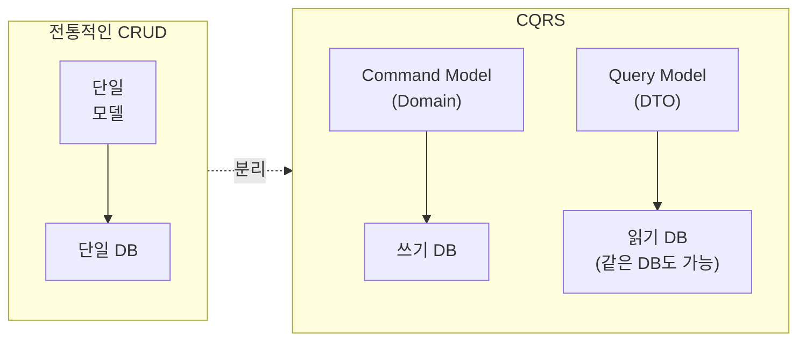
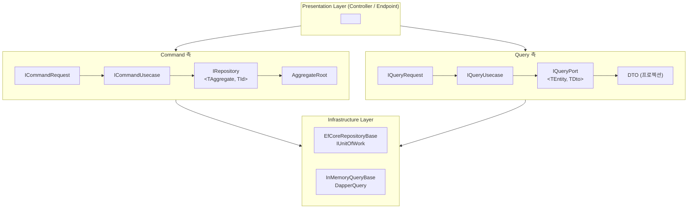
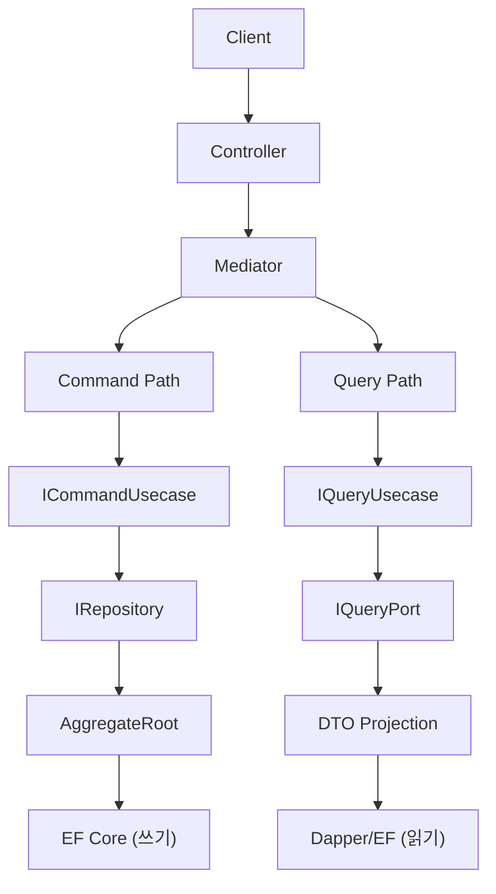

## 개요

하나의 `Order` 클래스에 읽기용 프로퍼티와 쓰기용 로직이 뒤섞이면 어떻게 될까요? 조회 성능을 높이려고 프로퍼티를 추가하면 도메인 불변식이 흔들리고, 도메인 로직을 강화하면 조회 응답이 느려집니다. 읽기와 쓰기는 근본적으로 다른 요구사항을 가지고 있고, 하나의 모델로 둘 다 만족시키려는 시도가 문제의 시작입니다.

CQRS(Command Query Responsibility Segregation)는 이 충돌을 **모델 수준에서 분리**하여 해결합니다. 이 장에서는 CQS 원칙에서 CQRS 아키텍처로 확장되는 과정과, Functorium이 이를 어떤 타입 계층으로 구현하는지 살펴봅니다.

---

## CQS에서 CQRS로

### CQS (Command Query Separation)

Bertrand Meyer가 정의한 원칙으로, **메서드 수준**에서 Command와 Query를 분리합니다:

- **Command는** 상태를 변경하고, 값을 반환하지 않습니다 (void)
- **Query는** 상태를 변경하지 않고, 값을 반환합니다

```csharp
// CQS 원칙을 따르는 메서드 설계
public class ShoppingCart
{
    // Command: 상태 변경, 반환 없음
    public void AddItem(Product product, int quantity) { ... }

    // Query: 상태 변경 없음, 값 반환
    public decimal GetTotalPrice() { ... }
}
```

CQS는 메서드 하나하나가 "변경인지 조회인지" 명확하게 구분되므로 코드를 읽기 쉽게 만듭니다. 그러나 메서드 수준의 분리만으로는 모델 비대화와 성능 충돌 문제를 해결할 수 없습니다.

### CQRS (Command Query Responsibility Segregation)

Greg Young이 CQS를 **아키텍처 수준**으로 확장한 패턴입니다. 메서드가 아닌 **모델 자체를 분리**하면, 쓰기에는 도메인 모델을, 읽기에는 DTO를 각각 사용할 수 있습니다.



---

## 왜 읽기와 쓰기를 분리하는가

### 읽기와 쓰기의 근본적 차이

읽기와 쓰기는 모델, 검증, 트랜잭션, 성능, 확장 전략이 모두 다릅니다. 다음 표는 이 근본적 차이를 항목별로 비교합니다.

| 특성 | Command (쓰기) | Query (읽기) |
|------|---------------|-------------|
| **모델** | 도메인 모델 (Aggregate Root) | DTO (프로젝션) |
| **검증** | 도메인 불변식 검증 필수 | 불필요 |
| **트랜잭션** | 필수 (일관성 보장) | 불필요 (읽기 전용) |
| **성능 특성** | 정합성 우선 | 속도 우선 |
| **확장** | 수직 확장 (Scale Up) | 수평 확장 (Scale Out) |
| **빈도** | 상대적으로 적음 | 상대적으로 많음 |

### 단일 모델의 문제

이 차이를 무시하고 하나의 클래스에 모든 책임을 담으면 어떤 일이 벌어지는지 보세요.

```csharp
// 하나의 Order 클래스가 모든 책임을 짊어짐
public class Order
{
    // 쓰기에 필요한 도메인 로직
    public void AddItem(Product product, int qty) { ... }
    public void Cancel() { ... }
    private void ValidateBusinessRules() { ... }

    // 읽기에 필요한 프로퍼티
    public string CustomerName { get; set; }      // 조인 결과
    public decimal TotalAmount { get; set; }       // 계산 결과
    public int ItemCount { get; set; }             // 집계 결과
    public string StatusDescription { get; set; }  // 표시용 문자열
}
```

쓰기에 불필요한 읽기 전용 필드가 도메인 모델을 오염시키고, 읽기 최적화(조인, 집계)가 도메인 로직에 영향을 줍니다. 한쪽을 변경하면 다른 쪽에 불필요한 영향이 전파되므로, 변경할 때마다 양쪽 모두 테스트해야 합니다.

---

## Functorium의 CQRS 아키텍처

Functorium은 CQRS 패턴을 다음과 같은 타입 계층으로 구현합니다. Command 측은 IRepository를 통해 Aggregate Root를 영속화하고, Query 측은 IQueryPort를 통해 DTO 프로젝션을 반환합니다.



### Command 측: IRepository

왜 쓰기 전용 인터페이스가 필요할까요? 도메인 불변식을 검증하고 Aggregate Root 단위로 영속화하려면, 읽기 관심사(DTO 프로젝션, 페이지네이션)가 섞이지 않은 깔끔한 CRUD 인터페이스가 필요합니다.

```csharp
public interface IRepository<TAggregate, TId>
    where TAggregate : AggregateRoot<TId>
    where TId : struct, IEntityId<TId>
{
    FinT<IO, TAggregate> Create(TAggregate aggregate);
    FinT<IO, TAggregate> GetById(TId id);
    FinT<IO, TAggregate> Update(TAggregate aggregate);
    FinT<IO, int> Delete(TId id);
    // + CreateRange, GetByIds, UpdateRange, DeleteRange
}
```

Aggregate Root 단위로 영속화하므로 DDD 원칙을 지키고, `FinT<IO, T>` 반환으로 예외 대신 함수형 에러 처리를 사용하며, 제네릭 제약으로 컴파일 타임 타입 안전성을 확보합니다.

### Query 측: IQueryPort

읽기 전용 인터페이스를 별도로 두면 Specification 기반 동적 검색이 가능해지고, 조회 조건이 늘어나도 인터페이스에 메서드를 추가할 필요가 없습니다.

```csharp
public interface IQueryPort<TEntity, TDto>
{
    FinT<IO, PagedResult<TDto>> Search(
        Specification<TEntity> spec,
        PageRequest page,
        SortExpression sort);

    FinT<IO, CursorPagedResult<TDto>> SearchByCursor(
        Specification<TEntity> spec,
        CursorPageRequest cursor,
        SortExpression sort);

    IAsyncEnumerable<TDto> Stream(
        Specification<TEntity> spec,
        SortExpression sort,
        CancellationToken cancellationToken = default);
}
```

Specification으로 검색 조건을 조합하고, Offset/Cursor/Stream 3가지 페이지네이션을 지원하며, DTO 프로젝션으로 읽기 성능을 최적화합니다.

IQueryPort\<TEntity, TDto\>의 Search, SearchByCursor, Stream 메서드는 모두 `Specification<TEntity>`를 매개변수로 받습니다.
Specification 패턴의 상세 학습은 [Specification 패턴으로 도메인 규칙 구현하기](../../specification-pattern/)를 참조하세요.

### Usecase 통합: Mediator 패턴

Command와 Query Usecase를 Mediator를 통해 디스패치합니다. 이 구조 덕분에 Controller는 Command인지 Query인지 신경 쓸 필요 없이 Mediator에 요청을 보내기만 하면 됩니다.

```csharp
// Command Usecase
public interface ICommandRequest<TSuccess> : ICommand<FinResponse<TSuccess>> { }
public interface ICommandUsecase<in TCommand, TSuccess>
    : ICommandHandler<TCommand, FinResponse<TSuccess>>
    where TCommand : ICommandRequest<TSuccess> { }

// Query Usecase
public interface IQueryRequest<TSuccess> : IQuery<FinResponse<TSuccess>> { }
public interface IQueryUsecase<in TQuery, TSuccess>
    : IQueryHandler<TQuery, FinResponse<TSuccess>>
    where TQuery : IQueryRequest<TSuccess> { }
```

### 함수형 합성: FinT

Repository는 `FinT<IO, T>`를 반환하고, Usecase는 `FinResponse<T>`를 반환합니다. 두 계층 사이의 변환은 `ToFinResponse()`가 담당합니다.

```csharp
// Repository 계층: FinT<IO, T>
FinT<IO, Order> result = repository.GetById(orderId);

// Usecase 계층: FinResponse<T>
FinResponse<OrderDto> response = fin.ToFinResponse(order => order.ToDto());
```

---

## 전통적 아키텍처 vs CQRS 비교

### 전통적 아키텍처

```
Client -> Controller -> Service -> Repository -> DB
                                      |
                          하나의 모델로 읽기/쓰기 처리
```

### CQRS 아키텍처

CQRS에서는 Mediator가 요청을 Command Path와 Query Path로 분기합니다. 각 경로는 독립적으로 최적화할 수 있습니다.



---

## Functorium 타입 계층

이 튜토리얼에서 사용하는 Functorium의 CQRS 타입 계층입니다. 각 Part에서 이 타입들을 하나씩 구현해 나갑니다.

```
도메인 엔티티
├── Entity<TId> (추상 클래스)
│   └── AggregateRoot<TId> (추상 클래스)
├── IEntityId<TId> (인터페이스)
├── IDomainEvent (인터페이스)
├── IAuditable / ISoftDeletable (인터페이스)
└── Specification<T> (검색 조건)

Command 측 (쓰기)
├── IRepository<TAggregate, TId>
├── InMemoryRepositoryBase
├── EfCoreRepositoryBase
├── IUnitOfWork / IUnitOfWorkTransaction
└── ICommandRequest / ICommandUsecase

Query 측 (읽기)
├── IQueryPort<TEntity, TDto>
├── InMemoryQueryBase
├── DapperQueryBase
├── PagedResult<T> / CursorPagedResult<T>
└── IQueryRequest / IQueryUsecase

함수형 타입
├── FinT<IO, T> (Repository 반환 타입)
├── FinResponse<T> (Usecase 반환 타입)
└── ToFinResponse() (Fin -> FinResponse 변환)
```

---

## 이 튜토리얼의 학습 흐름

```
Part 1: 도메인 엔티티 기초
├── Entity<TId>와 IEntityId 구현
├── AggregateRoot<TId>와 도메인 불변식
├── IDomainEvent를 통한 도메인 이벤트
└── IAuditable, ISoftDeletable 인터페이스

Part 2: Command 측 -- Repository 패턴
├── IRepository 인터페이스 설계
├── InMemory Repository 구현
├── EF Core Repository 구현
└── Unit of Work 패턴

Part 3: Query 측 -- 읽기 전용 패턴
├── IQueryPort 인터페이스 설계
├── Command DTO vs Query DTO 분리
├── Offset/Cursor/Stream 페이지네이션
├── InMemory Query 어댑터
└── Dapper Query 어댑터

Part 4: CQRS Usecase 통합
├── Command/Query Usecase 구현
├── FinT -> FinResponse 변환
├── 도메인 이벤트 흐름
└── 트랜잭션 파이프라인

Part 5: 도메인별 실전 예제
├── 주문 관리 CQRS
├── 고객 관리 + Specification
├── 재고 관리 + Soft Delete
└── 카탈로그 검색 + 페이지네이션 비교
```

---

## FAQ

### Q1: CQS와 CQRS의 차이는 무엇인가요?
**A**: CQS(Command Query Separation)는 **메서드 수준**에서 상태 변경과 값 반환을 분리하는 원칙입니다. CQRS(Command Query Responsibility Segregation)는 이를 **아키텍처 수준**으로 확장하여, 쓰기 모델(도메인 모델)과 읽기 모델(DTO)을 분리합니다.

### Q2: CQRS에서 Command와 Query가 같은 데이터베이스를 사용해도 되나요?
**A**: 네. CQRS는 **모델의 분리**이지 물리적 DB 분리를 강제하지 않습니다. 같은 DB에서 `IRepository`는 도메인 모델을, `IQueryPort`는 DTO 프로젝션을 사용하면 됩니다. 성능 요구에 따라 나중에 읽기 전용 DB를 분리할 수도 있습니다.

### Q3: Mediator 패턴은 왜 필요한가요?
**A**: Mediator는 Controller가 Command인지 Query인지 구분하지 않고 요청을 디스패치할 수 있게 합니다. 또한 `UsecaseTransactionPipeline`처럼 횡단 관심사(트랜잭션, 로깅 등)를 Pipeline으로 자동 적용할 수 있는 확장점을 제공합니다.

### Q4: `FinResponse<T>`와 `FinT<IO, T>`는 어떻게 다른가요?
**A**: `FinT<IO, T>`는 Repository 계층에서 사용하는 lazy 모나딕 타입으로, `Run().RunAsync()`로 실행해야 결과를 얻습니다. `FinResponse<T>`는 Usecase 계층에서 API에 전달하는 HTTP-friendly 래퍼입니다. `ToFinResponse()` 확장 메서드가 둘 사이의 변환을 담당합니다.

---

이 장에서 CQRS 패턴의 전체 구조를 살펴보았습니다. 그러나 이 아키텍처의 기반이 되는 도메인 모델은 아직 다루지 않았습니다. 같은 이름의 상품 두 개는 같은 상품일까요? Part 1에서는 Entity의 정체성(Identity)부터 시작하여 CQRS의 기반이 되는 도메인 엔티티를 구현합니다.

→ [1장: Entity와 Identity](../Part1-Domain-Entity-Foundations/01-Entity-And-Identity/)
