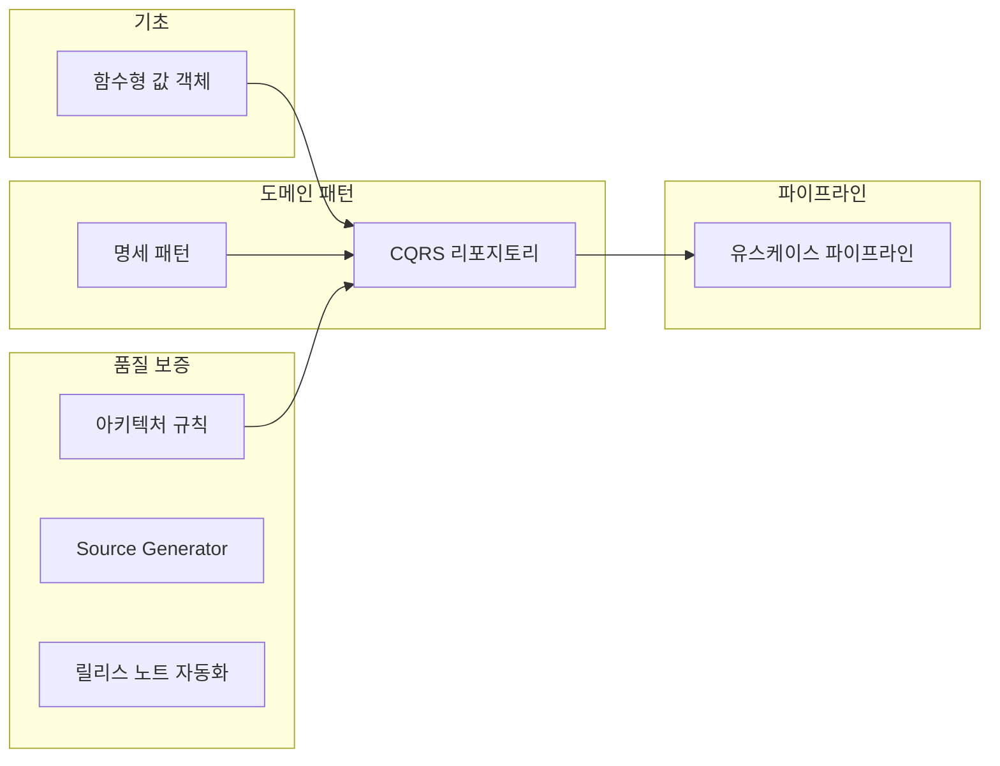

## 들어가며

`string email = "not-an-email"`이 아무런 경고 없이 컴파일되는 순간, 타입 시스템은 비즈니스 규칙을 보호하지 못합니다. Repository에 `GetByName`, `GetByStatus`, `GetByNameAndStatus` 같은 메서드가 하나씩 늘어날 때마다 읽기와 쓰기의 경계가 흐려지고, sealed struct에 제네릭 제약을 걸 수 없어 파이프라인 설계가 막히며, 어댑터마다 반복되는 관측성 코드는 누락과 불일치를 낳습니다.

Functorium 튜토리얼은 이런 **기술 제약 조건이** 각각 **아키텍처적 결정으로** 이어진 과정을 직접 체험하는 실전 학습입니다. 제약이 발생한 맥락을 이해하고, 결정의 근거를 따라가며, 단계별로 구현해 봅니다.

**가이드와의 관계:** [가이드](../guides/)가 "왜(WHY) → 무엇(WHAT) → 어떻게(HOW)"의 **설계 원칙을** 다룬다면, 튜토리얼은 그 원칙이 탄생하게 된 **구체적 문제 상황에서** 출발하여 해결 과정을 단계별로 걸어봅니다.

## 기술 제약에서 아키텍처 결정으로

각 튜토리얼은 Functorium 개발 과정에서 실제로 맞닥뜨린 기술 제약에서 출발합니다.

### 기초: 타입 시스템

`string`, `int` 같은 원시 타입은 비즈니스 규칙을 표현하지 못합니다. 이메일 주소에 아무 문자열이나 들어가고, 금액에 음수가 허용되며, 컴파일러는 이를 막아주지 않습니다. **함수형 값 객체는** 생성 시점에 검증을 강제하고, 불변성과 값 동등성을 보장하여 "잘못된 값이 존재할 수 없는" 타입을 만듭니다.

### 도메인 패턴

비즈니스 규칙이 서비스 레이어, 컨트롤러, 쿼리 곳곳에 흩어지면 변경할 때마다 여러 파일을 수정해야 합니다. **명세 패턴은** 규칙을 독립적인 객체로 캡슐화하고, 논리 연산자로 조합하여 재사용할 수 있게 합니다.

Repository에 메서드가 계속 늘어나면 읽기 요구사항이 바뀔 때마다 인터페이스 자체를 수정해야 합니다. **CQRS 리포지토리는** 쓰기(Command)와 읽기(Query)의 책임을 분리하여, 각각 독립적으로 확장할 수 있는 구조를 만듭니다.

### 파이프라인

C#의 sealed struct는 인터페이스의 제네릭 공변성/반공변성 제약을 받으며, 이로 인해 Mediator 파이프라인에서 단일 응답 타입으로 통합할 수 없습니다. **유스케이스 파이프라인은** 응답 인터페이스 계층과 CRTP 패턴으로 이 제약을 우회하여, Command와 Query를 하나의 파이프라인으로 처리합니다.

### 품질 보증

코드 리뷰에서 "이 클래스는 Domain 레이어에 있으면 안 됩니다"라는 피드백이 반복되면, 사람의 주의력에 의존하는 것이 한계입니다. **아키텍처 규칙 테스트는** 레이어 의존성, 네이밍 규칙, 불변성 규칙을 자동화된 테스트로 검증합니다.

어댑터마다 로깅, 메트릭, 트레이싱 코드를 수작업으로 작성하면 누락과 형식 불일치가 발생합니다. **Source Generator 관측성은** 컴파일 타임에 관측성 코드를 자동 생성하여 일관성을 보장합니다.

수동으로 릴리스 노트를 작성하면 커밋 누락과 형식 불일치가 발생합니다. **릴리스 노트 자동화는** 커밋 히스토리를 분석하여 일관된 릴리스 노트를 생성합니다.

### 요약

| 기술 제약 | 아키텍처 결정 | 튜토리얼 | 프로젝트 수 |
|----------|-------------|---------|-----------|
| 원시 타입이 비즈니스 규칙을 표현하지 못함 | 함수형 값 객체 | [함수형 값 객체 구현](./functional-valueobject/) | 89개 |
| 비즈니스 규칙이 코드 전반에 산재 | 명세 패턴 | [명세 패턴](./specification-pattern/) | 40개 |
| Repository 메서드 폭증, 읽기/쓰기 혼재 | CQRS 리포지토리 | [CQRS 리포지토리 패턴](./cqrs-repository/) | 46개 |
| sealed struct의 제네릭 변성 제약 | 유스케이스 파이프라인 | [유스케이스 파이프라인 제약](./usecase-pipeline/) | 43개 |
| 레이어 규칙 위반의 수동 검증 한계 | 아키텍처 규칙 테스트 | [아키텍처 규칙 테스트](./architecture-rules/) | 32개 |
| 어댑터 관측성 코드 수작업 반복 | Source Generator | [소스 생성기 관측성](./sourcegen-observability/) | 74개 |
| 릴리스 노트 수동 작성 | 릴리스 노트 자동화 | [릴리스 노트 자동화](./release-notes-claude/) | — |

## 학습 로드맵

**권장 순서:** 함수형 값 객체 → 명세 패턴 → CQRS 리포지토리 → 유스케이스 파이프라인 순서로 진행하면, 앞선 개념이 다음 튜토리얼의 토대가 됩니다.

**독립 진입점:** 아키텍처 규칙 테스트, Source Generator 관측성, 릴리스 노트 자동화는 다른 튜토리얼에 의존하지 않아 독립적으로 학습할 수 있습니다.

## 튜토리얼 간 연결 관계

각 튜토리얼에서 만든 개념과 패턴은 다른 튜토리얼에서 재활용됩니다.

- **값 객체 → CQRS 리포지토리:** 함수형 값 객체로 만든 타입 안전한 도메인 엔티티가 CQRS의 Aggregate Root에 적용됩니다.
- **명세 패턴 → CQRS 리포지토리:** 명세 객체가 CQRS의 쿼리 파라미터로 통합되어 동적 필터링을 구현합니다.
- **CQRS → 유스케이스 파이프라인:** Command/Query 유스케이스가 파이프라인 제약 패턴을 통해 트랜잭션, 캐싱과 결합됩니다.
- **아키텍처 규칙 → 전체 프로젝트:** 레이어 의존성과 네이밍 규칙을 메타 수준에서 검증하여 모든 튜토리얼의 구조적 일관성을 보장합니다.
- **Source Generator → 어댑터 계층:** 컴파일 타임 코드 생성으로 어댑터의 관측성 보일러플레이트를 자동화합니다.

## 가이드와 튜토리얼

| | 가이드 | 튜토리얼 |
|---|---|---|
| **관점** | 설계 원칙 (WHY → WHAT → HOW) | 문제 해결 과정 (제약 → 결정 → 구현) |
| **형식** | 참조 문서 | 단계별 실습 |
| **구성** | 주제별 23개 문서 | 7개 독립 과정, 총 320+ 프로젝트 |

설계 원칙의 배경이 궁금하다면 [가이드](../guides/)에서 WHY부터 시작하고, 실제 문제를 풀며 배우고 싶다면 튜토리얼에서 제약 조건부터 시작하세요.
