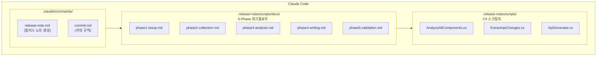
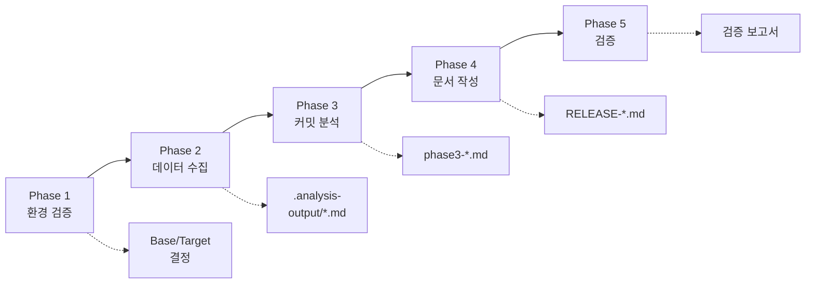
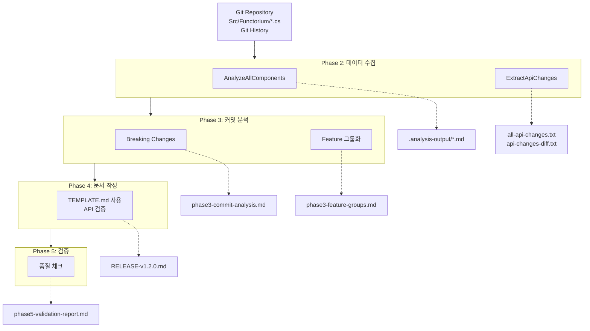

앞 절에서 릴리스 노트 자동화의 필요성을 살펴보았습니다. 이제 Functorium 프로젝트의 자동화 시스템이 실제로 어떤 구조로 동작하는지, 큰 그림부터 그려보겠습니다.

---

## 시스템 아키텍처

자동화 시스템은 세 가지 핵심 구성요소가 계층적으로 연결된 구조입니다. 사용자가 Claude Code에서 `/release-note v1.2.0` 명령을 실행하면, Command가 워크플로우를 호출하고, 워크플로우가 C# 스크립트를 실행합니다.



각 구성요소를 하나씩 살펴봅시다.

---

## Claude Code 사용자 정의 Command

Claude Code는 AI 기반 CLI 도구입니다. 사용자 정의 Command를 통해 복잡한 작업을 단일 명령어로 실행할 수 있습니다.

### release-note.md

이 파일은 릴리스 노트 생성의 **마스터 문서입니다.** 버전 파라미터 검증(`/release-note v1.2.0`), 5-Phase 워크플로우 정의, 각 Phase별 성공 기준 명시, 최종 출력 형식 정의를 모두 담고 있습니다.

**사용 예시:**
```bash
/release-note v1.2.0        # 정규 릴리스
/release-note v1.0.0        # 첫 배포
/release-note v1.2.0-beta.1 # 프리릴리스
```

### commit.md

커밋 메시지 규칙을 정의하여 일관된 커밋 히스토리를 유지합니다. `feat`(새로운 기능), `fix`(버그 수정), `docs`(문서 변경), `refactor`(코드 리팩토링), `test`(테스트 추가/수정), `chore`(빌드, 설정 변경) 등의 커밋 타입을 Conventional Commits 형식으로 관리합니다. 이 일관된 커밋 히스토리가 있어야 Phase 3에서 커밋을 자동으로 분류할 수 있습니다.

---

## 5-Phase 워크플로우

릴리스 노트 생성은 5단계 파이프라인으로 진행됩니다. 각 단계는 명확한 입력과 출력, 그리고 성공 기준을 갖고 있어서, 문제가 발생했을 때 어느 단계에서 막혔는지 바로 파악할 수 있습니다.



각 Phase가 하는 일을 간략히 살펴보겠습니다.

**Phase 1: 환경 검증은** 릴리스 노트 생성 전 필수 환경을 점검합니다. Git 저장소, .NET 10.x SDK, 스크립트 디렉터리가 존재하는지 확인하고, 비교 기준이 되는 Base Branch를 자동으로 결정합니다. `origin/release/1.0` 브랜치가 존재하면 그것을 Base로 사용하고, 없으면 초기 커밋을 Base로 삼아 첫 배포로 처리합니다.

**Phase 2: 데이터 수집은** C# 스크립트를 실행하여 원시 데이터를 수집합니다. `AnalyzeAllComponents.cs`가 컴포넌트별 변경사항을, `ExtractApiChanges.cs`가 Public API를 추출합니다. 결과는 `.analysis-output/` 폴더에 컴포넌트별 분석 결과(`.md`), 전체 API 목록(`all-api-changes.txt`), API 변경 diff(`api-changes-diff.txt`) 형태로 저장됩니다.

**Phase 3: 커밋 분석은** 수집된 데이터에서 릴리스 노트에 실을 내용을 추출합니다. Git diff 분석을 통해 Breaking Changes를 식별하고(커밋 메시지 패턴은 보조 수단), Feature와 Bug Fix 커밋을 분류하여 기능별로 그룹화합니다. 중간 결과는 `.analysis-output/work/` 폴더에 저장됩니다.

**Phase 4: 문서 작성은** 분석 결과를 바탕으로 실제 릴리스 노트를 생성합니다. `TEMPLATE.md`를 복사하고, Placeholder를 교체하고, 각 섹션을 채운 뒤, 모든 API를 Uber 파일에서 검증합니다. 핵심 규칙은 모든 주요 기능에 "Why this matters" 섹션을 반드시 포함하는 것입니다.

**Phase 5: 검증은** 생성된 릴리스 노트의 품질을 최종 점검합니다. 프론트매터 존재, 필수 섹션 포함, "Why this matters" 섹션 포함, API 정확성(Uber 파일 대조), Breaking Changes 완전성을 모두 확인합니다.

---

## C# 스크립트

.NET 10의 file-based app 기능을 활용하여 작성된 스크립트입니다. 프로젝트 파일(`.csproj`) 없이 단일 `.cs` 파일로 바로 실행할 수 있습니다.

### AnalyzeAllComponents.cs

모든 컴포넌트의 변경사항을 분석합니다. Base와 Target 사이의 커밋을 수집하고, 파일 변경 통계를 계산하며, 커밋을 타입별로 분류합니다.

```bash
dotnet AnalyzeAllComponents.cs --base origin/release/1.0 --target HEAD
```

**출력 예시:**
```markdown
# Analysis for Src/Functorium

## Change Summary
37 files changed, 3167 insertions(+)

## All Commits
51533b1 refactor(observability): Observability 추상화 및 구조 개선
4683281 feat(linq): TraverseSerial 메서드 추가
...

## Categorized Commits
### Feature Commits
- 4683281 feat(linq): TraverseSerial 메서드 추가
### Breaking Changes
None found
```

### ExtractApiChanges.cs

Public API를 추출하고 Uber 파일을 생성합니다. 이 Uber 파일(`all-api-changes.txt`)은 Phase 4에서 릴리스 노트에 기재된 API가 실제로 존재하는지 검증하는 기준 자료가 됩니다.

```bash
dotnet ExtractApiChanges.cs
```

**출력 예시 (all-api-changes.txt):**
```csharp
namespace Functorium.Abstractions.Errors
{
    public static class ErrorCodeFactory
    {
        public static Error Create(string errorCode, string errorCurrentValue, string errorMessage) { }
        public static Error CreateFromException(string errorCode, Exception exception) { }
    }
}
```

---

## 데이터 흐름

지금까지 살펴본 구성요소들이 어떻게 데이터를 주고받는지, 전체 흐름을 시각화하면 다음과 같습니다. Git 저장소에서 시작된 데이터가 각 Phase를 거치며 점점 정제되어, 최종적으로 검증된 릴리스 노트 문서가 만들어집니다.



---

## 핵심 원칙

이 자동화 시스템은 네 가지 원칙을 따릅니다. 단순한 규칙이 아니라, 각각 실제 문제에서 비롯된 원칙입니다.

### 정확성 우선

> **Uber 파일에 없는 API는 절대 문서화하지 않습니다.**

AI가 생성한 텍스트에는 존재하지 않는 API가 포함될 수 있습니다. 모든 API를 실제 코드에서 추출된 `all-api-changes.txt` 파일에서 검증함으로써, 릴리스 노트에 잘못된 정보가 실리는 것을 원천적으로 방지합니다.

### 가치 전달 필수

> **모든 주요 기능에 "Why this matters (왜 중요한가):" 섹션을 포함합니다.**

"TraverseSerial 메서드를 추가했습니다"만으로는 사용자가 그 기능을 써야 할 이유를 알 수 없습니다. 어떤 문제를 해결하는지, 개발자 생산성이 어떻게 향상되는지, 코드 품질이 어떻게 개선되는지를 함께 설명해야 릴리스 노트가 진정한 가치를 전달합니다.

### Breaking Changes 자동 감지

> **Git Diff 분석이 커밋 메시지 패턴보다 우선합니다.**

커밋 메시지에 "breaking"이라고 적지 않았더라도 실제로 API가 삭제되거나 시그니처가 변경되었을 수 있습니다. `.api` 폴더의 Git diff를 분석하는 객관적 방법을 주 수단으로, 커밋 메시지 패턴은 보조 수단으로 사용합니다.

### 추적성

> **모든 기능을 실제 커밋으로 추적합니다.**

릴리스 노트에 기재된 모든 기능은 커밋 SHA 주석을 포함하고, 가능한 경우 GitHub 이슈/PR 링크를 첨부합니다. "이 기능이 언제, 왜 추가되었는지" 언제든 추적할 수 있어야 합니다.

## FAQ

### Q1: 5-Phase 파이프라인에서 특정 Phase만 다시 실행할 수 있나요?
**A**: `/release-note` 명령은 전체 파이프라인을 실행하지만, Phase 2의 C# 스크립트(`AnalyzeAllComponents.cs`, `ExtractApiChanges.cs`)는 독립적으로 실행할 수 있습니다. Phase 3~5는 Claude가 수행하므로, 중간 결과 파일(`.analysis-output/work/`)이 남아 있으면 해당 Phase부터 재개를 요청할 수 있습니다.

### Q2: Uber 파일이란 정확히 무엇이고, 왜 "단일 진실 소스"라고 부르나요?
**A**: Uber 파일(`all-api-changes.txt`)은 모든 어셈블리의 Public API를 하나로 합친 파일입니다. 컴파일된 DLL에서 직접 추출하므로 소스 코드가 아닌 **실제 빌드 결과물을** 반영합니다. 릴리스 노트에 기재되는 모든 API가 이 파일에 존재해야 하므로, 존재하지 않는 API를 문서화하는 실수를 원천적으로 방지합니다.

### Q3: Breaking Changes 감지에서 Git Diff 분석이 커밋 메시지 패턴보다 우선하는 이유는 무엇인가요?
**A**: 커밋 메시지는 개발자가 의도적으로 작성하는 것이므로 `!` 표기를 누락할 수 있습니다. 반면 `.api` 폴더의 Git Diff는 삭제되거나 시그니처가 변경된 API를 **객관적으로** 감지합니다. 두 방법을 병행하되 Git Diff를 주 수단으로, 커밋 메시지를 보조 수단으로 사용합니다.

---

지금까지 자동화 시스템의 전체 아키텍처와 데이터 흐름을 살펴보았습니다. 다음 절에서는 이 시스템을 구성하는 실제 파일과 폴더 구조를 안내합니다.

[0.3 프로젝트 구조 소개](03-project-structure.md)
