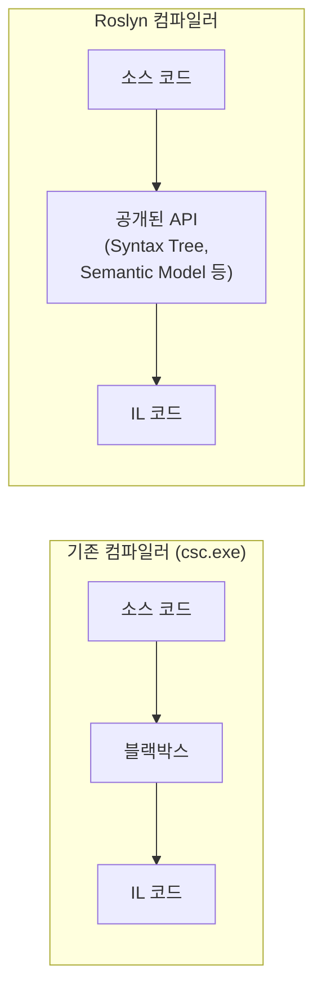
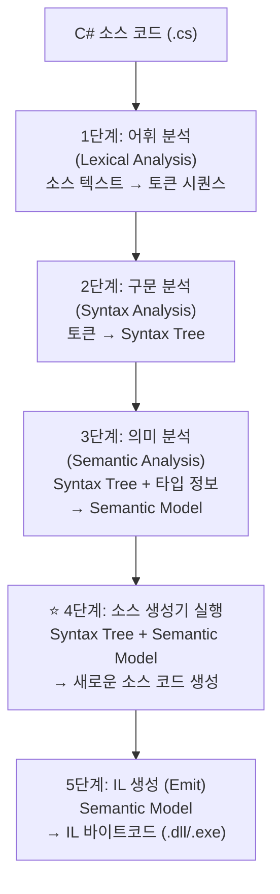

## 개요

앞 장까지 개발 환경, 프로젝트 구조, 디버깅 설정을 마쳤습니다. 이제 소스 생성기가 **어떤 도구 위에서 동작하는지** 이해할 차례입니다.

소스 생성기는 Roslyn 컴파일러 플랫폼의 API를 사용하여 컴파일 중인 코드를 분석하고 새 코드를 추가합니다. Roslyn의 Syntax Tree, Semantic Model, Symbol이라는 세 가지 핵심 계층을 이해하지 못하면, 소스 생성기 코드를 작성할 때 "어떤 API를 써야 하는가"라는 질문에 답할 수 없습니다. 이 장에서는 이 세 계층이 각각 무엇을 제공하고, 어떤 순서로 결합되며, 우리 프로젝트의 ObservablePortGenerator가 어디서 어떤 API를 사용하는지 전체 그림을 그립니다.

## 학습 목표

### 핵심 학습 목표
1. **Roslyn 컴파일러 플랫폼의 전체 구조 이해**
   - 기존 블랙박스 컴파일러와 달리 내부 데이터 구조가 API로 공개된 아키텍처
2. **컴파일 파이프라인의 각 단계 파악**
   - 어휘 분석 → 구문 분석 → 의미 분석 → 소스 생성기 실행 → IL 생성
3. **소스 생성기가 개입하는 시점 이해**
   - 의미 분석 완료 후, IL 생성 직전에 Syntax Tree + Semantic Model에 접근

---

## Roslyn이란?

**Roslyn은** .NET 컴파일러 플랫폼(.NET Compiler Platform)의 코드명으로, C# 및 Visual Basic 컴파일러를 오픈 소스로 재작성한 프로젝트입니다. 기존 `csc.exe` 컴파일러가 소스 코드를 받아 IL을 출력하는 블랙박스였다면, Roslyn은 컴파일 과정의 각 단계를 API로 공개하여 외부에서 프로그래밍적으로 접근할 수 있게 합니다.



### 핵심 특징

| 특징 | 설명 |
|------|------|
| API 공개 | 컴파일러 내부 데이터 구조에 접근 가능 |
| 확장성 | 분석기, 소스 생성기 등 확장 가능 |
| IDE 통합 | Visual Studio의 IntelliSense, 리팩터링 기반 |

이 API 공개 덕분에 소스 생성기는 컴파일 중인 코드의 구조(Syntax Tree)와 의미(Semantic Model)를 모두 읽을 수 있습니다.

---

## 컴파일 파이프라인

Roslyn 컴파일러는 소스 코드를 여러 단계를 거쳐 IL 코드로 변환합니다:



---

## 핵심 개념

Roslyn API는 세 가지 핵심 계층으로 구성됩니다. 각 계층은 이전 계층 위에 더 풍부한 정보를 추가하는 구조입니다: Syntax Tree(구조) → Semantic Model(구조 + 타입) → Symbol(이름 있는 엔티티). 이 순서는 컴파일 파이프라인의 처리 순서이기도 하며, 소스 생성기에서 정보를 조회하는 흐름이기도 합니다.

### Syntax Tree (구문 트리)

소스 코드의 **구조적 표현**입니다. 코드의 모든 문자를 포함하여 원본을 완벽히 복원할 수 있습니다. 우리 프로젝트에서는 소스 생성기의 `predicate` 단계에서 "이 노드가 `ClassDeclarationSyntax`인가?"를 확인하는 데 사용합니다.

```csharp
// 소스 코드
public class User
{
    public int Id { get; set; }
}
```

```
Syntax Tree
===========

CompilationUnit
└── ClassDeclaration "User"
    ├── Modifier: "public"
    └── Members
        └── PropertyDeclaration "Id"
            ├── Type: "int"
            ├── Modifier: "public"
            └── Accessors: { get; set; }
```

### Semantic Model (의미 모델)

Syntax Tree만으로는 `User`가 클래스인지 인터페이스인지, 어떤 네임스페이스에 속하는지 알 수 없습니다. Semantic Model은 Syntax Tree에 **타입 정보**를 추가하여 이런 질문에 답할 수 있게 합니다. 우리 프로젝트에서는 `transform` 단계에서 `ctx.SemanticModel`을 통해 클래스가 구현하는 인터페이스 목록과 메서드의 정확한 반환 타입을 조회합니다.

```csharp
// 소스 코드
var user = new User();
user.Id = 5;

// Syntax만으로는 알 수 없는 정보
// - "user"의 타입이 무엇인가? → Semantic Model: User
// - "Id"가 어느 클래스에 정의되어 있나? → Semantic Model: User.Id
// - "5"를 "Id"에 할당 가능한가? → Semantic Model: int → int, 가능
```

### Symbol (심볼)

Semantic Model이 전체 의미 분석 결과를 담고 있다면, Symbol은 그 안에서 **이름이 있는 개별 엔티티**를 나타냅니다. 클래스, 메서드, 프로퍼티, 파라미터 등이 모두 심볼이며, 각 심볼 타입은 해당 엔티티에 특화된 속성을 제공합니다. 우리 프로젝트에서는 `ctx.TargetSymbol`을 `INamedTypeSymbol`로 캐스팅하여 클래스의 인터페이스, 생성자, 메서드 정보에 접근합니다.

```
심볼 계층 구조
=============

ISymbol (기본)
├── INamespaceSymbol      (네임스페이스)
├── INamedTypeSymbol      (클래스, 인터페이스, 구조체)
├── IMethodSymbol         (메서드, 생성자)
├── IPropertySymbol       (프로퍼티)
├── IFieldSymbol          (필드)
├── IParameterSymbol      (파라미터)
└── ILocalSymbol          (지역 변수)
```

---

## Roslyn API 구조

Roslyn API는 언어 공통(`Microsoft.CodeAnalysis`)과 C# 전용(`Microsoft.CodeAnalysis.CSharp`) 두 네임스페이스로 나뉩니다. 소스 생성기 프로젝트에서 참조하는 `Microsoft.CodeAnalysis.CSharp` NuGet 패키지가 이 두 네임스페이스를 모두 포함합니다.

```
Microsoft.CodeAnalysis (기본)
├── SyntaxTree             구문 트리
├── SyntaxNode             구문 노드 (기본 클래스)
├── SyntaxToken            토큰 (키워드, 식별자 등)
├── SyntaxTrivia           공백, 주석 등
├── Compilation            컴파일 단위
├── SemanticModel          의미 모델
└── ISymbol                심볼 인터페이스

Microsoft.CodeAnalysis.CSharp (C# 전용)
├── CSharpSyntaxTree       C# 구문 트리
├── CSharpCompilation      C# 컴파일
└── CSharpSyntaxNode       C# 구문 노드 (기본 클래스)
    ├── ClassDeclarationSyntax
    ├── MethodDeclarationSyntax
    ├── PropertyDeclarationSyntax
    └── ... (수백 개의 구문 노드)
```

소스 생성기에서는 주로 Syntax 계열(`ClassDeclarationSyntax` 등)로 1차 필터링하고, Symbol 계열(`INamedTypeSymbol`, `IMethodSymbol` 등)로 상세 분석하는 패턴을 사용합니다.

---

## 소스 생성기와 Roslyn

위에서 살펴본 Syntax Tree, Semantic Model, Symbol을 실제 소스 생성기에서 어떻게 사용하는지 살펴봅니다. 소스 생성기는 Roslyn API를 통해 **컴파일 중인 코드를 분석**하고 **새 코드를 추가**하지만, 결정적 출력을 보장하기 위해 접근할 수 있는 정보에 명확한 경계가 있습니다.

### 접근 가능한 정보

```csharp
// IIncrementalGenerator.Initialize에서 접근 가능한 정보
public void Initialize(IncrementalGeneratorInitializationContext context)
{
    // 1. Syntax Provider - 구문 트리 기반 필터링
    context.SyntaxProvider
        .ForAttributeWithMetadataName(
            "MyAttribute",                                    // 속성 이름
            predicate: (node, _) => node is ClassDeclarationSyntax,  // 구문 필터
            transform: (ctx, _) => {
                // 2. 여기서 Semantic Model에 접근 가능
                var symbol = ctx.TargetSymbol;                // ISymbol
                var semanticModel = ctx.SemanticModel;        // SemanticModel
                return symbol;
            });
}
```

### 접근 불가능한 정보

소스 생성기는 순수하게 컴파일 입력(소스 코드, 참조 어셈블리)만으로 동작해야 합니다. 외부 상태에 의존하면 동일한 소스 코드가 빌드 환경에 따라 다른 결과를 생성하게 되기 때문입니다.

```
소스 생성기에서 접근 불가능한 것들
================================

✗ 파일 시스템 (File.ReadAllText 등)
✗ 네트워크 (HttpClient 등)
✗ 데이터베이스
✗ 환경 변수 (제한적)
✗ 다른 어셈블리의 소스 코드

이유: 결정적(Deterministic) 출력을 보장하기 위해
     동일한 소스 코드 → 항상 동일한 생성 결과
```

---

## Compilation 개념

`Compilation`은 **컴파일 단위 전체**를 나타냅니다. 소스 생성기 테스트에서 `CSharpCompilation.Create`로 직접 Compilation을 생성하는 것은 바로 컴파일러가 수행하는 과정을 재현하는 것입니다. 우리 프로젝트의 `SourceGeneratorTestRunner`에서도 이 패턴을 사용합니다.

```csharp
// Compilation 생성
var compilation = CSharpCompilation.Create(
    assemblyName: "MyAssembly",
    syntaxTrees: [syntaxTree1, syntaxTree2],        // 여러 파일
    references: [                                   // 참조 어셈블리
        MetadataReference.CreateFromFile(typeof(object).Assembly.Location),
        MetadataReference.CreateFromFile(typeof(Console).Assembly.Location)
    ],
    options: new CSharpCompilationOptions(OutputKind.DynamicallyLinkedLibrary)
);

// Compilation에서 얻을 수 있는 정보
var globalNamespace = compilation.GlobalNamespace;  // 전역 네임스페이스
var allTypes = compilation.GetTypeByMetadataName("MyNamespace.MyClass");  // 특정 타입
```

---

## 실습: 간단한 Syntax Tree 분석

```csharp
using Microsoft.CodeAnalysis;
using Microsoft.CodeAnalysis.CSharp;
using Microsoft.CodeAnalysis.CSharp.Syntax;

// 1. 소스 코드 파싱
string code = """
    public class User
    {
        public int Id { get; set; }
        public string Name { get; set; }
    }
    """;

SyntaxTree tree = CSharpSyntaxTree.ParseText(code);
SyntaxNode root = tree.GetRoot();

// 2. 클래스 선언 찾기
var classDeclaration = root
    .DescendantNodes()
    .OfType<ClassDeclarationSyntax>()
    .First();

Console.WriteLine($"클래스 이름: {classDeclaration.Identifier}");
// 출력: 클래스 이름: User

// 3. 프로퍼티 목록 출력
var properties = classDeclaration
    .DescendantNodes()
    .OfType<PropertyDeclarationSyntax>();

foreach (var prop in properties)
{
    Console.WriteLine($"프로퍼티: {prop.Type} {prop.Identifier}");
}
// 출력:
// 프로퍼티: int Id
// 프로퍼티: string Name
```

---

## 한눈에 보는 정리

Roslyn의 세 가지 핵심 계층은 점진적으로 더 풍부한 정보를 제공합니다. Syntax Tree는 코드의 구조를, Semantic Model은 타입 정보를, Symbol은 개별 엔티티의 상세 속성을 담당합니다. 소스 생성기는 이 세 계층을 조합하여 `predicate`(Syntax)로 빠르게 필터링하고, `transform`(Semantic + Symbol)으로 정확하게 분석하는 2단계 패턴을 따릅니다.

| 개념 | 설명 | 접근 방법 |
|------|------|-----------|
| Syntax Tree | 코드의 구조적 표현 | `SyntaxTree.GetRoot()` |
| Semantic Model | 타입 정보가 추가된 모델 | `Compilation.GetSemanticModel()` |
| Symbol | 이름 있는 엔티티 | `SemanticModel.GetSymbolInfo()` |
| Compilation | 컴파일 단위 전체 | `CSharpCompilation.Create()` |

---

## FAQ

### Q1: Syntax Tree와 Semantic Model은 왜 분리되어 있나요?
**A**: Syntax Tree는 소스 코드의 텍스트 구조만을 표현하므로 매우 빠르게 생성됩니다. Semantic Model은 타입 해석, 오버로드 해석 등 비용이 큰 분석을 수행합니다. 분리함으로써 구문 수준의 빠른 필터링(`predicate`)을 먼저 수행하고, 필요한 노드에만 의미 분석을 적용하여 성능을 최적화할 수 있습니다.

### Q2: 소스 생성기에서 `CSharpCompilation.Create`를 직접 호출하는 경우는 언제인가요?
**A**: 실제 소스 생성기 코드에서는 직접 호출하지 않습니다. Roslyn 파이프라인이 `Compilation`을 자동으로 제공합니다. 주로 테스트 코드에서 컴파일 환경을 재현할 때 `CSharpCompilation.Create`를 사용하여 생성기를 격리된 환경에서 실행합니다.

### Q3: 불변(Immutable) Syntax Tree가 소스 생성기에서 중요한 이유는 무엇인가요?
**A**: Syntax Tree가 불변이면 여러 증분 파이프라인 단계에서 동시에 안전하게 참조할 수 있고, 변경 전후를 비교하여 캐시 유효성을 판단할 수 있습니다. 이는 증분 빌드의 결정적(Deterministic) 출력 보장과 직접 연결됩니다.

---

이 장에서 Roslyn의 전체 아키텍처와 세 가지 핵심 계층의 역할을 살펴보았습니다. 다음 세 개 장에서는 각 계층을 하나씩 깊이 있게 다룹니다. 먼저 Syntax API부터 시작합니다.

→ [02. Syntax API](../05-Syntax-Api/)
