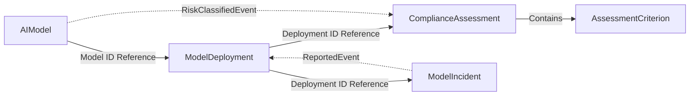

## 1. Project Overview

### Background

The EU AI Act (enacted in 2024, fully enforced in 2026) classifies AI systems by risk level and mandates conformity assessments, post-deployment monitoring, and incident reporting for high-risk AI. Organizations must manage the entire lifecycle of AI models -- from model registration, risk classification, deployment approval, compliance assessment, to incident response.

This system automates AI model governance within a single bounded context. It implements the core requirements of the EU AI Act (risk tier classification, conformity assessment, incident management) using DDD tactical patterns and the Functorium framework, serving as a full-stack DDD example that demonstrates practical patterns across the Domain/Application/Adapter layers.

### Goals

1. Automate core EU AI Act requirements (risk tier classification, compliance assessment, incident management)
2. Implement independent lifecycles of 4 Aggregates and cross-domain rules using DDD tactical patterns
3. Demonstrate practical application of LanguageExt IO advanced features (Timeout, Retry, Fork, Bracket)
4. Automate OpenTelemetry 3-Pillar observability using Source Generators
5. Provide a full-stack DDD reference implementation of the Functorium framework

### Target Users

| Persona | Role | Core Goal |
|---------|------|-----------|
| AI Governance Administrator | AI model registration, deployment approval, risk tier classification | Manage the entire lifecycle of organizational AI models and ensure regulatory compliance |
| Compliance Officer | Compliance assessment, incident investigation, audit reporting | Evaluate EU AI Act requirement compliance and respond promptly to incidents |

### Success Metrics (KPIs)

| Metric Type | Metric | Target | Measurement Method |
|-------------|--------|--------|--------------------|
| Leading | Model registration completion rate | > 95% | Success ratio relative to registration requests |
| Leading | Incident auto-quarantine response time | < 1 second | Time from Critical incident report to deployment quarantine |
| Lagging | Compliance assessment pass rate | > 80% | Passed ratio relative to total assessments |
| Lagging | Average unresolved incident resolution time | < 24 hours | Average time from Reported to Resolved |

### Technical Constraints

- .NET 10 / C# 14
- Functorium framework (DDD Building Blocks, LanguageExt IO, Source Generator)
- FastEndpoints (HTTP API)
- OpenTelemetry 3-Pillar (Metrics, Tracing, Logging)
- InMemory / Sqlite persistence switching

---

## 2. Non-Goals

Scope **explicitly excluded** from this project:

- **Model training pipeline** -- Model training/fine-tuning is the responsibility of the ML platform; this system handles only governance of trained models
- **A/B testing platform** -- Model performance comparison experiments are conducted on a separate experimentation platform; this system manages only regulatory compliance of deployed models
- **Real-time dashboard** -- Model performance monitoring dashboards are provided by a separate observability platform; this system is responsible only up to creating incidents when drift thresholds are exceeded

---

## 3. Ubiquitous Language

| English | Definition |
|---------|------------|
| AIModel | An AI/ML model registered and subject to governance |
| ModelName | Name of the AI model (100 characters or fewer) |
| ModelVersion | Model version in SemVer format |
| ModelPurpose | Description of the model's intended use (500 characters or fewer) |
| RiskTier | EU AI Act-based 4-level classification: Minimal, Limited, High, Unacceptable |
| ModelDeployment | A deployment instance of an AI model in a production environment |
| DeploymentStatus | Current status of the deployment (Draft, PendingReview, Active, Quarantined, Decommissioned, Rejected) |
| DeploymentEnvironment | Target deployment environment: Staging, Production |
| EndpointUrl | Service endpoint of the deployed model |
| DriftThreshold | Model performance drift detection threshold (0.0~1.0) |
| ComplianceAssessment | Regulatory compliance assessment for a deployment |
| AssessmentCriterion | Individual criterion item of a compliance assessment |
| AssessmentScore | Composite assessment score in range 0~100; passing score is 70 or above |
| AssessmentStatus | Assessment progress status (Initiated, InProgress, Passed, Failed, RequiresRemediation) |
| CriterionResult | Individual criterion evaluation result: Pass, Fail, NotApplicable |
| ModelIncident | Accident/issue report related to an AI model |
| IncidentSeverity | Critical, High, Medium, Low |
| IncidentStatus | Incident progress status (Reported, Investigating, Resolved, Escalated) |
| IncidentDescription | Detailed description of the incident (2000 characters or fewer) |
| ResolutionNote | Incident resolution record (2000 characters or fewer) |
| RiskClassificationService | Risk tier classification based on model purpose keywords |
| DeploymentEligibilityService | Cross-Aggregate eligibility verification before deployment |
| HealthCheck | Health status check of a deployed model |
| DriftReport | Model performance drift monitoring result |
| ModelRegistry | External model metadata repository |

---

## 4. User Stories

### AI Governance Administrator

| ID | Story | Priority |
|----|-------|----------|
| US-001 | As an AI Governance Administrator, I want to register an AI model to understand the current state of AI models within the organization. | P0 |
| US-002 | As an AI Governance Administrator, I want to classify a model's risk tier to determine the appropriate management level per EU AI Act regulations. | P0 |
| US-003 | As an AI Governance Administrator, I want to deploy a model to serve it in the production environment. | P0 |
| US-004 | As an AI Governance Administrator, I want to submit a deployment for review to get approval through eligibility verification. | P0 |
| US-005 | As an AI Governance Administrator, I want to quarantine a problematic deployment to prevent further damage. | P0 |
| US-006 | As an AI Governance Administrator, I want to search models and deployment status to manage them by risk tier and status filters. | P1 |

### Compliance Officer

| ID | Story | Priority |
|----|-------|----------|
| US-007 | As a Compliance Officer, I want to initiate a compliance assessment to verify a deployment's regulatory compliance. | P0 |
| US-008 | As a Compliance Officer, I want to report an incident to document the issue and prompt an immediate response. | P0 |
| US-009 | As a Compliance Officer, I want to investigate and resolve incidents to identify root causes and prevent recurrence. | P1 |
| US-010 | As a Compliance Officer, I want to search incident lists by severity/status to respond according to priority. | P1 |

---

## 5. Aggregate Candidates

| Aggregate | Core Responsibility | State Transitions | Key Events |
|-----------|--------------------|--------------------|------------|
| AIModel | Model registration, risk tier classification, archive/restore | (None, Soft Delete guard) | RegisteredEvent, RiskClassifiedEvent, ArchivedEvent |
| ModelDeployment | Deployment creation, state transitions, health check recording | Draft -> PendingReview -> Active -> Quarantined -> Decommissioned | CreatedEvent, ActivatedEvent, QuarantinedEvent |
| ComplianceAssessment | Assessment creation, criterion evaluation, score calculation, completion | Initiated -> InProgress -> Passed/Failed/RequiresRemediation | CreatedEvent, CriterionEvaluatedEvent, CompletedEvent |
| ModelIncident | Incident reporting, investigation, resolution, escalation | Reported -> Investigating -> Resolved/Escalated | ReportedEvent, ResolvedEvent |

### Aggregate Relationship Diagram



---

## 6. Business Rules

### AIModel Rules

1. Model name must be 100 characters or fewer and must not be empty
2. Model version must be in SemVer format
3. Model purpose must be 500 characters or fewer and must not be empty
4. Risk tier is classified into 4 levels: Minimal, Limited, High, Unacceptable
5. Automatic risk tier classification based on model purpose keywords is supported
6. Archived models cannot be modified (Soft Delete guard)
7. Archive and restore operations are idempotent

### ModelDeployment Rules

1. Endpoint URL must be a valid HTTP/HTTPS URL
2. Drift threshold must be in the range 0.0~1.0
3. Deployment status transitions follow only the defined transition map (6 states, 2 terminal states)
4. Health checks can be recorded

### ComplianceAssessment Rules

1. Default assessment criteria of 3: Data Governance, Technical Documentation, Security Review
2. For High/Unacceptable tiers, an additional 3 criteria: Human Oversight, Bias Assessment, Transparency
3. For Unacceptable tier, an additional 1 criterion: Prohibition Review
4. All criteria must be evaluated before the assessment can be completed
5. The composite score is automatically calculated as the Pass ratio among applicable criteria (0~100)
6. 70 or above is Passed, 40~69 is RequiresRemediation, below 40 is Failed

### ModelIncident Rules

1. Incident description must be 2000 characters or fewer
2. Critical/High severity incidents trigger automatic deployment quarantine
3. Incident status transitions follow only the defined transition map

### Cross-Domain Rules

1. **Risk Tier Classification:** Risk tier is determined by analyzing model purpose keywords (RiskClassificationService)
2. **Deployment Eligibility Verification:** Prohibited tier check -> Compliance assessment check -> Unresolved incident check (DeploymentEligibilityService)
3. **Automatic Assessment Initiation on Risk Tier Upgrade:** RiskClassifiedEvent -> Create assessment for each active deployment (EventHandler)
4. **Automatic Deployment Quarantine on Critical Incident:** ReportedEvent -> Quarantine deployment (EventHandler)

---

## 7. Use Cases + Acceptance Criteria

### Commands (Write)

| Use Case | Input | Core Logic | Output | Priority |
|----------|-------|-----------|--------|----------|
| RegisterModelCommand | Name, Version, Purpose | VO composition -> Risk classification -> Model creation | ModelId | P0 |
| ClassifyModelRiskCommand | ModelId, RiskTier | Model lookup -> Reclassify -> Update | -- | P0 |
| CreateDeploymentCommand | ModelId, Url, Env, Drift | VO composition -> Model verification -> Deployment creation | DeploymentId | P0 |
| SubmitDeploymentForReviewCommand | DeploymentId | Deployment lookup -> Eligibility verification -> Submit | -- | P0 |
| ActivateDeploymentCommand | DeploymentId, AssessmentId | Deployment/Assessment lookup -> Pass verification -> Activate | -- | P0 |
| QuarantineDeploymentCommand | DeploymentId, Reason | Deployment lookup -> Quarantine | -- | P0 |
| InitiateAssessmentCommand | ModelId, DeploymentId | Model/Deployment lookup -> Assessment creation | AssessmentId | P0 |
| ReportIncidentCommand | DeploymentId, Severity, Desc | VO composition -> Deployment lookup -> Incident creation | IncidentId | P0 |

#### RegisterModelCommand Acceptance Criteria

**Success Scenario:**
```
Given: A valid model name, SemVer version, and model purpose are provided
When:  An AI Governance Administrator registers a model
Then:  The model is created, the risk tier is automatically classified based on purpose keywords, and a ModelId is returned
```

**Rejection Scenario:**
```
Given: The model name is empty and the version is not in SemVer format
When:  An AI Governance Administrator registers a model
Then:  Both errors are returned simultaneously (ApplyT parallel validation)
```

#### SubmitDeploymentForReviewCommand Acceptance Criteria

**Success Scenario:**
```
Given: A deployment in Draft status exists, the model is not in a prohibited tier, the compliance assessment has passed, and there are no unresolved incidents
When:  An AI Governance Administrator submits for review
Then:  The deployment status transitions to PendingReview
```

**Rejection Scenario (Prohibited Tier):**
```
Given: A deployment referencing a model with Unacceptable risk tier exists
When:  An AI Governance Administrator submits for review
Then:  A ProhibitedModel error is returned and the deployment status remains unchanged
```

**Rejection Scenario (Failed Compliance):**
```
Given: A High risk tier model has no passed compliance assessment
When:  An AI Governance Administrator submits for review
Then:  A ComplianceAssessmentRequired error is returned
```

#### ReportIncidentCommand Acceptance Criteria

**Success Scenario (Auto-Quarantine):**
```
Given: A deployment in Active status exists
When:  A Compliance Officer reports a Critical severity incident
Then:  The incident is created in Reported status, and the event handler automatically quarantines the deployment
```

#### InitiateAssessmentCommand Acceptance Criteria

**Success Scenario:**
```
Given: A registered model and deployment exist
When:  A Compliance Officer initiates an assessment
Then:  Assessment criteria are automatically generated based on the risk tier (Minimal: 3, High: 6, Unacceptable: 7) and an AssessmentId is returned
```

### Queries (Read)

| Use Case | Input | Query Strategy | Output | Priority |
|----------|-------|---------------|--------|----------|
| GetModelByIdQuery | ModelId | IModelDetailQuery | Model detail (deployment/assessment/incident aggregation) | P0 |
| SearchModelsQuery | RiskTier?, Page, Size | IAIModelQuery | Model list | P1 |
| GetDeploymentByIdQuery | DeploymentId | IDeploymentDetailQuery | Deployment detail | P0 |
| SearchDeploymentsQuery | Status?, Env?, Page, Size | IDeploymentQuery | Deployment list | P1 |
| GetAssessmentByIdQuery | AssessmentId | IAssessmentRepository | Assessment detail (including criteria) | P0 |
| GetIncidentByIdQuery | IncidentId | IIncidentRepository | Incident detail | P0 |
| SearchIncidentsQuery | Severity?, Status?, Page, Size | IIncidentQuery | Incident list | P1 |

### Event Handlers (Reactive)

| Trigger Event | Action | Priority |
|--------------|--------|----------|
| ModelIncident.ReportedEvent | Auto-quarantine deployment on Critical/High severity (QuarantineDeploymentOnCriticalIncidentHandler) | P0 |
| AIModel.RiskClassifiedEvent | Auto-create assessment for active deployments on High/Unacceptable upgrade (InitiateAssessmentOnRiskUpgradeHandler) | P0 |

#### QuarantineDeploymentOnCriticalIncidentHandler Acceptance Criteria

```
Given: A Critical severity incident is reported for a deployment in Active status
When:  The ReportedEvent is published
Then:  The event handler auto-quarantines the deployment, including the severity in the quarantine reason
```

#### InitiateAssessmentOnRiskUpgradeHandler Acceptance Criteria

```
Given: A model upgraded from Minimal to High risk tier has 2 Active deployments
When:  The RiskClassifiedEvent is published
Then:  The event handler creates a ComplianceAssessment for each active deployment (2 total)
```

---

## 8. Prohibited States

| Prohibited State | Prevention Strategy | Functorium Pattern |
|-----------------|--------------------|--------------------|
| Unacceptable tier model having active deployments | `riskTier.IsProhibited` check in DeploymentEligibilityService | Smart Enum domain property (`RiskTier.IsProhibited`) + Domain Service |
| Deployment transitioning directly from Draft to Active | Structurally blocked by DeploymentStatus transition map | Smart Enum + `HashMap` transition map (`CanTransitionTo`) |
| Assessment completed without all criteria evaluated | `Complete()` method returns `Fin.Fail` when unevaluated criteria exist | Aggregate Root guard method |

---

## 9. Priority Summary

| Priority | Criteria | Use Case Count | Notes |
|----------|---------|---------------|-------|
| **P0** (Required) | Cannot ship without it | 12 | MVP: Command 8 + Query 4 (ID lookup) + EventHandler 2 |
| **P1** (Important) | Competitiveness weakened without it | 5 | Search/Filter: Query 3 + Incident investigation/resolution |
| **P2** (Optional) | Differentiating if present | -- | EfCore/Dapper persistence, Prometheus dashboard |

---

## 10. Timeline

| Milestone | Scope | Target | Dependencies |
|-----------|-------|--------|-------------|
| Phase 1 (MVP) | P0 Use Cases + InMemory Persistence | Week 4 | -- |
| Phase 2 | P1 Use Cases + Sqlite Persistence | Week 8 | Phase 1 Complete |
| Phase 3 | P2 + Observability Dashboard + Alert Rules | Week 12 | Phase 2 Complete |

---

## 11. Open Questions

| ID | Question | Category | Blocking | Owner |
|----|----------|---------|----------|-------|
| Q-001 | Should ComplianceAssessment criteria be dynamically loaded from an external configuration file? | engineering | Non-blocking | Architect |
| Q-002 | Is integration with external notification systems (Slack, PagerDuty) needed for incident escalation? | product | Non-blocking | PM |
| Q-003 | Should registration of Unacceptable tier models be blocked entirely, or is blocking only deployment sufficient? | legal | Non-blocking | Legal |
| Q-004 | Is automatic incident creation needed when model drift threshold is exceeded? | engineering | Non-blocking | Architect |

---

## 12. Next Steps

1. **architecture-design** -- Project structure + infrastructure design
2. **domain-develop** -- Detailed design + implementation of each Aggregate
3. **application-develop** -- Use case implementation
4. **adapter-develop** -- Persistence + API implementation
5. **observability-develop** -- Observability design + implementation
6. **test-develop** -- Test authoring
7. **review** -- Code review + documentation
