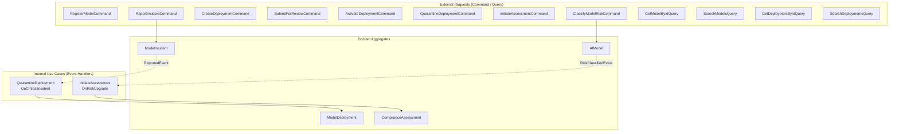
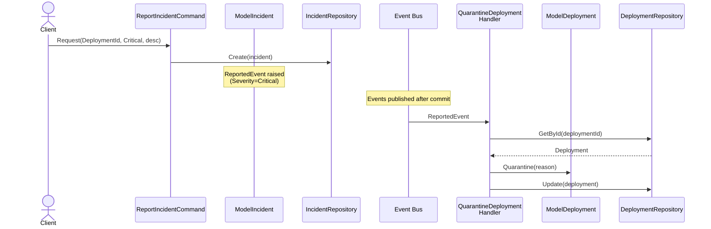
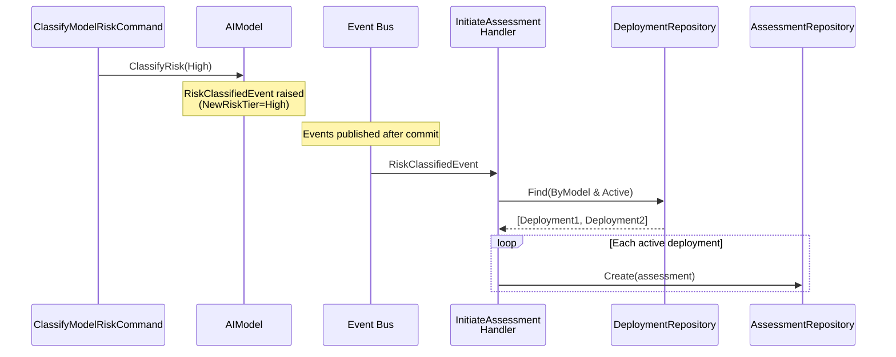

## Background

The business rules defined in [domain business requirements](../domain/00-business-requirements/) focus on 'what is allowed and what is rejected.' Now we need to define **in what order to process, where to validate, and to whom to delegate** when a user request comes in.

The Application layer does not perform domain logic directly. It is a thin orchestration layer that receives user requests, validates inputs, delegates work to domain objects, and returns results.

## Overall Workflow Structure

Application layer workflows are triggered by two types of initiators: flows from external requests (Command/Query) and internal reactive flows from domain events.



## Workflow Rules

### 1. AI Model Management

- Register a model with name, version, and purpose
- Validate all input values simultaneously and return errors at once
- Automatically classify risk tier based on purpose keywords (RiskClassificationService)
- Allow manual reclassification of a model's risk tier

### 2. Deployment Management

- Create a deployment with model ID, endpoint URL, environment, and drift threshold
- Validate all input values simultaneously and return errors at once
- Confirm model existence before creating the deployment
- Submit a deployment for review -- perform eligibility verification (prohibited tier, compliance, incidents) first
- Activate a deployment after confirming compliance assessment passage
- Quarantine a deployment, recording the quarantine reason

### 3. Compliance Assessment

- Initiate an assessment with model ID and deployment ID
- Confirm model and deployment existence, then auto-generate assessment criteria based on risk tier

### 4. Incident Management

- Report an incident with deployment ID, severity, and description
- Validate all input values simultaneously and return errors at once
- Confirm deployment existence before creating the incident

### 5. Domain Event Reactive Workflows

The following workflows are triggered by domain events, not external requests.

- **Critical incident -> automatic deployment quarantine:** When a Critical or High severity incident is reported, the corresponding deployment is automatically quarantined
- **Risk tier upgrade -> automatic assessment initiation:** When a model's risk tier is upgraded to High/Unacceptable, a compliance assessment is automatically created for active deployments

#### Critical Incident -> Automatic Deployment Quarantine Flow



#### Risk Tier Upgrade -> Automatic Assessment Initiation Flow



### 6. Data Queries

Query requests do not modify state and retrieve data in the required format directly from the database.

- Look up model details by ID (including deployments/assessments/incidents)
- Search model list with risk tier filter support
- Look up deployment details by ID
- Search deployment list with status/environment filter support
- Look up assessment details by ID (including assessment criteria)
- Look up incident details by ID
- Search incident list with severity/status filter support

### 7. Input Validation Rules

User requests are validated in two stages.

- Format validation: FluentValidation + `MustSatisfyValidation` to reuse VO validation rules
- Domain validation: Validates semantic issues according to domain rules
- Validate multiple fields simultaneously and return all errors at once

## Scenarios

### Normal Scenarios

1. **Model registration** -- Validate 3 input values simultaneously, auto-classify risk tier, and create the model.
2. **Risk tier reclassification** -- Look up the model and reclassify the risk tier. If upgraded to High, an assessment is auto-initiated.
3. **Deployment creation** -- Validate 4 input values simultaneously, confirm model existence, and create the deployment.
4. **Deployment review submission** -- Perform eligibility verification (prohibited tier, compliance, incidents) then submit for review.
5. **Deployment activation** -- Confirm assessment passage, then activate the deployment.
6. **Incident report + auto-quarantine** -- Create the incident, and on Critical/High severity, the deployment is auto-quarantined.

### Rejection Scenarios

7. **Multiple validation failures** -- When multiple input values are simultaneously invalid, return all errors at once.
8. **Prohibited model deployment** -- Deployment review submission is rejected for models with Unacceptable risk tier.
9. **Unmet compliance** -- Deployment is rejected if no passed assessment exists for High risk tier.
10. **Unresolved incidents** -- Deployment review submission is rejected for models with unresolved incidents.
11. **Invalid state transition** -- Direct transition from Draft to Active is rejected.

### Key Acceptance Criteria

#### Model Registration (RegisterModelCommand)

**Normal:**
```
Given: Valid model name ("GPT-Classifier"), SemVer version ("1.0.0"), purpose ("hiring decision support")
When:  An AI governance administrator registers a model
Then:  The model is created, risk tier is auto-classified as High, and ModelId is returned
```

**Rejection:**
```
Given: Empty model name (""), invalid version ("abc")
When:  An AI governance administrator registers a model
Then:  Two errors (ModelName empty string, ModelVersion SemVer violation) are returned simultaneously
```

#### Deployment Review Submission (SubmitDeploymentForReviewCommand)

**Rejection (prohibited tier):**
```
Given: A Draft deployment referencing a model with Unacceptable risk tier exists
When:  An AI governance administrator submits for review
Then:  A ProhibitedModel error is returned and the deployment status remains Draft
```

#### Incident Report + Auto-Quarantine (ReportIncidentCommand + EventHandler)

**Normal:**
```
Given: A deployment in Active state exists
When:  A compliance officer reports a Critical severity incident
Then:  The incident is created in Reported state, and QuarantineDeploymentOnCriticalIncidentHandler
       auto-quarantines the deployment, transitioning it to Quarantined state
```

## States That Must Not Exist

- Domain objects created without going through domain validation
- Requests entering the workflow without format validation
- Mixed paths returning query-only results for state-changing requests
- Direct dependency on external implementations infiltrating the workflow


In the next step, we analyze these workflow rules to identify Use Cases and ports, and derive [Type Design Decisions](./01-type-design-decisions/).
