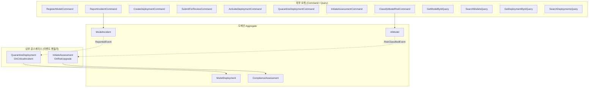
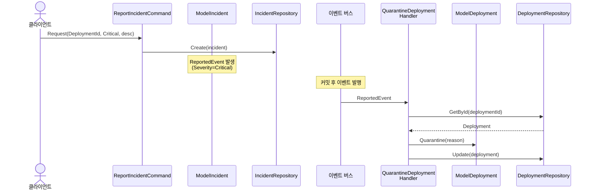
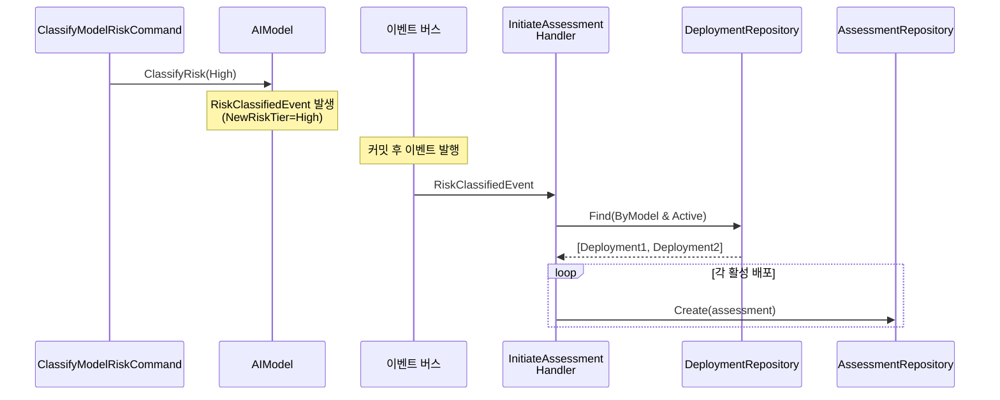

## 배경

[도메인 비즈니스 요구사항](../domain/00-business-requirements/)에서 정의한 비즈니스 규칙은 '무엇이 허용되고 무엇이 거부되는가'에 집중합니다. 이제 사용자 요청이 들어왔을 때 **어떤 순서로 처리하고, 어디서 검증하며, 누구에게 위임하는가를** 정의해야 합니다.

Application 레이어는 도메인 로직을 직접 수행하지 않습니다. 사용자의 요청을 받아 입력을 검증하고, 도메인 객체에 작업을 위임하며, 결과를 반환하는 얇은 조율 계층입니다.

## 워크플로우 전체 구조

Application 레이어의 워크플로우는 두 가지 트리거로 시작됩니다. 외부 요청(Command/Query)에 의한 흐름과 도메인 이벤트에 의한 내부 반응형 흐름입니다.



## 워크플로우 규칙

### 1. AI 모델 관리

- 모델명, 버전, 목적을 입력하여 모델을 등록한다
- 모든 입력 값은 동시에 검증하여 오류를 한번에 반환한다
- 목적 키워드 기반으로 위험 등급을 자동 분류한다 (RiskClassificationService)
- 모델의 위험 등급을 수동으로 재분류할 수 있다

### 2. 배포 관리

- 모델 ID, 엔드포인트 URL, 환경, 드리프트 임계값을 입력하여 배포를 생성한다
- 모든 입력 값은 동시에 검증하여 오류를 한번에 반환한다
- 모델 존재를 확인한 뒤 배포를 생성한다
- 배포를 검토를 위해 제출할 수 있다 -- 적격성 검증(금지 등급, 컴플라이언스, 인시던트)을 먼저 수행한다
- 컴플라이언스 평가 통과 확인 후 배포를 활성화할 수 있다
- 배포를 격리할 수 있으며, 격리 사유를 기록한다

### 3. 컴플라이언스 평가

- 모델 ID, 배포 ID를 입력하여 평가를 개시한다
- 모델과 배포의 존재를 확인한 뒤, 위험 등급 기반으로 평가 기준을 자동 생성한다

### 4. 인시던트 관리

- 배포 ID, 심각도, 설명을 입력하여 인시던트를 보고한다
- 모든 입력 값은 동시에 검증하여 오류를 한번에 반환한다
- 배포 존재를 확인한 뒤 인시던트를 생성한다

### 5. 도메인 이벤트 반응형 워크플로우

다음 워크플로우는 외부 요청이 아닌 도메인 이벤트에 의해 트리거됩니다.

- **Critical 인시던트 -> 배포 자동 격리:** Critical 또는 High 심각도 인시던트가 보고되면 해당 배포를 자동으로 격리한다
- **위험 등급 상향 -> 평가 자동 개시:** 모델의 위험 등급이 High/Unacceptable로 상향되면 활성 배포에 대해 컴플라이언스 평가를 자동 생성한다

#### Critical 인시던트 -> 배포 자동 격리 흐름



#### 위험 등급 상향 -> 평가 자동 개시 흐름



### 6. 데이터 조회

조회 요청은 상태를 변경하지 않으며, 데이터베이스에서 필요한 형태로 직접 가져옵니다.

- 모델을 ID로 상세 조회할 수 있다 (배포/평가/인시던트 포함)
- 모델 목록을 검색할 수 있으며 위험 등급 필터를 지원한다
- 배포를 ID로 상세 조회할 수 있다
- 배포 목록을 검색할 수 있으며 상태/환경 필터를 지원한다
- 평가를 ID로 상세 조회할 수 있다 (평가 기준 포함)
- 인시던트를 ID로 상세 조회할 수 있다
- 인시던트 목록을 검색할 수 있으며 심각도/상태 필터를 지원한다

### 7. 입력 검증 규칙

사용자 요청은 두 단계로 검증합니다.

- 형식 검증: FluentValidation + `MustSatisfyValidation`으로 VO 검증 규칙 재사용
- 도메인 검증: 도메인 규칙에 따른 의미적 문제를 검증한다
- 여러 필드를 동시에 검증하여 모든 오류를 한번에 반환한다

## 시나리오

### 정상 시나리오

1. **모델 등록** -- 3개 입력 값을 동시에 검증한 뒤, 위험 등급을 자동 분류하고 모델을 생성한다.
2. **위험 등급 재분류** -- 모델을 조회하고 위험 등급을 재분류한다. High로 상향되면 평가가 자동 개시된다.
3. **배포 생성** -- 4개 입력 값을 동시에 검증한 뒤, 모델 존재를 확인하고 배포를 생성한다.
4. **배포 검토 제출** -- 적격성 검증(금지 등급, 컴플라이언스, 인시던트)을 수행한 뒤 검토를 제출한다.
5. **배포 활성화** -- 평가 통과를 확인한 뒤 배포를 활성화한다.
6. **인시던트 보고 + 자동 격리** -- 인시던트를 생성하면 Critical/High 심각도 시 배포가 자동 격리된다.

### 거부 시나리오

7. **다중 검증 실패** -- 여러 입력 값이 동시에 잘못되면 모든 오류를 한번에 반환한다.
8. **금지 모델 배포** -- Unacceptable 위험 등급의 모델은 배포 검토 제출이 거부된다.
9. **미통과 컴플라이언스** -- High 위험 등급에 통과된 평가가 없으면 배포가 거부된다.
10. **미해결 인시던트** -- 미해결 인시던트가 있는 모델은 배포 검토 제출이 거부된다.
11. **잘못된 상태 전이** -- Draft에서 Active로 직접 전이를 시도하면 거부된다.

### 핵심 수락 기준

#### 모델 등록 (RegisterModelCommand)

**정상:**
```
Given: 유효한 모델명("GPT-Classifier"), SemVer 버전("1.0.0"), 목적("hiring decision support")
When:  AI 거버넌스 관리자가 모델을 등록한다
Then:  모델이 생성되고 위험 등급이 High로 자동 분류되며 ModelId가 반환된다
```

**거부:**
```
Given: 빈 모델명(""), 잘못된 버전("abc")
When:  AI 거버넌스 관리자가 모델을 등록한다
Then:  두 오류(ModelName 빈 문자열, ModelVersion SemVer 위반)가 동시에 반환된다
```

#### 배포 검토 제출 (SubmitDeploymentForReviewCommand)

**거부 (금지 등급):**
```
Given: Unacceptable 위험 등급 모델을 참조하는 Draft 배포가 존재한다
When:  AI 거버넌스 관리자가 검토를 제출한다
Then:  ProhibitedModel 오류가 반환되고 배포 상태는 Draft를 유지한다
```

#### 인시던트 보고 + 자동 격리 (ReportIncidentCommand + EventHandler)

**정상:**
```
Given: Active 상태의 배포가 존재한다
When:  컴플라이언스 담당자가 Critical 심각도 인시던트를 보고한다
Then:  인시던트가 Reported 상태로 생성되고, QuarantineDeploymentOnCriticalIncidentHandler가
       배포를 자동 격리하여 Quarantined 상태로 전이한다
```

## 존재해서는 안 되는 상태

- 도메인 검증을 거치지 않고 생성된 도메인 객체
- 형식 검증 없이 워크플로우에 진입한 요청
- 상태 변경 요청에서 조회 전용 결과를 반환하는 경로 혼재
- 외부 구현체에 대한 직접 의존이 워크플로우에 침투한 상태

다음 단계에서는 이 워크플로우 규칙을 분석하여 Use Case와 포트를 식별하고, [타입 설계 의사결정](./01-type-design-decisions/)을 도출합니다.
