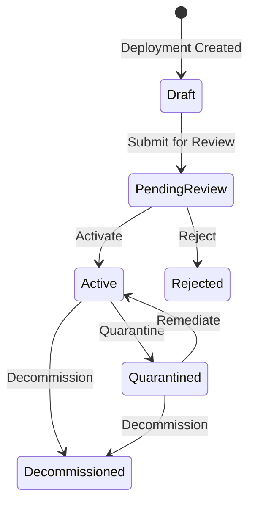
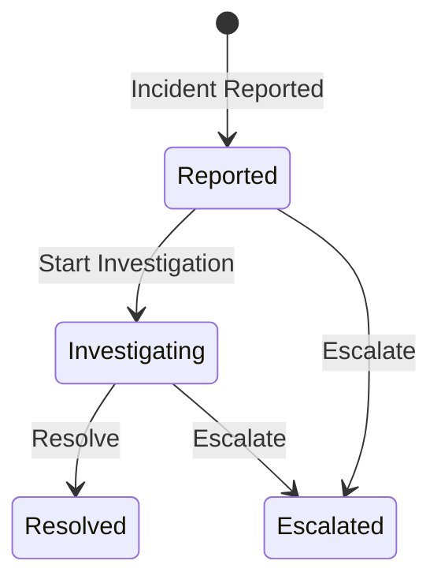
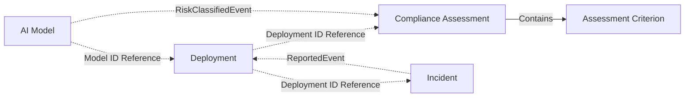
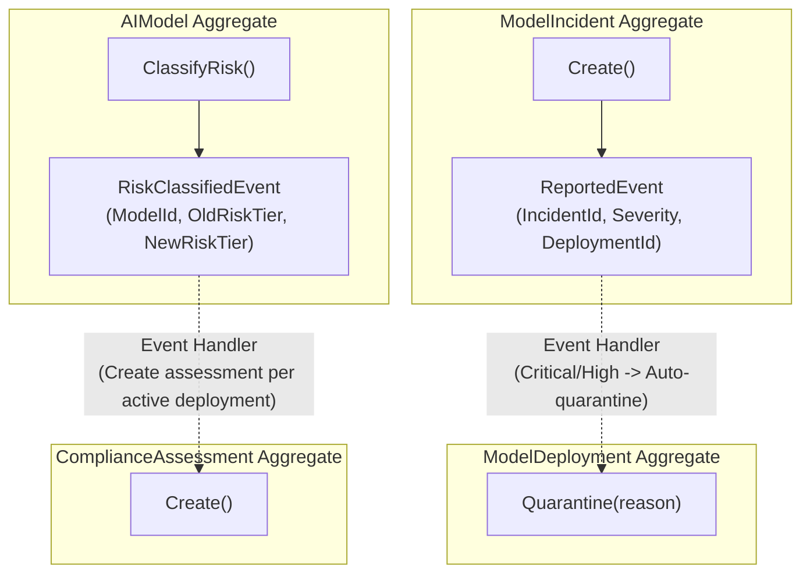

## Background

This document elaborates on the domain business rules for the EU AI Act-based AI Model Governance Platform defined in the [Project Requirements Specification](../00-project-spec/). This is the first step of the domain track in the functorium-develop 7-step workflow.

The EU AI Act (enacted in 2024, fully enforced in 2026) classifies AI systems by risk level and mandates conformity assessments, post-deployment monitoring, and incident reporting for high-risk AI. Organizations must manage the entire lifecycle of AI models -- from model registration, risk classification, deployment approval, compliance assessment, to incident response.

This system automates AI model governance within a single bounded context. Model registration and risk tier classification, deployment lifecycle management, compliance assessment, and incident management with automatic quarantine are the core operations.

## Domain Terminology

This section defines the key terms used in this domain. The same word may carry a different meaning in everyday usage versus within the domain, so the entire team uses this glossary as a shared Ubiquitous Language.

| English | Definition |
|---------|------------|
| AIModel | An AI/ML model registered and subject to governance |
| ModelName | Name of the AI model (100 characters or fewer) |
| ModelVersion | Model version in SemVer format |
| ModelPurpose | Description of the model's intended use (500 characters or fewer) |
| RiskTier | EU AI Act-based 4-level classification: Minimal, Limited, High, Unacceptable |
| ModelDeployment | A deployment instance of an AI model in a production environment |
| DeploymentStatus | Current status of the deployment (Draft, PendingReview, Active, Quarantined, Decommissioned, Rejected) |
| DeploymentEnvironment | Target deployment environment: Staging, Production |
| EndpointUrl | Service endpoint of the deployed model |
| DriftThreshold | Model performance drift detection threshold (0.0~1.0) |
| ComplianceAssessment | Regulatory compliance assessment for a deployment |
| AssessmentCriterion | Individual criterion item of a compliance assessment |
| AssessmentScore | Composite assessment score in range 0~100; passing score is 70 or above |
| AssessmentStatus | Assessment progress status (Initiated, InProgress, Passed, Failed, RequiresRemediation) |
| CriterionResult | Individual criterion evaluation result: Pass, Fail, NotApplicable |
| ModelIncident | Accident/issue report related to an AI model |
| IncidentSeverity | Critical, High, Medium, Low |
| IncidentStatus | Incident progress status (Reported, Investigating, Resolved, Escalated) |
| IncidentDescription | Detailed description of the incident (2000 characters or fewer) |
| ResolutionNote | Incident resolution record (2000 characters or fewer) |
| RiskClassificationService | Risk tier classification based on model purpose keywords |
| DeploymentEligibilityService | Cross-Aggregate eligibility verification before deployment |

## Business Rules

### 1. AI Model Management

AI models are the core unit of governance targets, with a lifecycle spanning registration and risk classification.

- A model has a model name, version, purpose, and risk tier
- Model name must be 100 characters or fewer
- Model version must be in SemVer format (e.g., `1.0.0`, `2.1.3-beta`)
- Model purpose must be 500 characters or fewer
- Risk tier is classified into 4 EU AI Act-based levels: Minimal, Limited, High, Unacceptable
- Automatic risk tier classification based on model purpose keywords is supported
  - "social scoring", "real-time surveillance" -> Unacceptable
  - "hiring", "credit", "medical", "biometric" -> High
  - "sentiment", "recommendation", "emotion" -> Limited
  - All others -> Minimal
- A model's risk tier can be reclassified
- A model can be archived (soft delete), and archived models cannot be modified
- An archived model can be restored
- Archive and restore operations are idempotent

### 2. Deployment Lifecycle Management

Deployments are production environment instances of AI models and follow strict state transition rules.

- A deployment has a model, endpoint URL, deployment environment, and drift threshold
- Endpoint URL must be a valid HTTP/HTTPS URL
- Deployment environment is either Staging or Production
- Drift threshold must be in the range 0.0~1.0
- A deployment starts in Draft status
- Health checks can be recorded

A deployment goes through the following states:

- Draft can transition to PendingReview
- PendingReview can transition to Active or Rejected
- Active can transition to Quarantined or Decommissioned
- Quarantined can transition to Active (remediate) or Decommissioned
- Decommissioned and Rejected are terminal states

### 3. Compliance Assessment

Compliance assessments verify regulatory compliance for deployments. Assessment criteria are automatically generated based on the risk tier.

- An assessment is created based on a model, deployment, and risk tier
- Default assessment criteria of 3: Data Governance, Technical Documentation, Security Review
- For High or Unacceptable tiers, an additional 3: Human Oversight, Bias Assessment, Transparency
- For Unacceptable tier, an additional 1: Prohibition Review
- Each assessment criterion can be evaluated as Pass, Fail, or NotApplicable
- All criteria must be evaluated before the assessment can be completed
- The composite score is automatically calculated as the Pass ratio among applicable criteria (0~100)
- 70 or above is Passed, 40~69 is RequiresRemediation, below 40 is Failed
- Assessment status: Initiated -> InProgress -> Passed/Failed/RequiresRemediation

### 4. Incident Management

Incidents manage accident/issue reports related to AI models.

- An incident has a deployment, model, severity, and description
- Incident description must be 2000 characters or fewer
- Incident severity is one of Critical, High, Medium, or Low
- Critical or High severity incidents trigger automatic deployment quarantine
- An incident can be started for investigation (Reported -> Investigating)
- An incident can be resolved (Investigating -> Resolved), with a resolution note recorded
- An incident can be escalated (Reported/Investigating -> Escalated)
- Resolved and Escalated are terminal states

Incidents go through the following states:

### 5. Cross-Domain Rules

The following rules cannot be resolved within a single business area and require data from multiple areas.

- **Risk Tier Classification:** Risk tier is determined by analyzing model purpose keywords (RiskClassificationService)
- **Deployment Eligibility Verification:** When submitting a deployment for review, the following 3 checks are performed sequentially (DeploymentEligibilityService)
  - Check if the risk tier is prohibited (Unacceptable)
  - For High/Unacceptable tiers, verify existence of a passed compliance assessment
  - Verify absence of unresolved incidents

## Relationships Between Business Areas

- An AI model is the subject of deployment ownership
- A deployment is the subject of compliance assessment
- A compliance assessment contains assessment criteria
- Incidents are reported against deployments
- When a risk tier is upgraded, compliance assessments are automatically initiated via domain events
- When Critical/High incidents are reported, deployments are automatically quarantined via domain events

### Domain Event-Based Inter-Aggregate Coordination

## Scenarios

The following scenarios describe concretely how business requirements work in practice.

### Success Scenarios

1. **Model Registration** -- Register a model with name, version, and purpose. Risk tier is automatically classified based on purpose keywords.
2. **Risk Tier Reclassification** -- Manually reclassify a model's risk tier. When upgraded, compliance assessments are automatically initiated.
3. **Deployment Creation** -- Create a deployment with model, endpoint URL, environment, and drift threshold. Starts in Draft status.
4. **Deployment Review Submission** -- Verify deployment eligibility (prohibited tier, compliance, unresolved incidents), then submit for review.
5. **Deployment Activation** -- Verify compliance assessment passing, then activate the deployment.
6. **Compliance Assessment** -- Generate assessment criteria based on risk tier, evaluate each criterion, then complete after all criteria are evaluated.
7. **Incident Reporting** -- Report an incident against a deployment. On Critical/High severity, the deployment is automatically quarantined.
8. **Incident Resolution** -- Start an investigation and resolve the incident with a resolution note.
9. **Deployment Quarantine and Remediation** -- Quarantine a problematic deployment and remediate after the issue is resolved.
10. **Model Archive and Restore** -- Archive a model and restore it when needed.

### Rejection Scenarios

11. **Invalid Deployment Status Transition** -- Attempting to transition directly from Draft to Active is rejected.
12. **Prohibited Model Deployment** -- Deployment review submission for an Unacceptable risk tier model is rejected.
13. **Failed Compliance** -- Deployment is rejected if a High risk tier model has no passed compliance assessment.
14. **Unresolved Incidents** -- Deployment review submission is rejected if there are unresolved incidents for the model.
15. **Incomplete Assessment Completion** -- Completing an assessment without all criteria evaluated is rejected.
16. **Modifying Archived Model** -- Modifying information of an archived model is rejected.

## States That Must Never Exist

The following are states that must never occur in the system. If such a state exists, it means a rule has been broken, and the type system and domain logic prevent it structurally.

- A deployment that transitioned directly from Draft to Active
- An Unacceptable tier model with active deployments
- A completed compliance assessment without all criteria evaluated
- A reported Critical incident with the deployment not quarantined
- A modification occurring on an archived model
- A drift threshold that is negative or exceeds 1.0
- A model version not in SemVer format

In the next step, these business rules are analyzed from a DDD perspective to identify independent consistency boundaries (Aggregates) and [classify invariants](../01-type-design-decisions/).
