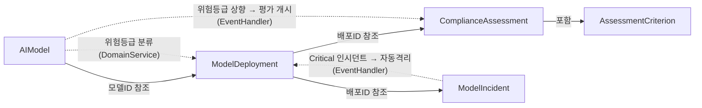

## 배경

EU AI Act(2024년 발효, 2026년 전면 시행)는 AI 시스템을 위험 등급별로 분류하고, 고위험 AI에 대해 적합성 평가, 배포 후 모니터링, 인시던트 보고를 의무화합니다. 이 샘플은 EU AI Act의 핵심 요구사항을 단일 바운디드 컨텍스트 내에서 DDD 전술적 패턴과 Functorium 프레임워크로 구현합니다.

## Functorium DDD 샘플 시리즈

| 샘플 | 레이어 | 도메인 | 핵심 학습 |
|------|--------|--------|----------|
| [designing-with-types](../designing-with-types/) | Domain | 연락처 관리 | Value Object, Aggregate Root |
| [ecommerce-ddd](../ecommerce-ddd/) | Domain + Application | 전자상거래 | CQRS, FinT LINQ, Apply 패턴 |
| **ai-model-governance** (본 샘플) | **Domain + Application + Adapter** | AI 모델 거버넌스 | **IO 고급 기능, 풀스택 DDD** |

본 샘플은 세 번째이자 마지막 샘플로, Domain/Application 레이어에서 다룬 패턴 위에 Adapter 레이어의 LanguageExt IO 고급 기능(Retry, Timeout, Fork, Bracket)을 추가합니다.

## 적용된 DDD 빌딩 블록

| DDD 개념 | Functorium 타입 | 적용 |
|----------|----------------|------|
| Value Object | `SimpleValueObject<T>`, `ComparableSimpleValueObject<T>` | ModelName, ModelVersion, EndpointUrl, DriftThreshold 등 |
| Smart Enum | `SimpleValueObject<string>` + `HashMap` | RiskTier, DeploymentStatus, IncidentStatus, AssessmentStatus 등 |
| Entity | `Entity<TId>` | AssessmentCriterion (child entity) |
| Aggregate Root | `AggregateRoot<TId>` | AIModel, ModelDeployment, ComplianceAssessment, ModelIncident |
| Domain Event | `DomainEvent` | 18종 (Registered, Quarantined, Reported 등) |
| Domain Error | `DomainErrorType.Custom` | InvalidStatusTransition, AlreadyDeleted 등 |
| Specification | `ExpressionSpecification<T>` | 12종 (ModelNameSpec, DeploymentActiveSpec 등) |
| Domain Service | `IDomainService` | RiskClassificationService, DeploymentEligibilityService |
| Repository | `IRepository<T, TId>` | 4개 Repository 인터페이스 |

## 적용된 Application 패턴

| 패턴 | 구현 | 적용 |
|------|------|------|
| CQRS | `ICommandUsecase` / `IQueryUsecase` | 8 Commands, 7 Queries |
| Apply Pattern | `tuple.ApplyT()` | VO 병렬 검증 합성 |
| FinT LINQ | `from...in` 체이닝 | 비동기 에러 전파 |
| Port/Adapter | `IQueryPort`, `IRepository` | 읽기/쓰기 분리 |
| Event Handler | `IDomainEventHandler<T>` | 2 Event Handlers |
| FluentValidation | `MustSatisfyValidation` | 구문 + 의미 이중 검증 |

## 적용된 Adapter 패턴 (IO 고급 기능)

| IO 패턴 | 구현 클래스 | 용도 |
|---------|------------|------|
| Timeout + Catch | `ModelHealthCheckService` | 헬스 체크 타임아웃 처리 |
| Retry + Schedule | `ModelMonitoringService` | 외부 API 재시도 (지수 백오프) |
| Fork + awaitAll | `ParallelComplianceCheckService` | 병렬 컴플라이언스 체크 |
| Bracket | `ModelRegistryService` | 리소스 수명 관리 (세션) |

## 세 트랙 여정표

이 샘플은 Domain, Application, Adapter 세 트랙으로 나누어, 각 4단계를 거칩니다.

| 단계 | Domain 레이어 | Application 레이어 | Adapter 레이어 |
|------|--------------|-------------------|---------------|
| 0. 요구사항 | [도메인 비즈니스 요구사항](./domain/00-business-requirements/) | [애플리케이션 비즈니스 요구사항](./application/00-business-requirements/) | [어댑터 기술 요구사항](./adapter/00-business-requirements/) |
| 1. 설계 | [도메인 타입 설계 의사결정](./domain/01-type-design-decisions/) | [애플리케이션 타입 설계 의사결정](./application/01-type-design-decisions/) | [어댑터 타입 설계 의사결정](./adapter/01-type-design-decisions/) |
| 2. 코드 | [도메인 코드 설계](./domain/02-code-design/) | [애플리케이션 코드 설계](./application/02-code-design/) | [어댑터 코드 설계](./adapter/02-code-design/) |
| 3. 결과 | [도메인 구현 결과](./domain/03-implementation-results/) | [애플리케이션 구현 결과](./application/03-implementation-results/) | [어댑터 구현 결과](./adapter/03-implementation-results/) |

## 프로젝트 구조

```
samples/ai-model-governance/
├── ai-model-governance.slnx
├── domain/                               # 도메인 레이어 문서
├── application/                          # 애플리케이션 레이어 문서
├── adapter/                              # 어댑터 레이어 문서
├── Src/
│   ├── AiGovernance.Domain/
│   │   ├── SharedModels/Services/        # Domain Services
│   │   └── AggregateRoots/
│   │       ├── Models/                   # AIModel, VOs, Specs
│   │       ├── Deployments/              # ModelDeployment, VOs, Specs
│   │       ├── Assessments/              # ComplianceAssessment, AssessmentCriterion, VOs, Specs
│   │       └── Incidents/                # ModelIncident, VOs, Specs
│   ├── AiGovernance.Application/
│   │   └── Usecases/
│   │       ├── Models/                   # Commands, Queries, Ports
│   │       ├── Deployments/              # Commands, Queries, Ports
│   │       ├── Assessments/              # Commands, Queries, EventHandlers
│   │       └── Incidents/                # Commands, Queries, EventHandlers
│   ├── AiGovernance.Adapters.Persistence/
│   │   ├── InMemory/                     # InMemory Repository 구현
│   │   └── Registrations/                # DI 등록
│   ├── AiGovernance.Adapters.Infrastructure/
│   │   ├── ExternalServices/             # IO 고급 기능 데모 (4종)
│   │   └── Registrations/                # DI 등록
│   ├── AiGovernance.Adapters.Presentation/
│   │   ├── Endpoints/                    # FastEndpoints (15종)
│   │   └── Registrations/                # DI 등록
│   └── AiGovernance/                     # Host (Program.cs)
└── Tests/
    ├── AiGovernance.Tests.Unit/          # 단위 테스트
    └── AiGovernance.Tests.Integration/   # 통합 테스트
```

## 실행 방법

```bash
# 빌드
dotnet build Docs.Site/src/content/docs/samples/ai-model-governance/ai-model-governance.slnx

# 테스트
dotnet test --solution Docs.Site/src/content/docs/samples/ai-model-governance/ai-model-governance.slnx
```

## Aggregate 관계 다이어그램


