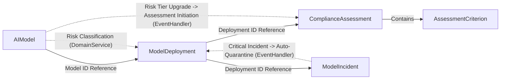

## Background

The EU AI Act (enacted in 2024, fully enforced in 2026) classifies AI systems by risk level and mandates conformity assessments, post-deployment monitoring, and incident reporting for high-risk AI. This example implements the core requirements of the EU AI Act within a single bounded context using DDD tactical patterns and the Functorium framework.

## Functorium DDD Example Series

| Example | Layer | Domain | Key Learning |
|---------|-------|--------|-------------|
| [designing-with-types](../designing-with-types/) | Domain | Contact Management | Value Object, Aggregate Root |
| [ecommerce-ddd](../ecommerce-ddd/) | Domain + Application | E-Commerce | CQRS, FinT LINQ, Apply Pattern |
| **ai-model-governance** (this example) | **Domain + Application + Adapter** | AI Model Governance | **Advanced IO Features, Observability, Full-stack DDD** |

This is the third and final example in the series, building on the patterns covered in the Domain/Application layers by adding Adapter layer LanguageExt IO advanced features (Retry, Timeout, Fork, Bracket) and OpenTelemetry 3-Pillar observability.

## functorium-develop 7-Step Workflow

This example follows the 7-step workflow of functorium-develop plugin v0.4.0.

| Step | Skill | Document | Description |
|------|-------|----------|-------------|
| 0 | project-spec | [Project Requirements Specification](./00-project-spec/) | PRD: KPIs, Ubiquitous Language, Aggregate Candidates, Acceptance Criteria |
| 1 | architecture-design | [Architecture Design](./01-architecture-design/) | Project Structure, DI Strategy, Observability Pipeline |
| 2-4 | domain-develop | [Domain Track](#domain-track) | VO, Aggregate, Domain Service, Specification |
| 2-4 | application-develop | [Application Track](#application-track) | CQRS UseCase, Port, Event Handler |
| 2-4 | adapter-develop | [Adapter Track](#adapter-track) | Repository, External Service, HTTP API |
| 5 | observability-develop | [Observability Track](#observability-track) | Dashboard, Alerts, ctx.* Propagation |
| 6 | test-develop | (Test code included) | 268 Unit Tests, Integration Tests |

## Applied DDD Building Blocks

| DDD Concept | Functorium Type | Application |
|-------------|----------------|-------------|
| Value Object | `SimpleValueObject<T>`, `ComparableSimpleValueObject<T>` | ModelName, ModelVersion, EndpointUrl, DriftThreshold, etc. |
| Smart Enum | `SimpleValueObject<string>` + `HashMap` | RiskTier, DeploymentStatus, IncidentStatus, AssessmentStatus, etc. |
| Entity | `Entity<TId>` | AssessmentCriterion (child entity) |
| Aggregate Root | `AggregateRoot<TId>` | AIModel, ModelDeployment, ComplianceAssessment, ModelIncident |
| Domain Event | `DomainEvent` | 18 types (Registered, Quarantined, Reported, etc.) |
| Domain Error | `DomainErrorType.Custom` | InvalidStatusTransition, AlreadyDeleted, etc. |
| Specification | `ExpressionSpecification<T>` | 12 types (ModelNameSpec, DeploymentActiveSpec, etc.) |
| Domain Service | `IDomainService` | RiskClassificationService, DeploymentEligibilityService |
| Repository | `IRepository<T, TId>` | 4 Repository Interfaces |

## Applied Application Patterns

| Pattern | Implementation | Application |
|---------|---------------|-------------|
| CQRS | `ICommandUsecase` / `IQueryUsecase` | 8 Commands, 7 Queries |
| Apply Pattern | `tuple.ApplyT()` | Parallel VO Validation Composition |
| FinT LINQ | `from...in` Chaining | Async Error Propagation |
| Port/Adapter | `IQueryPort`, `IRepository` | Read/Write Separation |
| Event Handler | `IDomainEventHandler<T>` | 2 Event Handlers |
| FluentValidation | `MustSatisfyValidation` | Syntactic + Semantic Dual Validation |

## Applied Adapter Patterns (Advanced IO Features)

| IO Pattern | Implementation Class | Purpose |
|-----------|---------------------|---------|
| Timeout + Catch | `ModelHealthCheckService` | Health Check Timeout Handling |
| Retry + Schedule | `ModelMonitoringService` | External API Retry (Exponential Backoff) |
| Fork + awaitAll | `ParallelComplianceCheckService` | Parallel Compliance Checks |
| Bracket | `ModelRegistryService` | Resource Lifecycle Management (Session) |

## Applied Observability Patterns

| Pattern | Implementation | Application |
|---------|---------------|-------------|
| Observable Port | `[GenerateObservablePort]` + Source Generator | Repository 10, Query 5, External Service 4 |
| Pipeline Middleware | `UseObservability()` + Explicit Opt-in | Metrics, Tracing, CtxEnricher, Logging, Validation, Exception |
| DomainEvent Observability | `ObservableDomainEventNotificationPublisher` | Observing Publication/Handling of 18 DomainEvents |
| ctx.* Propagation | `[CtxTarget]` + CtxPillar | MetricsTag(2), MetricsValue(1), Default(8+), Logging(2) |

## Domain Track

| Step | Document | Description |
|------|----------|-------------|
| 0. Requirements | [Domain Business Requirements](./domain/00-business-requirements/) | Business Rules, State Transitions, Cross-Domain Rules |
| 1. Design | [Domain Type Design Decisions](./domain/01-type-design-decisions/) | Aggregate Identification, Invariant Classification, Functorium Pattern Mapping |
| 2. Code | [Domain Code Design](./domain/02-code-design/) | VO, Smart Enum, Aggregate, Domain Service Code |
| 3. Results | [Domain Implementation Results](./domain/03-implementation-results/) | Type Count Summary, Folder Structure, Test Status |

## Application Track

| Step | Document | Description |
|------|----------|-------------|
| 0. Requirements | [Application Business Requirements](./application/00-business-requirements/) | Workflow Rules, Event-Reactive Flows |
| 1. Design | [Application Type Design Decisions](./application/01-type-design-decisions/) | Command/Query/Port Identification, ApplyT, FinT Composition |
| 2. Code | [Application Code Design](./application/02-code-design/) | Command Handler, Event Handler Code |
| 3. Results | [Application Implementation Results](./application/03-implementation-results/) | UseCase/Port Summary, Applied Pattern Overview |

## Adapter Track

| Step | Document | Description |
|------|----------|-------------|
| 0. Requirements | [Adapter Technical Requirements](./adapter/00-business-requirements/) | Persistence, External Services, HTTP API, Observability Requirements |
| 1. Design | [Adapter Type Design Decisions](./adapter/01-type-design-decisions/) | IO Pattern Selection Rationale, Observable Port Design |
| 2. Code | [Adapter Code Design](./adapter/02-code-design/) | Advanced IO Patterns, DI Registration Code |
| 3. Results | [Adapter Implementation Results](./adapter/03-implementation-results/) | Endpoints, Implementations, Test Status |

## Observability Track

| Step | Document | Description |
|------|----------|-------------|
| 0. Requirements | [Observability Business Requirements](./observability/00-business-requirements/) | 3-Pillar Requirements, SLO Targets |
| 1. Design | [Observability Type Design Decisions](./observability/01-type-design-decisions/) | KPI-Metric Mapping, ctx.* Propagation Strategy |
| 2. Code | [Observability Code Design](./observability/02-code-design/) | L1/L2 Dashboards, Alert Rules, PromQL |
| 3. Results | [Observability Implementation Results](./observability/03-implementation-results/) | Observable Port, Pipeline, IO Pattern Status |

## Project Structure

```
samples/ai-model-governance/
├── AiModelGovernance.slnx                        # Solution file (8 projects)
├── 00-project-spec.md                            # Project requirements specification
├── 01-architecture-design.md                     # Architecture design
├── domain/                                       # Domain layer docs (4)
├── application/                                  # Application layer docs (4)
├── adapter/                                      # Adapter layer docs (4)
├── observability/                                # Observability docs (4)
├── Src/
│   ├── AiGovernance.Domain/
│   │   ├── SharedModels/Services/                # Domain Services
│   │   └── AggregateRoots/
│   │       ├── Models/                           # AIModel, VOs, Specs
│   │       ├── Deployments/                      # ModelDeployment, VOs, Specs
│   │       ├── Assessments/                      # ComplianceAssessment, AssessmentCriterion, VOs, Specs
│   │       └── Incidents/                        # ModelIncident, VOs, Specs
│   ├── AiGovernance.Application/
│   │   └── Usecases/
│   │       ├── Models/                           # Commands, Queries, Ports
│   │       ├── Deployments/                      # Commands, Queries, Ports
│   │       ├── Assessments/                      # Commands, Queries, EventHandlers
│   │       └── Incidents/                        # Commands, Queries, EventHandlers
│   ├── AiGovernance.Adapters.Persistence/
│   │   ├── Models/                               # Repository, Query (InMemory + EfCore)
│   │   ├── Deployments/
│   │   ├── Assessments/
│   │   ├── Incidents/
│   │   └── Registrations/                        # DI Registration
│   ├── AiGovernance.Adapters.Infrastructure/
│   │   ├── ExternalServices/                     # Advanced IO Feature Demos (4 types)
│   │   └── Registrations/                        # DI Registration
│   ├── AiGovernance.Adapters.Presentation/
│   │   ├── Endpoints/                            # FastEndpoints (15 types)
│   │   └── Registrations/                        # DI Registration
│   └── AiGovernance/                             # Host (Program.cs)
└── Tests/
    ├── AiGovernance.Tests.Unit/                  # Unit Tests
    └── AiGovernance.Tests.Integration/           # Integration Tests
```

## How to Run

```bash
# Build
dotnet build Docs.Site/src/content/docs/samples/ai-model-governance/AiModelGovernance.slnx

# Test (268 tests)
dotnet test --solution Docs.Site/src/content/docs/samples/ai-model-governance/AiModelGovernance.slnx
```

## Aggregate Relationship Diagram



## Summary Statistics

| Item | Count |
|------|-------|
| Aggregate Root | 4 |
| Value Object | 16 (String 6, Comparable 2, Smart Enum 8) |
| Domain Service | 2 |
| Specification | 12 |
| Domain Event | 18 |
| Command | 8 |
| Query | 7 |
| Event Handler | 2 |
| HTTP Endpoint | 15 |
| Observable Port | 19 |
| Advanced IO Pattern | 4 (Timeout, Retry, Fork, Bracket) |
| **Total Tests** | **268** |
