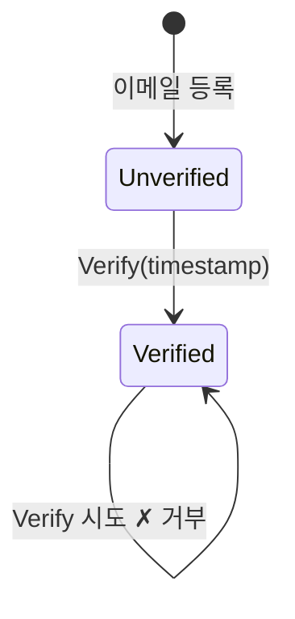
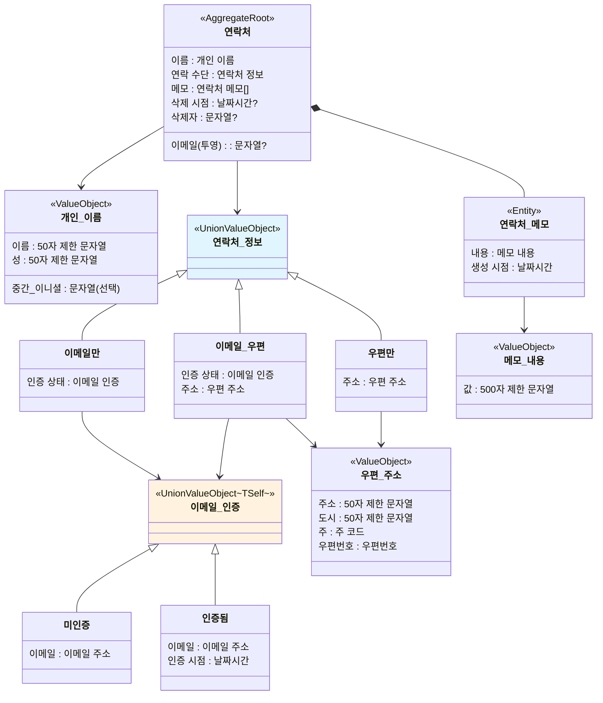

## 개요

비즈니스 규칙을 소프트웨어로 보장하려면, 규칙을 **불변식(invariant)으로** 분류하고 각 유형에 맞는 타입 전략을 선택해야 합니다. 불변식은 "시스템이 어떤 시점에서든 반드시 참이어야 하는 조건"이며, 이를 타입으로 인코딩하면 컴파일러가 규칙 위반을 방지합니다.

## 단일 값 불변식

개별 필드가 항상 유효한 값만 가져야 하는 제약입니다.

**비즈니스 규칙:**
- "이름은 50자 이하"
- "이메일은 유효한 형식"
- "주 코드는 2자리 대문자 알파벳"
- "우편번호는 5자리 숫자"
- "메모 내용은 500자 이하"

**Naive 구현의 문제:** 모든 필드가 `string`이므로 아무 값이나 들어갑니다. 빈 문자열, 100자 이름, 숫자가 아닌 우편번호 — 형식 위반을 런타임까지 알 수 없습니다. 더 심각한 문제로, 이름과 이메일이 같은 `string`이라 실수로 바꿔 넣어도 컴파일러가 침묵합니다.

**설계 의사결정: 생성 시 검증하고 이후 불변으로 보장합니다.** 제약된 타입(constrained type)을 도입하여 유효하지 않은 값은 생성 자체가 불가능하게 만듭니다. 한번 생성된 값은 변경할 수 없으므로, 이후 코드에서 유효성을 다시 확인할 필요가 없습니다. `null` 입력도 타입 수준에서 차단하고, 정규화(trim, 소문자 변환)를 생성 시점에 적용합니다.

**결과:**

| 비즈니스 규칙 | 결과 타입 | 정규화 |
|-------------|----------|--------|
| 이름/성 50자 제한 | String50 | Trim |
| 이메일 형식 | EmailAddress | Trim + 소문자 |
| 주 코드 2자리 대문자 | StateCode | — |
| 우편번호 5자리 | ZipCode | — |
| 메모 500자 제한 | NoteContent | Trim |

## 구조 불변식

필드 조합이 항상 유효한 상태만 나타내야 하는 제약입니다.

**비즈니스 규칙:**
- "최소 하나의 연락 수단 필수"
- "이름, 성, 중간 이니셜은 항상 하나의 개인 이름으로 묶인다"
- "주소, 도시, 주, 우편번호는 항상 하나의 우편 주소로 묶인다"

**Naive 구현의 문제:** 이메일과 주소가 별개의 nullable 필드입니다. 둘 다 null이면 연락 수단이 없는 연락처가 만들어집니다 — 비즈니스 규칙 위반이지만 타입이 이를 허용합니다.

**설계 의사결정: 허용된 조합만 표현 가능한 구조를 만듭니다.** 두 가지 전략을 사용합니다.

- **원자적 그룹화** — 항상 함께 다니는 필드를 하나의 타입으로 묶습니다. 이름의 구성 요소(이름, 성, 중간 이니셜)가 따로 떠다니지 않게, 주소의 구성 요소(주소, 도시, 주, 우편번호)가 불완전한 상태로 존재하지 않게 합니다.
- **Union type으로 허용 조합 열거** — 연락 수단에 대해 "이메일만", "우편만", "둘 다" 세 가지 케이스만 정의합니다. "없음" 케이스가 존재하지 않으므로 연락 수단 없는 상태가 구조적으로 불가능합니다.

**결과:**

| 비즈니스 규칙 | 결과 타입 | 전략 |
|-------------|----------|------|
| 이름 구성요소는 항상 함께 | PersonalName | 원자적 그룹화 |
| 주소 구성요소는 항상 함께 | PostalAddress | 원자적 그룹화 |
| 최소 하나의 연락 수단 필수 | ContactInfo (EmailOnly / PostalOnly / EmailAndPostal) | union type |

## 상태 전이 불변식

시간에 따른 변화가 정해진 규칙만 따라야 하는 제약입니다.

**비즈니스 규칙:**
- "미인증 이메일만 인증할 수 있다"
- "인증은 단방향이다 — 되돌릴 수 없다"
- "인증 시점이 기록되어야 한다"

**Naive 구현의 문제:** `bool IsEmailVerified`는 아무 때나 `true`에서 `false`로, `false`에서 `true`로 전환할 수 있습니다. 인증 시점은 별도 필드로 관리해야 하는데, `IsEmailVerified`가 `false`인데 인증 시점이 존재하는 모순 상태가 가능합니다.

**설계 의사결정: 상태별 데이터를 분리하고 전이 함수로 규칙을 강제합니다.** 각 상태가 자신에게 필요한 데이터만 가지도록 union type으로 분리합니다. 미인증 상태는 이메일만, 인증 상태는 이메일과 인증 시점을 가집니다. 상태 간 이동은 전이 함수만 허용하며, 이 함수가 규칙을 검증합니다.

**결과:**
- EmailVerificationState (Unverified / Verified) + Verify 전이 함수
- Unverified → Verified만 허용, Verified → Verified 시도 시 거부

## 수명 불변식

Aggregate의 생성, 수정, 삭제 생명주기가 규칙을 따라야 하는 제약입니다.

**비즈니스 규칙:**
- "이름을 변경할 수 있다"
- "논리 삭제/복원이 가능하며, 삭제자와 시점이 기록된다"
- "삭제된 연락처에는 행위가 차단된다"
- "삭제/복원은 멱등하다"

**Naive 구현의 문제:** 삭제 상태를 `bool IsDeleted`로 관리하면 삭제된 객체에 행위를 호출해도 막을 방법이 없습니다. 각 메서드마다 `if (IsDeleted)` 검사를 넣어야 하며, 하나라도 빠뜨리면 삭제된 연락처가 수정됩니다.

**설계 의사결정: Aggregate 경계를 설정하고 모든 행위 메서드에 삭제 가드를 적용합니다.** `Contact`를 Aggregate Root로 지정하여 모든 상태 변경이 단일 진입점을 통과하게 합니다. 실패 가능한 행위는 `Fin<Unit>`을 반환하여 삭제 상태를 명시적으로 표현하고, 삭제/복원처럼 항상 성공하는 행위는 멱등으로 설계합니다.

**결과:**
- Contact: `AggregateRoot<ContactId>` + `IAuditable` + `ISoftDeletableWithUser`
- 이중 팩토리: `Create`(도메인 생성, 이벤트 발행) + `CreateFromValidated`(ORM 복원, 이벤트 없음)
- 모든 행위에 시간 주입 (`DateTime` 매개변수)

## 소유 불변식

Aggregate 내부의 자식 엔티티가 경계를 벗어나지 않아야 하는 제약입니다.

**비즈니스 규칙:**
- "연락처에 메모를 추가/제거할 수 있다"
- "메모는 독립적 식별자를 가진다"
- "삭제된 연락처에서 메모 관리가 차단된다"

**Naive 구현의 문제:** 메모를 독립 엔티티로 관리하면 Aggregate 경계 밖에서 직접 메모를 생성하거나 삭제할 수 있습니다. Aggregate의 불변식(삭제 가드, 이벤트 발행)을 우회하는 경로가 생깁니다.

**설계 의사결정: 자식 엔티티를 Aggregate 내부 private 컬렉션으로 관리합니다.** `ContactNote`를 `Entity<ContactNoteId>`로 모델링하되, 생성과 삭제는 반드시 `Contact`의 `AddNote`/`RemoveNote`를 통해서만 가능하게 합니다. 외부에는 `IReadOnlyList`만 노출합니다.

**결과:**
- ContactNote: `Entity<ContactNoteId>` (자식 엔티티)
- Contact가 private `List<ContactNote>` 관리, `IReadOnlyList<ContactNote>` 노출

## 교차 Aggregate 불변식

여러 Aggregate에 걸친 규칙을 검증해야 하는 제약입니다.

**비즈니스 규칙:**
- "동일 이메일 중복 등록 방지"
- "업데이트 시 자기 자신 제외"

**Naive 구현의 문제:** 단일 Aggregate 내부에서 다른 Aggregate의 상태를 직접 조회하면 Aggregate 경계가 무너집니다. Repository를 직접 호출하면 도메인 레이어가 인프라에 의존합니다.

**설계 의사결정: Domain Service와 Specification을 분리합니다.** `ContactEmailCheckService`는 Application Layer가 조회한 최소 데이터만 수신하여 도메인 로직(고유성 판별)을 수행합니다. `ContactEmailSpec`과 `ContactEmailUniqueSpec`은 `ExpressionSpecification<Contact>`으로 ORM에서 SQL로 변환 가능합니다.

**결과:**
- ContactEmailCheckService: `IDomainService`
- ContactEmailSpec, ContactEmailUniqueSpec: `ExpressionSpecification<Contact>`
- IContactRepository: `IRepository<Contact, ContactId>` + `Exists`

## 도메인 모델 구조

여섯 가지 불변식 전략을 결합한 최종 구조입니다.

## 불변식 종합표

| 불변식 유형 | 경계 | 전략 | 결과 타입 |
|-----------|------|------|----------|
| 단일 값 | 개별 필드 | 생성 시 검증 + 불변 | String50, EmailAddress, StateCode, ZipCode, NoteContent |
| 구조 (그룹화) | 연관 필드 묶음 | 원자적 그룹화 | PersonalName, PostalAddress |
| 구조 (조합) | 연락처 정보 | 허용 조합만 표현 가능한 union + Match/Switch 자동 생성 | ContactInfo : `UnionValueObject` |
| 상태 전이 | 이메일 인증 | 상태별 데이터 분리 + `TransitionFrom` 헬퍼 | EmailVerificationState : `UnionValueObject<TSelf>` |
| 수명 | Aggregate 전체 | Aggregate Root + 삭제 가드 + 이중 팩토리 | Contact |
| 소유 | 자식 엔티티 | private 컬렉션 + Aggregate 진입점 | ContactNote |
| 교차 Aggregate | 이메일 고유성 | Domain Service + Specification | ContactEmailCheckService, ContactEmailSpec |
