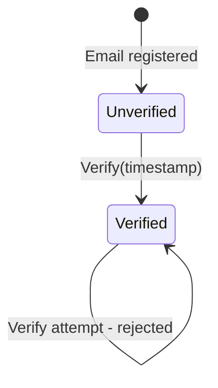
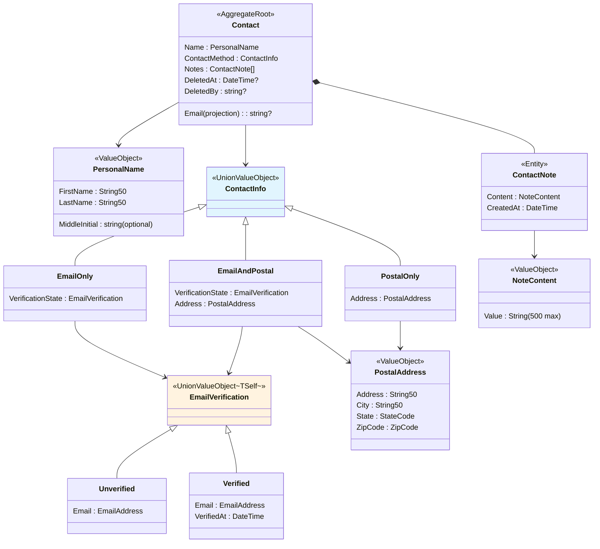

## Overview

Analyzes the rules defined in natural language from the [Business Requirements](./00-business-requirements/) from a DDD perspective. The first step is identifying independent consistency boundaries (Aggregates), the second step maps business terms to DDD tactical patterns, and the third step classifies the rules within each boundary as invariants.

## Aggregate Identification

Unlike domains such as the ecommerce-ddd example that are divided into multiple Aggregates, the contact management domain has **all business rules concentrated in a single consistency boundary (Contact)**.

Personal names, contact methods, email verification, and notes are all subordinate to a contact and cannot exist independently without one. Therefore, there is no reason to separate them into distinct Aggregates, and a single Aggregate Root (Contact) serves as the single entry point for all state changes.

The only exception is **email uniqueness validation**. This rule spans multiple Contact instances and cannot be guaranteed within a single Aggregate. This is resolved outside the Aggregate using a Domain Service + Specification.

| Business Topic | Location within Aggregate | Rationale |
|----------|------------------|----------|
| Data validity | Value Objects within Contact | Individual field constraints -> validated at creation |
| Contact method | ContactInfo within Contact | Core component of a contact -> subordinate to Contact |
| Email verification | EmailVerificationState within Contact | Email state is subordinate to a contact |
| Contact lifecycle management | Contact (AggregateRoot) | Consistency boundary for creation, modification, and deletion |
| Note management | ContactNote (child entity) within Contact | Managed only within the Aggregate boundary |
| Email uniqueness | Domain Service + Specification | Cross-Aggregate validation -> outside Contact |

## Domain Term Mapping

Maps business terms to DDD tactical patterns. This mapping serves as the foundation for subsequent invariant classification and code design.

| Business Term | DDD Pattern | Type | Role |
|-------------|---------|------|------|
| Contact | Aggregate Root | Contact | Single entry point for all state changes |
| Personal name | Value Object | PersonalName | Atomic grouping of first name, last name, and middle initial |
| Email address | Value Object | EmailAddress | Format validation + lowercase normalization |
| Postal address | Value Object | PostalAddress | Atomic grouping of address components |
| Contact method | Union Value Object | ContactInfo | Represents only 3 permitted combinations |
| Email verification | Union Value Object | EmailVerificationState | Unidirectional transition from unverified to verified |
| Note | Entity (child) | ContactNote | Subordinate to Contact, has independent identifier |
| Note content | Value Object | NoteContent | Validated to 500 characters or less |
| First/Last name | Value Object | String50 | String of 50 characters or less |
| State code | Value Object | StateCode | 2-digit uppercase alphabetic |
| Zip code | Value Object | ZipCode | 5-digit numeric |
| Email uniqueness check | Domain Service | ContactEmailCheckService | Cross-Aggregate email duplicate validation |
| Email lookup | Specification | ContactEmailSpec | Email match query specification |
| Email uniqueness lookup | Specification | ContactEmailUniqueSpec | Self-excluding uniqueness query specification |

## Single-Value Invariants

Constraints requiring that individual fields always hold valid values.

**Business rules:**
- "Name must be 50 characters or less"
- "Email must be in valid format"
- "State code must be 2-digit uppercase alphabetic"
- "Zip code must be 5 digits"
- "Note content must be 500 characters or less"

**Problem with naive implementation:** All fields are `string`, so any value can be entered. Empty strings, 100-character names, non-numeric zip codes -- format violations are not discovered until runtime. More seriously, since names and emails are both `string`, accidentally swapping them goes unnoticed by the compiler.

**Design decision: Validate at creation and guarantee immutability afterwards.** Introduce constrained types so that invalid values cannot be created in the first place. Once created, values cannot be modified, eliminating the need to re-check validity in subsequent code. `null` input is also blocked at the type level, and normalization (trim, lowercase conversion) is applied at creation time.

**Result:**

| Business Rule | Result Type | Normalization |
|-------------|----------|--------|
| First/Last name 50 character limit | String50 | Trim |
| Email format | EmailAddress | Trim + lowercase |
| State code 2-digit uppercase | StateCode | -- |
| Zip code 5 digits | ZipCode | -- |
| Note 500 character limit | NoteContent | Trim |

## Structural Invariants

Constraints requiring that field combinations always represent valid states.

**Business rules:**
- "At least one contact method is required"
- "First name, last name, and middle initial are always grouped as one personal name"
- "Address, city, state, and zip code are always grouped as one postal address"

**Problem with naive implementation:** Email and address are separate nullable fields. If both are null, a contact without any contact method is created -- a business rule violation that the type system allows.

**Design decision: Create a structure where only permitted combinations are expressible.** Two strategies are used.

- **Atomic grouping** -- Group fields that always travel together into a single type. This prevents name components (first name, last name, middle initial) from floating separately, and address components (address, city, state, zip code) from existing in an incomplete state.
- **Union type to enumerate permitted combinations** -- Define only three cases for contact method: "email only", "postal only", "both". Since there is no "none" case, a state without any contact method is structurally impossible.

**Result:**

| Business Rule | Result Type | Strategy |
|-------------|----------|------|
| Name components always together | PersonalName | Atomic grouping |
| Address components always together | PostalAddress | Atomic grouping |
| At least one contact method required | ContactInfo (EmailOnly / PostalOnly / EmailAndPostal) | Union type |

## State Transition Invariants

Constraints requiring that changes over time follow prescribed rules only.

**Business rules:**
- "Only unverified emails can be verified"
- "Verification is unidirectional -- it cannot be reversed"
- "Verification timestamp must be recorded"

**Problem with naive implementation:** `bool IsEmailVerified` can be toggled from `true` to `false` and `false` to `true` at any time. The verification timestamp must be managed as a separate field, but a contradictory state where `IsEmailVerified` is `false` while a verification timestamp exists is possible.

**Design decision: Separate data per state and enforce rules through transition functions.** Separate each state using a union type so that each state holds only the data it needs. The unverified state holds only the email, while the verified state holds both the email and verification timestamp. Movement between states is only permitted through transition functions, which enforce the rules.

**Result:**
- EmailVerificationState (Unverified / Verified) + Verify transition function
- Only Unverified -> Verified is permitted; Verified -> Verified attempts are rejected



## Lifecycle Invariants

Constraints requiring that the Aggregate's creation, modification, and deletion lifecycle follow rules.

**Business rules:**
- "Name can be changed"
- "Soft delete/restore is possible, with the deleter and timestamp recorded"
- "Actions are blocked on deleted contacts"
- "Delete/restore is idempotent"

**Problem with naive implementation:** If deletion state is managed with `bool IsDeleted`, there is no way to prevent behavior calls on deleted objects. Each method must include an `if (IsDeleted)` check, and missing even one allows a deleted contact to be modified.

**Design decision: Set the Aggregate boundary and apply deletion guards to all behavior methods.** Designate `Contact` as the Aggregate Root so that all state changes pass through a single entry point. Fallible behaviors return `Fin<Unit>` to explicitly represent the deletion state, while always-successful behaviors like delete/restore are designed to be idempotent.

**Result:**
- Contact: `AggregateRoot<ContactId>` + `IAuditable` + `ISoftDeletableWithUser`
- Dual factory: `Create` (domain creation, event publishing) + `CreateFromValidated` (ORM restoration, no events)
- Time injection (`DateTime` parameter) in all behavior methods

## Ownership Invariants

Constraints requiring that child entities within the Aggregate do not escape the boundary.

**Business rules:**
- "Notes can be added/removed from a contact"
- "Notes have independent identifiers"
- "Note management is blocked on deleted contacts"

**Problem with naive implementation:** If notes are managed as independent entities, they can be created or deleted directly outside the Aggregate boundary. This creates a path that bypasses the Aggregate's invariants (deletion guards, event publishing).

**Design decision: Manage child entities as private collections within the Aggregate.** Model `ContactNote` as `Entity<ContactNoteId>`, but ensure creation and deletion are only possible through `Contact`'s `AddNote`/`RemoveNote`. Only `IReadOnlyList` is exposed externally.

**Result:**
- ContactNote: `Entity<ContactNoteId>` (child entity)
- Contact manages a private `List<ContactNote>`, exposes `IReadOnlyList<ContactNote>`

## Cross-Aggregate Invariants

Constraints requiring validation of rules spanning multiple Aggregates.

**Business rules:**
- "Prevent duplicate email registration"
- "Exclude self when updating"

**Problem with naive implementation:**
- **Boundary violation:** Directly querying other Aggregates from within an Aggregate breaks boundaries.
- **Infrastructure dependency:** If an Aggregate directly calls a Repository, the domain depends on infrastructure.
- **Performance bottleneck:** Loading all contacts into memory for filtering creates bottlenecks with large datasets.

**Design decision: Domain Service combines Specification and Repository.**

Eric Evans presents in Blue Book Chapter 9 the pattern where a Domain Service uses a Repository to perform Specification-based queries. A Domain Service is Stateless (no mutable state between calls), but data access through Repository interfaces (defined in the domain layer) is permitted.

`ContactEmailCheckService` is the **complete owner** of email uniqueness validation:

| Step | Performer | Role |
|------|--------|------|
| Specification creation | Inside Service | `ContactEmailUniqueSpec(email, excludeId)` -- query rule + self-exclusion |
| DB-level execution | Service -> Repository | `IContactRepository.Exists(spec)` -- SQL translation, no full load needed |
| Result interpretation | Inside Service | `bool -> Fin<Unit>` -- domain error or success |

The Application Layer (Usecase) only calls a single Service:
```
Usecase -> service.ValidateEmailUnique(email, excludeId) -> success or EmailAlreadyInUse
```

**Result:**
- ContactEmailCheckService: `IDomainService` -- Specification creation + Repository query + result interpretation
- ContactEmailUniqueSpec, ContactEmailSpec: `ExpressionSpecification<Contact>` -- query rules
- IContactRepository: `IRepository<Contact, ContactId>` + `Exists` -- DB execution

## Domain Model Structure

The final structure combining six invariant strategies.



## Invariant Summary Table

| Invariant Type | Boundary | Strategy | Result Type |
|-----------|------|------|----------|
| Single value | Individual field | Validate at creation + immutable | String50, EmailAddress, StateCode, ZipCode, NoteContent |
| Structural (grouping) | Related field group | Atomic grouping | PersonalName, PostalAddress |
| Structural (combination) | Contact info | Only permitted combinations expressible via union + auto-generated Match/Switch | ContactInfo : `UnionValueObject` |
| State transition | Email verification | Per-state data separation + `TransitionFrom` helper | EmailVerificationState : `UnionValueObject<TSelf>` |
| Lifecycle | Entire Aggregate | Aggregate Root + deletion guard + dual factory | Contact |
| Ownership | Child entity | Private collection + Aggregate entry point | ContactNote |
| Cross-Aggregate | Email uniqueness | Domain Service + Specification | ContactEmailCheckService, ContactEmailSpec |

How these strategies are implemented with C# 14 and Functorium DDD building blocks is covered in the [Code Design](./02-code-design/).
