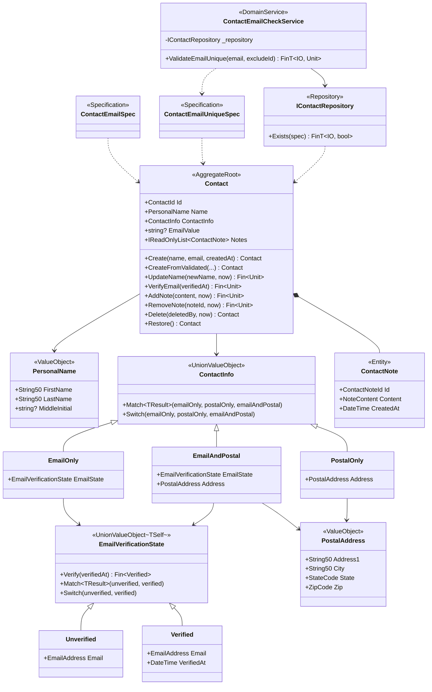

## From Design Decisions to C# Implementation

The rules defined in natural language from the [Business Requirements](../00-business-requirements/) were identified as Aggregates and classified as invariants in the [Type Design Decisions](../01-type-design-decisions/). This document implements those designs using Functorium DDD building blocks and C# 14 language features.

| Design Decision | C# Implementation Pattern | Application |
|---|---|---|
| Validate at creation + immutable + normalization | `SimpleValueObject<T>` + `NotNull` -> `ThenNormalize` chain | String50, EmailAddress, StateCode, ZipCode, NoteContent |
| Atomic grouping | `sealed class : ValueObject` + `GetEqualityComponents` | PersonalName, PostalAddress |
| Only permitted combinations | `UnionValueObject` + `[UnionType]` (auto-generated Match/Switch) | ContactInfo |
| State separation + transition function | `UnionValueObject<TSelf>` + `TransitionFrom` helper + `[UnionType]` | EmailVerificationState |
| Aggregate identification + lifecycle management | `AggregateRoot<TId>` + `IAuditable` + `ISoftDeletableWithUser` | Contact |
| Layer separation of validation composition | Entity receives VOs only, `FinApplyExtensions` composition in Application Layer | Contact factory |
| Child entity + collection management | `Entity<TId>` + private collection + `IReadOnlyList` exposure | ContactNote |
| Fallible vs idempotent behavior | `Fin<Unit>` vs `Contact` return | Aggregate methods |
| Aggregate guard + state transition delegation | Aggregate guards then delegates to state object | Contact.VerifyEmail |
| Time injection | All behavior methods receive `DateTime` parameter | Create, UpdateName, Delete, etc. |
| Queryable domain state | Projection property | EmailValue |
| Domain query specification | `ExpressionSpecification<T>` | ContactEmailSpec, ContactEmailUniqueSpec |
| Cross-Aggregate validation | `IDomainService` + Repository + Specification cohesion | ContactEmailCheckService |
| Persistence abstraction | `IRepository<T, TId>` + custom methods | IContactRepository |
| ORM restoration | `CreateFromValidated` (no validation/events) | Contact, PersonalName, PostalAddress, ContactNote |

## Single-Value Invariants -> SimpleValueObject + Validate Chain

Each value object inherits from `SimpleValueObject<T>` and chains validation rules in the `Validate` method. It accepts `string?` as input, starts with `NotNull`, and applies normalization via `ThenNormalize`. **Normalization is placed after existence checks (NotNull, NotEmpty) and before structural checks (MaxLength, Matches).** This ensures structural validation is performed on the normalized value.

| Type | Validation Rules | Normalization |
|------|----------|--------|
| `String50` | `NotNull` -> `ThenNotEmpty` -> `ThenNormalize(Trim)` -> `ThenMaxLength(50)` | `Trim` |
| `EmailAddress` | `NotNull` -> `ThenNotEmpty` -> `ThenNormalize(Trim+ToLower)` -> `ThenMaxLength(320)` -> `ThenMatches(email regex)` | `Trim` + `ToLowerInvariant` |
| `StateCode` | `NotNull` -> `ThenNotEmpty` -> `ThenMatches(^[A-Z]{2}$)` | -- |
| `ZipCode` | `NotNull` -> `ThenNotEmpty` -> `ThenMatches(^\d{5}$)` | -- |
| `NoteContent` | `NotNull` -> `ThenNotEmpty` -> `ThenNormalize(Trim)` -> `ThenMaxLength(500)` | `Trim` |

```csharp
public sealed class String50 : SimpleValueObject<string>
{
    public const int MaxLength = 50;
    private String50(string value) : base(value) { }

    public static Fin<String50> Create(string? value) =>
        CreateFromValidation(Validate(value), v => new String50(v));

    public static Validation<Error, string> Validate(string? value) =>
        ValidationRules<String50>
            .NotNull(value)
            .ThenNotEmpty()
            .ThenNormalize(v => v.Trim())
            .ThenMaxLength(MaxLength);

    public static String50 CreateFromValidated(string value) => new(value);
    public static implicit operator string(String50 vo) => vo.Value;
}
```

- Private constructor blocks `new`, exposing only the `Create` factory
- `Fin<T>` expresses success/failure, enabling exception-free failure handling
- `CreateFromValidated` is for ORM restoration, directly creating from already-validated values
- Implicit operator supports `String50` -> `string` conversion

## Structural Invariants -> ValueObject Composition

### Atomic Grouping

Inherits from the `ValueObject` abstract class to ensure VO hierarchy consistency. Explicitly implements value-based equality via `GetEqualityComponents`.

```csharp
public sealed class PersonalName : ValueObject
{
    public String50 FirstName { get; }
    public String50 LastName { get; }
    public string? MiddleInitial { get; }

    private PersonalName(String50 firstName, String50 lastName, string? middleInitial)
    {
        FirstName = firstName;
        LastName = lastName;
        MiddleInitial = middleInitial;
    }

    protected override IEnumerable<object> GetEqualityComponents()
    {
        yield return FirstName;
        yield return LastName;
        if (MiddleInitial is not null)
            yield return MiddleInitial;
    }

    public static Validation<Error, PersonalName> Validate(
        string? firstName, string? lastName, string? middleInitial = null) =>
        (String50.Validate(firstName), String50.Validate(lastName))
            .Apply((first, last) => new PersonalName(
                String50.CreateFromValidated(first),
                String50.CreateFromValidated(last),
                middleInitial));

    public static Fin<PersonalName> Create(
        string? firstName, string? lastName, string? middleInitial = null) =>
        Validate(firstName, lastName, middleInitial)
            .ToFin();

    public static PersonalName CreateFromValidated(
        String50 firstName, String50 lastName, string? middleInitial = null) =>
        new(firstName, lastName, middleInitial);
}
```

Composite VOs follow the same `Validate` -> `Create` pattern as single-value VOs:

- **`Validate`**: Uses the Apply (parallel) pattern to validate all fields simultaneously. Even if one or more fields fail, all remaining field errors are collected and returned as `Validation<Error, T>`.
- **`Create`**: Returns `Fin<T>` via `Validate(...).ToFin()`. Compatible with existing calling code.

This pattern contrasts with the Bind (sequential) validation of single-value VOs:

| Pattern | Approach | Error Collection | Usage |
|------|------|----------|----------|
| **Bind** (`from...in`) | Sequential -- stops at first error | 1 | Single-value VO's `Create` |
| **Apply** (tuple `.Apply()`) | Parallel -- validates all fields | All | Composite VO's `Validate` |

| Item | `sealed class : ValueObject` | `abstract partial record : UnionValueObject` |
|---|---|---|
| Purpose | Composite VO (PersonalName, PostalAddress) | Discriminated Union (ContactInfo, EmailVerificationState) |
| Equality | Explicit `GetEqualityComponents()` implementation | Compiler auto-generated (record) |
| Immutability | Private constructor + `{ get; }` | Record positional parameters |
| VO hierarchy | Participates in `ValueObject` hierarchy | Participates in `IUnionValueObject` hierarchy |
| ORM compatibility | Proxy type auto-handling | Proxy not supported |
| Hash code | Cached hash code | Compiler-generated (record) |
| Source Generator | -- | `[UnionType]` auto-generates Match/Switch |

### Discriminated Union

`ContactInfo` and `EmailVerificationState` are implemented as Functorium `UnionValueObject`-based records. Since records cannot inherit from classes, they are designed based on `IUnionValueObject` interface + `abstract record`, maintaining record pattern matching and structural equality.

Applying the `[UnionType]` attribute causes the Source Generator to auto-generate `Match<TResult>` and `Switch` methods, **enforcing at compile time** that all cases are handled.

```csharp
[UnionType]
public abstract partial record ContactInfo : UnionValueObject
{
    public sealed record EmailOnly(EmailVerificationState EmailState) : ContactInfo;
    public sealed record PostalOnly(PostalAddress Address) : ContactInfo;
    public sealed record EmailAndPostal(EmailVerificationState EmailState, PostalAddress Address) : ContactInfo;
    private ContactInfo() { }
}

// Methods auto-generated by Source Generator:
// - Match<TResult>(emailOnly, postalOnly, emailAndPostal) -- all Func parameters required -> exhaustiveness guaranteed
// - Switch(emailOnly, postalOnly, emailAndPostal) -- all Action parameters required
```

With `abstract partial record` + `private` constructor, new cases cannot be added externally. Only one of three cases can be selected, and since there is no "no contact method" case, an empty contact is structurally impossible. The `Match` method requires all Func parameters for every case, so adding a new case prevents omission via compile error.

## State Transition Invariants -> UnionValueObject\<TSelf\> + TransitionFrom Helper

`EmailVerificationState` inherits from `UnionValueObject<TSelf>` to use the `TransitionFrom` helper. The Aggregate delegates the transition after guards (deletion state, email existence).

`TransitionFrom<TSource, TTarget>` applies the transition function if `this` is `TSource`, otherwise automatically returns an `InvalidTransition` error. CRTP (Curiously Recurring Template Pattern) ensures precise type information is passed to `DomainError`.

```csharp
[UnionType]
public abstract partial record EmailVerificationState : UnionValueObject<EmailVerificationState>
{
    public sealed record Unverified(EmailAddress Email) : EmailVerificationState;
    public sealed record Verified(EmailAddress Email, DateTime VerifiedAt) : EmailVerificationState;
    private EmailVerificationState() { }

    public Fin<Verified> Verify(DateTime verifiedAt) =>
        TransitionFrom<Unverified, Verified>(
            u => new Verified(u.Email, verifiedAt));
}
```

On transition failure, `TransitionFrom` automatically generates `DomainError.For<EmailVerificationState>(new DomainErrorType.InvalidTransition(FromState: "Verified", ToState: "Verified"), ...)`. Users only need to focus on case definitions and success transition logic.

## Aggregate Root Design

### Entity ID and Dual Factory

The `[GenerateEntityId]` source generator auto-generates a Ulid-based `ContactId`. The dual factory separates domain creation from ORM restoration.

| Factory | Purpose | Validation | Events |
|---|---|---|---|
| `Create(name, email, createdAt)` | Domain creation | Receives already-validated VOs | Publishes `CreatedEvent` |
| `CreateFromValidated(id, name, ...)` | ORM restoration | None (trusts DB data) | None |

### Layer-Specific Roles of Validation Composition

The responsibility of converting raw input (strings, etc.) to VOs is clearly separated by layer:

| Layer | Validation Boundary | `Validate` | `Create` | `CreateFromValidated` |
|--------|----------|-----------|----------|----------------------|
| Simple VO | raw -> VO | `ValidationRules` chain | `string?` -> `Fin<T>` | `string` -> T |
| Composite VO | raw -> VO | Child `Validate` applicative composition | `string?` -> `Fin<T>` | Child VOs -> T |
| Entity/Aggregate | VO -> Entity | -- | VO -> Entity | VOs + ID -> Entity (ORM restoration) |
| Application Layer | -- | -- | `FinApply` for N `Fin<T>` applicative composition | -- |

Entity/Aggregate has no `Validate` and only receives already-validated VOs. When composing multiple VO `Create` results (`Fin<T>`) in the Application Layer, use `FinApplyExtensions`'s tuple `.Apply()`:

```csharp
// Application Layer: applicative composition of multiple VO Create results
var contact = (
    PersonalName.Create(cmd.FirstName, cmd.LastName),
    EmailAddress.Create(cmd.Email)
).Apply((name, email) => Contact.Create(name, email, now));
// -> Fin<Contact>, all VO validation errors accumulated
```

`FinApplyExtensions` converts each `Fin<T>` to `Validation<Error, T>`, uses `ValidationApplyExtensions`' applicative composition, and converts the result back to `Fin<R>`. Nested errors (e.g., firstName+lastName errors inside `PersonalName`) are all preserved.

### Domain Events

Events are published on every Aggregate state change: `CreatedEvent`, `NameUpdatedEvent`, `EmailVerifiedEvent`, `NoteAddedEvent`, `NoteRemovedEvent`, `DeletedEvent`, `RestoredEvent`.

### Behavior Method Return Type Design

| Method | Return Type | Reason |
|---|---|---|
| `UpdateName`, `VerifyEmail`, `AddNote`, `RemoveNote` | `Fin<Unit>` | Can return error in deleted state |
| `Delete`, `Restore` | `Contact` | Always idempotent, supports fluent chaining |

### Aggregate Guard + State Transition Delegation

`Contact.VerifyEmail` delegates the state transition to `EmailVerificationState.Verify` after Aggregate-level guards. This method validates three invariants in order:

1. **Block behavior on deleted Aggregate** -- If `DeletedAt.IsSome`, returns `AlreadyDeleted` error. A soft-deleted Contact is prohibited from all state changes until restored (`Restore`).
2. **Check email existence** -- Extracts `EmailState` via `ContactInfo.Match`. The `PostalOnly` case has no email, so it becomes `null`, returning `NoEmailToVerify` error. `Match` enforces compile-time handling of all cases.
3. **Delegate state transition rules** -- After passing the above guards, calls `emailState.Verify(verifiedAt)`. The `TransitionFrom` helper automatically returns an `InvalidTransition` error for re-verification from the `Verified` state. These transition rules are encapsulated by the state object (`EmailVerificationState`).

The Aggregate handles **invariant guards (1, 2) and** **event publishing**, while **state transition rules (3) are** delegated to the state object.

```csharp
public Fin<Unit> VerifyEmail(DateTime verifiedAt)
{
    // Guard 1: Block behavior on deleted Aggregate
    if (DeletedAt.IsSome)
        return DomainError.For<Contact>(new AlreadyDeleted(), ...);

    // Guard 2: Extract EmailState via Match (exhaustiveness guaranteed)
    var emailState = ContactInfo.Match<EmailVerificationState?>(
        emailOnly: eo => eo.EmailState,
        postalOnly: _ => null,
        emailAndPostal: ep => ep.EmailState);

    if (emailState is null)
        return DomainError.For<Contact>(new NoEmailToVerify(), ...);

    // Delegate: TransitionFrom encapsulates transition rules and error handling
    return emailState.Verify(verifiedAt).Map(verified =>
    {
        ContactInfo = ContactInfo.Match(
            emailOnly: _ => (ContactInfo)new ContactInfo.EmailOnly(verified),
            postalOnly: _ => throw new InvalidOperationException(),
            emailAndPostal: ep => new ContactInfo.EmailAndPostal(verified, ep.Address));
        UpdatedAt = verifiedAt;
        AddDomainEvent(new EmailVerifiedEvent(Id, verified.Email, verifiedAt));
        return unit;
    });
}
```

### Time Injection Pattern

All behavior methods receive `DateTime` as a parameter, avoiding direct `DateTime.UtcNow` calls within the domain. This enables deterministic time control in tests and guarantees consistent timestamps within the same transaction.

## Child Entity + Collection Management

`ContactNote` is a child entity inheriting from `Entity<ContactNoteId>`. It has an independent ID but does not escape the Aggregate boundary.

```csharp
[GenerateEntityId]
public sealed class ContactNote : Entity<ContactNoteId>
{
    public NoteContent Content { get; private set; }
    public DateTime CreatedAt { get; private set; }

    public static ContactNote Create(NoteContent content, DateTime createdAt) =>
        new(ContactNoteId.New(), content, createdAt);
}
```

The Aggregate Root manages child entities as a private collection and exposes only `IReadOnlyList` externally:

```csharp
private readonly List<ContactNote> _notes = [];
public IReadOnlyList<ContactNote> Notes => _notes.AsReadOnly();
```

## Soft Delete

Implements soft delete and deleter tracking with the `ISoftDeletableWithUser` interface. Delete/restore is idempotent, and attempting behavior on a deleted Contact returns an `AlreadyDeleted` error.

```csharp
public Contact Delete(string deletedBy, DateTime now)
{
    if (DeletedAt.IsSome) return this;  // Idempotent
    DeletedAt = now;
    DeletedBy = deletedBy;
    AddDomainEvent(new DeletedEvent(Id, deletedBy));
    return this;
}
```

## Projection Property + Synchronization

The email inside the `ContactInfo` union cannot be directly queried in a Specification's Expression Tree. A `string? EmailValue` projection property is exposed flat to solve this problem.

```csharp
private ContactInfo _contactInfo = null!;
public ContactInfo ContactInfo
{
    get => _contactInfo;
    private set
    {
        _contactInfo = value;
        EmailValue = ExtractEmail(value);
    }
}
public string? EmailValue { get; private set; }
```

## Specification

`ExpressionSpecification<Contact>`-based query specifications that return `Expression<Func<T, bool>>` for ORM SQL translation.

```csharp
public sealed class ContactEmailSpec : ExpressionSpecification<Contact>
{
    public EmailAddress Email { get; }
    public ContactEmailSpec(EmailAddress email) => Email = email;

    public override Expression<Func<Contact, bool>> ToExpression()
    {
        string emailStr = Email;
        return contact => contact.EmailValue == emailStr;
    }
}
```

`ContactEmailUniqueSpec` accepts `Option<ContactId> ExcludeId` to support email uniqueness checking excluding self. **The self-exclusion logic is solely owned by this Specification** and is not duplicated in Service or Usecase:

```csharp
public sealed class ContactEmailUniqueSpec : ExpressionSpecification<Contact>
{
    public EmailAddress Email { get; }
    public Option<ContactId> ExcludeId { get; }

    public ContactEmailUniqueSpec(EmailAddress email, Option<ContactId> excludeId = default)
    {
        Email = email;
        ExcludeId = excludeId;
    }

    public override Expression<Func<Contact, bool>> ToExpression()
    {
        string emailStr = Email;

        return ExcludeId.Match(
            Some: excludeId =>
            {
                var id = excludeId;
                return (Expression<Func<Contact, bool>>)(
                    contact => contact.EmailValue == emailStr && contact.Id != id);
            },
            None: () => contact => contact.EmailValue == emailStr);
    }
}
```

## Domain Service

Eric Evans presents in Blue Book Chapter 9 the pattern where a Domain Service uses a Repository to perform Specification-based queries. The **Stateless** (no mutable state between calls) required by Evans is different from **Pure** (no I/O). Since Repository interfaces are defined in the domain layer, it is legitimate in Evans DDD for a Domain Service to use them.

`ContactEmailCheckService` receives `IContactRepository` via constructor and cohesively performs Specification creation -> Repository DB query -> result interpretation internally:

```csharp
public sealed class ContactEmailCheckService : IDomainService
{
    private readonly IContactRepository _repository;

    public ContactEmailCheckService(IContactRepository repository)
        => _repository = repository;

    public sealed record EmailAlreadyInUse : DomainErrorType.Custom;

    public FinT<IO, Unit> ValidateEmailUnique(
        EmailAddress email,
        Option<ContactId> excludeId = default)
    {
        var spec = new ContactEmailUniqueSpec(email, excludeId);
        return from exists in _repository.Exists(spec)
               from _ in CheckNotExists(email, exists)
               select unit;
    }

    private static Fin<Unit> CheckNotExists(EmailAddress email, bool exists)
    {
        if (exists)
            return DomainError.For<ContactEmailCheckService>(
                new EmailAlreadyInUse(),
                (string)email,
                "Email is already in use by another contact");
        return unit;
    }
}
```

- The `_repository` field is a **dependency reference**, not mutable state -- it satisfies Evans's Stateless requirement
- `FinT<IO, Unit>` return expresses an effect chain that includes Repository I/O
- `CheckNotExists` is a **pure function** -- separating I/O from domain judgment
- LINQ `from ... in` naturally composes `FinT<IO, bool>` and `Fin<Unit>` (`FinTLinqExtensions.Fin` provides `FinT -> Fin` SelectMany)

> **Difference from the Functorium default pattern:** Functorium's `IDomainService` defaults to pure functions (no external I/O). The ecommerce-ddd example's `OrderCreditCheckService` has the Usecase load small-scale cross-data (order <-> customer) and pass it to the pure Service. In contrast, email uniqueness validation requires a DB query across all contacts, so following Evans's principle, the Service directly uses the Repository.

## Repository Interface

```csharp
public interface IContactRepository : IRepository<Contact, ContactId>
{
    FinT<IO, bool> Exists(Specification<Contact> spec);
}
```

Adds an `Exists` method to the base `IRepository<T, TId>` CRUD to support Specification-based existence checks.

## Cross-Aggregate Validation Flow

Three components -- Specification, Domain Service, and Repository -- connect to perform cross-Aggregate validation:

```
Usecase -> service.ValidateEmailUnique(email, excludeId)
           |-> Service internals:
              1. Create ContactEmailUniqueSpec(email, excludeId)  -- Define query rules
              2. _repository.Exists(spec)                        -- DB-level execution
              3. CheckNotExists(email, exists)                   -- Interpret results
```

Usage pattern in the Application Layer:

```csharp
// Usecase -- Service encapsulates everything
FinT<IO, Response> usecase =
    from _ in _emailCheckService.ValidateEmailUnique(email, excludeId)
    from saved in _repository.Create(contact)
    select new Response(saved.Id);
```

Pattern selection by cross-data scale:

| Scenario | Cross-Data Scale | Pattern | Example |
|----------|-----------------|------|------|
| Small-scale | 1 to few records | Pure Domain Service (Usecase loads data) | `OrderCreditCheckService` (order <-> customer) |
| Large-scale | Entire table | Domain Service using Repository (Evans Ch.9) | `ContactEmailCheckService` (email <-> all contacts) |

## Final Type Structure



## Naive Field -> Final Type Tracking Table

| Naive Field | Single Value | Structure | State Transition | Lifecycle | Final Location |
|------------|--------|------|----------|------|----------|
| `string FirstName` | String50 | PersonalName | -- | -- | `Contact.Name.FirstName` |
| `string MiddleInitial` | -- | PersonalName | -- | -- | `Contact.Name.MiddleInitial` |
| `string LastName` | String50 | PersonalName | -- | -- | `Contact.Name.LastName` |
| `string EmailAddress` | EmailAddress | Inside ContactInfo union | Inside EmailVerificationState | -- | `Contact.ContactInfo.*.EmailState.*.Email` |
| `bool IsEmailVerified` | -- | Eliminated by union | `UnionValueObject<TSelf>` + `TransitionFrom` | -- | Existence of `EmailVerificationState.Verified` |
| `string Address1` | String50 | Inside ContactInfo union | -- | -- | `Contact.ContactInfo.*.Address.Address1` |
| `string City` | String50 | Inside ContactInfo union | -- | -- | `Contact.ContactInfo.*.Address.City` |
| `string State` | StateCode | Inside ContactInfo union | -- | -- | `Contact.ContactInfo.*.Address.State` |
| `string Zip` | ZipCode | Inside ContactInfo union | -- | -- | `Contact.ContactInfo.*.Address.Zip` |
| (none) | NoteContent | -- | -- | ContactNote | `Contact.Notes[].Content` |
| (none) | -- | -- | -- | IAuditable | `Contact.CreatedAt`, `Contact.UpdatedAt` |
| (none) | -- | -- | -- | ISoftDeletable | `Contact.DeletedAt`, `Contact.DeletedBy` |

Check how this type structure guarantees 10 business scenarios in the [Implementation Results](../03-implementation-results/).
