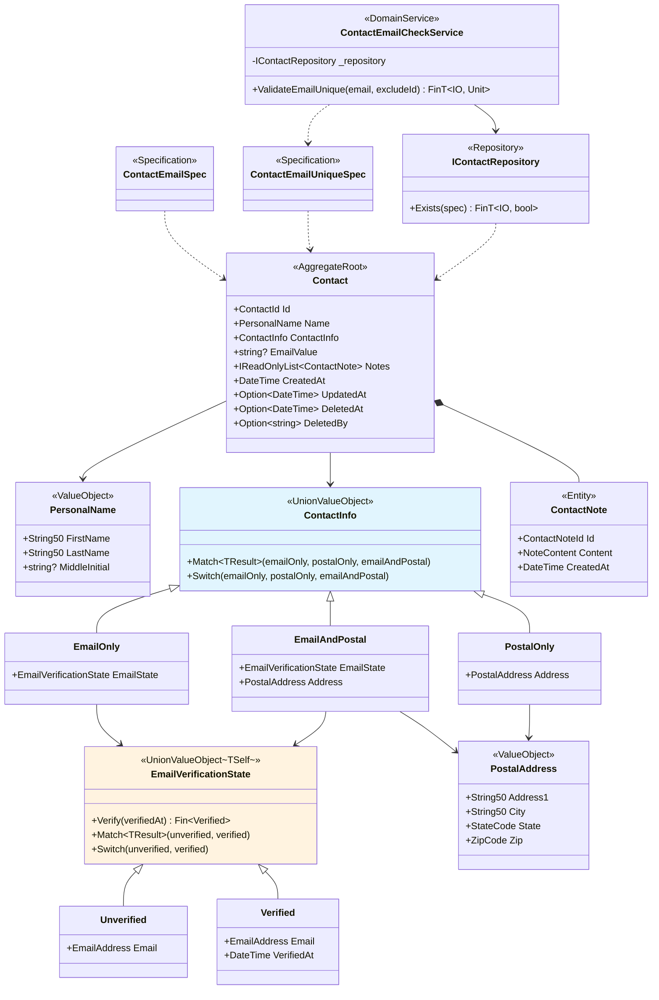

## 비즈니스 시나리오 검증

[비즈니스 요구사항](./00-business-requirements/)에서 정의한 10개 시나리오가, [타입 설계 의사결정](./01-type-design-decisions/)과 [코드 설계](./02-code-design/)의 타입 구조로 실제 동작함을 증명합니다. 정상 시나리오(1~6)는 타입이 올바른 상태를 어떻게 표현하는지, 거부 시나리오(7~10)는 잘못된 상태를 어떻게 차단하는지 확인합니다.

## Normal Scenarios

### Scenarios 1. 이메일만 등록 후 인증

**비즈니스 규칙:** 이메일만으로 연락처를 생성할 수 있다. 새 이메일은 미인증 상태로 시작하며, 인증하면 시점이 기록된다.

```csharp
var name = PersonalName.Create("HyungHo", "Ko", "J").ThrowIfFail();
var email = EmailAddress.Create("user@example.com").ThrowIfFail();
var contact = Contact.Create(name, email, now);
Console.WriteLine($"Contact: {contact}");
Console.WriteLine($"ID: {contact.Id}");
Console.WriteLine($"EmailValue: {contact.EmailValue}");
Console.WriteLine($"이벤트: {contact.DomainEvents[0].GetType().Name}");

contact.VerifyEmail(now).ThrowIfFail();
Console.WriteLine($"이벤트 수: {contact.DomainEvents.Count}");
Console.WriteLine($"이벤트: {contact.DomainEvents[1].GetType().Name}");
```

```
Contact: HyungHo J. Ko (EmailOnly { ... EmailState = Unverified { ... Email = user@example.com } })
ID: {ContactId}
EmailValue: user@example.com
이벤트: CreatedEvent
이벤트 수: 2
이벤트: EmailVerifiedEvent
```

`Contact.Create(name, email, now)`는 `ContactInfo.EmailOnly(Unverified(email))`을 생성합니다. `VerifyEmail`은 `TransitionFrom<Unverified, Verified>`를 통해 단방향 전이를 수행하고, `EmailVerifiedEvent`를 발행합니다.

### Scenarios 2. 우편 주소만 등록

**비즈니스 규칙:** 우편 주소만으로 연락처를 생성할 수 있다.

```csharp
var postal = PostalAddress.Create("123 Main St", "Springfield", "IL", "62704").ThrowIfFail();
var postalContact = Contact.Create(name, postal, now);
Console.WriteLine($"ContactInfo 타입: {postalContact.ContactInfo.GetType().Name}");
Console.WriteLine($"이벤트: {postalContact.DomainEvents[0].GetType().Name}");
```

```
ContactInfo 타입: PostalOnly
이벤트: CreatedEvent
```

`ContactInfo` union의 `PostalOnly` 케이스가 선택됩니다. 이메일이 없으므로 `EmailVerificationState`도 존재하지 않아, "이메일 없이 인증된 상태"가 구조적으로 불가능합니다.

### Scenarios 3. 이메일과 우편 주소 모두 등록

**비즈니스 규칙:** 이메일과 우편 주소를 함께 등록할 수 있다.

```csharp
var bothEmail = EmailAddress.Create("both@example.com").ThrowIfFail();
var bothContact = Contact.Create(name, bothEmail, postal, now);
Console.WriteLine($"ContactInfo 타입: {bothContact.ContactInfo.GetType().Name}");
Console.WriteLine($"이벤트: {bothContact.DomainEvents[0].GetType().Name}");
```

```
ContactInfo 타입: EmailAndPostal
이벤트: CreatedEvent
```

`ContactInfo.EmailAndPostal` 케이스가 이메일 상태와 우편 주소를 동시에 보유합니다. union의 세 케이스(`EmailOnly`, `PostalOnly`, `EmailAndPostal`)만 허용되므로, "연락 수단 없음"은 타입 수준에서 표현 자체가 불가능합니다.

시나리오 1~3은 `ContactInfo` union의 세 케이스를 각각 검증했습니다. 이어지는 시나리오 4~6은 생성된 연락처의 수명 주기를 다룹니다.

### Scenarios 4. 이름 변경

**비즈니스 규칙:** 연락처의 이름을 변경할 수 있으며, 변경 시점이 기록된다.

```csharp
var newName = PersonalName.Create("Gildong", "Hong").ThrowIfFail();
contact.UpdateName(newName, now).ThrowIfFail();
Console.WriteLine($"변경 후: {contact.Name}");
Console.WriteLine($"이벤트: {contact.DomainEvents[2].GetType().Name}");
var nameEvent = (Contact.NameUpdatedEvent)contact.DomainEvents[2];
Console.WriteLine($"Old: {nameEvent.OldName}, New: {nameEvent.NewName}");
```

```
변경 후: Gildong Hong
이벤트: NameUpdatedEvent
Old: HyungHo J. Ko, New: Gildong Hong
```

`UpdateName`은 `NameUpdatedEvent`로 변경 전후 이름을 기록합니다. `PersonalName`이 `ValueObject`이므로 이전 값을 안전하게 보존할 수 있습니다.

### Scenarios 5. 메모 추가/제거

**비즈니스 규칙:** 연락처에 메모를 추가/제거할 수 있다. 존재하지 않는 메모 제거는 멱등하다.

```csharp
var noteContent = NoteContent.Create("첫 번째 메모입니다").ThrowIfFail();
contact.AddNote(noteContent, now).ThrowIfFail();
Console.WriteLine($"메모 수: {contact.Notes.Count}");
Console.WriteLine($"메모 내용: {(string)contact.Notes[0].Content}");
Console.WriteLine($"이벤트: {contact.DomainEvents[3].GetType().Name}");

var noteId = contact.Notes[0].Id;
contact.RemoveNote(noteId, now);
Console.WriteLine($"메모 수: {contact.Notes.Count}");
Console.WriteLine($"이벤트: {contact.DomainEvents[4].GetType().Name}");

// 다시 제거 시도 (멱등)
contact.RemoveNote(noteId, now);
Console.WriteLine($"중복 제거 후 이벤트 수: {contact.DomainEvents.Count} (변화 없음)");
```

```
메모 수: 1
메모 내용: 첫 번째 메모입니다
이벤트: NoteAddedEvent
메모 수: 0
이벤트: NoteRemovedEvent
중복 제거 후 이벤트 수: 5 (변화 없음)
```

`NoteContent`는 500자 이하 검증이 적용된 VO입니다. 이미 제거된 메모를 다시 제거해도 이벤트가 추가되지 않아, 멱등성이 보장됩니다.

### Scenarios 6. 논리 삭제 후 복원

**비즈니스 규칙:** 연락처를 논리 삭제하면 삭제자와 시점이 기록된다. 복원하면 삭제 정보가 초기화된다. 삭제와 복원은 멱등하다.

```csharp
// 삭제
contact.Delete("admin", now);
Console.WriteLine($"DeletedAt: {contact.DeletedAt}");
Console.WriteLine($"DeletedBy: {contact.DeletedBy}");

// 멱등: 다시 삭제 시 이벤트 추가 없음
var eventCountBefore = contact.DomainEvents.Count;
contact.Delete("admin", now);
Console.WriteLine($"멱등 삭제: 이벤트 수 변화 없음 = {contact.DomainEvents.Count == eventCountBefore}");
```

```
DeletedAt: Some({timestamp})
DeletedBy: Some(admin)
멱등 삭제: 이벤트 수 변화 없음 = True
```

```csharp
// 복원
contact.Restore();
Console.WriteLine($"DeletedAt: {contact.DeletedAt}");

// 멱등: 다시 복원 시 이벤트 추가 없음
var eventCountBeforeRestore = contact.DomainEvents.Count;
contact.Restore();
Console.WriteLine($"멱등 복원: 이벤트 수 변화 없음 = {contact.DomainEvents.Count == eventCountBeforeRestore}");
```

```
DeletedAt: None
멱등 복원: 이벤트 수 변화 없음 = True
```

`DeletedAt`과 `DeletedBy`는 `Option<T>`로 표현됩니다. 삭제 시 `Some(value)`, 복원 시 `None`으로 전환됩니다. 이미 삭제(복원)된 상태에서 다시 삭제(복원)해도 이벤트가 추가되지 않아, 멱등성이 보장됩니다.

정상 시나리오에서는 타입 시스템이 올바른 상태를 구성하는 과정을 확인했습니다. 거부 시나리오에서는 잘못된 상태를 시도했을 때 타입 시스템이 어떻게 차단하는지 살펴봅니다.

## Rejection Scenarios

### Scenarios 7. 연락 수단 없이 등록 (거부)

**비즈니스 규칙:** 연락 수단이 없는 연락처는 존재할 수 없다.

```csharp
// Contact.Create()는 EmailAddress 또는 PostalAddress를 필수로 요구하므로
// 연락 수단 없는 Contact는 타입 시스템에 의해 생성 자체가 불가능합니다.
Console.WriteLine("Contact.Create()는 EmailAddress 또는 PostalAddress를 필수로 요구");
Console.WriteLine("→ 타입 시스템에 의해 컴파일 타임에 방지됩니다.");
```

```
Contact.Create()는 EmailAddress 또는 PostalAddress를 필수로 요구
→ 타입 시스템에 의해 컴파일 타임에 방지됩니다.
```

이 시나리오는 런타임이 아닌 **컴파일 타임에 방지**됩니다. `Contact.Create`는 세 가지 오버로드만 제공합니다:

- `Create(PersonalName, EmailAddress, DateTime)` — 이메일만
- `Create(PersonalName, PostalAddress, DateTime)` — 우편 주소만
- `Create(PersonalName, EmailAddress, PostalAddress, DateTime)` — 둘 다

연락 수단 없이 호출하는 오버로드가 존재하지 않으므로, 컴파일러가 오류를 발생시킵니다. 런타임 검증 없이 타입 시스템만으로 이 규칙을 보장합니다.

### Scenarios 8. 인증된 이메일 재인증 (거부)

**비즈니스 규칙:** 이미 인증된 이메일을 다시 인증할 수 없다 (단방향 전이).

```csharp
var reVerifyResult = contact.VerifyEmail(now);
Console.WriteLine($"재인증 시도: IsFail={reVerifyResult.IsFail}");
```

```
재인증 시도: IsFail=True
```

`EmailVerificationState.Verify`는 `TransitionFrom<Unverified, Verified>`를 사용합니다. 현재 상태가 `Verified`이므로 `InvalidTransition` 오류를 반환합니다. 인증 → 미인증 역전이가 구조적으로 불가능합니다.

### Scenarios 9. 삭제된 연락처 수정 (거부)

**비즈니스 규칙:** 삭제된 연락처에는 이름 변경, 이메일 인증, 메모 추가가 불가하다.

```csharp
var updateResult = contact.UpdateName(name, now);
Console.WriteLine($"UpdateName: IsFail={updateResult.IsFail}");

var addNoteResult = contact.AddNote(noteContent, now);
Console.WriteLine($"AddNote: IsFail={addNoteResult.IsFail}");

var verifyResult = contact.VerifyEmail(now);
Console.WriteLine($"VerifyEmail: IsFail={verifyResult.IsFail}");
```

```
UpdateName: IsFail=True
AddNote: IsFail=True
VerifyEmail: IsFail=True
```

모든 행위 메서드(`UpdateName`, `AddNote`, `VerifyEmail`)는 첫 번째 가드에서 `DeletedAt.IsSome`을 확인합니다. 삭제된 상태에서는 `AlreadyDeleted` 오류를 반환하여, 삭제된 Aggregate에 대한 모든 상태 변경을 차단합니다.

### Scenarios 10. 중복 이메일 등록 (거부)

**비즈니스 규칙:** 동일한 이메일을 가진 연락처가 두 개 이상 존재할 수 없다. 자기 자신은 제외한다.

```csharp
var repo = new DemoContactRepository([contact]);
var service = new ContactEmailCheckService(repo);

// Service가 내부에서 ContactEmailUniqueSpec 생성 → Repository.Exists 호출 → 결과 해석
var dupResult = await service.ValidateEmailUnique(email).Run().RunAsync();
Console.WriteLine($"중복 이메일 검증: IsFail={dupResult.IsFail}");

var otherEmail = EmailAddress.Create("other@example.com").ThrowIfFail();
var uniqueResult = await service.ValidateEmailUnique(otherEmail).Run().RunAsync();
Console.WriteLine($"고유 이메일 검증: IsSucc={uniqueResult.IsSucc}");

// 자기 제외: Service가 ContactEmailUniqueSpec(email, contact.Id)를 내부 생성
var selfResult = await service.ValidateEmailUnique(email, contact.Id).Run().RunAsync();
Console.WriteLine($"자기 제외 검증: IsSucc={selfResult.IsSucc}");
```

```
중복 이메일 검증: IsFail=True
고유 이메일 검증: IsSucc=True
자기 제외 검증: IsSucc=True
```

`ContactEmailCheckService`가 이메일 고유성 검증의 완전한 소유자로서 3단계를 응집적으로 수행합니다:

1. **Specification 생성:** `ContactEmailUniqueSpec(email, excludeId)` — 쿼리 규칙과 자기 제외 로직을 Specification이 단일 소유
2. **Repository DB 쿼리:** `_repository.Exists(spec)` — 전체 Contact를 메모리에 로드하지 않고 DB 수준에서 존재 여부 확인
3. **결과 해석:** `bool → Fin<Unit>` — 도메인 에러(`EmailAlreadyInUse`) 또는 성공

Application Layer는 `service.ValidateEmailUnique(email, excludeId)` 하나만 호출하면 됩니다.

## API 데모

위 시나리오에서 사용한 빌딩 블록의 개별 API를 확인합니다.

### VO 생성: null 처리와 정규화

```csharp
var nullResult = String50.Create(null);
Console.WriteLine($"String50.Create(null): IsFail={nullResult.IsFail}");

var trimResult = String50.Create("  Hello  ").ThrowIfFail();
Console.WriteLine($"String50.Create(\"  Hello  \"): \"{(string)trimResult}\" (Trim 정규화)");

var emailNorm = EmailAddress.Create("User@Example.COM").ThrowIfFail();
Console.WriteLine($"EmailAddress.Create(\"User@Example.COM\"): \"{(string)emailNorm}\" (소문자 정규화)");
```

```
String50.Create(null): IsFail=True
String50.Create("  Hello  "): "Hello" (Trim 정규화)
EmailAddress.Create("User@Example.COM"): "user@example.com" (소문자 정규화)
```

- `null` 입력은 `NotNull` 규칙에서 즉시 실패합니다
- `String50`은 `Trim` 정규화를 적용하여 앞뒤 공백을 제거합니다
- `EmailAddress`는 `Trim` + `ToLowerInvariant` 정규화를 적용합니다

모든 VO는 생성 시점에 검증과 정규화를 완료하므로, 이후 도메인 로직에서 유효성을 다시 확인할 필요가 없습니다.

### Specification: 쿼리 가능한 도메인 규칙

```csharp
var emailSpec = new ContactEmailSpec(email);
Console.WriteLine($"ContactEmailSpec.IsSatisfiedBy(동일 이메일): {emailSpec.IsSatisfiedBy(contact)}");

var otherSpec = new ContactEmailSpec(otherEmail);
Console.WriteLine($"ContactEmailSpec.IsSatisfiedBy(다른 이메일): {otherSpec.IsSatisfiedBy(contact)}");

// ContactEmailUniqueSpec: 자기 제외 로직은 Specification이 단일 소유
var uniqueSpec = new ContactEmailUniqueSpec(email);
Console.WriteLine($"ContactEmailUniqueSpec(제외 없음): {uniqueSpec.IsSatisfiedBy(contact)}");

var uniqueSpecExclude = new ContactEmailUniqueSpec(email, contact.Id);
Console.WriteLine($"ContactEmailUniqueSpec(자기 제외): {uniqueSpecExclude.IsSatisfiedBy(contact)}");
```

```
ContactEmailSpec.IsSatisfiedBy(동일 이메일): True
ContactEmailSpec.IsSatisfiedBy(다른 이메일): False
ContactEmailUniqueSpec(제외 없음): True
ContactEmailUniqueSpec(자기 제외): False
```

- **`ContactEmailSpec`은** `EmailValue` 투영 속성으로 이메일 일치 여부를 판별합니다. 일치하면 `True`, 불일치하면 `False`입니다.
- **`ContactEmailUniqueSpec`은** 이메일 일치 + ID 제외 조건을 결합합니다. 자기 자신의 ID를 제외하면 해당 Contact는 `False`가 되어 중복으로 판정되지 않습니다. **자기 제외 로직은 이 Specification이 단일 소유**하므로, Service나 Usecase에 중복되지 않습니다.

두 Specification 모두 `Expression<Func<Contact, bool>>`을 반환하므로, ORM에서 SQL로 변환하여 데이터베이스 수준에서 필터링할 수 있습니다. `ContactEmailCheckService`는 내부에서 `ContactEmailUniqueSpec`을 생성하고 `IContactRepository.Exists(spec)`으로 DB 수준 실행을 위임합니다.

### CreateFromValidated: ORM 복원

```csharp
var note = ContactNote.Create(NoteContent.Create("복원 메모").ThrowIfFail(), now);
var restored = Contact.CreateFromValidated(
    contact.Id, name,
    new ContactInfo.EmailOnly(new EmailVerificationState.Unverified(email)),
    [note], now,
    Option<DateTime>.None, Option<DateTime>.None, Option<string>.None);
Console.WriteLine($"복원된 Contact: {restored}");
Console.WriteLine($"메모 수: {restored.Notes.Count}");
Console.WriteLine($"이벤트 수: {restored.DomainEvents.Count} (이벤트 없음)");
```

```
복원된 Contact: HyungHo J. Ko (EmailOnly { ... EmailState = Unverified { ... Email = user@example.com } })
메모 수: 1
이벤트 수: 0 (이벤트 없음)
```

`CreateFromValidated`는 ORM이 데이터베이스에서 읽은 데이터로 Aggregate를 재구성할 때 사용합니다. 검증과 이벤트 발행을 생략하여, 이미 영속화된 데이터를 신뢰합니다. `Create`와 `CreateFromValidated`의 이중 팩토리로 도메인 생성과 ORM 복원을 분리합니다.

## Scenarios 커버리지 매트릭스

| 시나리오 | 비즈니스 규칙 | 보장 메커니즘 | 결과 |
|----------|-------------|-------------|------|
| 1. 이메일만 등록 후 인증 | 이메일 연락처 생성 + 단방향 인증 | `ContactInfo.EmailOnly` + `TransitionFrom` | `CreatedEvent` → `EmailVerifiedEvent` |
| 2. 우편 주소만 등록 | 우편 주소 연락처 생성 | `ContactInfo.PostalOnly` | `CreatedEvent` |
| 3. 이메일과 우편 주소 모두 등록 | 복합 연락 수단 | `ContactInfo.EmailAndPostal` | `CreatedEvent` |
| 4. 이름 변경 | 이름 변경 + 이력 | `PersonalName` VO + `NameUpdatedEvent` | 변경 전후 기록 |
| 5. 메모 추가/제거 | 메모 관리 + 멱등 제거 | `NoteContent` VO + private 컬렉션 | 멱등성 보장 |
| 6. 논리 삭제 후 복원 | 수명 관리 + 멱등 | `Option<T>` + `ISoftDeletableWithUser` | 멱등 삭제/복원 |
| 7. 연락 수단 없이 등록 | 최소 연락 수단 필수 | `Create` 오버로드 제한 (컴파일 타임) | 컴파일 에러 |
| 8. 인증된 이메일 재인증 | 단방향 전이 | `TransitionFrom<Unverified, Verified>` | `InvalidTransition` |
| 9. 삭제된 연락처 수정 | 삭제 상태 행위 차단 | `DeletedAt.IsSome` 가드 | `AlreadyDeleted` |
| 10. 중복 이메일 등록 | 이메일 고유성 | `ContactEmailCheckService` (Spec→Repo→검증 응집) | `EmailAlreadyInUse` |

## Naive에서 타입 안전 도메인 모델로

Naive `Contact` 클래스의 모든 `string` 필드는 제약된 타입으로 대체되었고, `bool IsEmailVerified`는 union 기반 상태 머신으로 진화했습니다. 10개 시나리오 중 하나(시나리오 7)는 컴파일 타임에, 나머지 거부 시나리오(8~10)는 구조적으로 정의된 에러 타입과 `Fin<T>` 반환으로 런타임에 차단됩니다. 118개 단위 테스트(`DesigningWithTypes.Tests.Unit/`)가 이 보장을 지속적으로 검증합니다.

각 거부 시나리오는 `sealed record` 에러 타입을 통해 실패 원인을 구조적으로 식별합니다. `DomainError.For<TDomain>()`이 에러 코드를 `DomainErrors.{타입명}.{에러명}` 형식으로 자동 생성하므로, 문자열 비교 없이 에러를 패턴 매칭할 수 있습니다.

| 시나리오 | 에러 타입 | 정의 위치 | 에러 코드 |
|----------|----------|----------|----------|
| 8. 인증된 이메일 재인증 | `InvalidTransition(FromState, ToState)` | `DomainErrorType` (내장) | `DomainErrors.EmailVerificationState.InvalidTransition` |
| 9. 삭제된 연락처 수정 | `AlreadyDeleted` | `Contact` (Aggregate 내 커스텀) | `DomainErrors.Contact.AlreadyDeleted` |
| 10. 중복 이메일 등록 | `EmailAlreadyInUse` | `ContactEmailCheckService` (서비스 내 커스텀) | `DomainErrors.ContactEmailCheckService.EmailAlreadyInUse` |

### 최종 도메인 모델 구조



### DDD 전술적 패턴의 역할

Eric Evans의 DDD 빌딩 블록은 "어떤 규칙을 어디서 보장할 것인가"를 결정합니다.

| 빌딩 블록 | 보장하는 것 | 이 예제에서의 효과 |
|-----------|-----------|-------------------|
| Value Object | 단일 값의 유효성과 불변성 | `String50`, `EmailAddress` 등이 잘못된 값의 존재 자체를 차단 |
| Aggregate Root | 불변식 경계와 일관성 | `Contact`가 모든 상태 변경의 단일 진입점, 삭제 가드로 무결성 보장 |
| Entity | 식별성과 수명 주기 | `ContactNote`가 Aggregate 내에서만 관리되어 고아 엔티티 방지 |
| Domain Event | 상태 변경의 추적과 전파 | 7종 이벤트가 모든 변경을 명시적으로 기록 |
| Specification | 도메인 규칙의 쿼리 가능한 표현 | `ContactEmailSpec`이 코드와 DB 쿼리에서 동일한 규칙 적용 |
| Domain Service | 교차 Aggregate 검증 | `ContactEmailCheckService`가 Specification → Repository → 결과 해석을 응집적으로 수행 |

### 함수형 타입 시스템의 역할

Functorium의 함수형 타입은 "어떻게 컴파일러에게 규칙 검증을 위임할 것인가"를 제공합니다.

| 함수형 개념 | Functorium 타입 | 전통적 방식과의 차이 |
|------------|----------------|-------------------|
| 대수적 데이터 타입 | `UnionValueObject` + `[UnionType]` | `if/else` 분기 대신 `Match`로 컴파일 타임 exhaustiveness 보장 |
| 타입 안전 상태 전이 | `TransitionFrom<TSource, TTarget>` | `bool` 플래그 대신 상태별 데이터 분리로 불가능한 전이를 타입에서 제거 |
| 철도 지향 에러 처리 | `Fin<T>`, `Validation<Error, T>` | 예외 대신 반환 타입으로 실패를 표현, 호출자가 실패 처리를 강제받음 |
| 구조적 에러 타입 | `DomainErrorType` + `DomainError.For<T>()` | 문자열 메시지 대신 `sealed record` 에러 타입으로 실패 원인을 식별, 에러 코드 자동 생성 |
| 불변 값 | `SimpleValueObject<T>`, `ValueObject` | setter 대신 팩토리 + 불변 객체로 상태 오염 원천 차단 |

### 결합의 가치

DDD가 정의한 규칙 경계를 함수형 타입이 컴파일러 수준에서 강제합니다. 그 결과:

- **"잘못된 상태는 표현할 수 없다"** — `ContactInfo` union에 "연락 수단 없음" 케이스가 없으므로, 빈 연락처는 타입 수준에서 존재할 수 없습니다.
- **"잘못된 전이는 실행할 수 없다"** — `TransitionFrom`이 `Verified → Verified` 전이를 자동으로 거부하므로, 재인증 로직을 작성할 필요가 없습니다.
- **"실패는 무시할 수 없다"** — `Fin<T>` 반환이 호출자에게 성공/실패 처리를 강제하므로, 예외를 삼키는 실수가 구조적으로 불가능합니다.
- **"실패 원인은 구조적으로 식별된다"** — `InvalidTransition`, `AlreadyDeleted`, `EmailAlreadyInUse` 같은 `sealed record` 에러 타입이 실패 원인을 문자열이 아닌 타입으로 표현하므로, 호출자가 패턴 매칭으로 정확한 분기 처리를 할 수 있습니다.

이 네 가지 보장은 테스트가 아닌 타입 시스템에서 비롯됩니다. 테스트는 이 보장이 의도대로 작동하는지 확인하는 이중 안전장치입니다.

## 아키텍처 테스트

도메인 모델의 구조적 규칙을 Functorium의 `ArchitectureRules` 프레임워크로 자동 검증합니다. 6개 테스트 클래스(24개 테스트)가 DDD 빌딩 블록의 구조적 일관성을 보장합니다.

| 테스트 클래스 | 검증 대상 | 핵심 규칙 |
|-------------|----------|----------|
| `ValueObjectArchitectureRuleTests` | 11개 Value Object | public sealed, 불변성, `Create`/`Validate` 팩토리 (Union 타입 제외) |
| `EntityArchitectureRuleTests` | Contact (AR) + ContactNote (Entity) | public sealed, `Create`/`CreateFromValidated`, `[GenerateEntityId]`, private 생성자 |
| `DomainEventArchitectureRuleTests` | 7개 Domain Event | sealed record, `Event` 접미사 |
| `DomainServiceArchitectureRuleTests` | ContactEmailCheckService | public sealed, `Fin` 반환, IObservablePort 미의존, record 아님 |
| `SpecificationArchitectureRuleTests` | 2개 Specification | public sealed, `Specification<>` 상속, 도메인 레이어 거주 |

**Evans Ch.9 패턴 주의점:** `ContactEmailCheckService`는 `IContactRepository` 인스턴스 필드를 보유하는 Evans의 Repository 협력 패턴을 따릅니다. 따라서 `RequireNoInstanceFields()` (Stateless) 규칙은 적용하지 않습니다. `Create`/`Validate` 팩토리 규칙은 `UnionValueObject` 하위 타입(`ContactInfo`, `EmailVerificationState`)을 제외합니다 — Union 타입은 `[UnionType]` 속성에 의해 `Match`/`Switch`가 자동 생성되는 별도의 생성 패턴을 따릅니다.
