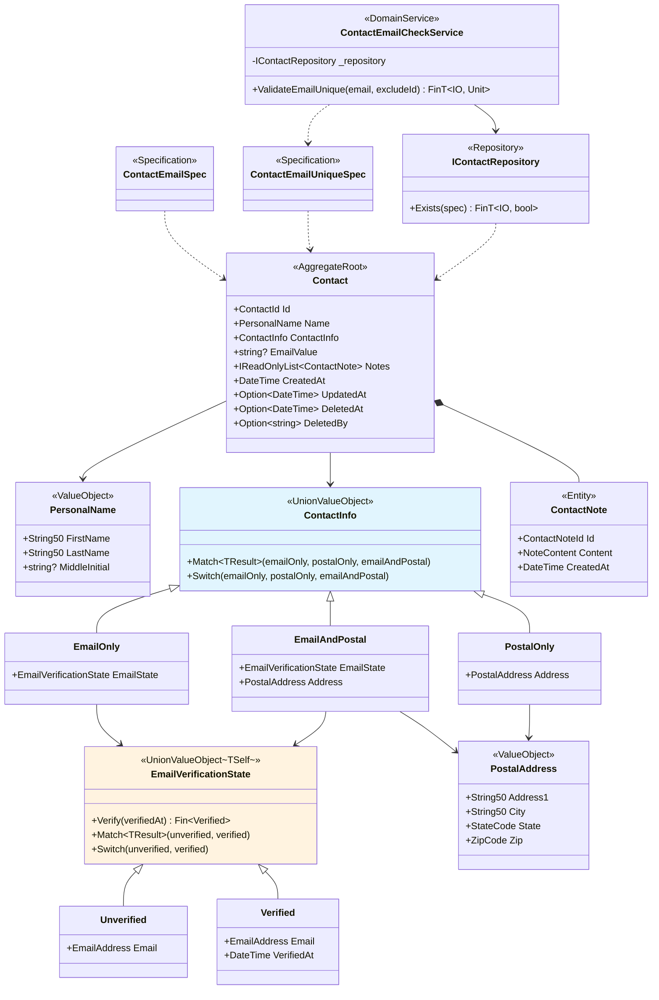

## Business Scenario Verification

This verifies that the 10 scenarios defined in the [Business Requirements](./00-business-requirements/) actually work with the type structures from the [Type Design Decisions](./01-type-design-decisions/) and [Code Design](./02-code-design/). Normal scenarios (1-6) confirm how types represent valid states, while rejection scenarios (7-10) confirm how invalid states are blocked.

## Normal Scenarios

### Scenarios 1. Register with Email Only and Verify

**Business rule:** A contact can be created with only an email. New emails start in an unverified state, and upon verification, the timestamp is recorded.

```csharp
var name = PersonalName.Create("HyungHo", "Ko", "J").ThrowIfFail();
var email = EmailAddress.Create("user@example.com").ThrowIfFail();
var contact = Contact.Create(name, email, now);
Console.WriteLine($"Contact: {contact}");
Console.WriteLine($"ID: {contact.Id}");
Console.WriteLine($"EmailValue: {contact.EmailValue}");
Console.WriteLine($"Event: {contact.DomainEvents[0].GetType().Name}");

contact.VerifyEmail(now).ThrowIfFail();
Console.WriteLine($"Event count: {contact.DomainEvents.Count}");
Console.WriteLine($"Event: {contact.DomainEvents[1].GetType().Name}");
```

```
Contact: HyungHo J. Ko (EmailOnly { ... EmailState = Unverified { ... Email = user@example.com } })
ID: {ContactId}
EmailValue: user@example.com
Event: CreatedEvent
Event count: 2
Event: EmailVerifiedEvent
```

`Contact.Create(name, email, now)` creates `ContactInfo.EmailOnly(Unverified(email))`. `VerifyEmail` performs a unidirectional transition through `TransitionFrom<Unverified, Verified>` and publishes an `EmailVerifiedEvent`.

### Scenarios 2. Register with Postal Address Only

**Business rule:** A contact can be created with only a postal address.

```csharp
var postal = PostalAddress.Create("123 Main St", "Springfield", "IL", "62704").ThrowIfFail();
var postalContact = Contact.Create(name, postal, now);
Console.WriteLine($"ContactInfo type: {postalContact.ContactInfo.GetType().Name}");
Console.WriteLine($"Event: {postalContact.DomainEvents[0].GetType().Name}");
```

```
ContactInfo type: PostalOnly
Event: CreatedEvent
```

The `PostalOnly` case of the `ContactInfo` union is selected. Since there is no email, `EmailVerificationState` does not exist either, making a "verified state without email" structurally impossible.

### Scenarios 3. Register with Both Email and Postal Address

**Business rule:** Both email and postal address can be registered together.

```csharp
var bothEmail = EmailAddress.Create("both@example.com").ThrowIfFail();
var bothContact = Contact.Create(name, bothEmail, postal, now);
Console.WriteLine($"ContactInfo type: {bothContact.ContactInfo.GetType().Name}");
Console.WriteLine($"Event: {bothContact.DomainEvents[0].GetType().Name}");
```

```
ContactInfo type: EmailAndPostal
Event: CreatedEvent
```

The `ContactInfo.EmailAndPostal` case holds both email state and postal address simultaneously. Since only three cases (`EmailOnly`, `PostalOnly`, `EmailAndPostal`) are allowed in the union, "no contact method" is impossible to express at the type level.

Scenarios 1-3 verified each of the three cases in the `ContactInfo` union. The following scenarios 4-6 cover the lifecycle of created contacts.

### Scenarios 4. Name Change

**Business rule:** A contact's name can be changed, and the change timestamp is recorded.

```csharp
var newName = PersonalName.Create("Gildong", "Hong").ThrowIfFail();
contact.UpdateName(newName, now).ThrowIfFail();
Console.WriteLine($"After change: {contact.Name}");
Console.WriteLine($"Event: {contact.DomainEvents[2].GetType().Name}");
var nameEvent = (Contact.NameUpdatedEvent)contact.DomainEvents[2];
Console.WriteLine($"Old: {nameEvent.OldName}, New: {nameEvent.NewName}");
```

```
After change: Gildong Hong
Event: NameUpdatedEvent
Old: HyungHo J. Ko, New: Gildong Hong
```

`UpdateName` records the before and after names with a `NameUpdatedEvent`. Since `PersonalName` is a `ValueObject`, the previous value can be safely preserved.

### Scenarios 5. Add/Remove Notes

**Business rule:** Notes can be added to and removed from a contact. Removing a non-existent note is idempotent.

```csharp
var noteContent = NoteContent.Create("This is the first note").ThrowIfFail();
contact.AddNote(noteContent, now).ThrowIfFail();
Console.WriteLine($"Note count: {contact.Notes.Count}");
Console.WriteLine($"Note content: {(string)contact.Notes[0].Content}");
Console.WriteLine($"Event: {contact.DomainEvents[3].GetType().Name}");

var noteId = contact.Notes[0].Id;
contact.RemoveNote(noteId, now);
Console.WriteLine($"Note count: {contact.Notes.Count}");
Console.WriteLine($"Event: {contact.DomainEvents[4].GetType().Name}");

// Retry removal (idempotent)
contact.RemoveNote(noteId, now);
Console.WriteLine($"Event count after duplicate removal: {contact.DomainEvents.Count} (no change)");
```

```
Note count: 1
Note content: This is the first note
Event: NoteAddedEvent
Note count: 0
Event: NoteRemovedEvent
Event count after duplicate removal: 5 (no change)
```

`NoteContent` is a VO with validation for 500 characters or fewer. Removing an already-removed note does not add events, ensuring idempotency.

### Scenarios 6. Soft Delete and Restore

**Business rule:** Soft-deleting a contact records the deleter and timestamp. Restoring clears the deletion information. Both delete and restore are idempotent.

```csharp
// Delete
contact.Delete("admin", now);
Console.WriteLine($"DeletedAt: {contact.DeletedAt}");
Console.WriteLine($"DeletedBy: {contact.DeletedBy}");

// Idempotent: re-deleting does not add events
var eventCountBefore = contact.DomainEvents.Count;
contact.Delete("admin", now);
Console.WriteLine($"Idempotent delete: event count unchanged = {contact.DomainEvents.Count == eventCountBefore}");
```

```
DeletedAt: Some({timestamp})
DeletedBy: Some(admin)
Idempotent delete: event count unchanged = True
```

```csharp
// Restore
contact.Restore();
Console.WriteLine($"DeletedAt: {contact.DeletedAt}");

// Idempotent: re-restoring does not add events
var eventCountBeforeRestore = contact.DomainEvents.Count;
contact.Restore();
Console.WriteLine($"Idempotent restore: event count unchanged = {contact.DomainEvents.Count == eventCountBeforeRestore}");
```

```
DeletedAt: None
Idempotent restore: event count unchanged = True
```

`DeletedAt` and `DeletedBy` are expressed as `Option<T>`. On deletion they become `Some(value)`, on restoration they become `None`. Re-deleting (or re-restoring) an already deleted (or restored) state does not add events, ensuring idempotency.

In the normal scenarios, we confirmed the process by which the type system constructs valid states. In the rejection scenarios, we examine how the type system blocks attempts at invalid states.

## Rejection Scenarios

### Scenarios 7. Register Without Contact Method (Rejected)

**Business rule:** A contact without a contact method cannot exist.

```csharp
// Contact.Create() requires either an EmailAddress or PostalAddress,
// so creating a Contact without a contact method is structurally impossible through the type system.
Console.WriteLine("Contact.Create() requires either EmailAddress or PostalAddress");
Console.WriteLine("-> Prevented at compile time by the type system.");
```

```
Contact.Create() requires either EmailAddress or PostalAddress
-> Prevented at compile time by the type system.
```

This scenario is prevented at **compile time**, not runtime. `Contact.Create` provides only three overloads:

- `Create(PersonalName, EmailAddress, DateTime)` -- email only
- `Create(PersonalName, PostalAddress, DateTime)` -- postal address only
- `Create(PersonalName, EmailAddress, PostalAddress, DateTime)` -- both

Since there is no overload for calling without a contact method, the compiler raises an error. This rule is guaranteed by the type system alone, without runtime validation.

### Scenarios 8. Re-verify a Verified Email (Rejected)

**Business rule:** An already verified email cannot be re-verified (unidirectional transition).

```csharp
var reVerifyResult = contact.VerifyEmail(now);
Console.WriteLine($"Re-verification attempt: IsFail={reVerifyResult.IsFail}");
```

```
Re-verification attempt: IsFail=True
```

`EmailVerificationState.Verify` uses `TransitionFrom<Unverified, Verified>`. Since the current state is `Verified`, it returns an `InvalidTransition` error. A reverse transition from verified to unverified is structurally impossible.

### Scenarios 9. Modify a Deleted Contact (Rejected)

**Business rule:** Name changes, email verification, and note additions are not allowed on a deleted contact.

```csharp
var updateResult = contact.UpdateName(name, now);
Console.WriteLine($"UpdateName: IsFail={updateResult.IsFail}");

var addNoteResult = contact.AddNote(noteContent, now);
Console.WriteLine($"AddNote: IsFail={addNoteResult.IsFail}");

var verifyResult = contact.VerifyEmail(now);
Console.WriteLine($"VerifyEmail: IsFail={verifyResult.IsFail}");
```

```
UpdateName: IsFail=True
AddNote: IsFail=True
VerifyEmail: IsFail=True
```

All behavior methods (`UpdateName`, `AddNote`, `VerifyEmail`) check `DeletedAt.IsSome` at their first guard. In a deleted state, they return an `AlreadyDeleted` error, blocking all state changes on the deleted Aggregate.

### Scenarios 10. Register Duplicate Email (Rejected)

**Business rule:** Two or more contacts with the same email cannot exist. Self is excluded.

```csharp
var repo = new DemoContactRepository([contact]);
var service = new ContactEmailCheckService(repo);

// Service internally creates ContactEmailUniqueSpec -> calls Repository.Exists -> interprets result
var dupResult = await service.ValidateEmailUnique(email).Run().RunAsync();
Console.WriteLine($"Duplicate email validation: IsFail={dupResult.IsFail}");

var otherEmail = EmailAddress.Create("other@example.com").ThrowIfFail();
var uniqueResult = await service.ValidateEmailUnique(otherEmail).Run().RunAsync();
Console.WriteLine($"Unique email validation: IsSucc={uniqueResult.IsSucc}");

// Self-exclusion: Service internally creates ContactEmailUniqueSpec(email, contact.Id)
var selfResult = await service.ValidateEmailUnique(email, contact.Id).Run().RunAsync();
Console.WriteLine($"Self-exclusion validation: IsSucc={selfResult.IsSucc}");
```

```
Duplicate email validation: IsFail=True
Unique email validation: IsSucc=True
Self-exclusion validation: IsSucc=True
```

`ContactEmailCheckService` acts as the complete owner of email uniqueness validation, cohesively performing 3 steps:

1. **Specification creation:** `ContactEmailUniqueSpec(email, excludeId)` -- the Specification solely owns the query rules and self-exclusion logic
2. **Repository DB query:** `_repository.Exists(spec)` -- checks existence at the DB level without loading all Contacts into memory
3. **Result interpretation:** `bool -> Fin<Unit>` -- domain error (`EmailAlreadyInUse`) or success

The Application Layer only needs to call `service.ValidateEmailUnique(email, excludeId)`.

## API Demos

Here we examine the individual APIs of the building blocks used in the above scenarios.

### VO Creation: Null Handling and Normalization

```csharp
var nullResult = String50.Create(null);
Console.WriteLine($"String50.Create(null): IsFail={nullResult.IsFail}");

var trimResult = String50.Create("  Hello  ").ThrowIfFail();
Console.WriteLine($"String50.Create(\"  Hello  \"): \"{(string)trimResult}\" (Trim normalization)");

var emailNorm = EmailAddress.Create("User@Example.COM").ThrowIfFail();
Console.WriteLine($"EmailAddress.Create(\"User@Example.COM\"): \"{(string)emailNorm}\" (lowercase normalization)");
```

```
String50.Create(null): IsFail=True
String50.Create("  Hello  "): "Hello" (Trim normalization)
EmailAddress.Create("User@Example.COM"): "user@example.com" (lowercase normalization)
```

- `null` input fails immediately at the `NotNull` rule
- `String50` applies `Trim` normalization to remove leading and trailing whitespace
- `EmailAddress` applies `Trim` + `ToLowerInvariant` normalization

All VOs complete validation and normalization at creation time, so there is no need to re-check validity in subsequent domain logic.

### Specification: Queryable Domain Rules

```csharp
var emailSpec = new ContactEmailSpec(email);
Console.WriteLine($"ContactEmailSpec.IsSatisfiedBy(same email): {emailSpec.IsSatisfiedBy(contact)}");

var otherSpec = new ContactEmailSpec(otherEmail);
Console.WriteLine($"ContactEmailSpec.IsSatisfiedBy(different email): {otherSpec.IsSatisfiedBy(contact)}");

// ContactEmailUniqueSpec: self-exclusion logic is solely owned by the Specification
var uniqueSpec = new ContactEmailUniqueSpec(email);
Console.WriteLine($"ContactEmailUniqueSpec(no exclusion): {uniqueSpec.IsSatisfiedBy(contact)}");

var uniqueSpecExclude = new ContactEmailUniqueSpec(email, contact.Id);
Console.WriteLine($"ContactEmailUniqueSpec(self-excluded): {uniqueSpecExclude.IsSatisfiedBy(contact)}");
```

```
ContactEmailSpec.IsSatisfiedBy(same email): True
ContactEmailSpec.IsSatisfiedBy(different email): False
ContactEmailUniqueSpec(no exclusion): True
ContactEmailUniqueSpec(self-excluded): False
```

- **`ContactEmailSpec`** determines email match via the `EmailValue` projection property. `True` on match, `False` on mismatch.
- **`ContactEmailUniqueSpec`** combines email match + ID exclusion conditions. Excluding self ID makes that Contact `False`, so it is not flagged as a duplicate. **This Specification solely owns the self-exclusion logic**, so it is not duplicated in the Service or Usecase.

Both Specifications return `Expression<Func<Contact, bool>>`, so the ORM can translate them to SQL for database-level filtering. `ContactEmailCheckService` internally creates `ContactEmailUniqueSpec` and delegates DB-level execution to `IContactRepository.Exists(spec)`.

### CreateFromValidated: ORM Restoration

```csharp
var note = ContactNote.Create(NoteContent.Create("Restoration note").ThrowIfFail(), now);
var restored = Contact.CreateFromValidated(
    contact.Id, name,
    new ContactInfo.EmailOnly(new EmailVerificationState.Unverified(email)),
    [note], now,
    Option<DateTime>.None, Option<DateTime>.None, Option<string>.None);
Console.WriteLine($"Restored Contact: {restored}");
Console.WriteLine($"Note count: {restored.Notes.Count}");
Console.WriteLine($"Event count: {restored.DomainEvents.Count} (no events)");
```

```
Restored Contact: HyungHo J. Ko (EmailOnly { ... EmailState = Unverified { ... Email = user@example.com } })
Note count: 1
Event count: 0 (no events)
```

`CreateFromValidated` is used when the ORM reconstructs an Aggregate from data read from the database. It skips validation and event publishing, trusting already-persisted data. The dual factory of `Create` and `CreateFromValidated` separates domain creation from ORM restoration.

## Scenarios Coverage Matrix

| Scenario | Business Rule | Guarantee Mechanism | Result |
|----------|-------------|-------------|------|
| 1. Register with email only and verify | Email contact creation + unidirectional verification | `ContactInfo.EmailOnly` + `TransitionFrom` | `CreatedEvent` -> `EmailVerifiedEvent` |
| 2. Register with postal address only | Postal address contact creation | `ContactInfo.PostalOnly` | `CreatedEvent` |
| 3. Register with both email and postal address | Composite contact methods | `ContactInfo.EmailAndPostal` | `CreatedEvent` |
| 4. Name change | Name change + history | `PersonalName` VO + `NameUpdatedEvent` | Before/after recorded |
| 5. Note add/remove | Note management + idempotent removal | `NoteContent` VO + private collection | Idempotency guaranteed |
| 6. Soft delete and restore | Lifecycle management + idempotent | `Option<T>` + `ISoftDeletableWithUser` | Idempotent delete/restore |
| 7. Register without contact method | Minimum contact method required | `Create` overload restriction (compile time) | Compile error |
| 8. Re-verify verified email | Unidirectional transition | `TransitionFrom<Unverified, Verified>` | `InvalidTransition` |
| 9. Modify deleted contact | Block behavior on deleted state | `DeletedAt.IsSome` guard | `AlreadyDeleted` |
| 10. Register duplicate email | Email uniqueness | `ContactEmailCheckService` (Spec->Repo->validation cohesion) | `EmailAlreadyInUse` |

## From Naive to Type-Safe Domain Model

All `string` fields in the naive `Contact` class have been replaced with constrained types, and `bool IsEmailVerified` has evolved into a union-based state machine. One of the 10 scenarios (scenario 7) is prevented at compile time, and the remaining rejection scenarios (8-10) are blocked at runtime with structurally defined error types and `Fin<T>` returns. 118 unit tests (`DesigningWithTypes.Tests.Unit/`) continuously verify these guarantees.

Each rejection scenario structurally identifies the cause of failure through `sealed record` error types. `DomainError.For<TDomain>()` automatically generates error codes in the `DomainErrors.{TypeName}.{ErrorName}` format, enabling pattern matching on errors without string comparison.

| Scenario | Error Type | Definition Location | Error Code |
|----------|----------|----------|----------|
| 8. Re-verify verified email | `InvalidTransition(FromState, ToState)` | `DomainErrorType` (built-in) | `DomainErrors.EmailVerificationState.InvalidTransition` |
| 9. Modify deleted contact | `AlreadyDeleted` | `Contact` (custom within Aggregate) | `DomainErrors.Contact.AlreadyDeleted` |
| 10. Register duplicate email | `EmailAlreadyInUse` | `ContactEmailCheckService` (custom within service) | `DomainErrors.ContactEmailCheckService.EmailAlreadyInUse` |

### Final Domain Model Structure



### Role of DDD Tactical Patterns

Eric Evans's DDD building blocks determine "which rules are guaranteed where."

| Building Block | What It Guarantees | Effect in This Example |
|-----------|-----------|-------------------|
| Value Object | Validity and immutability of single values | `String50`, `EmailAddress`, etc. block the very existence of invalid values |
| Aggregate Root | Invariant boundary and consistency | `Contact` serves as the single entry point for all state changes, ensuring integrity through delete guards |
| Entity | Identity and lifecycle | `ContactNote` is managed only within the Aggregate, preventing orphan entities |
| Domain Event | Tracking and propagation of state changes | 7 event types explicitly record all changes |
| Specification | Queryable expression of domain rules | `ContactEmailSpec` applies the same rules in both code and DB queries |
| Domain Service | Cross-Aggregate validation | `ContactEmailCheckService` cohesively performs Specification -> Repository -> result interpretation |

### Role of the Functional Type System

Functorium's functional types provide "how to delegate rule verification to the compiler."

| Functional Concept | Functorium Type | Difference from Traditional Approach |
|------------|----------------|-------------------|
| Algebraic Data Types | `UnionValueObject` + `[UnionType]` | `Match` guarantees compile-time exhaustiveness instead of `if/else` branching |
| Type-Safe State Transitions | `TransitionFrom<TSource, TTarget>` | Data separation per state removes impossible transitions from the type instead of using `bool` flags |
| Railway-Oriented Error Handling | `Fin<T>`, `Validation<Error, T>` | Failures expressed as return types instead of exceptions, forcing callers to handle failures |
| Structural Error Types | `DomainErrorType` + `DomainError.For<T>()` | `sealed record` error types identify failure causes instead of string messages, with automatic error code generation |
| Immutable Values | `SimpleValueObject<T>`, `ValueObject` | Factory + immutable objects prevent state corruption at the source instead of using setters |

### Value of the Combination

The functional types enforce at the compiler level the rule boundaries defined by DDD. As a result:

- **"Invalid states cannot be represented"** -- Since the `ContactInfo` union has no "no contact method" case, an empty contact cannot exist at the type level.
- **"Invalid transitions cannot be executed"** -- `TransitionFrom` automatically rejects `Verified -> Verified` transitions, so there is no need to write re-verification logic.
- **"Failures cannot be ignored"** -- `Fin<T>` returns force callers to handle both success and failure, making it structurally impossible to accidentally swallow exceptions.
- **"Failure causes are structurally identified"** -- `sealed record` error types like `InvalidTransition`, `AlreadyDeleted`, and `EmailAlreadyInUse` express failure causes as types rather than strings, allowing callers to perform precise branch handling through pattern matching.

These four guarantees originate from the type system, not from tests. Tests serve as a double safety net to confirm that these guarantees work as intended.

## Architecture Tests

The structural rules of the domain model are automatically verified using Functorium's `ArchitectureRules` framework. 6 test classes (24 tests) ensure structural consistency of DDD building blocks.

| Test Class | Verification Target | Key Rules |
|-------------|----------|----------|
| `ValueObjectArchitectureRuleTests` | 11 Value Objects | public sealed, immutability, `Create`/`Validate` factory (Union types excluded) |
| `EntityArchitectureRuleTests` | Contact (AR) + ContactNote (Entity) | public sealed, `Create`/`CreateFromValidated`, `[GenerateEntityId]`, private constructors |
| `DomainEventArchitectureRuleTests` | 7 Domain Events | sealed record, `Event` suffix |
| `DomainServiceArchitectureRuleTests` | ContactEmailCheckService | public sealed, `Fin` return, no IObservablePort dependency, not a record |
| `SpecificationArchitectureRuleTests` | 2 Specifications | public sealed, `Specification<>` inheritance, resides in domain layer |

**Evans Ch.9 pattern note:** `ContactEmailCheckService` follows Evans's Repository collaboration pattern, holding an `IContactRepository` instance field. Therefore, the `RequireNoInstanceFields()` (Stateless) rule is not applied. The `Create`/`Validate` factory rules exclude `UnionValueObject` subtypes (`ContactInfo`, `EmailVerificationState`) -- Union types follow a separate creation pattern where `Match`/`Switch` are auto-generated by the `[UnionType]` attribute.
