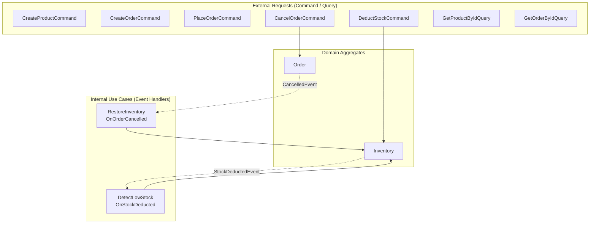
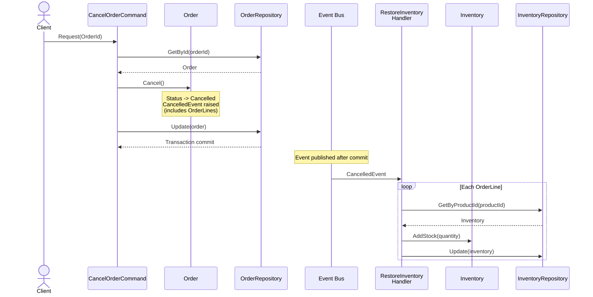
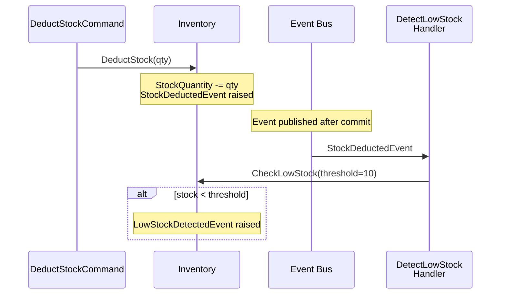

## Background

The business rules defined in the [domain business requirements](../domain/00-business-requirements/) focus on 'what is allowed and what is rejected.' Now we need to define **in what order to process, where to validate, and to whom to delegate** when a user request arrives.

The Application layer does not directly perform domain logic. It is a thin orchestration layer that receives user requests, validates input, delegates work to domain objects, and returns results. The core role of this layer is to orchestrate the entire flow from when a client request arrives, passes through domain objects, and reaches the repository.

## Overall Workflow Structure

The Application layer's workflow is triggered by two types of triggers: flows initiated by external requests (Command/Query) and internal reactive flows triggered by domain events.

## Workflow Rules

### 1. Product Management

When a product is registered, inventory is also initialized.

- Register a product by entering name, description, price, and initial stock quantity
- All input values are validated simultaneously and errors are returned at once
- Registration is rejected if a product with the same name already exists
- Product name, description, and price can be modified
- Uniqueness check during modification also verifies product name, excluding self
- Deleted products are rejected for modification by domain rules
- A product can be soft deleted with deleter information recorded
- A deleted product can be restored
- Stock can be deducted, and if insufficient, it is rejected by domain rules

### 2. Customer Management

- Create a customer by entering name, email, and credit limit
- All input values are validated simultaneously and errors are returned at once
- Creation is rejected if the same email already exists

### 3. Order Processing

- Create an order by entering customer, order line list, and shipping address
- Validate shipping address and quantity per order line
- Batch-query product prices included in order lines — do not query individually per product
- Products not found in query results are considered non-existent and rejected
- The customer's credit limit can be verified when creating an order
- The order is rejected if the credit limit is exceeded
- Stock deduction and order creation during order placement are processed atomically — if any one fails, everything is rolled back
- The order of order placement is: batch product price query -> stock availability verification and deduction -> credit limit verification -> order creation + stock save

### 4. Domain Event Reactive Workflows

The following workflows are triggered not by external requests but by domain events. They are internal use cases for eventual consistency between Aggregates.

- When an order is cancelled, deducted stock for each order line is automatically restored
- Stock restoration is processed independently per order line — one stock restoration failure does not block the rest
- Order does not know about Inventory — domain events loosely connect the two Aggregates
- When stock is deducted, if the remaining quantity is at or below the threshold, a low stock detection event is raised
- Low stock detection serves as an extension point for future external notification (email, Slack) integration

#### Order Cancellation -> Stock Restoration Flow

#### Stock Deduction -> Low Stock Detection Flow

### 5. Data Queries

Query requests do not change state and retrieve data directly in the needed format from the database.

- A product can be queried by ID for details
- The full product list can be queried
- Products can be searched by name and price range, with pagination and sorting support
- Products and inventory information can be queried together (with option to include/exclude products without inventory)
- A customer can be queried by ID for details
- A customer's order history can be queried with product names
- Per-customer order summaries (total order count, total spent, last order date) can be searched
- An order can be queried by ID for details
- Order history can be queried with product names
- Inventory can be searched with low stock filter support

### 6. Input Validation Rules

User requests are validated in two stages.

- Format validation: filters out syntactic issues like empty values, length overflow, and format errors first
- Requests that do not pass format validation do not enter the workflow
- Domain validation: validates semantic issues according to domain rules
- Multiple fields are validated simultaneously and all errors are returned at once — does not stop at the first error

### 7. Cross-Workflow Rules

- Requests that change state and requests that query data are processed through separate paths
- The query path retrieves data directly in the needed format without reconstructing domain objects
- All workflows return success or failure in a unified format
- External dependencies (repositories, read-only ports) are abstracted through interfaces

## Scenarios

The following scenarios verify how workflows actually operate.

### Normal Scenarios

1. **Product registration** — Validates 4 input values simultaneously, checks product name uniqueness, and creates both product and inventory.
2. **Customer creation** — Validates 3 input values simultaneously, checks email uniqueness, and creates the customer.
3. **Order creation (with credit limit)** — Batch-queries product prices, assembles order lines, validates credit limit, and creates the order.
4. **Order placement (multi-Aggregate write)** — Processes batch product price query -> stock deduction -> credit limit verification -> order creation + stock save as a single transaction.
5. **Product search** — Combines name, price range filters with pagination and sorting to query.
6. **Customer order history query** — Queries all orders and product names for a customer at once.
7. **Customer order summary search** — Aggregates total order count, total spent, and last order date per customer for querying.
8. **Stock restoration on order cancellation** — When an order is cancelled, deducted stock for each order line is automatically restored.
9. **Low stock detection** — When remaining quantity after stock deduction is at or below the threshold, a low stock detection event is raised.

### Rejection Scenarios

10. **Multiple validation failures** — When multiple input values are simultaneously wrong, all errors are returned at once. Does not stop at the first error.
11. **Duplicate rejection** — Attempting to create with an already existing product name or email is rejected.
12. **Non-existent product** — If a product included in an order line does not exist, it is rejected.
13. **Domain error propagation** — Domain rule violations like credit limit exceeded or insufficient stock are delivered to the caller.
14. **Insufficient stock rejection** — If stock is insufficient during order placement, the order is rejected and already deducted stock is rolled back.
15. **Format validation rejection** — Requests with incorrect format are rejected before entering the workflow.
16. **Order cancellation rejected after shipping** — Cancelling an order in Shipped or Delivered status is rejected.

## States That Must Never Exist

The following are states that must never occur in the Application layer.

- Domain objects created without passing domain validation
- Repetitive database calls due to per-product individual queries (cross-workflows not using batch queries)
- Mixed paths where state change requests return read-only results
- Direct dependency on external implementations infiltrating workflows
- Requests entering workflows without format validation
- States where query requests reconstruct and return domain objects

In the next step, we analyze these workflow rules to identify Use Cases and ports, and derive [type design decisions](./01-type-design-decisions/).
