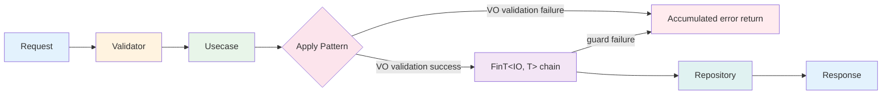

This document analyzes the workflows defined in natural language in the [business requirements](../00-business-requirements/) from an Application architecture perspective. The first step is to identify Use Cases (Commands/Queries) from workflows, and the second step is to derive the ports each Use Case requires. Following that, it covers the design decisions for Apply pattern (parallel validation), CQRS separation, port interfaces, DTO strategy, and error types.

## Workflow to Use Case Identification

Analyzing the workflows from the [business requirements](../00-business-requirements/), there are broadly two types of requests.

- **State-changing requests:** Product registration/modification/deletion/restoration, stock deduction, customer creation, order creation
- **Data query requests:** Product query/search, customer query, order query, inventory search

The basis for this separation can be found in the cross-workflow rules of the business requirements: "State-changing requests and data query requests are processed through separate paths." The read path retrieves data directly in the needed format without reconstructing domain objects, so it can be optimized independently of the write path.

State-changing requests are classified as Commands, and data query requests as Queries. Each Use Case handles one workflow unit.

### Use Case Catalog

#### Products

| Use Case | Type | Workflow |
|----------|------|----------|
| `CreateProductCommand` | Command | Product registration + inventory initialization |
| `UpdateProductCommand` | Command | Product modification (delete guard, product name uniqueness check) |
| `DeleteProductCommand` | Command | Product soft delete |
| `RestoreProductCommand` | Command | Restore deleted product |
| `DeductStockCommand` | Command | Stock deduction |
| `GetProductByIdQuery` | Query | Product detail query |
| `GetAllProductsQuery` | Query | All products query |
| `SearchProductsQuery` | Query | Product search — name, price range, pagination/sorting |
| `SearchProductsWithStockQuery` | Query | Product+stock query (excluding products without stock) |
| `SearchProductsWithOptionalStockQuery` | Query | Product+stock query (including products without stock) |

#### Customers

| Use Case | Type | Workflow |
|----------|------|----------|
| `CreateCustomerCommand` | Command | Customer creation (email uniqueness check) |
| `GetCustomerByIdQuery` | Query | Customer detail query |
| `GetCustomerOrdersQuery` | Query | Customer order history + product name query |
| `SearchCustomerOrderSummaryQuery` | Query | Per-customer order summary search |

#### Orders

| Use Case | Type | Workflow |
|----------|------|----------|
| `CreateOrderCommand` | Command | Order creation — batch product price query |
| `CreateOrderWithCreditCheckCommand` | Command | Order creation + credit limit verification |
| `PlaceOrderCommand` | Command | Order placement — credit verification + order creation + stock deduction (multi-Aggregate write) |
| `GetOrderByIdQuery` | Query | Order detail query |
| `GetOrderWithProductsQuery` | Query | Order + product name query |

#### Inventories

| Use Case | Type | Workflow |
|----------|------|----------|
| `SearchInventoryQuery` | Query | Inventory search — low stock filter, pagination/sorting |

10 Commands and 10 Queries are derived, totaling 20 Use Cases. Commands change state through the domain model, and Queries retrieve data directly from the database in the needed format.

## Use Case to Port Identification

For each Use Case to communicate with the external world (database, external APIs), interfaces (ports) are needed. Following the Command/Query separation, ports are also divided into three types.

- **Write Port (Repository):** Used by Command Use Cases to save and query domain objects. Defined in the Domain layer.
- **Read Port (Query Port):** Used by Query Use Cases to retrieve data in the desired format. Defined in the Application layer.
- **Special Port:** Dedicated port for cross-workflows. Used when data from another Aggregate is needed within a single Use Case, like batch-querying prices of multiple products during order creation.

While Write Ports guarantee domain model integrity, Read Ports focus on query performance. Since the query path does not reconstruct domain objects, complex JOINs and aggregate queries can be optimized without domain model constraints.

### Port Catalog

#### Write Ports (Defined in Domain Layer)

| Port | Aggregate | Purpose |
|------|-----------|---------|
| `IProductRepository` | Product | Product CRUD + uniqueness check + query including deleted |
| `ICustomerRepository` | Customer | Customer CRUD + uniqueness check |
| `IOrderRepository` | Order | Order CRUD |
| `IInventoryRepository` | Inventory | Inventory CRUD + per-product query |
| `ITagRepository` | Tag | Tag CRUD |

#### Read Ports (Defined in Application Layer)

| Port | Purpose |
|------|---------|
| `IProductQuery` | Product search + pagination |
| `IProductDetailQuery` | Single product detail query |
| `IProductWithStockQuery` | Product+stock query (products with stock only) |
| `IProductWithOptionalStockQuery` | Product+stock query (all products) |
| `ICustomerDetailQuery` | Single customer detail query |
| `ICustomerOrdersQuery` | Customer order history + product name query |
| `ICustomerOrderSummaryQuery` | Per-customer order summary aggregation |
| `IOrderDetailQuery` | Single order detail query |
| `IOrderWithProductsQuery` | Order + product name query |
| `IInventoryQuery` | Inventory search + pagination |

#### Special Ports (Cross-Workflow Dedicated)

| Port | Purpose |
|------|---------|
| `IProductCatalog` | Batch query prices for multiple products (prevents per-product individual queries) |
| `IExternalPricingService` | Query product prices from external API |

5 Write Ports, 10 Read Ports, and 2 Special Ports are derived. The detailed interface design of each port is covered in [Port Interface Design](#port-interface-design).

## Apply Pattern

When creating multiple Value Objects, this pattern **composes validation results in parallel** to collect all errors at once.

When a Use Case creates multiple Value Objects, the choice between sequential validation and parallel validation determines the user experience.

### Parallel Validation Composition: tuple of Validate() -> Apply() -> final type

Each VO's `Validate()` method returns `Validation<Error, T>`. Bundling these into a tuple and calling `Apply()` creates the final type on success and **accumulates all errors** on failure.

```csharp
// CreateProductCommand.Usecase — Apply pattern
private static Fin<ProductData> CreateProductData(Request request)
{
    // All fields: use VO Validate() (returns Validation<Error, T>)
    var name = ProductName.Validate(request.Name);
    var description = ProductDescription.Validate(request.Description);
    var price = Money.Validate(request.Price);
    var stockQuantity = Quantity.Validate(request.StockQuantity);

    // Bundle into tuple — parallel validation with Apply
    return (name, description, price, stockQuantity)
        .Apply((n, d, p, s) =>
            new ProductData(
                Product.Create(
                    ProductName.Create(n).ThrowIfFail(),
                    ProductDescription.Create(d).ThrowIfFail(),
                    Money.Create(p).ThrowIfFail()),
                Quantity.Create(s).ThrowIfFail()))
        .As()
        .ToFin();
}
```

### Apply vs Sequential

| Aspect | Apply (Parallel Composition) | Sequential (Sequential Composition) |
|--------|----------------------------|--------------------------------------|
| Error collection | Accumulates all field errors | Immediately stops at first failure |
| Target | VO validation (independent fields) | DB queries/saves (dependent operations) |
| Return type | `Validation<Error, T>` -> `.ToFin()` | `FinT<IO, T>` (from...in chain) |
| UX effect | "Name is wrong AND price is wrong" | "Name is wrong" (price not checked) |

**Design Decision:** Use Apply for VO validation, Sequential for DB operations. Since VO fields are independent of each other, parallel composition that shows all errors at once provides a better user experience. In contrast, DB operations (duplicate check -> save) depend on previous step results, so sequential execution is mandatory.

## CQRS Separation

Separates Command (write) and Query (read) at the interface level.

| Category | Request Interface | Handler Interface | Port Type |
|----------|-------------------|-------------------|-----------|
| Command | `ICommandRequest<TResponse>` | `ICommandUsecase<TRequest, TResponse>` | Write Port (`IRepository`) |
| Query | `IQueryRequest<TResponse>` | `IQueryUsecase<TRequest, TResponse>` | Read Port (`IQueryPort`) |

**Key Differences:**
- **Command Usecase** loads Domain Aggregates, executes domain logic, and saves via Repository. Since Aggregates are reconstructed, invariants are always guaranteed.
- **Query Usecase** projects directly to DTOs from the DB via Read Ports. Since Aggregates are not reconstructed, read performance is optimized.

```csharp
// Command: ICommandRequest -> ICommandUsecase -> IRepository
public sealed record Request(...) : ICommandRequest<Response>;
public sealed class Usecase(...) : ICommandUsecase<Request, Response> { ... }

// Query: IQueryRequest -> IQueryUsecase -> IQueryPort
public sealed record Request(...) : IQueryRequest<Response>;
public sealed class Usecase(...) : IQueryUsecase<Request, Response> { ... }
```

## Port Interface Design

The Application Layer defines two types of ports.

The Application layer communicates with the external world through Ports. Write Ports (Repositories) persist domain Aggregates, and Read Ports (Query Ports) project DTOs directly. Thanks to this separation, each port can be independently optimized and tested.

### Write Ports (Defined in Domain Layer, inheriting `IRepository<T, TId>`)

| Port | Aggregate | Custom Methods |
|------|-----------|---------------|
| `IProductRepository` | Product | `Exists(Specification)`, `GetByIdIncludingDeleted(ProductId)` |
| `ICustomerRepository` | Customer | `Exists(Specification)` |
| `IOrderRepository` | Order | (basic CRUD only) |
| `IInventoryRepository` | Inventory | `GetByProductId(ProductId)`, `Exists(Specification)` |
| `ITagRepository` | Tag | (basic CRUD only) |

Write Ports are defined in the Domain Layer. The `IRepository<T, TId>` base interface provides `Create`, `GetById`, `Update`, `Delete`, with custom methods added per Aggregate.

While Write Ports guarantee domain model integrity, Read Ports focus on query performance.

### Read Ports (Defined in Application Layer)

| Port | Base Interface | Return DTO | Purpose |
|------|---------------|-----------|---------|
| `IProductQuery` | `IQueryPort<Product, ProductSummaryDto>` | `ProductSummaryDto` | Specification-based search + pagination |
| `IProductDetailQuery` | `IQueryPort` | `ProductDetailDto` | Single query (`GetById`) |
| `IProductWithStockQuery` | `IQueryPort<Product, ProductWithStockDto>` | `ProductWithStockDto` | Product + Inventory JOIN |
| `IProductWithOptionalStockQuery` | `IQueryPort<Product, ProductWithOptionalStockDto>` | `ProductWithOptionalStockDto` | Product + Inventory LEFT JOIN |
| `ICustomerDetailQuery` | `IQueryPort` | `CustomerDetailDto` | Single query (`GetById`) |
| `ICustomerOrdersQuery` | `IQueryPort` | `CustomerOrdersDto` | Customer -> Order -> OrderLine -> Product 4-table JOIN |
| `ICustomerOrderSummaryQuery` | `IQueryPort<Customer, CustomerOrderSummaryDto>` | `CustomerOrderSummaryDto` | Customer + Order LEFT JOIN + GROUP BY aggregation |
| `IOrderDetailQuery` | `IQueryPort` | `OrderDetailDto` | Single query (`GetById`) |
| `IOrderWithProductsQuery` | `IQueryPort` | `OrderWithProductsDto` | Order + OrderLine + Product 3-table JOIN |
| `IInventoryQuery` | `IQueryPort<Inventory, InventorySummaryDto>` | `InventorySummaryDto` | Specification-based search + pagination |

Read Ports inherit `IQueryPort` (marker) or `IQueryPort<TEntity, TDto>` (Specification-based search). `IQueryPort<TEntity, TDto>` provides a `Search(Specification, PageRequest, SortExpression)` method by default.

### Special Ports (Cross-Aggregate Dedicated)

| Port | Base Interface | Return Type | Purpose |
|------|---------------|-----------|---------|
| `IProductCatalog` | `IObservablePort` | `Seq<(ProductId, Money)>` | Batch price query (N+1 prevention) |
| `IExternalPricingService` | `IObservablePort` | `Money`, `Map<string, Money>` | External API price query |

## DTO Strategy

The key decision of DTO strategy is 'where to define them.' Placing DTOs in separate files or shared projects makes navigation difficult and dependencies complex. Instead, nesting Request, Response, Validator, and Usecase inside a single sealed class lets you see the entire Use Case structure at a glance.

### Nested record: Define Request and Response inside Command/Query class

All Commands/Queries are declared as `sealed class`, with `Request`, `Response`, `Validator`, and `Usecase` placed as nested types inside. All types needed for a single use case are cohesive in one file.

```csharp
public sealed class CreateProductCommand
{
    public sealed record Request(...) : ICommandRequest<Response>;
    public sealed record Response(...);
    public sealed class Validator : AbstractValidator<Request> { ... }
    public sealed class Usecase(...) : ICommandUsecase<Request, Response> { ... }
}
```

### Query DTO: Read Port returns DTOs directly

DTO `record` types are defined alongside the Read Port interface file. Since data is projected directly from DB to DTO without reconstructing Aggregates, domain entities and read models are separated.

```csharp
// IProductQuery.cs — Interface and DTO defined in the same file
public interface IProductQuery : IQueryPort<Product, ProductSummaryDto> { }

public sealed record ProductSummaryDto(
    string ProductId,
    string Name,
    decimal Price);
```

### DTO Flow Difference Between Command and Query

| Category | Command | Query |
|----------|---------|-------|
| Input | `Request` -> VO creation -> Aggregate creation/modification | `Request` -> Specification assembly |
| Output | Aggregate -> `Response` mapping | DB -> DTO direct projection |
| Goes through domain model | Yes (invariant guarantee) | No (performance optimization) |

## N+1 Prevention

When creating orders, prices of multiple products need to be queried. Executing individual queries per product causes the N+1 problem.

### IProductCatalog: Single Round-Trip with Batch Query

```csharp
public interface IProductCatalog : IObservablePort
{
    /// Batch-queries prices for multiple products.
    /// Prevents N+1 round-trips with a WHERE IN query.
    FinT<IO, Seq<(ProductId Id, Money Price)>> GetPricesForProducts(
        IReadOnlyList<ProductId> productIds);
}
```

**Used in:** `CreateOrderCommand`, `CreateOrderWithCreditCheckCommand`, and `PlaceOrderCommand`.

```csharp
// CreateOrderCommand.Usecase — Batch price query then convert to dictionary
var productIds = lineRequests.Select(l => l.ProductId).Distinct().ToList();
var pricesResult = await _productCatalog.GetPricesForProducts(productIds).Run().RunAsync();
var priceLookup = pricesResult.ThrowIfFail().ToDictionary(p => p.Id, p => p.Price);
```

**Design Decision:** `IProductCatalog` is placed in the Application Layer's `Usecases/Orders/Ports/`. Unlike the Domain Layer's `IProductRepository`, this port is dedicated to cross-Aggregate querying and designed to meet the Order Usecase's requirements.

## Error Type Strategy

### ApplicationErrorType Hierarchy

`ApplicationErrorType` defines type-safe errors with a `sealed record` hierarchy.

| Error Type | Purpose | Usage Example |
|-----------|---------|--------------|
| `NotFound` | Value not found | Product ID query failure |
| `AlreadyExists` | Value already exists | Email/product name duplicate |
| `ValidationFailed(PropertyName?)` | Validation failure | VO creation failure propagation |
| `BusinessRuleViolated(RuleName?)` | Business rule violation | Credit limit exceeded |
| `ConcurrencyConflict` | Concurrency conflict | Inventory RowVersion mismatch |
| `Custom` (abstract) | Custom error base class | Domain-specific error derivation |

### ApplicationError.For\<TUsecase\>() Factory

Auto-generates error codes in `ApplicationErrors.{UsecaseName}.{ErrorName}` format.

```csharp
// Duplicate product name error
ApplicationError.For<CreateProductCommand>(
    new AlreadyExists(),
    request.Name,
    $"Product name already exists: '{request.Name}'")
// -> Error code: "ApplicationErrors.CreateProductCommand.AlreadyExists"

// Product not found error
ApplicationError.For<CreateOrderCommand>(
    new NotFound(),
    productId.ToString(),
    $"Product not found: '{productId}'")
// -> Error code: "ApplicationErrors.CreateOrderCommand.NotFound"
```

### Domain Error Propagation

`DomainErrorType` errors (e.g., credit limit exceeded) originating from the Domain Layer propagate naturally to the Application Layer within the `FinT<IO, T>` chain. The `FinT` monad automatically short-circuits on failure, so no separate error conversion code is needed.

## FinT\<IO, T\> LINQ Monad Transformer

`FinT<IO, T>` is a monad transformer that composes `IO` effects with `Fin<T>` results. LINQ `from...in` syntax sequentially chains asynchronous operations.

### Composing Operations with the from...in Pattern

```csharp
// CreateProductCommand.Usecase — Duplicate check -> Save -> Inventory creation
FinT<IO, Response> usecase =
    from exists in _productRepository.Exists(new ProductNameUniqueSpec(productName))
    from _ in guard(!exists, ApplicationError.For<CreateProductCommand>(
        new AlreadyExists(), request.Name,
        $"Product name already exists: '{request.Name}'"))
    from createdProduct in _productRepository.Create(product)
    from createdInventory in _inventoryRepository.Create(
        Inventory.Create(createdProduct.Id, stockQuantity))
    select new Response(...);

Fin<Response> response = await usecase.Run().RunAsync();
return response.ToFinResponse();
```

### Conditional Failure with guard()

`guard(condition, error)` short-circuits the chain to failure when the condition is `false`. Used when validating business rules based on Repository call results.

```csharp
// Failure on duplicate existence
from exists in _customerRepository.Exists(new CustomerEmailSpec(email))
from _ in guard(!exists, ApplicationError.For<CreateCustomerCommand>(
    new AlreadyExists(), request.Email,
    $"Email already exists: '{request.Email}'"))
```

### Repository + Domain Service Composition

```csharp
// CreateOrderWithCreditCheckCommand.Usecase — Customer query -> Credit verification -> Save
FinT<IO, Response> usecase =
    from customer in _customerRepository.GetById(customerId)
    from _ in _creditCheckService.ValidateCreditLimit(customer, newOrder.TotalAmount)
    from saved in _orderRepository.Create(newOrder)
    select new Response(...);
```

Repository calls (`_customerRepository.GetById`) and Domain Service calls (`_creditCheckService.ValidateCreditLimit`) compose naturally in the same `from...in` chain. Since the Domain Service returns `Fin<Unit>`, the chain automatically short-circuits on validation failure.

### Multi-Aggregate Write (Bind/Map)

When atomically saving multiple Aggregates in a single transaction, FinT chains are directly composed with `Bind` and `Map`. `PlaceOrderCommand` bundles Order creation and Inventory updates into a single IO effect, implementing the UoW (Unit of Work) pattern.

```csharp
// PlaceOrderCommand.Usecase — Multi-Aggregate write
FinT<IO, Response> usecase =
    _orderRepository.Create(order).Bind(saved =>
    _inventoryRepository.UpdateRange(deductedInventories).Map(updatedInventories =>
        new Response(
            saved.Id.ToString(),
            ...,
            updatedInventories.Select(inv => new DeductedStockInfo(
                inv.ProductId.ToString(),
                inv.StockQuantity)),
            saved.CreatedAt)));
```

`CreateProductCommand` also creates Product and Inventory together, but that is a simple pair creation. `PlaceOrderCommand` is distinguished as a **read -> validate -> multi-write** business transaction. Pre-validation (stock deduction, credit check) is performed imperatively, and only the final writes remain in the FinT chain, making the UoW boundary explicit.

## Mermaid Flowcharts

### Command Path

The Command path passes through FluentValidation syntax validation -> Apply pattern domain validation -> FinT LINQ chaining (guard, Repository) -> Response conversion. If any stage fails, the error is immediately propagated.



### Query Path

The Query path, unlike Commands, does not go through domain Aggregates. Specifications are assembled and passed to Read Ports, where DTOs are projected directly from the DB.

```mermaid
flowchart LR
    A[Request] --> B[Validator]
    B --> C[Usecase]
    C --> D[Specification assembly]
    D --> E["FinT&lt;IO, T&gt; chain"]
    E --> F[QueryPort]
    F --> G["DB -> DTO projection"]
    G --> H[Response]

    style A fill:#e3f2fd
    style B fill:#fff3e0
    style C fill:#e8f5e9
    style D fill:#fce4ec
    style E fill:#f3e5f5
    style F fill:#e0f2f1
    style G fill:#e0f2f1
    style H fill:#e3f2fd
```



Apply, CQRS, Port, and FinT are not independent patterns but are connected as a single pipeline. Apply validates input, CQRS separates read/write paths, Ports abstract external dependencies, and FinT manages the success/failure of the entire flow. Thanks to this combination, Use Case code focuses only on 'what to do,' while 'how to handle errors' is delegated to the type system.

How this type design is implemented using C# and Functorium building blocks is covered in the code design.
