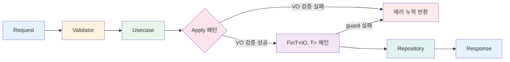
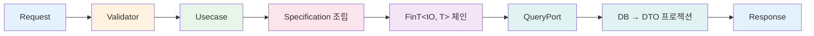

도메인 레이어에서 불변식을 타입으로 보장했다면, Application 레이어에서는 이 타입들을 조합하여 Use Case를 구성하는 전략을 설계합니다. 이 문서에서는 Apply 패턴(병렬 검증), CQRS 분리, 포트 인터페이스, DTO 전략, 에러 타입의 설계 의사결정을 다룹니다.

## Apply 패턴

Value Object를 여러 개 생성할 때, 각 검증 결과를 **병렬로 합성하여** 모든 에러를 한 번에 수집하는 패턴입니다.

Use Case가 여러 Value Object를 생성할 때, 순차 검증과 병렬 검증 중 어떤 전략을 선택하느냐가 사용자 경험을 좌우합니다.

### 병렬 검증 합성: tuple of Validate() → Apply() → final type

각 VO의 `Validate()` 메서드는 `Validation<Error, T>`를 반환합니다. 이들을 튜플로 묶은 뒤 `Apply()`를 호출하면, 성공 시 최종 타입을 생성하고 실패 시 **모든 에러를 누적합니다.**

```csharp
// CreateProductCommand.Usecase — Apply 패턴
private static Fin<ProductData> CreateProductData(Request request)
{
    // 모든 필드: VO Validate() 사용 (Validation<Error, T> 반환)
    var name = ProductName.Validate(request.Name);
    var description = ProductDescription.Validate(request.Description);
    var price = Money.Validate(request.Price);
    var stockQuantity = Quantity.Validate(request.StockQuantity);

    // 튜플로 병합 — Apply로 병렬 검증
    return (name, description, price, stockQuantity)
        .Apply((n, d, p, s) =>
            new ProductData(
                Product.Create(
                    ProductName.Create(n).ThrowIfFail(),
                    ProductDescription.Create(d).ThrowIfFail(),
                    Money.Create(p).ThrowIfFail()),
                Quantity.Create(s).ThrowIfFail()))
        .As()
        .ToFin();
}
```

### Apply vs Sequential

| 관점 | Apply (병렬 합성) | Sequential (순차 합성) |
|------|-------------------|----------------------|
| 에러 수집 | 모든 필드의 에러를 누적 | 첫 번째 실패 시 즉시 중단 |
| 적용 대상 | VO 검증 (독립적인 필드들) | DB 조회/저장 (의존 관계 있는 연산) |
| 반환 타입 | `Validation<Error, T>` → `.ToFin()` | `FinT<IO, T>` (from...in 체인) |
| UX 효과 | "이름도 틀렸고, 가격도 틀렸습니다" | "이름이 틀렸습니다" (가격은 검사 안 함) |

**설계 의사결정:** VO 검증에는 Apply, DB 연산에는 Sequential을 사용합니다. VO 필드들은 서로 독립적이므로 병렬 합성으로 모든 에러를 한 번에 보여주는 것이 사용자 경험에 유리합니다. 반면 DB 연산(중복 검사 → 저장)은 이전 단계 결과에 의존하므로 순차 실행이 필수입니다.

## CQRS 분리

Command(쓰기)와 Query(읽기)를 인터페이스 수준에서 분리합니다.

| 구분 | Request 인터페이스 | Handler 인터페이스 | 포트 유형 |
|------|-------------------|-------------------|----------|
| Command | `ICommandRequest<TResponse>` | `ICommandUsecase<TRequest, TResponse>` | Write Port (`IRepository`) |
| Query | `IQueryRequest<TResponse>` | `IQueryUsecase<TRequest, TResponse>` | Read Port (`IQueryPort`) |

**핵심 차이:**
- **Command Usecase는** Domain Aggregate를 로딩하고, 도메인 로직을 실행한 뒤, Repository를 통해 저장합니다. Aggregate를 재구성하므로 불변식이 항상 보장됩니다.
- **Query Usecase는** Read Port를 통해 DB에서 DTO로 직접 프로젝션합니다. Aggregate를 재구성하지 않으므로 읽기 성능이 최적화됩니다.

```csharp
// Command: ICommandRequest → ICommandUsecase → IRepository
public sealed record Request(...) : ICommandRequest<Response>;
public sealed class Usecase(...) : ICommandUsecase<Request, Response> { ... }

// Query: IQueryRequest → IQueryUsecase → IQueryPort
public sealed record Request(...) : IQueryRequest<Response>;
public sealed class Usecase(...) : IQueryUsecase<Request, Response> { ... }
```

## 포트 인터페이스 설계

Application Layer는 두 가지 유형의 포트를 정의합니다.

Application 레이어는 외부 세계와 포트(Port)를 통해 소통합니다. 쓰기 포트(Repository)는 도메인 Aggregate를 영속화하고, 읽기 포트(Query Port)는 DTO를 직접 프로젝션합니다. 이 분리 덕분에 각 포트를 독립적으로 최적화하고 테스트할 수 있습니다.

### Write Ports (Domain Layer 정의, `IRepository<T, TId>` 상속)

| Port | Aggregate | 커스텀 메서드 |
|------|-----------|-------------|
| `IProductRepository` | Product | `Exists(Specification)`, `GetByIdIncludingDeleted(ProductId)` |
| `ICustomerRepository` | Customer | `Exists(Specification)` |
| `IOrderRepository` | Order | (기본 CRUD만 사용) |
| `IInventoryRepository` | Inventory | `GetByProductId(ProductId)`, `Exists(Specification)` |
| `ITagRepository` | Tag | (기본 CRUD만 사용) |

Write Port는 Domain Layer에서 정의됩니다. `IRepository<T, TId>` 기본 인터페이스가 `Create`, `GetById`, `Update`, `Delete`를 제공하고, Aggregate별 커스텀 메서드를 추가합니다.

Write Port가 도메인 모델의 무결성을 보장하는 반면, Read Port는 조회 성능에 초점을 맞춥니다.

### Read Ports (Application Layer 정의)

| Port | 기반 인터페이스 | 반환 DTO | 용도 |
|------|---------------|---------|------|
| `IProductQuery` | `IQueryPort<Product, ProductSummaryDto>` | `ProductSummaryDto` | Specification 기반 검색 + 페이지네이션 |
| `IProductDetailQuery` | `IQueryPort` | `ProductDetailDto` | 단건 조회 (`GetById`) |
| `IProductWithStockQuery` | `IQueryPort<Product, ProductWithStockDto>` | `ProductWithStockDto` | Product + Inventory JOIN |
| `IProductWithOptionalStockQuery` | `IQueryPort<Product, ProductWithOptionalStockDto>` | `ProductWithOptionalStockDto` | Product + Inventory LEFT JOIN |
| `ICustomerDetailQuery` | `IQueryPort` | `CustomerDetailDto` | 단건 조회 (`GetById`) |
| `ICustomerOrdersQuery` | `IQueryPort` | `CustomerOrdersDto` | Customer → Order → OrderLine → Product 4-table JOIN |
| `ICustomerOrderSummaryQuery` | `IQueryPort<Customer, CustomerOrderSummaryDto>` | `CustomerOrderSummaryDto` | Customer + Order LEFT JOIN + GROUP BY 집계 |
| `IOrderDetailQuery` | `IQueryPort` | `OrderDetailDto` | 단건 조회 (`GetById`) |
| `IOrderWithProductsQuery` | `IQueryPort` | `OrderWithProductsDto` | Order + OrderLine + Product 3-table JOIN |
| `IInventoryQuery` | `IQueryPort<Inventory, InventorySummaryDto>` | `InventorySummaryDto` | Specification 기반 검색 + 페이지네이션 |

Read Port는 `IQueryPort`(마커) 또는 `IQueryPort<TEntity, TDto>`(Specification 기반 검색)를 상속합니다. `IQueryPort<TEntity, TDto>`는 `Search(Specification, PageRequest, SortExpression)` 메서드를 기본 제공합니다.

### Special Ports (교차 Aggregate 전용)

| Port | 기반 인터페이스 | 반환 타입 | 용도 |
|------|---------------|---------|------|
| `IProductCatalog` | `IObservablePort` | `Seq<(ProductId, Money)>` | 배치 가격 조회 (N+1 방지) |
| `IExternalPricingService` | `IObservablePort` | `Money`, `Map<string, Money>` | 외부 API 가격 조회 |

## DTO 전략

DTO 전략의 핵심 의사결정은 '어디에 정의할 것인가'입니다. 별도 파일이나 공유 프로젝트에 DTO를 두면 탐색이 어렵고 의존성이 복잡해집니다. 대신 Request, Response, Validator, Usecase를 하나의 sealed class에 중첩하면, Use Case의 전체 구조를 한 눈에 파악할 수 있습니다.

### Nested record: Request, Response를 Command/Query 클래스 내부에 정의

모든 Command/Query는 `sealed class`로 선언하고, 그 안에 `Request`, `Response`, `Validator`, `Usecase`를 중첩 타입으로 배치합니다. 하나의 유스케이스에 필요한 모든 타입이 한 파일에 응집됩니다.

```csharp
public sealed class CreateProductCommand
{
    public sealed record Request(...) : ICommandRequest<Response>;
    public sealed record Response(...);
    public sealed class Validator : AbstractValidator<Request> { ... }
    public sealed class Usecase(...) : ICommandUsecase<Request, Response> { ... }
}
```

### Query DTO: Read Port가 DTO를 직접 반환

Read Port 인터페이스 파일에 DTO `record`를 함께 정의합니다. Aggregate를 재구성하지 않고 DB에서 DTO로 직접 프로젝션하므로, 도메인 엔티티와 읽기 모델이 분리됩니다.

```csharp
// IProductQuery.cs — 인터페이스와 DTO를 같은 파일에 정의
public interface IProductQuery : IQueryPort<Product, ProductSummaryDto> { }

public sealed record ProductSummaryDto(
    string ProductId,
    string Name,
    decimal Price);
```

### Command vs Query의 DTO 흐름 차이

| 구분 | Command | Query |
|------|---------|-------|
| 입력 | `Request` → VO 생성 → Aggregate 생성/변경 | `Request` → Specification 조립 |
| 출력 | Aggregate → `Response` 매핑 | DB → DTO 직접 프로젝션 |
| 도메인 모델 경유 | O (불변식 보장) | X (성능 최적화) |

## N+1 방지

주문 생성 시 여러 상품의 가격을 조회해야 합니다. 상품별로 개별 쿼리를 실행하면 N+1 문제가 발생합니다.

### IProductCatalog: 배치 쿼리로 단일 라운드트립

```csharp
public interface IProductCatalog : IObservablePort
{
    /// 복수 상품의 가격을 일괄 조회합니다.
    /// WHERE IN 쿼리로 N+1 라운드트립을 방지합니다.
    FinT<IO, Seq<(ProductId Id, Money Price)>> GetPricesForProducts(
        IReadOnlyList<ProductId> productIds);
}
```

**사용 위치:** `CreateOrderCommand`와 `CreateOrderWithCreditCheckCommand` 모두에서 사용합니다.

```csharp
// CreateOrderCommand.Usecase — 배치 가격 조회 후 딕셔너리로 변환
var productIds = lineRequests.Select(l => l.ProductId).Distinct().ToList();
var pricesResult = await _productCatalog.GetPricesForProducts(productIds).Run().RunAsync();
var priceLookup = pricesResult.ThrowIfFail().ToDictionary(p => p.Id, p => p.Price);
```

**설계 의사결정:** `IProductCatalog`를 Application Layer의 `Usecases/Orders/Ports/`에 배치했습니다. Domain Layer의 `IProductRepository`와 달리, 이 포트는 교차 Aggregate 조회 전용이며 Order Usecase의 요구사항에 맞춰 설계되었기 때문입니다.

## 에러 타입 전략

### ApplicationErrorType 계층 구조

`ApplicationErrorType`은 `sealed record` 계층으로 타입 안전한 에러를 정의합니다.

| 에러 타입 | 용도 | 사용 예 |
|----------|------|--------|
| `NotFound` | 값을 찾을 수 없음 | 상품 ID로 조회 실패 |
| `AlreadyExists` | 값이 이미 존재 | 이메일/상품명 중복 |
| `ValidationFailed(PropertyName?)` | 검증 실패 | VO 생성 실패 전파 |
| `BusinessRuleViolated(RuleName?)` | 비즈니스 규칙 위반 | 신용 한도 초과 |
| `ConcurrencyConflict` | 동시성 충돌 | 재고 RowVersion 불일치 |
| `Custom` (abstract) | 커스텀 에러 기본 클래스 | 도메인 특화 에러 파생 |

### ApplicationError.For\<TUsecase\>() 팩토리

에러 코드를 `ApplicationErrors.{UsecaseName}.{ErrorName}` 형식으로 자동 생성합니다.

```csharp
// 상품명 중복 에러
ApplicationError.For<CreateProductCommand>(
    new AlreadyExists(),
    request.Name,
    $"Product name already exists: '{request.Name}'")
// → 에러 코드: "ApplicationErrors.CreateProductCommand.AlreadyExists"

// 상품 미존재 에러
ApplicationError.For<CreateOrderCommand>(
    new NotFound(),
    productId.ToString(),
    $"Product not found: '{productId}'")
// → 에러 코드: "ApplicationErrors.CreateOrderCommand.NotFound"
```

### 도메인 에러 전파

Domain Layer에서 발생한 `DomainErrorType` 에러(예: 신용 한도 초과)는 `FinT<IO, T>` 체인 내에서 자연스럽게 Application Layer로 전파됩니다. `FinT` 모나드가 실패를 자동으로 단락(short-circuit)하므로 별도의 에러 변환 코드가 필요하지 않습니다.

## FinT\<IO, T\> LINQ 모나드 트랜스포머

`FinT<IO, T>`는 `IO` 효과와 `Fin<T>` 결과를 합성하는 모나드 트랜스포머입니다. LINQ `from...in` 구문으로 비동기 연산을 순차 체이닝합니다.

### from...in 패턴으로 연산 합성

```csharp
// CreateProductCommand.Usecase — 중복 검사 → 저장 → 재고 생성
FinT<IO, Response> usecase =
    from exists in _productRepository.Exists(new ProductNameUniqueSpec(productName))
    from _ in guard(!exists, ApplicationError.For<CreateProductCommand>(
        new AlreadyExists(), request.Name,
        $"Product name already exists: '{request.Name}'"))
    from createdProduct in _productRepository.Create(product)
    from createdInventory in _inventoryRepository.Create(
        Inventory.Create(createdProduct.Id, stockQuantity))
    select new Response(...);

Fin<Response> response = await usecase.Run().RunAsync();
return response.ToFinResponse();
```

### guard()를 사용한 조건부 실패

`guard(condition, error)`는 조건이 `false`일 때 체인을 실패로 단락시킵니다. Repository 호출 결과를 기반으로 비즈니스 규칙을 검증할 때 사용합니다.

```csharp
// 중복 존재 시 실패
from exists in _customerRepository.Exists(new CustomerEmailSpec(email))
from _ in guard(!exists, ApplicationError.For<CreateCustomerCommand>(
    new AlreadyExists(), request.Email,
    $"Email already exists: '{request.Email}'"))
```

### Repository + Domain Service 합성

```csharp
// CreateOrderWithCreditCheckCommand.Usecase — 고객 조회 → 신용 검증 → 저장
FinT<IO, Response> usecase =
    from customer in _customerRepository.GetById(customerId)
    from _ in _creditCheckService.ValidateCreditLimit(customer, newOrder.TotalAmount)
    from saved in _orderRepository.Create(newOrder)
    select new Response(...);
```

Repository 호출(`_customerRepository.GetById`)과 Domain Service 호출(`_creditCheckService.ValidateCreditLimit`)이 동일한 `from...in` 체인에서 자연스럽게 합성됩니다. Domain Service가 `Fin<Unit>`을 반환하므로 검증 실패 시 체인이 자동으로 단락됩니다.

## Mermaid 플로우차트

### Command 경로

Command 경로는 FluentValidation 구문 검증 → Apply 패턴 도메인 검증 → FinT LINQ 체이닝(guard, Repository) → Response 변환을 거칩니다. 어느 단계에서든 실패하면 에러가 즉시 전파됩니다.



### Query 경로

Query 경로는 Command와 달리 도메인 Aggregate를 거치지 않습니다. Specification을 조립하여 Read Port에 전달하면, DB에서 DTO로 직접 프로젝션됩니다.



Apply, CQRS, Port, FinT는 독립적인 패턴이 아니라 하나의 파이프라인으로 연결됩니다. Apply가 입력을 검증하고, CQRS가 읽기/쓰기 경로를 분리하고, Port가 외부 의존성을 추상화하고, FinT가 전체 흐름의 성공/실패를 관리합니다. 이 조합 덕분에 Use Case 코드는 '무엇을 하는가'에만 집중하고, '에러 처리를 어떻게 하는가'는 타입 시스템에 위임할 수 있습니다.

이 타입 설계를 C#과 Functorium 빌딩 블록으로 어떻게 구현하는지 코드 설계에서 다룹니다.
