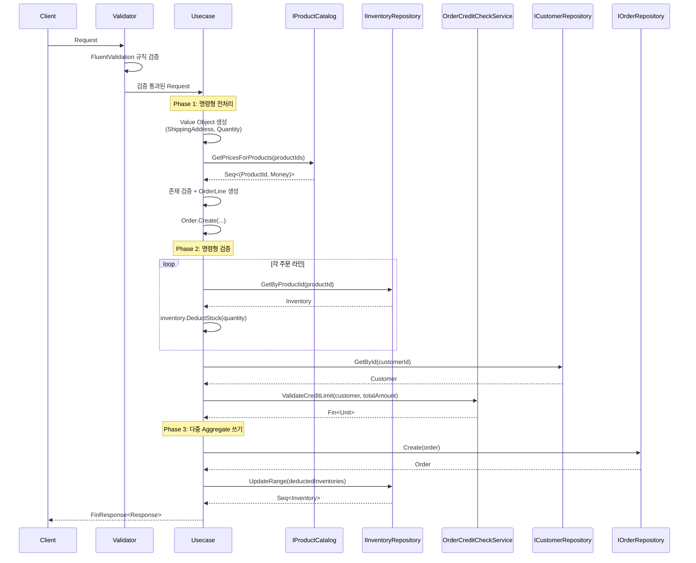

[비즈니스 요구사항](../00-business-requirements/)에서 자연어로 정의한 워크플로우를, [타입 설계 의사결정](../01-type-design-decisions/)에서 Use Case와 포트로 분류하고 패턴 전략을 도출했습니다. 이 문서에서는 그 설계를 C# 코드로 구현합니다. Apply 패턴, FinT LINQ 체이닝, FluentValidation 연동, 배치 쿼리 등 각 패턴이 실제 코드에서 어떻게 동작하는지 살펴봅니다.

다음 표는 설계 의사결정과 구현 패턴의 1:1 매핑입니다. 이후 섹션에서 각 패턴을 코드로 살펴봅니다.

## 설계 의사결정 → C# 구현 매핑

| 설계 의사결정 | 구현 패턴 | 적용 예 | 효과 |
|---|---|---|---|
| Command/Query 분리 | `ICommandRequest<Response>` / `IQueryRequest<Response>` | CreateProductCommand, SearchProductsQuery | 읽기/쓰기 책임 분리, 파이프라인별 독립 처리 |
| 중첩 클래스 응집 | `sealed class` 안에 Request, Response, Validator, Usecase 중첩 | 모든 Command/Query | 한 파일에서 전체 유스케이스 파악, 네임스페이스 오염 방지 |
| Applicative 검증 | `(VO.Validate(...), ...).Apply(...)` 튜플 합성 | CreateProductCommand, CreateCustomerCommand | 모든 필드 검증 에러를 한 번에 수집 |
| FinT 모나드 체이닝 | `FinT<IO, T>` LINQ 쿼리 표현식 | 모든 Usecase | 비동기 IO + 실패 가능성을 선언적으로 합성 |
| guard() 조건부 실패 | `guard(!exists, ApplicationError.For<T>(...))` | 중복 검사, 존재 검증 | 불리언 조건을 FinT 체인에 삽입 |
| FluentValidation + VO 검증 연동 | `MustSatisfyValidation(VO.Validate)` | CreateProductCommand.Validator | Presentation 계층 검증과 도메인 VO 검증 규칙 단일 소스 |
| 배치 쿼리 Port | `IProductCatalog.GetPricesForProducts()` | CreateOrderCommand | N+1 라운드트립 방지, 단일 WHERE IN 쿼리 |
| Domain Service 통합 | Usecase에서 `OrderCreditCheckService` 호출 | CreateOrderWithCreditCheckCommand, PlaceOrderCommand | 교차 Aggregate 규칙을 Application에서 오케스트레이션 |
| 다중 Aggregate 쓰기 | `Bind`/`Map`으로 FinT 체인 합성, `UpdateRange` 사용 | PlaceOrderCommand | 주문 생성 + 재고 차감을 하나의 UoW로 원자 처리 |
| 타입화된 에러 | `ApplicationError.For<T>(new AlreadyExists(), ...)` | 모든 Command Usecase | 에러에 출처 타입 + 분류 + 메시지 포함 |

## 패턴별 코드

### 1. Command Usecase 구조

Application 레이어의 모든 Use Case는 동일한 구조 규칙을 따릅니다. 이 일관된 구조 덕분에 새로운 Use Case를 추가할 때 패턴을 고민할 필요 없이 기존 구조를 복제하면 됩니다.

모든 Command는 하나의 `sealed class` 안에 4가지 중첩 타입을 정의합니다.

```csharp
public sealed class CreateProductCommand
{
    // 1. Request - ICommandRequest<Response> 구현
    public sealed record Request(
        string Name,
        string Description,
        decimal Price,
        int StockQuantity) : ICommandRequest<Response>;

    // 2. Response - sealed record
    public sealed record Response(
        string ProductId,
        string Name,
        string Description,
        decimal Price,
        int StockQuantity,
        DateTime CreatedAt);

    // 3. Validator - AbstractValidator<Request>
    public sealed class Validator : AbstractValidator<Request>
    {
        public Validator()
        {
            RuleFor(x => x.Name).MustSatisfyValidation(ProductName.Validate);
            RuleFor(x => x.Description).MustSatisfyValidation(ProductDescription.Validate);
            RuleFor(x => x.Price).MustSatisfyValidation(Money.Validate);
            RuleFor(x => x.StockQuantity).MustSatisfyValidation(Quantity.Validate);
        }
    }

    // 4. Usecase - ICommandUsecase<Request, Response> 구현
    public sealed class Usecase(
        IProductRepository productRepository,
        IInventoryRepository inventoryRepository)
        : ICommandUsecase<Request, Response>
    {
        public async ValueTask<FinResponse<Response>> Handle(
            Request request, CancellationToken cancellationToken)
        {
            // ... 구현
        }
    }
}
```

| 중첩 타입 | 역할 | 인터페이스 |
|---|---|---|
| `Request` | 입력 DTO (sealed record) | `ICommandRequest<Response>` |
| `Response` | 출력 DTO (sealed record) | 없음 |
| `Validator` | FluentValidation 규칙 | `AbstractValidator<Request>` |
| `Usecase` | 비즈니스 로직 오케스트레이션 | `ICommandUsecase<Request, Response>` |

`CreateProductCommand.Request`처럼 정규화된 이름이 곧 유스케이스 식별자가 됩니다. Mediator가 `Request` 타입으로 `Usecase`를 자동 라우팅합니다.

### 2. Query Usecase 구조

Command가 도메인 모델을 거쳐 상태를 변경하는 반면, Query는 Read Port를 통해 DTO로 직접 프로젝션합니다. 구조는 동일하되 데이터 흐름이 다릅니다.

Query도 동일한 중첩 클래스 패턴을 따르되, `IQueryRequest<Response>`와 `IQueryUsecase<Request, Response>`를 사용합니다.

**GetProductByIdQuery** -- 단건 조회:

```csharp
public sealed class GetProductByIdQuery
{
    public sealed record Request(string ProductId) : IQueryRequest<Response>;

    public sealed record Response(
        string ProductId,
        string Name,
        string Description,
        decimal Price,
        DateTime CreatedAt,
        Option<DateTime> UpdatedAt);

    public sealed class Usecase(IProductDetailQuery productDetailQuery)
        : IQueryUsecase<Request, Response>
    {
        private readonly IProductDetailQuery _productDetailQuery = productDetailQuery;

        public async ValueTask<FinResponse<Response>> Handle(
            Request request, CancellationToken cancellationToken)
        {
            var productId = ProductId.Create(request.ProductId);
            FinT<IO, Response> usecase =
                from result in _productDetailQuery.GetById(productId)
                select new Response(
                    result.ProductId,
                    result.Name,
                    result.Description,
                    result.Price,
                    result.CreatedAt,
                    result.UpdatedAt);

            Fin<Response> response = await usecase.Run().RunAsync();
            return response.ToFinResponse();
        }
    }
}
```

**SearchProductsQuery** -- Specification 조합 + 페이지네이션:

```csharp
public sealed class SearchProductsQuery
{
    public sealed record Request(
        Option<string> Name = default,
        Option<decimal> MinPrice = default,
        Option<decimal> MaxPrice = default,
        int Page = 1,
        int PageSize = PageRequest.DefaultPageSize,
        string SortBy = "",
        string SortDirection = "") : IQueryRequest<Response>;

    public sealed record Response(
        IReadOnlyList<ProductSummaryDto> Products,
        int TotalCount,
        int Page,
        int PageSize,
        int TotalPages,
        bool HasNextPage,
        bool HasPreviousPage);

    public sealed class Usecase(IProductQuery productQuery)
        : IQueryUsecase<Request, Response>
    {
        private readonly IProductQuery _productQuery = productQuery;

        public async ValueTask<FinResponse<Response>> Handle(
            Request request, CancellationToken cancellationToken)
        {
            var spec = BuildSpecification(request);
            var pageRequest = new PageRequest(request.Page, request.PageSize);
            var sortExpression = SortExpression.By(request.SortBy, SortDirection.Parse(request.SortDirection));

            FinT<IO, Response> usecase =
                from result in _productQuery.Search(spec, pageRequest, sortExpression)
                select new Response(
                    result.Items,
                    result.TotalCount,
                    result.Page,
                    result.PageSize,
                    result.TotalPages,
                    result.HasNextPage,
                    result.HasPreviousPage);

            Fin<Response> response = await usecase.Run().RunAsync();
            return response.ToFinResponse();
        }
    }
}
```

Query Usecase는 Read Adapter(IProductQuery, IProductDetailQuery)를 통해 Aggregate 재구성 없이 DTO로 직접 프로젝션합니다. Repository를 거치지 않으므로 불필요한 엔티티 매핑 오버헤드가 없습니다.

### 3. Apply 패턴: tuple Validate() + Apply()

여러 Value Object를 동시에 검증하고 모든 에러를 한 번에 수집하는 applicative 합성 패턴입니다.

**CreateProductCommand** -- 4개 VO 병렬 검증:

```csharp
private static Fin<ProductData> CreateProductData(Request request)
{
    // 모든 필드: VO Validate() 사용 (Validation<Error, T> 반환)
    var name = ProductName.Validate(request.Name);
    var description = ProductDescription.Validate(request.Description);
    var price = Money.Validate(request.Price);
    var stockQuantity = Quantity.Validate(request.StockQuantity);

    // 모두 튜플로 병합 - Apply로 병렬 검증
    return (name, description, price, stockQuantity)
        .Apply((n, d, p, s) =>
            new ProductData(
                Product.Create(
                    ProductName.Create(n).ThrowIfFail(),
                    ProductDescription.Create(d).ThrowIfFail(),
                    Money.Create(p).ThrowIfFail()),
                Quantity.Create(s).ThrowIfFail()))
        .As()
        .ToFin();
}
```

**CreateCustomerCommand** -- 3개 VO 병렬 검증:

```csharp
private static Fin<Customer> CreateCustomer(Request request)
{
    var name = CustomerName.Validate(request.Name);
    var email = Email.Validate(request.Email);
    var creditLimit = Money.Validate(request.CreditLimit);

    return (name, email, creditLimit)
        .Apply((n, e, c) =>
            Customer.Create(
                CustomerName.Create(n).ThrowIfFail(),
                Email.Create(e).ThrowIfFail(),
                Money.Create(c).ThrowIfFail()))
        .As()
        .ToFin();
}
```

Apply 패턴의 핵심은 **단일 검증 실패가 나머지 검증을 중단하지 않는다는 점입니다.** 4개 필드 중 3개가 잘못되면 3개의 에러가 모두 수집됩니다. 이는 `Validation<Error, T>`의 applicative 특성 덕분이며, 모나드(`Fin<T>`)의 순차 실행과 구별됩니다.

| 단계 | 타입 | 설명 |
|---|---|---|
| `VO.Validate(value)` | `Validation<Error, T>` | 개별 필드 검증 |
| `(v1, v2, ...).Apply(...)` | `Validation<Error, R>` | 에러 누적 합성 |
| `.As()` | `Validation<Error, R>` | 타입 정리 |
| `.ToFin()` | `Fin<R>` | Usecase 체인에 합류 |

Apply 패턴의 핵심은 `Validation<Error, T>`의 applicative 특성입니다. 4개 VO의 `Validate()`가 모두 실행되어 에러가 누적됩니다. 하나라도 실패하면 나머지도 검증하되 모든 에러를 한번에 반환합니다. 이는 `Fin<T>`(모나드)의 순차 실행과 구별되는 핵심 차이점입니다.

### 4. FinT&lt;IO, T&gt; LINQ 체이닝

Apply 패턴으로 입력 검증을 마쳤다면, 이제 검증된 값을 사용하여 DB 연산을 수행합니다. 이 단계에서는 `FinT<IO, T>` 모나드 트랜스포머가 비동기 IO와 실패 가능성을 하나의 체인으로 합성합니다.

`FinT<IO, T>`는 IO 효과(`IO<A>`)와 실패 가능성(`Fin<T>`)을 결합한 모나드 트랜스포머입니다. LINQ 쿼리 표현식으로 비동기 작업을 선언적으로 합성합니다.

**CreateProductCommand** -- 중복 검사 → 저장 → Inventory 생성:

```csharp
FinT<IO, Response> usecase =
    from exists in _productRepository.Exists(new ProductNameUniqueSpec(productName))
    from _ in guard(!exists, ApplicationError.For<CreateProductCommand>(
        new AlreadyExists(),
        request.Name,
        $"Product name already exists: '{request.Name}'"))
    from createdProduct in _productRepository.Create(product)
    from createdInventory in _inventoryRepository.Create(
        Inventory.Create(createdProduct.Id, stockQuantity))
    select new Response(
        createdProduct.Id.ToString(),
        createdProduct.Name,
        createdProduct.Description,
        createdProduct.Price,
        createdInventory.StockQuantity,
        createdProduct.CreatedAt);

Fin<Response> response = await usecase.Run().RunAsync();
return response.ToFinResponse();
```

**DeleteProductCommand** -- let 바인딩 + 간결한 체인:

```csharp
FinT<IO, Response> usecase =
    from product in _productRepository.GetByIdIncludingDeleted(productId)
    let deleted = product.Delete(request.DeletedBy)
    from updated in _productRepository.Update(deleted)
    select new Response(updated.Id.ToString());
```

**DeductStockCommand** -- 도메인 메서드 결과를 체인에 삽입:

```csharp
FinT<IO, Response> usecase =
    from inventory in _inventoryRepository.GetByProductId(productId)
    from _1 in inventory.DeductStock(quantity)
    from updated in _inventoryRepository.Update(inventory)
    select new Response(
        updated.ProductId.ToString(),
        updated.StockQuantity);
```

`inventory.DeductStock(quantity)`는 `Fin<Unit>`을 반환하지만, LINQ 체이닝에서 `FinT<IO, Unit>`으로 자동 리프팅됩니다. 재고 부족 시 `Fin.Fail`이 되어 이후 체인이 실행되지 않습니다.

모든 Usecase의 실행 마무리 패턴은 동일합니다:

```csharp
Fin<Response> response = await usecase.Run().RunAsync();
return response.ToFinResponse();
```

| 메서드 | 역할 |
|---|---|
| `.Run()` | `FinT<IO, T>` → `IO<Fin<T>>` (모나드 트랜스포머 해제) |
| `.RunAsync()` | `IO<Fin<T>>` → `ValueTask<Fin<T>>` (IO 효과 실행) |
| `.ToFinResponse()` | `Fin<T>` → `FinResponse<T>` (Application 응답 변환) |

### 5. guard() 조건부 실패

FinT 체인 내부에서 불리언 조건을 검증해야 할 때 `guard()`를 사용합니다. Repository 호출 결과를 기반으로 비즈니스 규칙을 확인하는 것이 대표적인 사례입니다.

`guard(condition, error)`는 불리언 조건을 FinT 체인에 삽입합니다. 조건이 `false`이면 에러를 반환하고 체인을 중단합니다.

**중복 검사 (AlreadyExists):**

```csharp
from exists in _productRepository.Exists(new ProductNameUniqueSpec(productName))
from _ in guard(!exists, ApplicationError.For<CreateProductCommand>(
    new AlreadyExists(),
    request.Name,
    $"Product name already exists: '{request.Name}'"))
```

**업데이트 시 자기 자신 제외 중복 검사:**

```csharp
from exists in _productRepository.Exists(new ProductNameUniqueSpec(name, productId))
from _ in guard(!exists, ApplicationError.For<UpdateProductCommand>(
    new AlreadyExists(),
    request.Name,
    $"Product name already exists: '{request.Name}'"))
```

**존재하지 않는 상품 검증 (NotFound):**

```csharp
if (!priceLookup.TryGetValue(productId, out var unitPrice))
    return FinResponse.Fail<Response>(ApplicationError.For<CreateOrderCommand>(
        new NotFound(),
        productId.ToString(),
        $"Product not found: '{productId}'"));
```

`guard`는 LINQ 체인 내부에서 사용하고, `if` 분기는 체인 바깥에서 조기 반환할 때 사용합니다. 두 경우 모두 `ApplicationError.For<T>()`로 에러를 생성합니다.

### 6. FluentValidation + MustSatisfyValidation

Validator는 FluentValidation의 `AbstractValidator<Request>`를 상속하고, `MustSatisfyValidation` 확장 메서드로 도메인 VO의 `Validate` 메서드를 직접 연동합니다.

**CreateProductCommand.Validator** -- VO 검증 규칙 재사용:

```csharp
public sealed class Validator : AbstractValidator<Request>
{
    public Validator()
    {
        RuleFor(x => x.Name).MustSatisfyValidation(ProductName.Validate);
        RuleFor(x => x.Description).MustSatisfyValidation(ProductDescription.Validate);
        RuleFor(x => x.Price).MustSatisfyValidation(Money.Validate);
        RuleFor(x => x.StockQuantity).MustSatisfyValidation(Quantity.Validate);
    }
}
```

**UpdateProductCommand.Validator** -- ID 형식 검증 + VO 검증 혼합:

```csharp
public sealed class Validator : AbstractValidator<Request>
{
    public Validator()
    {
        RuleFor(x => x.ProductId)
            .NotEmpty()
            .Must(id => ProductId.TryParse(id, null, out _))
            .WithMessage("Invalid product ID format");

        RuleFor(x => x.Name).MustSatisfyValidation(ProductName.Validate);
        RuleFor(x => x.Description).MustSatisfyValidation(ProductDescription.Validate);
        RuleFor(x => x.Price).MustSatisfyValidation(Money.Validate);
    }
}
```

**CreateOrderCommand.Validator** -- 컬렉션 검증 + 자식 규칙:

```csharp
public sealed class Validator : AbstractValidator<Request>
{
    public Validator()
    {
        RuleFor(x => x.CustomerId)
            .NotEmpty().WithMessage("Customer ID is required");

        RuleFor(x => x.OrderLines)
            .Must(lines => !lines.IsEmpty).WithMessage("At least one order line is required");

        RuleForEach(x => x.OrderLines).ChildRules(line =>
        {
            line.RuleFor(l => l.ProductId)
                .NotEmpty().WithMessage("Product ID is required");
            line.RuleFor(l => l.Quantity)
                .GreaterThan(0).WithMessage("Order quantity must be greater than 0");
        });

        RuleFor(x => x.ShippingAddress)
            .NotEmpty().WithMessage("Shipping address is required")
            .MaximumLength(ShippingAddress.MaxLength)
            .WithMessage($"Shipping address must not exceed {ShippingAddress.MaxLength} characters");
    }
}
```

**SearchProductsQuery.Validator** -- Option&lt;T&gt; 선택적 필드 검증:

```csharp
public sealed class Validator : AbstractValidator<Request>
{
    public Validator()
    {
        RuleFor(x => x.Name)
            .MustSatisfyValidation(ProductName.Validate);

        this.MustBePairedRange(
            x => x.MinPrice,
            x => x.MaxPrice,
            Money.Validate,
            inclusive: true);

        RuleFor(x => x.SortBy).MustBeOneOf(AllowedSortFields);

        RuleFor(x => x.SortDirection)
            .MustBeEnumValue<Request, SortDirection>();
    }
}
```

Validator 검증 전략 요약:

| 검증 방식 | 사용 시점 | 예 |
|---|---|---|
| `MustSatisfyValidation(VO.Validate)` | VO 검증 규칙을 그대로 재사용 | ProductName, Money, Quantity |
| `MustSatisfyValidation` (Option 오버로드) | Option&lt;T&gt; 선택적 필드 (None → 스킵) | SearchProductsQuery의 Name |
| `MustBePairedRange` | 반드시 함께 제공되는 쌍 범위 필터 | MinPrice/MaxPrice |
| `Must(id => XxxId.TryParse(...))` | ID 형식 검증 | ProductId, CustomerId |
| `RuleForEach(...).ChildRules(...)` | 컬렉션 항목별 검증 | OrderLines의 ProductId, Quantity |
| `MustBeEnumValue<T, TEnum>()` | 문자열 → Enum 변환 검증 | SortDirection |

FluentValidation과 VO.Validate의 역할 분담이 핵심입니다. FluentValidation은 Presentation 계층에서 구문 검증을 수행하여 잘못된 요청을 조기에 거부합니다. VO.Validate는 Use Case 내부에서 도메인 검증을 수행합니다. `MustSatisfyValidation`이 두 세계를 연결하여, VO의 검증 규칙을 FluentValidation에서 재사용할 수 있게 합니다.

### 7. ApplicationError.For&lt;T&gt;() 에러 생성

`ApplicationError.For<T>()`는 에러에 출처 타입을 자동으로 포함합니다. `ApplicationErrorType`의 하위 레코드로 에러 분류를 표현합니다.

```csharp
// 이미 존재하는 리소스
ApplicationError.For<CreateProductCommand>(
    new AlreadyExists(),
    request.Name,
    $"Product name already exists: '{request.Name}'")

// 리소스를 찾을 수 없음
ApplicationError.For<CreateOrderCommand>(
    new NotFound(),
    productId.ToString(),
    $"Product not found: '{productId}'")

// 이메일 중복
ApplicationError.For<CreateCustomerCommand>(
    new AlreadyExists(),
    request.Email,
    $"Email already exists: '{request.Email}'")
```

도메인 에러가 Application 계층을 관통하는 경우도 있습니다. `DeductStockCommand`에서 `inventory.DeductStock(quantity)`가 `InsufficientStock` 도메인 에러를 반환하면, FinT 체인이 이를 그대로 전파합니다.

| 에러 타입 | 의미 | 사용 위치 |
|---|---|---|
| `AlreadyExists` | 중복 리소스 | CreateProduct, UpdateProduct, CreateCustomer |
| `NotFound` | 존재하지 않는 리소스 | CreateOrder (상품 미존재) |
| 도메인 에러 전파 | VO/Aggregate 검증 실패 | DeductStock (InsufficientStock), Order.Create (EmptyOrderLines) |

### 8. IProductCatalog 배치 쿼리 패턴

교차 Aggregate 검증에서 N+1 문제를 방지하기 위해 배치 조회 전용 Port를 정의합니다.

**Port 정의:**

```csharp
public interface IProductCatalog : IObservablePort
{
    FinT<IO, Seq<(ProductId Id, Money Price)>> GetPricesForProducts(
        IReadOnlyList<ProductId> productIds);
}
```

**CreateOrderCommand에서 사용:**

```csharp
// 2. 라인별 Quantity 검증 + ProductId 수집
var lineRequests = new List<(ProductId ProductId, Quantity Quantity)>();
foreach (var lineReq in request.OrderLines)
{
    var productId = ProductId.Create(lineReq.ProductId);
    var quantityResult = Quantity.Create(lineReq.Quantity);
    if (quantityResult.IsFail)
        return FinResponse.Fail<Response>(...);

    lineRequests.Add((productId, (Quantity)quantityResult));
}

// 3. 배치 가격 조회 (단일 라운드트립)
var productIds = lineRequests.Select(l => l.ProductId).Distinct().ToList();
var pricesResult = await _productCatalog.GetPricesForProducts(productIds).Run().RunAsync();
if (pricesResult.IsFail)
    return FinResponse.Fail<Response>(...);

var priceLookup = pricesResult.ThrowIfFail().ToDictionary(p => p.Id, p => p.Price);

// 4. 존재 검증 + OrderLine 생성
foreach (var (productId, quantity) in lineRequests)
{
    if (!priceLookup.TryGetValue(productId, out var unitPrice))
        return FinResponse.Fail<Response>(ApplicationError.For<CreateOrderCommand>(
            new NotFound(),
            productId.ToString(),
            $"Product not found: '{productId}'"));

    var orderLineResult = OrderLine.Create(productId, quantity, unitPrice);
    // ...
}
```

주문에 10개 상품이 포함되어도 `GetPricesForProducts`는 단일 WHERE IN 쿼리로 모든 가격을 조회합니다. 반환된 Dictionary에 없는 `ProductId`는 존재하지 않는 상품이므로 `NotFound` 에러를 반환합니다.

배치 쿼리 패턴의 핵심은 교차 Aggregate 조회에서 발생하는 N+1 문제를 포트 수준에서 해결하는 것입니다. 인터페이스 계약 자체가 `IReadOnlyList<ProductId>`를 받으므로, 구현체가 단일 쿼리로 처리하도록 강제합니다.

### 9. Domain Service 통합

`CreateOrderWithCreditCheckCommand`는 `OrderCreditCheckService` Domain Service를 사용하여 교차 Aggregate 비즈니스 규칙(고객 신용 한도 검증)을 오케스트레이션합니다.

```csharp
public sealed class Usecase(
    ICustomerRepository customerRepository,
    IOrderRepository orderRepository,
    IProductCatalog productCatalog)
    : ICommandUsecase<Request, Response>
{
    private readonly ICustomerRepository _customerRepository = customerRepository;
    private readonly IOrderRepository _orderRepository = orderRepository;
    private readonly IProductCatalog _productCatalog = productCatalog;
    private readonly OrderCreditCheckService _creditCheckService = new();

    public async ValueTask<FinResponse<Response>> Handle(
        Request request, CancellationToken cancellationToken)
    {
        // 1~5. Value Object 생성, 배치 가격 조회, OrderLine/Order 생성 (생략)

        // 6. 고객 조회 → 신용 검증 → 저장
        FinT<IO, Response> usecase =
            from customer in _customerRepository.GetById(customerId)
            from _ in _creditCheckService.ValidateCreditLimit(customer, newOrder.TotalAmount)
            from saved in _orderRepository.Create(newOrder)
            select new Response(
                saved.Id.ToString(),
                Seq(saved.OrderLines.Select(l => new OrderLineResponse(
                    l.ProductId.ToString(),
                    l.Quantity,
                    l.UnitPrice,
                    l.LineTotal))),
                saved.TotalAmount,
                saved.ShippingAddress,
                saved.CreatedAt);

        Fin<Response> response = await usecase.Run().RunAsync();
        return response.ToFinResponse();
    }
}
```

`_creditCheckService.ValidateCreditLimit(customer, newOrder.TotalAmount)`는 `Fin<Unit>`을 반환합니다. 신용 한도 초과 시 `CreditLimitExceeded` 도메인 에러가 FinT 체인을 중단하여 `_orderRepository.Create`가 실행되지 않습니다.

Application Layer는 Domain Service를 **직접 인스턴스화**(`new()`)합니다. Domain Service는 상태가 없는 순수 로직이므로 DI 컨테이너가 불필요합니다. 필요한 데이터(Customer, TotalAmount)는 Application Layer가 Repository를 통해 조회한 뒤 최소 인자로 전달합니다.

### 10. 다중 Aggregate 쓰기 (PlaceOrderCommand)

`CreateProductCommand`는 Product와 Inventory를 함께 생성하지만, 그것은 단순한 쌍 생성입니다. `PlaceOrderCommand`는 **읽기 → 검증 → 다중 Aggregate 쓰기**라는 실제 비즈니스 트랜잭션을 구현합니다. 상품 가격 조회, 재고 가용성 검증 및 차감, 고객 신용 검증을 거친 뒤, 주문 생성과 재고 업데이트를 하나의 트랜잭션으로 원자 처리합니다.

Usecase는 세 단계로 구성됩니다.

**Phase 1 — 명령형 전처리:** VO 파싱, 배치 가격 조회, OrderLine 생성, Order 생성. `CreateOrderWithCreditCheckCommand`와 동일한 패턴입니다.

**Phase 2 — 명령형 검증:** 재고 조회 + 차감, 고객 조회 + 신용 검증. `GetByProductId`는 `FinT<IO>`(async)이지만 `DeductStock`은 `Fin<Unit>`(sync 도메인 로직)이므로, 두 타입을 명령형 흐름에서 각각 실행하고 실패 시 조기 반환합니다.

```csharp
// Phase 2: 재고 검증 + 차감 (명령형)
var deductedInventories = new List<Inventory>();
foreach (var (productId, quantity) in lineRequests)
{
    var inventoryResult = await _inventoryRepository.GetByProductId(productId).Run().RunAsync();
    if (inventoryResult.IsFail)
        return FinResponse.Fail<Response>(inventoryResult.Match(
            Succ: _ => throw new InvalidOperationException(), Fail: e => e));

    var inventory = inventoryResult.ThrowIfFail();
    var deductResult = inventory.DeductStock(quantity);
    if (deductResult.IsFail)
        return FinResponse.Fail<Response>(deductResult.Match(
            Succ: _ => throw new InvalidOperationException(), Fail: e => e));

    deductedInventories.Add(inventory);
}
```

**Phase 3 — FinT 체인 (다중 Aggregate 쓰기):** 사전 검증을 모두 통과한 뒤, Order 저장과 Inventory 일괄 업데이트만 FinT로 합성합니다. `Bind`/`Map`을 사용하여 두 쓰기 연산을 하나의 IO 효과로 묶습니다.

```csharp
// Phase 3: FinT 체인 — 다중 Aggregate 쓰기 (Order + Inventory)
FinT<IO, Response> usecase =
    _orderRepository.Create(order).Bind(saved =>
    _inventoryRepository.UpdateRange(deductedInventories).Map(updatedInventories =>
        new Response(
            saved.Id.ToString(),
            Seq(saved.OrderLines.Select(l => new OrderLineResponse(
                l.ProductId.ToString(), l.Quantity, l.UnitPrice, l.LineTotal))),
            saved.TotalAmount,
            saved.ShippingAddress,
            updatedInventories.Select(inv => new DeductedStockInfo(
                inv.ProductId.ToString(), inv.StockQuantity)),
            saved.CreatedAt)));
```

Response에 `DeductedStocks`를 포함하여 Inventory 변경 결과를 호출자에게 노출합니다. 이로써 "주문이 생성되었고, 재고가 이만큼 차감되었다"는 사실을 하나의 응답에서 확인할 수 있습니다.

**Bind/Map vs LINQ `from...in`:** `CreateProductCommand`는 LINQ 쿼리 표현식으로 Product와 Inventory 생성을 합성합니다. `PlaceOrderCommand`는 `Bind`/`Map`을 직접 사용합니다. FinT 체인에 `Seq<T>` 반환 타입(`UpdateRange`)이 포함될 때 C# 컴파일러의 SelectMany 오버로드 해석이 모호해지기 때문입니다. `Bind`/`Map`은 동일한 모나드 합성을 명시적으로 수행하므로, 의미 차이는 없습니다.

## CreateOrderWithCreditCheck 흐름

다음 시퀀스 다이어그램은 `CreateOrderWithCreditCheckCommand`의 전체 흐름을 보여줍니다. FluentValidation 검증 → Value Object 생성 → 배치 가격 조회 → 고객 조회 → 신용한도 검증 → 주문 저장의 6단계를 거칩니다.


## PlaceOrder 흐름

다음 시퀀스 다이어그램은 `PlaceOrderCommand`의 전체 흐름을 보여줍니다. `CreateOrderWithCreditCheckCommand`와 달리, 재고 검증·차감 단계가 추가되고, 최종 쓰기에서 Order와 Inventory 두 Aggregate를 원자적으로 저장합니다.



[구현 결과](./03-implementation-results/)에서 이 패턴들이 비즈니스 시나리오를 어떻게 보장하는지 확인합니다.
