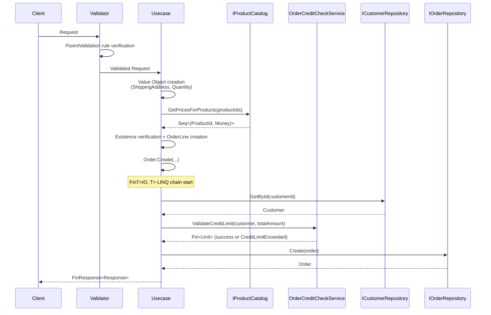
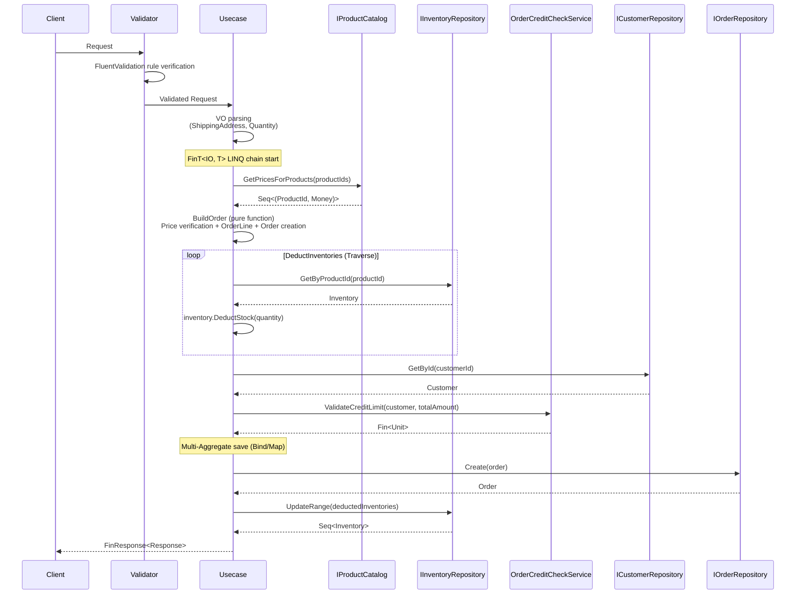

The workflows defined in natural language in the [business requirements](../00-business-requirements/) were classified into Use Cases and ports with pattern strategies derived in the [type design decisions](../01-type-design-decisions/). This document implements those designs in C# code. It examines how each pattern — Apply pattern, FinT LINQ chaining, FluentValidation integration, batch queries, and more — works in actual code.

The following table shows the 1:1 mapping between design decisions and implementation patterns. Each pattern is examined in code in the subsequent sections.

## Design Decision to C# Implementation Mapping

| Design Decision | Implementation Pattern | Example | Effect |
|---|---|---|---|
| Command/Query separation | `ICommandRequest<Response>` / `IQueryRequest<Response>` | CreateProductCommand, SearchProductsQuery | Read/write responsibility separation, independent processing per pipeline |
| Nested class cohesion | `sealed class` with nested Request, Response, Validator, Usecase | All Commands/Queries | Entire use case visible in one file, namespace pollution prevention |
| Applicative validation | `(VO.Validate(...), ...).Apply(...)` tuple composition | CreateProductCommand, CreateCustomerCommand | All field validation errors collected at once |
| FinT monad chaining | `FinT<IO, T>` LINQ query expression | All Usecases | Async IO + failure possibility composed declaratively |
| guard() conditional failure | `guard(!exists, ApplicationError.For<T>(...))` | Duplicate check, existence verification | Boolean condition inserted into FinT chain |
| FluentValidation + VO validation integration | `MustSatisfyValidation(VO.Validate)` | CreateProductCommand.Validator | Single source for presentation layer validation and domain VO validation rules |
| Batch query Port | `IProductCatalog.GetPricesForProducts()` | CreateOrderCommand | N+1 round-trip prevention, single WHERE IN query |
| Domain Service integration | Usecase calls `OrderCreditCheckService` | CreateOrderWithCreditCheckCommand, PlaceOrderCommand | Cross-Aggregate rules orchestrated in Application |
| Multi-Aggregate write | FinT chain composed with `Bind`/`Map`, using `UpdateRange` | PlaceOrderCommand | Order creation + stock deduction atomic in one UoW |
| Typed errors | `ApplicationError.For<T>(new AlreadyExists(), ...)` | All Command Usecases | Error includes source type + classification + message |

## Code by Pattern

### 1. Command Usecase Structure

All Use Cases in the Application layer follow the same structural rules. Thanks to this consistent structure, there is no need to deliberate on patterns when adding new Use Cases — just replicate the existing structure.

All Commands define 4 nested types inside a single `sealed class`.

```csharp
public sealed class CreateProductCommand
{
    // 1. Request - Implements ICommandRequest<Response>
    public sealed record Request(
        string Name,
        string Description,
        decimal Price,
        int StockQuantity) : ICommandRequest<Response>;

    // 2. Response - sealed record
    public sealed record Response(
        string ProductId,
        string Name,
        string Description,
        decimal Price,
        int StockQuantity,
        DateTime CreatedAt);

    // 3. Validator - AbstractValidator<Request>
    public sealed class Validator : AbstractValidator<Request>
    {
        public Validator()
        {
            RuleFor(x => x.Name).MustSatisfyValidation(ProductName.Validate);
            RuleFor(x => x.Description).MustSatisfyValidation(ProductDescription.Validate);
            RuleFor(x => x.Price).MustSatisfyValidation(Money.Validate);
            RuleFor(x => x.StockQuantity).MustSatisfyValidation(Quantity.Validate);
        }
    }

    // 4. Usecase - Implements ICommandUsecase<Request, Response>
    public sealed class Usecase(
        IProductRepository productRepository,
        IInventoryRepository inventoryRepository)
        : ICommandUsecase<Request, Response>
    {
        public async ValueTask<FinResponse<Response>> Handle(
            Request request, CancellationToken cancellationToken)
        {
            // ... implementation
        }
    }
}
```

| Nested Type | Role | Interface |
|---|---|---|
| `Request` | Input DTO (sealed record) | `ICommandRequest<Response>` |
| `Response` | Output DTO (sealed record) | None |
| `Validator` | FluentValidation rules | `AbstractValidator<Request>` |
| `Usecase` | Business logic orchestration | `ICommandUsecase<Request, Response>` |

The fully qualified name like `CreateProductCommand.Request` serves as the use case identifier. Mediator auto-routes from `Request` type to `Usecase`.

### 2. Query Usecase Structure

While Commands change state through the domain model, Queries project directly to DTOs via Read Ports. The structure is the same but the data flow differs.

Queries follow the same nested class pattern, using `IQueryRequest<Response>` and `IQueryUsecase<Request, Response>`.

**GetProductByIdQuery** -- Single item query:

```csharp
public sealed class GetProductByIdQuery
{
    public sealed record Request(string ProductId) : IQueryRequest<Response>;

    public sealed record Response(
        string ProductId,
        string Name,
        string Description,
        decimal Price,
        DateTime CreatedAt,
        Option<DateTime> UpdatedAt);

    public sealed class Usecase(IProductDetailQuery productDetailQuery)
        : IQueryUsecase<Request, Response>
    {
        private readonly IProductDetailQuery _productDetailQuery = productDetailQuery;

        public async ValueTask<FinResponse<Response>> Handle(
            Request request, CancellationToken cancellationToken)
        {
            var productId = ProductId.Create(request.ProductId);
            FinT<IO, Response> usecase =
                from result in _productDetailQuery.GetById(productId)
                select new Response(
                    result.ProductId,
                    result.Name,
                    result.Description,
                    result.Price,
                    result.CreatedAt,
                    result.UpdatedAt);

            Fin<Response> response = await usecase.Run().RunAsync();
            return response.ToFinResponse();
        }
    }
}
```

**SearchProductsQuery** -- Specification composition + pagination:

```csharp
public sealed class SearchProductsQuery
{
    public sealed record Request(
        Option<string> Name = default,
        Option<decimal> MinPrice = default,
        Option<decimal> MaxPrice = default,
        int Page = 1,
        int PageSize = PageRequest.DefaultPageSize,
        string SortBy = "",
        string SortDirection = "") : IQueryRequest<Response>;

    public sealed record Response(
        IReadOnlyList<ProductSummaryDto> Products,
        int TotalCount,
        int Page,
        int PageSize,
        int TotalPages,
        bool HasNextPage,
        bool HasPreviousPage);

    public sealed class Usecase(IProductQuery productQuery)
        : IQueryUsecase<Request, Response>
    {
        private readonly IProductQuery _productQuery = productQuery;

        public async ValueTask<FinResponse<Response>> Handle(
            Request request, CancellationToken cancellationToken)
        {
            var spec = BuildSpecification(request);
            var pageRequest = new PageRequest(request.Page, request.PageSize);
            var sortExpression = SortExpression.By(request.SortBy, SortDirection.Parse(request.SortDirection));

            FinT<IO, Response> usecase =
                from result in _productQuery.Search(spec, pageRequest, sortExpression)
                select new Response(
                    result.Items,
                    result.TotalCount,
                    result.Page,
                    result.PageSize,
                    result.TotalPages,
                    result.HasNextPage,
                    result.HasPreviousPage);

            Fin<Response> response = await usecase.Run().RunAsync();
            return response.ToFinResponse();
        }
    }
}
```

Query Usecases project directly to DTOs via Read Adapters (IProductQuery, IProductDetailQuery) without Aggregate reconstruction. Since they do not go through Repositories, there is no unnecessary entity mapping overhead.

### 3. Apply Pattern: tuple Validate() + Apply()

An applicative composition pattern that validates multiple Value Objects simultaneously and collects all errors at once.

**CreateProductCommand** -- 4 VO parallel validation:

```csharp
private static Fin<ProductData> CreateProductData(Request request)
{
    // All fields: use VO Validate() (returns Validation<Error, T>)
    var name = ProductName.Validate(request.Name);
    var description = ProductDescription.Validate(request.Description);
    var price = Money.Validate(request.Price);
    var stockQuantity = Quantity.Validate(request.StockQuantity);

    // Bundle all into tuple - parallel validation with Apply
    return (name, description, price, stockQuantity)
        .Apply((n, d, p, s) =>
            new ProductData(
                Product.Create(
                    ProductName.Create(n).ThrowIfFail(),
                    ProductDescription.Create(d).ThrowIfFail(),
                    Money.Create(p).ThrowIfFail()),
                Quantity.Create(s).ThrowIfFail()))
        .As()
        .ToFin();
}
```

**CreateCustomerCommand** -- 3 VO parallel validation:

```csharp
private static Fin<Customer> CreateCustomer(Request request)
{
    var name = CustomerName.Validate(request.Name);
    var email = Email.Validate(request.Email);
    var creditLimit = Money.Validate(request.CreditLimit);

    return (name, email, creditLimit)
        .Apply((n, e, c) =>
            Customer.Create(
                CustomerName.Create(n).ThrowIfFail(),
                Email.Create(e).ThrowIfFail(),
                Money.Create(c).ThrowIfFail()))
        .As()
        .ToFin();
}
```

The core of the Apply pattern is that **a single validation failure does not stop the remaining validations.** If 3 out of 4 fields are wrong, all 3 errors are collected. This is thanks to the applicative nature of `Validation<Error, T>`, which is distinguished from the sequential execution of monads (`Fin<T>`).

| Step | Type | Description |
|---|---|---|
| `VO.Validate(value)` | `Validation<Error, T>` | Individual field validation |
| `(v1, v2, ...).Apply(...)` | `Validation<Error, R>` | Error-accumulating composition |
| `.As()` | `Validation<Error, R>` | Type cleanup |
| `.ToFin()` | `Fin<R>` | Joins the Usecase chain |

The core of the Apply pattern is the applicative nature of `Validation<Error, T>`. All 4 VOs' `Validate()` are executed and errors accumulate. If any one fails, the rest are still validated and all errors are returned at once. This is the key difference from the sequential execution of `Fin<T>` (monad).

### 4. FinT&lt;IO, T&gt; LINQ Chaining

After completing input validation with the Apply pattern, the validated values are used to perform DB operations. In this stage, the `FinT<IO, T>` monad transformer composes async IO and failure possibility into a single chain.

`FinT<IO, T>` is a monad transformer combining IO effects (`IO<A>`) with failure possibility (`Fin<T>`). LINQ query expressions declaratively compose asynchronous operations.

**CreateProductCommand** -- Duplicate check -> Save -> Inventory creation:

```csharp
FinT<IO, Response> usecase =
    from exists in _productRepository.Exists(new ProductNameUniqueSpec(productName))
    from _ in guard(!exists, ApplicationError.For<CreateProductCommand>(
        new AlreadyExists(),
        request.Name,
        $"Product name already exists: '{request.Name}'"))
    from createdProduct in _productRepository.Create(product)
    from createdInventory in _inventoryRepository.Create(
        Inventory.Create(createdProduct.Id, stockQuantity))
    select new Response(
        createdProduct.Id.ToString(),
        createdProduct.Name,
        createdProduct.Description,
        createdProduct.Price,
        createdInventory.StockQuantity,
        createdProduct.CreatedAt);

Fin<Response> response = await usecase.Run().RunAsync();
return response.ToFinResponse();
```

**DeleteProductCommand** -- let binding + concise chain:

```csharp
FinT<IO, Response> usecase =
    from product in _productRepository.GetByIdIncludingDeleted(productId)
    let deleted = product.Delete(request.DeletedBy)
    from updated in _productRepository.Update(deleted)
    select new Response(updated.Id.ToString());
```

**DeductStockCommand** -- Inserting domain method results into the chain:

```csharp
FinT<IO, Response> usecase =
    from inventory in _inventoryRepository.GetByProductId(productId)
    from _1 in inventory.DeductStock(quantity)
    from updated in _inventoryRepository.Update(inventory)
    select new Response(
        updated.ProductId.ToString(),
        updated.StockQuantity);
```

`inventory.DeductStock(quantity)` returns `Fin<Unit>`, but in LINQ chaining it is auto-lifted to `FinT<IO, Unit>`. On insufficient stock, `Fin.Fail` stops the subsequent chain from executing.

The execution completion pattern is the same for all Usecases:

```csharp
Fin<Response> response = await usecase.Run().RunAsync();
return response.ToFinResponse();
```

| Method | Role |
|---|---|
| `.Run()` | `FinT<IO, T>` -> `IO<Fin<T>>` (monad transformer unwrap) |
| `.RunAsync()` | `IO<Fin<T>>` -> `ValueTask<Fin<T>>` (IO effect execution) |
| `.ToFinResponse()` | `Fin<T>` -> `FinResponse<T>` (Application response conversion) |

### 5. guard() Conditional Failure

When a boolean condition needs to be verified inside a FinT chain, `guard()` is used. A typical case is validating business rules based on Repository call results.

`guard(condition, error)` inserts a boolean condition into the FinT chain. If the condition is `false`, it returns an error and aborts the chain.

**Duplicate check (AlreadyExists):**

```csharp
from exists in _productRepository.Exists(new ProductNameUniqueSpec(productName))
from _ in guard(!exists, ApplicationError.For<CreateProductCommand>(
    new AlreadyExists(),
    request.Name,
    $"Product name already exists: '{request.Name}'"))
```

**Duplicate check excluding self during update:**

```csharp
from exists in _productRepository.Exists(new ProductNameUniqueSpec(name, productId))
from _ in guard(!exists, ApplicationError.For<UpdateProductCommand>(
    new AlreadyExists(),
    request.Name,
    $"Product name already exists: '{request.Name}'"))
```

**Non-existent product validation (NotFound):**

```csharp
if (!priceLookup.TryGetValue(productId, out var unitPrice))
    return FinResponse.Fail<Response>(ApplicationError.For<CreateOrderCommand>(
        new NotFound(),
        productId.ToString(),
        $"Product not found: '{productId}'"));
```

`guard` is used inside LINQ chains, and `if` branching is used for early returns outside the chain. Both cases create errors with `ApplicationError.For<T>()`.

### 6. FluentValidation + MustSatisfyValidation

Validators inherit from FluentValidation's `AbstractValidator<Request>` and directly integrate domain VO `Validate` methods via the `MustSatisfyValidation` extension method.

**CreateProductCommand.Validator** -- VO validation rule reuse:

```csharp
public sealed class Validator : AbstractValidator<Request>
{
    public Validator()
    {
        RuleFor(x => x.Name).MustSatisfyValidation(ProductName.Validate);
        RuleFor(x => x.Description).MustSatisfyValidation(ProductDescription.Validate);
        RuleFor(x => x.Price).MustSatisfyValidation(Money.Validate);
        RuleFor(x => x.StockQuantity).MustSatisfyValidation(Quantity.Validate);
    }
}
```

**UpdateProductCommand.Validator** -- ID format validation + VO validation mixed:

```csharp
public sealed class Validator : AbstractValidator<Request>
{
    public Validator()
    {
        RuleFor(x => x.ProductId)
            .NotEmpty()
            .Must(id => ProductId.TryParse(id, null, out _))
            .WithMessage("Invalid product ID format");

        RuleFor(x => x.Name).MustSatisfyValidation(ProductName.Validate);
        RuleFor(x => x.Description).MustSatisfyValidation(ProductDescription.Validate);
        RuleFor(x => x.Price).MustSatisfyValidation(Money.Validate);
    }
}
```

**CreateOrderCommand.Validator** -- Collection validation + child rules:

```csharp
public sealed class Validator : AbstractValidator<Request>
{
    public Validator()
    {
        RuleFor(x => x.CustomerId)
            .NotEmpty().WithMessage("Customer ID is required");

        RuleFor(x => x.OrderLines)
            .Must(lines => !lines.IsEmpty).WithMessage("At least one order line is required");

        RuleForEach(x => x.OrderLines).ChildRules(line =>
        {
            line.RuleFor(l => l.ProductId)
                .NotEmpty().WithMessage("Product ID is required");
            line.RuleFor(l => l.Quantity)
                .GreaterThan(0).WithMessage("Order quantity must be greater than 0");
        });

        RuleFor(x => x.ShippingAddress)
            .NotEmpty().WithMessage("Shipping address is required")
            .MaximumLength(ShippingAddress.MaxLength)
            .WithMessage($"Shipping address must not exceed {ShippingAddress.MaxLength} characters");
    }
}
```

**SearchProductsQuery.Validator** -- Option&lt;T&gt; optional field validation:

```csharp
public sealed class Validator : AbstractValidator<Request>
{
    public Validator()
    {
        RuleFor(x => x.Name)
            .MustSatisfyValidation(ProductName.Validate);

        this.MustBePairedRange(
            x => x.MinPrice,
            x => x.MaxPrice,
            Money.Validate,
            inclusive: true);

        RuleFor(x => x.SortBy).MustBeOneOf(AllowedSortFields);

        RuleFor(x => x.SortDirection)
            .MustBeEnumValue<Request, SortDirection>();
    }
}
```

Validator validation strategy summary:

| Validation Method | When to Use | Example |
|---|---|---|
| `MustSatisfyValidation(VO.Validate)` | Directly reuse VO validation rules | ProductName, Money, Quantity |
| `MustSatisfyValidation` (Option overload) | Optional field with Option&lt;T&gt; (skip on None) | SearchProductsQuery Name |
| `MustBePairedRange` | Paired range filter that must be provided together | MinPrice/MaxPrice |
| `Must(id => XxxId.TryParse(...))` | ID format validation | ProductId, CustomerId |
| `RuleForEach(...).ChildRules(...)` | Per-item validation in collections | OrderLines ProductId, Quantity |
| `MustBeEnumValue<T, TEnum>()` | String -> Enum conversion validation | SortDirection |

The role separation between FluentValidation and VO.Validate is key. FluentValidation performs syntactic validation at the Presentation layer to reject malformed requests early. VO.Validate performs domain validation inside the Use Case. `MustSatisfyValidation` bridges the two worlds, allowing VO validation rules to be reused in FluentValidation.

### 7. ApplicationError.For&lt;T&gt;() Error Creation

`ApplicationError.For<T>()` automatically includes the source type in the error. Error classification is expressed through `ApplicationErrorType` sub-records.

```csharp
// Already existing resource
ApplicationError.For<CreateProductCommand>(
    new AlreadyExists(),
    request.Name,
    $"Product name already exists: '{request.Name}'")

// Resource not found
ApplicationError.For<CreateOrderCommand>(
    new NotFound(),
    productId.ToString(),
    $"Product not found: '{productId}'")

// Email duplicate
ApplicationError.For<CreateCustomerCommand>(
    new AlreadyExists(),
    request.Email,
    $"Email already exists: '{request.Email}'")
```

Domain errors can also pass through the Application layer. In `DeductStockCommand`, when `inventory.DeductStock(quantity)` returns an `InsufficientStock` domain error, the FinT chain propagates it as-is.

| Error Type | Meaning | Usage Location |
|---|---|---|
| `AlreadyExists` | Duplicate resource | CreateProduct, UpdateProduct, CreateCustomer |
| `NotFound` | Non-existent resource | CreateOrder (product not found) |
| Domain error propagation | VO/Aggregate validation failure | DeductStock (InsufficientStock), Order.Create (EmptyOrderLines) |

### 8. IProductCatalog Batch Query Pattern

A dedicated batch query Port is defined to prevent N+1 problems in cross-Aggregate validation.

**Port definition:**

```csharp
public interface IProductCatalog : IObservablePort
{
    FinT<IO, Seq<(ProductId Id, Money Price)>> GetPricesForProducts(
        IReadOnlyList<ProductId> productIds);
}
```

**Usage in CreateOrderCommand:**

```csharp
// 2. Per-line Quantity validation + ProductId collection
var lineRequests = new List<(ProductId ProductId, Quantity Quantity)>();
foreach (var lineReq in request.OrderLines)
{
    var productId = ProductId.Create(lineReq.ProductId);
    var quantityResult = Quantity.Create(lineReq.Quantity);
    if (quantityResult.IsFail)
        return FinResponse.Fail<Response>(...);

    lineRequests.Add((productId, (Quantity)quantityResult));
}

// 3. Batch price query (single round-trip)
var productIds = lineRequests.Select(l => l.ProductId).Distinct().ToList();
var pricesResult = await _productCatalog.GetPricesForProducts(productIds).Run().RunAsync();
if (pricesResult.IsFail)
    return FinResponse.Fail<Response>(...);

var priceLookup = pricesResult.ThrowIfFail().ToDictionary(p => p.Id, p => p.Price);

// 4. Existence verification + OrderLine creation
foreach (var (productId, quantity) in lineRequests)
{
    if (!priceLookup.TryGetValue(productId, out var unitPrice))
        return FinResponse.Fail<Response>(ApplicationError.For<CreateOrderCommand>(
            new NotFound(),
            productId.ToString(),
            $"Product not found: '{productId}'"));

    var orderLineResult = OrderLine.Create(productId, quantity, unitPrice);
    // ...
}
```

Even with 10 products in an order, `GetPricesForProducts` queries all prices with a single WHERE IN query. `ProductId`s not found in the returned Dictionary are non-existent products, so a `NotFound` error is returned.

The core of the batch query pattern is solving the N+1 problem at the port level in cross-Aggregate queries. The interface contract itself accepts `IReadOnlyList<ProductId>`, forcing the implementation to process with a single query.

### 9. Domain Service Integration

`CreateOrderWithCreditCheckCommand` uses the `OrderCreditCheckService` Domain Service to orchestrate cross-Aggregate business rules (customer credit limit verification).

```csharp
public sealed class Usecase(
    ICustomerRepository customerRepository,
    IOrderRepository orderRepository,
    IProductCatalog productCatalog)
    : ICommandUsecase<Request, Response>
{
    private readonly ICustomerRepository _customerRepository = customerRepository;
    private readonly IOrderRepository _orderRepository = orderRepository;
    private readonly IProductCatalog _productCatalog = productCatalog;
    private readonly OrderCreditCheckService _creditCheckService = new();

    public async ValueTask<FinResponse<Response>> Handle(
        Request request, CancellationToken cancellationToken)
    {
        // 1-5. Value Object creation, batch price query, OrderLine/Order creation (omitted)

        // 6. Customer query -> Credit verification -> Save
        FinT<IO, Response> usecase =
            from customer in _customerRepository.GetById(customerId)
            from _ in _creditCheckService.ValidateCreditLimit(customer, newOrder.TotalAmount)
            from saved in _orderRepository.Create(newOrder)
            select new Response(
                saved.Id.ToString(),
                Seq(saved.OrderLines.Select(l => new OrderLineResponse(
                    l.ProductId.ToString(),
                    l.Quantity,
                    l.UnitPrice,
                    l.LineTotal))),
                saved.TotalAmount,
                saved.ShippingAddress,
                saved.CreatedAt);

        Fin<Response> response = await usecase.Run().RunAsync();
        return response.ToFinResponse();
    }
}
```

`_creditCheckService.ValidateCreditLimit(customer, newOrder.TotalAmount)` returns `Fin<Unit>`. When the credit limit is exceeded, the `CreditLimitExceeded` domain error aborts the FinT chain, preventing `_orderRepository.Create` from executing.

The Application Layer **directly instantiates** Domain Service (`new()`). Since Domain Service is stateless pure logic, a DI container is unnecessary. The required data (Customer, TotalAmount) is queried by the Application Layer via Repository and passed as minimal arguments.

### 10. Multi-Aggregate Write (PlaceOrderCommand)

`CreateProductCommand` creates Product and Inventory together, but that is a simple pair creation. `PlaceOrderCommand` implements an actual business transaction of **read -> validate -> multi-Aggregate write**. After batch product price query, stock availability verification and deduction, and customer credit verification, order creation and inventory updates are atomically processed in a single transaction.

**FinT LINQ chain -- structure where the business flow is visible at a glance:**

After VO parsing, the entire business flow is composed in a single `FinT<IO, T>` LINQ chain. The `from` clause variable names are the business steps.

```csharp
// Business flow: price query -> order assembly -> stock deduction -> credit verification
FinT<IO, (Order order, DeductionResult deducted)> validated =
    from prices   in _productCatalog.GetPricesForProducts(productIds)
    from order    in BuildOrder(customerId, lineRequests, prices, shippingAddress)
    from deducted in DeductInventories(lineRequests)
    from customer in _customerRepository.GetById(customerId)
    from _1       in _creditCheckService.ValidateCreditLimit(customer, order.TotalAmount)
    select (order, deducted);
```

The 5 `from` clauses return different types, but FinT's SelectMany overloads auto-lift them.

| from clause | Return Type | Role |
|---|---|---|
| `prices` | `FinT<IO, Seq<(ProductId, Money)>>` | Port call (batch price query) |
| `order` | `Fin<Order>` -> auto-lifted | Pure function (Side-Effect-Free Function) |
| `deducted` | `FinT<IO, DeductionResult>` | Traverse + domain logic |
| `customer` | `FinT<IO, Customer>` | Repository call |
| `_1` | `Fin<Unit>` -> auto-lifted | Domain Service validation |

**BuildOrder -- Pure function (Side-Effect-Free Function):** Composes price verification, OrderLine creation, and Order creation as `Fin<Order>` without IO. Products not found in the price Dictionary return a `NotFound` error.

```csharp
private static Fin<Order> BuildOrder(
    CustomerId customerId,
    List<(ProductId ProductId, Quantity Quantity)> lineRequests,
    Seq<(ProductId Id, Money Price)> prices,
    ShippingAddress shippingAddress)
{
    var priceLookup = prices.ToDictionary(p => p.Id, p => p.Price);
    var orderLines = new List<OrderLine>();

    foreach (var (productId, quantity) in lineRequests)
    {
        if (!priceLookup.TryGetValue(productId, out var unitPrice))
            return Fin.Fail<Order>(ApplicationError.For<PlaceOrderCommand>(
                new NotFound(),
                productId.ToString(),
                $"Product not found: '{productId}'"));

        orderLines.Add(OrderLine.Create(productId, quantity, unitPrice).ThrowIfFail());
    }

    return Order.Create(customerId, orderLines, shippingAddress);
}
```

**DeductInventories -- Sequential collection processing with Traverse:** Uses LanguageExt's `Traversable.Traverse` to sequentially execute per-order-line stock deduction in the `FinT<IO>` context. The `DeductionResult` wrapper record prevents HKT type inference conflicts when `Seq<Inventory>` appears in LINQ transparent identifiers.

```csharp
private sealed record DeductionResult(Seq<Inventory> Inventories);

private FinT<IO, DeductionResult> DeductInventories(
    List<(ProductId ProductId, Quantity Quantity)> lineRequests)
{
    return toSeq(lineRequests)
        .Traverse(DeductSingleInventory)
        .As()
        .Map(k => new DeductionResult(k.As()));
}

private FinT<IO, Inventory> DeductSingleInventory(
    (ProductId ProductId, Quantity Quantity) req)
{
    return
        from inventory in _inventoryRepository.GetByProductId(req.ProductId)
        from _1 in inventory.DeductStock(req.Quantity)
        select inventory;
}
```

**Multi-Aggregate save:** After all validations pass, Order save and Inventory batch update are composed with `Bind`/`Map`. The Response includes `DeductedStocks` so "the order was created and stock was deducted by this amount" can be confirmed in a single response.

```csharp
// Multi-Aggregate save (Order + Inventory)
FinT<IO, Response> usecase = validated.Bind(ctx =>
    _orderRepository.Create(ctx.order).Bind(saved =>
    _inventoryRepository.UpdateRange(ctx.deducted.Inventories.ToList()).Map(updatedInventories =>
        new Response(
            saved.Id.ToString(),
            Seq(saved.OrderLines.Select(l => new OrderLineResponse(
                l.ProductId.ToString(), l.Quantity, l.UnitPrice, l.LineTotal))),
            saved.TotalAmount,
            saved.ShippingAddress,
            updatedInventories.Select(inv => new DeductedStockInfo(
                inv.ProductId.ToString(), inv.StockQuantity)),
            saved.CreatedAt))));
```

**Bind/Map vs LINQ `from...in`:** `CreateProductCommand` composes Product and Inventory creation with LINQ query expressions. `PlaceOrderCommand`'s save stage uses `Bind`/`Map` directly. This is because when a `Seq<T>` return type (`UpdateRange`) is included in the FinT chain, the C# compiler's SelectMany overload resolution becomes ambiguous. `Bind`/`Map` performs the same monad composition explicitly, so there is no semantic difference.

## CreateOrderWithCreditCheck Flow

The following sequence diagram shows the entire flow of `CreateOrderWithCreditCheckCommand`. It goes through 6 stages: FluentValidation validation -> Value Object creation -> batch price query -> customer query -> credit limit verification -> order save.



## PlaceOrder Flow

The following sequence diagram shows the entire flow of `PlaceOrderCommand`. Unlike `CreateOrderWithCreditCheckCommand`, stock verification/deduction stages are added, and the final write atomically saves both Order and Inventory Aggregates.



The [implementation results](./03-implementation-results/) verify how these patterns guarantee business scenarios.
