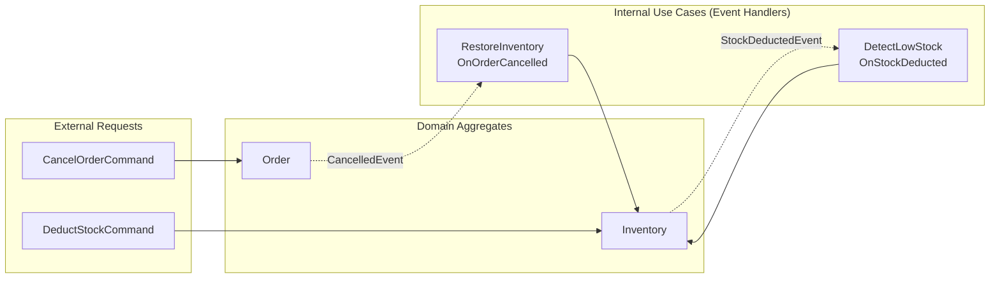
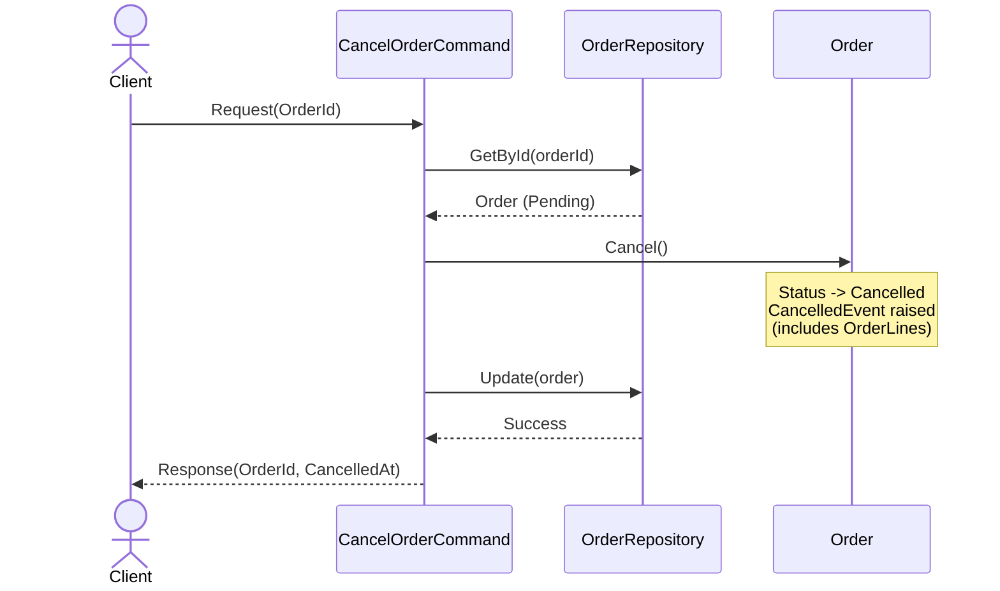
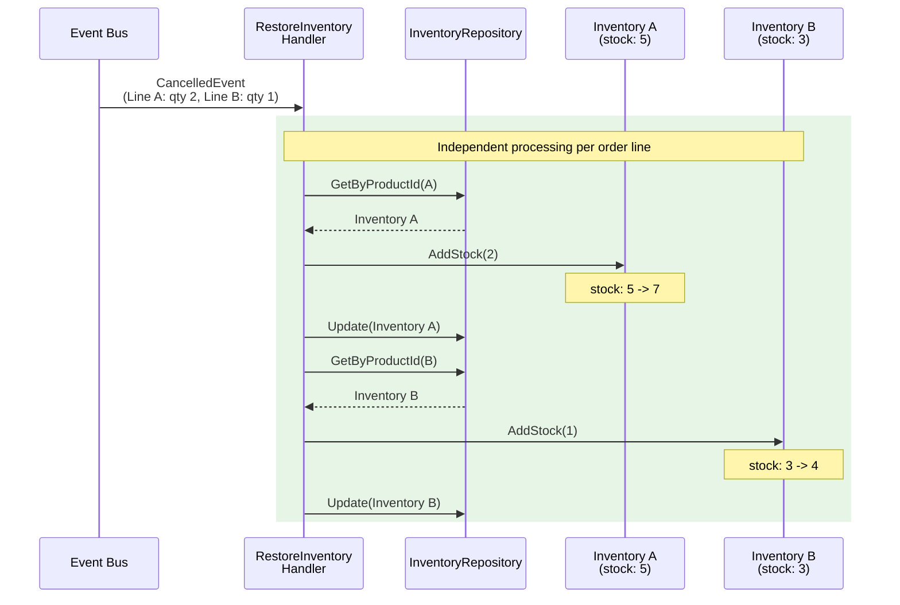
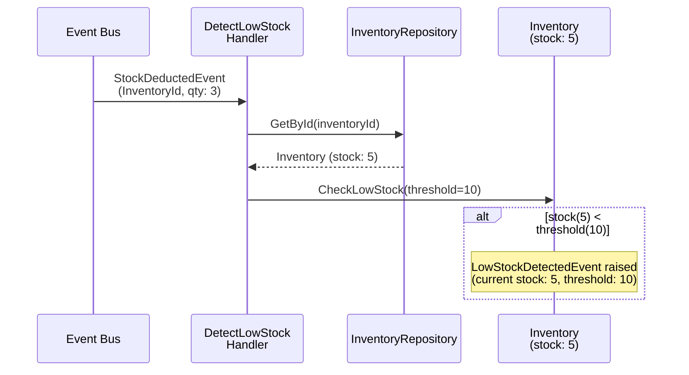
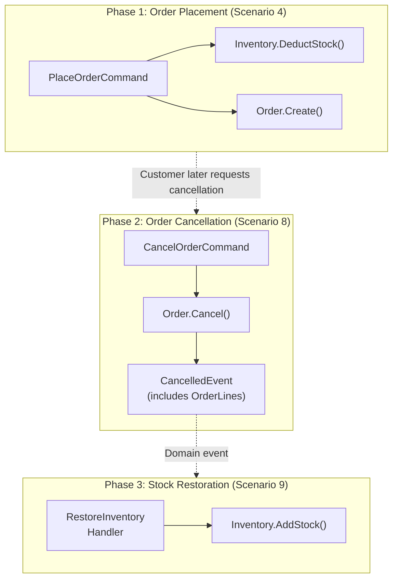
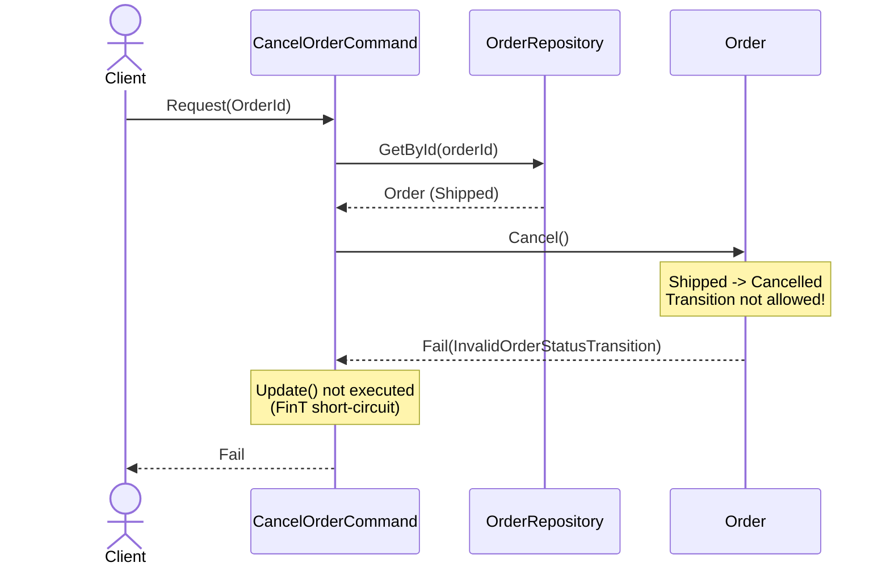
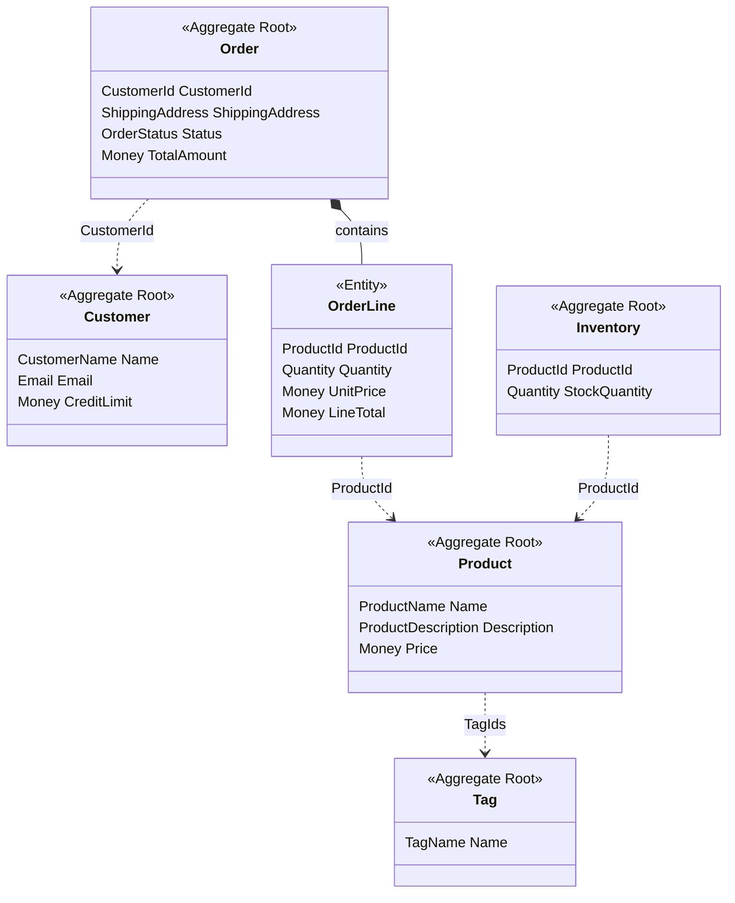

We prove that the workflow scenarios defined in the [business requirements](../00-business-requirements/) actually work with the patterns from the [type design decisions](../01-type-design-decisions/) and [code design](../02-code-design/). Each test uses NSubstitute to mock Ports and `FinTFactory` to simulate IO effects. Normal scenarios verify that parallel validation, batch queries, and read/write separation work correctly, while rejection scenarios verify that validation failures and error propagation work properly.

## Normal Scenarios

### Scenario 1: CreateProduct -- Apply Pattern + Uniqueness Check (-> Requirement #1)

During product creation, all Value Object validations are performed in parallel using the Apply pattern, then name uniqueness check and Inventory creation are processed in a single `FinT<IO, T>` pipeline.

```csharp
[Fact]
public async Task Handle_ShouldReturnSuccess_WhenRequestIsValid()
{
    // Arrange
    var request = new CreateProductCommand.Request("Test Product", "Description", 100m, 10);

    _productRepository.Exists(Arg.Any<Specification<Product>>())
        .Returns(FinTFactory.Succ(false));
    _productRepository.Create(Arg.Any<Product>())
        .Returns(call => FinTFactory.Succ(call.Arg<Product>()));
    _inventoryRepository.Create(Arg.Any<Inventory>())
        .Returns(call => FinTFactory.Succ(call.Arg<Inventory>()));

    // Act
    var actual = await _sut.Handle(request, CancellationToken.None);

    // Assert
    actual.IsSucc.ShouldBeTrue();
    actual.ThrowIfFail().Name.ShouldBe("Test Product");
    actual.ThrowIfFail().Price.ShouldBe(100m);
}
```

**How the Apply pattern works.** Inside the Usecase, parallel validation occurs with `Validation<Error, T>` types.

```csharp
private static Fin<ProductData> CreateProductData(Request request)
{
    // All fields: use VO Validate() (returns Validation<Error, T>)
    var name = ProductName.Validate(request.Name);
    var description = ProductDescription.Validate(request.Description);
    var price = Money.Validate(request.Price);
    var stockQuantity = Quantity.Validate(request.StockQuantity);

    // Bundle all into tuple - parallel validation with Apply
    return (name, description, price, stockQuantity)
        .Apply((n, d, p, s) =>
            new ProductData(
                Product.Create(
                    ProductName.Create(n).ThrowIfFail(),
                    ProductDescription.Create(d).ThrowIfFail(),
                    Money.Create(p).ThrowIfFail()),
                Quantity.Create(s).ThrowIfFail()))
        .As()
        .ToFin();
}
```

Since all 4 `Validate()` calls return `Validation<Error, T>`, if any one fails, **all errors are accumulated**. Because this is `Apply` (parallel validation) rather than `Bind` (sequential execution), it does not stop at the first error.

After validation passes, uniqueness check -> save -> Inventory creation are sequentially executed via `FinT<IO, T>` LINQ composition.

```csharp
FinT<IO, Response> usecase =
    from exists in _productRepository.Exists(new ProductNameUniqueSpec(productName))
    from _ in guard(!exists, ApplicationError.For<CreateProductCommand>(
        new AlreadyExists(),
        request.Name,
        $"Product name already exists: '{request.Name}'"))
    from createdProduct in _productRepository.Create(product)
    from createdInventory in _inventoryRepository.Create(
        Inventory.Create(createdProduct.Id, stockQuantity))
    select new Response(
        createdProduct.Id.ToString(),
        createdProduct.Name,
        createdProduct.Description,
        createdProduct.Price,
        createdInventory.StockQuantity,
        createdProduct.CreatedAt);
```

What this test proves is as follows. By setting Repositories to return success, only the Usecase logic is isolation-tested. `IsSucc` being true proves that Apply pattern validation, uniqueness check, and save all succeeded. The 4-stage pipeline of validation -> duplicate check -> save -> Inventory creation is safely composed in a single FinT chain.

### Scenario 2: CreateCustomer -- Email Uniqueness (-> Requirement #2)

During customer creation, `CustomerName`, `Email`, and `Money` (CreditLimit) are validated in parallel with the Apply pattern, then email duplication is checked with `CustomerEmailSpec`.

```csharp
[Fact]
public async Task Handle_ShouldReturnSuccess_WhenRequestIsValid()
{
    // Arrange
    var request = new CreateCustomerCommand.Request("John", "john@example.com", 5000m);

    _customerRepository.Exists(Arg.Any<Specification<Customer>>())
        .Returns(FinTFactory.Succ(false));
    _customerRepository.Create(Arg.Any<Customer>())
        .Returns(call => FinTFactory.Succ(call.Arg<Customer>()));

    // Act
    var actual = await _sut.Handle(request, CancellationToken.None);

    // Assert
    actual.IsSucc.ShouldBeTrue();
    actual.ThrowIfFail().Name.ShouldBe("John");
    actual.ThrowIfFail().Email.ShouldBe("john@example.com");
}
```

The mock setup pattern is identical to CreateProduct. `Exists(Specification)` returns `false` to express no duplicate, and `Create()` returns the passed entity as-is.

That the mock setup pattern is identical to CreateProduct is no coincidence. All Command Usecases follow the same `Exists -> guard -> Create` pipeline structure. Thanks to this consistency, when a new Use Case requiring uniqueness checks is added, the existing pattern can be applied as-is.

### Scenario 3: CreateOrderWithCreditCheck -- Batch Query + Credit Limit (-> Requirement #3)

During order creation, `IProductCatalog.GetPricesForProducts()` batch-queries product prices in a **single round-trip**, and `OrderCreditCheckService` verifies the credit limit.

```csharp
[Fact]
public async Task Handle_ReturnsSuccess_WhenCreditLimitIsSufficient()
{
    // Arrange
    var customer = CreateSampleCustomer(creditLimit: 5000m);
    var productId = ProductId.New();
    var request = new CreateOrderWithCreditCheckCommand.Request(
        customer.Id.ToString(),
        Seq(new CreateOrderWithCreditCheckCommand.OrderLineRequest(productId.ToString(), 2)),
        "Seoul, Korea");

    _customerRepository.GetById(Arg.Any<CustomerId>())
        .Returns(FinTFactory.Succ(customer));
    _productCatalog.GetPricesForProducts(Arg.Any<IReadOnlyList<ProductId>>())
        .Returns(call =>
        {
            var ids = call.Arg<IReadOnlyList<ProductId>>();
            var prices = toSeq(ids.Select(id => (id, Money.Create(1000m).ThrowIfFail())));
            return FinTFactory.Succ(prices);
        });
    _orderRepository.Create(Arg.Any<Order>())
        .Returns(call => FinTFactory.Succ(call.Arg<Order>()));

    // Act
    var actual = await _sut.Handle(request, CancellationToken.None);

    // Assert
    actual.IsSucc.ShouldBeTrue();
    actual.ThrowIfFail().TotalAmount.ShouldBe(2000m);
}
```

The `IProductCatalog` mock receives the passed product ID list via `call.Arg<IReadOnlyList<ProductId>>()` and maps a price to each. Unit price 1000 x quantity 2 = total 2000, which is within the customer's credit limit of 5000, so it succeeds.

The `CreateSampleCustomer` helper creates test entities by directly composing domain VOs.

```csharp
private static Customer CreateSampleCustomer(decimal creditLimit = 5000m)
{
    return Customer.Create(
        CustomerName.Create("John").ThrowIfFail(),
        Email.Create("john@example.com").ThrowIfFail(),
        Money.Create(creditLimit).ThrowIfFail());
}
```

This test verifies the most complex Use Case of the Application layer. It confirms that batch price query (`IProductCatalog`), cross-Aggregate validation (`OrderCreditCheckService`), and multi-Repository coordination all work correctly in a single FinT pipeline.

### Scenario 4: PlaceOrder -- Multi-Aggregate Write (UoW) (-> Requirement #4)

`CreateOrderWithCreditCheckCommand` saves only one order after credit verification. In actual order placement, stock deduction must also occur. `PlaceOrderCommand` bundles Order creation and Inventory update into a single FinT chain to guarantee atomic writes.

```csharp
[Fact]
public async Task Handle_ReturnsSuccess_WhenCreditLimitAndStockSufficient()
{
    // Arrange
    var customer = CreateSampleCustomer(creditLimit: 5000m);
    var productId = ProductId.New();
    var inventory = CreateInventoryWithStock(productId, 10);
    var request = new PlaceOrderCommand.Request(
        customer.Id.ToString(),
        Seq(new PlaceOrderCommand.OrderLineRequest(productId.ToString(), 2)),
        "Seoul, Korea");

    _productCatalog.GetPricesForProducts(Arg.Any<IReadOnlyList<ProductId>>())
        .Returns(call =>
        {
            var ids = call.Arg<IReadOnlyList<ProductId>>();
            var prices = toSeq(ids.Select(id => (id, Money.Create(1000m).ThrowIfFail())));
            return FinTFactory.Succ(prices);
        });
    _inventoryRepository.GetByProductId(Arg.Any<ProductId>())
        .Returns(FinTFactory.Succ(inventory));
    _customerRepository.GetById(Arg.Any<CustomerId>())
        .Returns(FinTFactory.Succ(customer));
    _orderRepository.Create(Arg.Any<Order>())
        .Returns(call => FinTFactory.Succ(call.Arg<Order>()));
    _inventoryRepository.UpdateRange(Arg.Any<IReadOnlyList<Inventory>>())
        .Returns(call => FinTFactory.Succ(toSeq(call.Arg<IReadOnlyList<Inventory>>())));

    // Act
    var actual = await _sut.Handle(request, CancellationToken.None);

    // Assert
    actual.IsSucc.ShouldBeTrue();
    actual.ThrowIfFail().TotalAmount.ShouldBe(2000m);
    actual.ThrowIfFail().DeductedStocks.Count.ShouldBe(1);
    actual.ThrowIfFail().DeductedStocks[0].RemainingStock.ShouldBe(8);
}
```

The key difference from previous scenarios is that **the mock targets span 5 ports.** `IProductCatalog` (price query), `IInventoryRepository` (stock query/deduction/save), `ICustomerRepository` (customer query), `IOrderRepository` (order save) — four Repositories and one Special Port must all cooperate for success.

The assert verifies both `TotalAmount` (order creation confirmation) and `DeductedStocks[0].RemainingStock` (stock deduction confirmation). The fact that 2 were deducted from 10 units of stock leaving 8 proves that both Aggregates were changed together in a single transaction.

### Scenario 5: SearchProducts -- Specification Composition + Pagination (-> Requirement #5)

Queries project directly to DTOs via `IProductQuery` Read Adapter without Aggregate reconstruction. Combines Specification composition with pagination.

```csharp
[Fact]
public async Task Handle_ReturnsSuccess_WhenNoFiltersProvided()
{
    // Arrange
    var pagedResult = CreateSamplePagedResult();
    var request = new SearchProductsQuery.Request();

    _readAdapter.Search(
            Arg.Any<Specification<Product>>(),
            Arg.Any<PageRequest>(),
            Arg.Any<SortExpression>())
        .Returns(FinTFactory.Succ(pagedResult));

    // Act
    var actual = await _sut.Handle(request, CancellationToken.None);

    // Assert
    actual.IsSucc.ShouldBeTrue();
    actual.ThrowIfFail().Products.Count.ShouldBe(3);
    actual.ThrowIfFail().TotalCount.ShouldBe(3);
}
```

The pagination metadata verification test confirms the `PagedResult` operation results.

```csharp
[Fact]
public async Task Handle_ReturnsPaginationMetadata_WhenPageProvided()
{
    // Arrange
    List<ProductSummaryDto> items = [new(ProductId.New().ToString(), "Item", 100m)];
    var pagedResult = new PagedResult<ProductSummaryDto>(items, 50, 2, 10);
    var request = new SearchProductsQuery.Request(Page: 2, PageSize: 10);

    _readAdapter.Search(
            Arg.Any<Specification<Product>>(),
            Arg.Any<PageRequest>(),
            Arg.Any<SortExpression>())
        .Returns(FinTFactory.Succ(pagedResult));

    // Act
    var actual = await _sut.Handle(request, CancellationToken.None);

    // Assert
    actual.IsSucc.ShouldBeTrue();
    var response = actual.ThrowIfFail();
    response.Page.ShouldBe(2);
    response.PageSize.ShouldBe(10);
    response.TotalCount.ShouldBe(50);
    response.TotalPages.ShouldBe(5);
    response.HasPreviousPage.ShouldBeTrue();
    response.HasNextPage.ShouldBeTrue();
}
```

Inside the Usecase, starting from `Specification<Product>.All` as the default, `ProductNameSpec` and `ProductPriceRangeSpec` are composed with `&=` based on request parameters.

```csharp
private static Specification<Product> BuildSpecification(Request request)
{
    var spec = Specification<Product>.All;

    if (request.Name.Length > 0)
        spec &= new ProductNameSpec(
            ProductName.Create(request.Name).ThrowIfFail());

    if (request.MinPrice > 0 && request.MaxPrice > 0)
        spec &= new ProductPriceRangeSpec(
            Money.Create(request.MinPrice).ThrowIfFail(),
            Money.Create(request.MaxPrice).ThrowIfFail());

    return spec;
}
```

### Scenario 6: GetCustomerOrders -- 4-Table JOIN Projection (-> Requirement #6)

The `ICustomerOrdersQuery` Read Adapter performs a Customer -> Order -> OrderLine -> Product 4-table JOIN to project all orders for a specific customer along with each order line's product name at once.

```csharp
[Fact]
public async Task Handle_ReturnsSuccess_WhenCustomerHasOrders()
{
    // Arrange
    var customerId = CustomerId.New();
    var dto = new CustomerOrdersDto(
        customerId.ToString(),
        "Test Customer",
        Seq(new CustomerOrderDto(
            "order-1",
            Seq(new CustomerOrderLineDto(ProductId.New().ToString(), "Product A", 2, 100m, 200m)),
            200m,
            "Confirmed",
            DateTime.UtcNow)));

    var request = new GetCustomerOrdersQuery.Request(customerId.ToString());

    _readAdapter.GetByCustomerId(Arg.Any<CustomerId>())
        .Returns(FinTFactory.Succ(dto));

    // Act
    var actual = await _sut.Handle(request, CancellationToken.None);

    // Assert
    actual.IsSucc.ShouldBeTrue();
    var result = actual.ThrowIfFail().CustomerOrders;
    result.CustomerName.ShouldBe("Test Customer");
    result.Orders.Count.ShouldBe(1);
    result.Orders[0].OrderLines.Count.ShouldBe(1);
    result.Orders[0].OrderLines[0].ProductName.ShouldBe("Product A");
}
```

The Usecase internals are a single FinT LINQ pipeline calling `_readAdapter.GetByCustomerId(customerId)`.

```csharp
FinT<IO, Response> usecase =
    from customerOrders in _readAdapter.GetByCustomerId(customerId)
    select new Response(customerOrders);
```

While SearchProducts (Scenario 5) is `Specification`-based search, GetCustomerOrders is **entity ID-based detail query**. The Read Adapter JOINs 4 tables and projects directly to the needed DTO format, returning data efficiently without Aggregate reconstruction.

A test verifying multiple orders with multiple order lines together.

```csharp
[Fact]
public async Task Handle_ReturnsSuccess_WhenCustomerHasMultipleOrdersWithMultipleLines()
{
    // Arrange
    var customerId = CustomerId.New();
    var dto = new CustomerOrdersDto(
        customerId.ToString(),
        "VIP Customer",
        Seq(
            new CustomerOrderDto(
                "order-1",
                Seq(
                    new CustomerOrderLineDto(ProductId.New().ToString(), "Product A", 1, 100m, 100m),
                    new CustomerOrderLineDto(ProductId.New().ToString(), "Product B", 2, 50m, 100m)),
                200m, "Delivered", DateTime.UtcNow.AddDays(-10)),
            new CustomerOrderDto(
                "order-2",
                Seq(new CustomerOrderLineDto(ProductId.New().ToString(), "Product C", 3, 200m, 600m)),
                600m, "Pending", DateTime.UtcNow)));

    var request = new GetCustomerOrdersQuery.Request(customerId.ToString());

    _readAdapter.GetByCustomerId(Arg.Any<CustomerId>())
        .Returns(FinTFactory.Succ(dto));

    // Act
    var actual = await _sut.Handle(request, CancellationToken.None);

    // Assert
    actual.IsSucc.ShouldBeTrue();
    var result = actual.ThrowIfFail().CustomerOrders;
    result.Orders.Count.ShouldBe(2);
    result.Orders[0].OrderLines.Count.ShouldBe(2);
    result.Orders[1].OrderLines.Count.ShouldBe(1);
}
```

VIP Customer's 2 orders — the first order has 2 lines (Product A, B), the second has 1 line (Product C). It verifies that the Read Adapter correctly assembles the hierarchical DTO (`CustomerOrdersDto` -> `CustomerOrderDto` -> `CustomerOrderLineDto`).

### Scenario 7: SearchCustomerOrderSummary -- LEFT JOIN Aggregation + Pagination (-> Requirement #7)

The `ICustomerOrderSummaryQuery` Read Adapter performs a Customer and Order LEFT JOIN + GROUP BY aggregation to query total order count, total spent, and last order date per customer. Supports pagination and sorting.

```csharp
[Fact]
public async Task Handle_ReturnsSuccess_WhenNoFiltersProvided()
{
    // Arrange
    var pagedResult = CreateSamplePagedResult();
    var request = new SearchCustomerOrderSummaryQuery.Request();

    _readAdapter.Search(
            Arg.Any<Specification<Customer>>(),
            Arg.Any<PageRequest>(),
            Arg.Any<SortExpression>())
        .Returns(FinTFactory.Succ(pagedResult));

    // Act
    var actual = await _sut.Handle(request, CancellationToken.None);

    // Assert
    actual.IsSucc.ShouldBeTrue();
    actual.ThrowIfFail().Customers.Count.ShouldBe(3);
    actual.ThrowIfFail().TotalCount.ShouldBe(3);
}
```

The Usecase internals follow the same Search Query pattern as SearchProducts (Scenario 5). Starting from `Specification<Customer>.All` as the default, it combines `PageRequest` and `SortExpression`.

```csharp
var spec = Specification<Customer>.All;
var pageRequest = new PageRequest(request.Page, request.PageSize);
var sortExpression = SortExpression.By(request.SortBy,
    SortDirection.Parse(request.SortDirection));

FinT<IO, Response> usecase =
    from result in _readAdapter.Search(spec, pageRequest, sortExpression)
    select new Response(
        result.Items,
        result.TotalCount,
        result.Page,
        result.PageSize,
        result.TotalPages,
        result.HasNextPage,
        result.HasPreviousPage);
```

A test that proves the core LEFT JOIN behavior. Customers without orders must also be included in the results.

```csharp
[Fact]
public async Task Handle_ReturnsCustomerWithNoOrders_WhenCustomerHasZeroOrders()
{
    // Arrange
    List<CustomerOrderSummaryDto> items =
        [new(CustomerId.New().ToString(), "New Customer", 0, 0m, null)];
    var pagedResult = new PagedResult<CustomerOrderSummaryDto>(items, 1, 1, 20);
    var request = new SearchCustomerOrderSummaryQuery.Request();

    _readAdapter.Search(
            Arg.Any<Specification<Customer>>(),
            Arg.Any<PageRequest>(),
            Arg.Any<SortExpression>())
        .Returns(FinTFactory.Succ(pagedResult));

    // Act
    var actual = await _sut.Handle(request, CancellationToken.None);

    // Assert
    actual.IsSucc.ShouldBeTrue();
    var customer = actual.ThrowIfFail().Customers[0];
    customer.OrderCount.ShouldBe(0);
    customer.TotalSpent.ShouldBe(0m);
    customer.LastOrderDate.ShouldBeNull();
}
```

`OrderCount == 0`, `TotalSpent == 0`, `LastOrderDate == null` — with an INNER JOIN, this customer would be excluded from results. Because it is a LEFT JOIN, customers without orders are included, and aggregate values return as 0/null.

Pagination metadata verification.

```csharp
[Fact]
public async Task Handle_ReturnsPaginationMetadata_WhenPageProvided()
{
    // Arrange
    List<CustomerOrderSummaryDto> items =
        [new(CustomerId.New().ToString(), "Alice", 5, 1500m, DateTime.UtcNow)];
    var pagedResult = new PagedResult<CustomerOrderSummaryDto>(items, 50, 2, 10);
    var request = new SearchCustomerOrderSummaryQuery.Request(Page: 2, PageSize: 10);

    _readAdapter.Search(
            Arg.Any<Specification<Customer>>(),
            Arg.Any<PageRequest>(),
            Arg.Any<SortExpression>())
        .Returns(FinTFactory.Succ(pagedResult));

    // Act
    var actual = await _sut.Handle(request, CancellationToken.None);

    // Assert
    actual.IsSucc.ShouldBeTrue();
    var response = actual.ThrowIfFail();
    response.Page.ShouldBe(2);
    response.PageSize.ShouldBe(10);
    response.TotalCount.ShouldBe(50);
    response.TotalPages.ShouldBe(5);
    response.HasPreviousPage.ShouldBeTrue();
    response.HasNextPage.ShouldBeTrue();
}
```

The structure is identical to the SearchProducts (Scenario 5) pagination test. `PagedResult` is configured with 50 total records, page 2, 10 records/page, verifying `TotalPages = 5`, `HasPreviousPage = true`, `HasNextPage = true`. This shows the Search Query pattern is reused identically for Product and Customer.

## Domain Event Reactive Scenarios

All scenarios so far are initiated by external requests (HTTP/API). The following scenarios are internal use cases triggered by **domain events**. They are the core mechanism for achieving eventual consistency between Aggregates.



### Scenario 8: CancelOrder -- Order Cancellation + Event Trigger (-> Requirement #8)

Cancels an order in Pending or Confirmed status. `CancelOrderCommand` depends only on `IOrderRepository` and delegates to `Order.Cancel()` domain logic. The `CancelledEvent` raised on cancellation includes order line information so subsequent event handlers can restore stock.



```csharp
[Fact]
public async Task Handle_ReturnsSuccess_WhenOrderIsPending()
{
    // Arrange
    var order = CreateOrderWithStatus(OrderStatus.Pending);
    var request = new CancelOrderCommand.Request(order.Id.ToString());

    _orderRepository.GetById(Arg.Any<OrderId>())
        .Returns(FinTFactory.Succ(order));
    _orderRepository.Update(Arg.Any<Order>())
        .Returns(call => FinTFactory.Succ(call.Arg<Order>()));

    // Act
    var actual = await _sut.Handle(request, CancellationToken.None);

    // Assert
    actual.IsSucc.ShouldBeTrue();
    actual.ThrowIfFail().OrderId.ShouldBe(order.Id.ToString());
}
```

The FinT LINQ composition inside the Usecase follows the same `GetById -> domain method -> Update` pattern as `DeleteProductCommand`.

```csharp
FinT<IO, Response> usecase =
    from order in _orderRepository.GetById(orderId)
    from _1 in order.Cancel()
    from updated in _orderRepository.Update(order)
    select new Response(
        updated.Id.ToString(),
        updated.UpdatedAt.IfNone(DateTime.UtcNow));
```

Since `Order.Cancel()` returns `Fin<Unit>`, if the state transition is not allowed (e.g., Shipped -> Cancelled), the `InvalidOrderStatusTransition` domain error is automatically propagated through the FinT chain. The test passing without setting up `Update()` mock proves the short-circuit behavior.

### Scenario 9: RestoreInventory -- Automatic Stock Restoration on Order Cancellation (-> Requirement #8)

When `CancelledEvent` is published, `RestoreInventoryOnOrderCancelledHandler` restores stock per product for each order line. This handler **processes independently per order line**, so one stock restoration failure does not block the rest.



```csharp
[Fact]
public async Task Handle_RestoresStock_ForEachOrderLine()
{
    // Arrange
    var productId1 = ProductId.New();
    var productId2 = ProductId.New();
    var inventory1 = Inventory.Create(productId1, Quantity.Create(5).ThrowIfFail());
    var inventory2 = Inventory.Create(productId2, Quantity.Create(3).ThrowIfFail());

    var notification = new Order.CancelledEvent(
        OrderId.New(),
        Seq(
            new Order.OrderLineInfo(productId1, Quantity.Create(2).ThrowIfFail(),
                Money.Create(100m).ThrowIfFail(), Money.Create(200m).ThrowIfFail()),
            new Order.OrderLineInfo(productId2, Quantity.Create(1).ThrowIfFail(),
                Money.Create(50m).ThrowIfFail(), Money.Create(50m).ThrowIfFail())));

    _inventoryRepository.GetByProductId(productId1)
        .Returns(FinTFactory.Succ(inventory1));
    _inventoryRepository.GetByProductId(productId2)
        .Returns(FinTFactory.Succ(inventory2));
    _inventoryRepository.Update(Arg.Any<Inventory>())
        .Returns(call => FinTFactory.Succ(call.Arg<Inventory>()));

    // Act
    await _sut.Handle(notification, CancellationToken.None);

    // Assert
    ((int)inventory1.StockQuantity).ShouldBe(7); // 5 + 2
    ((int)inventory2.StockQuantity).ShouldBe(4); // 3 + 1
}
```

Inside the handler, each order line is iterated with an individual `FinT<IO, T>` pipeline execution.

```csharp
foreach (var line in notification.OrderLines)
{
    var result = await _inventoryRepository.GetByProductId(line.ProductId)
        .Map(inventory => inventory.AddStock(line.Quantity))
        .Bind(inventory => _inventoryRepository.Update(inventory))
        .Run().RunAsync();
}
```

`foreach` + individual `Run().RunAsync()` is an intentional design. Bundling into a single `FinT` chain would stop everything at the first failure, but individual execution **allows partial failures**. Even if Product A's inventory cannot be found, Product B's inventory is still restored normally.

```csharp
[Fact]
public async Task Handle_ContinuesProcessing_WhenOneInventoryNotFound()
{
    // Arrange — productId1's inventory does not exist
    _inventoryRepository.GetByProductId(productId1)
        .Returns(FinTFactory.Fail<Inventory>(Error.New("Inventory not found")));
    _inventoryRepository.GetByProductId(productId2)
        .Returns(FinTFactory.Succ(inventory2));
    _inventoryRepository.Update(Arg.Any<Inventory>())
        .Returns(call => FinTFactory.Succ(call.Arg<Inventory>()));

    // Act
    await _sut.Handle(notification, CancellationToken.None);

    // Assert — productId2's inventory is restored normally
    ((int)inventory2.StockQuantity).ShouldBe(4); // 3 + 1
}
```

### Scenario 10: DetectLowStock -- Low Stock Detection on Stock Deduction (-> Requirement #9)

When `StockDeductedEvent` is published, `DetectLowStockOnStockDeductedHandler` queries current inventory to check whether it is at or below the threshold (10). If low stock is detected, `Inventory.CheckLowStock()` raises a `LowStockDetectedEvent`.



```csharp
[Fact]
public async Task Handle_RaisesLowStockDetected_WhenBelowThreshold()
{
    // Arrange
    var inventory = Inventory.Create(ProductId.New(), Quantity.Create(5).ThrowIfFail());
    inventory.ClearDomainEvents();

    var notification = new Inventory.StockDeductedEvent(
        inventory.Id, inventory.ProductId, Quantity.Create(3).ThrowIfFail());

    _inventoryRepository.GetById(inventory.Id)
        .Returns(FinTFactory.Succ(inventory));

    // Act
    await _sut.Handle(notification, CancellationToken.None);

    // Assert — stock 5 < threshold 10 -> LowStockDetectedEvent raised
    inventory.DomainEvents.OfType<Inventory.LowStockDetectedEvent>().ShouldHaveSingleItem();
}
```

The low stock detection logic resides inside the **domain Aggregate**, not the Application layer. Since `AddDomainEvent` is `protected`, the handler delegates to the domain by calling `Inventory.CheckLowStock(threshold)`.

```csharp
// Inventory.cs
public void CheckLowStock(Quantity threshold)
{
    if ((int)StockQuantity < (int)threshold)
        AddDomainEvent(new LowStockDetectedEvent(Id, ProductId, StockQuantity, threshold));
}
```

If the threshold (10) or above, no event is raised.

```csharp
[Fact]
public async Task Handle_DoesNotRaise_WhenAboveThreshold()
{
    // Arrange
    var inventory = Inventory.Create(ProductId.New(), Quantity.Create(15).ThrowIfFail());
    inventory.ClearDomainEvents();

    var notification = new Inventory.StockDeductedEvent(
        inventory.Id, inventory.ProductId, Quantity.Create(3).ThrowIfFail());

    _inventoryRepository.GetById(inventory.Id)
        .Returns(FinTFactory.Succ(inventory));

    // Act
    await _sut.Handle(notification, CancellationToken.None);

    // Assert — stock 15 >= threshold 10 -> no event
    inventory.DomainEvents.OfType<Inventory.LowStockDetectedEvent>().ShouldBeEmpty();
}
```

`LowStockDetectedEvent` currently has no subscribers, but adding an external notification (email, Slack) handler in the future **extends without code changes**. This is the Open/Closed principle applied through domain events.

### Scenario 4 -> 8 -> 9 Connection: Full Flow from Order Placement to Cancellation

Scenarios 4 (PlaceOrder), 8 (CancelOrder), and 9 (RestoreInventory) form a single business flow.



When 2 units are ordered from a product with 10 units of stock, stock becomes 8 (Scenario 4). When the order is then cancelled (Scenario 8), the `CancelledEvent` is published, and the stock restoration handler restores 2 units (Scenario 9), returning stock to 10. **Order does not directly reference Inventory**, and the two Aggregates are connected only through domain events.

Having confirmed that each pattern works correctly in normal scenarios and domain event reactive scenarios, we now examine how errors are generated and propagated in rejection scenarios. Error handling in the Application layer is performed automatically by the type system (`Fin<T>`, `FinT<IO, T>`), not by try-catch.

## Rejection Scenarios

### Scenario 11: Cancellation Rejected After Shipping (InvalidOrderStatusTransition) (-> Requirement #16)

When cancelling an order in Shipped or Delivered status, `Order.Cancel()` returns an `InvalidOrderStatusTransition` domain error. The FinT chain's short-circuit prevents the `Update()` call from executing.



```csharp
[Fact]
public async Task Handle_ReturnsFail_WhenOrderIsShipped()
{
    // Arrange
    var order = CreateOrderWithStatus(OrderStatus.Shipped);
    var request = new CancelOrderCommand.Request(order.Id.ToString());

    _orderRepository.GetById(Arg.Any<OrderId>())
        .Returns(FinTFactory.Succ(order));

    // Act
    var actual = await _sut.Handle(request, CancellationToken.None);

    // Assert
    actual.IsSucc.ShouldBeFalse();
}
```

The test passes even without setting up `_orderRepository.Update()` mock. When `Cancel()` returns `Fail`, the FinT LINQ composition's monad binding means the `from updated in _orderRepository.Update(order)` line is not executed. This is the same principle as Scenario 13 (AlreadyExists) where `Create()` is not executed after `guard` failure.

### Scenario 12: Multiple VO Validation Failure (Error Accumulation) (-> Requirement #10)

The Apply pattern performs individual VO validations in parallel, so when multiple fields fail simultaneously, **all errors are accumulated**. Passing an empty name and 0 price simultaneously returns both errors at once.

```csharp
[Fact]
public async Task Handle_ShouldReturnFailure_WhenNameIsEmpty()
{
    // Arrange
    var request = new CreateProductCommand.Request("", "Description", 100m, 10);

    // Act
    var actual = await _sut.Handle(request, CancellationToken.None);

    // Assert
    actual.IsSucc.ShouldBeFalse();
}

[Fact]
public async Task Handle_ShouldReturnFailure_WhenPriceIsZero()
{
    // Arrange
    var request = new CreateProductCommand.Request("Test Product", "Description", 0m, 10);

    // Act
    var actual = await _sut.Handle(request, CancellationToken.None);

    // Assert
    actual.IsSucc.ShouldBeFalse();
}
```

Repository mock setup is not needed when VO validation fails. The Apply pattern immediately returns `Fail` at the `CreateProductData()` stage, so IO effects are not executed. This is the core of "early return on validation failure."

This is the practical difference between Apply and Bind patterns. With Bind, it would have stopped immediately at the empty name and the price error would not have been reported. Apply runs all independent validations so the user can identify all problems in a single request.

### Scenario 13: AlreadyExists (Duplicate Name/Email) (-> Requirement #11)

When a `Specification`-based uniqueness check finds a duplicate, `ApplicationError.For<T>(new AlreadyExists(), ...)` is returned.

```csharp
[Fact]
public async Task Handle_ShouldReturnFailure_WhenDuplicateName()
{
    // Arrange
    var request = new CreateProductCommand.Request("Existing Product", "Description", 100m, 10);

    _productRepository.Exists(Arg.Any<Specification<Product>>())
        .Returns(FinTFactory.Succ(true));

    // Act
    var actual = await _sut.Handle(request, CancellationToken.None);

    // Assert
    actual.IsSucc.ShouldBeFalse();
}
```

Customer email duplication follows the same pattern.

```csharp
[Fact]
public async Task Handle_ShouldReturnFailure_WhenDuplicateEmail()
{
    // Arrange
    var request = new CreateCustomerCommand.Request("John", "john@example.com", 5000m);

    _customerRepository.Exists(Arg.Any<Specification<Customer>>())
        .Returns(FinTFactory.Succ(true));

    // Act
    var actual = await _sut.Handle(request, CancellationToken.None);

    // Assert
    actual.IsSucc.ShouldBeFalse();
}
```

When `Exists()` returns `true`, `guard(!exists, ...)` fails and the `AlreadyExists` error propagates. The `Create()` mock does not need to be set up -- because the chain already stopped at `guard`.

Since the chain stopped at `guard`, the `Create()` mock does not need to be set up and the test still passes. This proves the short-circuit characteristic of the FinT chain -- all IO operations after failure are not executed.

### Scenario 14: NotFound (Non-existent Product) (-> Requirement #12)

**UpdateProduct** -- When `GetById()` returns `Fail`, the chain immediately stops at the first `from` in the LINQ composition.

```csharp
[Fact]
public async Task Handle_ShouldReturnFailure_WhenProductNotFound()
{
    // Arrange
    var request = new UpdateProductCommand.Request(
        ProductId.New().ToString(), "Updated", "Desc", 200m);

    _productRepository.GetById(Arg.Any<ProductId>())
        .Returns(FinTFactory.Fail<Product>(Error.New("Product not found")));

    // Act
    var actual = await _sut.Handle(request, CancellationToken.None);

    // Assert
    actual.IsSucc.ShouldBeFalse();
}
```

**DeleteProduct** -- When `GetByIdIncludingDeleted()` returns `Fail`.

```csharp
[Fact]
public async Task Handle_ReturnsFail_WhenProductNotFound()
{
    // Arrange
    var request = new DeleteProductCommand.Request(
        ProductId.New().ToString(), "admin");

    _productRepository.GetByIdIncludingDeleted(Arg.Any<ProductId>())
        .Returns(FinTFactory.Fail<Product>(Error.New("Product not found")));

    // Act
    var actual = await _sut.Handle(request, CancellationToken.None);

    // Assert
    actual.IsSucc.ShouldBeFalse();
}
```

When `FinTFactory.Fail<T>(Error.New(...))` is used to make the Repository return failure, the `FinT<IO, T>` LINQ composition's monad binding propagates the error as-is without executing subsequent steps.

### Scenario 15: Domain Error Propagation (CreditLimitExceeded, InsufficientStock) (-> Requirement #13, #14)

The `CreditLimitExceeded` domain error from `OrderCreditCheckService` propagates to the Application layer.

```csharp
[Fact]
public async Task Handle_ReturnsFail_WhenCreditLimitExceeded()
{
    // Arrange
    var customer = CreateSampleCustomer(creditLimit: 1000m);
    var productId = ProductId.New();
    var request = new CreateOrderWithCreditCheckCommand.Request(
        customer.Id.ToString(),
        Seq(new CreateOrderWithCreditCheckCommand.OrderLineRequest(productId.ToString(), 2)),
        "Seoul, Korea");

    _customerRepository.GetById(Arg.Any<CustomerId>())
        .Returns(FinTFactory.Succ(customer));
    _productCatalog.GetPricesForProducts(Arg.Any<IReadOnlyList<ProductId>>())
        .Returns(call =>
        {
            var ids = call.Arg<IReadOnlyList<ProductId>>();
            var prices = toSeq(ids.Select(id => (id, Money.Create(1000m).ThrowIfFail())));
            return FinTFactory.Succ(prices);
        });

    // Act
    var actual = await _sut.Handle(request, CancellationToken.None);

    // Assert
    actual.IsSucc.ShouldBeFalse();
}
```

Unit price 1000 x quantity 2 = total 2000, but the credit limit is 1000, so the Domain Service returns a `CreditLimitExceeded` error. This error occurs at `_creditCheckService.ValidateCreditLimit(customer, newOrder.TotalAmount)` inside the `FinT<IO, T>` LINQ composition, and `_orderRepository.Create()` is not executed as the error propagates upward.

The same domain error propagation occurs in `PlaceOrderCommand`. When stock is insufficient, `Inventory.DeductStock()` returns an `InsufficientStock` error, and when the credit limit is exceeded, `OrderCreditCheckService` returns a `CreditLimitExceeded` error. In both cases, the FinT LINQ chain's monad binding prevents subsequent steps from executing and propagates the error.

```csharp
[Fact]
public async Task Handle_ReturnsFail_WhenInsufficientStock()
{
    // Arrange
    var productId = ProductId.New();
    var inventory = CreateInventoryWithStock(productId, 1);  // Stock: 1
    var request = new PlaceOrderCommand.Request(
        CustomerId.New().ToString(),
        Seq(new PlaceOrderCommand.OrderLineRequest(productId.ToString(), 2)),  // Ordering 2
        "Seoul, Korea");

    _productCatalog.GetPricesForProducts(Arg.Any<IReadOnlyList<ProductId>>())
        .Returns(call =>
        {
            var ids = call.Arg<IReadOnlyList<ProductId>>();
            var prices = toSeq(ids.Select(id => (id, Money.Create(1000m).ThrowIfFail())));
            return FinTFactory.Succ(prices);
        });
    _inventoryRepository.GetByProductId(Arg.Any<ProductId>())
        .Returns(FinTFactory.Succ(inventory));

    // Act
    var actual = await _sut.Handle(request, CancellationToken.None);

    // Assert
    actual.IsSucc.ShouldBeFalse();
}
```

Ordering 2 when only 1 is in stock causes `DeductStock` to return an `InsufficientStock` domain error. At this point, Customer query, credit verification, Order creation, and Inventory save are all not executed. The test passing without setting up `_customerRepository` and `_orderRepository` mocks proves that the FinT chain's short-circuit works precisely.

Errors propagate automatically from the point of occurrence through the FinT chain to the final `FinResponse`. No try-catch is needed in between as the type system guarantees the error flow. The following table summarizes the error origin and propagation path for each error type.

### Scenario 16: Format Validation Rejection (FluentValidation) (-> Requirement #15)

FluentValidation Validators reject format errors before workflow entry. When the Validator fails, the Usecase `Handle()` is not executed, so no mock setup is needed.

**Paired range validation** — `SearchProductsQueryValidator` validates that MinPrice and MaxPrice must be provided together.

```csharp
[Fact]
public void Validate_ReturnsValidationError_WhenOnlyMinPriceProvided()
{
    // Arrange
    var request = new SearchProductsQuery.Request(MinPrice: 100m);

    // Act
    var actual = _sut.Validate(request);

    // Assert
    actual.IsValid.ShouldBeFalse();
    actual.Errors.ShouldContain(e =>
        e.PropertyName == "MaxPrice"
        && e.ErrorMessage.Contains("MaxPrice is required when MinPrice is specified"));
}
```

**Allowlist validation** — Rejected when the sort field is not in the allowed values (`Name`, `Price`, etc.).

```csharp
[Fact]
public void Validate_ReturnsValidationError_WhenInvalidSortByProvided()
{
    // Arrange
    var request = new SearchProductsQuery.Request(SortBy: "InvalidField");

    // Act
    var actual = _sut.Validate(request);

    // Assert
    actual.IsValid.ShouldBeFalse();
    actual.Errors.ShouldContain(e => e.PropertyName == "SortBy");
}
```

**ID format validation** — `GetCustomerOrdersQueryValidator` validates that `CustomerId` is in a valid EntityId format.

```csharp
[Fact]
public void Validate_ReturnsValidationError_WhenCustomerIdEmpty()
{
    // Arrange
    var request = new GetCustomerOrdersQuery.Request("");

    // Act
    var actual = _sut.Validate(request);

    // Assert
    actual.IsValid.ShouldBeFalse();
    actual.Errors.ShouldContain(e => e.PropertyName == "CustomerId");
}
```

The following table summarizes the rule types validated by each Validator from a testing perspective.

| Validator | Validation Rules | Test Method |
|-----------|-----------------|-------------|
| `SearchProductsQueryValidator` | Paired range (MinPrice <-> MaxPrice), allowlist (SortBy), sort direction (SortDirection), empty string (Name) | `_sut.Validate(request)` -> `IsValid` / `Errors` |
| `GetCustomerOrdersQueryValidator` | EntityId format (CustomerId) | `_sut.Validate(request)` -> `IsValid` / `Errors` |
| `SearchCustomerOrderSummaryQueryValidator` | Allowlist (SortBy), sort direction (SortDirection) | `_sut.Validate(request)` -> `IsValid` / `Errors` |

Validator tests use synchronous execution (`_sut.Validate(request)`) to verify `IsValid` and `Errors`. This is distinguished from the Usecase test pattern of `async Handle()` -> `IsSucc`/`IsFail`. When the Validator returns `IsValid == false`, the pipeline does not invoke the Usecase, structurally guaranteeing that format errors never reach domain logic.

## Error Propagation Path

| Error Origin | Error Type | Propagation Path | Final ApplicationError |
|-------------|-----------|-----------------|----------------------|
| VO validation (`ProductName.Validate`, etc.) | `Validation<Error, T>` | `Apply()` -> `.ToFin()` -> early return | `FinResponse.Fail<T>(error)` |
| Uniqueness check (`Exists` + `guard`) | `ApplicationError` (`AlreadyExists`) | `guard` inside `FinT<IO, T>` LINQ composition | `ApplicationError.For<T>(new AlreadyExists(), ...)` |
| Entity query (`GetById`) | `Error` (Repository return) | Monad binding in `FinT<IO, T>` LINQ composition | `FinTFactory.Fail<T>(Error.New(...))` |
| Domain service (`OrderCreditCheckService`) | `DomainError` (`CreditLimitExceeded`) | `FinT<IO, T>` LINQ composition -> `Fin.ToFinResponse()` | `DomainError.For<T>(new CreditLimitExceeded(), ...)` |
| Domain method (`Inventory.DeductStock`) | `DomainError` (`InsufficientStock`) | Monad binding in `FinT<IO, T>` LINQ composition | `DomainError.For<T>(new InsufficientStock(), ...)` |
| Domain method (`Order.Cancel`) | `DomainError` (`InvalidOrderStatusTransition`) | Monad binding in `FinT<IO, T>` LINQ composition | `DomainError.For<T>(new InvalidOrderStatusTransition(), ...)` |
| Post-batch query existence verification | `ApplicationError` (`NotFound`) | Explicit return | `ApplicationError.For<T>(new NotFound(), ...)` |

## Scenario Coverage Matrix

### Aggregate Root Relationship Diagram



### Summary

| # | Requirement | Scenario | Use Case | Aggregate Root |
|---|-----------|---------|----------|---------------|
| 1 | Product registration | 1 | `CreateProductCommand` | Product, Inventory |
| 2 | Customer creation | 2 | `CreateCustomerCommand` | Customer |
| 3 | Order creation (credit limit) | 3 | `CreateOrderWithCreditCheckCommand` | Order, Customer, Product |
| 4 | Order placement | 4 | `PlaceOrderCommand` | Order, Customer, Product, Inventory |
| 5 | Product search | 5 | `SearchProductsQuery` | Product |
| 6 | Customer order history query | 6 | `GetCustomerOrdersQuery` | Customer, Order, Product |
| 7 | Customer order summary search | 7 | `SearchCustomerOrderSummaryQuery` | Customer, Order |
| 8 | Order cancellation + stock restoration | 8, 9 | `CancelOrderCommand`, `RestoreInventoryHandler` | Order, Inventory |
| 9 | Low stock detection | 10 | `DetectLowStockHandler` | Inventory |
| 10 | Multiple validation failure | 12 | Apply pattern (multiple Use Cases) | Product, Customer |
| 11 | Duplicate rejection | 13 | `guard` + `AlreadyExists` | Product, Customer |
| 12 | Non-existent entity | 14 | `UpdateProductCommand`, `DeleteProductCommand` | Product |
| 13 | Credit limit exceeded | 15 | `CreateOrderWithCreditCheckCommand` | Order, Customer |
| 14 | Insufficient stock | 15 | `PlaceOrderCommand` | Order, Inventory, Product |
| 15 | Format validation rejection | 16 | FluentValidation | — |
| 16 | Cancellation rejected after shipping | 11 | `CancelOrderCommand` | Order |

### #1 Product Registration

> Validates 4 input values simultaneously, checks product name uniqueness, and creates both product and inventory.

**Scenario 1: `CreateProductCommand`** — Product, Inventory

- **Validation:** Apply pattern validates 4 VOs (ProductName, ProductDescription, Money, Quantity) in parallel. Then checks name uniqueness with `ProductNameUniqueSpec`.
- **Success:** Product and Inventory are created together.
- **Failure:** Error accumulation on VO validation failure (-> #10), `AlreadyExists` on name duplicate (-> #11).
- **Verification method:** Verifies the entire FinT pipeline path after Repository mocking. Apply error accumulation and `guard` short-circuit are independently tested.

**`UpdateProductCommand`** — Product

- **Validation:** Apply pattern validates VOs in parallel, then performs uniqueness check excluding self (`ProductNameUniqueExceptSelfSpec`).
- **Success:** Product information is updated.
- **Failure:** Product not found (-> #12), name duplicate (-> #11), VO validation failure (-> #10), deleted product modification rejected by domain rules.
- **Verification method:** `GetById` failure, `guard` short-circuit, and Apply error accumulation are independently tested.

**`DeleteProductCommand`** — Product

- **Success:** Performs soft delete. Already deleted products are handled idempotently.
- **Failure:** Product not found (-> #12).
- **Verification method:** Verifies FinT immediate short-circuit on `GetByIdIncludingDeleted` failure.

### #2 Customer Creation

> Validates 3 input values simultaneously, checks email uniqueness, and creates the customer.

**Scenario 2: `CreateCustomerCommand`** — Customer

- **Validation:** Apply pattern validates 3 VOs (CustomerName, Email, Money(CreditLimit)) in parallel. Then checks email duplication with `CustomerEmailSpec`.
- **Success:** Customer is created.
- **Failure:** Error accumulation on VO validation failure (-> #10), `AlreadyExists` on email duplicate (-> #11).
- **Verification method:** Same structure as #1 CreateProduct — verifies Apply error accumulation, `guard` short-circuit, and entire FinT pipeline path.

### #3 Order Creation (Credit Limit)

> Batch-queries product prices, assembles order lines, validates credit limit, and creates the order.

**Scenario 3: `CreateOrderWithCreditCheckCommand`** — Order, Customer, Product

- **Validation:** Validates ShippingAddress and Quantity VOs, then batch-queries product prices via `IProductCatalog.GetPricesForProducts()`. Products not in the query results are rejected as `NotFound`.
- **Success:** Order line assembly -> `OrderCreditCheckService` credit limit pass -> order creation.
- **Failure:** Credit limit exceeded (-> #13), `NotFound` when product does not exist, early return on VO validation failure.
- **Verification method:** Domain Service error propagation and batch query misses are independently tested.

**`CreateOrderCommand`** — Order, Product

- **Validation:** Validates ShippingAddress and Quantity VOs then batch-queries product prices.
- **Success:** Order line assembly -> order creation without credit limit verification.
- **Failure:** `NotFound` when product does not exist, early return on VO validation failure.
- **Verification method:** Verifies `NotFound` return on batch query miss.

### #4 Order Placement

> Processes batch product price query -> stock deduction -> credit limit verification -> order creation + stock save as a single transaction.

**Scenario 4: `PlaceOrderCommand`** — Order, Customer, Product, Inventory

- **Validation:** Verifies product existence (batch query), stock availability (`Inventory.DeductStock`), and credit limit (`OrderCreditCheckService`) in order. A multi-Aggregate atomic write coordinating 5 Ports: `IProductCatalog`, `IInventoryRepository`, `ICustomerRepository`, `IOrderRepository`.
- **Success:** Stock deduction + order creation + stock save are composed via FinT LINQ chain (Traverse + Bind/Map) and atomically processed within a UoW transaction.
- **Failure:** Insufficient stock (-> #14), credit limit exceeded (-> #13), `NotFound` when product/customer/inventory does not exist. The entire transaction is rolled back on failure.
- **Verification method:** Verifies via mock call counts that subsequent operations are not executed at each failure point.

### #5 Product Search

> Combines name, price range filters with pagination and sorting to query.

**Scenario 5: `SearchProductsQuery`** — Product

- **Validation:** `SearchProductsQueryValidator` format-validates paired range (MinPrice <-> MaxPrice), allowlist (SortBy), sort direction (SortDirection), and empty string (Name) (-> #15).
- **Success:** Composes `ProductNameSpec` and `ProductPriceRangeSpec` onto `Specification<Product>.All` with `&=` operator. Supports pagination and sorting with `PageRequest` and `SortExpression`. Projects to DTO via `IProductQuery` Read Adapter without Aggregate reconstruction.
- **Failure:** Usecase not executed on Validator error (-> #15).
- **Verification method:** Verifies `PagedResult` metadata across combinations of no filter, name filter, price range, composite filter, pagination, etc.

### #6 Customer Order History Query

> Queries all orders and product names for a customer at once.

**Scenario 6: `GetCustomerOrdersQuery`** — Customer, Order, Product

- **Validation:** `GetCustomerOrdersQueryValidator` format-validates CustomerId EntityId format (-> #15).
- **Success:** `ICustomerOrdersQuery` Read Adapter performs Customer -> Order -> OrderLine -> Product 4-table JOIN and projects to `CustomerOrdersDto` hierarchical structure. Processes in a single query without Aggregate reconstruction.
- **Failure:** `NotFound` when customer does not exist, Usecase not executed on Validator error (-> #15).
- **Verification method:** Verifies hierarchical structure is correctly projected from multi-order/multi-line data.

### #7 Customer Order Summary Search

> Aggregates total order count, total spent, and last order date per customer for querying.

**Scenario 7: `SearchCustomerOrderSummaryQuery`** — Customer, Order

- **Validation:** `SearchCustomerOrderSummaryQueryValidator` format-validates allowlist (SortBy) and sort direction (SortDirection) (-> #15).
- **Success:** LEFT JOIN + GROUP BY aggregation based on `Specification<Customer>.All` queries total order count, total spent, and last order date. Includes customers without orders and supports pagination.
- **Failure:** Usecase not executed on Validator error (-> #15).
- **Verification method:** Verifies both customers with and without orders are included, and aggregate values and pagination are correct.

### #8 Order Cancellation + Stock Restoration

> When an order is cancelled, deducted stock for each order line is automatically restored.

**Scenario 8: `CancelOrderCommand`** — Order

- **Validation:** Domain state machine validates current state in `Order.Cancel()`.
- **Success:** Order in Pending or Confirmed status transitions to Cancelled. `CancelledEvent` is raised including OrderLines.
- **Failure:** `InvalidOrderStatusTransition` on Shipped/Delivered status cancellation (-> #16), Repository `Fail` when order does not exist.
- **Verification method:** Independently verifies event raised on successful state transition, and `Update` not executed on state transition rejection.

**Scenario 9: `RestoreInventoryOnOrderCancelledHandler`** — Inventory

A domain event handler triggered by `CancelledEvent`.

- **Success:** Queries Inventory by ProductId for each OrderLine and restores stock with `AddStock(quantity)`. Processes independently per order line.
- **Failure:** When individual inventory does not exist, only that line fails and the rest continue processing (partial failure allowed).
- **Verification method:** Verifies that stock is restored for remaining lines even when some lines fail among multiple lines.

### #9 Low Stock Detection

> When remaining quantity after stock deduction is at or below the threshold, a low stock detection event is raised.

**Scenario 10: `DetectLowStockOnStockDeductedHandler`** — Inventory

A domain event handler triggered by `StockDeductedEvent`.

- **Success:** Queries current Inventory and calls `CheckLowStock(threshold: 10)`. If stock is below threshold, `LowStockDetectedEvent` is raised; if at or above, terminates without event.
- **Verification method:** Verifies that `LowStockDetectedEvent` presence differs in below/above threshold cases.

### #10 Multiple Validation Failure

> When multiple input values are simultaneously wrong, all errors are returned at once. Does not stop at the first error.

**Scenario 12: Apply Pattern Error Accumulation** — Product, Customer

The Apply pattern detects multiple VO validation failures in parallel in `CreateProductCommand` and `CreateCustomerCommand`.

- **No success path** (rejection scenario).
- **Failure:** When multiple fields are simultaneously wrong (e.g., empty name + 0 price), all errors are accumulated and returned. With Bind-based approach, it would have stopped at the first error.
- **Verification method:** Confirms that error count matches the number of wrong fields. No Repository mock needed — Apply pattern fails at the pre-IO stage.

### #11 Duplicate Rejection

> Attempting to create with an already existing product name or email is rejected.

**Scenario 13: `guard` + `AlreadyExists`** — Product, Customer

Uniqueness violation rejects creation in `CreateProductCommand` (product name) and `CreateCustomerCommand` (email).

- **No success path** (rejection scenario).
- **Failure:** `Exists()` -> `true` -> `guard(!exists, ...)` fails -> `ApplicationError.For<T>(new AlreadyExists(), ...)`. FinT monad binding prevents `Create()` from executing.
- **Verification method:** Set `Exists` mock -> `true` without setting `Create` mock — proves guard failure blocks subsequent IO.

### #12 Non-existent Entity

> If a product included in an order line does not exist, it is rejected.

**Scenario 14: Repository `Fail`** — Product

Operations targeting non-existent products are rejected in `UpdateProductCommand` and `DeleteProductCommand`.

- **No success path** (rejection scenario).
- **Failure:** When `GetById()` or `GetByIdIncludingDeleted()` returns `Fail`, the first `from` in the FinT LINQ composition immediately short-circuits. Subsequent operations are not executed.
- **Verification method:** Set `GetById` mock -> `FinTFactory.Fail` without setting subsequent mocks — proves first `from` short-circuit blocks the rest of the chain.

### #13 Credit Limit Exceeded

> Domain rule violations like credit limit exceeded or insufficient stock are delivered to the caller.

**Scenario 15: `CreateOrderWithCreditCheckCommand`** — Order, Customer

Order creation is rejected when the order total exceeds the customer's credit limit.

- **No success path** (rejection scenario).
- **Failure:** `OrderCreditCheckService` returns `CreditLimitExceeded` domain error. Order `Create()` is not executed in the FinT chain.
- **Verification method:** Verifies that Domain Service error propagates to the caller under total > credit limit condition.

### #14 Insufficient Stock

> If stock is insufficient during order placement, the order is rejected and already deducted stock is rolled back.

**Scenario 15: `PlaceOrderCommand`** — Order, Inventory, Product

Order placement is rejected when the requested quantity exceeds available stock.

- **No success path** (rejection scenario).
- **Failure:** `Inventory.DeductStock()` returns `InsufficientStock` domain error. Order creation and stock save are not executed in the FinT chain.
- **Verification method:** Verifies that Domain error propagates under requested quantity > available stock condition, and mocks for unexecuted branches are not called.

### #15 Format Validation Rejection

> Requests with incorrect format are rejected before entering the workflow.

**Scenario 16: FluentValidation**

`SearchProductsQueryValidator`, `GetCustomerOrdersQueryValidator`, and `SearchCustomerOrderSummaryQueryValidator` detect format errors.

- **No success path** (rejection scenario).
- **Failure:** `Validate()` detects incomplete paired range (only MinPrice present), sort field outside allowlist, invalid sort direction, empty EntityId format, etc. When `IsValid == false`, the pipeline does not invoke the Usecase.
- **Verification method:** Synchronous call `_sut.Validate(request)` to verify `IsValid` and `Errors`. No Usecase mock needed — the pipeline is blocked at the Validator stage.

### #16 Cancellation Rejected After Shipping

> Cancelling an order in Shipped or Delivered status is rejected.

**Scenario 11: `CancelOrderCommand`** — Order

- **No success path** (rejection scenario).
- **Failure:** `Order.Cancel()` returns `InvalidOrderStatusTransition` domain error. FinT monad binding prevents `Update()` from executing.
- **Verification method:** Verifies `Cancel()` domain error occurrence and `Update` non-execution on Shipped/Delivered status Order.

Having verified the behavior of the Application layer through individual scenarios, we now provide a comprehensive summary of the value that CQRS, Apply pattern, FinT monad, and Port/Adapter provide when working together.

## Value Summary of CQRS + Apply Pattern

**Command/Query independent optimization.** Commands reconstruct Aggregates via `IProductRepository` (Write Port) and verify domain invariants. Queries project directly to DTOs via `IProductQuery` (Read Port) without Aggregate reconstruction, eliminating unnecessary object creation costs.

**User experience improvement through parallel validation.** `Validation<Error, T>` + Apply pattern performs all VO validations in parallel and accumulates errors. Users can confirm all input errors in a single request. With Bind-based sequential validation, it would have stopped at the first error requiring multiple retries.

**Safe error propagation with `FinT<IO, T>`.** Repository failures, `guard` failures, and Domain Service errors are all automatically propagated by `FinT<IO, T>` monad binding. Error flow is controlled by LINQ composition alone without `try-catch`, and the type system guarantees that subsequent IO effects are not executed on failure.

**Test ease with Port/Adapter.** All external dependencies are abstracted through Port interfaces (`IProductRepository`, `IProductCatalog`, `IProductQuery`), so mocks can be created with NSubstitute and success/failure simulated with `FinTFactory.Succ/Fail`. Domain Service (`OrderCreditCheckService`) is pure logic, so actual instances are used without mocks.

**Loose coupling between Aggregates via domain events.** Order and Inventory do not directly reference each other. `CancelledEvent` connects the two Aggregates, and the event handler (`RestoreInventoryOnOrderCancelledHandler`) handles cross-Aggregate coordination. When a new reaction is needed (e.g., cancellation notification), just add a handler — existing code is not modified.

## Architecture Tests

The structural rules of the Application layer are automatically verified using Functorium's `ArchitectureRules` framework.

| Test Class | Verification Target | Key Rules |
|------------|---------------------|-----------|
| `UsecaseArchitectureRuleTests` | 10 Commands + 11 Queries + 2 EventHandlers | Nested `Usecase` class (sealed, `ICommandUsecase`/`IQueryUsecase`), optional `Validator` class (sealed, `AbstractValidator`) |
| `LayerDependencyArchitectureRuleTests` | Domain does not depend on Application | Domain layer has no dependency on Application layer |
