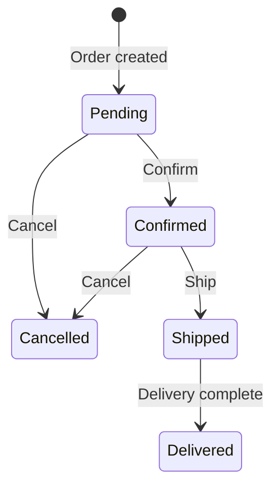
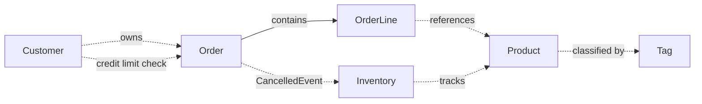
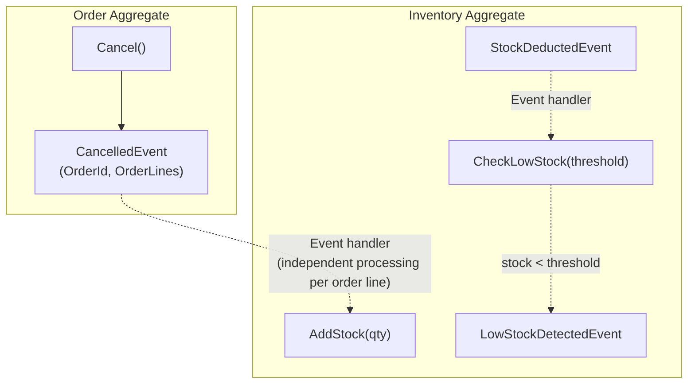

## Background

There is a company operating a B2B e-commerce platform. Corporate customers place orders for products, inventory is deducted, and orders go through a series of steps including shipping and completion. Currently, order validation and inventory management are handled manually, leading to frequent order errors and inventory inconsistencies.

This system automates e-commerce order processing within a single bounded context. Customer-specific credit limit management, product catalog operations, order status tracking, and inventory quantity management are the core business functions.

## Domain Terms

This section defines the key terms used in this domain. Even the same word may carry a different meaning in everyday use versus within the domain, so the entire team uses this glossary as Ubiquitous Language.

| Korean | English | Definition |
|--------|---------|------------|
| Customer | Customer | A user who can create orders |
| Customer Name | CustomerName | The customer's name (100 characters or less) |
| Email | Email | The customer's email address (320 characters or less, lowercase normalized) |
| Credit Limit | CreditLimit | The maximum amount the customer can order |
| Product | Product | An item available for sale |
| Product Name | ProductName | The product's name (100 characters or less, unique) |
| Product Description | ProductDescription | A description of the product (1000 characters or less) |
| Tag | Tag | A label for classifying products |
| Tag Name | TagName | The tag's name (50 characters or less) |
| Order | Order | A purchase request created by a customer |
| Order Line | OrderLine | An individual product item within an order |
| Order Status | OrderStatus | The current state of the order (Pending, Confirmed, Shipped, Delivered, Cancelled) |
| Shipping Address | ShippingAddress | The delivery destination for the order (500 characters or less) |
| Inventory | Inventory | The stock quantity for a specific product |
| Money | Money | A positive monetary amount |
| Quantity | Quantity | A non-negative integer |

## Business Rules

### 1. Customer Management

Customers are the subjects of orders and have a credit limit.

- A customer has a name, email, and credit limit
- Customer name must be 100 characters or less
- Email must be in standard email format and 320 characters or less
- Email is normalized to lowercase before storage
- Credit limit must be a positive monetary amount
- A customer can be created by entering name, email, and credit limit
- A customer's credit limit can be changed
- A customer's email can be changed
- There cannot be more than one customer with the same email

### 2. Product Management

Products are the core unit of the sales catalog and have a lifecycle that includes price changes, tag classification, and soft delete/restore.

- A product has a name, description, and price
- Product name must be 100 characters or less
- Product description must be 1000 characters or less
- Price must be a positive monetary amount
- A product can be created by entering name, description, and price
- Product name, description, and price can be modified
- There cannot be more than one product with the same name
- When checking product name uniqueness, the product itself is excluded
- A product can be soft deleted, with the deletion timestamp and deleter recorded
- A deleted product can be restored
- Delete and restore are idempotent — deleting an already deleted product has no side effects
- Deleted products cannot be modified
- Physical deletion is not allowed

### 3. Order Processing

When a customer orders products, an order is created.

- An order belongs to exactly one customer
- An order must contain at least 1 order line
- An order line includes a product, quantity (1 or more), and unit price
- The subtotal of an order line is automatically calculated as quantity x unit price
- The order total is automatically calculated as the sum of all order line subtotals
- Shipping address must be 500 characters or less
- Order lines cannot be changed after creation

An order goes through the following states in sequence:

- From Pending, can transition to Confirmed or Cancelled
- From Confirmed, can transition to Shipped or Cancelled
- From Shipped, can only transition to Delivered
- Delivered and Cancelled are terminal states — no further transitions are possible
- When an order is cancelled, the order line information (product, quantity, unit price, subtotal) is included in the cancellation event

### 4. Inventory Management

Inventory tracks quantities per product. Product information changes and inventory changes occur independently — inventory deduction during peak order times must not block product information edits.

- Inventory manages the quantity for a single product
- Inventory quantity must be 0 or more
- Inventory can be created by entering a product and initial quantity
- Inventory quantity can be deducted
- Deduction cannot exceed the inventory quantity (overdraft prohibited)
- Inventory quantity can be added
- Multiple orders can deduct the same product's inventory simultaneously — concurrency control is required
- It is possible to check whether inventory quantity is at or below a threshold — a low stock event is raised when detected

### 5. Product Classification (Tags)

Tags are labels for classifying products. Multiple products share the same tag, and changes to a tag do not directly affect products.

- A tag has a tag name
- Tag name must be 50 characters or less
- Tags can be created, renamed, and deleted
- Tags can be assigned to or unassigned from products (idempotent)
- The same tag cannot be assigned to the same product more than once

### 6. Cross-Domain Rules

The following rules cannot be resolved within a single business area and require data from multiple areas.

- The order total must be within the customer's credit limit
- If a single order amount exceeds the credit limit, the order is rejected
- If the total of existing incomplete orders plus the new order total exceeds the credit limit, it is rejected (cumulative verification)
- A clear error is returned when the credit limit is exceeded

## Relationships Between Business Areas

- A customer owns orders
- An order contains order lines, and order lines reference products
- Products are classified by tags
- Inventory tracks quantities per product
- Customer credit limit is verified when creating an order
- When an order is cancelled, inventory is restored via domain events — Order does not directly reference Inventory

### Domain Event-Based Inter-Aggregate Coordination

Order and Inventory are separate Aggregates. Inventory restoration upon order cancellation is loosely coupled through domain events.

## Scenarios

The following scenarios describe concretely how the business requirements operate in practice. Normal scenarios define the behaviors the system allows, and rejection scenarios define the behaviors the system blocks.

### Normal Scenarios

1. **Customer creation** — Create a customer by entering name, email, and credit limit. The email is normalized to lowercase before storage.
2. **Product creation** — Create a product by entering name, description, and price.
3. **Order creation** — Create an order by entering customer, order line list, and shipping address. The total is automatically calculated, and the status starts as Pending.
4. **Order status transitions** — Transition status in the order Pending -> Confirmed -> Shipped -> Delivered.
5. **Product soft delete and restore** — When a product is soft deleted, the deletion timestamp and deleter are recorded. Upon restore, the deletion information is cleared.
6. **Inventory deduction and addition** — Create inventory and deduct quantity according to orders. Later, add quantity upon receiving stock.
6-1. **Order cancellation** — Cancel an order in Pending or Confirmed status. The cancellation event includes order line information.
6-2. **Low stock detection** — If the remaining quantity after inventory deduction is at or below the threshold, a low stock detection event is raised.
7. **Tag creation and rename** — Create a tag and change the tag name.
8. **Credit limit verification pass** — If the order total is within the customer's credit limit, the order is created normally.

### Rejection Scenarios

9. **Order without order lines** — Creating an order without order lines is rejected.
10. **Invalid status transition** — Attempting to transition directly from Pending to Shipped is rejected.
10-1. **Cancellation rejected after shipping** — Cancelling an order in Shipped or Delivered status is rejected.
11. **Modifying a deleted product** — Modifying the name or price of a soft-deleted product is rejected.
12. **Inventory over-deduction** — Deducting more than the inventory quantity is rejected.
13. **Credit limit exceeded** — If the order total exceeds the customer's credit limit, it is rejected.
14. **Duplicate product name** — Creating a new product with an already existing product name is rejected.
15. **Duplicate customer email** — Creating a new customer with an already existing email is rejected.

## States That Must Never Exist

The following are states that must never occur in the system. If such a state exists, rules have been broken, and the type system and domain logic prevent them at the source.

- An order without order lines
- An order where the total and the sum of order line subtotals are inconsistent
- An order that transitioned directly from Pending to Shipped
- A state where a deleted product has been modified
- A state where inventory quantity is negative
- A state where an order exceeding the credit limit exists
- A state where more than one customer has the same email
- A state where more than one product has the same name

In the next step, we analyze these business rules from a DDD perspective to identify independent consistency boundaries (Aggregates) and [classify invariants](../01-type-design-decisions/).
