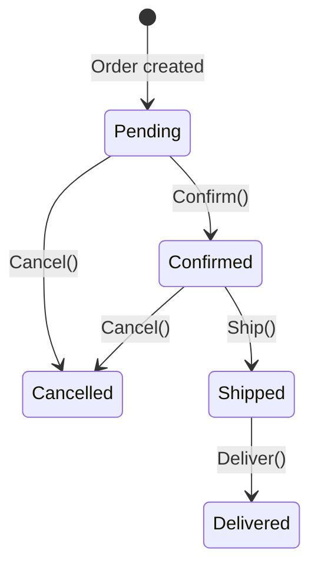
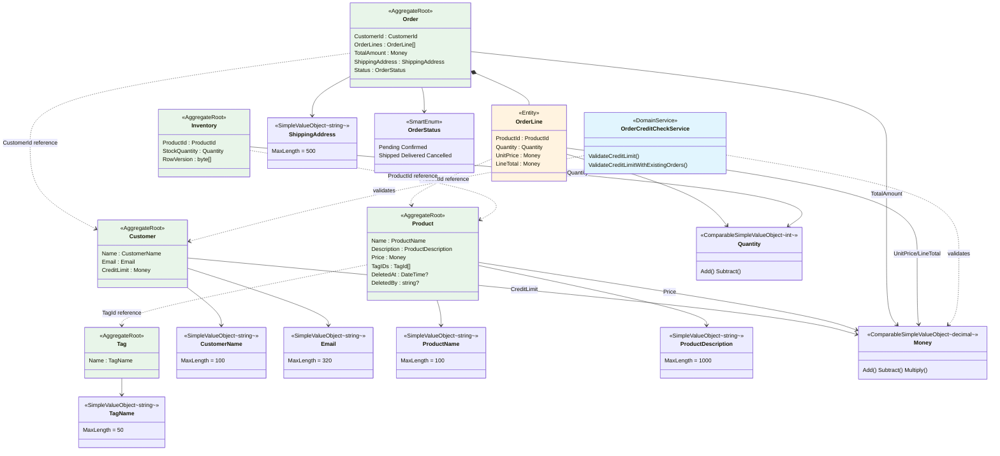

## Overview

This document analyzes the natural language requirements defined in the [business requirements](../00-business-requirements/) from a DDD perspective. The first step is to identify independent consistency boundaries (Aggregates) from the business areas, and the second step is to classify the rules within each boundary as invariants. The goal is to design 'types that cannot represent invalid states,' obtaining compile-time guarantees instead of runtime validation.

## Identifying Aggregates from Business Areas

Before encoding business rules into types, we must first identify independent consistency boundaries from the business areas. From the 6 business topics defined in the [business requirements](../00-business-requirements/), 5 Aggregates are derived.

### Business Topic to Aggregate Mapping

| Business Topic | Aggregate | Rationale |
|----------------|-----------|-----------|
| Customer Management | Customer | Customer-specific lifecycle, independent credit limit management |
| Product Management | Product | Independent changes to product information, soft delete/restore |
| Order Processing | Order | Owns order lines, consistency boundary for state transition rules |
| Inventory Management | Inventory | Different change frequency from Product, concurrency control needed |
| Product Classification | Tag | Independent lifecycle, shared across multiple products |
| Cross-Domain Rules | — | Inter-Aggregate validation -> Domain Service |

### Why Separate Inventory from Product?

Product information (name, description, price) changes and inventory quantity changes differ significantly in frequency and concurrency requirements. Product information is occasionally modified by administrators, while inventory is deducted with every order. If bundled into one boundary, inventory deduction would lock product information, and product edits would lock inventory. Separating them allows independent changes, locking, and concurrency control for each.

### Why Is Tag an Independent Aggregate?

Tags are classification labels shared by multiple products. Tag name changes should not affect products, and tag creation/deletion should be independent of product transactions. Products reference only the tag's ID, so the tag boundary and product boundary do not interfere with each other.

### Summary of Aggregate Separation Reasons

| Aggregate | Separation Reason | Key Invariants |
|-----------|-------------------|----------------|
| **Customer** | Customer-specific lifecycle, independent credit limit management | Email uniqueness, credit limit |
| **Product** | Low-frequency product information changes, soft delete/restore needed | Delete guard, product name uniqueness |
| **Tag** | Independent lifecycle, referenced by ID from multiple Products | Tag name validity |
| **Order** | Owns order lines, state transition rule enforcement | State transitions, TotalAmount consistency, minimum 1 line |
| **Inventory** | Different change frequency from Product, optimistic concurrency control needed | Insufficient stock validation, concurrency |

## Domain Term Mapping

Maps business terms to DDD tactical patterns.

| Korean | English | DDD Pattern | Role |
|--------|---------|-------------|------|
| Customer | Customer | Aggregate Root | Subject of orders, owns credit limit |
| Product | Product | Aggregate Root | Sales catalog unit, supports soft delete |
| Tag | Tag | Aggregate Root | Product classification label, independent lifecycle |
| Order | Order | Aggregate Root | Purchase transaction unit, state transition management |
| Order Line | OrderLine | Entity (child) | Individual product item within an order, dependent on Order |
| Inventory | Inventory | Aggregate Root | Per-product quantity tracking, concurrency control |
| Customer Name | CustomerName | Value Object | String of 100 characters or less |
| Email | Email | Value Object | 320 characters or less, lowercase normalized, regex validated |
| Product Name | ProductName | Value Object | String of 100 characters or less, unique |
| Product Description | ProductDescription | Value Object | String of 1000 characters or less |
| Tag Name | TagName | Value Object | String of 50 characters or less |
| Shipping Address | ShippingAddress | Value Object | String of 500 characters or less |
| Money | Money | Value Object | Positive decimal, supports arithmetic operations |
| Quantity | Quantity | Value Object | Non-negative integer, supports arithmetic operations |
| Order Status | OrderStatus | Value Object (Smart Enum) | 5 states, built-in transition rules |
| Order Credit Check | OrderCreditCheckService | Domain Service | Cross-Aggregate credit limit validation |

## Invariant Classification System

To guarantee business rules in software, rules must be **classified as invariants** and the appropriate type strategy must be chosen for each type. An invariant is "a condition that must be true at any point in the system," and encoding it in types allows the compiler to prevent rule violations.

In this domain, 7 types of invariants were identified.

| Type | Scope | Key Question |
|------|-------|--------------|
| Single Value | Individual field | Is this value always valid? |
| Structural | Field combination | Are derived values consistent in parent-child relationships? |
| State Transition | Changes over time | Do only permitted state changes occur? |
| Lifecycle | Aggregate lifecycle | Are behaviors blocked on deleted objects? |
| Ownership | Child entity boundary | Do children not escape parent boundaries? |
| Cross-Aggregate | Across multiple Aggregates | Where are rules guaranteed that cannot be verified by a single Aggregate? |
| Concurrency | Concurrent access | Is data integrity guaranteed during high-frequency changes? |

## Design Decisions by Invariant

### 1. Single Value Invariants

Constraints requiring that individual fields always hold valid values.

**Business Rules:**
- "Customer name must be 100 characters or less and cannot be empty"
- "Email must be in a valid format and 320 characters or less"
- "Product name must be 100 characters or less and cannot be empty"
- "Product description must be 1000 characters or less"
- "Tag name must be 50 characters or less and cannot be empty"
- "Shipping address must be 500 characters or less and cannot be empty"
- "Money must be positive"
- "Quantity must be 0 or more"

**Problem with Naive Implementation:** All fields are `string`, `decimal`, `int`, so negative amounts, empty names, and 3000-character descriptions can enter. More seriously, `CustomerName` and `ProductName` are both `string`, so accidentally swapping them is silently accepted by the compiler.

**Design Decision: Validate at creation time and guarantee immutability afterward.** Introduce constrained types that make it impossible to create invalid values. Once a value is created, it cannot be changed, so there is no need to re-verify validity in subsequent code. Types requiring arithmetic operations use `ComparableSimpleValueObject<T>`, while types requiring only simple wrapping use `SimpleValueObject<T>`.

**Simple vs Comparable Decision Criteria:**
- **`SimpleValueObject<T>`:** String wrapping types. Size comparison between values has no business meaning, and only equality is needed. Example: there is no business meaning to "which name is greater."
- **`ComparableSimpleValueObject<T>`:** Arithmetic operations or size comparison have business meaning. Money requires `Add`, `Subtract`, `Multiply` and `>`, `<` comparison (credit limit check: `orderAmount > customer.CreditLimit`). Quantity requires `Add`, `Subtract` and insufficient stock comparison (`quantity > StockQuantity`).

**Result:**

| Business Rule | Result Type | Base Type | Validation Rules | Normalization |
|--------------|------------|-----------|-----------------|---------------|
| Customer name 100 char limit | CustomerName | `SimpleValueObject<string>` | NotNull -> NotEmpty -> MaxLength(100) | Trim |
| Email format | Email | `SimpleValueObject<string>` | NotNull -> NotEmpty -> MaxLength(320) -> Matches(Regex) | Trim + lowercase |
| Product name 100 char limit | ProductName | `SimpleValueObject<string>` | NotNull -> NotEmpty -> MaxLength(100) | Trim |
| Product description 1000 char limit | ProductDescription | `SimpleValueObject<string>` | NotNull -> MaxLength(1000) | Trim |
| Tag name 50 char limit | TagName | `SimpleValueObject<string>` | NotNull -> NotEmpty -> MaxLength(50) | Trim |
| Shipping address 500 char limit | ShippingAddress | `SimpleValueObject<string>` | NotNull -> NotEmpty -> MaxLength(500) | Trim |
| Money must be positive | Money | `ComparableSimpleValueObject<decimal>` | Positive | — |
| Quantity must be 0 or more | Quantity | `ComparableSimpleValueObject<int>` | NonNegative | — |

Having ensured the validity of individual fields, the next step is to verify that relationships between fields are consistent.

### 2. Structural Invariants

Constraints requiring that field combinations always represent valid states.

**Business Rules:**
- "An order must contain at least 1 order line"
- "An order line's LineTotal = UnitPrice * Quantity, automatically calculated"
- "An order's TotalAmount = sum of all OrderLine LineTotals, automatically calculated"
- "Order line quantity must be at least 1 (the Quantity VO allows 0 or more, but 0 is meaningless in the order line context)"

**Problem with Naive Implementation:** If `TotalAmount` is set externally, it can be inconsistent with the actual `OrderLine` sum. If `LineTotal` is managed separately, it can diverge from `UnitPrice * Quantity`. An order can be created with an empty order line list.

**Design Decision: Automatically compute derived values inside the Aggregate and block external setting.**
- `OrderLine.Create()` automatically computes `LineTotal = UnitPrice.Multiply(Quantity)`. There is no path to directly specify `LineTotal` from outside.
- `Order.Create()` automatically computes `TotalAmount = Sum(lines.LineTotal)`. If order lines are empty, it returns an `EmptyOrderLines` error.
- `OrderLine` performs context-specific additional validation (`> 0`) on `Quantity`. By separating VO-level validation (0 or more) and entity-level validation (1 or more), the same `Quantity` VO can be used in both inventory (`0` allowed) and order line (`1` or more) contexts.

**Result:**

| Structural Rule | Computation Location | Guarantee Mechanism |
|----------------|---------------------|---------------------|
| LineTotal = UnitPrice * Quantity | `OrderLine.Create()` | Auto-computed in factory method, private constructor |
| TotalAmount = Sum(LineTotals) | `Order.Create()` | Auto-computed in factory method, private constructor |
| OrderLines >= 1 | `Order.Create()` | Returns `Fin<Order>` failure on empty list |
| OrderLine Quantity >= 1 | `OrderLine.Create()` | Returns `Fin<OrderLine>` failure on 0 or less |

After establishing structural consistency, we must control whether state changes over time follow the rules.

### 3. State Transition Invariants

Constraints requiring that changes over time follow only prescribed rules.

**Business Rules:**
- "Order status transitions only in the order Pending -> Confirmed -> Shipped -> Delivered"
- "Can only transition to Cancelled from Pending or Confirmed status"
- "Cannot cancel from Shipped or Delivered status"
- "Delivered and Cancelled are terminal states"

**Problem with Naive Implementation:** Using `string Status` or `enum OrderStatus` allows any value to be set. Using flags like `bool IsConfirmed`, `bool IsShipped` allows contradictory states like `IsConfirmed = false, IsShipped = true`, and the complexity of flag combinations grows exponentially when new states are added.

**Design Decision: Use the Smart Enum pattern to declaratively define allowed transitions.** Implement `OrderStatus` as `SimpleValueObject<string>`, exposing only `static readonly` instances and restricting the constructor to `private`. Declare allowed transition rules as `HashMap<string, Seq<string>>`, and validate with the `CanTransitionTo()` method. `Order`'s state transition methods (`Confirm`, `Ship`, `Deliver`, `Cancel`) internally call `TransitionTo()`, which returns a `Fin<Unit>` failure on illegal transitions.

**Why Smart Enum is better than bool flags:**
- Allowed transitions are declared as data (`AllowedTransitions`) and can be understood at a glance.
- When adding a new state, just add one line to `HashMap`.
- Contradictory states are structurally impossible — the state is always exactly one.

**State Transition Diagram:**

**Result:**
- `OrderStatus`: `SimpleValueObject<string>` + Smart Enum pattern
- 5 states: Pending, Confirmed, Shipped, Delivered, Cancelled
- `CanTransitionTo()`: Allowed transition validation
- `Order.TransitionTo()`: Transition execution + domain event publication

Having controlled state transitions, we now verify that behaviors are correct across the entire lifecycle of the aggregate.

### 4. Lifecycle Invariants

Constraints requiring that the creation, modification, and deletion lifecycle of an Aggregate follows the rules.

**Business Rules:**
- "Products support soft delete/restore, with the deleter and timestamp recorded"
- "Deleted products cannot be updated"
- "Delete/restore are idempotent — deleting an already deleted product causes no error"

**Problem with Naive Implementation:** Managing with `bool IsDeleted` provides no way to prevent `Update()` being called on a deleted product. Deletion timestamp/deleter information must be managed in separate fields, creating possible contradictory states like `IsDeleted = false` with a deletion timestamp present.

**Design Decision: Combine the `ISoftDeletableWithUser` interface with a delete guard.** `Product` implements `ISoftDeletableWithUser` to manage `DeletedAt` and `DeletedBy` as `Option<T>`. The `Update()` method returns an `AlreadyDeleted` error if `DeletedAt.IsSome`. `Delete()` and `Restore()` are designed as idempotent — if already deleted/restored, they return `this` without any action.

**Result:**
- `Product`: `AggregateRoot<ProductId>` + `IAuditable` + `ISoftDeletableWithUser`
- `DeletedAt`, `DeletedBy`: null-safe management via `Option<T>`
- `Update()`: Delete guard -> `Fin<Product>` (failable)
- `Delete()`, `Restore()`: Idempotent -> `Product` (always succeeds)
- Dual factory: `Create` (domain creation, event publication) + `CreateFromValidated` (ORM restoration, no events)

Having managed the lifecycle, we now verify that ownership relationships within the aggregate do not cross boundaries.

### 5. Ownership Invariants

Constraints requiring that child entities within an Aggregate do not escape the boundary.

**Business Rules:**
- "Order lines are dependent on orders — they cannot exist independently"
- "Tags are independent Aggregates, and products reference only the tag's ID"
- "Orders reference only the customer's ID — they do not contain the entire customer"

**Problem with Naive Implementation:** If `OrderLine` is managed as an independent entity, it can be directly created or deleted outside the Aggregate boundary. If `Product` references the entire `Tag`, tag changes require loading Products, creating unnecessary coupling.

**Design Decision: Distinguish between child entities and cross-references.**
- **Ownership relationship (OrderLine -> Order):** `OrderLine` is modeled as `Entity<OrderLineId>`, existing only in `Order`'s internal `private List<OrderLine>`. Only `IReadOnlyList<OrderLine>` is exposed externally. `OrderLine` creation is only possible during `Order.Create()`.
- **ID reference relationship (TagId -> Product):** `Product` manages `List<TagId>`. Since it does not reference the entire `Tag` entity, changes to the Tag Aggregate do not affect Products. Managed via `AssignTag()`/`UnassignTag()` with idempotency guaranteed.
- **Cross-Aggregate reference (CustomerId -> Order):** `Order` holds `CustomerId` as a value. Since it does not directly reference the Customer Aggregate, transaction boundaries are separated.

**Result:**

| Relationship Type | Implementation | Access Approach |
|-------------------|---------------|-----------------|
| OrderLine -> Order | `Entity<OrderLineId>`, private collection | `IReadOnlyList` exposure |
| TagId -> Product | `List<TagId>`, ID reference only | `AssignTag()`/`UnassignTag()` idempotent |
| CustomerId -> Order | Held as value | Cross-Aggregate ID reference |
| ProductId -> OrderLine | Held as value | Cross-Aggregate ID reference |
| ProductId -> Inventory | Held as value | Cross-Aggregate ID reference |

Having defined all invariants within a single aggregate, we now design how to guarantee rules that span multiple aggregates.

### 6. Cross-Aggregate Invariants

Constraints requiring validation of rules across multiple Aggregates.

**Business Rules:**
- "The order amount must not exceed the customer's credit limit"
- "Existing orders and the new order must be summed and within the credit limit"
- "Customers with the same email cannot be registered in duplicate"
- "Products with the same name cannot be registered in duplicate (excluding self during updates)"

**Problem with Naive Implementation:** If a single Aggregate directly queries another Aggregate's state internally, the Aggregate boundary is broken. If Repositories are called directly from the domain model, infrastructure dependencies infiltrate.

**Design Decision: Separate Domain Service and Specification by role.**

- **Domain Service (`IDomainService`):** Receives data from multiple Aggregates and performs business logic. The Application Layer queries the necessary Aggregates and passes them, and the Domain Service executes only pure domain logic. `OrderCreditCheckService` receives `Customer` and `Order` (or `Money`) and validates the credit limit.
- **Specification (`ExpressionSpecification<T>`):** Encapsulates query conditions for a single Aggregate as `Expression<Func<T, bool>>`. Since EF Core automatically translates to SQL, domain rules are consistently applied down to the database level. `CustomerEmailSpec`, `ProductNameUniqueSpec`, `ProductNameSpec`, `ProductPriceRangeSpec`, and `InventoryLowStockSpec` fall into this category.

**Domain Service vs Specification Decision Criteria:**

| Criteria | Domain Service | Specification |
|----------|---------------|---------------|
| Number of Aggregates involved | 2 or more | 1 |
| Data access pattern | Application Layer queries then passes | Repository queries via Expression |
| Return type | `Fin<Unit>` (pass/fail) | `Expression<Func<T, bool>>` |
| Representative case | Credit limit validation | Email duplicate, product name duplicate |

**Result:**

| Rule | Implementation | Type |
|------|---------------|------|
| Credit limit validation | `OrderCreditCheckService : IDomainService` | Domain Service |
| Customer email duplicate | `CustomerEmailSpec : ExpressionSpecification<Customer>` | Specification |
| Product name duplicate (excluding self) | `ProductNameUniqueSpec : ExpressionSpecification<Product>` | Specification |
| Product name search | `ProductNameSpec : ExpressionSpecification<Product>` | Specification |
| Price range filter | `ProductPriceRangeSpec : ExpressionSpecification<Product>` | Specification |
| Low stock filter | `InventoryLowStockSpec : ExpressionSpecification<Inventory>` | Specification |

Having addressed cross-aggregate rules, we must now ensure data integrity under concurrent access.

### 7. Concurrency Invariants

Constraints requiring that data integrity is guaranteed under concurrent access.

**Business Rules:**
- "Inventory deduction occurs with every order, and multiple orders can deduct the same product's inventory simultaneously"
- "Deduction must fail if inventory is insufficient"

**Problem with Naive Implementation:** Without concurrency control, if two orders simultaneously read the same inventory and each deducts and saves, one deduction is lost (lost update). Pessimistic locking becomes a performance bottleneck.

**Design Decision: Apply optimistic concurrency control (`IConcurrencyAware`).** `Inventory` manages `byte[] RowVersion`, and if RowVersion does not match during save, EF Core raises `DbUpdateConcurrencyException`. This is more efficient than pessimistic locking for high-frequency updates, and the Application Layer can apply retry strategies on conflict.

**Why Inventory was separated from Product:** Product information (name, description, price) change frequency and inventory change frequency differ significantly. If bundled into one Aggregate, every inventory deduction would lock product information, and every product information change would lock inventory. Separating them allows independent changes/locking/concurrency control for each.

**Result:**
- `Inventory`: `AggregateRoot<InventoryId>` + `IAuditable` + `IConcurrencyAware`
- `byte[] RowVersion`: Optimistic concurrency token
- `DeductStock()`: Returns `Fin<Unit>` failure on insufficient stock
- `AddStock()`: Always succeeds -> returns `Inventory`

## Domain Model Structure

The comprehensive structure of 5 Aggregates with their Value Objects and relationships.

The following diagram shows the comprehensive domain model structure of 5 aggregates with their value objects and relationships. Solid arrows represent ownership relationships, and dashed arrows represent ID references.

## Invariant Summary Table

| Invariant | Type | Guarantee Mechanism | Related Aggregate |
|-----------|------|---------------------|-------------------|
| Customer name 100 chars or less | Single Value | `CustomerName`: NotNull -> NotEmpty -> MaxLength(100) -> Trim | Customer |
| Email format/320 chars | Single Value | `Email`: NotNull -> NotEmpty -> MaxLength(320) -> Regex -> Trim + lowercase | Customer |
| Product name 100 chars or less | Single Value | `ProductName`: NotNull -> NotEmpty -> MaxLength(100) -> Trim | Product |
| Product description 1000 chars or less | Single Value | `ProductDescription`: NotNull -> MaxLength(1000) -> Trim | Product |
| Tag name 50 chars or less | Single Value | `TagName`: NotNull -> NotEmpty -> MaxLength(50) -> Trim | Tag |
| Shipping address 500 chars or less | Single Value | `ShippingAddress`: NotNull -> NotEmpty -> MaxLength(500) -> Trim | Order |
| Money must be positive | Single Value | `Money`: Positive validation | Shared (Customer, Product, Order) |
| Quantity must be 0 or more | Single Value | `Quantity`: NonNegative validation | Shared (OrderLine, Inventory) |
| LineTotal = UnitPrice * Quantity | Structural | Auto-computed in `OrderLine.Create()` | Order |
| TotalAmount = Sum(LineTotals) | Structural | Auto-computed in `Order.Create()` | Order |
| Order lines >= 1 | Structural | Empty list rejected in `Order.Create()` | Order |
| Order line quantity >= 1 | Structural | 0 or less rejected in `OrderLine.Create()` | Order |
| Order status transition rules | State Transition | `OrderStatus` Smart Enum + `CanTransitionTo()` | Order |
| Blocked updates on deleted products | Lifecycle | Delete guard in `Product.Update()` | Product |
| Delete/restore idempotency | Lifecycle | `Delete()`/`Restore()` conditional execution after state check | Product |
| Order lines depend on orders | Ownership | private `List<OrderLine>` + `IReadOnlyList` exposure | Order |
| Tags referenced by ID only | Ownership | `List<TagId>` (no entity reference) | Product |
| Cross-Aggregate ID references | Ownership | `CustomerId`, `ProductId` held as values | Order, OrderLine, Inventory |
| Credit limit validation | Cross-Aggregate | `OrderCreditCheckService : IDomainService` | Customer + Order |
| Email uniqueness | Cross-Aggregate | `CustomerEmailSpec : ExpressionSpecification` | Customer |
| Product name uniqueness | Cross-Aggregate | `ProductNameUniqueSpec : ExpressionSpecification` | Product |
| Inventory concurrency guarantee | Concurrency | `IConcurrencyAware` + `byte[] RowVersion` | Inventory |
| Insufficient stock validation | Concurrency | Quantity comparison in `DeductStock()` -> `Fin<Unit>` | Inventory |

The 7 invariant types guarantee domain rules at different levels. Single value invariants guarantee the validity of individual fields, structural invariants guarantee consistency between fields, and state transition invariants control changes over time. Lifecycle and ownership invariants protect aggregate boundaries, while cross-aggregate invariants and concurrency invariants guarantee system-wide integrity. Thanks to this layered protection structure, no code path can lead to an invalid state.

The implementation of these strategies using C# and Functorium DDD building blocks is covered in the code design section.
