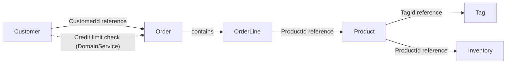

## Background

E-commerce domain: 5 Aggregates (Customer, Product, Order, Inventory, Tag) + Domain Service + Application Layer CQRS.

## Naive Starting Point

```csharp
public class Order
{
    public string CustomerId { get; set; }
    public string Status { get; set; }
    public decimal TotalAmount { get; set; }
    public List<OrderLineDto> Lines { get; set; }
}

public class OrderLineDto
{
    public string ProductId { get; set; }
    public int Quantity { get; set; }
    public decimal UnitPrice { get; set; }
}
```

This implementation compiles and runs. However, it permits the following invalid states:
- Any string can be assigned to Status — invalid order states are possible
- Negative amounts, zero or negative quantities — no value range validation
- Empty order lines — orders without any items can be created
- Manual total calculation — TotalAmount and the sum of line totals can be inconsistent
- No credit limit verification — orders exceeding customer credit are confirmed

## Goal

4 guarantees:

1. **Type safety** — Value objects are fully validated at creation time
2. **Invariant enforcement** — State machines and structural constraints prevent invalid states at the source
3. **CQRS separation** — Command/Query independent optimization
4. **Pipeline automation** — Validation/error handling automation via Apply pattern + FinT monad

DDD tactical patterns define rule boundaries, and Functorium's functional types enforce them at the compiler level.

## Two-Track Journey Map

This example divides the Domain layer and Application layer into two tracks, going from naive code to a complete DDD model through 4 stages each.

| Stage | Domain Layer | Application Layer |
|-------|--------------|-------------------|
| 0. Requirements | [Domain business requirements](./domain/00-business-requirements/) | [Application business requirements](./application/00-business-requirements/) |
| 1. Design | [Domain type design decisions](./domain/01-type-design-decisions/) | [Application type design decisions](./application/01-type-design-decisions/) |
| 2. Code | [Domain code design](./domain/02-code-design/) | [Application code design](./application/02-code-design/) |
| 3. Results | [Domain implementation results](./domain/03-implementation-results/) | [Application implementation results](./application/03-implementation-results/) |

## Applied DDD Building Blocks

| DDD Concept | Functorium Type | Application |
|-------------|----------------|-------------|
| Value Object | `SimpleValueObject<T>`, `ComparableSimpleValueObject<T>` | CustomerName, Email, Money, Quantity, ProductName, etc. |
| Smart Enum | `SimpleValueObject<string>` + `HashMap` | OrderStatus (5 states, transition rules) |
| Entity | `Entity<TId>` | OrderLine (child entity) |
| Aggregate Root | `AggregateRoot<TId>` | Customer, Product, Order, Inventory, Tag |
| Domain Event | `DomainEvent` | 19 types (Created, Updated, Confirmed, etc.) |
| Domain Error | `DomainErrorKind.Custom` | EmptyOrderLines, InvalidOrderStatusTransition, etc. |
| Specification | `ExpressionSpecification<T>` | ProductNameSpec, CustomerEmailSpec, etc. (6 types) |
| Domain Service | `IDomainService` | OrderCreditCheckService |
| Repository | `IRepository<T, TId>` | 5 Repository interfaces |

## Applied Application Patterns

| Pattern | Implementation | Application |
|---------|---------------|-------------|
| CQRS | `ICommandUsecase` / `IQueryUsecase` | 10 Commands, 9 Queries |
| Apply Pattern | `tuple.Apply()` | Parallel VO validation composition |
| FinT LINQ | `from...in` chaining | Asynchronous error propagation |
| Port/Adapter | `IQueryPort`, `IRepository` | Read/write separation |
| FluentValidation | `MustSatisfyValidation` | Syntactic + semantic dual validation |
| Nested Class | Request, Response, Validator, Usecase | Use Case encapsulation |

## Project Structure

```
samples/ecommerce-ddd/
├── Directory.Build.props
├── Directory.Build.targets
├── ecommerce-ddd.slnx
├── domain/                               # Domain layer documentation
│   ├── 00-business-requirements.md
│   ├── 01-type-design-decisions.md
│   ├── 02-code-design.md
│   └── 03-implementation-results.md
├── application/                          # Application layer documentation
│   ├── 00-business-requirements.md
│   ├── 01-type-design-decisions.md
│   ├── 02-code-design.md
│   └── 03-implementation-results.md
├── Src/
│   ├── ECommerce.Domain/
│   │   ├── SharedModels/
│   │   │   ├── ValueObjects/ (Money, Quantity)
│   │   │   └── Services/ (OrderCreditCheckService)
│   │   └── AggregateRoots/
│   │       ├── Customers/ (Customer, VOs, Specs)
│   │       ├── Products/ (Product, VOs, Specs)
│   │       ├── Orders/ (Order, OrderLine, VOs)
│   │       ├── Inventories/ (Inventory, Specs)
│   │       └── Tags/ (Tag, VOs)
│   └── ECommerce.Application/
│       ├── Ports/ (IExternalPricingService)
│       └── Usecases/
│           ├── Products/ (Commands, Queries, Ports)
│           ├── Customers/ (Commands, Queries, Ports)
│           ├── Orders/ (Commands, Queries, Ports)
│           └── Inventories/ (Queries, Ports)
└── Tests/
    └── ECommerce.Tests.Unit/ (301 tests)
        ├── Architecture/          # Architecture rule verification (26 tests)
        ├── Domain/
        └── Application/
```

## How to Run

```bash
# Build
dotnet build Docs.Site/src/content/docs/samples/ecommerce-ddd/ecommerce-ddd.slnx

# Test
dotnet test --solution Docs.Site/src/content/docs/samples/ecommerce-ddd/ecommerce-ddd.slnx
```

## Aggregate Relationship Diagram


