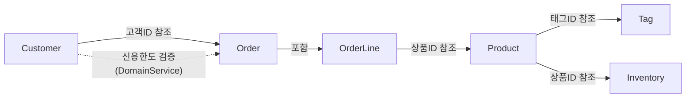

## 배경

전자상거래 도메인: 5개 Aggregate (Customer, Product, Order, Inventory, Tag) + Domain Service + Application Layer CQRS.
이 샘플은 Tests.Hosts/01-SingleHost의 Domain + Application 레이어를 추출하여 DDD 빌딩 블록과 Application 패턴을 문서화한 것입니다.

## Naive 출발점

```csharp
public class Order
{
    public string CustomerId { get; set; }
    public string Status { get; set; }
    public decimal TotalAmount { get; set; }
    public List<OrderLineDto> Lines { get; set; }
}

public class OrderLineDto
{
    public string ProductId { get; set; }
    public int Quantity { get; set; }
    public decimal UnitPrice { get; set; }
}
```

이 구현은 컴파일되고 실행됩니다. 하지만 다음과 같은 잘못된 상태를 허용합니다:
- 아무 문자열이나 Status에 대입 — 유효하지 않은 주문 상태가 가능합니다
- 음수 금액, 0 이하 수량 — 값 범위 검증이 없습니다
- 빈 주문 라인 — 주문 항목 없는 주문이 생성됩니다
- 수동 합계 계산 — TotalAmount와 라인 합계가 불일치할 수 있습니다
- 신용 한도 미검증 — 고객 신용을 초과하는 주문이 확정됩니다

## 목표

4가지 보장:

1. **타입 안전성** — 값 객체가 생성 시점에 검증 완료
2. **불변식 보장** — 상태 머신, 구조적 제약이 잘못된 상태를 원천 차단
3. **CQRS 분리** — Command/Query 독립 최적화
4. **파이프라인 자동화** — Apply 패턴 + FinT 모나드로 검증/에러 처리 자동화

DDD 전술적 패턴이 규칙 경계를 정의하고, Functorium의 함수형 타입이 이를 컴파일러 수준에서 강제합니다.

## 두 트랙 여정표

이 샘플은 Domain 레이어와 Application 레이어를 두 트랙으로 나누어, naive한 코드에서 완성된 DDD 모델까지 각 4단계를 거칩니다.

| 단계 | Domain 레이어 | Application 레이어 |
|------|--------------|-------------------|
| 0. 요구사항 | [도메인 비즈니스 요구사항](./domain/00-business-requirements/) | [애플리케이션 비즈니스 요구사항](./application/00-business-requirements/) |
| 1. 설계 | [도메인 타입 설계 의사결정](./domain/01-type-design-decisions/) | [애플리케이션 타입 설계 의사결정](./application/01-type-design-decisions/) |
| 2. 코드 | [도메인 코드 설계](./domain/02-code-design/) | [애플리케이션 코드 설계](./application/02-code-design/) |
| 3. 결과 | [도메인 구현 결과](./domain/03-implementation-results/) | [애플리케이션 구현 결과](./application/03-implementation-results/) |

## 적용된 DDD 빌딩 블록

| DDD 개념 | Functorium 타입 | 적용 |
|----------|----------------|------|
| Value Object | `SimpleValueObject<T>`, `ComparableSimpleValueObject<T>` | CustomerName, Email, Money, Quantity, ProductName 등 |
| Smart Enum | `SimpleValueObject<string>` + `HashMap` | OrderStatus (5 states, transition rules) |
| Entity | `Entity<TId>` | OrderLine (child entity) |
| Aggregate Root | `AggregateRoot<TId>` | Customer, Product, Order, Inventory, Tag |
| Domain Event | `DomainEvent` | 19종 (Created, Updated, Confirmed 등) |
| Domain Error | `DomainErrorType.Custom` | EmptyOrderLines, InvalidOrderStatusTransition 등 |
| Specification | `ExpressionSpecification<T>` | ProductNameSpec, CustomerEmailSpec 등 6종 |
| Domain Service | `IDomainService` | OrderCreditCheckService |
| Repository | `IRepository<T, TId>` | 5개 Repository 인터페이스 |

## 적용된 Application 패턴

| 패턴 | 구현 | 적용 |
|------|------|------|
| CQRS | `ICommandUsecase` / `IQueryUsecase` | 10 Commands, 9 Queries |
| Apply Pattern | `tuple.Apply()` | VO 병렬 검증 합성 |
| FinT LINQ | `from...in` 체이닝 | 비동기 에러 전파 |
| Port/Adapter | `IQueryPort`, `IRepository` | 읽기/쓰기 분리 |
| FluentValidation | `MustSatisfyValidation` | 구문 + 의미 이중 검증 |
| Nested Class | Request, Response, Validator, Usecase | Use Case 캡슐화 |

## 프로젝트 구조

```
samples/ecommerce-ddd/
├── Directory.Build.props
├── Directory.Build.targets
├── ecommerce-ddd.slnx
├── domain/                               # 도메인 레이어 문서
│   ├── 00-business-requirements.md
│   ├── 01-type-design-decisions.md
│   ├── 02-code-design.md
│   └── 03-implementation-results.md
├── application/                          # 애플리케이션 레이어 문서
│   ├── 00-business-requirements.md
│   ├── 01-type-design-decisions.md
│   ├── 02-code-design.md
│   └── 03-implementation-results.md
├── Src/
│   ├── ECommerce.Domain/
│   │   ├── SharedModels/
│   │   │   ├── ValueObjects/ (Money, Quantity)
│   │   │   └── Services/ (OrderCreditCheckService)
│   │   └── AggregateRoots/
│   │       ├── Customers/ (Customer, VOs, Specs)
│   │       ├── Products/ (Product, VOs, Specs)
│   │       ├── Orders/ (Order, OrderLine, VOs)
│   │       ├── Inventories/ (Inventory, Specs)
│   │       └── Tags/ (Tag, VOs)
│   └── ECommerce.Application/
│       ├── Ports/ (IExternalPricingService)
│       └── Usecases/
│           ├── Products/ (Commands, Queries, Ports)
│           ├── Customers/ (Commands, Queries, Ports)
│           ├── Orders/ (Commands, Queries, Ports)
│           └── Inventories/ (Queries, Ports)
└── Tests/
    └── ECommerce.Tests.Unit/ (301개 테스트)
        ├── Architecture/          # 아키텍처 규칙 검증 (26개 테스트)
        ├── Domain/
        └── Application/
```

## 실행 방법

```bash
# 빌드
dotnet build Docs.Site/src/content/docs/samples/ecommerce-ddd/ecommerce-ddd.slnx

# 테스트
dotnet test --solution Docs.Site/src/content/docs/samples/ecommerce-ddd/ecommerce-ddd.slnx
```

## Aggregate 관계 다이어그램


