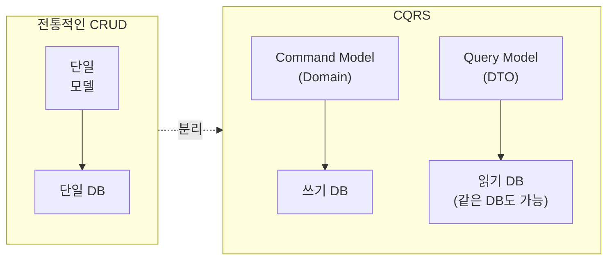
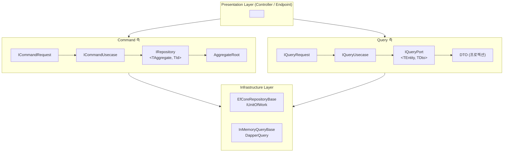
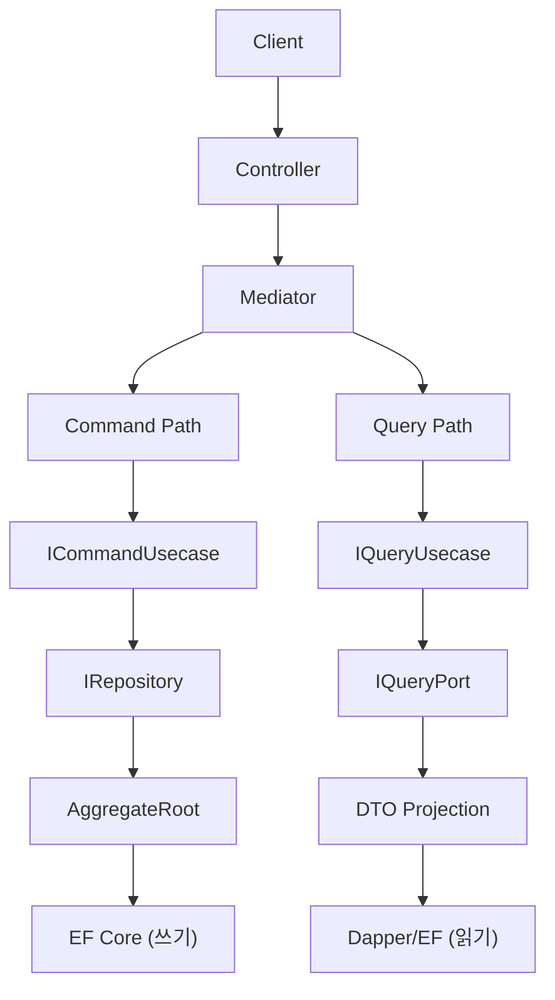

## 개요

CQRS(Command Query Responsibility Segregation)는 **데이터를 변경하는 Command와 데이터를 조회하는 Query의 책임을 분리**하는 아키텍처 패턴입니다. Greg Young이 Bertrand Meyer의 CQS(Command Query Separation) 원칙을 아키텍처 수준으로 확장한 개념으로, 읽기와 쓰기에 각각 최적화된 모델을 사용합니다.

---

## CQS에서 CQRS로

### CQS (Command Query Separation)

Bertrand Meyer가 정의한 원칙으로, **메서드 수준**에서 Command와 Query를 분리합니다:

- **Command**: 상태를 변경하고, 값을 반환하지 않음 (void)
- **Query**: 상태를 변경하지 않고, 값을 반환함

```csharp
// CQS 원칙을 따르는 메서드 설계
public class ShoppingCart
{
    // Command: 상태 변경, 반환 없음
    public void AddItem(Product product, int quantity) { ... }

    // Query: 상태 변경 없음, 값 반환
    public decimal GetTotalPrice() { ... }
}
```

### CQRS (Command Query Responsibility Segregation)

Greg Young이 CQS를 **아키텍처 수준**으로 확장한 패턴입니다. 메서드가 아닌 **모델 자체를 분리**합니다:



---

## 왜 읽기와 쓰기를 분리하는가

### 읽기와 쓰기의 근본적 차이

| 특성 | Command (쓰기) | Query (읽기) |
|------|---------------|-------------|
| **모델** | 도메인 모델 (Aggregate Root) | DTO (프로젝션) |
| **검증** | 도메인 불변식 검증 필수 | 불필요 |
| **트랜잭션** | 필수 (일관성 보장) | 불필요 (읽기 전용) |
| **성능 특성** | 정합성 우선 | 속도 우선 |
| **확장** | 수직 확장 (Scale Up) | 수평 확장 (Scale Out) |
| **빈도** | 상대적으로 적음 | 상대적으로 많음 |

### 단일 모델의 문제

```csharp
// 하나의 Order 클래스가 모든 책임을 짊어짐
public class Order
{
    // 쓰기에 필요한 도메인 로직
    public void AddItem(Product product, int qty) { ... }
    public void Cancel() { ... }
    private void ValidateBusinessRules() { ... }

    // 읽기에 필요한 프로퍼티
    public string CustomerName { get; set; }      // 조인 결과
    public decimal TotalAmount { get; set; }       // 계산 결과
    public int ItemCount { get; set; }             // 집계 결과
    public string StatusDescription { get; set; }  // 표시용 문자열
}
```

**문제점:**
- 쓰기에 불필요한 읽기 전용 필드가 도메인 모델을 오염
- 읽기 최적화(조인, 집계)가 도메인 로직에 영향
- 한쪽의 변경이 다른 쪽에 불필요한 영향

---

## Functorium의 CQRS 아키텍처

Functorium은 CQRS 패턴을 다음과 같은 타입 계층으로 구현합니다:



### Command 측: IRepository

Aggregate Root 단위의 쓰기 작업을 담당합니다:

```csharp
public interface IRepository<TAggregate, TId>
    where TAggregate : AggregateRoot<TId>
    where TId : struct, IEntityId<TId>
{
    FinT<IO, TAggregate> Create(TAggregate aggregate);
    FinT<IO, TAggregate> GetById(TId id);
    FinT<IO, TAggregate> Update(TAggregate aggregate);
    FinT<IO, int> Delete(TId id);
    // + CreateRange, GetByIds, UpdateRange, DeleteRange
}
```

**핵심 특징:**
- Aggregate Root 단위로 영속화 (DDD 원칙)
- `FinT<IO, T>` 반환으로 함수형 에러 처리
- 제네릭 제약으로 컴파일 타임 타입 안전성

### Query 측: IQueryPort

Specification 기반 검색과 DTO 프로젝션을 담당합니다:

```csharp
public interface IQueryPort<TEntity, TDto>
{
    FinT<IO, PagedResult<TDto>> Search(
        Specification<TEntity> spec,
        PageRequest page,
        SortExpression sort);

    FinT<IO, CursorPagedResult<TDto>> SearchByCursor(
        Specification<TEntity> spec,
        CursorPageRequest cursor,
        SortExpression sort);

    IAsyncEnumerable<TDto> Stream(
        Specification<TEntity> spec,
        SortExpression sort,
        CancellationToken cancellationToken = default);
}
```

**핵심 특징:**
- Specification 기반 동적 검색
- 3가지 페이지네이션: Offset, Cursor, Stream
- DTO 프로젝션으로 읽기 최적화

IQueryPort\<TEntity, TDto\>의 Search, SearchByCursor, Stream 메서드는 모두 `Specification<TEntity>`를 매개변수로 받습니다.
Specification 패턴의 상세 학습은 [Specification 패턴으로 도메인 규칙 구현하기](../../Implementing-Specification-Pattern/)를 참조하세요.

### Usecase 통합: Mediator 패턴

Command와 Query를 Mediator를 통해 디스패치합니다:

```csharp
// Command Usecase
public interface ICommandRequest<TSuccess> : ICommand<FinResponse<TSuccess>> { }
public interface ICommandUsecase<in TCommand, TSuccess>
    : ICommandHandler<TCommand, FinResponse<TSuccess>>
    where TCommand : ICommandRequest<TSuccess> { }

// Query Usecase
public interface IQueryRequest<TSuccess> : IQuery<FinResponse<TSuccess>> { }
public interface IQueryUsecase<in TQuery, TSuccess>
    : IQueryHandler<TQuery, FinResponse<TSuccess>>
    where TQuery : IQueryRequest<TSuccess> { }
```

### 함수형 합성: FinT

Repository와 Usecase 계층 간 변환을 위한 함수형 타입입니다:

```csharp
// Repository 계층: FinT<IO, T>
FinT<IO, Order> result = repository.GetById(orderId);

// Usecase 계층: FinResponse<T>
FinResponse<OrderDto> response = fin.ToFinResponse(order => order.ToDto());
```

---

## 전통적 아키텍처 vs CQRS 비교

### 전통적 아키텍처

```
Client -> Controller -> Service -> Repository -> DB
                                      |
                          하나의 모델로 읽기/쓰기 처리
```

### CQRS 아키텍처



---

## Functorium 타입 계층

이 튜토리얼에서 사용하는 Functorium의 CQRS 타입 계층입니다:

```
도메인 엔티티
├── Entity<TId> (추상 클래스)
│   └── AggregateRoot<TId> (추상 클래스)
├── IEntityId<TId> (인터페이스)
├── IDomainEvent (인터페이스)
├── IAuditable / ISoftDeletable (인터페이스)
└── Specification<T> (검색 조건)

Command 측 (쓰기)
├── IRepository<TAggregate, TId>
├── InMemoryRepositoryBase
├── EfCoreRepositoryBase
├── IUnitOfWork / IUnitOfWorkTransaction
└── ICommandRequest / ICommandUsecase

Query 측 (읽기)
├── IQueryPort<TEntity, TDto>
├── InMemoryQueryBase
├── DapperQueryBase
├── PagedResult<T> / CursorPagedResult<T>
└── IQueryRequest / IQueryUsecase

함수형 타입
├── FinT<IO, T> (Repository 반환 타입)
├── FinResponse<T> (Usecase 반환 타입)
└── ToFinResponse() (Fin -> FinResponse 변환)
```

---

## 이 튜토리얼의 학습 흐름

```
Part 1: 도메인 엔티티 기초
├── Entity<TId>와 IEntityId 구현
├── AggregateRoot<TId>와 도메인 불변식
├── IDomainEvent를 통한 도메인 이벤트
└── IAuditable, ISoftDeletable 인터페이스

Part 2: Command 측 -- Repository 패턴
├── IRepository 인터페이스 설계
├── InMemory Repository 구현
├── EF Core Repository 구현
└── Unit of Work 패턴

Part 3: Query 측 -- 읽기 전용 패턴
├── IQueryPort 인터페이스 설계
├── Command DTO vs Query DTO 분리
├── Offset/Cursor/Stream 페이지네이션
├── InMemory Query 어댑터
└── Dapper Query 어댑터

Part 4: CQRS Usecase 통합
├── Command/Query Usecase 구현
├── FinT -> FinResponse 변환
├── 도메인 이벤트 흐름
└── 트랜잭션 파이프라인

Part 5: 도메인별 실전 예제
├── 주문 관리 CQRS
├── 고객 관리 + Specification
├── 재고 관리 + Soft Delete
└── 카탈로그 검색 + 페이지네이션 비교
```

---

## 다음 단계

CQRS 패턴의 개요를 이해했다면, Part 1의 첫 번째 장으로 이동하세요.
