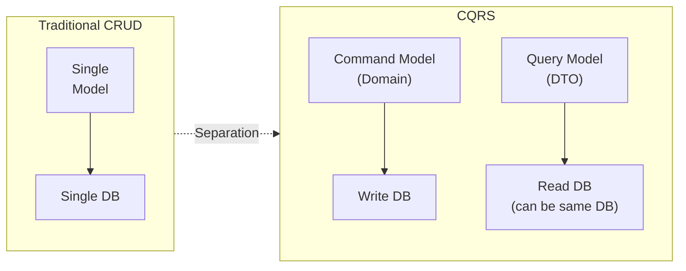
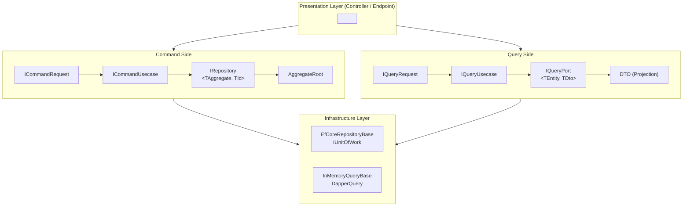
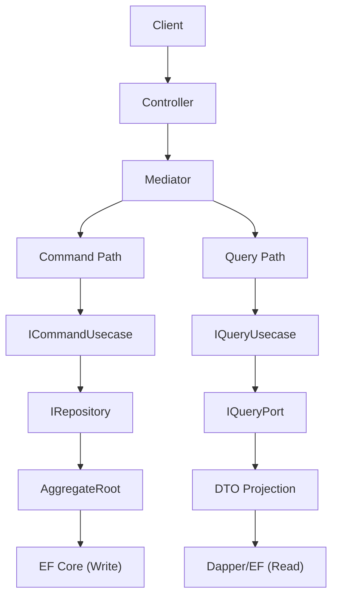

## Overview

What happens when read-only properties and write logic are mixed together in a single `Order` class? Adding properties to improve query performance undermines domain invariants, and strengthening domain logic slows down query responses. Reads and writes have fundamentally different requirements, and the attempt to satisfy both with a single model is where the problem begins.

CQRS (Command Query Responsibility Segregation) resolves this conflict by **separating at the model level**. This chapter examines the progression from the CQS principle to CQRS architecture, and how Functorium implements this with its type hierarchy.

---

## From CQS to CQRS

### CQS (Command Query Separation)

A principle defined by Bertrand Meyer that separates Commands and Queries at the **method level**:

- **Commands** change state and do not return a value (void)
- **Queries** do not change state and return a value

```csharp
// Method design following the CQS principle
public class ShoppingCart
{
    // Command: changes state, no return value
    public void AddItem(Product product, int quantity) { ... }

    // Query: no state change, returns value
    public decimal GetTotalPrice() { ... }
}
```

CQS makes code easier to read because each method clearly distinguishes whether it is "a change or a query." However, separation at the method level alone cannot solve model bloat and performance conflict problems.

### CQRS (Command Query Responsibility Segregation)

A pattern where Greg Young extended CQS to the **architecture level**. By separating **the models themselves** rather than just methods, you can use domain models for writes and DTOs for reads.



---

## Why Separate Reads and Writes

### Fundamental Differences Between Reads and Writes

Reads and writes differ in model, validation, transactions, performance, and scaling strategy. The following table compares these fundamental differences by category.

| Characteristic | Command (Write) | Query (Read) |
|---------------|-----------------|--------------|
| **Model** | Domain model (Aggregate Root) | DTO (Projection) |
| **Validation** | Domain invariant validation required | Not needed |
| **Transaction** | Required (consistency guarantee) | Not needed (read-only) |
| **Performance** | Consistency first | Speed first |
| **Scaling** | Vertical scaling (Scale Up) | Horizontal scaling (Scale Out) |
| **Frequency** | Relatively low | Relatively high |

### Problems with a Single Model

See what happens when you ignore these differences and put all responsibilities into a single class.

```csharp
// A single Order class bearing all responsibilities
public class Order
{
    // Domain logic needed for writes
    public void AddItem(Product product, int qty) { ... }
    public void Cancel() { ... }
    private void ValidateBusinessRules() { ... }

    // Properties needed for reads
    public string CustomerName { get; set; }      // Join result
    public decimal TotalAmount { get; set; }       // Calculated result
    public int ItemCount { get; set; }             // Aggregated result
    public string StatusDescription { get; set; }  // Display string
}
```

Read-only fields unnecessary for writes pollute the domain model, and read optimizations (joins, aggregations) affect domain logic. Changing one side propagates unnecessary impact to the other, requiring tests on both sides for every change.

---

## Functorium's CQRS Architecture

Functorium implements the CQRS pattern with the following type hierarchy. The Command side persists Aggregate Roots through IRepository, and the Query side returns DTO projections through IQueryPort.



### Command Side: IRepository

Why do we need a write-only interface? To validate domain invariants and persist at the Aggregate Root level, we need a clean CRUD interface free from read concerns (DTO projection, pagination).

```csharp
public interface IRepository<TAggregate, TId>
    where TAggregate : AggregateRoot<TId>
    where TId : struct, IEntityId<TId>
{
    FinT<IO, TAggregate> Create(TAggregate aggregate);
    FinT<IO, TAggregate> GetById(TId id);
    FinT<IO, TAggregate> Update(TAggregate aggregate);
    FinT<IO, int> Delete(TId id);
    // + CreateRange, GetByIds, UpdateRange, DeleteRange
}
```

It persists at the Aggregate Root level, adhering to DDD principles, uses `FinT<IO, T>` returns for functional error handling instead of exceptions, and ensures compile-time type safety through generic constraints.

### Query Side: IQueryPort

Having a separate read-only interface enables Specification-based dynamic search, and there's no need to add methods to the interface when query conditions increase.

```csharp
public interface IQueryPort<TEntity, TDto>
{
    FinT<IO, PagedResult<TDto>> Search(
        Specification<TEntity> spec,
        PageRequest page,
        SortExpression sort);

    FinT<IO, CursorPagedResult<TDto>> SearchByCursor(
        Specification<TEntity> spec,
        CursorPageRequest cursor,
        SortExpression sort);

    IAsyncEnumerable<TDto> Stream(
        Specification<TEntity> spec,
        SortExpression sort,
        CancellationToken cancellationToken = default);
}
```

It composes search conditions with Specification, supports 3 pagination modes (Offset/Cursor/Stream), and optimizes read performance with DTO projection.

The Search, SearchByCursor, and Stream methods of IQueryPort\<TEntity, TDto\> all accept `Specification<TEntity>` as a parameter.
For detailed learning on the Specification pattern, see [Implementing Domain Rules with the Specification Pattern](../../specification-pattern/).

### Usecase Integration: Mediator Pattern

Command and Query Usecases are dispatched through a Mediator. Thanks to this structure, Controllers don't need to care whether a request is a Command or Query -- they simply send the request to the Mediator.

```csharp
// Command Usecase
public interface ICommandRequest<TSuccess> : ICommand<FinResponse<TSuccess>> { }
public interface ICommandUsecase<in TCommand, TSuccess>
    : ICommandHandler<TCommand, FinResponse<TSuccess>>
    where TCommand : ICommandRequest<TSuccess> { }

// Query Usecase
public interface IQueryRequest<TSuccess> : IQuery<FinResponse<TSuccess>> { }
public interface IQueryUsecase<in TQuery, TSuccess>
    : IQueryHandler<TQuery, FinResponse<TSuccess>>
    where TQuery : IQueryRequest<TSuccess> { }
```

### Functional Composition: FinT

Repositories return `FinT<IO, T>`, and Usecases return `FinResponse<T>`. The conversion between the two layers is handled by `ToFinResponse()`.

```csharp
// Repository layer: FinT<IO, T>
FinT<IO, Order> result = repository.GetById(orderId);

// Usecase layer: FinResponse<T>
FinResponse<OrderDto> response = fin.ToFinResponse(order => order.ToDto());
```

---

## Traditional Architecture vs CQRS Comparison

### Traditional Architecture

```
Client -> Controller -> Service -> Repository -> DB
                                      |
                          Single model handles reads/writes
```

### CQRS Architecture

In CQRS, the Mediator routes requests to Command Path and Query Path. Each path can be optimized independently.



---

## Functorium Type Hierarchy

This is the Functorium CQRS type hierarchy used in this tutorial. Each Part implements these types one by one.

```
Domain Entities
├── Entity<TId> (abstract class)
│   └── AggregateRoot<TId> (abstract class)
├── IEntityId<TId> (interface)
├── IDomainEvent (interface)
├── IAuditable / ISoftDeletable (interface)
└── Specification<T> (search criteria)

Command Side (Write)
├── IRepository<TAggregate, TId>
├── InMemoryRepositoryBase
├── EfCoreRepositoryBase
├── IUnitOfWork / IUnitOfWorkTransaction
└── ICommandRequest / ICommandUsecase

Query Side (Read)
├── IQueryPort<TEntity, TDto>
├── InMemoryQueryBase
├── DapperQueryBase
├── PagedResult<T> / CursorPagedResult<T>
└── IQueryRequest / IQueryUsecase

Functional Types
├── FinT<IO, T> (Repository return type)
├── FinResponse<T> (Usecase return type)
└── ToFinResponse() (Fin -> FinResponse conversion)
```

---

## Learning Flow of This Tutorial

```
Part 1: Domain Entity Foundations
├── Entity<TId> and IEntityId implementation
├── AggregateRoot<TId> and domain invariants
├── IDomainEvent for domain events
└── IAuditable, ISoftDeletable interfaces

Part 2: Command Side -- Repository Pattern
├── IRepository interface design
├── InMemory Repository implementation
├── EF Core Repository implementation
└── Unit of Work pattern

Part 3: Query Side -- Read-Only Patterns
├── IQueryPort interface design
├── Command DTO vs Query DTO separation
├── Offset/Cursor/Stream pagination
├── InMemory Query adapter
└── Dapper Query adapter

Part 4: CQRS Usecase Integration
├── Command/Query Usecase implementation
├── FinT -> FinResponse conversion
├── Domain event flow
└── Transaction pipeline

Part 5: Domain-Specific Practical Examples
├── Order management CQRS
├── Customer management + Specification
├── Inventory management + Soft Delete
└── Catalog search + pagination comparison
```

---

## FAQ

### Q1: What is the difference between CQS and CQRS?
**A**: CQS (Command Query Separation) is a principle that separates state changes and value returns at the **method level**. CQRS (Command Query Responsibility Segregation) extends this to the **architecture level**, separating write models (domain models) and read models (DTOs).

### Q2: Can Command and Query use the same database in CQRS?
**A**: Yes. CQRS is about **model separation**, not enforcing physical DB separation. You can use domain models through `IRepository` and DTO projections through `IQueryPort` on the same DB. You can later separate a read-only DB based on performance needs.

### Q3: Why is the Mediator pattern needed?
**A**: The Mediator allows Controllers to dispatch requests without distinguishing whether they are Commands or Queries. It also provides extension points for automatically applying cross-cutting concerns (transactions, logging, etc.) as Pipelines, like `UsecaseTransactionPipeline`.

### Q4: How do `FinResponse<T>` and `FinT<IO, T>` differ?
**A**: `FinT<IO, T>` is a lazy monadic type used at the Repository layer, requiring `Run().RunAsync()` to obtain results. `FinResponse<T>` is an HTTP-friendly wrapper passed from the Usecase layer to the API. The `ToFinResponse()` extension method handles the conversion between them.

---

In this chapter, we examined the overall structure of the CQRS pattern. However, we haven't yet covered the domain model that forms the foundation of this architecture. Are two products with the same name the same product? In Part 1, starting with Entity Identity, we implement the domain entities that form the basis of CQRS.

-> [Chapter 1: Entity and Identity](../Part1-Domain-Entity-Foundations/01-Entity-And-Identity/)
