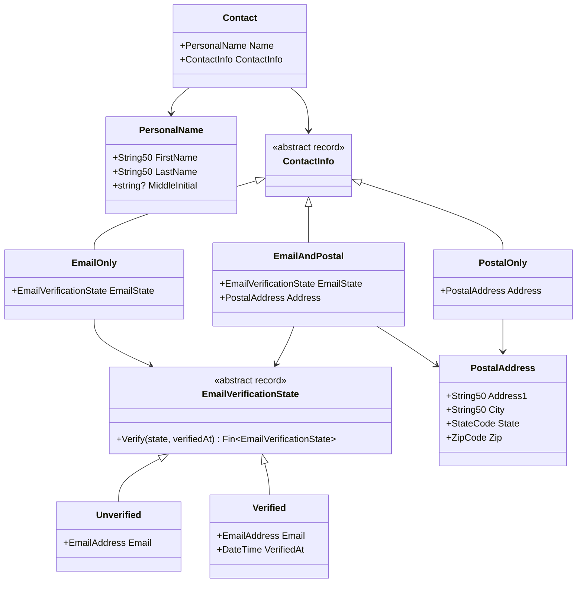

## 설계 의사결정에서 C# 구현으로

앞서 도출한 불변식 기반 설계 의사결정을 C# 타입 패턴으로 매핑합니다.

| 설계 의사결정 | C# 구현 패턴 | 적용 |
|-------------|-------------|------|
| 생성 시 검증 + 불변 | `SimpleValueObject<T>` + `Validate` 체인 | String50, EmailAddress, StateCode, ZipCode |
| 원자적 그룹화 | `sealed record` + `required` 속성 | PersonalName, PostalAddress |
| 허용 조합만 표현 | `abstract record` + sealed 케이스 (Discriminated Union) | ContactInfo |
| 상태 분리 + 전이 함수 | `abstract record` + `Fin<T>` 반환 전이 메서드 | EmailVerificationState |

## 단일 값 불변식 → 제약된 타입

각 값 객체는 `SimpleValueObject<T>`를 상속하고, `Validate` 메서드에서 검증 규칙을 체이닝합니다. 팩토리 메서드 `Create`는 검증 실패 시 생성을 거부합니다.

| 타입 | 검증 규칙 |
|------|----------|
| `String50` | `NotEmpty` → `MaxLength(50)` |
| `EmailAddress` | `NotEmpty` → `Matches(이메일 정규식)` |
| `StateCode` | `NotEmpty` → `Matches(^[A-Z]{2}$)` |
| `ZipCode` | `NotEmpty` → `Matches(^\d{5}$)` |

```csharp
// String50 예시 — 다른 값 객체도 동일한 구조
public sealed class String50 : SimpleValueObject<string>
{
    private String50(string value) : base(value) { }

    public static Fin<String50> Create(string value) =>
        CreateFromValidation(Validate(value), v => new String50(v));

    public static Validation<Error, string> Validate(string value) =>
        ValidationRules<String50>.NotEmpty(value)
            .ThenMaxLength(50);
}
```

private 생성자로 `new`를 차단하고, `Create` 팩토리만 노출합니다. `Fin<T>`가 성공/실패를 표현하므로 예외 없이 실패를 처리할 수 있습니다.

## 구조 불변식 → sealed record 합성

### 원자적 그룹화

```csharp
public sealed record PersonalName
{
    public required String50 FirstName { get; init; }
    public required String50 LastName { get; init; }
    public string? MiddleInitial { get; init; }
}

public sealed record PostalAddress
{
    public required String50 Address1 { get; init; }
    public required String50 City { get; init; }
    public required StateCode State { get; init; }
    public required ZipCode Zip { get; init; }
}
```

`required` 키워드가 필수 필드 누락을 컴파일 타임에 방지합니다. 각 필드가 이미 제약된 타입이므로 추가 검증이 불필요합니다.

### Discriminated Union

```csharp
public abstract record ContactInfo
{
    public sealed record EmailOnly(EmailVerificationState EmailState) : ContactInfo;
    public sealed record PostalOnly(PostalAddress Address) : ContactInfo;
    public sealed record EmailAndPostal(EmailVerificationState EmailState, PostalAddress Address) : ContactInfo;
    private ContactInfo() { }
}
```

`abstract record` + `private` 생성자로 외부에서 새 케이스를 추가할 수 없습니다. 세 케이스 중 하나만 선택 가능하며, "연락 수단 없음" 케이스가 없으므로 빈 연락처가 구조적으로 불가능합니다.

## 상태 전이 불변식 → 상태별 union + 전이 함수

```csharp
public abstract record EmailVerificationState
{
    public sealed record Unverified(EmailAddress Email) : EmailVerificationState;
    public sealed record Verified(EmailAddress Email, DateTime VerifiedAt) : EmailVerificationState;
    private EmailVerificationState() { }

    public static Fin<EmailVerificationState> Verify(
        EmailVerificationState state, DateTime verifiedAt) => state switch
    {
        Unverified u => new Verified(u.Email, verifiedAt),
        Verified => Fin.Fail<EmailVerificationState>(
            DomainError.For<EmailVerificationState>(
                new DomainErrorType.InvalidTransition(
                    FromState: "Verified", ToState: "Verified"),
                state.ToString()!,
                "이미 인증된 이메일입니다")),
        _ => throw new InvalidOperationException()
    };
}
```

`Verify` 전이 함수가 `switch` 식으로 현재 상태를 판별합니다. `Unverified`에서만 `Verified`로 전이하고, 이미 `Verified`면 `DomainError`를 반환합니다. 되돌림(Verified → Unverified)에 해당하는 전이 함수가 아예 없으므로 단방향 전이가 구조적으로 강제됩니다.

## 최종 타입 구조



## 나이브 필드 → 최종 타입 추적표

| 나이브 필드 | 단일 값 불변식 | 구조 불변식 | 상태 전이 불변식 | 최종 위치 |
|------------|-------------|-----------|---------------|----------|
| `string FirstName` | String50 | — | — | `PersonalName.FirstName` |
| `string MiddleInitial` | — | — | — | `PersonalName.MiddleInitial` |
| `string LastName` | String50 | — | — | `PersonalName.LastName` |
| `string EmailAddress` | EmailAddress | ContactInfo union 내 | EmailVerificationState 내 | `ContactInfo.*.EmailVerificationState.*.EmailAddress` |
| `bool IsEmailVerified` | — | union으로 제거 | EmailVerificationState union | `EmailVerificationState.Verified` 존재 여부 |
| `string Address1` | String50 | ContactInfo union 내 | — | `ContactInfo.*.PostalAddress.Address1` |
| `string City` | String50 | ContactInfo union 내 | — | `ContactInfo.*.PostalAddress.City` |
| `string State` | StateCode | ContactInfo union 내 | — | `ContactInfo.*.PostalAddress.State` |
| `string Zip` | ZipCode | ContactInfo union 내 | — | `ContactInfo.*.PostalAddress.Zip` |
