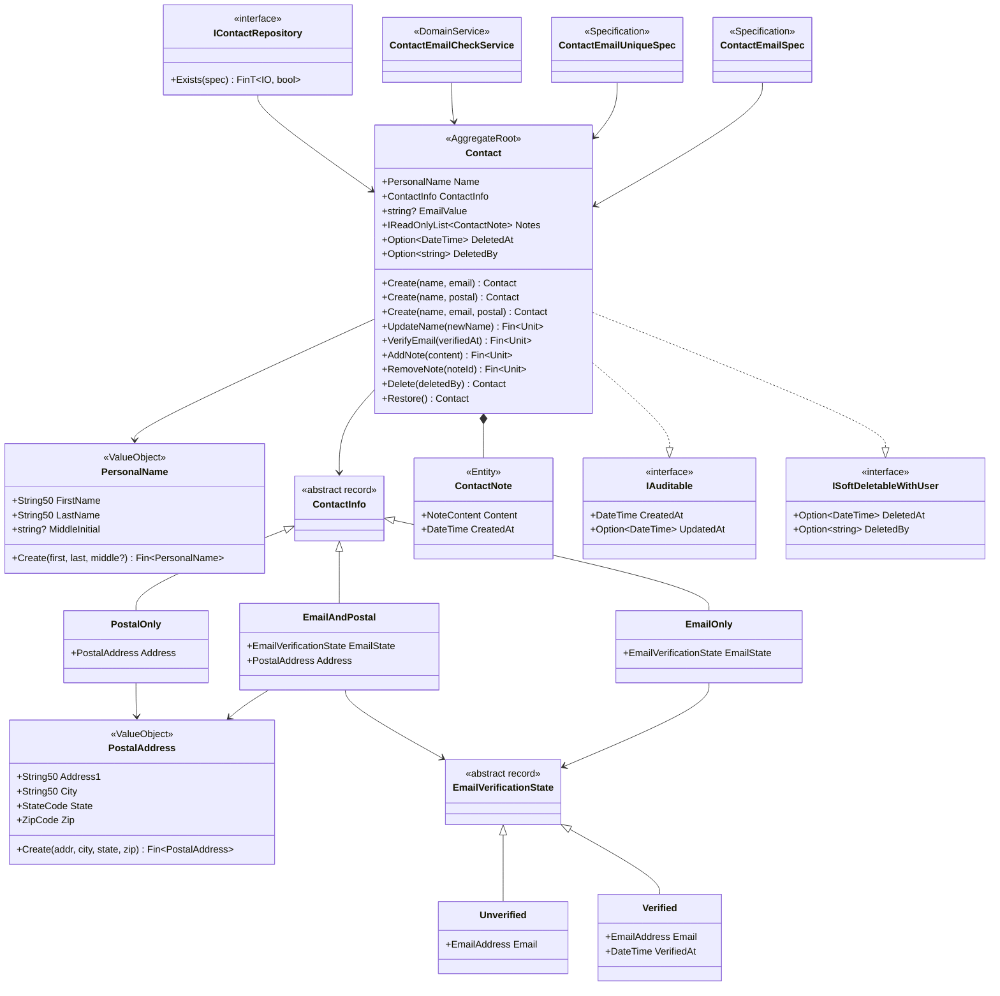

04-DDD-Contact의 기본 DDD 패턴 위에 실무 패턴을 추가한 확장 버전입니다.

## 04 대비 변경점

| 영역 | 04-DDD-Contact | 05-DDD-Contact-Ext |
|------|---------------|-------------------|
| 단일 VO 입력 | `string` | `string?` + `NotNull` + `ThenNormalize` |
| 복합 VO 기반 | `sealed record` | `sealed class : ValueObject` |
| 자식 엔티티 | 없음 | `ContactNote : Entity<ContactNoteId>` |
| Collection 관리 | 없음 | `AddNote`/`RemoveNote` (멱등) |
| Soft Delete | 없음 | `ISoftDeletableWithUser` + `Delete`/`Restore` |
| Specification | 없음 | `ExpressionSpecification<Contact>` |
| Domain Service | 없음 | `ContactEmailCheckService : IDomainService` |
| Repository | 없음 | `IContactRepository : IRepository<Contact, ContactId>` |
| 투영 속성 | 없음 | `EmailValue` (Specification 지원) |

## 복합 VO 명시화

04에서 `PersonalName`과 `PostalAddress`는 `sealed record`로 구현됩니다. 이 방식은 간결하지만 Functorium VO 계층에 참여하지 않습니다. `String50`, `EmailAddress` 등 단일 VO가 모두 `SimpleValueObject<string>`을 상속하는데, 복합 VO만 plain record로 남으면 일관성이 떨어집니다.

05에서는 `ValueObject` 추상 클래스를 상속하여 VO 계층에 명시적으로 참여합니다.

### 변경 전 (04 패턴)

```csharp
public sealed record PersonalName
{
    public required String50 FirstName { get; init; }
    public required String50 LastName { get; init; }
    public string? MiddleInitial { get; init; }
    private PersonalName() { }
}
```

### 변경 후 (05 패턴)

```csharp
public sealed class PersonalName : ValueObject
{
    public String50 FirstName { get; }
    public String50 LastName { get; }
    public string? MiddleInitial { get; }

    private PersonalName(String50 firstName, String50 lastName, string? middleInitial)
    {
        FirstName = firstName;
        LastName = lastName;
        MiddleInitial = middleInitial;
    }

    protected override IEnumerable<object> GetEqualityComponents()
    {
        yield return FirstName;
        yield return LastName;
        if (MiddleInitial is not null)
            yield return MiddleInitial;
    }

    public static Fin<PersonalName> Create(
        string? firstName, string? lastName, string? middleInitial = null)
    {
        return from first in String50.Create(firstName)
               from last in String50.Create(lastName)
               select new PersonalName(first, last, middleInitial);
    }

    public static PersonalName CreateFromValidated(
        String50 firstName, String50 lastName, string? middleInitial = null) =>
        new(firstName, lastName, middleInitial);
}
```

**핵심 차이점은:**

| 항목 | `sealed record` (04) | `sealed class : ValueObject` (05) |
|------|---------------------|----------------------------------|
| 동등성 | 컴파일러 자동 생성 | `GetEqualityComponents()` 명시 구현 |
| 불변성 | `required init` | private 생성자 + `{ get; }` |
| VO 계층 | 참여하지 않음 | `AbstractValueObject` 계층 참여 |
| ORM 호환 | 프록시 미지원 | 프록시 타입 자동 처리 |
| 해시코드 | 컴파일러 생성 | 캐시된 해시코드 |

`ContactInfo`와 `EmailVerificationState`는 Discriminated Union(abstract record + sealed 케이스)이므로 변경하지 않습니다. `ValueObject` 클래스 상속 시 record의 패턴 매칭과 구조적 동등성을 잃기 때문입니다.

## 향상된 VO 검증

04에서는 `string` 입력을 받지만, 05에서는 `string?`을 받고 `NotNull` → `ThenNormalize` 체인을 사용합니다.

```csharp
// 04 패턴: NotEmpty부터 시작
public static Validation<Error, string> Validate(string value) =>
    ValidationRules<String50>.NotEmpty(value)
        .ThenMaxLength(50);

// 05 패턴: null 처리 + 정규화
public static Validation<Error, string> Validate(string? value) =>
    ValidationRules<String50>
        .NotNull(value)        // null 체크 먼저
        .ThenNotEmpty()
        .ThenMaxLength(MaxLength)
        .ThenNormalize(v => v.Trim());  // 공백 정규화
```

`EmailAddress`는 추가로 소문자 정규화를 적용합니다: `.ThenNormalize(v => v.Trim().ToLowerInvariant())`.

## 자식 엔티티

`ContactNote`는 `Contact` Aggregate 내부의 자식 엔티티입니다. 독립적 ID를 가지지만 Aggregate 경계를 벗어나지 않습니다.

```csharp
[GenerateEntityId]
public sealed class ContactNote : Entity<ContactNoteId>
{
    public NoteContent Content { get; private set; }
    public DateTime CreatedAt { get; private set; }

    private ContactNote(ContactNoteId id, NoteContent content) : base(id)
    {
        Content = content;
        CreatedAt = DateTime.UtcNow;
    }

    public static ContactNote Create(NoteContent content) =>
        new(ContactNoteId.New(), content);
}
```

`NoteContent`는 `SimpleValueObject<string>`을 상속한 VO로, 최대 500자 제약과 Trim 정규화를 적용합니다.

## Collection Management

Aggregate Root가 자식 엔티티 컬렉션을 관리합니다. 외부에서는 `IReadOnlyList`만 노출됩니다.

```csharp
// 내부 가변 리스트 + 외부 읽기 전용 뷰
private readonly List<ContactNote> _notes = [];
public IReadOnlyList<ContactNote> Notes => _notes.AsReadOnly();

// 추가: 삭제된 Contact에는 추가 불가
public Fin<Unit> AddNote(NoteContent content)
{
    if (DeletedAt.IsSome)
        return DomainError.For<Contact>(new AlreadyDeleted(), ...);

    var note = ContactNote.Create(content);
    _notes.Add(note);
    UpdatedAt = DateTime.UtcNow;
    AddDomainEvent(new NoteAddedEvent(Id, note.Id, content));
    return unit;
}

// 제거: 삭제된 Contact에서는 불가, 존재하지 않는 ID는 멱등
public Fin<Unit> RemoveNote(ContactNoteId noteId)
{
    if (DeletedAt.IsSome)
        return DomainError.For<Contact>(new AlreadyDeleted(), ...);

    var note = _notes.FirstOrDefault(n => n.Id == noteId);
    if (note is null) return unit;

    _notes.Remove(note);
    UpdatedAt = DateTime.UtcNow;
    AddDomainEvent(new NoteRemovedEvent(Id, noteId));
    return unit;
}
```

## Soft Delete

`ISoftDeletableWithUser` 인터페이스를 구현하여 논리 삭제와 삭제자 추적을 지원합니다.

```csharp
public Option<DateTime> DeletedAt { get; private set; }
public Option<string> DeletedBy { get; private set; }

// 삭제 (멱등: 이미 삭제된 경우 이벤트 없음)
public Contact Delete(string deletedBy)
{
    if (DeletedAt.IsSome) return this;

    DeletedAt = DateTime.UtcNow;
    DeletedBy = deletedBy;
    AddDomainEvent(new DeletedEvent(Id, deletedBy));
    return this;
}

// 복원 (멱등: 이미 활성인 경우 이벤트 없음)
public Contact Restore()
{
    if (DeletedAt.IsNone) return this;

    DeletedAt = Option<DateTime>.None;
    DeletedBy = Option<string>.None;
    AddDomainEvent(new RestoredEvent(Id));
    return this;
}
```

삭제된 Contact에 `UpdateName`, `AddNote`, `RemoveNote`, `VerifyEmail`을 시도하면 `AlreadyDeleted` 오류를 반환합니다.

## Aggregate 메서드 반환 타입 설계

Aggregate 행위 메서드는 두 가지 반환 타입 패턴을 사용합니다:

| 메서드 | 반환 타입 | 설명 |
|--------|-----------|------|
| `UpdateName`, `VerifyEmail`, `AddNote`, `RemoveNote` | `Fin<Unit>` | 삭제된 Contact에서는 `AlreadyDeleted` 오류 반환 |
| `Delete`, `Restore` | `Contact` | 항상 멱등, fluent chaining 지원 |

`Fin<Unit>` 메서드는 Aggregate 상태를 변경하는 비즈니스 연산으로, 삭제 상태에서의 조작을 도메인 규칙으로 차단합니다. `RemoveNote`는 존재하지 않는 Note에 대해서는 멱등(성공 반환)이지만, 삭제된 Contact에서는 실패합니다.

`Delete`/`Restore`는 상태 자체를 전환하므로 별도의 `DeletedAt` 타임스탬프로 관리하며, 이미 해당 상태인 경우 변경 없이 자신을 반환합니다(멱등).

## Specification

`ExpressionSpecification<T>` 기반 쿼리 사양으로, EF Core 등 ORM에서 `Expression<Func<T, bool>>`으로 변환할 수 있습니다.

```csharp
// 이메일로 Contact 검색
public sealed class ContactEmailSpec : ExpressionSpecification<Contact>
{
    public EmailAddress Email { get; }
    public ContactEmailSpec(EmailAddress email) => Email = email;

    public override Expression<Func<Contact, bool>> ToExpression()
    {
        string emailStr = Email;
        return contact => contact.EmailValue == emailStr;
    }
}
```

`ContactEmailUniqueSpec`은 자기 자신을 제외한 이메일 고유성 검사를 지원합니다. `ExcludeId`를 지정하면 업데이트 시 자기 자신을 제외하고 검사합니다.

`EmailValue`는 Contact의 투영 속성으로, `ContactInfo` union 내부의 이메일을 flat한 `string?`으로 노출하여 Specification이 Expression Tree에서 사용할 수 있게 합니다.

## Domain Service

`ContactEmailCheckService`는 이메일 고유성 검증 도메인 서비스입니다. Application Layer에서 Repository로 기존 Contact 목록을 조회한 뒤 호출합니다.

```csharp
public sealed class ContactEmailCheckService : IDomainService
{
    public Fin<Unit> ValidateEmailUnique(
        EmailAddress email,
        Seq<Contact> existingContacts,
        Option<ContactId> excludeId = default)
    {
        var isDuplicate = existingContacts
            .Filter(c => excludeId.Match(id => c.Id != id, () => true))
            .Any(c => c.EmailValue == (string)email);

        if (isDuplicate)
            return DomainError.For<ContactEmailCheckService>(
                new EmailAlreadyInUse(), (string)email,
                "Email is already in use by another contact");

        return unit;
    }
}
```

## Repository Interface

```csharp
public interface IContactRepository : IRepository<Contact, ContactId>
{
    FinT<IO, bool> Exists(Specification<Contact> spec);
}
```

`IRepository<T, TId>` 기본 CRUD에 `Exists` 메서드를 추가하여 Specification 기반 존재 여부 확인을 지원합니다.

## 클래스 다이어그램



## 요약

| 패턴 | 타입 | 역할 |
|------|------|------|
| 단일 VO | `String50`, `EmailAddress`, `StateCode`, `ZipCode`, `NoteContent` | `SimpleValueObject<string>` 상속, 검증 + 정규화 |
| 복합 VO | `PersonalName`, `PostalAddress` | `ValueObject` 상속, `GetEqualityComponents` 구현 |
| Discriminated Union | `ContactInfo`, `EmailVerificationState` | `abstract record` + sealed 케이스 |
| 자식 엔티티 | `ContactNote` | `Entity<ContactNoteId>`, Aggregate 내부 |
| Aggregate Root | `Contact` | `AggregateRoot<ContactId>`, 도메인 이벤트, 행위 메서드 |
| Specification | `ContactEmailSpec`, `ContactEmailUniqueSpec` | `ExpressionSpecification<Contact>`, 쿼리 사양 |
| Domain Service | `ContactEmailCheckService` | `IDomainService`, 이메일 고유성 검증 |
| Repository | `IContactRepository` | `IRepository<Contact, ContactId>`, Specification 기반 조회 |
