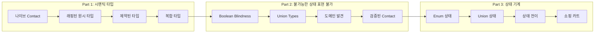

## 개요

Scott Wlaschin의 F# "Designing with Types" 시리즈를 Functorium 기반 C# 14 / .NET 10으로 재구성한 튜토리얼입니다. 타입 구조를 **설계하는 이유(WHEN/WHY)**에 집중하며, Contact 도메인의 점진적 진화를 통해 type-driven design을 체험합니다.

## functional-valueobject와의 관계

[함수형 값 객체 구현](../functional-valueobject/) 튜토리얼이 값 객체를 **만드는 법(HOW)**을 다룬다면, 이 튜토리얼은 타입 구조를 **설계하는 이유(WHEN/WHY)**에 집중합니다.

| | 함수형 값 객체 구현 | 타입으로 도메인 설계하기 |
|---|---|---|
| **초점** | 값 객체 구현 패턴 | 타입 주도 도메인 설계 |
| **핵심 질문** | "어떻게 안전한 타입을 만드는가?" | "왜 이 타입 구조가 필요한가?" |
| **다루는 패턴** | SimpleValueObject, Validation | Union types, State machines |
| **도메인** | 다양한 예제 (Email, Money 등) | Contact 도메인의 점진적 진화 |

## 학습 로드맵

## 튜토리얼 구성

| Part | 제목 | 내용 | 코드 프로젝트 |
|:---:|------|------|:---:|
| 0 | 소개 | 철학, 도메인 소개, 환경 설정 | — |
| 1 | 시맨틱 타입 | 원시 타입에서 의미 있는 타입으로 | 8개 |
| 2 | 불가능한 상태 표현 불가 | Union types로 불법 상태 제거 | 8개 |
| 3 | 상태 기계 | 타입으로 워크플로 강제 | 8개 |
| 4 | 결론 | 비즈니스 요구사항, 타입 설계 의사결정, 코드 설계, Before/After 비교, 다음 단계 | 2개 |

## 사전 지식

- C# 기본 문법 (record, sealed, pattern matching)
- [함수형 값 객체 구현](../functional-valueobject/) 튜토리얼의 `Fin<T>`, `Validation` 기초
