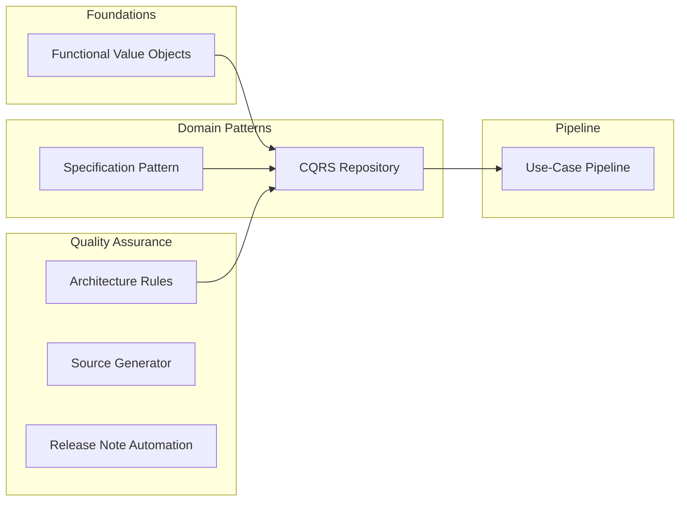

## Introduction

The moment `string email = "not-an-email"` compiles without any warning, the type system has failed to protect your business rules. Every time a new method like `GetByName`, `GetByStatus`, or `GetByNameAndStatus` is added to a Repository, the boundary between reads and writes blurs. Generic variance constraints on sealed structs block pipeline design, and repetitive observability code in every adapter breeds omissions and inconsistencies.

Functorium tutorials are hands-on learning experiences where you directly see how each of these **technical constraints** leads to a specific **architectural decision**. You will understand the context in which each constraint arose, follow the rationale behind each decision, and implement the solution step by step.

**Relationship with the Guides:** If the [Guides](../guides/) cover **design principles** along the "WHY -> WHAT -> HOW" axis, then the tutorials start from the **concrete problem situations** that gave birth to those principles and walk you through the resolution process step by step.

## From Technical Constraints to Architectural Decisions

Each tutorial starts from a real technical constraint encountered during the development of Functorium.

### Foundations: The Type System

Primitive types like `string` and `int` cannot express business rules. Any string can be assigned to an email address, negative numbers are allowed for monetary amounts, and the compiler does nothing to prevent this. **Functional value objects** enforce validation at creation time and guarantee immutability and value equality, creating types where "invalid values simply cannot exist."

### Domain Patterns

When business rules are scattered across service layers, controllers, and queries, every change requires modifying multiple files. The **Specification pattern** encapsulates rules as independent objects that can be composed with logical operators and reused.

When Repository methods keep growing, every change in read requirements forces modifications to the interface itself. **CQRS Repositories** separate the responsibilities of writes (Commands) and reads (Queries), enabling each to scale independently.

### Pipeline

C#'s sealed structs are subject to generic covariance/contravariance constraints on interfaces, which makes it impossible to unify them into a single response type within a Mediator pipeline. The **use-case pipeline** works around this constraint using a response interface hierarchy and the CRTP pattern, allowing Commands and Queries to be processed through a single pipeline.

### Quality Assurance

When code review feedback like "this class should not be in the Domain layer" keeps recurring, relying on human attention has its limits. **Architecture rule tests** automate the verification of layer dependencies, naming conventions, and immutability rules through automated tests.

When logging, metrics, and tracing code is manually written for every adapter, omissions and format inconsistencies are inevitable. **Source Generator observability** automatically generates observability code at compile time, ensuring consistency.

Manually writing release notes leads to missed commits and format inconsistencies. **Release note automation** analyzes commit history to generate consistent release notes.

### Summary

| Technical Constraint | Architectural Decision | Tutorial | Project Count |
|---------------------|----------------------|----------|---------------|
| Primitive types cannot express business rules | Functional Value Objects | [Implementing Functional Value Objects](./functional-valueobject/) | 89 |
| Business rules scattered across the codebase | Specification Pattern | [Specification Pattern](./specification-pattern/) | 40 |
| Repository method explosion, mixed reads/writes | CQRS Repository | [CQRS Repository Pattern](./cqrs-repository/) | 46 |
| Generic variance constraints on sealed structs | Use-Case Pipeline | [Use-Case Pipeline Constraints](./usecase-pipeline/) | 43 |
| Manual verification limits for layer rule violations | Architecture Rule Tests | [Architecture Rule Tests](./architecture-rules/) | 32 |
| Repetitive hand-written adapter observability code | Source Generator | [Source Generator Observability](./sourcegen-observability/) | 74 |
| Manual release note authoring | Release Note Automation | [Release Note Automation](./release-notes-claude/) | — |

## Learning Roadmap

**Recommended order:** Progress through Functional Value Objects, Specification Pattern, CQRS Repository, and then Use-Case Pipeline in sequence -- each concept builds the foundation for the next tutorial.

**Independent entry points:** Architecture Rule Tests, Source Generator Observability, and Release Note Automation do not depend on other tutorials and can be studied independently.

## Connections Between Tutorials

Concepts and patterns created in each tutorial are reused across other tutorials.

- **Value Objects -> CQRS Repository:** Type-safe domain entities built with functional value objects are applied to the CQRS Aggregate Root.
- **Specification Pattern -> CQRS Repository:** Specification objects are integrated as query parameters in CQRS, enabling dynamic filtering.
- **CQRS -> Use-Case Pipeline:** Command/Query use cases are combined with transactions and caching through the pipeline constraint pattern.
- **Architecture Rules -> All Projects:** Layer dependencies and naming conventions are verified at the meta level, ensuring structural consistency across all tutorials.
- **Source Generator -> Adapter Layer:** Compile-time code generation automates observability boilerplate in adapters.

## Guides vs. Tutorials

| | Guides | Tutorials |
|---|---|---|
| **Perspective** | Design principles (WHY -> WHAT -> HOW) | Problem-solving process (Constraint -> Decision -> Implementation) |
| **Format** | Reference documentation | Step-by-step hands-on labs |
| **Structure** | 23 topic-based documents | 7 independent courses, 320+ projects total |

If you are curious about the background of a design principle, start with WHY in the [Guides](../guides/). If you prefer learning by solving real problems, start from the constraints in the tutorials.
