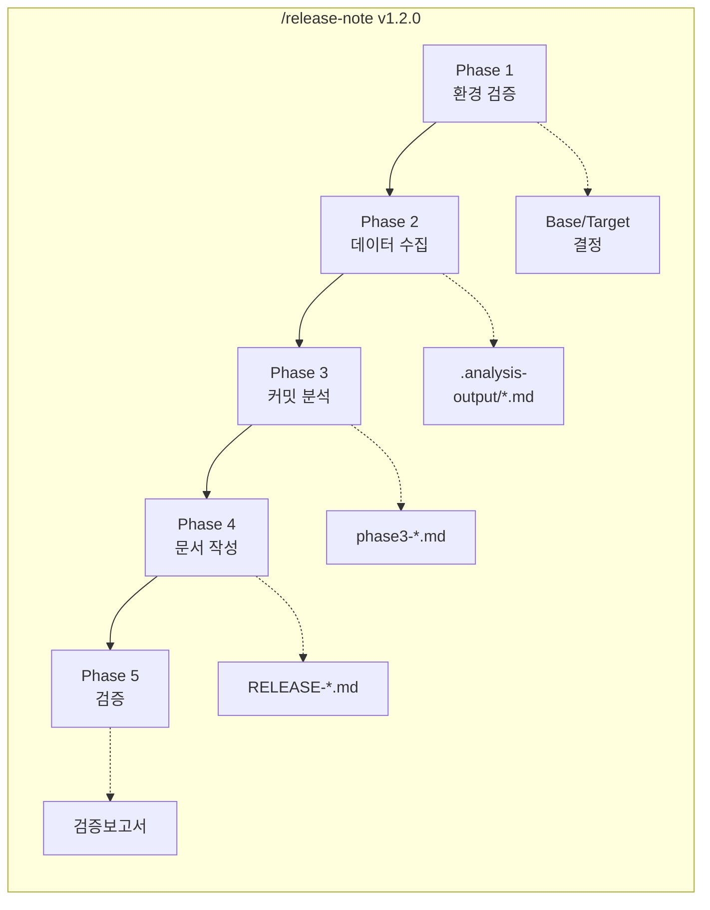
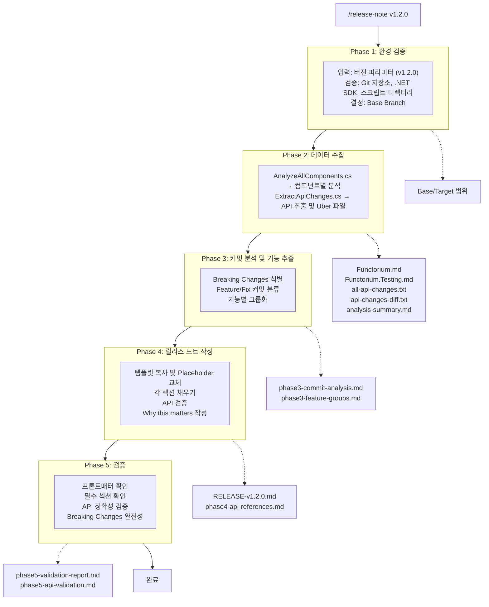

`/release-note v1.2.0`을 입력하는 순간, 자동화 워크플로우가 시작됩니다. 이 명령 하나로 환경 검증부터 최종 품질 확인까지, 5개의 Phase가 순차적으로 실행되어 완성된 릴리스 노트를 생성합니다.

## 5-Phase 워크플로우



각 Phase가 하는 일을 간략히 살펴보겠습니다.

| Phase | 목표 | 입력 | 출력 | 담당 |
|-------|------|------|------|------|
| **1** | 환경 검증 | 버전 파라미터 | Base/Target 결정 | Claude |
| **2** | 데이터 수집 | Base/Target | 분석 파일 (.md) | C# 스크립트 |
| **3** | 커밋 분석 | 분석 파일 | 기능 그룹화 | Claude |
| **4** | 문서 작성 | 기능 그룹화 | 릴리스 노트 | Claude |
| **5** | 검증 | 릴리스 노트 | 검증 보고서 | Claude |

**Phase 1에서는** Git 저장소, .NET SDK, 스크립트 디렉터리 등 필수 환경을 확인하고, 이전 릴리스 브랜치를 기준으로 비교 범위(Base/Target)를 결정합니다. 약 10초면 끝나는 빠른 단계이지만, 여기서 실패하면 전체 프로세스가 중단됩니다.

**Phase 2에서는** C# 스크립트 두 개가 실행됩니다. `AnalyzeAllComponents.cs`가 컴포넌트별 커밋 히스토리를 수집하고, `ExtractApiChanges.cs`가 프로젝트를 빌드하여 Public API를 추출합니다. 30초에서 2분 정도 소요되며, 이후 모든 분석의 원천 데이터가 이 단계에서 만들어집니다.

**Phase 3에서는** 수집된 원시 데이터를 의미 있는 정보로 변환합니다. 커밋 메시지와 API Diff를 분석하여 Breaking Changes를 식별하고, 관련 커밋들을 기능 단위로 그룹화합니다. 1~3분 소요됩니다.

**Phase 4는** 가장 시간이 많이 걸리는 단계(5~15분)로, 분석 결과를 바탕으로 실제 릴리스 노트 문서를 작성합니다. 템플릿을 기반으로 각 섹션을 채우고, 모든 코드 샘플을 Uber 파일로 검증합니다.

**Phase 5에서는** 완성된 릴리스 노트의 API 정확성, Breaking Changes 완전성, 구조적 품질을 최종 검증합니다. 1~3분이면 완료되며, 검증 보고서가 함께 생성됩니다.

전체 소요 시간은 약 8~25분입니다. 기존 수동 작성 시 2~3시간이 걸리던 것에 비해 **약 85%가 단축됩니다.**

## 데이터 흐름 상세

아래 다이어그램은 각 Phase에서 어떤 데이터가 생성되고, 다음 Phase로 어떻게 전달되는지 보여줍니다. 각 Phase는 이전 Phase의 출력에 의존하므로, 중간에 하나라도 실패하면 이후 단계는 진행할 수 없습니다.



## 파일 생성 흐름

워크플로우 실행 전후로 디렉터리 구조가 어떻게 변하는지 살펴보겠습니다. 기존 `TEMPLATE.md`와 스크립트는 그대로 유지되고, 새로운 분석 결과물과 최종 릴리스 노트가 추가됩니다.

```txt
실행 전                          실행 후
───────                          ──────

.release-notes/                  .release-notes/
├── TEMPLATE.md                  ├── TEMPLATE.md
└── scripts/                     ├── RELEASE-v1.2.0.md ← 새로 생성
    ├── *.cs                     └── scripts/
    └── docs/                        ├── *.cs
        └── *.md                     ├── docs/
                                     │   └── *.md
                                     └── .analysis-output/ ← 새로 생성
                                         ├── Functorium.md
                                         ├── Functorium.Testing.md
                                         ├── analysis-summary.md
                                         ├── api-changes-build-current/
                                         │   ├── all-api-changes.txt
                                         │   └── api-changes-diff.txt
                                         └── work/
                                             ├── phase3-commit-analysis.md
                                             ├── phase3-feature-groups.md
                                             ├── phase4-api-references.md
                                             ├── phase5-validation-report.md
                                             └── phase5-api-validation.md
```

## 오류 발생 시 동작

Phase 1~3에서 오류가 발생하면 전체 프로세스가 즉시 중단됩니다. Phase 1은 Git 저장소나 .NET SDK가 없을 때, Phase 2는 스크립트 실행이나 빌드가 실패할 때, Phase 3는 분석 파일이 없을 때 중단됩니다.

Phase 4와 5는 다소 다르게 동작합니다. Phase 4에서 템플릿이 없거나 API 검증이 실패하면 불완전한 릴리스 노트가 생성되고, Phase 5에서 검증 기준에 미달하면 문제점이 검증 보고서에 기록됩니다. 이 경우 문서를 수정한 뒤 검증을 다시 실행할 수 있습니다.

## 핵심 원칙

이 워크플로우를 관통하는 세 가지 원칙이 있습니다.

**정확성 우선으로,** 모든 API는 Uber 파일(`all-api-changes.txt`)에서 검증합니다. Phase 4에서 한 번, Phase 5에서 다시 한 번 교차 검증하여 존재하지 않는 API가 문서에 포함되는 것을 방지합니다.

**추적성을 위해** 모든 결과물에 출처를 명시합니다. 커밋 SHA 주석, 중간 결과 파일 저장, 검증 보고서 생성을 통해 릴리스 노트의 모든 내용이 실제 코드 변경으로 추적 가능합니다.

**모듈화를 통해** 각 Phase를 독립적인 문서로 정의합니다. 마스터 문서(`release-note.md`)가 전체 흐름을 관장하고, 각 Phase 상세 문서가 구체적인 실행 방법을 담고 있어 유지보수와 확장이 용이합니다.

## FAQ

### Q1: 5-Phase 워크플로우의 전체 소요 시간은 얼마나 되나요?
**A**: 약 8~25분입니다. Phase 1(환경 검증)은 10초, Phase 2(데이터 수집)는 30초~2분, Phase 3(커밋 분석)은 1~3분, Phase 4(문서 작성)는 5~15분, Phase 5(검증)는 1~3분 정도 소요됩니다. 기존 수동 작성 대비 **약 85%가 단축됩니다.**

### Q2: Phase 중간에 오류가 발생하면 전체를 처음부터 다시 실행해야 하나요?
**A**: Phase 1~3에서 오류가 발생하면 프로세스가 즉시 중단되므로, 원인을 해결한 뒤 다시 실행해야 합니다. 단, Phase 2에서 생성된 분석 파일은 `.analysis-output/`에 남아 있으므로 Phase 2만 재실행할 수 있습니다. Phase 4~5는 불완전한 결과가 생성된 후 수정 및 재검증이 가능합니다.

### Q3: 각 Phase의 입출력이 명시된 이유는 무엇인가요?
**A**: 각 Phase가 이전 Phase의 출력에 의존하는 **파이프라인 구조이기** 때문입니다. 입출력을 명시하면 Phase 간 데이터 흐름이 명확해지고, 문제 발생 시 어느 Phase의 출력이 잘못되었는지 빠르게 진단할 수 있습니다. 중간 결과 파일이 디버깅 도구 역할을 합니다.

이제 각 Phase의 상세 내용을 하나씩 살펴보겠습니다. [Phase 1: 환경 검증](01-phase1-setup.md)부터 시작합니다.
