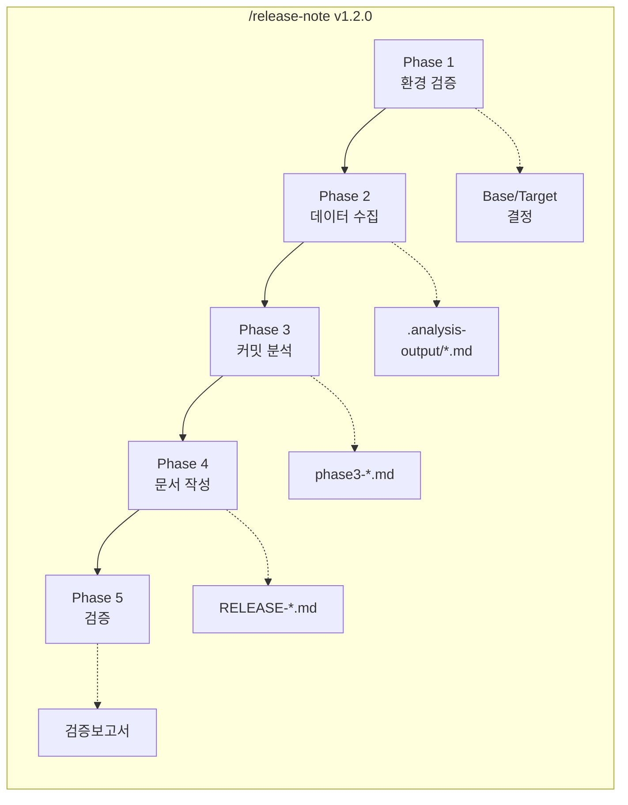
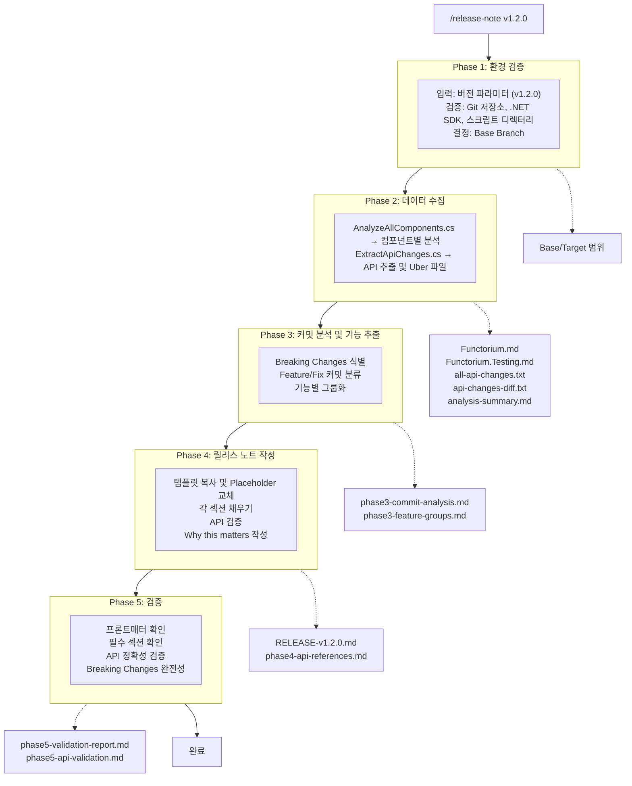

> 릴리스 노트 자동화는 5개의 Phase로 구성된 워크플로우를 따릅니다. 이 절에서는 전체 프로세스의 흐름과 각 Phase 간의 관계를 살펴봅니다.

---

## 5-Phase 워크플로우



---

## Phase별 요약

| Phase | 목표 | 입력 | 출력 | 담당 |
|-------|------|------|------|------|
| **1** | 환경 검증 | 버전 파라미터 | Base/Target 결정 | Claude |
| **2** | 데이터 수집 | Base/Target | 분석 파일 (.md) | C# 스크립트 |
| **3** | 커밋 분석 | 분석 파일 | 기능 그룹화 | Claude |
| **4** | 문서 작성 | 기능 그룹화 | 릴리스 노트 | Claude |
| **5** | 검증 | 릴리스 노트 | 검증 보고서 | Claude |

---

## 데이터 흐름 상세



---

## 파일 생성 흐름

```txt
실행 전                          실행 후
───────                          ──────

.release-notes/                  .release-notes/
├── TEMPLATE.md                  ├── TEMPLATE.md
└── scripts/                     ├── RELEASE-v1.2.0.md ← 새로 생성
    ├── *.cs                     └── scripts/
    └── docs/                        ├── *.cs
        └── *.md                     ├── docs/
                                     │   └── *.md
                                     └── .analysis-output/ ← 새로 생성
                                         ├── Functorium.md
                                         ├── Functorium.Testing.md
                                         ├── analysis-summary.md
                                         ├── api-changes-build-current/
                                         │   ├── all-api-changes.txt
                                         │   └── api-changes-diff.txt
                                         └── work/
                                             ├── phase3-commit-analysis.md
                                             ├── phase3-feature-groups.md
                                             ├── phase4-api-references.md
                                             ├── phase5-validation-report.md
                                             └── phase5-api-validation.md
```

---

## Phase 간 의존성

```txt
Phase 1 ──────────────────────────────────────────────────────────▶
          │
          │ Base/Target 범위 전달
          ▼
        Phase 2 ─────────────────────────────────────────────────▶
                  │
                  │ 분석 파일 전달
                  ▼
                Phase 3 ───────────────────────────────────────▶
                          │
                          │ 기능 그룹화 결과 전달
                          ▼
                        Phase 4 ─────────────────────────────▶
                                  │
                                  │ 릴리스 노트 전달
                                  ▼
                                Phase 5 ──────────────────▶
                                          │
                                          │ 검증 완료
                                          ▼
                                        완료
```

**각 Phase는 이전 Phase의 출력에 의존합니다.**

---

## 오류 발생 시 흐름

```txt
Phase 1 실패:
├── 원인: Git 저장소 없음, .NET SDK 없음
└── 결과: 전체 프로세스 중단

Phase 2 실패:
├── 원인: 스크립트 실행 오류, 빌드 실패
└── 결과: 전체 프로세스 중단

Phase 3 실패:
├── 원인: 분석 파일 없음
└── 결과: 전체 프로세스 중단

Phase 4 실패:
├── 원인: 템플릿 없음, API 검증 실패
└── 결과: 불완전한 릴리스 노트 생성

Phase 5 실패:
├── 원인: 검증 기준 미달
└── 결과: 검증 보고서에 문제점 기록
```

---

## 시간 소요 예상

| Phase | 예상 시간 | 주요 작업 |
|-------|----------|----------|
| Phase 1 | ~10초 | 환경 검증 |
| Phase 2 | 30초~2분 | C# 스크립트 실행 |
| Phase 3 | 1~3분 | 커밋 분석 및 분류 |
| Phase 4 | 5~15분 | 문서 작성 |
| Phase 5 | 1~3분 | 검증 |
| **총합** | **약 8~25분** | |

기존 수동 작성 시 2-3시간 소요 대비 **약 85% 단축**

---

## 핵심 원칙 요약

### 1. 정확성 우선

```txt
모든 API는 Uber 파일(all-api-changes.txt)에서 검증
├── Phase 4에서 API 검증
└── Phase 5에서 재검증
```

### 2. 추적성

```txt
모든 결과물에 출처 명시
├── 커밋 SHA 주석
├── 중간 결과 파일 저장
└── 검증 보고서 생성
```

### 3. 모듈화

```txt
각 Phase는 독립적인 문서로 정의
├── release-note.md (마스터)
├── phase1-setup.md (상세)
├── phase2-collection.md (상세)
└── ...
```

---

## 다음 단계

각 Phase의 상세 내용을 살펴봅니다:

- [4.1 Phase 1: 환경 검증](01-phase1-setup.md)
- [4.2 Phase 2: 데이터 수집](02-phase2-collection.md)
- [4.3 Phase 3: 커밋 분석](03-phase3-analysis.md)
- [4.4 Phase 4: 문서 작성](04-phase4-writing.md)
- [4.5 Phase 5: 검증](05-phase5-validation.md)
