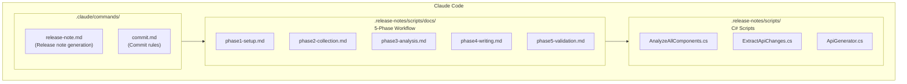
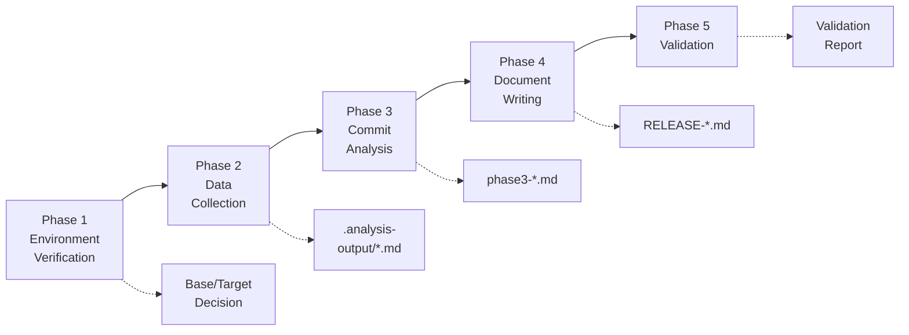
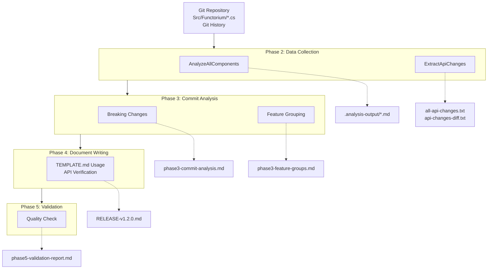

In the previous section, we examined the necessity of release note automation. Now let's draw the big picture of how the Functorium project's automation system actually works.

---

## System Architecture

The automation system has a layered structure connecting three core components. When a user runs `/release-note v1.2.0` in Claude Code, the command invokes the workflow, and the workflow executes the C# scripts.



Let's look at each component one by one.

---

## Claude Code Custom Commands

Claude Code is an AI-powered CLI tool. Through custom commands, complex tasks can be executed with a single command.

### release-note.md

This file is the **master document** for release note generation. It contains version parameter validation (`/release-note v1.2.0`), the 5-Phase workflow definition, success criteria for each Phase, and the final output format definition.

**Usage examples:**
```bash
/release-note v1.2.0        # Regular release
/release-note v1.0.0        # First deployment
/release-note v1.2.0-beta.1 # Pre-release
```

### commit.md

This defines commit message rules to maintain a consistent commit history. It manages commit types such as `feat` (new feature), `fix` (bug fix), `docs` (documentation change), `refactor` (code refactoring), `test` (adding/modifying tests), and `chore` (build, configuration changes) in Conventional Commits format. This consistent commit history is necessary for Phase 3 to automatically classify commits.

---

## 5-Phase Workflow

Release note generation proceeds through a 5-step pipeline. Each step has clear inputs, outputs, and success criteria, so when a problem occurs, you can immediately identify which step is blocked.



Let's briefly look at what each Phase does.

**Phase 1: Environment Verification** checks the prerequisites before generating release notes. It verifies whether the Git repository, .NET 10.x SDK, and script directory exist, and automatically determines the Base Branch for comparison. If the `origin/release/1.0` branch exists, it is used as the Base; otherwise, the initial commit is used as the Base for a first deployment.

**Phase 2: Data Collection** executes C# scripts to collect raw data. `AnalyzeAllComponents.cs` collects per-component changes, and `ExtractApiChanges.cs` extracts the Public API. Results are stored in the `.analysis-output/` folder as per-component analysis results (`.md`), the complete API listing (`all-api-changes.txt`), and API change diff (`api-changes-diff.txt`).

**Phase 3: Commit Analysis** extracts content for the release notes from the collected data. It identifies Breaking Changes through Git diff analysis (commit message patterns serve as a supplementary method) and classifies Feature and Bug Fix commits, grouping them by feature. Intermediate results are stored in the `.analysis-output/work/` folder.

**Phase 4: Document Writing** generates the actual release notes based on the analysis results. It copies `TEMPLATE.md`, replaces placeholders, fills in each section, and verifies all APIs against the Uber file. The key rule is that every major feature must include a "Why this matters" section.

**Phase 5: Validation** performs a final quality check on the generated release notes. It verifies frontmatter existence, inclusion of required sections, "Why this matters" sections, API accuracy (cross-referencing the Uber file), and Breaking Changes completeness.

---

## C# Scripts

These are scripts written using .NET 10's file-based app feature. They can be run directly as single `.cs` files without project files (`.csproj`).

### AnalyzeAllComponents.cs

Analyzes changes across all components. It collects commits between Base and Target, calculates file change statistics, and classifies commits by type.

```bash
dotnet AnalyzeAllComponents.cs --base origin/release/1.0 --target HEAD
```

**Output example:**
```markdown
# Analysis for Src/Functorium

## Change Summary
37 files changed, 3167 insertions(+)

## All Commits
51533b1 refactor(observability): Improve observability abstraction and structure
4683281 feat(linq): Add TraverseSerial method
...

## Categorized Commits
### Feature Commits
- 4683281 feat(linq): Add TraverseSerial method
### Breaking Changes
None found
```

### ExtractApiChanges.cs

Extracts Public APIs and generates the Uber file. This Uber file (`all-api-changes.txt`) serves as the reference material in Phase 4 for verifying whether APIs documented in the release notes actually exist.

```bash
dotnet ExtractApiChanges.cs
```

**Output example (all-api-changes.txt):**
```csharp
namespace Functorium.Abstractions.Errors
{
    public static class ErrorCodeFactory
    {
        public static Error Create(string errorCode, string errorCurrentValue, string errorMessage) { }
        public static Error CreateFromException(string errorCode, Exception exception) { }
    }
}
```

---

## Data Flow

Visualizing how the components we have examined so far exchange data, the overall flow looks like this. Data originating from the Git repository is progressively refined through each Phase, ultimately producing a validated release note document.



---

## Core Principles

This automation system follows four principles. These are not mere rules, but principles that each originated from real problems.

### Accuracy First

> **Never document an API that is not in the Uber file.**

AI-generated text may include APIs that do not exist. By verifying all APIs against the `all-api-changes.txt` file extracted from actual code, we fundamentally prevent incorrect information from appearing in the release notes.

### Mandatory Value Communication

> **Include a "Why this matters" section for all major features.**

"We added a TraverseSerial method" alone does not tell users why they should use the feature. Release notes only deliver true value when they also explain what problem it solves, how it improves developer productivity, and how it enhances code quality.

### Automatic Breaking Changes Detection

> **Git Diff analysis takes priority over commit message patterns.**

Even if a commit message does not include "breaking", the API may actually have been deleted or its signature changed. The primary method is analyzing Git diffs in the `.api` folder, with commit message patterns used as a supplementary method.

### Traceability

> **Track all features to actual commits.**

All features documented in the release notes include commit SHA annotations and, where possible, GitHub issue/PR links. It must always be possible to trace "when and why this feature was added."

## FAQ

### Q1: Can specific Phases be re-run in the 5-Phase pipeline?
**A**: The `/release-note` command runs the entire pipeline, but Phase 2's C# scripts (`AnalyzeAllComponents.cs`, `ExtractApiChanges.cs`) can be run independently. Since Phases 3-5 are performed by Claude, if intermediate result files (`.analysis-output/work/`) remain, you can request resuming from that Phase.

### Q2: What exactly is an Uber file, and why is it called the "single source of truth"?
**A**: The Uber file (`all-api-changes.txt`) is a file that combines the Public APIs of all assemblies into one. Since it is extracted directly from compiled DLLs, it reflects **the actual build output** rather than source code. Every API documented in the release notes must exist in this file, fundamentally preventing the mistake of documenting non-existent APIs.

### Q3: Why does Git Diff analysis take priority over commit message patterns in Breaking Changes detection?
**A**: Commit messages are intentionally written by developers, so the `!` notation may be omitted. In contrast, Git Diff of the `.api` folder **objectively** detects deleted or signature-changed APIs. Both methods are used in parallel, but Git Diff is the primary method and commit messages are the supplementary method.

---

So far we have examined the overall architecture and data flow of the automation system. The next section introduces the actual files and folder structure that make up this system.

[0.3 Project Structure Introduction](03-project-structure.md)
